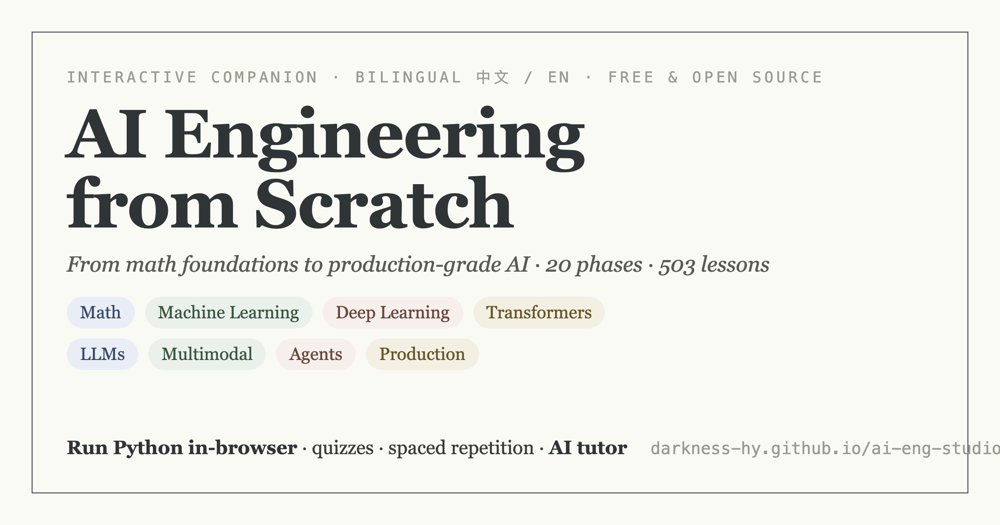
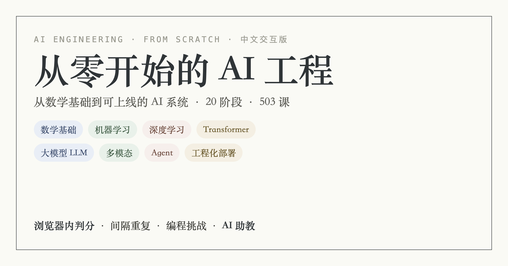

<div align="center">

# AI Engineering Studio · 从零开始的 AI 工程

**The Chinese-first, fully interactive companion to [`ai-engineering-from-scratch`](https://github.com/rohitg00/ai-engineering-from-scratch).**
Read the lessons, run the Python in your browser, take the quizzes, and ask an AI tutor that *knows the lesson you're on* — 503 lessons across 20 phases, from backprop to agent loops.

### → **[Open the live site](https://darkness-hy.github.io/ai-eng-studio/)** ←



</div>

---

## What it is

`ai-engineering-from-scratch` is a wonderful MIT-licensed curriculum that teaches you to *build* the machine, not just call the API. **AI Engineering Studio** turns it into an interactive, Chinese-first learning site:

- 📖 **Fully bilingual** — every lesson in both Chinese and English, switch language with one click; mermaid diagrams, multi-language code tabs (shiki), scroll-spy TOC.
- ✅ **Quiz loop** — warm-up → lesson → check, instant grading + explanations, scored into your progress.
- 🧪 **In-browser Python** — run stdlib/numpy lesson code with one click (Pyodide, lazy-loaded). No setup.
- 🔬 **Mini explainers** — drag vectors to see dot products, tune the learning rate to watch gradient descent converge/diverge, real QKᵀ/√d attention heatmaps, train a BPE tokenizer live, step a Think→Act→Observe agent loop.
- 🎯 **Placement test** — "find your level" → a 20-phase personalized path; spaced-repetition review of missed questions + glossary flashcards.
- 🤖 **AI tutor** — an optional floating tutor that's fed the *current lesson* as context, so it answers about *this* lesson, not in the abstract.
- 👩‍🏫 **Classes** — teachers assign lessons and track a cohort's progress; completion certificates; ⌘K search; cross-device sync.

All of it is a **static SPA** (no backend required) — deploys to GitHub Pages for free. Accounts/sync/admin are an *optional* Supabase layer.

> 中文说明见下方 [中文 ↓](#中文)

## Quick start

```bash
npm install
npm run build:content   # compile lesson data from ../ai-engineering-from-scratch
npm run dev             # http://localhost:5180
npm run build           # static output in dist/
```

> `scripts/build-content.mjs` reads the sibling upstream repo `../ai-engineering-from-scratch/`. Clone it next to this one first.

## Tech

Vite · React 19 · TypeScript · Tailwind CSS 4 — static SPA, no backend. Markdown via react-markdown + remark-gfm, syntax highlighting via shiki, diagrams via mermaid, Python via Pyodide (CDN). Optional Supabase (Postgres + Auth + RLS) for accounts, cross-device sync, and an admin dashboard.

## Credits & License

- **Course content** © [ai-engineering-from-scratch](https://github.com/rohitg00/ai-engineering-from-scratch) — MIT License, Rohit Ghumare. This project is an independent Chinese interactive companion and is **not affiliated with** the upstream author.
- **This site's code and the Chinese translations** are released under the **MIT License** (see [LICENSE](LICENSE)).

If this helped you learn, a ⭐ helps others find it.

---

<a name="中文"></a>

## 中文

把开源课程 [`ai-engineering-from-scratch`](https://github.com/rohitg00/ai-engineering-from-scratch)（503 课 / 20 阶段 / 338 套测验,MIT)做成**中英双语、可交互**的学习站:课文中英双语、一键切换语言、**浏览器内一键跑 Python**、课前课后测验即时判分、定级测试 + 个性化路线、间隔重复复习 + 术语闪卡、若干微型交互实验(向量游乐场 / 梯度下降实验台 / 注意力热力图 / BPE 分词器 / Agent 循环)、教师班级管理、结业证书、⌘K 搜索、多设备同步,以及一个**懂你当前这一课**的 AI 助教浮窗。纯静态 SPA、免费部署在 GitHub Pages;账号/同步/后台是可选的 Supabase 层。

**在线体验:https://darkness-hy.github.io/ai-eng-studio/**



### 翻译

译文放在 `content/zh/`(不污染上游,方便上游 `git pull` 更新):`<phase>/titles.json`、`<lesson>.md`、`<lesson>.quiz.json`、`glossary.json`。翻一批后重跑 `npm run build:content` 即生效;未译课程自动回退英文并标记「翻译制作中」。

### 账户与同步(可选,Supabase)

不配置则纯本地运行(localStorage)。配置后获得邮箱登录、多设备同步、管理员后台(`/admin`):
1. 在 [supabase.com](https://supabase.com) 建免费项目,SQL Editor 依次执行 `supabase/*.sql`(`schema.sql` 起,后续 `00x-*.sql` 为增量)。
2. 把 Project URL 与 anon key 写入 `.env.local`(见 `.env.example`),重新构建部署。
3. 管理员邮箱白名单在 `supabase/schema.sql` 的 `handle_new_user()` 里配置(自行替换为你自己的邮箱);**生产环境请保持邮箱验证开启**。

同步策略 local-first:界面始终即时读写本地,登录时与云端按字段合并,离线照常用。
