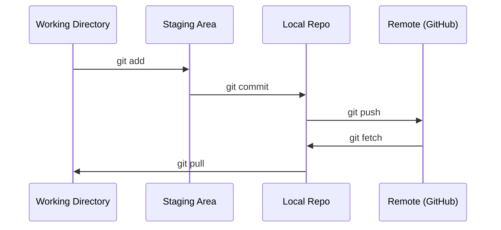

# Git 与协作

> 版本控制不是可选项。你在这里构建的每一个实验、每一个模型、每一节课，都要被跟踪记录。

**Type:** Learn
**Languages:** --
**Prerequisites:** Phase 0, Lesson 01
**Time:** ~30 minutes

## 学习目标

- 配置 git 身份信息，掌握 add、commit、push 的日常工作流
- 创建并合并分支，在不破坏 main 的前提下隔离实验
- 编写 `.gitignore`，排除模型检查点（checkpoint）和大型二进制文件
- 使用 `git log` 浏览提交历史，理解项目的演进过程

## 问题背景

接下来的 20 个阶段里，你会写下数百个代码文件。没有版本控制，你会丢失工作成果、搞坏无法撤销的东西，也没有办法与他人协作。

Git 是工具，GitHub 是代码存放的地方。这节课只讲本课程需要的内容，不多不少。

## 核心概念



记住三件事：
1. 勤保存（`git commit`）
2. 推送到远程（`git push`）
3. 用分支做实验（`git checkout -b experiment`）

## 从零实现

### 第 1 步：配置 git

```bash
git config --global user.name "Your Name"
git config --global user.email "you@example.com"
```

### 第 2 步：日常工作流

```bash
git status
git add file.py
git commit -m "Add perceptron implementation"
git push origin main
```

### 第 3 步：用分支做实验

```bash
git checkout -b experiment/new-optimizer

# ... make changes, commit ...

git checkout main
git merge experiment/new-optimizer
```

### 第 4 步：在本课程仓库中工作

```bash
git clone https://github.com/rohitg00/ai-engineering-from-scratch.git
cd ai-engineering-from-scratch

git checkout -b my-progress
# work through lessons, commit your code
git push origin my-progress
```

## 生产实践

对于本课程，你只需要以下这些命令：

| 命令 | 使用时机 |
|---------|------|
| `git clone` | 获取课程仓库 |
| `git add` + `git commit` | 保存你的工作 |
| `git push` | 备份到 GitHub |
| `git checkout -b` | 尝试新东西而不破坏 main |
| `git log --oneline` | 查看你做过的事 |

就这些。本课程不需要 rebase、cherry-pick 或 submodule。

## 练习

1. 克隆本仓库，创建一个名为 `my-progress` 的分支，新建一个文件，提交并推送
2. 编写一个 `.gitignore`，排除模型检查点文件（`.pt`、`.pth`、`.safetensors`）
3. 用 `git log --oneline` 查看本仓库的提交历史，看看各节课是如何逐步加入的

## 关键术语

| 术语 | 人们常说的 | 实际含义 |
|------|----------------|----------------------|
| 提交（Commit） | “保存” | 项目在某个时间点的完整快照 |
| 分支（Branch） | “一份副本” | 指向某次提交的指针，会随着你的工作不断前移 |
| 合并（Merge） | “把代码合到一起” | 把一个分支上的修改应用到另一个分支 |
| 远程（Remote） | “云端” | 托管在别处的仓库副本（GitHub、GitLab） |
