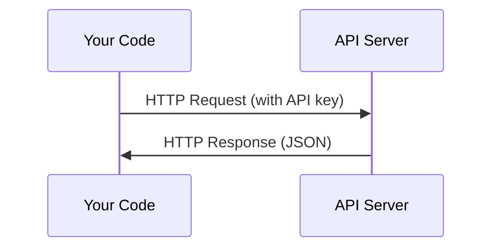

# API 与密钥

> 所有 AI API 的工作方式都一样：发送请求，获得响应。细节会变，模式不变。

**Type:** Build
**Languages:** Python, TypeScript
**Prerequisites:** Phase 0, Lesson 01
**Time:** ~30 minutes

## 学习目标

- 使用环境变量和 `.env` 文件安全地存储 API 密钥
- 分别用 Anthropic Python SDK 和原始 HTTP 两种方式调用 LLM API
- 对比 SDK 与原始 HTTP 的请求/响应格式，便于调试
- 识别并处理常见的 API 错误，包括认证错误和速率限制

## 问题背景

从 Phase 11 开始，你会调用各家 LLM API（Anthropic、OpenAI、Google）。在 Phase 13-16 中，你会构建在循环中调用这些 API 的智能体（agent）。你需要了解 API 密钥的工作原理、如何安全地保存它们，以及如何发起你的第一次 API 调用。

## 核心概念



每次 API 调用都包含：
1. 一个端点（URL）
2. 一个 API 密钥（用于认证）
3. 一个请求体（你想要什么）
4. 一个响应体（你得到什么）

## 从零实现

### 第 1 步：安全地存储 API 密钥

永远不要把 API 密钥写进代码。请使用环境变量。

```bash
export ANTHROPIC_API_KEY="sk-ant-..."
export OPENAI_API_KEY="sk-..."
```

或者使用 `.env` 文件（记得把它加入 `.gitignore`）：

```
ANTHROPIC_API_KEY=sk-ant-...
OPENAI_API_KEY=sk-...
```

### 第 2 步：第一次 API 调用（Python）

```python
import anthropic

client = anthropic.Anthropic()

response = client.messages.create(
    model="claude-sonnet-4-20250514",
    max_tokens=256,
    messages=[{"role": "user", "content": "What is a neural network in one sentence?"}]
)

print(response.content[0].text)
```

### 第 3 步：第一次 API 调用（TypeScript）

```typescript
import Anthropic from "@anthropic-ai/sdk";

const client = new Anthropic();

const response = await client.messages.create({
  model: "claude-sonnet-4-20250514",
  max_tokens: 256,
  messages: [{ role: "user", content: "What is a neural network in one sentence?" }],
});

console.log(response.content[0].text);
```

### 第 4 步：原始 HTTP（不用 SDK）

```python
import os
import urllib.request
import json

url = "https://api.anthropic.com/v1/messages"
headers = {
    "Content-Type": "application/json",
    "x-api-key": os.environ["ANTHROPIC_API_KEY"],
    "anthropic-version": "2023-06-01",
}
body = json.dumps({
    "model": "claude-sonnet-4-20250514",
    "max_tokens": 256,
    "messages": [{"role": "user", "content": "What is a neural network in one sentence?"}],
}).encode()

req = urllib.request.Request(url, data=body, headers=headers, method="POST")
with urllib.request.urlopen(req) as resp:
    result = json.loads(resp.read())
    print(result["content"][0]["text"])
```

这就是 SDK 在底层做的事情。理解原始 HTTP 调用对调试很有帮助。

## 生产实践

本课程会用到：

| API | 何时需要 | 免费额度 |
|-----|-----------------|-----------|
| Anthropic (Claude) | Phase 11-16（智能体、工具） | 注册赠送 $5 额度 |
| OpenAI | Phase 11（对比实验） | 注册赠送 $5 额度 |
| Hugging Face | Phase 4-10（模型、数据集） | 免费 |

现在不必全部办齐。等课程需要时再去配置即可。

## 交付产物

本课产出：
- `outputs/prompt-api-troubleshooter.md` - 诊断常见 API 错误

## 练习

1. 获取一个 Anthropic API 密钥，并完成你的第一次 API 调用
2. 尝试原始 HTTP 版本，并与 SDK 版本的响应格式做对比
3. 故意使用一个错误的 API 密钥，仔细阅读返回的错误信息

## 关键术语

| 术语 | 人们怎么说 | 实际含义 |
|------|----------------|----------------------|
| API 密钥（API key） | “API 的密码” | 一个唯一字符串，用于标识你的账户并授权请求 |
| 速率限制（Rate limit） | “我被限流了” | 每分钟/每小时的最大请求数，用于防止滥用并保证公平使用 |
| Token | “一个词”（在 API 语境下） | 计费单位：输入和输出 token 分别计数、分别计费 |
| 流式输出（Streaming） | “实时响应” | 逐字逐句地接收响应，而不是等待完整响应生成完毕 |
