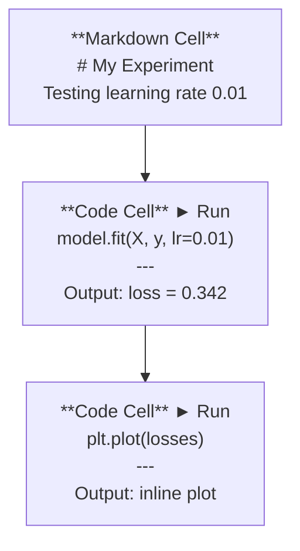
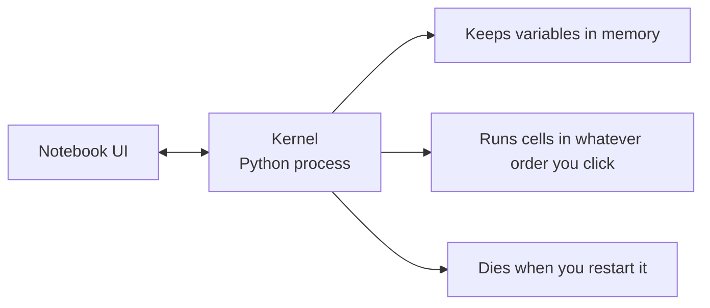

# Jupyter Notebook

> Notebook 是 AI 工程的实验台。你在这里做原型验证，再把有效的代码搬进生产环境。

**Type:** Build
**Languages:** Python
**Prerequisites:** Phase 0, Lesson 01
**Time:** ~30 minutes

## 学习目标

- 安装并启动 JupyterLab、Jupyter Notebook，或装有 Jupyter 扩展的 VS Code
- 使用魔法命令（`%timeit`、`%%time`、`%matplotlib inline`）进行基准测试和内联可视化
- 区分什么时候用 notebook、什么时候用脚本，并实践「在 notebook 里探索，用脚本交付」的工作流
- 识别并避开常见的 notebook 陷阱：乱序执行、隐藏状态和内存泄漏

## 问题背景

每一篇 AI 论文、每一个教程、每一场 Kaggle 竞赛都在用 Jupyter notebook。它让你分段运行代码、内联查看输出、把代码和说明混排在一起、快速迭代。如果你想不用 notebook 来学 AI，就像做数学作业不打草稿。

但 notebook 也有实实在在的坑。很多人拿它做所有事情，包括那些它根本不擅长的事。知道什么时候该用 notebook、什么时候该用脚本，能让你以后少经历很多调试噩梦。

## 核心概念

一个 notebook 就是一串单元格（cell）。每个单元格要么是代码，要么是文本。



内核（kernel）是一个在后台运行的 Python 进程。你运行某个单元格时，notebook 会把代码发给内核，内核执行后把结果传回来。所有单元格共享同一个内核，所以变量会在单元格之间保留。



「你点哪个就运行哪个」这个特性，既是超能力，也是会打到自己脚的枪。

## 从零实现

### 第 1 步：选择你的界面

三种选择，同一种格式：

| 界面 | 安装方式 | 适合场景 |
|-----------|---------|----------|
| JupyterLab | `pip install jupyterlab` 然后 `jupyter lab` | 完整的 IDE 体验，多标签页、文件浏览器、终端 |
| Jupyter Notebook | `pip install notebook` 然后 `jupyter notebook` | 简单轻量，一次打开一个 notebook |
| VS Code | 安装 "Jupyter" 扩展 | 直接在你的编辑器里用，带 git 集成和调试功能 |

三者读写的都是同一种 `.ipynb` 文件。喜欢哪个就用哪个。AI 工作中最常用的是 JupyterLab。

```bash
pip install jupyterlab
jupyter lab
```

### 第 2 步：值得记住的快捷键

你会在两种模式之间切换。按 `Escape` 进入命令模式（左侧蓝色条），按 `Enter` 进入编辑模式（绿色条）。

**命令模式（最常用）：**

| 按键 | 操作 |
|-----|--------|
| `Shift+Enter` | 运行单元格并移动到下一个 |
| `A` | 在上方插入单元格 |
| `B` | 在下方插入单元格 |
| `DD` | 删除单元格 |
| `M` | 转换为 markdown |
| `Y` | 转换为代码 |
| `Z` | 撤销单元格操作 |
| `Ctrl+Shift+H` | 显示所有快捷键 |

**编辑模式：**

| 按键 | 操作 |
|-----|--------|
| `Tab` | 自动补全 |
| `Shift+Tab` | 显示函数签名 |
| `Ctrl+/` | 切换注释 |

`Shift+Enter` 是你一天会按上千次的快捷键。先把它记住。

### 第 3 步：单元格类型

**代码单元格**运行 Python 并显示输出：

```python
import numpy as np
data = np.random.randn(1000)
data.mean(), data.std()
```

输出：`(0.0032, 0.9987)`

**Markdown 单元格**渲染格式化文本。用它来记录你在做什么、为什么这么做。支持标题、加粗、斜体、LaTeX 数学公式（`$E = mc^2$`）、表格和图片。

### 第 4 步：魔法命令

这些不是 Python 语法，而是 Jupyter 专有的命令，以 `%`（行魔法）或 `%%`（单元格魔法）开头。

**给代码计时：**

```python
%timeit np.random.randn(10000)
```

输出：`45.2 us +/- 1.3 us per loop`

```python
%%time
model.fit(X_train, y_train, epochs=10)
```

输出：`Wall time: 2.34 s`

`%timeit` 会把代码运行很多次然后取平均；`%%time` 只运行一次。微基准测试用 `%timeit`，训练任务用 `%%time`。

**启用内联绘图：**

```python
%matplotlib inline
```

之后每个 `plt.plot()` 或 `plt.show()` 都会直接在 notebook 里渲染。

**不离开 notebook 就安装包：**

```python
!pip install scikit-learn
```

`!` 前缀可以运行任意 shell 命令。

**查看环境变量：**

```python
%env CUDA_VISIBLE_DEVICES
```

### 第 5 步：内联显示富输出

Notebook 会自动显示单元格中最后一个表达式的值。但你也可以主动控制：

```python
import pandas as pd

df = pd.DataFrame({
    "model": ["Linear", "Random Forest", "Neural Net"],
    "accuracy": [0.72, 0.89, 0.94],
    "training_time": [0.1, 2.3, 45.6]
})
df
```

这会渲染出一张格式化的 HTML 表格，而不是一堆纯文本。绘图也一样：

```python
import matplotlib.pyplot as plt

plt.figure(figsize=(8, 4))
plt.plot([1, 2, 3, 4], [1, 4, 2, 3])
plt.title("Inline Plot")
plt.show()
```

图表直接出现在单元格下方。这就是 notebook 能在 AI 工作中占主导地位的原因：数据、图表、代码，你能在同一处看到。

显示图片：

```python
from IPython.display import Image, display
display(Image(filename="architecture.png"))
```

### 第 6 步：Google Colab

Colab 是云端的免费 Jupyter notebook。它提供 GPU、预装好的库，以及 Google Drive 集成。完全不需要配置。

1. 打开 [colab.research.google.com](https://colab.research.google.com)
2. 上传本课程的任意 `.ipynb` 文件
3. Runtime > Change runtime type > T4 GPU（免费）

Colab 与本地 Jupyter 的区别：
- 文件不会跨会话保留（保存到 Drive 或下载到本地）
- 预装库：numpy、pandas、matplotlib、torch、tensorflow、sklearn
- 用 `from google.colab import files` 上传/下载文件
- 用 `from google.colab import drive; drive.mount('/content/drive')` 获得持久化存储
- 闲置 90 分钟后会话超时（免费档）

## 生产实践

### Notebook 还是脚本：什么时候用哪个

| 用 notebook 做 | 用脚本做 |
|-------------------|-----------------|
| 探索数据集 | 训练流水线 |
| 模型原型验证 | 可复用的工具函数 |
| 可视化结果 | 任何带 `if __name__` 的代码 |
| 讲解你的工作 | 定时运行的代码 |
| 快速实验 | 生产代码 |
| 课程练习 | 包和库 |

规则是：**在 notebook 里探索，用脚本交付**。

AI 工作中常见的工作流：
1. 在 notebook 里探索数据
2. 在 notebook 里做模型原型
3. 跑通之后，把代码移到 `.py` 文件
4. 再把这些 `.py` 文件导入回 notebook，继续做后续实验

### 常见陷阱

**乱序执行。** 你先运行单元格 5，再运行单元格 2，又运行单元格 7。这个 notebook 在你的机器上能跑，但别人从头到尾依次运行就会出错。解决办法：分享前先执行 Kernel > Restart & Run All。

**隐藏状态。** 你删掉了一个单元格，但它创建的变量还留在内存里。Notebook 看起来很干净，却依赖着一个「幽灵单元格」。解决办法：定期重启内核。

**内存泄漏。** 加载一个 4GB 数据集，训练一个模型，再加载另一个数据集——什么都没释放。解决办法：用 `del variable_name` 加 `gc.collect()`，或者直接重启内核。

## 交付产物

本课产出：
- `outputs/prompt-notebook-helper.md`，用于调试 notebook 相关问题

## 练习

1. 打开 JupyterLab，新建一个 notebook，用 `%timeit` 对比列表推导式和 numpy 在生成 100,000 个随机数数组时的速度
2. 创建一个同时包含 markdown 和代码单元格的 notebook：加载一个 CSV，显示一个 dataframe，绘制一张图表。然后执行 Kernel > Restart & Run All，验证它能从头到尾顺利运行
3. 把 `code/notebook_tips.py` 里的代码粘贴到一个 Colab notebook 中，用免费 GPU 运行

## 关键术语

| 术语 | 大家怎么说 | 实际含义 |
|------|----------------|----------------------|
| 内核（Kernel） | 「跑我代码的那个东西」 | 一个独立的 Python 进程，负责执行单元格并把变量保留在内存中 |
| 单元格（Cell） | 「一个代码块」 | Notebook 中可独立运行的单元，要么是代码，要么是 markdown |
| 魔法命令（Magic command） | 「Jupyter 小技巧」 | 以 `%` 或 `%%` 开头的特殊命令，用于控制 notebook 环境 |
| `.ipynb` | 「Notebook 文件」 | 一个包含单元格、输出和元数据的 JSON 文件。全称 IPython Notebook |

## 延伸阅读

- [JupyterLab Docs](https://jupyterlab.readthedocs.io/)，完整功能介绍
- [Google Colab FAQ](https://research.google.com/colaboratory/faq.html)，Colab 专属的限制和功能
- [28 Jupyter Notebook Tips](https://www.dataquest.io/blog/jupyter-notebook-tips-tricks-shortcuts/)，进阶快捷操作
