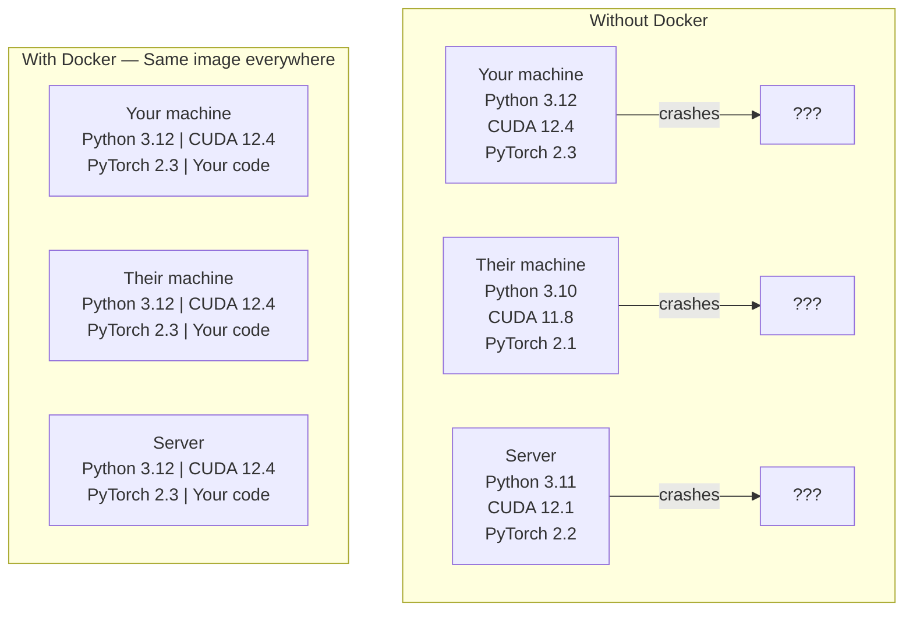

# Docker 与 AI 开发

> 容器让「在我机器上能跑」这句话彻底成为历史。

**Type:** Build
**Languages:** Docker
**Prerequisites:** Phase 0, Lessons 01 and 03
**Time:** ~60 minutes

## 学习目标

- 根据 Dockerfile 构建一个支持 GPU 的 Docker 镜像，内含 CUDA、PyTorch 和各类 AI 库
- 将宿主机目录挂载为卷（volume），让模型、数据集和代码在容器重建后依然保留
- 配置 NVIDIA Container Toolkit，使容器内部能够访问 GPU
- 使用 Docker Compose 编排多服务 AI 应用（推理服务器 + 向量数据库）

## 问题背景

你在自己的笔记本上用 PyTorch 2.3、CUDA 12.4 和 Python 3.12 训练了一个模型。你的同事用的是 PyTorch 2.1、CUDA 11.8 和 Python 3.10。模型在他的机器上直接崩溃。而你的 Dockerfile 在两台机器上都能跑。

AI 项目是依赖管理的噩梦。一套典型的技术栈包括 Python、PyTorch、CUDA 驱动、cuDNN、系统级 C 库，以及像 flash-attn 这种对编译器版本有严格要求的特殊包。Docker 把这一切打包成一个镜像，在任何地方都以完全相同的方式运行。

## 核心概念

Docker 把你的代码、运行时、库和系统工具封装进一个叫容器（container）的隔离单元。可以把它看作轻量级虚拟机，区别在于它共享宿主机操作系统的内核，而不是运行自己的内核，所以启动只需几秒而不是几分钟。



### 为什么 AI 项目比大多数项目更需要 Docker

1. **GPU 驱动很脆弱。** 为 CUDA 12.4 编译的代码无法在 CUDA 11.8 上运行。Docker 把 CUDA 工具链隔离在容器内部，同时通过 NVIDIA Container Toolkit 共享宿主机的 GPU 驱动。

2. **模型权重很大。** 一个 7B 参数的模型在 fp16 精度下有 14 GB。你不会想每次重建镜像都重新下载一遍。Docker 卷可以把宿主机上的模型目录直接挂载进来。

3. **多服务架构很常见。** 一个真实的 AI 应用不只是一个 Python 脚本，而是一个推理服务器、一个用于 RAG 的向量数据库，可能还有一个 Web 前端。Docker Compose 用一条命令就能把它们全部编排起来。

### 关键词汇

| 术语 | 含义 |
|------|---------------|
| 镜像（Image） | 只读模板。相当于你的菜谱。由 Dockerfile 构建而来。 |
| 容器（Container） | 镜像的一个运行实例。相当于你的厨房。 |
| Dockerfile | 构建镜像的指令集。一层接一层地执行。 |
| 卷（Volume） | 持久化存储，容器重启后数据依然存在。 |
| docker-compose | 用 YAML 定义多容器应用的工具。 |

### AI 领域常见的容器模式

```
Dev Container
  Full toolkit. Editor support. Jupyter. Debugging tools.
  Used during development and experimentation.

Training Container
  Minimal. Just the training script and dependencies.
  Runs on GPU clusters. No editor, no Jupyter.

Inference Container
  Optimized for serving. Small image. Fast cold start.
  Runs behind a load balancer in production.
```

## 从零实现

### 第 1 步：安装 Docker

```bash
# macOS
brew install --cask docker
open /Applications/Docker.app

# Ubuntu
curl -fsSL https://get.docker.com | sh
sudo usermod -aG docker $USER
# Log out and back in for group change to take effect
```

验证安装：

```bash
docker --version
docker run hello-world
```

### 第 2 步：安装 NVIDIA Container Toolkit（带 NVIDIA GPU 的 Linux）

它让 Docker 容器可以访问你的 GPU。macOS 和 Windows（WSL2）用户可以跳过这一步；Docker Desktop 在这些平台上用不同的方式处理 GPU 直通。

```bash
distribution=$(. /etc/os-release;echo $ID$VERSION_ID)
curl -fsSL https://nvidia.github.io/libnvidia-container/gpgkey | sudo gpg --dearmor -o /usr/share/keyrings/nvidia-container-toolkit-keyring.gpg
curl -s -L https://nvidia.github.io/libnvidia-container/$distribution/libnvidia-container.list | \
    sed 's#deb https://#deb [signed-by=/usr/share/keyrings/nvidia-container-toolkit-keyring.gpg] https://#g' | \
    sudo tee /etc/apt/sources.list.d/nvidia-container-toolkit.list

sudo apt-get update
sudo apt-get install -y nvidia-container-toolkit
sudo nvidia-ctk runtime configure --runtime=docker
sudo systemctl restart docker
```

测试容器内的 GPU 访问：

```bash
docker run --rm --gpus all nvidia/cuda:12.4.1-base-ubuntu22.04 nvidia-smi
```

如果能看到你的 GPU 信息，说明工具包工作正常。

### 第 3 步：理解基础镜像

选对基础镜像能帮你省下数小时的调试时间。

```
nvidia/cuda:12.4.1-devel-ubuntu22.04
  Full CUDA toolkit. Compilers included.
  Use for: building packages that need nvcc (flash-attn, bitsandbytes)
  Size: ~4 GB

nvidia/cuda:12.4.1-runtime-ubuntu22.04
  CUDA runtime only. No compilers.
  Use for: running pre-built code
  Size: ~1.5 GB

pytorch/pytorch:2.3.1-cuda12.4-cudnn9-runtime
  PyTorch pre-installed on top of CUDA.
  Use for: skipping the PyTorch install step
  Size: ~6 GB

python:3.12-slim
  No CUDA. CPU only.
  Use for: inference on CPU, lightweight tools
  Size: ~150 MB
```

### 第 4 步：编写用于 AI 开发的 Dockerfile

下面是 `code/Dockerfile` 中的 Dockerfile，我们逐段来看：

```dockerfile
FROM nvidia/cuda:12.4.1-devel-ubuntu22.04

ENV DEBIAN_FRONTEND=noninteractive
ENV PYTHONUNBUFFERED=1

RUN apt-get update && apt-get install -y --no-install-recommends \
    python3.12 \
    python3.12-venv \
    python3.12-dev \
    python3-pip \
    git \
    curl \
    build-essential \
    && rm -rf /var/lib/apt/lists/*

RUN update-alternatives --install /usr/bin/python python /usr/bin/python3.12 1

RUN python -m pip install --no-cache-dir --upgrade pip setuptools wheel

RUN python -m pip install --no-cache-dir \
    torch==2.3.1 \
    torchvision==0.18.1 \
    torchaudio==2.3.1 \
    --index-url https://download.pytorch.org/whl/cu124

RUN python -m pip install --no-cache-dir \
    numpy \
    pandas \
    scikit-learn \
    matplotlib \
    jupyter \
    transformers \
    datasets \
    accelerate \
    safetensors

WORKDIR /workspace

VOLUME ["/workspace", "/models"]

EXPOSE 8888

CMD ["python"]
```

构建镜像：

```bash
docker build -t ai-dev -f phases/00-setup-and-tooling/07-docker-for-ai/code/Dockerfile .
```

第一次构建会比较慢（需要下载 CUDA 基础镜像和 PyTorch）。之后的构建会复用缓存层。

运行：

```bash
docker run --rm -it --gpus all \
    -v $(pwd):/workspace \
    -v ~/models:/models \
    ai-dev python -c "import torch; print(f'PyTorch {torch.__version__}, CUDA: {torch.cuda.is_available()}')"
```

在容器内运行 Jupyter：

```bash
docker run --rm -it --gpus all \
    -v $(pwd):/workspace \
    -v ~/models:/models \
    -p 8888:8888 \
    ai-dev jupyter notebook --ip=0.0.0.0 --port=8888 --no-browser --allow-root
```

### 第 5 步：为数据和模型挂载卷

卷挂载对 AI 工作至关重要。没有它，你下载的 14 GB 模型会在容器停止时消失得无影无踪。

```bash
# Mount your code
-v $(pwd):/workspace

# Mount a shared models directory
-v ~/models:/models

# Mount datasets
-v ~/datasets:/data
```

在训练脚本中，从挂载路径加载模型：

```python
from transformers import AutoModel

model = AutoModel.from_pretrained("/models/llama-7b")
```

模型实际存放在宿主机的文件系统上。容器随便重建多少次，都不需要重新下载。

### 第 6 步：用 Docker Compose 搭建多服务 AI 应用

一个真实的 RAG 应用需要一个推理服务器和一个向量数据库。Docker Compose 用一条命令把两者一起跑起来。

参见 `code/docker-compose.yml`：

```yaml
services:
  ai-dev:
    build:
      context: .
      dockerfile: Dockerfile
    deploy:
      resources:
        reservations:
          devices:
            - driver: nvidia
              count: all
              capabilities: [gpu]
    volumes:
      - ../../../:/workspace
      - ~/models:/models
      - ~/datasets:/data
    ports:
      - "8888:8888"
    stdin_open: true
    tty: true
    command: jupyter notebook --ip=0.0.0.0 --port=8888 --no-browser --allow-root

  qdrant:
    image: qdrant/qdrant:v1.12.5
    ports:
      - "6333:6333"
      - "6334:6334"
    volumes:
      - qdrant_data:/qdrant/storage

volumes:
  qdrant_data:
```

启动所有服务：

```bash
cd phases/00-setup-and-tooling/07-docker-for-ai/code
docker compose up -d
```

现在，AI 开发容器可以直接通过服务名访问向量数据库：`http://qdrant:6333`。Docker Compose 会自动创建一个共享网络。

在 AI 容器内部测试连接：

```python
from qdrant_client import QdrantClient

client = QdrantClient(host="qdrant", port=6333)
print(client.get_collections())
```

停止所有服务：

```bash
docker compose down
```

加上 `-v` 可以同时删除 qdrant 的数据卷：

```bash
docker compose down -v
```

### 第 7 步：AI 工作中常用的 Docker 命令

```bash
# List running containers
docker ps

# List all images and their sizes
docker images

# Remove unused images (reclaim disk space)
docker system prune -a

# Check GPU usage inside a running container
docker exec -it <container_id> nvidia-smi

# Copy a file from container to host
docker cp <container_id>:/workspace/results.csv ./results.csv

# View container logs
docker logs -f <container_id>
```

## 生产实践

你现在拥有了一个可复现的 AI 开发环境。在本课程接下来的内容中：

- 用 `docker compose up` 同时启动开发环境和向量数据库
- 把代码、模型和数据都挂载为卷，这样重建容器时什么都不会丢
- 当某节课需要新的 Python 包时，把它加进 Dockerfile 再重新构建
- 把 Dockerfile 分享给队友，他们就能获得一模一样的环境

### 没有 GPU 怎么办？

去掉 `--gpus all` 参数和 NVIDIA 的 deploy 配置块即可。容器仍然可以完成基于 CPU 的课程内容。PyTorch 检测不到 CUDA 时会自动回退到 CPU。

## 练习

1. 构建 Dockerfile，并在容器内运行 `python -c "import torch; print(torch.__version__)"`
2. 启动 docker-compose 服务栈，验证可以从 AI 容器访问 Qdrant 的 `http://qdrant:6333/collections`
3. 在 Dockerfile 中加入 `flask`，重新构建，并在 5000 端口运行一个简单的 API 服务器。用 `-p 5000:5000` 映射端口
4. 用 `docker images` 查看镜像大小。尝试把基础镜像从 `devel` 换成 `runtime`，对比两者的大小

## 关键术语

| 术语 | 大家常说的 | 实际含义 |
|------|----------------|----------------------|
| 容器（Container） | 「轻量级虚拟机」 | 使用宿主机内核的隔离进程，拥有自己的文件系统和网络 |
| 镜像层（Image layer） | 「缓存步骤」 | Dockerfile 的每条指令都会创建一层。未改动的层会被缓存，所以重新构建很快。 |
| NVIDIA Container Toolkit | 「Docker 里用 GPU」 | 一个运行时钩子，通过 `--gpus` 参数把宿主机 GPU 暴露给容器 |
| 卷挂载（Volume mount） | 「共享文件夹」 | 映射进容器的宿主机目录。容器停止后改动依然保留。 |
| 基础镜像（Base image） | 「起点」 | Dockerfile 中 `FROM` 指定的镜像，决定了哪些东西是预装好的。 |
