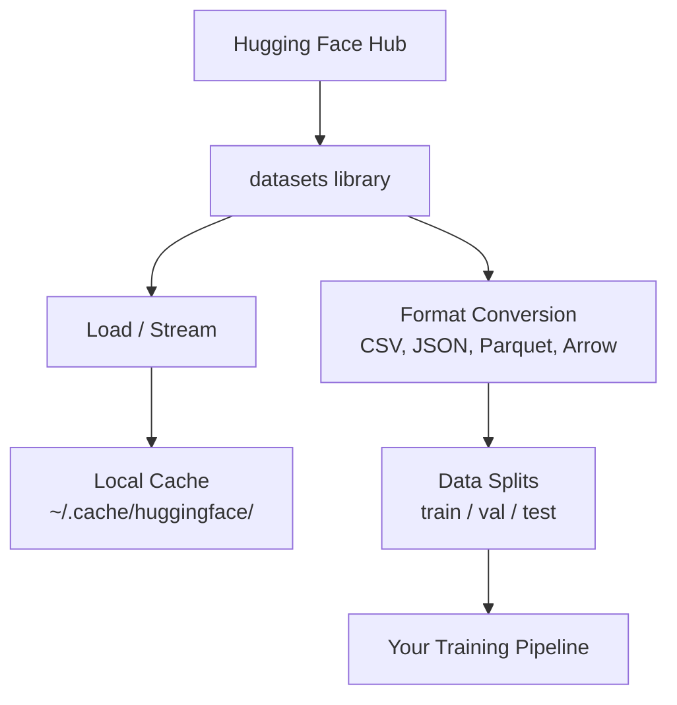

# 数据管理

> 数据是燃料。你管理数据的方式，决定了你能跑多快。

**Type:** Build
**Language:** Python
**Prerequisites:** Phase 0, Lesson 01
**Time:** ~45 minutes

## 学习目标

- 使用 Hugging Face 的 `datasets` 库加载、流式读取和缓存数据集
- 在 CSV、JSON、Parquet 和 Arrow 格式之间转换，并说明各自的取舍
- 使用固定随机种子创建可复现的训练/验证/测试划分
- 使用 `.gitignore`、Git LFS 或 DVC 管理大体积的模型和数据集文件

## 问题背景

每个 AI 项目都从数据开始。你需要找到数据集、下载它们、在格式之间转换、为训练和评估做划分，还要做版本管理以保证实验可复现。每次都手动做这些事既慢又容易出错。你需要一套可重复的工作流。

## 核心概念



Hugging Face 的 `datasets` 库是 AI 工作中加载数据的标准方式。它开箱即用地处理下载、缓存、格式转换和流式读取。

## 从零实现

### 第 1 步：安装 datasets 库

```bash
pip install datasets huggingface_hub
```

### 第 2 步：加载数据集

```python
from datasets import load_dataset

dataset = load_dataset("imdb")
print(dataset)
print(dataset["train"][0])
```

这会下载 IMDB 影评数据集。首次下载之后，它会从 `~/.cache/huggingface/datasets/` 的缓存中加载。

### 第 3 步：流式读取大数据集

有些数据集太大，磁盘放不下。流式读取（streaming）会逐行加载数据，而无需下载完整数据集。

```python
dataset = load_dataset("wikimedia/wikipedia", "20220301.en", split="train", streaming=True)

for i, example in enumerate(dataset):
    print(example["title"])
    if i >= 4:
        break
```

流式读取得到的是一个 `IterableDataset`。数据行到达时即可处理。无论数据集多大，内存占用都保持恒定。

### 第 4 步：数据集格式

`datasets` 库底层使用 Apache Arrow。你可以根据管道的需要转换成其他格式。

```python
dataset = load_dataset("imdb", split="train")

dataset.to_csv("imdb_train.csv")
dataset.to_json("imdb_train.json")
dataset.to_parquet("imdb_train.parquet")
```

格式对比：

| 格式 | 体积 | 读取速度 | 适用场景 |
|--------|------|-----------|----------|
| CSV | 大 | 慢 | 人工阅读、电子表格 |
| JSON | 大 | 慢 | API、嵌套数据 |
| Parquet | 小 | 快 | 分析任务、列式查询 |
| Arrow | 小 | 最快 | 内存内处理（`datasets` 内部使用的格式） |

对 AI 工作而言，Parquet 是最好的存储格式。Arrow 是你在内存中操作的格式。CSV 和 JSON 用于数据交换。

### 第 5 步：数据划分

每个 ML 项目都需要三种划分：

- **训练集（Train）**：模型从这里学习（通常占 80%）
- **验证集（Validation）**：训练过程中用它检查进展（通常占 10%）
- **测试集（Test）**：训练结束后的最终评估（通常占 10%）

有些数据集自带划分。如果没有，就自己划分：

```python
dataset = load_dataset("imdb", split="train")

split = dataset.train_test_split(test_size=0.2, seed=42)
train_val = split["train"].train_test_split(test_size=0.125, seed=42)

train_ds = train_val["train"]
val_ds = train_val["test"]
test_ds = split["test"]

print(f"Train: {len(train_ds)}, Val: {len(val_ds)}, Test: {len(test_ds)}")
```

务必设置随机种子以保证可复现：相同的种子每次都会产生相同的划分。

### 第 6 步：下载并缓存模型

模型是大文件。`huggingface_hub` 库负责处理下载和缓存。

```python
from huggingface_hub import hf_hub_download, snapshot_download

model_path = hf_hub_download(
    repo_id="sentence-transformers/all-MiniLM-L6-v2",
    filename="config.json"
)
print(f"Cached at: {model_path}")

model_dir = snapshot_download("sentence-transformers/all-MiniLM-L6-v2")
print(f"Full model at: {model_dir}")
```

模型缓存在 `~/.cache/huggingface/hub/`。下载一次之后，后续运行会即刻加载。

### 第 7 步：处理大文件

模型权重和大数据集不应该进 git。有三个选项：

**选项 A：.gitignore（最简单）**

```
*.bin
*.safetensors
*.pt
*.onnx
data/*.parquet
data/*.csv
models/
```

**选项 B：Git LFS（在 git 中追踪大文件）**

```bash
git lfs install
git lfs track "*.bin"
git lfs track "*.safetensors"
git add .gitattributes
```

Git LFS 在仓库中存放指针，实际文件存放在单独的服务器上。GitHub 提供 1 GB 的免费额度。

**选项 C：DVC（数据版本控制）**

```bash
pip install dvc
dvc init
dvc add data/training_set.parquet
git add data/training_set.parquet.dvc data/.gitignore
git commit -m "Track training data with DVC"
```

DVC 会创建指向数据的小型 `.dvc` 文件。数据本身存放在 S3、GCS 或其他远程存储后端。

| 方案 | 复杂度 | 适用场景 |
|----------|-----------|----------|
| .gitignore | 低 | 个人项目、可以重新获取的下载数据 |
| Git LFS | 中 | 团队通过 git 共享模型权重 |
| DVC | 高 | 可复现实验、大数据集、团队协作 |

对本课程而言，`.gitignore` 就够用了。当你需要跨机器精确复现实验时，再使用 DVC。

### 第 8 步：存储模式

**本地存储**适合 10 GB 以内的数据集。HF 缓存会自动处理。

**云存储**用于更大的数据集，或需要跨机器共享的场景：

```python
import os

local_path = os.path.expanduser("~/.cache/huggingface/datasets/")

# s3_path = "s3://my-bucket/datasets/"
# gcs_path = "gs://my-bucket/datasets/"
```

DVC 可以直接对接 S3 和 GCS：

```bash
dvc remote add -d myremote s3://my-bucket/dvc-store
dvc push
```

对本课程而言，本地存储就足够了。当你在远程 GPU 实例上做微调时，云存储才变得重要。

## 本课程使用的数据集

| 数据集 | 课程 | 大小 | 教学内容 |
|---------|---------|------|----------------|
| IMDB | 分词、分类 | 84 MB | 文本分类基础 |
| WikiText | 语言建模 | 181 MB | 下一个 token 预测 |
| SQuAD | 问答系统 | 35 MB | 问答、答案片段 |
| Common Crawl（子集） | 嵌入 | 不固定 | 大规模文本处理 |
| MNIST | 视觉基础 | 21 MB | 图像分类基础 |
| COCO（子集） | 多模态 | 不固定 | 图文对 |

你现在不需要把这些全部下载下来。每节课会说明它需要哪些数据。

## 生产实践

运行工具脚本，验证一切正常：

```bash
python code/data_utils.py
```

这个脚本会下载一个小数据集，进行格式转换和划分，并打印摘要。

## 交付产物

本课产出：
- `code/data_utils.py` - 可复用的数据加载与缓存工具
- `outputs/prompt-data-helper.md` - 用于为任务寻找合适数据集的提示词

## 练习

1. 加载 `glue` 数据集的 `mrpc` 配置，并查看前 5 个样本
2. 流式读取 `c4` 数据集，统计 10 秒内能处理多少个样本
3. 把一个数据集转换为 Parquet，并与 CSV 比较文件大小
4. 用固定种子创建 70/15/15 的训练/验证/测试划分，并验证各部分的大小

## 关键术语

| 术语 | 人们常说的 | 实际含义 |
|------|----------------|----------------------|
| 数据集划分（Dataset split） | “训练数据” | 在 ML 生命周期不同阶段使用的命名子集（train/val/test） |
| 流式读取（Streaming） | “惰性加载” | 从远程数据源逐行处理数据，而不下载完整数据集 |
| Parquet | “压缩版 CSV” | 一种为分析查询和存储效率优化的列式文件格式 |
| Arrow | “快速 dataframe” | datasets 库内部使用的内存列式格式，支持零拷贝读取 |
| Git LFS | “大文件版 Git” | 一种扩展，把大文件存放在 git 仓库之外，版本控制中只保留指针 |
| DVC | “数据版 Git” | 面向数据集和模型的版本控制系统，可对接云存储 |
| 缓存（Cache） | “已经下载好了” | 此前获取过的数据的本地副本，默认存放在 ~/.cache/huggingface/ |
