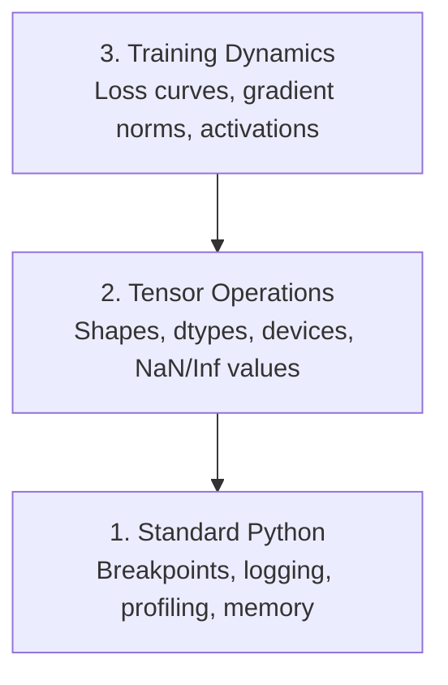

# 调试与性能分析

> 最糟糕的 AI bug 不会让程序崩溃。它们在垃圾数据上默默训练，还给你画出一条漂亮的损失曲线。

**Type:** Build
**Language:** Python
**Prerequisites:** Lesson 1 (Dev Environment), basic PyTorch familiarity
**Time:** ~60 minutes

## 学习目标

- 使用条件式 `breakpoint()` 和 `debug_print` 在训练过程中检查张量形状、dtype 和 NaN 值
- 使用 `cProfile`、`line_profiler` 和 `tracemalloc` 对训练循环进行性能分析（profiling），找出瓶颈
- 识别常见的 AI bug：形状不匹配、NaN 损失、数据泄漏（data leakage）和张量设备错误
- 配置 TensorBoard，可视化损失曲线、权重直方图和梯度分布

## 问题背景

AI 代码的出错方式和普通代码不一样。Web 应用崩溃时会给你一个堆栈跟踪。而一个配置错误的训练循环会跑上 8 小时，烧掉 200 美元的 GPU 费用，最后产出一个对任何输入都预测均值的模型。代码全程没有报错。bug 可能是一个放错设备的张量、一个忘写的 `.detach()`，或者标签泄漏进了特征。

你需要能在这些静默故障浪费你的时间和算力之前把它们抓出来的调试工具。

## 核心概念

AI 调试在三个层面上进行：



大多数人直接跳到第 3 层（盯着 TensorBoard 看）。但 80% 的 AI bug 出在第 1 层和第 2 层。

## 从零实现

### 第 1 部分：print 调试（没错，它真的管用）

print 调试常常被人轻视。其实不该如此。对于张量代码，一条有针对性的 print 语句比单步跟踪调试器更好用，因为你需要同时看到形状、dtype 和取值范围。

```python
def debug_print(name, tensor):
    print(f"{name}: shape={tensor.shape}, dtype={tensor.dtype}, "
          f"device={tensor.device}, "
          f"min={tensor.min().item():.4f}, max={tensor.max().item():.4f}, "
          f"mean={tensor.mean().item():.4f}, "
          f"has_nan={tensor.isnan().any().item()}")
```

在每个可疑操作之后调用它。找到 bug 后，把这些 print 删掉。就这么简单。

### 第 2 部分：Python 调试器（pdb 与 breakpoint）

内置调试器在 AI 工作中被低估了。在训练循环里插入 `breakpoint()`，就能交互式地检查张量。

```python
def training_step(model, batch, criterion, optimizer):
    inputs, labels = batch
    outputs = model(inputs)
    loss = criterion(outputs, labels)

    if loss.item() > 100 or torch.isnan(loss):
        breakpoint()

    loss.backward()
    optimizer.step()
```

调试器把你带进去后，这些命令很有用：

- `p outputs.shape` 检查形状
- `p loss.item()` 查看损失值
- `p torch.isnan(outputs).sum()` 统计 NaN 数量
- `p model.fc1.weight.grad` 检查梯度
- `c` 继续执行，`q` 退出

这就是条件式调试。只有在情况看起来不对劲时才会停下。对于一次 10,000 步的训练，这一点至关重要。

### 第 3 部分：Python 日志

当你的调试不再只是快速检查时，就该用日志（logging）替换 print 语句。

```python
import logging

logging.basicConfig(
    level=logging.INFO,
    format="%(asctime)s [%(levelname)s] %(message)s",
    handlers=[
        logging.FileHandler("training.log"),
        logging.StreamHandler()
    ]
)
logger = logging.getLogger(__name__)

logger.info("Starting training: lr=%.4f, batch_size=%d", lr, batch_size)
logger.warning("Loss spike detected: %.4f at step %d", loss.item(), step)
logger.error("NaN loss at step %d, stopping", step)
```

日志给你时间戳、严重级别和文件输出。当训练在凌晨 3 点挂掉时，你想要的是一份日志文件，而不是早已滚出屏幕的终端输出。

### 第 4 部分：给代码段计时

知道时间花在哪里，是优化的第一步。

```python
import time

class Timer:
    def __init__(self, name=""):
        self.name = name

    def __enter__(self):
        self.start = time.perf_counter()
        return self

    def __exit__(self, *args):
        elapsed = time.perf_counter() - self.start
        print(f"[{self.name}] {elapsed:.4f}s")

with Timer("data loading"):
    batch = next(dataloader_iter)

with Timer("forward pass"):
    outputs = model(batch)

with Timer("backward pass"):
    loss.backward()
```

常见的发现：数据加载占了训练时间的 60%。解药是在 DataLoader 里设置 `num_workers > 0`，而不是换一块更快的 GPU。

### 第 5 部分：cProfile 与 line_profiler

当手动计时器不够用时：

```bash
python -m cProfile -s cumtime train.py
```

这会按累计耗时排序，列出每一个函数调用。需要逐行分析时：

```bash
pip install line_profiler
```

```python
@profile
def train_step(model, data, target):
    output = model(data)
    loss = F.cross_entropy(output, target)
    loss.backward()
    return loss

# Run with: kernprof -l -v train.py
```

### 第 6 部分：内存分析

#### 用 tracemalloc 分析 CPU 内存

```python
import tracemalloc

tracemalloc.start()

# your code here
model = build_model()
data = load_dataset()

snapshot = tracemalloc.take_snapshot()
top_stats = snapshot.statistics("lineno")
for stat in top_stats[:10]:
    print(stat)
```

#### 用 memory_profiler 分析 CPU 内存

```bash
pip install memory_profiler
```

```python
from memory_profiler import profile

@profile
def load_data():
    raw = read_csv("data.csv")       # watch memory jump here
    processed = preprocess(raw)       # and here
    return processed
```

用 `python -m memory_profiler your_script.py` 运行，就能看到逐行的内存占用。

#### 用 PyTorch 分析 GPU 内存

```python
import torch

if torch.cuda.is_available():
    print(torch.cuda.memory_summary())

    print(f"Allocated: {torch.cuda.memory_allocated() / 1e9:.2f} GB")
    print(f"Cached: {torch.cuda.memory_reserved() / 1e9:.2f} GB")
```

遇到 OOM（Out of Memory，显存不足）时：

1. 减小 batch size（永远是第一个尝试的办法）
2. 用 `torch.cuda.empty_cache()` 释放缓存的显存
3. 对大块中间结果，先 `del tensor` 再调用 `torch.cuda.empty_cache()`
4. 使用混合精度（`torch.cuda.amp`）将显存占用减半
5. 对非常深的模型使用梯度检查点（gradient checkpointing）

### 第 7 部分：常见 AI bug 及捕获方法

#### 形状不匹配

最高频的 bug。张量的形状是 `[batch, features]`，而模型期望的是 `[batch, channels, height, width]`。

```python
def check_shapes(model, sample_input):
    print(f"Input: {sample_input.shape}")
    hooks = []

    def make_hook(name):
        def hook(module, inp, out):
            in_shape = inp[0].shape if isinstance(inp, tuple) else inp.shape
            out_shape = out.shape if hasattr(out, "shape") else type(out)
            print(f"  {name}: {in_shape} -> {out_shape}")
        return hook

    for name, module in model.named_modules():
        hooks.append(module.register_forward_hook(make_hook(name)))

    with torch.no_grad():
        model(sample_input)

    for h in hooks:
        h.remove()
```

用一个样本批次跑一遍这个函数，它会把模型中每一次形状变换都映射出来。

#### NaN 损失

NaN 损失意味着某个地方爆炸了。常见原因：

- 学习率过高
- 自定义损失中出现除零
- 对零或负数取对数
- RNN 中的梯度爆炸

```python
def detect_nan(model, loss, step):
    if torch.isnan(loss):
        print(f"NaN loss at step {step}")
        for name, param in model.named_parameters():
            if param.grad is not None:
                if torch.isnan(param.grad).any():
                    print(f"  NaN gradient in {name}")
                if torch.isinf(param.grad).any():
                    print(f"  Inf gradient in {name}")
        return True
    return False
```

#### 数据泄漏

你的模型在测试集上拿到了 99% 的准确率。听起来很棒？这是个 bug。

```python
def check_data_leakage(train_set, test_set, id_column="id"):
    train_ids = set(train_set[id_column].tolist())
    test_ids = set(test_set[id_column].tolist())
    overlap = train_ids & test_ids
    if overlap:
        print(f"DATA LEAKAGE: {len(overlap)} samples in both train and test")
        return True
    return False
```

还要检查时间泄漏：用未来的数据去预测过去。切分数据前先按时间戳排序。

#### 设备错误

张量分布在不同设备（CPU 和 GPU）上会引发运行时错误。但有时一个张量会悄悄留在 CPU 上，而其他一切都在 GPU 上，训练只是默默地变慢。

```python
def check_devices(model, *tensors):
    model_device = next(model.parameters()).device
    print(f"Model device: {model_device}")
    for i, t in enumerate(tensors):
        if t.device != model_device:
            print(f"  WARNING: tensor {i} on {t.device}, model on {model_device}")
```

### 第 8 部分：TensorBoard 基础

TensorBoard 让你看到训练内部随时间的变化。

```bash
pip install tensorboard
```

```python
from torch.utils.tensorboard import SummaryWriter

writer = SummaryWriter("runs/experiment_1")

for step in range(num_steps):
    loss = train_step(model, batch)

    writer.add_scalar("loss/train", loss.item(), step)
    writer.add_scalar("lr", optimizer.param_groups[0]["lr"], step)

    if step % 100 == 0:
        for name, param in model.named_parameters():
            writer.add_histogram(f"weights/{name}", param, step)
            if param.grad is not None:
                writer.add_histogram(f"grads/{name}", param.grad, step)

writer.close()
```

启动方式：

```bash
tensorboard --logdir=runs
```

需要关注的信号：

- **损失不下降**：学习率太低，或模型架构有问题
- **损失剧烈震荡**：学习率太高
- **损失变成 NaN**：数值不稳定（参见上面的 NaN 一节）
- **训练损失下降、验证损失上升**：过拟合
- **权重直方图坍缩到零**：梯度消失
- **梯度直方图爆炸**：需要梯度裁剪

### 第 9 部分：VS Code 调试器

想要交互式调试，可以用 `launch.json` 配置 VS Code：

```json
{
    "version": "0.2.0",
    "configurations": [
        {
            "name": "Debug Training",
            "type": "debugpy",
            "request": "launch",
            "program": "${file}",
            "console": "integratedTerminal",
            "justMyCode": false
        }
    ]
}
```

点击行号侧边栏即可设置断点。用 Variables 面板检查张量属性。Debug Console 允许你在执行过程中运行任意 Python 表达式。

在需要逐步查看数据预处理流水线中每一次变换时，这种方式特别有用。

## 生产实践

下面这套调试工作流能抓住大多数 AI bug：

1. **训练前**：用一个样本批次运行 `check_shapes`。验证输入输出维度符合预期。
2. **前 10 步**：对损失、输出和梯度使用 `debug_print`。确认没有 NaN，数值都在合理范围内。
3. **训练过程中**：记录损失、学习率和梯度范数。用 TensorBoard 做可视化。
4. **出问题时**：在故障点插入 `breakpoint()`，交互式地检查张量。
5. **关注性能时**：分别给数据加载、前向传播、反向传播计时。接近 OOM 时做内存分析。

## 交付产物

运行调试工具脚本：

```bash
python phases/00-setup-and-tooling/12-debugging-and-profiling/code/debug_tools.py
```

参见 `outputs/prompt-debug-ai-code.md`，里面有一个帮助诊断 AI 特有 bug 的提示词。

## 练习

1. 运行 `debug_tools.py`，通读每一节的输出。修改示例模型，人为引入一个 NaN（提示：在前向传播里做除零），观察检测器把它抓出来。
2. 用 `cProfile` 对一个训练循环做性能分析，找出最慢的函数。
3. 用 `tracemalloc` 找出数据加载流水线中分配内存最多的那一行。
4. 给一次简单的训练配置 TensorBoard，判断模型是否过拟合。
5. 在训练循环内使用 `breakpoint()`。练习在调试器提示符下检查张量形状、设备和梯度值。
