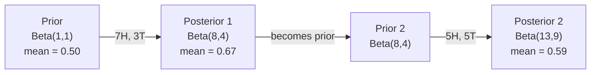

# 贝叶斯定理

> 概率讨论的是你期望什么，贝叶斯定理讨论的是你学到了什么。

**Type:** Build
**Language:** Python
**Prerequisites:** Phase 1, Lesson 06 (Probability Fundamentals)
**Time:** ~75 minutes

## 学习目标

- 应用贝叶斯定理，从先验、似然和证据计算后验概率
- 从零构建一个带拉普拉斯平滑和对数空间计算的朴素贝叶斯文本分类器
- 比较 MLE 与 MAP 估计，并解释 MAP 如何对应 L2 正则化
- 使用 Beta-二项共轭先验实现序贯贝叶斯更新，用于 A/B 测试

## 问题背景

某项医学检测的准确率是 99%。你的检测结果呈阳性。你真正患病的几率有多大？

大多数人会说 99%。真实答案取决于这种疾病有多罕见。如果每 10,000 人中只有 1 人患病，那么阳性结果只意味着你大约有 1% 的概率患病。其余 99% 的阳性结果都是健康人触发的虚惊。

这不是脑筋急转弯，这就是贝叶斯定理。每一个垃圾邮件过滤器、每一项医学诊断、每一个量化不确定性的机器学习模型，用的都是这套推理：先有一个信念，看到证据，然后更新。

如果你在不理解这一点的情况下构建 ML 系统，你会误读模型输出、设错阈值、上线过度自信的预测。

## 核心概念

### 从联合概率到贝叶斯

你在第 06 课已经学过，条件概率是：

```
P(A|B) = P(A and B) / P(B)
```

对称地：

```
P(B|A) = P(A and B) / P(A)
```

两个表达式的分子相同：P(A and B)。令二者相等并整理：

```
P(A and B) = P(A|B) * P(B) = P(B|A) * P(A)

Therefore:

P(A|B) = P(B|A) * P(A) / P(B)
```

这就是贝叶斯定理。四个量，一个等式。

### 四个组成部分

| 部分 | 名称 | 含义 |
|------|------|---------------|
| P(A\|B) | 后验（Posterior） | 看到证据 B 之后，你对 A 的更新后信念 |
| P(B\|A) | 似然（Likelihood） | 如果 A 为真，证据 B 出现的可能性有多大 |
| P(A) | 先验（Prior） | 在看到任何证据之前，你对 A 的信念 |
| P(B) | 证据（Evidence） | 在所有可能情形下观察到 B 的总概率 |

证据项 P(B) 起归一化作用。你可以用全概率公式将它展开：

```
P(B) = P(B|A) * P(A) + P(B|not A) * P(not A)
```

### 医学检测的例子

某种疾病的患病率是万分之一。检测的准确率是 99%（能查出 99% 的患者，对健康人有 1% 的假阳性率）。

```
P(sick)          = 0.0001     (prior: disease is rare)
P(positive|sick) = 0.99       (likelihood: test catches it)
P(positive|healthy) = 0.01    (false positive rate)

P(positive) = P(positive|sick) * P(sick) + P(positive|healthy) * P(healthy)
            = 0.99 * 0.0001 + 0.01 * 0.9999
            = 0.000099 + 0.009999
            = 0.010098

P(sick|positive) = P(positive|sick) * P(sick) / P(positive)
                 = 0.99 * 0.0001 / 0.010098
                 = 0.0098
                 = 0.98%
```

不到 1%。先验占主导地位。当一种疾病非常罕见时，即使是准确的检测，产生的阳性结果也大多是假阳性。这就是医生要求做复查确认的原因。

### 垃圾邮件过滤器的例子

你收到一封含有 "lottery" 一词的邮件。它是垃圾邮件吗？

```
P(spam)                = 0.3      (30% of email is spam)
P("lottery"|spam)      = 0.05     (5% of spam emails contain "lottery")
P("lottery"|not spam)  = 0.001    (0.1% of legitimate emails contain "lottery")

P("lottery") = 0.05 * 0.3 + 0.001 * 0.7
             = 0.015 + 0.0007
             = 0.0157

P(spam|"lottery") = 0.05 * 0.3 / 0.0157
                  = 0.955
                  = 95.5%
```

仅仅一个词，就把概率从 30% 推到了 95.5%。真实的垃圾邮件过滤器会同时对数百个词应用贝叶斯定理。

### 朴素贝叶斯：独立性假设

朴素贝叶斯（Naive Bayes）将这一思路扩展到多个特征：假设在给定类别的条件下，所有特征彼此条件独立：

```
P(class | feature_1, feature_2, ..., feature_n)
  = P(class) * P(feature_1|class) * P(feature_2|class) * ... * P(feature_n|class)
    / P(feature_1, feature_2, ..., feature_n)
```

"朴素"指的就是这个独立性假设。在文本里，词的出现并不独立（"New" 和 "York" 是相关的）。但这个假设在实践中效果出奇地好，因为分类器只需要对类别排序，而不需要给出校准过的概率。

由于分母对所有类别都相同，可以直接跳过它，只比较分子：

```
score(class) = P(class) * product of P(feature_i | class)
```

选取得分最高的类别即可。

### 最大似然估计（MLE）

如何从训练数据中得到 P(feature|class)？数数就行。

```
P("free"|spam) = (number of spam emails containing "free") / (total spam emails)
```

这就是最大似然估计（MLE）：选取使观测数据出现概率最大的参数值。你在最大化似然函数，对于离散计数来说，它就化简成了相对频率。

问题在于：如果某个词在训练时从未出现在垃圾邮件中，MLE 会给它零概率。一个没见过的词就能让整个乘积归零。解决办法是拉普拉斯平滑（Laplace smoothing）：

```
P(word|class) = (count(word, class) + 1) / (total_words_in_class + vocabulary_size)
```

给每个计数加 1，保证没有任何概率会等于零。

### 最大后验估计（MAP）

MLE 问的是：什么参数能最大化 P(data|parameters)？

MAP 问的是：什么参数能最大化 P(parameters|data)？

根据贝叶斯定理：

```
P(parameters|data) proportional to P(data|parameters) * P(parameters)
```

MAP 在参数本身之上加了一个先验。如果你认为参数应该比较小，就把这个想法编码成一个惩罚大数值的先验。这与 ML 中的 L2 正则化完全等价。岭回归中的 "ridge" 惩罚项，本质上就是对权重施加高斯先验。

| 估计方法 | 优化目标 | 在 ML 中的对应 |
|------------|-----------|---------------|
| MLE | P(data\|params) | 无正则化的训练 |
| MAP | P(data\|params) * P(params) | L2 / L1 正则化 |

### 贝叶斯派 vs 频率派：实践中的区别

频率派把参数当作固定的未知量。他们问："如果我把这个实验重复很多次，会发生什么？"

贝叶斯派把参数当作分布。他们问："在已有观测的前提下，我对参数应该持有什么样的信念？"

对于构建 ML 系统而言，实践中的差别如下：

| 方面 | 频率派 | 贝叶斯派 |
|--------|-------------|----------|
| 输出 | 点估计 | 取值上的分布 |
| 不确定性 | 置信区间（针对过程） | 可信区间（针对参数） |
| 小数据 | 容易过拟合 | 先验起正则化作用 |
| 计算 | 通常更快 | 常常需要采样（MCMC） |

生产环境中的 ML 大多是频率派的（SGD、点估计）。贝叶斯方法的优势体现在需要校准的不确定性时（医疗决策、安全攸关系统），或者数据稀缺时（少样本学习、冷启动）。

### 为什么贝叶斯思维对 ML 很重要

这种联系不只是类比，而是更深层的：

**先验就是正则化。** 对权重施加高斯先验就是 L2 正则化，施加拉普拉斯先验就是 L1。每当你加入一个正则化项，你都在用贝叶斯的方式表达对参数取值的预期。

**后验就是不确定性。** 单个预测概率无法告诉你模型对这个估计有多自信。贝叶斯方法给你一个分布："我认为 P(spam) 在 0.8 到 0.95 之间。"

**贝叶斯更新就是在线学习。** 今天的后验就是明天的先验。当模型看到新数据时，它增量地更新信念，而不是从头重新训练。

**模型比较也是贝叶斯的。** 贝叶斯信息准则（BIC）、边际似然和贝叶斯因子，都在用贝叶斯推理在模型之间做选择而不过拟合。

```figure
bayes-update
```

## 从零实现

### 第 1 步：贝叶斯定理函数

```python
def bayes(prior, likelihood, false_positive_rate):
    evidence = likelihood * prior + false_positive_rate * (1 - prior)
    posterior = likelihood * prior / evidence
    return posterior

result = bayes(prior=0.0001, likelihood=0.99, false_positive_rate=0.01)
print(f"P(sick|positive) = {result:.4f}")
```

### 第 2 步：朴素贝叶斯分类器

```python
import math
from collections import defaultdict

class NaiveBayes:
    def __init__(self, smoothing=1.0):
        self.smoothing = smoothing
        self.class_counts = defaultdict(int)
        self.word_counts = defaultdict(lambda: defaultdict(int))
        self.class_word_totals = defaultdict(int)
        self.vocab = set()

    def train(self, documents, labels):
        for doc, label in zip(documents, labels):
            self.class_counts[label] += 1
            words = doc.lower().split()
            for word in words:
                self.word_counts[label][word] += 1
                self.class_word_totals[label] += 1
                self.vocab.add(word)

    def predict(self, document):
        words = document.lower().split()
        total_docs = sum(self.class_counts.values())
        vocab_size = len(self.vocab)
        best_class = None
        best_score = float("-inf")
        for cls in self.class_counts:
            score = math.log(self.class_counts[cls] / total_docs)
            for word in words:
                count = self.word_counts[cls].get(word, 0)
                total = self.class_word_totals[cls]
                score += math.log((count + self.smoothing) / (total + self.smoothing * vocab_size))
            if score > best_score:
                best_score = score
                best_class = cls
        return best_class
```

对数概率可以防止下溢。许多很小的概率相乘，结果会小到浮点数无法表示。改成对数概率相加，数值稳定，而且在数学上完全等价。

### 第 3 步：在垃圾邮件数据上训练

```python
train_docs = [
    "win free money now",
    "free lottery ticket winner",
    "claim your prize today free",
    "urgent offer free cash",
    "congratulations you won free",
    "meeting tomorrow at noon",
    "project update attached",
    "can we schedule a call",
    "quarterly report review",
    "lunch on thursday sounds good",
    "team standup notes attached",
    "please review the pull request",
]

train_labels = [
    "spam", "spam", "spam", "spam", "spam",
    "ham", "ham", "ham", "ham", "ham", "ham", "ham",
]

classifier = NaiveBayes()
classifier.train(train_docs, train_labels)

test_messages = [
    "free money waiting for you",
    "meeting rescheduled to friday",
    "you won a free prize",
    "please review the attached report",
]

for msg in test_messages:
    print(f"  '{msg}' -> {classifier.predict(msg)}")
```

### 第 4 步：检查学到的概率

```python
def show_top_words(classifier, cls, n=5):
    vocab_size = len(classifier.vocab)
    total = classifier.class_word_totals[cls]
    probs = {}
    for word in classifier.vocab:
        count = classifier.word_counts[cls].get(word, 0)
        probs[word] = (count + classifier.smoothing) / (total + classifier.smoothing * vocab_size)
    sorted_words = sorted(probs.items(), key=lambda x: x[1], reverse=True)
    for word, prob in sorted_words[:n]:
        print(f"    {word}: {prob:.4f}")

print("\nTop spam words:")
show_top_words(classifier, "spam")
print("\nTop ham words:")
show_top_words(classifier, "ham")
```

## 生产实践

Scikit-learn 自带生产可用的朴素贝叶斯实现：

```python
from sklearn.feature_extraction.text import CountVectorizer
from sklearn.naive_bayes import MultinomialNB
from sklearn.metrics import classification_report

vectorizer = CountVectorizer()
X_train = vectorizer.fit_transform(train_docs)
clf = MultinomialNB()
clf.fit(X_train, train_labels)

X_test = vectorizer.transform(test_messages)
predictions = clf.predict(X_test)
for msg, pred in zip(test_messages, predictions):
    print(f"  '{msg}' -> {pred}")
```

同一个算法。CountVectorizer 负责分词和词表构建，MultinomialNB 在内部处理平滑和对数概率。你那 40 行的从零实现做的就是同样的事。

## 交付产物

这里构建的 NaiveBayes 类展示了完整流程：分词、带拉普拉斯平滑的概率估计、对数空间预测。`code/bayes.py` 中的代码可以端到端运行，除 Python 标准库外没有任何依赖。

### 共轭先验

当先验和后验属于同一分布族时，这个先验被称为"共轭的"（conjugate）。这让贝叶斯更新在代数上非常干净——你能得到闭式后验，无需数值积分。

| 似然 | 共轭先验 | 后验 | 示例 |
|-----------|----------------|-----------|---------|
| 伯努利分布 | Beta(a, b) | Beta(a + 成功次数, b + 失败次数) | 估计硬币的偏差 |
| 正态分布（方差已知） | Normal(mu_0, sigma_0) | Normal(加权均值, 更小的方差) | 传感器校准 |
| 泊松分布 | Gamma(a, b) | Gamma(a + 计数总和, b + n) | 到达率建模 |
| 多项分布 | Dirichlet(alpha) | Dirichlet(alpha + 计数) | 主题建模、语言模型 |

这一点为什么重要：没有共轭先验，你需要蒙特卡洛采样或变分推断来近似后验；有了共轭先验，你只需要更新两个数。

Beta 分布是实践中最常用的共轭先验。Beta(a, b) 表示你对一个概率参数的信念。其均值为 a/(a+b)。a+b 越大，分布越集中（越自信）。

Beta 先验的几个特例：
- Beta(1, 1) = 均匀分布。你对参数没有任何看法。
- Beta(10, 10) = 在 0.5 处达到峰值。你强烈相信参数接近 0.5。
- Beta(1, 10) = 偏向 0。你相信参数很小。

更新规则简单得不能再简单：

```
Prior:     Beta(a, b)
Data:      s successes, f failures
Posterior: Beta(a + s, b + f)
```

不用积分，不用采样，只用加法。

### 序贯贝叶斯更新

贝叶斯推断天然是序贯的。今天的后验就是明天的先验。真实系统正是这样增量学习的，而不需要重新处理全部历史数据。

具体例子：估计一枚硬币是否公平。

**第 1 天：还没有数据。**
从 Beta(1, 1) 出发——一个均匀先验。你没有任何先入之见。
- 先验均值：0.5
- 先验在 [0, 1] 上是平坦的

**第 2 天：观察到 7 次正面、3 次反面。**
后验 = Beta(1 + 7, 1 + 3) = Beta(8, 4)
- 后验均值：8/12 = 0.667
- 证据表明硬币偏向正面

**第 3 天：再观察到 5 次正面、5 次反面。**
把昨天的后验当作今天的先验。
后验 = Beta(8 + 5, 4 + 5) = Beta(13, 9)
- 后验均值：13/22 = 0.591
- 均衡的新数据把估计值拉回了 0.5 的方向



观测顺序无关紧要。从 Beta(1,1) 出发，一次性用全部 12 次正面和 8 次反面更新，得到的同样是 Beta(13, 9)。序贯更新和批量更新在数学上是等价的。但序贯更新让你能在每一步做决策，而无需存储原始数据。

这是生产 ML 系统中在线学习的基础。老虎机问题的 Thompson 采样、增量式推荐系统、流式异常检测器，用的都是这个模式。

### 与 A/B 测试的联系

A/B 测试其实就是换了一身衣服的贝叶斯推断。

设定：你在测试两种按钮颜色。变体 A（蓝色）和变体 B（绿色）。你想知道哪个获得的点击更多。

贝叶斯 A/B 测试：

1. **先验。** 给两个变体都设 Beta(1, 1)。不带任何先验偏好。
2. **数据。** 变体 A：1000 次展示中 50 次点击。变体 B：1000 次展示中 65 次点击。
3. **后验。**
   - A：Beta(1 + 50, 1 + 950) = Beta(51, 951)。均值 = 0.051
   - B：Beta(1 + 65, 1 + 935) = Beta(66, 936)。均值 = 0.066
4. **决策。** 计算 P(B > A)——即 B 的真实转化率高于 A 的概率。

解析计算 P(B > A) 很难，但用蒙特卡洛方法就轻而易举：

```
1. Draw 100,000 samples from Beta(51, 951)  -> samples_A
2. Draw 100,000 samples from Beta(66, 936)  -> samples_B
3. P(B > A) = fraction of samples where B > A
```

如果 P(B > A) > 0.95，就上线变体 B；如果在 0.05 和 0.95 之间，就继续收集数据；如果 P(B > A) < 0.05，就上线变体 A。

相比频率派 A/B 测试的优势：
- 你得到的是直接的概率陈述："B 更好的概率是 97%"
- 没有 p 值的困惑，也不用说"无法拒绝原假设"这种含糊话
- 你可以随时查看结果而不会推高假阳性率（没有"偷看问题"）
- 你可以纳入先验知识（例如，以往测试表明转化率通常在 3-8% 之间）

| 方面 | 频率派 A/B | 贝叶斯 A/B |
|--------|----------------|--------------|
| 输出 | p 值 | P(B > A) |
| 解释 | "如果 A=B，这份数据有多令人意外？" | "B 比 A 更好的可能性有多大？" |
| 提前停止 | 推高假阳性率 | 任意时刻都安全（前提是先验选择得当、模型设定正确） |
| 先验知识 | 不使用 | 编码为 Beta 先验 |
| 决策规则 | p < 0.05 | P(B > A) > 阈值 |

## 练习

1. **多次检测。** 一名患者在两次独立检测中均呈阳性（准确率均为 99%，疾病患病率为万分之一）。两次检测之后 P(sick) 是多少？把第一次检测的后验当作第二次检测的先验。

2. **平滑的影响。** 用 0.01、0.1、1.0 和 10.0 的平滑值运行垃圾邮件分类器。排名靠前的词的概率如何变化？当 smoothing=0 且某个词只出现在正常邮件（ham）中时会发生什么？

3. **增加特征。** 扩展 NaiveBayes 类，在词频之外加入消息长度（短/长）作为特征。从训练数据中估计 P(short|spam) 和 P(short|ham)，并把它们纳入预测得分。

4. **手算 MAP。** 给定观测数据（10 次抛硬币出现 7 次正面），使用 Beta(2,2) 先验计算硬币偏差的 MAP 估计，并与 MLE 估计（7/10）作比较。

## 关键术语

| 术语 | 人们常说的 | 实际含义 |
|------|----------------|----------------------|
| 先验（Prior） | "我的初始猜测" | 观察证据之前的 P(hypothesis)。在 ML 中：正则化项。 |
| 似然（Likelihood） | "数据拟合得有多好" | P(evidence\|hypothesis)。在某个特定假设下，观测数据出现的概率。 |
| 后验（Posterior） | "我更新后的信念" | P(hypothesis\|evidence)。先验乘以似然，再做归一化。 |
| 证据（Evidence） | "归一化常数" | 所有假设下的 P(data)。保证后验的总和为 1。 |
| 朴素贝叶斯（Naive Bayes） | "那个简单的文本分类器" | 假设在给定类别下特征相互独立的分类器。尽管假设不成立，效果依然很好。 |
| 拉普拉斯平滑（Laplace smoothing） | "加一平滑" | 给每个特征加上一个小计数，防止未见数据导致零概率。 |
| MLE | "直接用频率" | 选取最大化 P(data\|parameters) 的参数。没有先验。小数据下可能过拟合。 |
| MAP | "带先验的 MLE" | 选取最大化 P(data\|parameters) * P(parameters) 的参数。等价于带正则化的 MLE。 |
| 对数概率（Log-probability） | "在对数空间里算" | 用 log(P) 代替 P，避免许多小数相乘时的浮点下溢。 |
| 假阳性（False positive） | "误报" | 检测结果为阳性，但真实状态为阴性。这是基率谬误的根源。 |

## 延伸阅读

- [3Blue1Brown: Bayes' theorem](https://www.youtube.com/watch?v=HZGCoVF3YvM) - 可视化讲解，包含医学检测的例子
- [Stanford CS229: Generative Learning Algorithms](https://cs229.stanford.edu/notes2022fall/cs229-notes2.pdf) - 朴素贝叶斯及其与判别式模型的联系
- [Think Bayes](https://greenteapress.com/wp/think-bayes/) - 免费书籍，用 Python 代码学贝叶斯统计
- [scikit-learn Naive Bayes](https://scikit-learn.org/stable/modules/naive_bayes.html) - 生产级实现，以及各变体的适用场景
