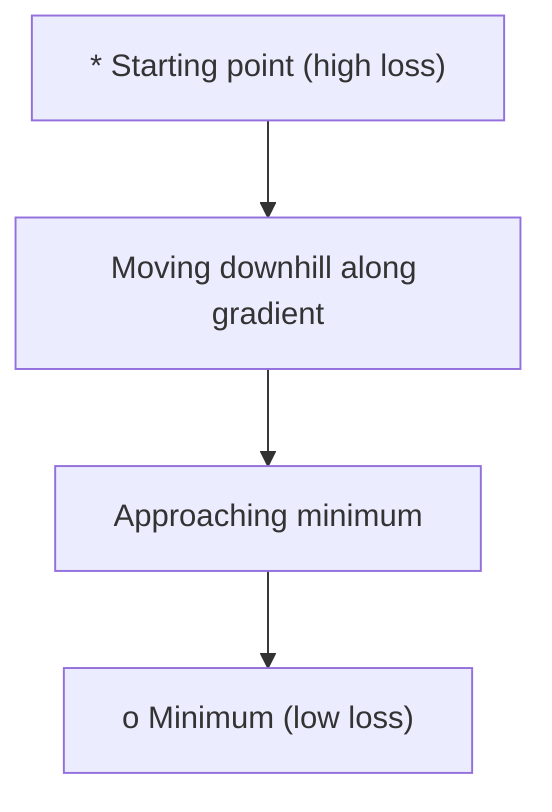
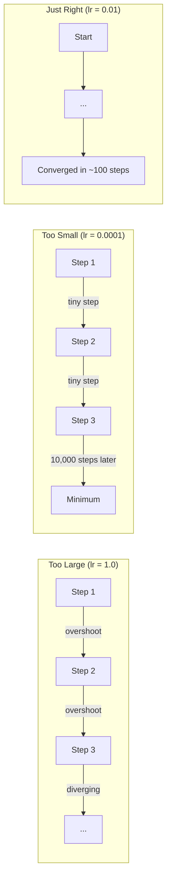
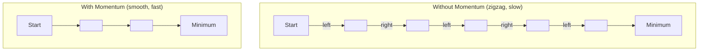
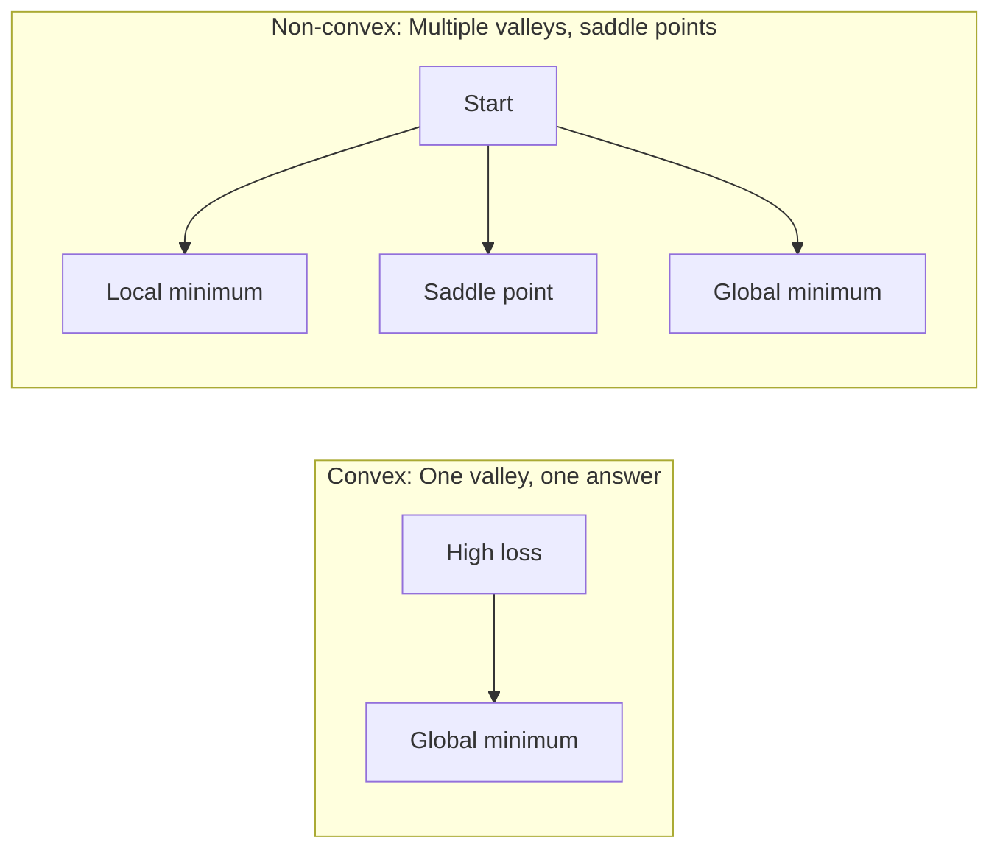
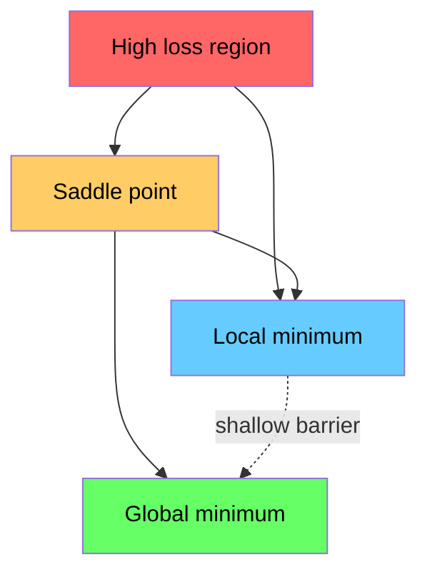

# 优化

> 训练神经网络，无非就是找到山谷的谷底。

**Type:** Build
**Language:** Python
**Prerequisites:** Phase 1, Lessons 04-05 (Derivatives, Gradients)
**Time:** ~75 minutes

## 学习目标

- 从零实现普通梯度下降、带动量的 SGD 和 Adam
- 在 Rosenbrock 函数上比较各优化器的收敛表现，并解释为什么 Adam 能为每个权重自适应调整学习率
- 区分凸与非凸的损失地形，并解释鞍点在高维空间中的作用
- 配置学习率调度（阶梯衰减、余弦退火、预热）以保证训练稳定性

## 问题背景

你有一个损失函数，它告诉你模型错得有多离谱。你有梯度，它告诉你哪个方向会让损失变得更糟。现在你需要一套下山的策略。

朴素的做法很简单：沿梯度的反方向移动，步长乘上一个叫学习率的数字，然后重复。这就是梯度下降，而且确实有效。但「有效」是有前提的。学习率太大，你会直接越过山谷，在两侧山壁之间来回弹跳；太小，你就要爬上几千步冤枉路才能接近答案。一旦撞上鞍点，即使还没找到最小值，你也会停止前进。

深度学习里的每一个优化器，回答的都是同一个问题：怎样更快、更可靠地到达谷底？

## 核心概念

### 优化是什么意思

优化就是找到使函数最小化（或最大化）的输入值。在机器学习中，这个函数是损失，输入是模型的权重。训练就是优化。

```
minimize L(w) where:
  L = loss function
  w = model weights (could be millions of parameters)
```

### 梯度下降（普通版）

最简单的优化器。计算损失对每个权重的梯度，让每个权重沿其梯度的反方向移动，步长由学习率缩放。

```
w = w - lr * gradient
```

整个算法就这么多，只有一行。



### 学习率：最重要的超参数

学习率控制步长，它决定了收敛的一切。



没有公式能算出正确的学习率，只能靠实验来找。常用的起点：Adam 用 0.001，带动量的 SGD 用 0.01。

### SGD、批量与小批量

普通梯度下降在迈出一步之前，要先在整个数据集上计算梯度。这叫批量梯度下降（batch gradient descent），稳定但缓慢。

随机梯度下降（SGD）在单个随机样本上计算梯度并立即更新。它噪声大但速度快。

小批量梯度下降（mini-batch gradient descent）取折中方案：在一个小批量（32、64、128、256 个样本）上计算梯度，然后更新。这才是大家实际在用的方法。

| 变体 | 批量大小 | 梯度质量 | 单步速度 | 噪声 |
|---------|-----------|-----------------|---------------|-------|
| 批量 GD | 整个数据集 | 精确 | 慢 | 无 |
| SGD | 1 个样本 | 噪声很大 | 快 | 高 |
| 小批量 | 32-256 | 估计较好 | 均衡 | 中等 |

SGD 和小批量中的噪声并不是缺陷。它有助于逃离较浅的局部极小值和鞍点。

### 动量：滚下山坡的球

普通梯度下降只看当前的梯度。如果梯度来回锯齿摆动（在狭窄山谷中很常见），进展就会很慢。动量（momentum）通过把历史梯度累积进一个速度项来解决这个问题。

```
v = beta * v + gradient
w = w - lr * v
```

可以类比为一个滚下山坡的球。它不会在每个坑洼处停下重新出发，而是在方向一致时不断加速，并抑制来回振荡。



`beta`（通常取 0.9）控制保留多少历史信息。beta 越大，动量越足、路径越平滑，但对方向变化的响应也越慢。

### Adam：自适应学习率

不同的权重需要不同的学习率。一个很少收到大梯度的权重，在大梯度终于到来时应该迈大步；一个总是收到巨大梯度的权重，则应该迈小步。

Adam（Adaptive Moment Estimation，自适应矩估计）为每个权重跟踪两个量：

1. 一阶矩（m）：梯度的滑动平均（类似动量）
2. 二阶矩（v）：梯度平方的滑动平均（衡量梯度大小）

```
m = beta1 * m + (1 - beta1) * gradient
v = beta2 * v + (1 - beta2) * gradient^2

m_hat = m / (1 - beta1^t)    bias correction
v_hat = v / (1 - beta2^t)    bias correction

w = w - lr * m_hat / (sqrt(v_hat) + epsilon)
```

除以 `sqrt(v_hat)` 是其中的关键洞察。梯度大的权重被一个大数除（有效步长变小），梯度小的权重被一个小数除（有效步长变大）。每个权重都得到了属于自己的自适应学习率。

默认超参数：`lr=0.001, beta1=0.9, beta2=0.999, epsilon=1e-8`。这组默认值对大多数问题都表现良好。

### 学习率调度

固定的学习率是一种折中。训练早期，你希望大步前进、快速取得进展；训练后期，你希望小步微调、在最小值附近精修。

常见的调度方式：

| 调度 | 公式 | 适用场景 |
|----------|---------|----------|
| 阶梯衰减 | lr = lr * factor every N epochs | 简单，手动控制 |
| 指数衰减 | lr = lr_0 * decay^t | 平滑下降 |
| 余弦退火 | lr = lr_min + 0.5 * (lr_max - lr_min) * (1 + cos(pi * t / T)) | Transformer、现代训练 |
| 预热 + 衰减 | Linear ramp up, then decay | 大模型，防止训练初期不稳定 |

### 凸与非凸

凸函数只有一个最小值，梯度下降总能找到它。像 `f(x) = x^2` 这样的二次函数就是凸的。

神经网络的损失函数是非凸的，存在大量局部极小值、鞍点和平坦区域。



在实践中，高维神经网络里的局部极小值很少成为问题。绝大多数局部极小值的损失值都接近全局最小值。鞍点（在某些方向上平坦、在另一些方向上弯曲）才是真正的障碍。动量和小批量带来的噪声有助于逃离它们。

### 损失地形可视化

损失是所有权重的函数。对一个有 100 万个权重的模型，损失地形存在于 1,000,001 维空间中。我们的可视化方法是：在权重空间中随机挑两个方向，沿这两个方向绘制损失，得到一个二维曲面。



尖锐的极小值泛化能力差，平坦的极小值泛化能力好。这也是带动量的 SGD 在最终测试精度上常常胜过 Adam 的原因之一：它的噪声能阻止优化器陷入尖锐的极小值。

```figure
gradient-descent
```

## 从零实现

### 第 1 步：定义测试函数

Rosenbrock 函数是经典的优化基准测试。它的最小值位于 (1, 1)，藏在一条狭窄的弯曲山谷中——山谷本身容易找到，但很难沿着它走到底。

```
f(x, y) = (1 - x)^2 + 100 * (y - x^2)^2
```

```python
def rosenbrock(params):
    x, y = params
    return (1 - x) ** 2 + 100 * (y - x ** 2) ** 2

def rosenbrock_gradient(params):
    x, y = params
    df_dx = -2 * (1 - x) + 200 * (y - x ** 2) * (-2 * x)
    df_dy = 200 * (y - x ** 2)
    return [df_dx, df_dy]
```

### 第 2 步：普通梯度下降

```python
class GradientDescent:
    def __init__(self, lr=0.001):
        self.lr = lr

    def step(self, params, grads):
        return [p - self.lr * g for p, g in zip(params, grads)]
```

### 第 3 步：带动量的 SGD

```python
class SGDMomentum:
    def __init__(self, lr=0.001, momentum=0.9):
        self.lr = lr
        self.momentum = momentum
        self.velocity = None

    def step(self, params, grads):
        if self.velocity is None:
            self.velocity = [0.0] * len(params)
        self.velocity = [
            self.momentum * v + g
            for v, g in zip(self.velocity, grads)
        ]
        return [p - self.lr * v for p, v in zip(params, self.velocity)]
```

### 第 4 步：Adam

```python
class Adam:
    def __init__(self, lr=0.001, beta1=0.9, beta2=0.999, epsilon=1e-8):
        self.lr = lr
        self.beta1 = beta1
        self.beta2 = beta2
        self.epsilon = epsilon
        self.m = None
        self.v = None
        self.t = 0

    def step(self, params, grads):
        if self.m is None:
            self.m = [0.0] * len(params)
            self.v = [0.0] * len(params)

        self.t += 1

        self.m = [
            self.beta1 * m + (1 - self.beta1) * g
            for m, g in zip(self.m, grads)
        ]
        self.v = [
            self.beta2 * v + (1 - self.beta2) * g ** 2
            for v, g in zip(self.v, grads)
        ]

        m_hat = [m / (1 - self.beta1 ** self.t) for m in self.m]
        v_hat = [v / (1 - self.beta2 ** self.t) for v in self.v]

        return [
            p - self.lr * mh / (vh ** 0.5 + self.epsilon)
            for p, mh, vh in zip(params, m_hat, v_hat)
        ]
```

### 第 5 步：运行并比较

```python
def optimize(optimizer, func, grad_func, start, steps=5000):
    params = list(start)
    history = [params[:]]
    for _ in range(steps):
        grads = grad_func(params)
        params = optimizer.step(params, grads)
        history.append(params[:])
    return history

start = [-1.0, 1.0]

gd_history = optimize(GradientDescent(lr=0.0005), rosenbrock, rosenbrock_gradient, start)
sgd_history = optimize(SGDMomentum(lr=0.0001, momentum=0.9), rosenbrock, rosenbrock_gradient, start)
adam_history = optimize(Adam(lr=0.01), rosenbrock, rosenbrock_gradient, start)

for name, history in [("GD", gd_history), ("SGD+M", sgd_history), ("Adam", adam_history)]:
    final = history[-1]
    loss = rosenbrock(final)
    print(f"{name:6s} -> x={final[0]:.6f}, y={final[1]:.6f}, loss={loss:.8f}")
```

预期结果：Adam 收敛最快；带动量的 SGD 路径更平滑；普通 GD 在狭窄山谷中进展缓慢。

## 生产实践

实际工作中请使用 PyTorch 或 JAX 提供的优化器。它们处理好了参数分组、权重衰减、梯度裁剪和 GPU 加速。

```python
import torch

model = torch.nn.Linear(784, 10)

sgd = torch.optim.SGD(model.parameters(), lr=0.01, momentum=0.9)
adam = torch.optim.Adam(model.parameters(), lr=0.001)
adamw = torch.optim.AdamW(model.parameters(), lr=0.001, weight_decay=0.01)

scheduler = torch.optim.lr_scheduler.CosineAnnealingLR(adam, T_max=100)
```

经验法则：

- 先用 Adam（lr=0.001）。它不需要调参就能应付大多数问题。
- 当你追求最佳的最终精度且有时间调参时，换用带动量的 SGD（lr=0.01, momentum=0.9）。
- 训练 Transformer 时使用 AdamW（解耦权重衰减的 Adam）。
- 凡是超过几个 epoch 的训练，都应该使用学习率调度。
- 训练不稳定就降低学习率，训练太慢就提高学习率。

## 交付产物

本课的产物是一个用于选择合适优化器的提示词，见 `outputs/prompt-optimizer-guide.md`。

这里实现的优化器类会在 Phase 3 中再次出现，届时我们将从零训练一个神经网络。

## 练习

1. **学习率扫描。** 用学习率 [0.0001, 0.0005, 0.001, 0.005, 0.01] 在 Rosenbrock 函数上运行普通梯度下降。绘制或打印每个学习率在 5000 步后的最终损失。找出仍能收敛的最大学习率。

2. **动量对比。** 用动量值 [0.0, 0.5, 0.9, 0.99] 在 Rosenbrock 函数上运行 SGD。记录每一步的损失。哪个动量值收敛最快？哪个会越过目标？

3. **逃离鞍点。** 定义函数 `f(x, y) = x^2 - y^2`（原点处是一个鞍点）。从 (0.01, 0.01) 出发，比较普通 GD、带动量的 SGD 和 Adam 的行为。哪个能逃离鞍点？

4. **实现学习率衰减。** 给 GradientDescent 类添加指数衰减调度：`lr = lr_0 * 0.999^step`。在 Rosenbrock 函数上比较有无衰减时的收敛情况。

## 关键术语

| 术语 | 人们怎么说 | 实际含义 |
|------|----------------|----------------------|
| 梯度下降 | 「往下走」 | 用学习率缩放梯度后从权重中减去，以此更新权重。最基础的优化器。 |
| 学习率 | 「步长」 | 控制每次更新让权重移动多远的标量。太大导致发散，太小浪费算力。 |
| 动量 | 「保持滚动」 | 把历史梯度累积进一个速度向量。抑制振荡，并在方向一致时加速前进。 |
| SGD | 「随机采样」 | 随机梯度下降。在随机子集而不是完整数据集上计算梯度。实践中几乎总是指小批量 SGD。 |
| 小批量 | 「一小块数据」 | 用于估计梯度的一小部分训练数据（32-256 个样本）。在速度和梯度精度之间取得平衡。 |
| Adam | 「默认优化器」 | 自适应矩估计（Adaptive Moment Estimation）。为每个权重跟踪梯度及梯度平方的滑动平均，让每个权重拥有自己的学习率。 |
| 偏差修正 | 「修正冷启动」 | Adam 的一阶矩和二阶矩初始化为零。偏差修正通过除以 (1 - beta^t) 来补偿训练初期的偏差。 |
| 学习率调度 | 「随时间改变 lr」 | 在训练过程中调整学习率的函数。前期大步走，后期小步走。 |
| 凸函数 | 「只有一个山谷」 | 任何局部极小值都是全局最小值的函数。梯度下降总能找到它。神经网络的损失不是凸的。 |
| 鞍点 | 「平坦但不是最小值」 | 梯度为零、但在某些方向上是极小值而在另一些方向上是极大值的点。在高维空间中很常见。 |
| 损失地形 | 「地势」 | 把损失函数画在权重空间之上。通过沿两个随机方向切片来可视化。 |
| 收敛 | 「到达目的地」 | 优化器已经到达一个点，继续迭代也无法显著降低损失。 |

## 延伸阅读

- [Sebastian Ruder: An overview of gradient descent optimization algorithms](https://ruder.io/optimizing-gradient-descent/) - 对所有主流优化器的全面综述
- [Why Momentum Really Works (Distill)](https://distill.pub/2017/momentum/) - 动量动力学的交互式可视化
- [Adam: A Method for Stochastic Optimization (Kingma & Ba, 2014)](https://arxiv.org/abs/1412.6980) - Adam 的原始论文，简短易读
- [Visualizing the Loss Landscape of Neural Nets (Li et al., 2018)](https://arxiv.org/abs/1712.09913) - 揭示尖锐极小值与平坦极小值之分的论文
