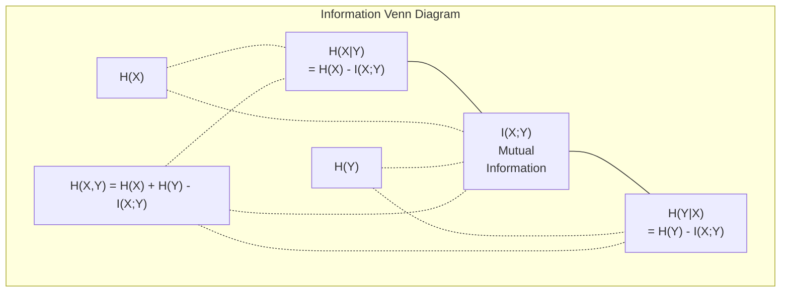

# 信息论

> 信息论度量的是「惊讶程度」。损失函数正是建立在它之上。

**Type:** Learn
**Language:** Python
**Prerequisites:** Phase 1, Lesson 06 (Probability)
**Time:** ~60 minutes

## 学习目标

- 从零计算熵、交叉熵和 KL 散度，并解释三者之间的关系
- 推导为什么最小化交叉熵损失等价于最大化对数似然
- 计算特征与目标之间的互信息，用来对特征重要性排序
- 解释困惑度（perplexity）：它表示语言模型在做选择时的有效词表大小

## 问题背景

你训练的每个分类模型都会调用 `CrossEntropyLoss()`。每篇语言模型论文里都能看到「困惑度」。在 VAE、蒸馏和 RLHF 中你都会读到 KL 散度。这些并不是彼此孤立的概念——它们其实是同一个思想戴着不同的帽子。

信息论为你提供了一套用来推理不确定性、压缩和预测的语言。Claude Shannon 在 1948 年为解决通信问题发明了它。结果发现，训练神经网络也是一个通信问题：模型试图把正确的标签通过由学习到的权重构成的噪声信道传输出去。

本课会从零构建每一个公式，让你看清它们从何而来、为何有效。

## 核心概念

### 信息量（惊讶程度）

当一件不太可能的事发生时，它携带的信息更多。硬币掷出正面？不意外。中了彩票？非常意外。

一个概率为 p 的事件的信息量（information content）是：

```
I(x) = -log(p(x))
```

以 2 为底的对数给出的单位是比特（bit），以自然对数为底给出的单位是奈特（nat）。同一个概念，不同的单位。

```
Event              Probability    Surprise (bits)
Fair coin heads    0.5            1.0
Rolling a 6        0.167          2.58
1-in-1000 event    0.001          9.97
Certain event      1.0            0.0
```

必然发生的事件携带的信息量为零。你早就知道它一定会发生。

### 熵（平均惊讶程度）

熵（entropy）是一个分布所有可能结果上的期望惊讶程度。

```
H(P) = -sum( p(x) * log(p(x)) )  for all x
```

公平硬币在二元变量中拥有最大熵：1 比特。一枚有偏的硬币（99% 正面）熵很低：0.08 比特。你早已知道结果会是什么，所以每次抛掷几乎告诉不了你任何新信息。

```
Fair coin:    H = -(0.5 * log2(0.5) + 0.5 * log2(0.5)) = 1.0 bit
Biased coin:  H = -(0.99 * log2(0.99) + 0.01 * log2(0.01)) = 0.08 bits
```

熵衡量的是一个分布中不可消除的不确定性。你无法把数据压缩到熵以下。

### 交叉熵（你每天都在用的损失函数）

交叉熵（cross-entropy）衡量的是：当事件实际来自分布 P，而你用分布 Q 去编码它们时的平均惊讶程度。

```
H(P, Q) = -sum( p(x) * log(q(x)) )  for all x
```

P 是真实分布（标签），Q 是模型的预测。如果 Q 与 P 完全一致，交叉熵就等于熵。任何不匹配都会让它变大。

在分类任务中，P 是一个 one-hot 向量（真实类别概率为 1，其余全为 0）。这把交叉熵简化为：

```
H(P, Q) = -log(q(true_class))
```

这就是分类任务交叉熵损失的全部公式：最大化正确类别的预测概率。

### KL 散度（分布之间的距离）

KL 散度（KL divergence）衡量的是：用 Q 替代 P 会带来多少额外的惊讶。

```
D_KL(P || Q) = sum( p(x) * log(p(x) / q(x)) )  for all x
             = H(P, Q) - H(P)
```

交叉熵等于熵加 KL 散度。由于训练期间真实分布的熵是常数，最小化交叉熵就等同于最小化 KL 散度——你在把模型的分布推向真实分布。

KL 散度不是对称的：D_KL(P || Q) != D_KL(Q || P)。它并不是一个真正的距离度量。

### 互信息

互信息（mutual information）衡量的是：知道一个变量能告诉你多少关于另一个变量的信息。

```
I(X; Y) = H(X) - H(X|Y)
        = H(X) + H(Y) - H(X, Y)
```

如果 X 和 Y 相互独立，互信息为零——知道其中一个对了解另一个毫无帮助。如果它们完全相关，互信息就等于任意一个变量的熵。

在特征选择中，特征与目标之间互信息高，说明这个特征有用；互信息低，说明它只是噪声。

### 条件熵

H(Y|X) 衡量的是：观测到 X 之后，关于 Y 还剩下多少不确定性。

```
H(Y|X) = H(X,Y) - H(X)
```

两个极端：
- 如果 X 完全决定 Y，那么 H(Y|X) = 0。知道 X 就消除了关于 Y 的全部不确定性。例如：X = 摄氏温度，Y = 华氏温度。
- 如果 X 对 Y 毫无信息，那么 H(Y|X) = H(Y)。知道 X 完全不会减少你的不确定性。例如：X = 抛硬币结果，Y = 明天的天气。

条件熵始终非负，且不会超过 H(Y)：

```
0 <= H(Y|X) <= H(Y)
```

在机器学习中，条件熵出现在决策树里。每次分裂时，算法会选择使 H(Y|X) 最小的特征 X——也就是能最大程度消除标签 Y 不确定性的那个特征。

### 联合熵

H(X,Y) 是 X 和 Y 联合分布的熵。

```
H(X,Y) = -sum sum p(x,y) * log(p(x,y))   for all x, y
```

关键性质：

```
H(X,Y) <= H(X) + H(Y)
```

当 X 和 Y 相互独立时取等号。如果它们共享信息，联合熵就会小于各自熵之和。「缺失」的那部分熵恰好就是互信息。



这些关系：
- H(X,Y) = H(X) + H(Y|X) = H(Y) + H(X|Y)
- I(X;Y) = H(X) - H(X|Y) = H(Y) - H(Y|X)
- H(X,Y) = H(X) + H(Y) - I(X;Y)

### 互信息（深入解析）

互信息 I(X;Y) 量化的是：知道一个变量能在多大程度上减少对另一个变量的不确定性。

```
I(X;Y) = H(X) - H(X|Y)
       = H(Y) - H(Y|X)
       = H(X) + H(Y) - H(X,Y)
       = sum sum p(x,y) * log(p(x,y) / (p(x) * p(y)))
```

性质：
- 恒有 I(X;Y) >= 0。观测到新信息永远不会让你损失信息。
- I(X;Y) = 0 当且仅当 X 与 Y 独立。
- I(X;Y) = I(Y;X)。它是对称的，这一点不同于 KL 散度。
- I(X;X) = H(X)。一个变量与自身共享全部信息。

**用互信息做特征选择。** 在机器学习中，你需要对目标有信息量的特征。互信息提供了一种有原则的特征排序方法：

1. 对每个特征 X_i，计算 I(X_i; Y)，其中 Y 是目标变量。
2. 按互信息得分对特征排序。
3. 保留得分最高的前 k 个特征。

无论特征与目标之间是什么关系——线性、非线性、单调或非单调——这种方法都有效。相关系数只能捕捉线性关系，互信息则能捕捉一切。

| 方法 | 能检测的关系 | 计算开销 | 支持类别变量？ |
|--------|---------|-------------------|---------------------|
| Pearson 相关系数 | 线性关系 | O(n) | 否 |
| Spearman 相关系数 | 单调关系 | O(n log n) | 否 |
| 互信息 | 任意统计依赖 | 分箱后 O(n log n) | 是 |

### 标签平滑与交叉熵

标准分类使用硬目标：[0, 0, 1, 0]。真实类别概率为 1，其余为 0。标签平滑（label smoothing）用软目标取而代之：

```
soft_target = (1 - epsilon) * hard_target + epsilon / num_classes
```

当 epsilon = 0.1、类别数为 4 时：
- 硬目标：[0, 0, 1, 0]
- 软目标：[0.025, 0.025, 0.925, 0.025]

从信息论的角度看，标签平滑增加了目标分布的熵。硬 one-hot 目标的熵为 0——没有任何不确定性。软目标的熵则是正的。

它为什么有用：
- 防止模型把 logits 推向极端值（在交叉熵下，要完美拟合 one-hot 目标需要无穷大的 logits）
- 起到正则化作用：模型不能 100% 自信
- 改善校准：预测概率能更好地反映真实的不确定性
- 缩小训练与推理行为之间的差距

带标签平滑的交叉熵损失变为：

```
L = (1 - epsilon) * CE(hard_target, prediction) + epsilon * H_uniform(prediction)
```

第二项惩罚远离均匀分布的预测——这是对置信度的直接正则化。

### 为什么交叉熵是分类损失的不二之选

三种视角，同一个结论。

**信息论视角。** 交叉熵衡量的是：用模型的分布而非真实分布编码现实，会浪费多少比特。最小化它，就是让你的模型成为对现实最高效的编码器。

**最大似然视角。** 对 N 个训练样本及其真实类别 y_i：

```
Likelihood     = product( q(y_i) )
Log-likelihood = sum( log(q(y_i)) )
Negative log-likelihood = -sum( log(q(y_i)) )
```

最后一行就是交叉熵损失。最小化交叉熵 = 最大化训练数据在你的模型下的似然。

**梯度视角。** 交叉熵对 logits 的梯度就是简单的（预测值 - 真实值）。干净、稳定、计算快。这正是它与 softmax 完美配对的原因。

### 比特 vs 奈特

唯一的区别在于对数的底。

```
log base 2   -> bits      (information theory tradition)
log base e   -> nats      (machine learning convention)
log base 10  -> hartleys  (rarely used)
```

1 奈特 = 1/ln(2) 比特 = 1.4427 比特。PyTorch 和 TensorFlow 默认使用自然对数（奈特）。

### 困惑度

困惑度（perplexity）是交叉熵的指数。它告诉你：模型在多少个等可能的选项之间犹豫不决（有效选项数）。

```
Perplexity = 2^H(P,Q)   (if using bits)
Perplexity = e^H(P,Q)   (if using nats)
```

一个困惑度为 50 的语言模型，平均而言，其困惑程度相当于要在 50 个可能的下一个 token 中均匀地随机挑选。越低越好。

GPT-2 在常见基准上的困惑度约为 30。现代模型在数据充分覆盖的领域已经降到了个位数。

```figure
entropy-kl
```

## 从零实现

### 第 1 步：信息量与熵

```python
import math

def information_content(p, base=2):
    if p <= 0 or p > 1:
        return float('inf') if p <= 0 else 0.0
    return -math.log(p) / math.log(base)

def entropy(probs, base=2):
    return sum(
        p * information_content(p, base)
        for p in probs if p > 0
    )

fair_coin = [0.5, 0.5]
biased_coin = [0.99, 0.01]
fair_die = [1/6] * 6

print(f"Fair coin entropy:   {entropy(fair_coin):.4f} bits")
print(f"Biased coin entropy: {entropy(biased_coin):.4f} bits")
print(f"Fair die entropy:    {entropy(fair_die):.4f} bits")
```

### 第 2 步：交叉熵与 KL 散度

```python
def cross_entropy(p, q, base=2):
    total = 0.0
    for pi, qi in zip(p, q):
        if pi > 0:
            if qi <= 0:
                return float('inf')
            total += pi * (-math.log(qi) / math.log(base))
    return total

def kl_divergence(p, q, base=2):
    return cross_entropy(p, q, base) - entropy(p, base)

true_dist = [0.7, 0.2, 0.1]
good_model = [0.6, 0.25, 0.15]
bad_model = [0.1, 0.1, 0.8]

print(f"Entropy of true dist:     {entropy(true_dist):.4f} bits")
print(f"CE (good model):          {cross_entropy(true_dist, good_model):.4f} bits")
print(f"CE (bad model):           {cross_entropy(true_dist, bad_model):.4f} bits")
print(f"KL divergence (good):     {kl_divergence(true_dist, good_model):.4f} bits")
print(f"KL divergence (bad):      {kl_divergence(true_dist, bad_model):.4f} bits")
```

### 第 3 步：作为分类损失的交叉熵

```python
def softmax(logits):
    max_logit = max(logits)
    exps = [math.exp(z - max_logit) for z in logits]
    total = sum(exps)
    return [e / total for e in exps]

def cross_entropy_loss(true_class, logits):
    probs = softmax(logits)
    return -math.log(probs[true_class])

logits = [2.0, 1.0, 0.1]
true_class = 0

probs = softmax(logits)
loss = cross_entropy_loss(true_class, logits)

print(f"Logits:      {logits}")
print(f"Softmax:     {[f'{p:.4f}' for p in probs]}")
print(f"True class:  {true_class}")
print(f"Loss:        {loss:.4f} nats")
print(f"Perplexity:  {math.exp(loss):.2f}")
```

### 第 4 步：交叉熵等于负对数似然

```python
import random

random.seed(42)

n_samples = 1000
n_classes = 3
true_labels = [random.randint(0, n_classes - 1) for _ in range(n_samples)]
model_logits = [[random.gauss(0, 1) for _ in range(n_classes)] for _ in range(n_samples)]

ce_loss = sum(
    cross_entropy_loss(label, logits)
    for label, logits in zip(true_labels, model_logits)
) / n_samples

nll = -sum(
    math.log(softmax(logits)[label])
    for label, logits in zip(true_labels, model_logits)
) / n_samples

print(f"Cross-entropy loss:      {ce_loss:.6f}")
print(f"Negative log-likelihood: {nll:.6f}")
print(f"Difference:              {abs(ce_loss - nll):.2e}")
```

### 第 5 步：互信息

```python
def mutual_information(joint_probs, base=2):
    rows = len(joint_probs)
    cols = len(joint_probs[0])

    margin_x = [sum(joint_probs[i][j] for j in range(cols)) for i in range(rows)]
    margin_y = [sum(joint_probs[i][j] for i in range(rows)) for j in range(cols)]

    mi = 0.0
    for i in range(rows):
        for j in range(cols):
            pxy = joint_probs[i][j]
            if pxy > 0:
                mi += pxy * math.log(pxy / (margin_x[i] * margin_y[j])) / math.log(base)
    return mi

independent = [[0.25, 0.25], [0.25, 0.25]]
dependent = [[0.45, 0.05], [0.05, 0.45]]

print(f"MI (independent): {mutual_information(independent):.4f} bits")
print(f"MI (dependent):   {mutual_information(dependent):.4f} bits")
```

## 生产实践

用 NumPy 实现同样的概念，这也是你在实践中真正使用它们的方式：

```python
import numpy as np

def np_entropy(p):
    p = np.asarray(p, dtype=float)
    mask = p > 0
    result = np.zeros_like(p)
    result[mask] = p[mask] * np.log(p[mask])
    return -result.sum()

def np_cross_entropy(p, q):
    p, q = np.asarray(p, dtype=float), np.asarray(q, dtype=float)
    mask = p > 0
    return -(p[mask] * np.log(q[mask])).sum()

def np_kl_divergence(p, q):
    return np_cross_entropy(p, q) - np_entropy(p)

true = np.array([0.7, 0.2, 0.1])
pred = np.array([0.6, 0.25, 0.15])
print(f"Entropy:    {np_entropy(true):.4f} nats")
print(f"Cross-ent:  {np_cross_entropy(true, pred):.4f} nats")
print(f"KL div:     {np_kl_divergence(true, pred):.4f} nats")
```

你已经从零实现了 `torch.nn.CrossEntropyLoss()` 内部的全部逻辑。现在你知道训练时损失下降的真正含义了：模型的预测分布正在逐渐逼近真实分布，而度量单位是被浪费的信息奈特数。

## 练习

1. 假设英文字母服从均匀分布（26 个字母），计算其熵。然后用实际字母频率估算熵。哪个更高？为什么？

2. 某模型对一个真实类别为 1 的样本输出 logits [5.0, 2.0, 0.5]。手工计算交叉熵损失，再用你的 `cross_entropy_loss` 函数验证。什么样的 logits 会使损失为零？

3. 证明 KL 散度不对称。选取两个分布 P 和 Q，计算 D_KL(P || Q) 和 D_KL(Q || P)，并解释它们为什么不同。

4. 编写一个函数，为一段 token 预测序列计算困惑度。给定一组 (true_token_index, predicted_logits) 对，返回该序列的困惑度。

## 关键术语

| 术语 | 大家怎么说 | 实际含义 |
|------|----------------|----------------------|
| 信息量 | 「惊讶程度」 | 编码一个事件所需的比特（或奈特）数：-log(p) |
| 熵 | 「随机性」 | 一个分布所有结果上的平均惊讶程度。衡量不可消除的不确定性。 |
| 交叉熵 | 「那个损失函数」 | 用模型分布 Q 编码来自真实分布 P 的事件时的平均惊讶程度。 |
| KL 散度 | 「分布之间的距离」 | 用 Q 替代 P 浪费的额外比特数。等于交叉熵减去熵。不对称。 |
| 互信息 | 「X 和 Y 有多相关」 | 知道 Y 后对 X 不确定性的减少量。为零表示相互独立。 |
| Softmax | 「把 logits 变成概率」 | 取指数再归一化。把任意实值向量映射为合法的概率分布。 |
| 困惑度 | 「模型有多困惑」 | 交叉熵的指数。模型在每一步做选择时面对的有效词表大小。 |
| 比特 | 「Shannon 的单位」 | 以 2 为底的对数度量的信息。一比特恰好解决一次公平抛硬币的不确定性。 |
| 奈特 | 「机器学习的单位」 | 以自然对数度量的信息。PyTorch 和 TensorFlow 默认使用。 |
| 负对数似然 | 「NLL 损失」 | 对 one-hot 标签而言与交叉熵损失完全相同。最小化它就是最大化正确预测的概率。 |

## 延伸阅读

- [Shannon 1948: A Mathematical Theory of Communication](https://people.math.harvard.edu/~ctm/home/text/others/shannon/entropy/entropy.pdf) - 开山之作，至今仍值得一读
- [Visual Information Theory (Chris Olah)](https://colah.github.io/posts/2015-09-Visual-Information/) - 关于熵和 KL 散度最好的可视化讲解
- [PyTorch CrossEntropyLoss docs](https://pytorch.org/docs/stable/generated/torch.nn.CrossEntropyLoss.html) - 框架如何实现你刚刚亲手构建的东西
