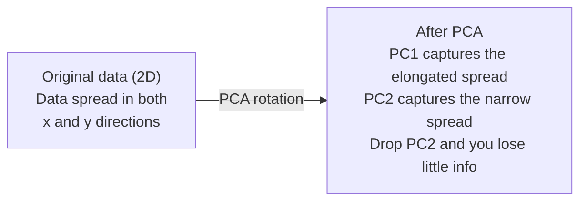

# 降维

> 高维数据是有结构的。只要找对观察角度，就能发现它。

**Type:** Build
**Language:** Python
**Prerequisites:** Phase 1, Lessons 01 (Linear Algebra Intuition), 02 (Vectors, Matrices & Operations), 03 (Eigenvalues & Eigenvectors), 06 (Probability & Distributions)
**Time:** ~90 minutes

## 学习目标

- 从零实现 PCA：中心化数据、计算协方差矩阵、特征分解、投影
- 用解释方差比和肘部法则选择主成分数量
- 比较 PCA、t-SNE 和 UMAP 在 MNIST 手写数字 2D 可视化上的表现，并说明各自的取舍
- 用带 RBF 核的核 PCA 分离标准 PCA 无法处理的非线性数据结构

## 问题背景

你手上有一个每个样本 784 个特征的数据集。可能是手写数字的像素值，可能是基因表达水平，也可能是用户行为信号。784 个维度没法可视化，没法绘图，甚至没法在脑子里想象。

但这 784 个特征大多是冗余的。真正的信息分布在一个小得多的曲面上。描述一个手写的"7"并不需要 784 个独立的数字，只需要几个：笔画的角度、横线的长度、倾斜的程度。剩下的都是噪声。

降维就是找到那个更小的曲面。它把 784 维的数据压缩到 2 维、10 维或 50 维，同时保留真正重要的结构。

## 核心概念

### 维度灾难

高维空间违反直觉。随着维度增长，有三件事会失效。

**距离失去意义。** 在高维空间中，任意两个随机点之间的距离会收敛到同一个值。如果每个点到其他所有点的距离都差不多，最近邻搜索就失效了。

```
Dimension    Avg distance ratio (max/min between random points)
2            ~5.0
10           ~1.8
100          ~1.2
1000         ~1.02
```

**体积集中在角落。** d 维单位超立方体有 2^d 个角。在 100 维中，几乎所有体积都集中在远离中心的角落里。数据点散布到边缘，模型在内部区域会"缺数据"。

**你需要指数级增长的数据量。** 为了在空间中维持相同的样本密度，从 2 维升到 20 维意味着需要 10^18 倍的数据。你永远不可能有这么多。降低维度能把数据密度恢复到可用的水平。

### PCA：找到重要的方向

主成分分析（Principal Component Analysis, PCA）寻找数据变化最大的那些坐标轴。它旋转坐标系，让第一个轴捕获最多的方差，第二个轴捕获次多的方差，依此类推。

算法步骤：

```
1. Center the data        (subtract the mean from each feature)
2. Compute covariance     (how features move together)
3. Eigendecomposition     (find the principal directions)
4. Sort by eigenvalue     (biggest variance first)
5. Project               (keep top k eigenvectors, drop the rest)
```

为什么用特征分解？协方差矩阵是对称的半正定矩阵。它的特征向量是特征空间中相互正交的方向，特征值则告诉你每个方向捕获了多少方差。特征值最大的特征向量正好指向方差最大的方向。



- **PCA 之前：** 数据点云沿对角线方向分布，横跨 x 轴和 y 轴
- **PCA 之后：** 坐标系被旋转，使 PC1 对齐方差最大的方向（拉长的分布），PC2 对齐方差最小的方向（狭窄的分布）
- **降维：** 丢弃 PC2，把数据投影到 PC1 上，损失的信息非常少

### 解释方差比

每个主成分捕获总方差的一部分。解释方差比（explained variance ratio）告诉你具体是多少。

```
Component    Eigenvalue    Explained ratio    Cumulative
PC1          4.73          0.473              0.473
PC2          2.51          0.251              0.724
PC3          1.12          0.112              0.836
PC4          0.89          0.089              0.925
...
```

当累计解释方差达到 0.95 时，你就知道这些主成分捕获了 95% 的信息。之后的部分基本都是噪声。

### 选择主成分数量

三种策略：

1. **阈值法。** 保留足够多的主成分，使解释方差达到 90-95%。
2. **肘部法则。** 绘制每个主成分的解释方差曲线，寻找陡然下降的拐点。
3. **下游任务表现。** 把 PCA 当作预处理步骤，扫描不同的 k 值并测量模型准确率。最佳的 k 就是准确率进入平台期的位置。

### t-SNE：保留邻域结构

t-分布随机邻域嵌入（t-Distributed Stochastic Neighbor Embedding, t-SNE）是为可视化设计的。它把高维数据映射到 2D（或 3D），同时保留哪些点彼此相邻的信息。

直觉是这样的：在原始空间中，基于点对之间的距离计算一个概率分布。距离近的点对概率高，距离远的点对概率低。然后找到一个 2D 排布，使同样的概率分布在其中成立。在 784 维空间中相邻的点，在 2D 中仍然相邻。

t-SNE 的关键性质：
- 非线性。它能展开 PCA 处理不了的复杂流形。
- 随机性。不同的运行会产生不同的布局。
- 困惑度（perplexity）参数控制考虑多少个邻居（典型范围：5-50）。
- 输出中簇与簇之间的距离没有意义，有意义的只是簇本身。
- 在大数据集上很慢，默认复杂度为 O(n^2)。

### UMAP：更快，全局结构更好

均匀流形近似与投影（Uniform Manifold Approximation and Projection, UMAP）的工作方式类似 t-SNE，但有两个优势：
- 更快。它使用近似最近邻图，而不是计算所有点对距离。
- 全局结构更好。输出中簇之间的相对位置往往比 t-SNE 更有意义。

UMAP 在高维空间中构建一个加权图（"模糊拓扑表示"），然后寻找一个尽可能保留这个图的低维布局。

关键参数：
- `n_neighbors`：用多少个邻居定义局部结构（类似于困惑度）。值越大，保留的全局结构越多。
- `min_dist`：输出中点的聚集紧密程度。值越小，簇越致密。

### 何时用哪个

| 方法 | 使用场景 | 保留什么 | 速度 |
|--------|----------|-----------|-------|
| PCA | 训练前的预处理 | 全局方差 | 快（精确解），可处理百万级样本 |
| PCA | 快速探索性可视化 | 线性结构 | 快 |
| t-SNE | 发表级 2D 图 | 局部邻域 | 慢（理想样本数 < 10k） |
| UMAP | 大规模 2D 可视化 | 局部 + 部分全局结构 | 中等（可处理百万级） |
| PCA | 模型的特征降维 | 按方差排序的特征 | 快 |
| t-SNE / UMAP | 理解簇结构 | 簇间分离度 | 中到慢 |

经验法则：预处理和数据压缩用 PCA；需要在 2D 中可视化结构时用 t-SNE 或 UMAP。

### 核 PCA

标准 PCA 寻找线性子空间。它旋转坐标系并丢弃坐标轴。但如果数据分布在非线性流形上呢？2D 平面上的一个圆无法被任何直线分开，标准 PCA 帮不上忙。

核 PCA（Kernel PCA）在核函数诱导的高维特征空间中应用 PCA，而无需显式计算该空间中的坐标。这就是核技巧（kernel trick）——和 SVM 背后是同一个思想。

算法步骤：
1. 计算核矩阵 K，其中 K_ij = k(x_i, x_j)
2. 在特征空间中对核矩阵做中心化
3. 对中心化后的核矩阵做特征分解
4. 前若干个特征向量（按 1/sqrt(eigenvalue) 缩放）就是投影结果

常用核函数：

| 核函数 | 公式 | 适用场景 |
|--------|---------|----------|
| RBF（高斯） | exp(-gamma * \|\|x - y\|\|^2) | 大多数非线性数据、光滑流形 |
| 多项式 | (x . y + c)^d | 多项式关系 |
| Sigmoid | tanh(alpha * x . y + c) | 类神经网络的映射 |

何时用核 PCA、何时用标准 PCA：

| 标准 | 标准 PCA | 核 PCA |
|-----------|-------------|------------|
| 数据结构 | 线性子空间 | 非线性流形 |
| 速度 | O(min(n^2 d, d^2 n)) | O(n^2 d + n^3) |
| 可解释性 | 主成分是特征的线性组合 | 主成分没有直接的特征层面解释 |
| 可扩展性 | 可处理百万级样本 | 核矩阵是 n x n，受内存限制 |
| 重构 | 直接逆变换 | 需要原像（pre-image）近似 |

经典例子：2D 平面上的同心圆。两圈点，一圈套着另一圈。标准 PCA 把两者投影到同一条直线上——对分类毫无用处。带 RBF 核的核 PCA 把内圈和外圈映射到不同区域，使它们线性可分。

### 重构误差

你的降维做得有多好？你把 784 维压缩到了 50 维，损失了什么？

测量重构误差：
1. 把数据投影到 k 维：X_reduced = X @ W_k
2. 重构：X_hat = X_reduced @ W_k^T
3. 计算 MSE：mean((X - X_hat)^2)

对于 PCA，重构误差和解释方差之间有一个简洁的关系：

```
Reconstruction error = sum of eigenvalues NOT included
Total variance = sum of ALL eigenvalues
Fraction lost = (sum of dropped eigenvalues) / (sum of all eigenvalues)
```

每个主成分的解释方差比为：

```
explained_ratio_k = eigenvalue_k / sum(all eigenvalues)
```

以主成分数量为横轴绘制累计解释方差，就得到"肘部"曲线。合适的主成分数量出现在以下位置：
- 曲线趋于平缓（收益递减）
- 累计方差越过你设定的阈值（通常为 0.90 或 0.95）
- 下游任务表现进入平台期

重构误差的用途不止于选择 k。你还可以用它做异常检测：重构误差高的样本就是不符合所学子空间的离群点。这正是生产系统中基于 PCA 的异常检测的原理。

```figure
pca-axes
```

## 从零实现

### Step 1: 从零实现 PCA

```python
import numpy as np

class PCA:
    def __init__(self, n_components):
        self.n_components = n_components
        self.components = None
        self.mean = None
        self.eigenvalues = None
        self.explained_variance_ratio_ = None

    def fit(self, X):
        self.mean = np.mean(X, axis=0)
        X_centered = X - self.mean

        cov_matrix = np.cov(X_centered, rowvar=False)

        eigenvalues, eigenvectors = np.linalg.eigh(cov_matrix)

        sorted_idx = np.argsort(eigenvalues)[::-1]
        eigenvalues = eigenvalues[sorted_idx]
        eigenvectors = eigenvectors[:, sorted_idx]

        self.components = eigenvectors[:, :self.n_components].T
        self.eigenvalues = eigenvalues[:self.n_components]
        total_var = np.sum(eigenvalues)
        self.explained_variance_ratio_ = self.eigenvalues / total_var

        return self

    def transform(self, X):
        X_centered = X - self.mean
        return X_centered @ self.components.T

    def fit_transform(self, X):
        self.fit(X)
        return self.transform(X)
```

### Step 2: 在合成数据上测试

```python
np.random.seed(42)
n_samples = 500

t = np.random.uniform(0, 2 * np.pi, n_samples)
x1 = 3 * np.cos(t) + np.random.normal(0, 0.2, n_samples)
x2 = 3 * np.sin(t) + np.random.normal(0, 0.2, n_samples)
x3 = 0.5 * x1 + 0.3 * x2 + np.random.normal(0, 0.1, n_samples)

X_synthetic = np.column_stack([x1, x2, x3])

pca = PCA(n_components=2)
X_reduced = pca.fit_transform(X_synthetic)

print(f"Original shape: {X_synthetic.shape}")
print(f"Reduced shape:  {X_reduced.shape}")
print(f"Explained variance ratios: {pca.explained_variance_ratio_}")
print(f"Total variance captured: {sum(pca.explained_variance_ratio_):.4f}")
```

### Step 3: MNIST 手写数字的 2D 投影

```python
from sklearn.datasets import fetch_openml

mnist = fetch_openml("mnist_784", version=1, as_frame=False, parser="auto")
X_mnist = mnist.data[:5000].astype(float)
y_mnist = mnist.target[:5000].astype(int)

pca_mnist = PCA(n_components=50)
X_pca50 = pca_mnist.fit_transform(X_mnist)
print(f"50 components capture {sum(pca_mnist.explained_variance_ratio_):.2%} of variance")

pca_2d = PCA(n_components=2)
X_pca2d = pca_2d.fit_transform(X_mnist)
print(f"2 components capture {sum(pca_2d.explained_variance_ratio_):.2%} of variance")
```

### Step 4: 与 sklearn 对比

```python
from sklearn.decomposition import PCA as SklearnPCA
from sklearn.manifold import TSNE

sklearn_pca = SklearnPCA(n_components=2)
X_sklearn_pca = sklearn_pca.fit_transform(X_mnist)

print(f"\nOur PCA explained variance:     {pca_2d.explained_variance_ratio_}")
print(f"Sklearn PCA explained variance: {sklearn_pca.explained_variance_ratio_}")

diff = np.abs(np.abs(X_pca2d) - np.abs(X_sklearn_pca))
print(f"Max absolute difference: {diff.max():.10f}")

tsne = TSNE(n_components=2, perplexity=30, random_state=42)
X_tsne = tsne.fit_transform(X_mnist)
print(f"\nt-SNE output shape: {X_tsne.shape}")
```

### Step 5: UMAP 对比

```python
try:
    from umap import UMAP

    reducer = UMAP(n_components=2, n_neighbors=15, min_dist=0.1, random_state=42)
    X_umap = reducer.fit_transform(X_mnist)
    print(f"UMAP output shape: {X_umap.shape}")
except ImportError:
    print("Install umap-learn: pip install umap-learn")
```

## 生产实践

把 PCA 用作分类器之前的预处理：

```python
from sklearn.decomposition import PCA as SklearnPCA
from sklearn.linear_model import LogisticRegression
from sklearn.model_selection import train_test_split
from sklearn.metrics import accuracy_score

X_train, X_test, y_train, y_test = train_test_split(
    X_mnist, y_mnist, test_size=0.2, random_state=42
)

results = {}
for k in [10, 30, 50, 100, 200]:
    pca_k = SklearnPCA(n_components=k)
    X_tr = pca_k.fit_transform(X_train)
    X_te = pca_k.transform(X_test)

    clf = LogisticRegression(max_iter=1000, random_state=42)
    clf.fit(X_tr, y_train)
    acc = accuracy_score(y_test, clf.predict(X_te))
    var_captured = sum(pca_k.explained_variance_ratio_)
    results[k] = (acc, var_captured)
    print(f"k={k:>3d}  accuracy={acc:.4f}  variance={var_captured:.4f}")
```

性能远在 784 维之前就进入了平台期。那个平台期就是你的工作点。

## 交付产物

本节课的产出：
- `outputs/skill-dimensionality-reduction.md` - 一份用于为给定任务选择合适降维技术的技能文档

## 练习

1. 修改 PCA 类以支持 `inverse_transform`。分别用 10、50、200 个主成分重构 MNIST 数字，并打印每种情况的重构误差（与原图的均方差）。

2. 在同一份 MNIST 子集上分别用困惑度 5、30、100 运行 t-SNE。描述输出如何变化。为什么困惑度会影响簇的紧密程度？

3. 取一个有 50 个特征但只有 5 个特征携带信息的数据集（用 `sklearn.datasets.make_classification` 生成一个）。应用 PCA，检查解释方差曲线是否能正确识别出数据实际上是 5 维的。

## 关键术语

| 术语 | 人们怎么说 | 实际含义 |
|------|----------------|----------------------|
| 维度灾难 | "特征太多了" | 随着维度增长，距离、体积和数据密度的行为都违反直觉。模型需要指数级增长的数据来补偿。 |
| PCA | "降维" | 旋转坐标系，使坐标轴对齐方差最大的方向，然后丢弃低方差的轴。 |
| 主成分 | "一个重要的方向" | 协方差矩阵的一个特征向量。特征空间中数据变化最大的方向。 |
| 解释方差比 | "这个成分包含多少信息" | 单个主成分捕获的总方差比例。把前 k 个比例加起来，就能看出 k 个主成分保留了多少信息。 |
| 协方差矩阵 | "特征之间的相关性" | 一个对称矩阵，第 (i,j) 个元素衡量特征 i 和特征 j 如何协同变化。对角线元素是各特征自身的方差。 |
| t-SNE | "那种聚类图" | 一种非线性方法，通过保留点对之间的邻域概率把高维数据映射到 2D。适合可视化，不适合做预处理。 |
| UMAP | "更快的 t-SNE" | 一种基于拓扑数据分析的非线性方法。同时保留局部结构和部分全局结构，比 t-SNE 扩展性更好。 |
| 困惑度 | "t-SNE 的一个旋钮" | 控制每个点考虑的有效邻居数量。低困惑度聚焦于非常局部的结构，高困惑度捕获更宏观的模式。 |
| 流形 | "数据所在的曲面" | 嵌入在高维空间中的低维曲面。一张在 3D 中揉皱的纸就是一个 2D 流形。 |

## 延伸阅读

- [A Tutorial on Principal Component Analysis](https://arxiv.org/abs/1404.1100)（Shlens）- 从头开始清晰推导 PCA
- [How to Use t-SNE Effectively](https://distill.pub/2016/misread-tsne/)（Wattenberg et al.）- 关于 t-SNE 常见陷阱和参数选择的交互式指南
- [UMAP documentation](https://umap-learn.readthedocs.io/) - 来自 UMAP 作者的理论与实践指导
