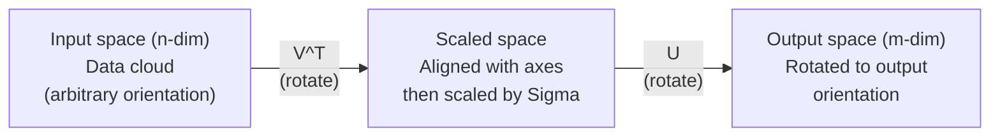
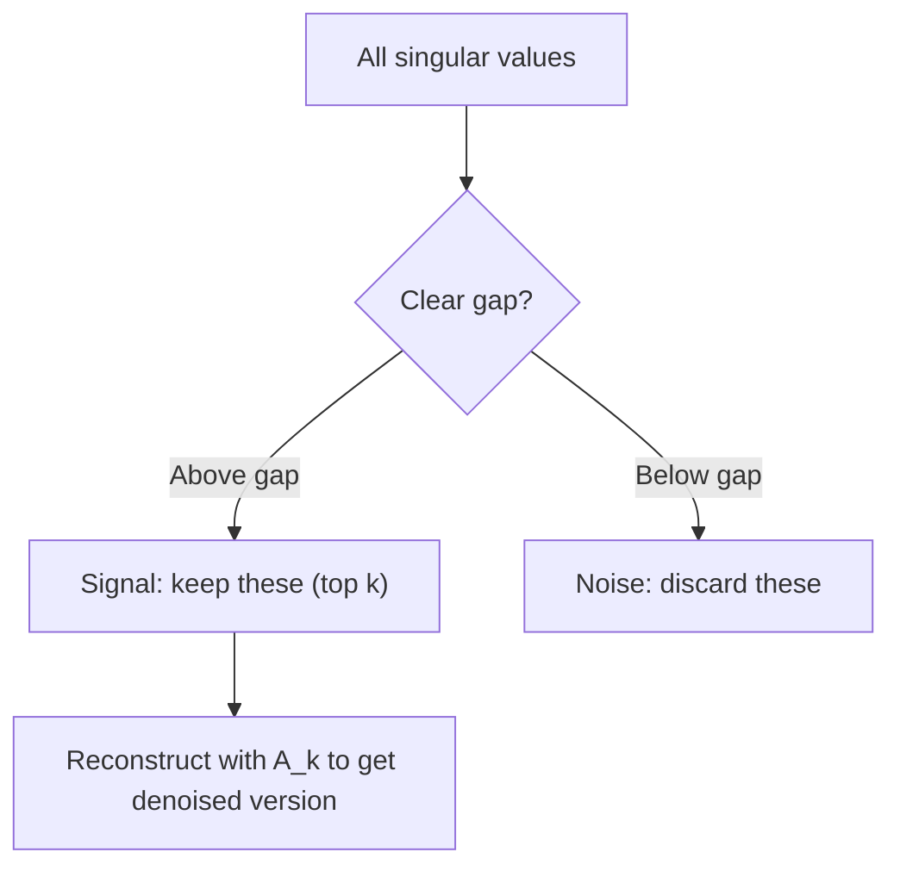

# 奇异值分解

> SVD 是线性代数里的瑞士军刀。任何矩阵都有 SVD，任何数据科学家都离不开它。

**Type:** Build
**Languages:** Python, Julia
**Prerequisites:** Phase 1, Lessons 01 (Linear Algebra Intuition), 02 (Vectors & Matrices Operations), 03 (Matrix Transformations)
**Time:** ~120 minutes

## 学习目标

- 用幂迭代实现 SVD，并解释 U、Sigma 和 V^T 的几何含义
- 用截断 SVD 做图像压缩，并衡量压缩比与重建误差之间的权衡
- 通过 SVD 计算 Moore-Penrose 伪逆，求解超定最小二乘系统
- 把 SVD 与 PCA、推荐系统（潜在因子）以及 NLP 中的潜在语义分析联系起来

## 问题背景

你手里有一个 1000x2000 的矩阵。它可能是用户对电影的评分，可能是文档-词项频率表，也可能是一张图像的像素值。你需要压缩它、去噪、找出其中的隐藏结构，或者用它求解最小二乘系统。特征分解只适用于方阵，而且还要求矩阵拥有一组完整的线性无关特征向量。

SVD 对任何矩阵都适用。任何形状，任何秩，没有任何前提条件。它把矩阵分解成三个因子，揭示出这个矩阵对空间所做变换的几何本质。它是整个线性代数中最通用、最有用的分解。

## 核心概念

### SVD 在几何上做了什么

任何矩阵，不论形状如何，都依次执行三步操作：旋转、缩放、旋转。SVD 把这种分解显式地写了出来。

```
A = U * Sigma * V^T

      m x n     m x m    m x n    n x n
     (any)    (rotate)  (scale)  (rotate)
```

给定任意矩阵 A，SVD 将其分解为：
- V^T 在输入空间（n 维）中旋转向量
- Sigma 沿每个坐标轴缩放（拉伸或压缩）
- U 把结果旋转到输出空间（m 维）



可以这样理解：你把一个矩阵交给 SVD，它告诉你："这个矩阵把一个由输入组成的球面，先用 V^T 旋转，再用 Sigma 拉伸成一个椭球，最后用 U 把椭球旋转一下。"奇异值就是椭球各轴的长度。

### 完整分解

对于形状为 m x n 的矩阵 A：

```
A = U * Sigma * V^T

where:
  U     is m x m, orthogonal (U^T U = I)
  Sigma is m x n, diagonal (singular values on the diagonal)
  V     is n x n, orthogonal (V^T V = I)

The singular values sigma_1 >= sigma_2 >= ... >= sigma_r > 0
where r = rank(A)
```

U 的各列称为左奇异向量（left singular vectors），V 的各列称为右奇异向量（right singular vectors），Sigma 的对角元素称为奇异值（singular values）。奇异值总是非负的，并且按惯例从大到小排列。

### 左奇异向量、奇异值、右奇异向量

SVD 的每个组成部分都有明确的几何含义。

**右奇异向量（V 的各列）：** 它们构成输入空间（R^n）的一组标准正交基，是输入空间中被矩阵映射到输出空间中相互正交方向的那些方向。可以把它们看作定义域的天然坐标系。

**奇异值（Sigma 的对角线）：** 它们是缩放因子。第 i 个奇异值告诉你矩阵沿第 i 个右奇异向量方向把向量拉伸了多少。奇异值为零意味着矩阵把该方向完全压扁。

**左奇异向量（U 的各列）：** 它们构成输出空间（R^m）的一组标准正交基。第 i 个左奇异向量是第 i 个右奇异向量（经缩放后）在输出空间中落到的方向。

三者之间的关系：

```
A * v_i = sigma_i * u_i

The matrix A takes the i-th right singular vector v_i,
scales it by sigma_i, and maps it to the i-th left singular vector u_i.
```

这让你能够逐坐标地看清任何矩阵在做什么。

### 外积形式

SVD 可以写成一组秩 1 矩阵之和：

```
A = sigma_1 * u_1 * v_1^T + sigma_2 * u_2 * v_2^T + ... + sigma_r * u_r * v_r^T

Each term sigma_i * u_i * v_i^T is a rank-1 matrix (an outer product).
The full matrix is the sum of r such matrices, where r is the rank.
```

这个形式是低秩近似的基础。每一项都增加一层结构：第一项捕捉最重要的模式，第二项捕捉次重要的模式，依此类推。截断这个求和，就能在任意给定的秩上得到最佳近似。

```
Rank-1 approx:    A_1 = sigma_1 * u_1 * v_1^T
                  (captures the dominant pattern)

Rank-2 approx:    A_2 = sigma_1 * u_1 * v_1^T + sigma_2 * u_2 * v_2^T
                  (captures the two most important patterns)

Rank-k approx:    A_k = sum of top k terms
                  (optimal by the Eckart-Young theorem)
```

### 与特征分解的关系

SVD 与特征分解有着深层联系。A 的奇异值和奇异向量直接来自 A^T A 和 A A^T 的特征值与特征向量。

```
A^T A = V * Sigma^T * U^T * U * Sigma * V^T
      = V * Sigma^T * Sigma * V^T
      = V * D * V^T

where D = Sigma^T * Sigma is a diagonal matrix with sigma_i^2 on the diagonal.

So:
- The right singular vectors (V) are eigenvectors of A^T A
- The singular values squared (sigma_i^2) are eigenvalues of A^T A

Similarly:
A A^T = U * Sigma * V^T * V * Sigma^T * U^T
      = U * Sigma * Sigma^T * U^T

So:
- The left singular vectors (U) are eigenvectors of A A^T
- The eigenvalues of A A^T are also sigma_i^2
```

这个联系告诉你三件事：
1. 奇异值永远是非负实数（它们是半正定矩阵特征值的平方根）。
2. 你可以通过对 A^T A 做特征分解来计算 SVD，但这会把条件数平方，损失数值精度。专用的 SVD 算法避免了这一点。
3. 当 A 是对称半正定方阵时，SVD 和特征分解就是同一回事。

### 截断 SVD：低秩近似

Eckart-Young-Mirsky 定理指出：只保留前 k 个奇异值及其对应的向量，就能得到 A 的最佳 rank-k 近似（无论按 Frobenius 范数还是谱范数衡量）：

```
A_k = U_k * Sigma_k * V_k^T

where:
  U_k     is m x k  (first k columns of U)
  Sigma_k is k x k  (top-left k x k block of Sigma)
  V_k     is n x k  (first k columns of V)

Approximation error = sigma_{k+1}  (in spectral norm)
                    = sqrt(sigma_{k+1}^2 + ... + sigma_r^2)  (in Frobenius norm)
```

这不只是"一个还不错"的近似，而是可证明的最佳 rank-k 近似。没有任何其他 rank-k 矩阵能比它更接近 A。

| 分量 | 相对大小 | 是否保留在 rank-3 近似中？ |
|-----------|-------------------|------------------------|
| sigma_1 | 最大 | 保留 |
| sigma_2 | 大 | 保留 |
| sigma_3 | 中等偏大 | 保留 |
| sigma_4 | 中等 | 不保留（计入误差） |
| sigma_5 | 中等偏小 | 不保留（计入误差） |
| sigma_6 | 小 | 不保留（计入误差） |
| sigma_7 | 很小 | 不保留（计入误差） |
| sigma_8 | 极小 | 不保留（计入误差） |

保留前 3 个：A_3 捕捉到三个最大的奇异值。误差等于其余各值（sigma_4 到 sigma_8）。

如果奇异值衰减得快，一个很小的 k 就能捕捉矩阵的大部分内容。如果衰减得慢，说明这个矩阵不具备低秩结构。

### 用 SVD 做图像压缩

一张灰度图像就是一个像素强度矩阵。一张 800x600 的图像有 480,000 个数值。SVD 可以用少得多的数值来近似它。

```
Original image: 800 x 600 = 480,000 values

SVD with rank k:
  U_k:      800 x k values
  Sigma_k:  k values
  V_k:      600 x k values
  Total:    k * (800 + 600 + 1) = k * 1401 values

  k=10:   14,010 values   (2.9% of original)
  k=50:   70,050 values  (14.6% of original)
  k=100: 140,100 values  (29.2% of original)

  The compression ratio improves as k gets smaller,
  but visual quality degrades.
```

关键洞察在于：自然图像的奇异值衰减得非常快。前几个奇异值捕捉宏观结构（形状、渐变），后面的奇异值捕捉细节和噪声。在 rank 50 处截断，往往能得到一张看起来与原图几乎一样的图像，而存储量却减少了 85%。

### SVD 在推荐系统中的应用

Netflix Prize 让这个方法名声大噪。你有一个用户-电影评分矩阵，其中大部分条目是缺失的。

```
             Movie1  Movie2  Movie3  Movie4  Movie5
  User1      [  5      ?       3       ?       1  ]
  User2      [  ?      4       ?       2       ?  ]
  User3      [  3      ?       5       ?       ?  ]
  User4      [  ?      ?       ?       4       3  ]

  ? = unknown rating
```

核心想法：这个评分矩阵是低秩的。用户的口味并不是完全相互独立的，少数几个潜在因子（latent factors，比如动作片对文艺片、老片对新片、烧脑对感官刺激）就能解释绝大多数偏好。

对（填补缺失值后的）评分矩阵做 SVD，会得到：
- U：潜在因子空间中的用户画像
- Sigma：每个潜在因子的重要程度
- V^T：潜在因子空间中的电影画像

某个用户对某部电影的预测评分，就是其用户画像与该电影画像的点积（按奇异值加权）。低秩近似会把缺失的条目填补出来。

实践中会使用 Simon Funk 的增量 SVD 或 ALS（交替最小二乘）等能直接处理缺失数据的变体。但核心思想不变：通过 SVD 做潜在因子分解。

### SVD 在 NLP 中的应用：潜在语义分析

潜在语义分析（Latent Semantic Analysis，LSA），也称潜在语义索引（Latent Semantic Indexing，LSI），是把 SVD 应用于词项-文档矩阵。

```
             Doc1   Doc2   Doc3   Doc4
  "cat"      [  3      0      1      0  ]
  "dog"      [  2      0      0      1  ]
  "fish"     [  0      4      1      0  ]
  "pet"      [  1      1      1      1  ]
  "ocean"    [  0      3      0      0  ]

After SVD with rank k=2:

  Each document becomes a point in 2D "concept space."
  Each term becomes a point in the same 2D space.
  Documents about similar topics cluster together.
  Terms with similar meanings cluster together.

  "cat" and "dog" end up near each other (land pets).
  "fish" and "ocean" end up near each other (water concepts).
  Doc1 and Doc3 cluster if they share similar topics.
```

LSA 是最早能从原始文本中捕捉语义相似性的成功方法之一。它之所以有效，是因为同义词倾向于出现在相似的文档中，于是 SVD 会把它们归入相同的潜在维度。现代词嵌入（Word2Vec、GloVe）可以看作这一思想的后裔。

### 用 SVD 降噪

含噪数据的信号集中在前几个最大的奇异值上，而噪声则分散在所有奇异值上。截断可以去掉噪声底。

**干净信号的奇异值：**

| 分量 | 大小 | 类型 |
|-----------|-----------|------|
| sigma_1 | 非常大 | 信号 |
| sigma_2 | 大 | 信号 |
| sigma_3 | 中等 | 信号 |
| sigma_4 | 接近零 | 可忽略 |
| sigma_5 | 接近零 | 可忽略 |

**含噪信号的奇异值（噪声叠加到所有分量上）：**

| 分量 | 大小 | 类型 |
|-----------|-----------|------|
| sigma_1 | 非常大 | 信号 |
| sigma_2 | 大 | 信号 |
| sigma_3 | 中等 | 信号 |
| sigma_4 | 小 | 噪声 |
| sigma_5 | 小 | 噪声 |
| sigma_6 | 小 | 噪声 |
| sigma_7 | 小 | 噪声 |



这种方法广泛应用于信号处理、科学测量和数据清洗。只要矩阵被加性噪声污染，截断 SVD 就是一种有原则的信号-噪声分离方法。

### 通过 SVD 求伪逆

Moore-Penrose 伪逆 A+ 把矩阵求逆推广到了非方阵和奇异矩阵。借助 SVD，计算它变得非常简单。

```
If A = U * Sigma * V^T, then:

A+ = V * Sigma+ * U^T

where Sigma+ is formed by:
  1. Transpose Sigma (swap rows and columns)
  2. Replace each non-zero diagonal entry sigma_i with 1/sigma_i
  3. Leave zeros as zeros

For A (m x n):      A+ is (n x m)
For Sigma (m x n):  Sigma+ is (n x m)
```

伪逆可以求解最小二乘问题。如果 Ax = b 没有精确解（超定系统），那么 x = A+ b 就是最小二乘解（最小化 ||Ax - b||）。

```
Overdetermined system (more equations than unknowns):

  [1  1]         [3]
  [2  1] x   =   [5]       No exact solution exists.
  [3  1]         [6]

  x_ls = A+ b = V * Sigma+ * U^T * b

  This gives the x that minimizes the sum of squared residuals.
  Same result as the normal equations (A^T A)^(-1) A^T b,
  but numerically more stable.
```

### 数值稳定性优势

对 A^T A 做特征分解会把奇异值平方（A^T A 的特征值是 sigma_i^2）。这等于把条件数也平方了，会放大数值误差。

```
Example:
  A has singular values [1000, 1, 0.001]
  Condition number of A: 1000 / 0.001 = 10^6

  A^T A has eigenvalues [10^6, 1, 10^{-6}]
  Condition number of A^T A: 10^6 / 10^{-6} = 10^{12}

  Computing SVD directly: works with condition number 10^6
  Computing via A^T A:     works with condition number 10^{12}
                           (6 extra digits of precision lost)
```

现代 SVD 算法（Golub-Kahan 双对角化）直接在 A 上运算，从不显式构造 A^T A。这就是为什么你应该始终优先使用 `np.linalg.svd(A)` 而不是 `np.linalg.eig(A.T @ A)`。

### 与 PCA 的联系

PCA 就是对中心化数据做 SVD。这不是类比，而是字面意义上的同一个计算。

```
Given data matrix X (n_samples x n_features), centered (mean subtracted):

Covariance matrix: C = (1/(n-1)) * X^T X

PCA finds eigenvectors of C. But:

  X = U * Sigma * V^T    (SVD of X)

  X^T X = V * Sigma^2 * V^T

  C = (1/(n-1)) * V * Sigma^2 * V^T

So the principal components are exactly the right singular vectors V.
The explained variance for each component is sigma_i^2 / (n-1).

In sklearn, PCA is implemented using SVD, not eigendecomposition.
It is faster and more numerically stable.
```

这意味着你在第 10 课学到的所有降维知识，底层其实都是 SVD。PCA 是 SVD 在机器学习中最常见的应用。

```figure
svd-rank-reconstruction
```

## 从零实现

### 第 1 步：用幂迭代从零实现 SVD

思路：要找到最大的奇异值及其向量，就对 A^T A（或 A A^T）做幂迭代。然后对矩阵做降阶（deflation），重复这个过程求下一个奇异值。

```python
import numpy as np

def power_iteration(M, num_iters=100):
    n = M.shape[1]
    v = np.random.randn(n)
    v = v / np.linalg.norm(v)

    for _ in range(num_iters):
        Mv = M @ v
        v = Mv / np.linalg.norm(Mv)

    eigenvalue = v @ M @ v
    return eigenvalue, v

def svd_from_scratch(A, k=None):
    m, n = A.shape
    if k is None:
        k = min(m, n)

    sigmas = []
    us = []
    vs = []

    A_residual = A.copy().astype(float)

    for _ in range(k):
        AtA = A_residual.T @ A_residual
        eigenvalue, v = power_iteration(AtA, num_iters=200)

        if eigenvalue < 1e-10:
            break

        sigma = np.sqrt(eigenvalue)
        u = A_residual @ v / sigma

        sigmas.append(sigma)
        us.append(u)
        vs.append(v)

        A_residual = A_residual - sigma * np.outer(u, v)

    U = np.column_stack(us) if us else np.empty((m, 0))
    S = np.array(sigmas)
    V = np.column_stack(vs) if vs else np.empty((n, 0))

    return U, S, V
```

### 第 2 步：测试并与 NumPy 对比

```python
np.random.seed(42)
A = np.random.randn(5, 4)

U_ours, S_ours, V_ours = svd_from_scratch(A)
U_np, S_np, Vt_np = np.linalg.svd(A, full_matrices=False)

print("Our singular values:", np.round(S_ours, 4))
print("NumPy singular values:", np.round(S_np, 4))

A_reconstructed = U_ours @ np.diag(S_ours) @ V_ours.T
print(f"Reconstruction error: {np.linalg.norm(A - A_reconstructed):.8f}")
```

### 第 3 步：图像压缩演示

```python
def compress_image_svd(image_matrix, k):
    U, S, Vt = np.linalg.svd(image_matrix, full_matrices=False)
    compressed = U[:, :k] @ np.diag(S[:k]) @ Vt[:k, :]
    return compressed

image = np.random.seed(42)
rows, cols = 200, 300
image = np.random.randn(rows, cols)

for k in [1, 5, 10, 20, 50]:
    compressed = compress_image_svd(image, k)
    error = np.linalg.norm(image - compressed) / np.linalg.norm(image)
    original_size = rows * cols
    compressed_size = k * (rows + cols + 1)
    ratio = compressed_size / original_size
    print(f"k={k:>3d}  error={error:.4f}  storage={ratio:.1%}")
```

### 第 4 步：降噪

```python
np.random.seed(42)
clean = np.outer(np.sin(np.linspace(0, 4*np.pi, 100)),
                 np.cos(np.linspace(0, 2*np.pi, 80)))
noise = 0.3 * np.random.randn(100, 80)
noisy = clean + noise

U, S, Vt = np.linalg.svd(noisy, full_matrices=False)
denoised = U[:, :5] @ np.diag(S[:5]) @ Vt[:5, :]

print(f"Noisy error:    {np.linalg.norm(noisy - clean):.4f}")
print(f"Denoised error: {np.linalg.norm(denoised - clean):.4f}")
print(f"Improvement:    {(1 - np.linalg.norm(denoised - clean) / np.linalg.norm(noisy - clean)):.1%}")
```

### 第 5 步：伪逆

```python
A = np.array([[1, 1], [2, 1], [3, 1]], dtype=float)
b = np.array([3, 5, 6], dtype=float)

U, S, Vt = np.linalg.svd(A, full_matrices=False)
S_inv = np.diag(1.0 / S)
A_pinv = Vt.T @ S_inv @ U.T

x_svd = A_pinv @ b
x_lstsq = np.linalg.lstsq(A, b, rcond=None)[0]
x_pinv = np.linalg.pinv(A) @ b

print(f"SVD pseudoinverse solution:  {x_svd}")
print(f"np.linalg.lstsq solution:   {x_lstsq}")
print(f"np.linalg.pinv solution:    {x_pinv}")
```

## 生产实践

完整可运行的演示代码在 `code/svd.py` 中。运行它可以看到 SVD 在图像压缩、推荐系统、潜在语义分析和降噪中的应用。

```bash
python svd.py
```

Julia 版本在 `code/svd.jl` 中，使用 Julia 内置的 `svd()` 函数和 `LinearAlgebra` 包演示相同的概念。

```bash
julia svd.jl
```

## 交付产物

本课产出：
- `outputs/skill-svd.md` —— 一份技能文档，说明在真实项目中何时以及如何使用 SVD

## 练习

1. 不使用幂迭代，从零实现完整的 SVD。改为对 A^T A 做特征分解来得到 V 和奇异值，再通过 U = A V Sigma^{-1} 计算 U。比较它与幂迭代版本以及 NumPy 在数值精度上的差异。

2. 加载一张真实的灰度图像（或把一张图像转成灰度）。分别在 rank 1、5、10、25、50、100 下压缩它。对每个 rank 计算压缩比和相对误差，找出图像在视觉上达到可接受程度时的 rank。

3. 构建一个迷你推荐系统。创建一个 10x8 的用户-电影评分矩阵，部分条目已知。用行均值填补缺失条目，计算 SVD 并重建一个 rank-3 近似。用重建后的矩阵预测缺失的评分，并验证预测是否合理。

4. 创建一个含 3 个合成主题的 100x50 文档-词项矩阵，每个主题关联 5 个词项。加入噪声后做 SVD，验证前 3 个奇异值远大于其余奇异值。把文档投影到 3 维潜在空间，检查同一主题的文档是否聚在一起。

5. 生成一个干净的低秩矩阵（rank 3，大小 50x40），并加入不同强度的高斯噪声（sigma = 0.1、0.5、1.0、2.0）。对每个噪声强度，从 1 到 40 扫描 k，测量重建结果相对干净矩阵的误差，找到最优截断 rank。画出最优 k 随噪声强度变化的曲线。

## 关键术语

| 术语 | 通俗说法 | 实际含义 |
|------|----------------|----------------------|
| SVD | "分解任何矩阵" | 把 A 分解为 U Sigma V^T，其中 U 和 V 是正交矩阵，Sigma 是对角元素非负的对角矩阵。适用于任何形状的任何矩阵。 |
| 奇异值 | "这个分量有多重要" | Sigma 的第 i 个对角元素。衡量矩阵沿第 i 个主方向的拉伸程度。永远非负，按降序排列。 |
| 左奇异向量 | "输出方向" | U 的一列。第 i 个右奇异向量（经 sigma_i 缩放后）在输出空间中映射到的方向。 |
| 右奇异向量 | "输入方向" | V 的一列。输入空间中被矩阵（经 sigma_i 缩放后）映射到第 i 个左奇异向量的方向。 |
| 截断 SVD | "低秩近似" | 只保留前 k 个奇异值及其向量。得到的是可证明的最佳 rank-k 近似（Eckart-Young 定理）。 |
| 秩 | "真实维度" | 非零奇异值的个数。告诉你矩阵实际使用了多少个独立方向。 |
| 伪逆 | "广义逆" | V Sigma+ U^T。对非零奇异值取倒数，零保持为零。可为非方阵或奇异矩阵求解最小二乘问题。 |
| 条件数 | "对误差有多敏感" | sigma_max / sigma_min。条件数大意味着输入的微小变化会引起输出的剧烈变化。SVD 能直接揭示这一点。 |
| 潜在因子 | "隐藏变量" | SVD 发现的低秩空间中的一个维度。在推荐系统中，一个潜在因子可能对应某种类型偏好；在 NLP 中，可能对应一个主题。 |
| Frobenius 范数 | "矩阵的总大小" | 所有元素平方和的平方根，等于所有奇异值平方和的平方根。用于衡量近似误差。 |
| Eckart-Young 定理 | "SVD 给出最佳压缩" | 对任意目标秩 k，截断 SVD 在所有可能的 rank-k 矩阵中使近似误差最小。 |
| 幂迭代 | "找最大的特征向量" | 反复用矩阵乘一个随机向量并归一化，收敛到对应最大特征值的特征向量。它是许多 SVD 算法的基本构件。 |

## 延伸阅读

- [Gilbert Strang: Linear Algebra and Its Applications, Chapter 7](https://math.mit.edu/~gs/linearalgebra/) —— 对 SVD 及其应用的全面讲解
- [3Blue1Brown: But what is the SVD?](https://www.youtube.com/watch?v=vSczTbgc8Rc) —— SVD 的几何直觉
- [We Recommend a Singular Value Decomposition](https://www.ams.org/publicoutreach/feature-column/fcarc-svd) —— 美国数学学会（AMS）发布的通俗易懂的综述
- [Netflix Prize and Matrix Factorization](https://sifter.org/~simon/journal/20061211.html) —— Simon Funk 关于用 SVD 做推荐的原始博客文章
- [Latent Semantic Analysis](https://en.wikipedia.org/wiki/Latent_semantic_analysis) —— SVD 在 NLP 中的最早应用
- [Numerical Linear Algebra by Trefethen and Bau](https://people.maths.ox.ac.uk/trefethen/text.html) —— 理解 SVD 算法及其数值性质的黄金标准教材
