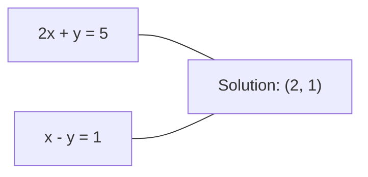
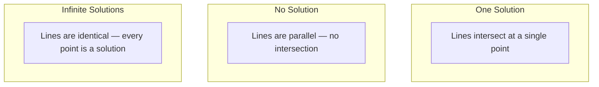

# 线性方程组

> 求解 Ax = b 是数学史上最古老的问题，而它至今仍在驱动你的神经网络。

**Type:** Build
**Language:** Python
**Prerequisites:** Phase 1, Lessons 01 (Linear Algebra Intuition), 02 (Vectors & Matrices), 03 (Matrix Transformations)
**Time:** ~120 minutes

## 学习目标

- 使用带部分主元选取（partial pivoting）的高斯消元法和回代法求解 Ax = b
- 用 LU、QR 和 Cholesky 分解来分解矩阵，并说明各自的适用场景
- 推导最小二乘的正规方程（normal equations），并将其与线性回归和岭回归联系起来
- 利用条件数（condition number）诊断病态方程组，并通过正则化使其稳定

## 问题背景

每次训练线性回归，你都在求解一个线性方程组。每次计算最小二乘拟合，你也在求解一个线性方程组。每当神经网络的某一层计算 `y = Wx + b` 时，它实际上在求一个线性方程组的一侧。当你加入正则化时，你修改了这个方程组。当你使用高斯过程时，你在分解一个矩阵。当你为计算马氏距离（Mahalanobis distance）而求协方差矩阵的逆时，你还是在求解线性方程组。

方程 Ax = b 无处不在。A 是已知系数构成的矩阵，b 是已知输出构成的向量，x 是你要求的未知量向量。在线性回归中，A 是数据矩阵，b 是目标向量，x 是权重向量。整个模型归结为一句话：找到 x，使 Ax 尽可能接近 b。

本节课将从零实现求解这个方程的所有主要方法。你将理解：为什么有些方法快、有些方法稳定；为什么有些方法只适用于方阵系统，而另一些能处理超定系统；以及为什么矩阵的条件数决定了你的答案是否有任何意义。

## 核心概念

### Ax = b 的几何含义

线性方程组有一个几何解释。每个方程定义一个超平面，解就是所有超平面相交的那个点（或点集）。

```
2x + y = 5          Two lines in 2D.
x - y  = 1          They intersect at x=2, y=1.
```



可能出现三种情况：



用矩阵的语言来说，"唯一解"意味着 A 可逆；"无解"意味着方程组不相容；"无穷多解"意味着 A 存在零空间。大多数机器学习问题属于"没有精确解"这一类，因为方程数（数据点）多于未知数（参数）。这正是最小二乘登场的地方。

### 列视角与行视角

读懂 Ax = b 有两种方式。

**行视角。** A 的每一行定义一个方程，每个方程是一个超平面，解就是它们全部相交的位置。

**列视角。** A 的每一列是一个向量。问题变成：A 的各列怎样线性组合才能产生 b？

```
A = | 2  1 |    b = | 5 |
    | 1 -1 |        | 1 |

Row picture: solve 2x + y = 5 and x - y = 1 simultaneously.

Column picture: find x1, x2 such that:
  x1 * [2, 1] + x2 * [1, -1] = [5, 1]
  2 * [2, 1] + 1 * [1, -1] = [4+1, 2-1] = [5, 1]   check.
```

列视角更为本质。如果 b 落在 A 的列空间（column space）中，方程组就有解；如果 b 不在其中，你就去找列空间里离 b 最近的点——这个最近的点就是最小二乘解。

### 高斯消元法

高斯消元法（Gaussian elimination）把 Ax = b 变换成一个上三角方程组 Ux = c，再用回代法（back substitution）求解。它是最直接的方法。

算法如下：

```
1. For each column k (the pivot column):
   a. Find the largest entry in column k at or below row k (partial pivoting).
   b. Swap that row with row k.
   c. For each row i below k:
      - Compute multiplier m = A[i][k] / A[k][k]
      - Subtract m times row k from row i.
2. Back substitute: solve from the last equation upward.
```

示例：

```
Original:
| 2  1  1 | 8 |       R2 = R2 - (2)R1     | 2  1   1 |  8 |
| 4  3  3 |20 |  -->  R3 = R3 - (1)R1 --> | 0  1   1 |  4 |
| 2  3  1 |12 |                            | 0  2   0 |  4 |

                       R3 = R3 - (2)R2     | 2  1   1 |  8 |
                                       --> | 0  1   1 |  4 |
                                           | 0  0  -2 | -4 |

Back substitute:
  -2 * x3 = -4    -->  x3 = 2
  x2 + 2  = 4     -->  x2 = 2
  2*x1 + 2 + 2 = 8 --> x1 = 2
```

高斯消元法的代价是 O(n^3) 次运算。对一个 1000x1000 的方程组，这大约是十亿次浮点运算。已经很快了，但如果你要对同一个 A 求解多个方程组，还可以做得更好。

### 部分主元选取：为什么重要

不做主元选取的高斯消元法可能失败，或者算出垃圾结果。如果主元（pivot）是零，你会除以零；如果主元很小，舍入误差会被放大。

```
Bad pivot:                       With partial pivoting:
| 0.001  1 | 1.001 |            Swap rows first:
| 1      1 | 2     |            | 1      1 | 2     |
                                 | 0.001  1 | 1.001 |
m = 1/0.001 = 1000              m = 0.001/1 = 0.001
R2 = R2 - 1000*R1               R2 = R2 - 0.001*R1
| 0.001  1     | 1.001   |      | 1      1     | 2     |
| 0     -999   | -999.0  |      | 0      0.999 | 0.999 |

x2 = 1.000 (correct)            x2 = 1.000 (correct)
x1 = (1.001 - 1)/0.001          x1 = (2 - 1)/1 = 1.000 (correct)
   = 0.001/0.001 = 1.000        Stable because the multiplier is small.
```

在精度有限的浮点运算中，不选主元的版本可能丢失有效数字。部分主元选取总是挑选当前可用的最大主元，把误差放大降到最低。

### LU 分解

LU 分解把 A 分解为一个下三角矩阵 L 和一个上三角矩阵 U：A = LU。L 矩阵存放高斯消元过程中的乘数，U 矩阵是消元的结果。

```
A = L @ U

| 2  1  1 |   | 1  0  0 |   | 2  1   1 |
| 4  3  3 | = | 2  1  0 | @ | 0  1   1 |
| 2  3  1 |   | 1  2  1 |   | 0  0  -2 |
```

为什么要分解而不是直接消元？因为一旦有了 L 和 U，对任意新的 b 求解 Ax = b 只需要 O(n^2)：

```
Ax = b
LUx = b
Let y = Ux:
  Ly = b    (forward substitution, O(n^2))
  Ux = y    (back substitution, O(n^2))
```

O(n^3) 的代价只在分解时付出一次，之后每次求解都是 O(n^2)。如果你需要对同一个 A、不同的 b 向量求解 1000 个方程组，LU 能在总工作量上节省约 1000/3 倍。

引入部分主元选取后，你得到 PA = LU，其中 P 是记录行交换的置换矩阵。

### QR 分解

QR 分解把 A 分解为一个正交矩阵 Q 和一个上三角矩阵 R：A = QR。

正交矩阵满足 Q^T Q = I，它的各列是标准正交向量。乘以 Q 会保持长度和角度不变。

```
A = Q @ R

Q has orthonormal columns: Q^T Q = I
R is upper triangular

To solve Ax = b:
  QRx = b
  Rx = Q^T b    (just multiply by Q^T, no inversion needed)
  Back substitute to get x.
```

在求解最小二乘问题时，QR 在数值上比 LU 更稳定。Gram-Schmidt 过程逐列构造 Q：

```
Given columns a1, a2, ... of A:

q1 = a1 / ||a1||

q2 = a2 - (a2 . q1) * q1        (subtract projection onto q1)
q2 = q2 / ||q2||                (normalize)

q3 = a3 - (a3 . q1) * q1 - (a3 . q2) * q2
q3 = q3 / ||q3||

R[i][j] = qi . aj    for i <= j
```

每一步都去掉沿之前所有 q 向量的分量，只留下新的正交方向。

### Cholesky 分解

当 A 是对称矩阵（A = A^T）且正定（所有特征值为正）时，可以把它分解为 A = L L^T，其中 L 是下三角矩阵。这就是 Cholesky 分解。

```
A = L @ L^T

| 4  2 |   | 2  0 |   | 2  1 |
| 2  5 | = | 1  2 | @ | 0  2 |

L[i][i] = sqrt(A[i][i] - sum(L[i][k]^2 for k < i))
L[i][j] = (A[i][j] - sum(L[i][k]*L[j][k] for k < j)) / L[j][j]    for i > j
```

Cholesky 的速度是 LU 的两倍，存储需求只有一半。它只适用于对称正定矩阵，但这类矩阵随处可见：

- 协方差矩阵是对称半正定的（加上正则化后变为正定）。
- 高斯过程中的核矩阵是对称正定的。
- 凸函数在极小点处的 Hessian 矩阵是对称正定的。
- A^T A 总是对称半正定的。

在高斯过程中，你先用 Cholesky 分解核矩阵 K，再求解 K alpha = y 得到预测均值。Cholesky 因子还能给出边际似然所需的对数行列式：log det(K) = 2 * sum(log(diag(L)))。

### 最小二乘：当 Ax = b 没有精确解时

如果 A 是 m x n 矩阵且 m > n（方程多于未知数），方程组就是超定的（overdetermined），不存在精确解。这时改为最小化平方误差：

```
minimize ||Ax - b||^2

This is the sum of squared residuals:
  sum((A[i,:] @ x - b[i])^2 for i in range(m))
```

最小值点满足正规方程：

```
A^T A x = A^T b
```

推导：展开 ||Ax - b||^2 = (Ax - b)^T (Ax - b) = x^T A^T A x - 2 x^T A^T b + b^T b。对 x 求梯度并令其为零：2 A^T A x - 2 A^T b = 0。

```
Original system (overdetermined, 4 equations, 2 unknowns):
| 1  1 |         | 3 |
| 1  2 | x     = | 5 |       No exact x satisfies all 4 equations.
| 1  3 |         | 6 |
| 1  4 |         | 8 |

Normal equations:
A^T A = | 4  10 |    A^T b = | 22 |
        | 10 30 |            | 63 |

Solve: x = [1.5, 1.7]

This is linear regression. x[0] is the intercept, x[1] is the slope.
```

### 正规方程 = 线性回归

二者的联系是严格成立的。在线性回归中，数据矩阵 X 每行对应一个样本，每列对应一个特征；目标向量 y 每个样本一个条目。权重向量 w 满足：

```
X^T X w = X^T y
w = (X^T X)^(-1) X^T y
```

这就是线性回归的闭式解。每一次调用 `sklearn.linear_model.LinearRegression.fit()` 都在计算它（或通过 QR、SVD 计算等价形式）。

在矩阵上加一个正则化项 lambda * I，就得到岭回归（ridge regression）：

```
(X^T X + lambda * I) w = X^T y
w = (X^T X + lambda * I)^(-1) X^T y
```

正则化使矩阵的条件更好（求逆更精确），同时把权重向零收缩，从而防止过拟合。当 lambda > 0 时，矩阵 X^T X + lambda * I 总是对称正定的，因此可以用 Cholesky 求解。

### 伪逆（Moore-Penrose）

伪逆 A+ 把矩阵求逆推广到非方阵和奇异矩阵。对任意矩阵 A：

```
x = A+ b

where A+ = V Sigma+ U^T    (computed via SVD)
```

Sigma+ 的构造方式是：对每个非零奇异值取倒数，再把结果转置。如果 A = U Sigma V^T，那么 A+ = V Sigma+ U^T。

```
A = U Sigma V^T        (SVD)

Sigma = | 5  0 |       Sigma+ = | 1/5  0  0 |
        | 0  2 |                | 0  1/2  0 |
        | 0  0 |

A+ = V Sigma+ U^T
```

伪逆给出最小范数的最小二乘解。如果方程组：
- 有唯一解：A+ b 就是这个解。
- 无解：A+ b 给出最小二乘解。
- 有无穷多解：A+ b 给出其中 ||x|| 最小的那个。

NumPy 的 `np.linalg.lstsq` 和 `np.linalg.pinv` 内部都使用 SVD。

### 条件数

条件数衡量解对输入微小扰动的敏感程度。对矩阵 A，条件数定义为：

```
kappa(A) = ||A|| * ||A^(-1)|| = sigma_max / sigma_min
```

其中 sigma_max 和 sigma_min 分别是最大和最小的奇异值。

```
Well-conditioned (kappa ~ 1):        Ill-conditioned (kappa ~ 10^15):
Small change in b -->                Small change in b -->
small change in x                    huge change in x

| 2  0 |   kappa = 2/1 = 2          | 1   1          |   kappa ~ 10^15
| 0  1 |   safe to solve            | 1   1+10^(-15) |   solution is garbage
```

经验法则：
- kappa < 100：安全，解是准确的。
- kappa ~ 10^k：浮点运算大约会损失 k 位有效数字。
- kappa ~ 10^16（对 float64 而言）：解毫无意义，矩阵实际上已经是奇异的。

在机器学习中，特征接近共线时就会出现病态（ill-conditioning）。正则化（加上 lambda * I）把条件数从 sigma_max / sigma_min 改善为 (sigma_max + lambda) / (sigma_min + lambda)。

### 迭代方法：共轭梯度

对于非常大的稀疏方程组（数百万个未知数），LU 或 Cholesky 这类直接方法代价太高。迭代方法从一个初始猜测出发，通过多轮迭代逐步逼近解。

共轭梯度法（conjugate gradient，CG）求解 A 为对称正定矩阵的 Ax = b。在精确算术下，它最多 n 次迭代就能找到精确解；如果 A 的特征值聚集在一起，通常收敛得快得多。

```
Algorithm sketch:
  x0 = initial guess (often zero)
  r0 = b - A x0           (residual)
  p0 = r0                 (search direction)

  For k = 0, 1, 2, ...:
    alpha = (rk . rk) / (pk . A pk)
    x_{k+1} = xk + alpha * pk
    r_{k+1} = rk - alpha * A pk
    beta = (r_{k+1} . r_{k+1}) / (rk . rk)
    p_{k+1} = r_{k+1} + beta * pk
    if ||r_{k+1}|| < tolerance: stop
```

CG 的应用包括：

- 大规模优化（Newton-CG 方法）
- 求解偏微分方程的离散化方程组
- 核矩阵太大无法分解的核方法
- 为其他迭代求解器做预条件处理（preconditioning）

收敛速度取决于条件数。条件越好的方程组收敛越快——这是正则化有用的又一个原因。

### 全景图：什么时候用哪种方法

| 方法 | 要求 | 代价 | 适用场景 |
|--------|-------------|------|----------|
| 高斯消元法 | 方阵、非奇异的 A | O(n^3) | 一次性求解方阵系统 |
| LU 分解 | 方阵、非奇异的 A | O(n^3) 分解 + O(n^2) 求解 | 对同一个 A 多次求解 |
| QR 分解 | 任意 A（m >= n） | O(mn^2) | 最小二乘，数值稳定 |
| Cholesky | 对称正定的 A | O(n^3/3) | 协方差矩阵、高斯过程、岭回归 |
| 正规方程 | 超定系统（m > n） | O(mn^2 + n^3) | 线性回归（n 较小时） |
| SVD / 伪逆 | 任意 A | O(mn^2) | 秩亏系统、最小范数解 |
| 共轭梯度 | 对称正定且稀疏的 A | O(n * k * nnz) | 大型稀疏系统，k 为迭代次数 |

### 与机器学习的联系

本节课的每种方法都出现在生产环境的机器学习中：

**线性回归。** 闭式解就是求解正规方程 X^T X w = X^T y。实现上通常用 Cholesky（n 较小时）、QR（看重数值稳定性时）或 SVD（矩阵可能秩亏时）。

**岭回归。** 在 X^T X 上加 lambda * I。正则化后的方程组 (X^T X + lambda * I) w = X^T y 总能用 Cholesky 求解，因为 lambda > 0 时 X^T X + lambda * I 是对称正定的。

**高斯过程。** 预测均值需要求解 K alpha = y，其中 K 是核矩阵。标准做法是对 K 做 Cholesky 分解。对数边际似然用到 log det(K) = 2 sum(log(diag(L)))。

**神经网络初始化。** 正交初始化用 QR 分解构造列向量标准正交的权重矩阵，防止深层网络中的信号坍缩。

**预条件处理。** 大规模优化器使用不完全 Cholesky 或不完全 LU 作为共轭梯度求解器的预条件子。

**特征工程。** X^T X 的条件数能告诉你特征是否共线。如果 kappa 很大，就该删特征或加正则化。

```figure
linear-system-conditioning
```

## 从零实现

### 第 1 步：带部分主元选取的高斯消元

```python
import numpy as np

def gaussian_elimination(A, b):
    n = len(b)
    Ab = np.hstack([A.astype(float), b.reshape(-1, 1).astype(float)])

    for k in range(n):
        max_row = k + np.argmax(np.abs(Ab[k:, k]))
        Ab[[k, max_row]] = Ab[[max_row, k]]

        if abs(Ab[k, k]) < 1e-12:
            raise ValueError(f"Matrix is singular or nearly singular at pivot {k}")

        for i in range(k + 1, n):
            m = Ab[i, k] / Ab[k, k]
            Ab[i, k:] -= m * Ab[k, k:]

    x = np.zeros(n)
    for i in range(n - 1, -1, -1):
        x[i] = (Ab[i, -1] - Ab[i, i+1:n] @ x[i+1:n]) / Ab[i, i]

    return x
```

### 第 2 步：LU 分解

```python
def lu_decompose(A):
    n = A.shape[0]
    L = np.eye(n)
    U = A.astype(float).copy()
    P = np.eye(n)

    for k in range(n):
        max_row = k + np.argmax(np.abs(U[k:, k]))
        if max_row != k:
            U[[k, max_row]] = U[[max_row, k]]
            P[[k, max_row]] = P[[max_row, k]]
            if k > 0:
                L[[k, max_row], :k] = L[[max_row, k], :k]

        for i in range(k + 1, n):
            L[i, k] = U[i, k] / U[k, k]
            U[i, k:] -= L[i, k] * U[k, k:]

    return P, L, U

def lu_solve(P, L, U, b):
    n = len(b)
    Pb = P @ b.astype(float)

    y = np.zeros(n)
    for i in range(n):
        y[i] = Pb[i] - L[i, :i] @ y[:i]

    x = np.zeros(n)
    for i in range(n - 1, -1, -1):
        x[i] = (y[i] - U[i, i+1:] @ x[i+1:]) / U[i, i]

    return x
```

### 第 3 步：Cholesky 分解

```python
def cholesky(A):
    n = A.shape[0]
    L = np.zeros_like(A, dtype=float)

    for i in range(n):
        for j in range(i + 1):
            s = A[i, j] - L[i, :j] @ L[j, :j]
            if i == j:
                if s <= 0:
                    raise ValueError("Matrix is not positive definite")
                L[i, j] = np.sqrt(s)
            else:
                L[i, j] = s / L[j, j]

    return L
```

### 第 4 步：用正规方程求最小二乘

```python
def least_squares_normal(A, b):
    AtA = A.T @ A
    Atb = A.T @ b
    return gaussian_elimination(AtA, Atb)

def ridge_regression(A, b, lam):
    n = A.shape[1]
    AtA = A.T @ A + lam * np.eye(n)
    Atb = A.T @ b
    L = cholesky(AtA)
    y = np.zeros(n)
    for i in range(n):
        y[i] = (Atb[i] - L[i, :i] @ y[:i]) / L[i, i]
    x = np.zeros(n)
    for i in range(n - 1, -1, -1):
        x[i] = (y[i] - L.T[i, i+1:] @ x[i+1:]) / L.T[i, i]
    return x
```

### 第 5 步：条件数

```python
def condition_number(A):
    U, S, Vt = np.linalg.svd(A)
    return S[0] / S[-1]
```

## 生产实践

把以上组件组合起来，在真实数据上做线性回归和岭回归：

```python
np.random.seed(42)
X_raw = np.random.randn(100, 3)
w_true = np.array([2.0, -1.0, 0.5])
y = X_raw @ w_true + np.random.randn(100) * 0.1

X = np.column_stack([np.ones(100), X_raw])

w_ols = least_squares_normal(X, y)
print(f"OLS weights (ours):    {w_ols}")

w_np = np.linalg.lstsq(X, y, rcond=None)[0]
print(f"OLS weights (numpy):   {w_np}")
print(f"Max difference: {np.max(np.abs(w_ols - w_np)):.2e}")

w_ridge = ridge_regression(X, y, lam=1.0)
print(f"Ridge weights (ours):  {w_ridge}")

from sklearn.linear_model import Ridge
ridge_sk = Ridge(alpha=1.0, fit_intercept=False)
ridge_sk.fit(X, y)
print(f"Ridge weights (sklearn): {ridge_sk.coef_}")
```

## 交付产物

本节课的产出：
- `code/linear_systems.py`，包含高斯消元、LU 分解、Cholesky 分解、最小二乘和岭回归的从零实现
- 一个可运行的演示，验证正规方程与 sklearn 的 LinearRegression 给出相同的权重

## 练习

1. 分别用你实现的高斯消元、你实现的 LU 求解器和 `np.linalg.solve` 求解方程组 `[[1,2,3],[4,5,6],[7,8,10]] x = [6, 15, 27]`。验证三者在浮点容差范围内给出相同的答案。

2. 生成一个 50x5 的随机矩阵 X 和目标 y = X @ w_true + noise。分别用正规方程、QR（通过 `np.linalg.qr`）、SVD（通过 `np.linalg.svd`）和 `np.linalg.lstsq` 求 w。比较四个解。测量 X^T X 的条件数，并解释它如何影响你对各方法的信任程度。

3. 构造一个近似奇异的矩阵：让两列几乎相同（例如，第 2 列 = 第 1 列 + 1e-10 * noise）。计算它的条件数。分别在有正则化（加 0.01 * I）和无正则化的情况下求解 Ax = b。比较两个解和残差，解释为什么正则化有帮助。

4. 为一个 100x100 的随机对称正定矩阵实现共轭梯度算法。统计收敛到容差 1e-8 需要多少次迭代，并与理论最大值 n 次迭代做比较。

5. 在大小为 10、50、200、500 的对称正定矩阵上，比较你的 Cholesky 求解器、你的 LU 求解器和 `np.linalg.solve` 的耗时。把结果画成图，验证 Cholesky 大约比 LU 快 2 倍。

## 关键术语

| 术语 | 人们怎么说 | 实际含义 |
|------|----------------|----------------------|
| 线性方程组 | "解出 x" | 一组线性方程 Ax = b。求 x 就是找出在变换 A 下产生输出 b 的输入。 |
| 高斯消元法 | "行化简" | 用行运算系统地把对角线以下的元素消成零，得到可用回代法求解的上三角方程组。代价 O(n^3)。 |
| 部分主元选取 | "换行求稳定" | 在第 k 列消元前，把该列中绝对值最大的行交换到主元位置，避免除以小数。 |
| LU 分解 | "分解成三角形" | 把 A 写成 A = LU，其中 L 是下三角矩阵（存放乘数），U 是上三角矩阵（消元后的结果）。把 O(n^3) 的代价摊销到多次求解中。 |
| QR 分解 | "正交分解" | 把 A 写成 A = QR，其中 Q 的列标准正交，R 是上三角矩阵。求最小二乘时比 LU 更稳定。 |
| Cholesky 分解 | "矩阵的平方根" | 对对称正定的 A，写成 A = LL^T。代价只有 LU 的一半。用于协方差矩阵、核矩阵和岭回归。 |
| 最小二乘 | "无法精确求解时的最佳拟合" | 当方程组超定（方程多于未知数）时，最小化残差平方和 \|\|Ax - b\|\|^2。 |
| 正规方程 | "微积分捷径" | A^T A x = A^T b。令 \|\|Ax - b\|\|^2 的梯度为零得到。这就是线性回归的闭式解。 |
| 伪逆 | "非方阵的求逆" | 通过 SVD 得到 A+ = V Sigma+ U^T。对任意矩阵——方阵或长方阵、奇异或非奇异——给出最小范数的最小二乘解。 |
| 条件数 | "这个答案有多可信" | kappa = sigma_max / sigma_min。衡量解对输入扰动的敏感度。大约损失 log10(kappa) 位有效数字。 |
| 岭回归 | "带正则化的最小二乘" | 求解 (X^T X + lambda I) w = X^T y。加上 lambda I 能改善条件数并把权重向零收缩，防止过拟合。 |
| 共轭梯度 | "大矩阵的迭代版 Ax=b" | 针对对称正定系统的迭代求解器。最多 n 步收敛。在分解代价过高的大型稀疏系统中很实用。 |
| 超定系统 | "数据多于参数" | m x n 系统中 m > n。不存在精确解，最小二乘给出最佳近似。每个回归问题都是这种情况。 |
| 回代法 | "从下往上解" | 给定上三角方程组，先解最后一个方程，再逐步向上代入。代价 O(n^2)。 |
| 前代法 | "从上往下解" | 给定下三角方程组，先解第一个方程，再逐步向下代入。代价 O(n^2)。用于 LU 求解中的 L 步骤。 |

## 延伸阅读

- [MIT 18.06: Linear Algebra](https://ocw.mit.edu/courses/18-06-linear-algebra-spring-2010/)（Gilbert Strang）—— 线性方程组与矩阵分解领域最权威的课程
- [Numerical Linear Algebra](https://people.maths.ox.ac.uk/trefethen/text.html)（Trefethen & Bau）—— 理解数值稳定性、条件数以及算法为何失效的标准参考书
- [Matrix Computations](https://www.cs.cornell.edu/cv/GolubVanLoan4/golubandvanloan.htm)（Golub & Van Loan）—— 覆盖所有矩阵算法的百科全书式参考
- [3Blue1Brown: Inverse Matrices](https://www.3blue1brown.com/lessons/inverse-matrices) —— 用可视化直觉理解求解 Ax = b 的几何含义
