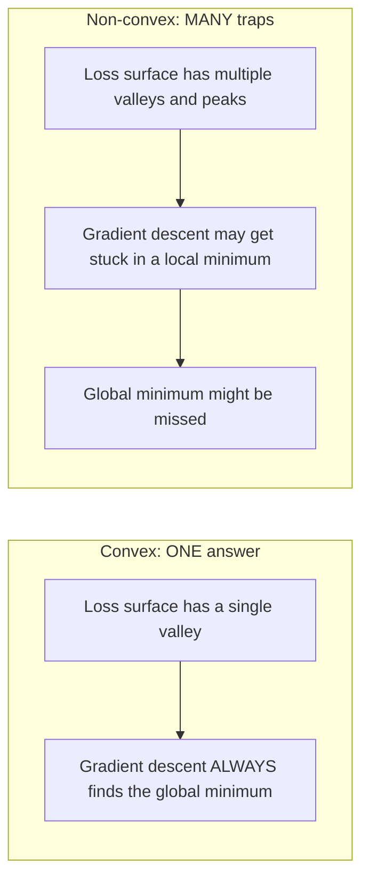
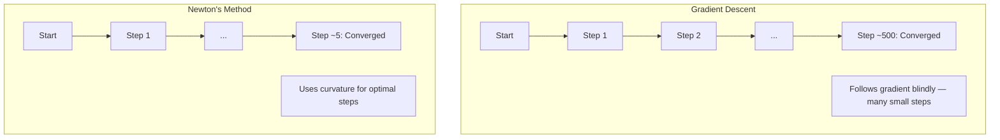
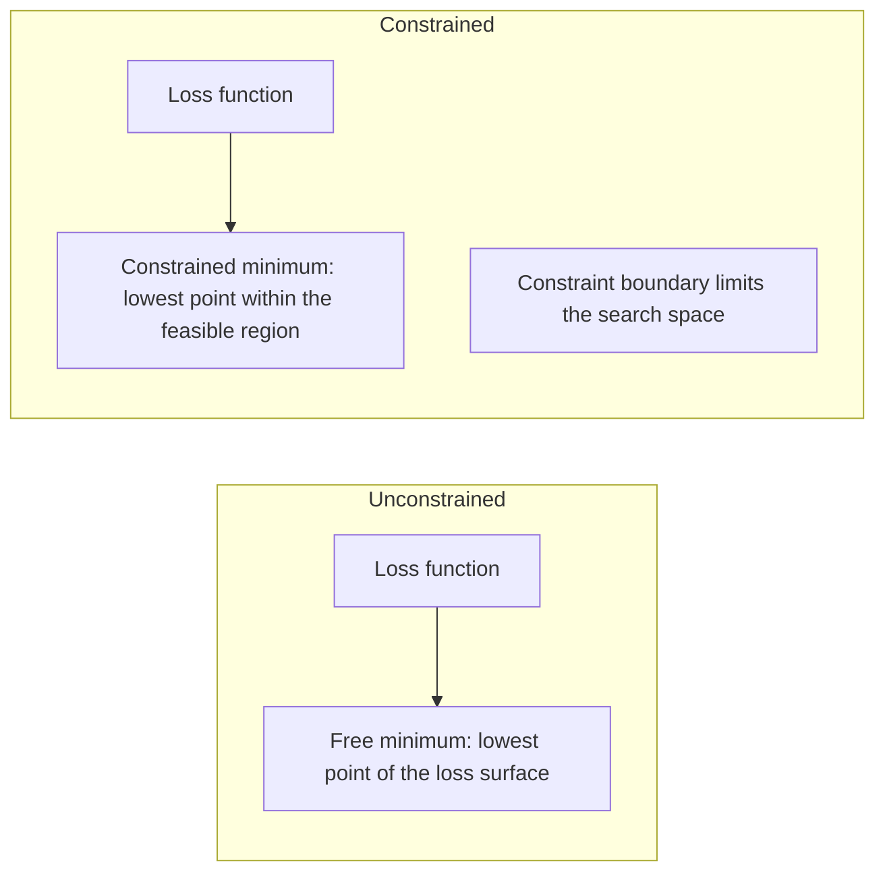
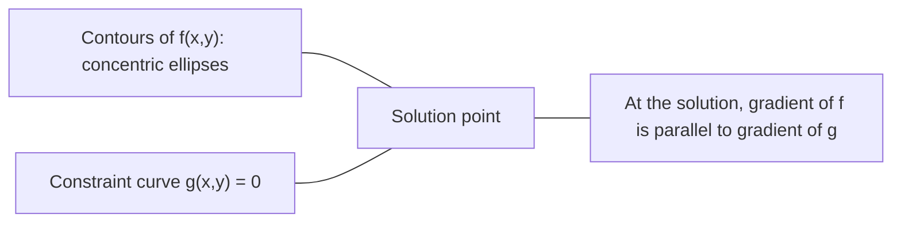

# 凸优化

> 凸问题只有一个谷底，神经网络却有数百万个。分清这两者至关重要。

**Type:** Build
**Language:** Python
**Prerequisites:** Phase 1, Lessons 04 (Calculus for ML), 08 (Optimization)
**Time:** ~90 minutes

## 学习目标

- 使用定义、二阶导数和 Hessian 判据检验一个函数是否为凸函数
- 实现牛顿法（Newton's method），并将其二次收敛速度与梯度下降进行对比
- 使用拉格朗日乘子法求解约束优化问题，并解读 KKT 条件
- 解释为什么神经网络的损失地形是非凸的，而 SGD 仍能找到好的解

## 问题背景

第 08 课教过你梯度下降、动量和 Adam。这些优化器能在任何曲面上往低处走，但不提供任何保证。在非凸地形上，梯度下降可能落入糟糕的局部极小值，可能卡在鞍点上，也可能永远震荡下去。你照样用它，因为神经网络是非凸的，别无选择。

但机器学习中的许多问题其实是凸的：线性回归、逻辑回归、SVM、LASSO、岭回归。对这些问题，存在更强的工具——带数学保证的优化。凸问题恰好只有一个谷底，任何往下走的算法都会到达全局最小值。不需要重启，不需要学习率调度，也不用祈祷。

理解凸性有三个作用。第一，它告诉你问题什么时候简单（凸）、什么时候困难（非凸）。第二，它为凸问题提供了牛顿法这类更快的工具。第三，它解释了贯穿整个机器学习的诸多概念：正则化即约束、SVM 中的对偶性，以及为什么深度学习在违背凸性带来的所有优良性质的情况下依然有效。

## 核心概念

### 凸集

集合 S 是凸集（convex set），当且仅当对 S 中任意两点，连接它们的线段也完全落在 S 内。

| 凸集 | 非凸集 |
|---|---|
| **矩形**：内部任意两点之间的线段都不会离开矩形 | **星形/月牙形**：两个内部点之间的连线可能穿出集合 |
| **三角形**：所有内部点都满足同样的性质 | **圆环（甜甜圈）**：中间的洞使得某些线段会离开集合 |
| 任意两点之间的线段都留在集合内部 | 某些点对之间的线段会跑出集合 |

形式化检验：对 S 中任意点 x、y 以及任意 t ∈ [0, 1]，点 tx + (1-t)y 也在 S 中。

凸集的例子：
- 一条直线、一个平面、整个 R^n
- 球体（圆、球面、超球）
- 半空间：{x : a^T x <= b}
- 任意多个凸集的交集

非凸集的例子：
- 圆环（annulus）
- 两个不相交圆的并集
- 任何带有「凹陷」或「洞」的集合

### 凸函数

函数 f 是凸函数（convex function），当且仅当其定义域是凸集，且对定义域中任意两点 x、y 以及任意 t ∈ [0, 1]：

```
f(tx + (1-t)y) <= t*f(x) + (1-t)*f(y)
```

几何上看：图像上任意两点之间的线段都位于图像之上或恰好落在图像上。

| 性质 | 凸函数 | 非凸函数 |
|---|---|---|
| **线段检验** | 图像上任意两点之间的连线位于曲线**之上或之上重合** | 图像上某些点之间的连线会落到曲线**之下** |
| **形状** | 单一的碗状/谷状，向上弯曲 | 多个峰和谷，曲率方向混杂 |
| **局部极小值** | 每个局部极小值都是全局最小值 | 可能存在多个高度不同的局部极小值 |

常见的凸函数：
- f(x) = x^2（抛物线）
- f(x) = |x|（绝对值）
- f(x) = e^x（指数函数）
- f(x) = max(0, x)（ReLU，分段线性）
- f(x) = -log(x)，x > 0（负对数）
- 任何线性函数 f(x) = a^T x + b（既凸又凹）

### 凸性的检验方法

三种实用检验，从最简单到最严格。

**检验 1：二阶导数检验（一维）。** 若对所有 x 都有 f''(x) >= 0，则 f 是凸的。

- f(x) = x^2：f''(x) = 2 >= 0。凸。
- f(x) = x^3：f''(x) = 6x，在 x < 0 时为负。非凸。
- f(x) = e^x：f''(x) = e^x > 0。凸。

**检验 2：Hessian 检验（多元）。** 若 Hessian 矩阵 H(x) 在所有 x 处都是半正定的，则 f 是凸的。Hessian 是二阶偏导数构成的矩阵。

**检验 3：定义检验。** 直接验证不等式 f(tx + (1-t)y) <= t*f(x) + (1-t)*f(y)。对导数难以计算的函数很有用。

### 凸性为何重要

凸优化的核心定理：

**对于凸函数，每个局部极小值都是全局最小值。**

这意味着梯度下降不可能被困住。任何下坡路径都通向同一个答案，算法保证收敛到最优解。



由此带来的好处：
- 不需要随机重启
- 不需要复杂的学习率调度
- 可以证明收敛性（收敛速率取决于函数性质）
- 解是唯一的（平坦区域除外）

### 机器学习中的凸与非凸

| 问题 | 是否凸？ | 原因 |
|---------|---------|-----|
| 线性回归（MSE） | 是 | 损失关于权重是二次函数 |
| 逻辑回归 | 是 | 对数损失关于权重是凸的 |
| SVM（hinge 损失） | 是 | 线性函数的最大值 |
| LASSO（L1 回归） | 是 | 凸函数之和仍是凸函数 |
| 岭回归（L2） | 是 | 二次项 + 二次项 = 凸 |
| 神经网络（任意损失） | 否 | 非线性激活造成非凸地形 |
| k-means 聚类 | 否 | 离散的分配步骤 |
| 矩阵分解 | 否 | 未知量相乘 |

带凸损失的线性模型是凸的。一旦加入带非线性激活的隐藏层，凸性就被破坏。

### Hessian 矩阵

函数 f: R^n -> R 的 Hessian 矩阵 H 是由二阶偏导数构成的 n x n 矩阵。

```
H[i][j] = d^2 f / (dx_i dx_j)
```

对于 f(x, y) = x^2 + 3xy + y^2：

```
df/dx = 2x + 3y       d^2f/dx^2 = 2      d^2f/dxdy = 3
df/dy = 3x + 2y       d^2f/dydx = 3      d^2f/dy^2 = 2

H = [ 2  3 ]
    [ 3  2 ]
```

Hessian 描述的是曲率：
- 特征值全为正：函数在每个方向上都向上弯曲（在该点是凸的）
- 特征值全为负：在每个方向上都向下弯曲（凹，局部极大值）
- 正负混杂：鞍点（某些方向上凸、另一些方向上凹）
- 存在零特征值：在该方向上是平坦的（退化）

要保证凸性，Hessian 必须在所有点处都半正定（所有特征值 >= 0），而不只是在某一点处。

### 牛顿法

梯度下降使用一阶信息（梯度），牛顿法使用二阶信息（Hessian）。它在当前点拟合一个二次近似，然后直接跳到该二次函数的最小值处。

```
Update rule:
  x_new = x - H^(-1) * gradient

Compare to gradient descent:
  x_new = x - lr * gradient
```

牛顿法用 Hessian 的逆替代标量学习率，根据局部曲率自动调整步长和方向。



优点：
- 在最小值附近二次收敛（误差每步平方级缩小）
- 无需调学习率
- 尺度不变（与问题的参数化方式无关）

缺点：
- 计算 Hessian 需要 O(n^2) 内存，求逆需要 O(n^3) 运算
- 对于 100 万个权重的神经网络，这意味着 10^12 个元素和 10^18 次运算
- 对深度学习不实用

### 约束优化

无约束优化：在所有 x 上最小化 f(x)。
约束优化：在满足约束的前提下最小化 f(x)。

现实问题都带约束。你想最小化成本，但预算有限；你想最小化误差，但模型复杂度受限。



### 拉格朗日乘子法

拉格朗日乘子法（method of Lagrange multipliers）把约束问题转化为无约束问题。

问题：在 g(x) = 0 的约束下最小化 f(x)。

解法：引入一个新变量（拉格朗日乘子 lambda），求解如下无约束问题：

```
L(x, lambda) = f(x) + lambda * g(x)
```

在最优解处，L 的梯度为零：

```
dL/dx = df/dx + lambda * dg/dx = 0
dL/dlambda = g(x) = 0
```

几何直觉：在约束最小值处，f 的梯度必须与约束 g 的梯度平行。如果两者不平行，你就可以沿约束曲面移动，进一步降低 f。



例子：在 x + y = 1 的约束下最小化 f(x,y) = x^2 + y^2。

```
L = x^2 + y^2 + lambda(x + y - 1)

dL/dx = 2x + lambda = 0  =>  x = -lambda/2
dL/dy = 2y + lambda = 0  =>  y = -lambda/2
dL/dlambda = x + y - 1 = 0

From first two: x = y
Substituting: 2x = 1, so x = y = 0.5, lambda = -1
```

直线 x + y = 1 上离原点最近的点是 (0.5, 0.5)。

### KKT 条件

Karush-Kuhn-Tucker 条件把拉格朗日乘子法推广到不等式约束。

问题：在 g_i(x) <= 0（i = 1, ..., m）的约束下最小化 f(x)。

KKT 条件（最优性的必要条件）：

```
1. Stationarity:    df/dx + sum(lambda_i * dg_i/dx) = 0
2. Primal feasibility:  g_i(x) <= 0  for all i
3. Dual feasibility:    lambda_i >= 0  for all i
4. Complementary slackness:  lambda_i * g_i(x) = 0  for all i
```

互补松弛性（complementary slackness）是其中的关键洞见：要么约束是起作用的（g_i = 0，解恰好落在边界上），要么乘子为零（该约束无关紧要）。不影响解的约束对应 lambda = 0。

KKT 条件是 SVM 的核心。支持向量正是约束起作用（lambda > 0）的那些数据点；其余所有数据点的 lambda = 0，不影响决策边界。

### 正则化即约束优化

L1 和 L2 正则化并不是随意的技巧，它们本质上是伪装成惩罚项的约束优化问题。

**L2 正则化（Ridge）：**

```
minimize  Loss(w)  subject to  ||w||^2 <= t

Equivalent unconstrained form:
minimize  Loss(w) + lambda * ||w||^2
```

约束 ||w||^2 <= t 定义了一个球（二维是圆，三维是球面）。最优解位于损失等高线第一次触碰这个球的位置。

**L1 正则化（LASSO）：**

```
minimize  Loss(w)  subject to  ||w||_1 <= t

Equivalent unconstrained form:
minimize  Loss(w) + lambda * ||w||_1
```

约束 ||w||_1 <= t 定义了一个菱形（二维中旋转 45 度的正方形）。

| 性质 | L2 约束（圆） | L1 约束（菱形） |
|---|---|---|
| **约束区域形状** | 圆（高维中是球） | 菱形（二维中旋转的正方形） |
| **损失等高线触碰位置** | 光滑边界——圆上任意一点 | 角点——与坐标轴对齐 |
| **解的行为** | 权重变小但不为零 | 部分权重恰好为零（稀疏） |
| **结果** | 权重收缩 | 特征选择 |

这解释了为什么 L1 产生稀疏模型（特征选择），而 L2 只是收缩权重。菱形的角点与坐标轴对齐，损失等高线更容易触碰到角点，从而把一个或多个权重恰好压到零。

### 对偶性

每个约束优化问题（原问题，primal）都有一个伴生问题（对偶问题，dual）。对凸问题而言，原问题与对偶问题的最优值相等，这称为强对偶性（strong duality）。

拉格朗日对偶函数：

```
Primal: minimize f(x) subject to g(x) <= 0
Lagrangian: L(x, lambda) = f(x) + lambda * g(x)
Dual function: d(lambda) = min_x L(x, lambda)
Dual problem: maximize d(lambda) subject to lambda >= 0
```

对偶性为何重要：
- 对偶问题有时比原问题更容易求解
- SVM 是在对偶形式下求解的，此时问题只依赖数据点之间的点积（从而支持核技巧）
- 对偶为原问题最优值提供下界，可用于检查解的质量

具体到 SVM：

```
Primal: find w, b that maximize the margin 2/||w|| subject to
        y_i(w^T x_i + b) >= 1 for all i

Dual:   maximize sum(alpha_i) - 0.5 * sum_ij(alpha_i * alpha_j * y_i * y_j * x_i^T x_j)
        subject to alpha_i >= 0 and sum(alpha_i * y_i) = 0

The dual only involves dot products x_i^T x_j.
Replace x_i^T x_j with K(x_i, x_j) to get the kernel trick.
```

### 为什么深度学习在非凸下依然有效

神经网络的损失函数是高度非凸的。按一切经典标准，优化它们本应失败，但随机梯度下降却能稳定地找到好的解。有几个因素可以解释这一点。

**多数局部极小值已经够好。** 在高维空间中，随机的临界点（梯度为零的点）绝大多数是鞍点，而不是局部极小值。少数存在的局部极小值，其损失值往往接近全局最小值。当参数空间有数百万个维度时，被困在一个糟糕的局部极小值中的概率极低。

**真正的障碍是鞍点，不是局部极小值。** 对于 n 个参数的函数，鞍点同时具有正曲率方向和负曲率方向。在高维中，随机临界点的全部 n 个特征值都为正（即局部极小值）的概率大约是 2^(-n)。几乎所有临界点都是鞍点，而 SGD 的噪声有助于逃离它们。

**过参数化让地形更平滑。** 参数数量超过训练样本数量的网络，其损失曲面更平滑、连通性更好。更宽的网络拥有更少的糟糕局部极小值。这与直觉相悖，但实验上一直如此。

**损失地形的结构：**

| 性质 | 低维空间 | 高维空间 |
|---|---|---|
| **地形** | 许多孤立的峰和谷 | 平滑连通的山谷 |
| **极小值** | 许多孤立的局部极小值 | 糟糕的局部极小值很少；大多数接近最优 |
| **寻路** | 很难找到全局最小值 | 通向好解的路径很多 |
| **临界点** | 局部极小值和鞍点混杂 | 绝大多数是鞍点，而非局部极小值 |

**随机噪声起到隐式正则化作用。** mini-batch SGD 引入的噪声会阻止优化停留在尖锐极小值中。尖锐极小值过拟合，平坦极小值泛化更好。噪声使优化偏向损失地形中的平坦区域。

### 实践中的二阶方法

纯牛顿法对大模型不实用。有几种近似方法让二阶信息变得可用。

**L-BFGS（Limited-memory BFGS）：** 用最近 m 次梯度差近似 Hessian 的逆，只需 O(mn) 内存而非 O(n^2)。对最多约 10,000 个参数的问题效果很好。用于经典机器学习（逻辑回归、CRF），但不用于深度学习。

**自然梯度（natural gradient）：** 用 Fisher 信息矩阵（对数似然的期望 Hessian）替代标准 Hessian，从而考虑概率分布的几何结构。K-FAC（Kronecker-Factored Approximate Curvature）把 Fisher 矩阵近似为 Kronecker 积，使其对神经网络变得可行。

**Hessian-free 优化：** 用共轭梯度法求解 Hx = g，从不显式构造 H。只需要 Hessian-向量积，而它可以通过自动微分在 O(n) 时间内算出。

**对角近似：** Adam 的二阶矩是对 Hessian 对角线的一种对角近似。AdaHessian 更进一步，通过 Hutchinson 估计器使用真实的 Hessian 对角元素。

| 方法 | 内存 | 单步开销 | 适用场景 |
|--------|--------|--------------|-------------|
| 梯度下降 | O(n) | O(n) | 基线方法，大模型 |
| 牛顿法 | O(n^2) | O(n^3) | 小规模凸问题 |
| L-BFGS | O(mn) | O(mn) | 中等规模凸问题 |
| Adam | O(n) | O(n) | 深度学习默认选择 |
| K-FAC | O(n) | 每层 O(n) | 研究用途，大批量训练 |

```figure
convex-vs-nonconvex
```

## 从零实现

### 第 1 步：凸性检查器

构建一个函数，通过随机采样并验证凸性定义来做经验检验。

```python
import random
import math

def check_convexity(f, dim, bounds=(-5, 5), samples=1000):
    violations = 0
    for _ in range(samples):
        x = [random.uniform(*bounds) for _ in range(dim)]
        y = [random.uniform(*bounds) for _ in range(dim)]
        t = random.uniform(0, 1)
        mid = [t * xi + (1 - t) * yi for xi, yi in zip(x, y)]
        lhs = f(mid)
        rhs = t * f(x) + (1 - t) * f(y)
        if lhs > rhs + 1e-10:
            violations += 1
    return violations == 0, violations
```

### 第 2 步：二维牛顿法

用显式 Hessian 实现牛顿法，并与梯度下降比较收敛速度。

```python
def newtons_method(f, grad_f, hessian_f, x0, steps=50, tol=1e-12):
    x = list(x0)
    history = [x[:]]
    for _ in range(steps):
        g = grad_f(x)
        H = hessian_f(x)
        det = H[0][0] * H[1][1] - H[0][1] * H[1][0]
        if abs(det) < 1e-15:
            break
        H_inv = [
            [H[1][1] / det, -H[0][1] / det],
            [-H[1][0] / det, H[0][0] / det],
        ]
        dx = [
            H_inv[0][0] * g[0] + H_inv[0][1] * g[1],
            H_inv[1][0] * g[0] + H_inv[1][1] * g[1],
        ]
        x = [x[0] - dx[0], x[1] - dx[1]]
        history.append(x[:])
        if sum(gi ** 2 for gi in g) < tol:
            break
    return history
```

### 第 3 步：拉格朗日乘子求解器

通过在拉格朗日函数上做梯度下降来求解约束优化。

```python
def lagrange_solve(f_grad, g_val, g_grad, x0, lr=0.01,
                   lr_lambda=0.01, steps=5000):
    x = list(x0)
    lam = 0.0
    history = []
    for _ in range(steps):
        fg = f_grad(x)
        gv = g_val(x)
        gg = g_grad(x)
        x = [
            xi - lr * (fgi + lam * ggi)
            for xi, fgi, ggi in zip(x, fg, gg)
        ]
        lam = lam + lr_lambda * gv
        history.append((x[:], lam, gv))
    return history
```

### 第 4 步：一阶方法 vs 二阶方法

在同一个二次函数上分别运行梯度下降和牛顿法，统计收敛所需的步数。

```python
def quadratic(x):
    return 5 * x[0] ** 2 + x[1] ** 2

def quadratic_grad(x):
    return [10 * x[0], 2 * x[1]]

def quadratic_hessian(x):
    return [[10, 0], [0, 2]]
```

牛顿法将一步收敛（它对二次函数是精确的）。梯度下降则需要数百步，因为 Hessian 的特征值相差 5 倍，形成了一条狭长的山谷。

## 生产实践

凸性分析在选择机器学习模型和求解器时可以直接派上用场。

对凸问题（逻辑回归、SVM、LASSO）：
- 使用专用求解器（liblinear、CVXPY、设置 method='L-BFGS-B' 的 scipy.optimize.minimize）
- 可以期待唯一的全局最优解
- 二阶方法实用且快速

对非凸问题（神经网络）：
- 使用一阶方法（SGD、Adam）
- 接受解依赖于初始化和随机性这一事实
- 把过参数化、噪声和学习率调度作为隐式正则化手段
- 不要浪费时间寻找全局最小值。一个好的局部极小值就足够了。

```python
from scipy.optimize import minimize

result = minimize(
    fun=lambda w: sum((y - X @ w) ** 2) + 0.1 * sum(w ** 2),
    x0=np.zeros(d),
    method='L-BFGS-B',
    jac=lambda w: -2 * X.T @ (y - X @ w) + 0.2 * w,
)
```

对 SVM 而言，对偶形式让你可以使用核技巧：

```python
from sklearn.svm import SVC

svm = SVC(kernel='rbf', C=1.0)
svm.fit(X_train, y_train)
print(f"Support vectors: {svm.n_support_}")
```

## 练习

1. **凸性图鉴。** 用凸性检查器测试以下函数：f(x) = x^4、f(x) = sin(x)、f(x,y) = x^2 + y^2、f(x,y) = x*y、f(x) = max(x, 0)。解释每个结果为什么合理。

2. **牛顿法与梯度下降的竞赛。** 从起点 (10, 10) 出发，在 f(x,y) = 50*x^2 + y^2 上运行这两种方法。各需要多少步才能使损失 < 1e-10？当条件数（Hessian 最大特征值与最小特征值之比）增大时，梯度下降会发生什么？

3. **拉格朗日乘子的几何。** 在 x + 2y = 4 的约束下最小化 f(x,y) = (x-3)^2 + (y-3)^2。通过验证最优解处 f 的梯度与 g 的梯度平行来核对答案。

4. **正则化约束。** 实现 L1 约束优化：在 |x| + |y| <= 1 的约束下最小化 (x-3)^2 + (y-2)^2。证明解的某个坐标恰好为零（菱形约束带来的稀疏性）。

5. **Hessian 特征值分析。** 计算 Rosenbrock 函数在 (1,1) 和 (-1,1) 处的 Hessian，并求两点处的特征值。这些特征值分别说明了最小值附近与远离最小值处的曲率有什么不同？

## 关键术语

| 术语 | 含义 |
|------|---------------|
| 凸集（convex set） | 集合中任意两点之间的线段都留在集合内部 |
| 凸函数（convex function） | 图像上任意两点之间的连线位于图像之上或与之重合的函数。等价地，Hessian 处处半正定 |
| 局部极小值 | 比附近所有点都低的点。对凸函数而言，每个局部极小值都是全局最小值 |
| 全局最小值 | 函数在整个定义域上的最低点 |
| Hessian 矩阵 | 所有二阶偏导数构成的矩阵，编码曲率信息 |
| 半正定（positive semidefinite） | 特征值全部非负的矩阵。「二阶导数 >= 0」的多维类比 |
| 条件数（condition number） | Hessian 最大特征值与最小特征值之比。条件数大意味着狭长的山谷和缓慢的梯度下降 |
| 牛顿法 | 利用 Hessian 的逆来确定步进方向和步长的二阶优化器。在最小值附近二次收敛 |
| 拉格朗日乘子 | 为把约束优化问题转化为无约束问题而引入的变量 |
| KKT 条件 | 不等式约束下最优性的必要条件，是拉格朗日乘子法的推广 |
| 互补松弛性 | 在最优解处，要么约束起作用，要么其乘子为零，二者绝不同时非零 |
| 对偶性（duality） | 每个约束问题都有一个伴生的对偶问题。对凸问题而言两者最优值相同 |
| 强对偶性 | 原问题与对偶问题的最优值相等。对满足 Slater 条件的凸问题成立 |
| L-BFGS | 近似二阶方法，存储最近 m 次梯度差而非完整 Hessian |
| 鞍点（saddle point） | 梯度为零、但在某些方向上是极小值而在另一些方向上是极大值的点 |
| 过参数化（overparameterization） | 使用比训练样本更多的参数。能平滑损失地形并减少糟糕的局部极小值 |

## 延伸阅读

- [Boyd & Vandenberghe: Convex Optimization](https://web.stanford.edu/~boyd/cvxbook/) - 标准教科书，可在线免费获取
- [Bottou, Curtis, Nocedal: Optimization Methods for Large-Scale Machine Learning (2018)](https://arxiv.org/abs/1606.04838) - 连接凸优化理论与深度学习实践的桥梁
- [Choromanska et al.: The Loss Surfaces of Multilayer Networks (2015)](https://arxiv.org/abs/1412.0233) - 解释为什么非凸的神经网络地形没有看上去那么糟糕
- [Nocedal & Wright: Numerical Optimization](https://link.springer.com/book/10.1007/978-0-387-40065-5) - 牛顿法、L-BFGS 和约束优化的全面参考书
