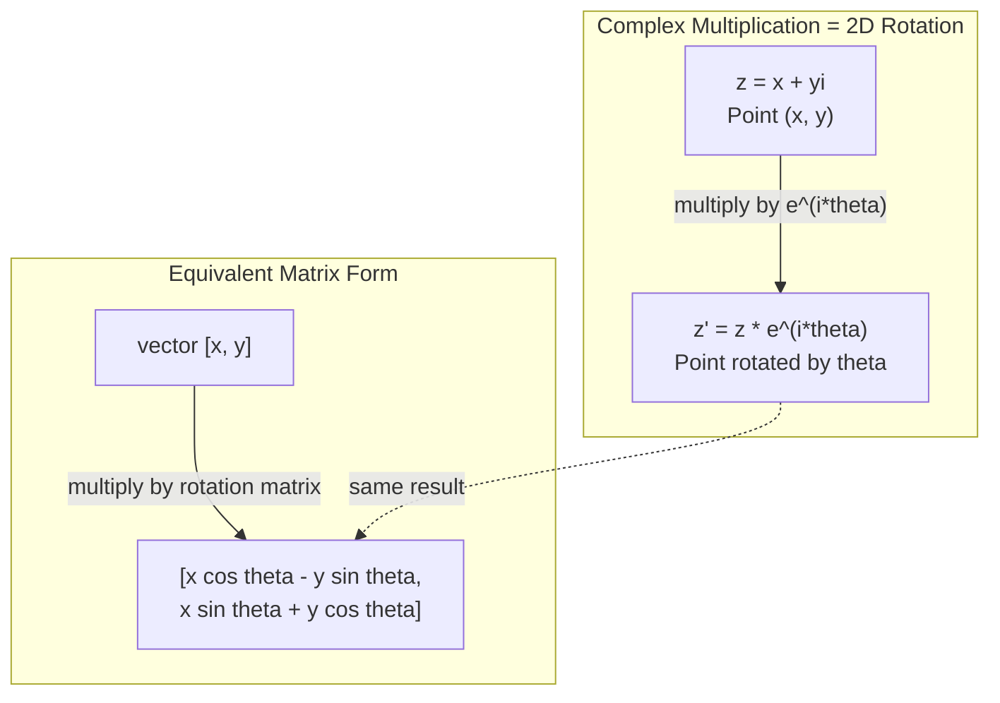
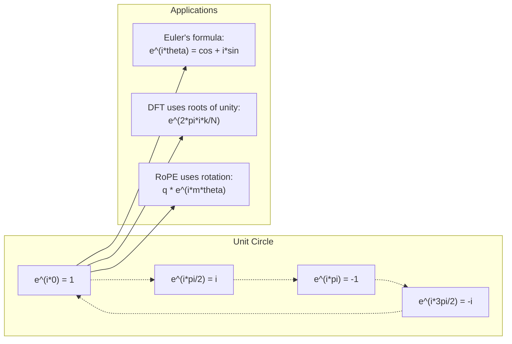

# 面向 AI 的复数

> -1 的平方根并不"虚"。它是理解旋转、频率以及大半个信号处理领域的钥匙。

**Type:** Learn
**Language:** Python
**Prerequisites:** Phase 1, Lessons 01-04 (linear algebra, calculus)
**Time:** ~60 minutes

## 学习目标

- 在直角坐标形式和极坐标形式下进行复数运算（加、乘、除、共轭）
- 运用欧拉公式在复指数与三角函数之间互相转换
- 用单位根（roots of unity）实现离散傅里叶变换（Discrete Fourier Transform）
- 解释复数旋转如何支撑 Transformer 中的 RoPE 和正弦位置编码

## 问题背景

你翻开一篇讲傅里叶变换的论文，满眼都是 `i`。你研究 Transformer 的位置编码，看到不同频率的 `sin` 和 `cos`——它们正是复指数的实部和虚部。你阅读量子计算的资料，发现一切都用复向量空间来表达。

复数看起来很抽象。一个建立在 -1 的平方根之上的数系，感觉像是数学上的小把戏。但它不是把戏，而是描述旋转和振荡的自然语言。任何旋转、振动或振荡的东西，复数都是合适的工具。

不理解复数，你就无法理解离散傅里叶变换，无法理解 FFT，无法理解现代语言模型中的 RoPE（Rotary Position Embedding，旋转位置编码）如何工作，也无法理解最初的 Transformer 论文中正弦位置编码为什么选择那些频率。

这节课从零构建复数运算，把它与几何联系起来，并准确指出复数在机器学习中出现的位置。

## 核心概念

### 什么是复数？

复数由两部分组成：实部和虚部。

```
z = a + bi

where:
  a is the real part
  b is the imaginary part
  i is the imaginary unit, defined by i^2 = -1
```

就这么简单。你把数轴扩展成一个平面：实数落在一条轴上，虚数落在另一条轴上。每个复数都是这个平面上的一个点。

### 复数运算

**加法。** 实部相加，虚部相加。

```
(a + bi) + (c + di) = (a + c) + (b + d)i

Example: (3 + 2i) + (1 + 4i) = 4 + 6i
```

**乘法。** 使用分配律展开，并记住 i^2 = -1。

```
(a + bi)(c + di) = ac + adi + bci + bdi^2
                 = ac + adi + bci - bd
                 = (ac - bd) + (ad + bc)i

Example: (3 + 2i)(1 + 4i) = 3 + 12i + 2i + 8i^2
                            = 3 + 14i - 8
                            = -5 + 14i
```

**共轭。** 把虚部变号。

```
conjugate of (a + bi) = a - bi
```

复数与其共轭的乘积永远是实数：

```
(a + bi)(a - bi) = a^2 + b^2
```

**除法。** 分子分母同乘分母的共轭。

```
(a + bi) / (c + di) = (a + bi)(c - di) / (c^2 + d^2)
```

这一步消去了分母中的虚部，得到一个干净的复数。

### 复平面

复平面把每个复数映射为二维平面上的一个点。横轴是实轴，纵轴是虚轴。

```
z = 3 + 2i  corresponds to the point (3, 2)
z = -1 + 0i corresponds to the point (-1, 0) on the real axis
z = 0 + 4i  corresponds to the point (0, 4) on the imaginary axis
```

一个复数既是一个点，也是一个从原点出发的向量。正是这种双重解释让复数在几何中如此有用。

### 极坐标形式

平面上的任意一点都可以用它到原点的距离和与正实轴的夹角来描述。

```
z = r * (cos(theta) + i*sin(theta))

where:
  r = |z| = sqrt(a^2 + b^2)     (magnitude, or modulus)
  theta = atan2(b, a)             (phase, or argument)
```

直角坐标形式（a + bi）适合做加法，极坐标形式（r, theta）适合做乘法。

**极坐标形式下的乘法。** 模长相乘，角度相加。

```
z1 = r1 * e^(i*theta1)
z2 = r2 * e^(i*theta2)

z1 * z2 = (r1 * r2) * e^(i*(theta1 + theta2))
```

这就是复数特别适合描述旋转的原因。乘以一个模长为 1 的复数，就是一次纯粹的旋转。

### 欧拉公式

连接复指数与三角函数的桥梁：

```
e^(i*theta) = cos(theta) + i*sin(theta)
```

这是本节课最重要的公式。当 theta = pi 时：

```
e^(i*pi) = cos(pi) + i*sin(pi) = -1 + 0i = -1

Therefore: e^(i*pi) + 1 = 0
```

五个基本常数（e、i、pi、1、0）在一个等式中相遇。

### 为什么欧拉公式对 ML 很重要

欧拉公式表明，随着 theta 变化，`e^(i*theta)` 在单位圆上移动。theta = 0 时，你在 (1, 0)；theta = pi/2 时，你在 (0, 1)；theta = pi 时，你在 (-1, 0)；theta = 3*pi/2 时，你在 (0, -1)。theta = 2*pi 正好转一整圈。

这意味着复指数本身就是旋转。而旋转在信号处理和 ML 中无处不在。

### 与二维旋转的联系

把复数 (x + yi) 乘以 e^(i*theta)，就是把点 (x, y) 绕原点旋转角度 theta。

```
Rotation via complex multiplication:
  (x + yi) * (cos(theta) + i*sin(theta))
  = (x*cos(theta) - y*sin(theta)) + (x*sin(theta) + y*cos(theta))i

Rotation via matrix multiplication:
  [cos(theta)  -sin(theta)] [x]   [x*cos(theta) - y*sin(theta)]
  [sin(theta)   cos(theta)] [y] = [x*sin(theta) + y*cos(theta)]
```

两者结果完全相同。复数乘法就是二维旋转。旋转矩阵不过是复数乘法的矩阵写法。



### 相量与旋转信号

复指数 e^(i*omega*t) 是一个以角频率 omega 绕单位圆旋转的点。随着 t 增大，这个点沿圆周移动。

这个旋转点的实部是 cos(omega*t)，虚部是 sin(omega*t)。一个正弦信号，其实就是一个旋转复数的投影。

```
e^(i*omega*t) = cos(omega*t) + i*sin(omega*t)

Real part:      cos(omega*t)    -- a cosine wave
Imaginary part: sin(omega*t)    -- a sine wave
```

这就是相量（phasor）表示法。你不再追踪一条扭来扭去的正弦曲线，而是追踪一支平稳旋转的箭头。相位偏移变成角度偏移，幅度变化变成模长变化，信号叠加变成向量相加。

### 单位根

N 次单位根是单位圆上等间距分布的 N 个点：

```
w_k = e^(2*pi*i*k/N)    for k = 0, 1, 2, ..., N-1
```

当 N = 4 时，单位根是：1、i、-1、-i（罗盘的四个方向）。
当 N = 8 时，在四个罗盘方向之外再加上四个对角方向。

单位根是离散傅里叶变换的基础。DFT 把一个信号分解为这 N 个等间距频率上的分量。

### 与 DFT 的联系

信号 x[0], x[1], ..., x[N-1] 的离散傅里叶变换是：

```
X[k] = sum_{n=0}^{N-1} x[n] * e^(-2*pi*i*k*n/N)
```

每个 X[k] 衡量信号与第 k 个单位根（即频率为 k 的复正弦波）的相关程度。DFT 把信号拆分成 N 个旋转相量，并告诉你每个相量的幅度和相位。

### 为什么 i 并不"虚"

"虚数"（imaginary）这个词是个历史遗留的偶然。笛卡尔当年用它来表达轻蔑。但 i 并不比负数更"虚"——负数刚出现时同样遭人排斥。负数回答的是"3 减去 5 等于什么？"，虚数单位回答的是"什么数的平方等于 -1？"

更有用的视角是：i 是一个 90 度旋转算子。把一个实数乘以 i 一次，它旋转 90 度到虚轴上；再乘一次 i（即 i^2），又旋转 90 度——现在指向负实数方向。这就是 i^2 = -1 的原因。它一点也不神秘：半圈旋转由两次四分之一圈旋转构成。

这就是复数在工程领域无处不在的原因。任何会旋转的东西——电磁波、量子态、信号振荡、位置编码——都可以用复数自然地描述。

### 复指数 vs 三角函数

在欧拉公式之前，工程师把信号写成 A*cos(omega*t + phi) 的形式——幅度 A、频率 omega、相位 phi。这种写法可行，但运算很痛苦：两个不同相位的余弦相加需要动用三角恒等式。

改用复指数后，同一个信号写成 A*e^(i*(omega*t + phi))。两个信号相加就是两个复数相加；相乘（调制）就是模长相乘、角度相加；相位偏移变成角度相加；频率偏移变成乘以一个相量。

整个信号处理领域都改用了复指数记法，因为数学更简洁。"真实信号"永远只是复数表示的实部，虚部作为记账工具一路携带，让所有代数运算自然成立。

### 与 Transformer 的联系

**正弦位置编码**（最初的 Transformer 论文）：

```
PE(pos, 2i) = sin(pos / 10000^(2i/d))
PE(pos, 2i+1) = cos(pos / 10000^(2i/d))
```

这些成对的 sin 和 cos 正是不同频率复指数的实部和虚部。每个频率为位置编码提供不同的"分辨率"：低频变化慢（粗粒度位置），高频变化快（细粒度位置）。它们组合在一起，为每个位置提供独一无二的频率指纹。

**RoPE（Rotary Position Embedding，旋转位置编码）** 更进一步。它显式地把查询和键向量乘以复数旋转矩阵。两个 token 之间的相对位置变成一个旋转角度。注意力基于这些旋转后的向量计算，使模型通过复数乘法对相对位置敏感。

| 运算 | 代数形式 | 几何含义 |
|-----------|---------------|-------------------|
| 加法 | (a+c) + (b+d)i | 平面上的向量相加 |
| 乘法 | (ac-bd) + (ad+bc)i | 旋转并缩放 |
| 共轭 | a - bi | 关于实轴的镜像 |
| 模长 | sqrt(a^2 + b^2) | 到原点的距离 |
| 相位 | atan2(b, a) | 与正实轴的夹角 |
| 除法 | 乘以共轭 | 反向旋转并重新缩放 |
| 幂 | r^n * e^(i*n*theta) | 旋转 n 次，缩放 r^n 倍 |



```figure
roots-of-unity
```

## 从零实现

### 第 1 步：Complex 类

构建一个 Complex 复数类，支持四则运算、模长、相位，以及直角坐标与极坐标形式之间的转换。

```python
import math

class Complex:
    def __init__(self, real, imag=0.0):
        self.real = real
        self.imag = imag

    def __add__(self, other):
        return Complex(self.real + other.real, self.imag + other.imag)

    def __mul__(self, other):
        r = self.real * other.real - self.imag * other.imag
        i = self.real * other.imag + self.imag * other.real
        return Complex(r, i)

    def __truediv__(self, other):
        denom = other.real ** 2 + other.imag ** 2
        r = (self.real * other.real + self.imag * other.imag) / denom
        i = (self.imag * other.real - self.real * other.imag) / denom
        return Complex(r, i)

    def magnitude(self):
        return math.sqrt(self.real ** 2 + self.imag ** 2)

    def phase(self):
        return math.atan2(self.imag, self.real)

    def conjugate(self):
        return Complex(self.real, -self.imag)
```

### 第 2 步：极坐标转换与欧拉公式

```python
def to_polar(z):
    return z.magnitude(), z.phase()

def from_polar(r, theta):
    return Complex(r * math.cos(theta), r * math.sin(theta))

def euler(theta):
    return Complex(math.cos(theta), math.sin(theta))
```

验证：`euler(theta).magnitude()` 应该永远等于 1.0；`euler(0)` 应该得到 (1, 0)；`euler(pi)` 应该得到 (-1, 0)。

### 第 3 步：旋转

把点 (x, y) 旋转角度 theta，只需一次复数乘法：

```python
point = Complex(3, 4)
rotated = point * euler(math.pi / 4)
```

模长保持不变，只有角度发生变化。

### 第 4 步：用复数运算实现 DFT

```python
def dft(signal):
    N = len(signal)
    result = []
    for k in range(N):
        total = Complex(0, 0)
        for n in range(N):
            angle = -2 * math.pi * k * n / N
            total = total + Complex(signal[n], 0) * euler(angle)
        result.append(total)
    return result
```

这是 O(N^2) 的 DFT。每个输出 X[k] 都是信号样本乘以单位根之后的累加和。

### 第 5 步：逆 DFT

逆 DFT 从频谱重建原始信号。与正向 DFT 相比只有两处不同：指数变号，并除以 N。

```python
def idft(spectrum):
    N = len(spectrum)
    result = []
    for n in range(N):
        total = Complex(0, 0)
        for k in range(N):
            angle = 2 * math.pi * k * n / N
            total = total + spectrum[k] * euler(angle)
        result.append(Complex(total.real / N, total.imag / N))
    return result
```

这样可以做到完美重建。先做 DFT，再做 IDFT，你能在机器精度内还原出原始信号，没有任何信息丢失。

### 第 6 步：单位根

```python
def roots_of_unity(N):
    return [euler(2 * math.pi * k / N) for k in range(N)]
```

验证两条性质：

- 每个单位根的模长都恰好为 1。
- 全部 N 个单位根之和为零（它们因对称性而相互抵消）。

正是这些性质让 DFT 可逆。单位根构成了频域的一组正交基。

## 生产实践

Python 内置了复数支持。字面量 `j` 表示虚数单位。

```python
z = 3 + 2j
w = 1 + 4j

print(z + w)
print(z * w)
print(abs(z))

import cmath
print(cmath.phase(z))
print(cmath.exp(1j * cmath.pi))
```

对于数组，numpy 原生支持复数：

```python
import numpy as np

z = np.array([1+2j, 3+4j, 5+6j])
print(np.abs(z))
print(np.angle(z))
print(np.conj(z))
print(np.real(z))
print(np.imag(z))

signal = np.sin(2 * np.pi * 5 * np.linspace(0, 1, 128))
spectrum = np.fft.fft(signal)
freqs = np.fft.fftfreq(128, d=1/128)
```

## 交付产物

运行 `code/complex_numbers.py`，生成 `outputs/skill-complex-arithmetic.md`。

## 练习

1. **手算复数运算。** 计算 (2 + 3i) * (4 - i)，并用代码验证。然后计算 (5 + 2i) / (1 - 3i)。把两个结果画在复平面上，确认乘法确实对第一个数进行了旋转和缩放。

2. **连续旋转。** 从点 (1, 0) 出发，连续乘以 e^(i*pi/6) 十二次。验证 12 次乘法后回到 (1, 0)。打印每一步的坐标，确认它们描出一个正十二边形。

3. **已知信号的 DFT。** 构造一个信号：sin(2*pi*3*t) 与 0.5*sin(2*pi*7*t) 之和，采样 32 个点。运行你的 DFT。验证幅度谱在频率 3 和 7 处出现峰值，且频率 7 处的峰高是频率 3 处的一半。

4. **单位根可视化。** 计算 8 次单位根。验证它们的和为零。验证任意一个单位根乘以本原单位根 e^(2*pi*i/8) 都会得到下一个单位根。

5. **旋转矩阵等价性。** 取 10 个随机角度和 10 个随机点，验证复数乘法与 2x2 旋转矩阵的矩阵-向量乘法给出相同结果。打印最大数值误差。

## 关键术语

| 术语 | 含义 |
|------|---------------|
| 复数 | 形如 a + bi 的数，其中 a 是实部，b 是虚部，且 i^2 = -1 |
| 虚数单位 | 数 i，由 i^2 = -1 定义。它在哲学意义上并不"虚"——它是一个旋转算子 |
| 复平面 | x 轴为实轴、y 轴为虚轴的二维平面。也叫 Argand 平面 |
| 模长（modulus） | 到原点的距离：sqrt(a^2 + b^2)。记作 \|z\| |
| 相位（argument） | 与正实轴的夹角：atan2(b, a)。记作 arg(z) |
| 共轭 | 关于实轴的镜像：a + bi 的共轭是 a - bi |
| 极坐标形式 | 把 z 写成 r * e^(i*theta) 而不是 a + bi。让乘法变得简单 |
| 欧拉公式 | e^(i*theta) = cos(theta) + i*sin(theta)。连接指数函数与三角函数 |
| 相量（phasor） | 表示正弦信号的旋转复数 e^(i*omega*t) |
| 单位根 | N 个复数 e^(2*pi*i*k/N)，k 取 0 到 N-1。即单位圆上等间距分布的 N 个点 |
| DFT | 离散傅里叶变换。利用单位根把信号分解为复正弦分量 |
| RoPE | 旋转位置编码。利用复数乘法在 Transformer 注意力中编码相对位置 |

## 延伸阅读

- [Visual Introduction to Euler's Formula](https://betterexplained.com/articles/intuitive-understanding-of-eulers-formula/) - 不依赖繁重记号，建立几何直觉
- [Su et al.: RoFormer (2021)](https://arxiv.org/abs/2104.09864) - 提出基于复数旋转的 Rotary Position Embedding 的论文
- [Vaswani et al.: Attention Is All You Need (2017)](https://arxiv.org/abs/1706.03762) - 使用正弦位置编码的最初 Transformer 论文
- [3Blue1Brown: Euler's formula with introductory group theory](https://www.youtube.com/watch?v=mvmuCPvRoWQ) - 用可视化方式解释为什么 e^(i*pi) = -1
- [Needham: Visual Complex Analysis](https://global.oup.com/academic/product/visual-complex-analysis-9780198534464) - 关于复数最好的可视化著作，充满几何洞见
- [Strang: Introduction to Linear Algebra, Ch. 10](https://math.mit.edu/~gs/linearalgebra/) - 线性代数与特征值视角下的复数
