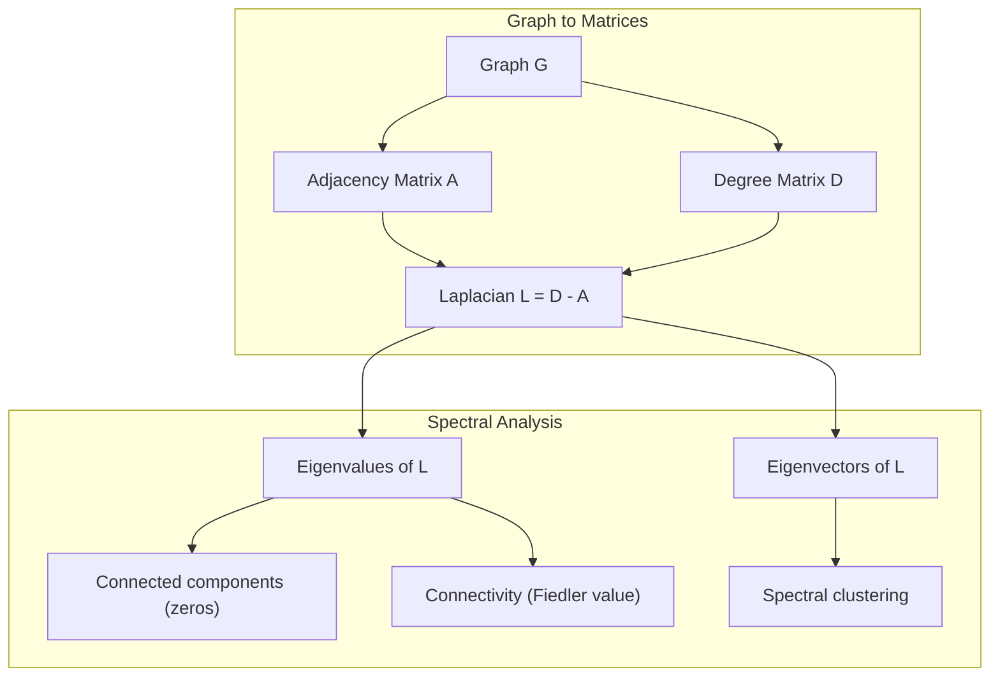
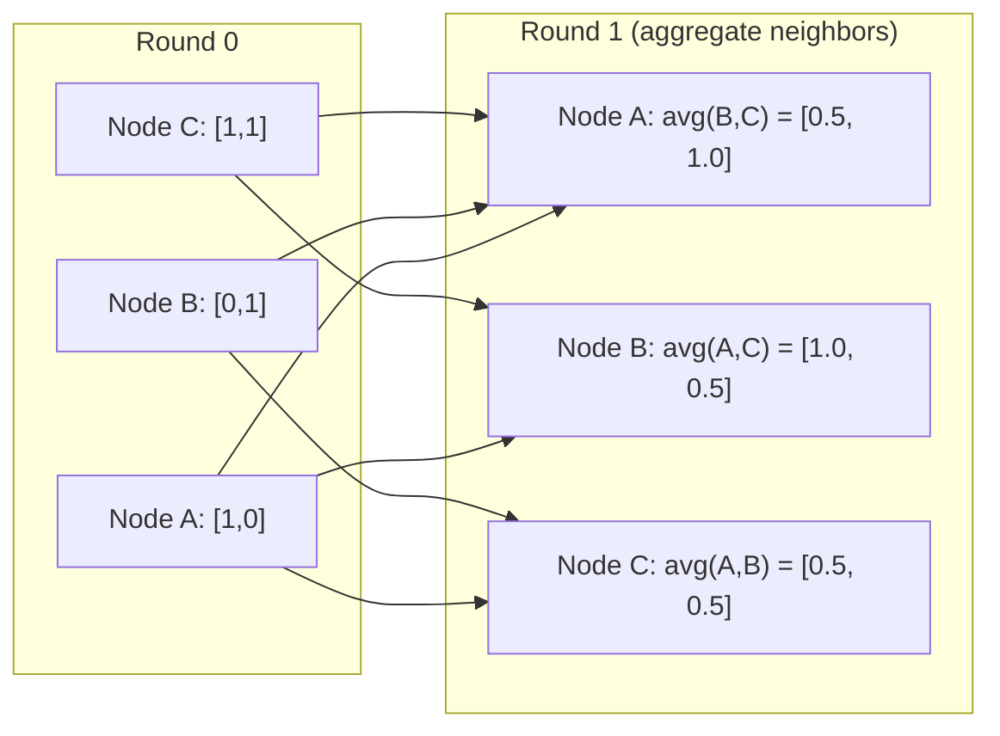

# 机器学习中的图论

> 图是表达关系的数据结构。只要你的数据中存在连接，你就需要图论。

**Type:** Build
**Language:** Python
**Prerequisites:** Phase 1, Lessons 01-03 (linear algebra, matrices)
**Time:** ~90 minutes

## 学习目标

- 构建一个支持邻接矩阵/邻接表表示的图类，并实现 BFS 和 DFS 遍历
- 计算图拉普拉斯矩阵，并利用其特征值检测连通分量、对节点进行聚类
- 将一轮 GNN 风格的消息传递实现为归一化邻接矩阵乘法
- 应用谱聚类，利用 Fiedler 向量对图进行划分

## 问题背景

社交网络、分子、知识库、引文网络、道路地图——它们全都是图。传统机器学习把数据当作扁平的表格：每行相互独立，每个特征是一列。但当连接结构本身很重要时，表格就失效了。

以社交网络为例。你想预测某个用户会购买什么商品。这个用户的购买历史很重要，但他朋友们的购买历史更重要。信号就藏在连接之中。

再看分子。你想预测它是否会与某个蛋白质结合。原子本身固然重要，但真正关键的是原子之间如何成键。结构本身就是数据。

图神经网络（Graph Neural Networks, GNN）是深度学习中增长最快的领域。它驱动着药物发现、社交推荐、欺诈检测和知识图谱推理。每一种 GNN 都建立在同一套基础之上：基本图论。

你需要四样东西：
1. 一种把图表示成矩阵的方法（这样才能做乘法）
2. 用于探索图结构的遍历算法
3. 拉普拉斯矩阵——谱图理论中最重要的那个矩阵
4. 消息传递——让 GNN 得以运转的核心操作

## 核心概念

### 图：节点与边

图 G = (V, E) 由顶点（节点）集合 V 和边集合 E 构成。每条边连接两个节点。

**有向 vs 无向。** 在无向图中，边 (u, v) 表示 u 连接 v 且 v 连接 u。在有向图（digraph）中，边 (u, v) 表示 u 指向 v，但反方向不一定成立。

**带权 vs 无权。** 在无权图中，边要么存在、要么不存在。在带权图中，每条边都有一个数值权重——可以是距离、成本或强度。

| 图类型 | 示例 |
|-----------|---------|
| 无向、无权 | Facebook 好友网络 |
| 有向、无权 | Twitter 关注网络 |
| 无向、带权 | 道路地图（距离） |
| 有向、带权 | 网页链接（PageRank 分数） |

### 邻接矩阵

邻接矩阵 A 是图的核心表示。对于一个有 n 个节点的图：

```
A[i][j] = 1    if there is an edge from node i to node j
A[i][j] = 0    otherwise
```

对于无向图，A 是对称的：A[i][j] = A[j][i]。对于带权图，A[i][j] = 边 (i, j) 的权重。

**示例——一个三角形：**

```
Nodes: 0, 1, 2
Edges: (0,1), (1,2), (0,2)

A = [[0, 1, 1],
     [1, 0, 1],
     [1, 1, 0]]
```

邻接矩阵是每一种 GNN 的输入。对 A 做矩阵运算，就对应着对图本身做操作。

### 度

节点的度（degree）是与它相连的边的数量。对于有向图，分为入度（指向该节点的边）和出度（从该节点出发的边）。

度矩阵 D 是对角矩阵：

```
D[i][i] = degree of node i
D[i][j] = 0    for i != j
```

在三角形的例子中：D = diag(2, 2, 2)，因为每个节点都与另外两个节点相连。

度反映了节点的重要性。度高 = 枢纽节点。网络的度分布揭示了它的结构：社交网络服从幂律分布（少数枢纽节点，大量叶子节点），随机图的度则服从泊松分布。

### BFS 和 DFS

两种最基本的图遍历算法。两者你都需要掌握。

**广度优先搜索（Breadth-First Search, BFS）：** 先探索所有邻居，再探索邻居的邻居。使用队列（FIFO）。

```
BFS from node 0:
  Visit 0
  Queue: [1, 2]        (neighbors of 0)
  Visit 1
  Queue: [2, 3]        (add neighbors of 1)
  Visit 2
  Queue: [3]           (neighbors of 2 already visited)
  Visit 3
  Queue: []            (done)
```

BFS 可以在无权图中找到最短路径。从起点到任意节点的距离，等于该节点首次被发现时所处的 BFS 层级。这正是 BFS 被用于计算社交网络中跳数距离的原因。

**深度优先搜索（Depth-First Search, DFS）：** 尽可能深入，再回溯。使用栈（LIFO）或递归。

```
DFS from node 0:
  Visit 0
  Stack: [1, 2]        (neighbors of 0)
  Visit 2               (pop from stack)
  Stack: [1, 3]         (add neighbors of 2)
  Visit 3               (pop from stack)
  Stack: [1]
  Visit 1               (pop from stack)
  Stack: []             (done)
```

DFS 的典型用途：
- 查找连通分量（从未访问的节点反复运行 DFS）
- 环检测（DFS 树中的回边）
- 拓扑排序（DFS 完成顺序的逆序）

| 算法 | 数据结构 | 能找到什么 | 应用场景 |
|-----------|---------------|-------|----------|
| BFS | 队列 | 最短路径 | 社交网络距离、知识图谱遍历 |
| DFS | 栈 | 连通分量、环 | 连通性分析、拓扑排序 |

### 图拉普拉斯矩阵

L = D - A。谱图理论中最重要的矩阵。

对于三角形：

```
D = [[2, 0, 0],    A = [[0, 1, 1],    L = [[2, -1, -1],
     [0, 2, 0],         [1, 0, 1],         [-1, 2, -1],
     [0, 0, 2]]         [1, 1, 0]]         [-1, -1,  2]]
```

拉普拉斯矩阵有一些非凡的性质：

1. **L 是半正定的。** 所有特征值都 >= 0。

2. **零特征值的个数等于连通分量的个数。** 连通图恰好有一个零特征值。有 3 个互不连通分量的图就有三个零特征值。

3. **最小的非零特征值（Fiedler 值）度量了连通性。** Fiedler 值大，说明图连接得很紧密；Fiedler 值小，说明图存在薄弱环节——一个瓶颈。

4. **Fiedler 值对应的特征向量（Fiedler 向量）揭示了最佳切分方式。** 取值为正的节点分到一组，取值为负的节点分到另一组。这就是谱聚类。



### 谱性质

邻接矩阵和拉普拉斯矩阵的特征值无需任何遍历就能揭示图的结构性质。

**谱聚类（spectral clustering）** 的流程如下：
1. 计算拉普拉斯矩阵 L
2. 求 L 的 k 个最小特征向量（跳过第一个，对于连通图它是全 1 向量）
3. 把这些特征向量当作每个节点的新坐标
4. 在这些坐标上运行 k-means

为什么这样有效？L 的特征向量编码了图上"最平滑"的函数。连接紧密的节点会得到相近的特征向量取值，被瓶颈隔开的节点取值则差异明显。特征向量天然地把簇分隔开来。

**与随机游走的联系。** 归一化拉普拉斯矩阵与图上的随机游走相关。随机游走的平稳分布与节点的度成正比。混合时间（游走收敛的速度）取决于谱间隙（spectral gap）。

### 消息传递

图神经网络的核心操作。每个节点从邻居处收集消息，进行聚合，然后更新自身状态。

```
h_v^(k+1) = UPDATE(h_v^(k), AGGREGATE({h_u^(k) : u in neighbors(v)}))
```

在最简单的形式中，AGGREGATE = 取均值，UPDATE = 线性变换 + 激活函数：

```
h_v^(k+1) = sigma(W * mean({h_u^(k) : u in neighbors(v)}))
```

这其实就是伪装起来的矩阵乘法。设 H 为所有节点特征构成的矩阵，A 为邻接矩阵：

```
H^(k+1) = sigma(A_norm * H^(k) * W)
```

其中 A_norm 是归一化邻接矩阵（每行的和为 1）。

一轮消息传递让每个节点"看到"它的直接邻居；两轮就能看到邻居的邻居；K 轮则让每个节点获得其 K 跳邻域内的信息。



### 概念与机器学习应用

| 概念 | 机器学习应用 |
|---------|---------------|
| 邻接矩阵 | GNN 输入表示 |
| 图拉普拉斯矩阵 | 谱聚类、社区检测 |
| BFS/DFS | 知识图谱遍历、路径查找 |
| 度分布 | 节点重要性、特征工程 |
| 消息传递 | GNN 层（GCN、GAT、GraphSAGE） |
| L 的特征值 | 社区检测、图划分 |
| 谱聚类 | 无监督节点分组 |
| PageRank | 节点重要性、网页搜索 |

```figure
graph-degree-distribution
```

## 从零实现

### 第 1 步：从零实现 Graph 类

```python
class Graph:
    def __init__(self, n_nodes, directed=False):
        self.n = n_nodes
        self.directed = directed
        self.adj = {i: {} for i in range(n_nodes)}

    def add_edge(self, u, v, weight=1.0):
        self.adj[u][v] = weight
        if not self.directed:
            self.adj[v][u] = weight

    def neighbors(self, node):
        return list(self.adj[node].keys())

    def degree(self, node):
        return len(self.adj[node])

    def adjacency_matrix(self):
        import numpy as np
        A = np.zeros((self.n, self.n))
        for u in range(self.n):
            for v, w in self.adj[u].items():
                A[u][v] = w
        return A

    def degree_matrix(self):
        import numpy as np
        D = np.zeros((self.n, self.n))
        for i in range(self.n):
            D[i][i] = self.degree(i)
        return D

    def laplacian(self):
        return self.degree_matrix() - self.adjacency_matrix()
```

邻接表（`self.adj`）高效地存储邻居信息。转换为邻接矩阵时使用 numpy，因为后续所有谱运算都依赖它。

### 第 2 步：BFS 和 DFS

```python
from collections import deque

def bfs(graph, start):
    visited = set()
    order = []
    distances = {}
    queue = deque([(start, 0)])
    visited.add(start)
    while queue:
        node, dist = queue.popleft()
        order.append(node)
        distances[node] = dist
        for neighbor in graph.neighbors(node):
            if neighbor not in visited:
                visited.add(neighbor)
                queue.append((neighbor, dist + 1))
    return order, distances


def dfs(graph, start):
    visited = set()
    order = []
    stack = [start]
    while stack:
        node = stack.pop()
        if node in visited:
            continue
        visited.add(node)
        order.append(node)
        for neighbor in reversed(graph.neighbors(node)):
            if neighbor not in visited:
                stack.append(neighbor)
    return order
```

BFS 使用 deque（双端队列）以实现 O(1) 的 popleft。DFS 用列表充当栈。两者都恰好访问每个节点一次——时间复杂度 O(V + E)。

### 第 3 步：连通分量与拉普拉斯特征值

```python
def connected_components(graph):
    visited = set()
    components = []
    for node in range(graph.n):
        if node not in visited:
            order, _ = bfs(graph, node)
            visited.update(order)
            components.append(order)
    return components


def laplacian_eigenvalues(graph):
    import numpy as np
    L = graph.laplacian()
    eigenvalues = np.linalg.eigvalsh(L)
    return eigenvalues
```

`eigvalsh` 适用于对称矩阵——无向图的拉普拉斯矩阵总是对称的。它按升序返回特征值。数一数其中零的个数，就得到连通分量的数量。

### 第 4 步：谱聚类

```python
def spectral_clustering(graph, k=2):
    import numpy as np
    L = graph.laplacian()
    eigenvalues, eigenvectors = np.linalg.eigh(L)
    features = eigenvectors[:, 1:k+1]

    labels = np.zeros(graph.n, dtype=int)
    for i in range(graph.n):
        if features[i, 0] >= 0:
            labels[i] = 0
        else:
            labels[i] = 1
    return labels
```

当 k=2 时，Fiedler 向量的符号就能把图切成两个簇。当 k>2 时，则需要在前 k 个特征向量（排除平凡的全 1 特征向量）上运行 k-means。

### 第 5 步：消息传递

```python
def message_passing(graph, features, weight_matrix):
    import numpy as np
    A = graph.adjacency_matrix()
    row_sums = A.sum(axis=1, keepdims=True)
    row_sums[row_sums == 0] = 1
    A_norm = A / row_sums
    aggregated = A_norm @ features
    output = aggregated @ weight_matrix
    return output
```

这就是一轮 GNN 消息传递。每个节点的新特征是其邻居特征的加权平均，再经过权重矩阵变换。堆叠多轮，就能把信息传播得更远。

## 生产实践

有了 networkx 和 numpy，同样的操作只需一行代码：

```python
import networkx as nx
import numpy as np

G = nx.karate_club_graph()

A = nx.adjacency_matrix(G).toarray()
L = nx.laplacian_matrix(G).toarray()

eigenvalues = np.linalg.eigvalsh(L.astype(float))
print(f"Smallest eigenvalues: {eigenvalues[:5]}")
print(f"Connected components: {nx.number_connected_components(G)}")

communities = nx.community.greedy_modularity_communities(G)
print(f"Communities found: {len(communities)}")

pr = nx.pagerank(G)
top_nodes = sorted(pr.items(), key=lambda x: x[1], reverse=True)[:5]
print(f"Top 5 PageRank nodes: {top_nodes}")
```

networkx 借助优化过的 C 后端可以处理任意规模的图。在生产环境中用它；用你自己的从零实现去理解它背后做了什么。

### numpy 谱分析

```python
import numpy as np

A = np.array([
    [0, 1, 1, 0, 0],
    [1, 0, 1, 0, 0],
    [1, 1, 0, 1, 0],
    [0, 0, 1, 0, 1],
    [0, 0, 0, 1, 0]
])

D = np.diag(A.sum(axis=1))
L = D - A

eigenvalues, eigenvectors = np.linalg.eigh(L)
print(f"Eigenvalues: {np.round(eigenvalues, 4)}")
print(f"Fiedler value: {eigenvalues[1]:.4f}")
print(f"Fiedler vector: {np.round(eigenvectors[:, 1], 4)}")

fiedler = eigenvectors[:, 1]
group_a = np.where(fiedler >= 0)[0]
group_b = np.where(fiedler < 0)[0]
print(f"Cluster A: {group_a}")
print(f"Cluster B: {group_b}")
```

Fiedler 向量包揽了所有重活：正的元素归一个簇，负的归另一个簇。不需要任何迭代优化——只需做一次特征分解。

## 交付产物

本课产出：
- `outputs/skill-graph-analysis.md` —— 一份用于分析图结构数据的技能参考

## 知识关联

| 概念 | 出现的地方 |
|---------|------------------|
| 邻接矩阵 | GCN、GAT、GraphSAGE 的输入 |
| 拉普拉斯矩阵 | 谱聚类、ChebNet 滤波器 |
| BFS | 知识图谱遍历、最短路径查询 |
| 消息传递 | 每一个 GNN 层、神经消息传递 |
| 谱间隙 | 图连通性、随机游走的混合时间 |
| 度分布 | 幂律网络、节点特征工程 |
| 连通分量 | 预处理、处理非连通图 |
| PageRank | 节点重要性排序、注意力初始化 |

GNN 值得特别一提。GCN（Kipf & Welling, 2017）中的图卷积操作使用加了自环的邻接矩阵 A_hat = A + I：

```text
H^(l+1) = sigma(D_hat^(-1/2) * A_hat * D_hat^(-1/2) * H^(l) * W^(l))
```

其中 A_hat = A + I（邻接矩阵加自环），D_hat 是 A_hat 的度矩阵。自环保证每个节点在聚合时也包含自己的特征。这正是带对称归一化的消息传递：D_hat^(-1/2) * A_hat * D_hat^(-1/2) 就是归一化邻接矩阵。拉普拉斯矩阵之所以会出现，是因为这种归一化与 L_sym = I - D^(-1/2) * A * D^(-1/2) 密切相关。理解了拉普拉斯矩阵，就理解了 GCN 为什么有效。

## 练习

1. **从零实现 PageRank。** 从均匀分数开始。每一步：score(v) = (1-d)/n + d * sum(score(u)/out_degree(u))，其中求和遍历所有指向 v 的节点 u。取 d=0.85。迭代直至收敛（变化量 < 1e-6）。在一个小型网页图上测试。

2. **用谱聚类发现社区。** 构造一个有两个明显分离簇的图（例如由一条边连接的两个团）。运行谱聚类并验证它能找到正确的切分。随着跨簇的边越来越多，结果会发生什么变化？

3. **实现 Dijkstra 算法**，求解带权图的最短路径。在同一个图上使用均匀权重，把结果与 BFS 进行对比。

4. **构建一个 2 层消息传递网络。** 用两个不同的权重矩阵执行两次消息传递。验证经过 2 轮之后，每个节点都获得了其 2 跳邻域内的信息。

5. **分析一个真实世界的图。** 使用 Karate Club 图（34 个节点、78 条边）。计算度分布、拉普拉斯特征值并做谱聚类。把谱聚类结果与已知的真实分组进行对比。

## 关键术语

| 术语 | 人们常说的 | 实际含义 |
|------|----------------|----------------------|
| 图 | "节点和边" | 编码成对关系的数学结构 G=(V,E) |
| 邻接矩阵 | "连接表" | n x n 矩阵，节点 i 和 j 相连时 A[i][j] = 1 |
| 度 | "一个节点的连接程度" | 与该节点相连的边的数量 |
| 拉普拉斯矩阵 | "D 减 A" | L = D - A，其特征值能揭示图结构的矩阵 |
| Fiedler 值 | "代数连通度" | L 的最小非零特征值，度量图的连通程度 |
| BFS | "逐层搜索" | 先访问所有邻居再深入的遍历方式，能找到最短路径 |
| DFS | "先往深处走" | 沿一条路径走到底再回溯的遍历方式 |
| 消息传递 | "节点与邻居交流" | 每个节点聚合来自邻居的信息，GNN 的核心 |
| 谱聚类 | "按特征向量聚类" | 利用拉普拉斯矩阵的特征向量划分图 |
| 连通分量 | "独立的一块" | 极大子图，其中任意节点都能到达其他任意节点 |

## 延伸阅读

- **Kipf & Welling (2017)** —— "Semi-Supervised Classification with Graph Convolutional Networks"。开启现代 GNN 的论文，证明了谱图卷积可以简化为消息传递。
- **Spielman (2012)** —— "Spectral Graph Theory" 讲义。关于拉普拉斯矩阵、谱间隙和图划分的权威入门材料。
- **Hamilton (2020)** —— "Graph Representation Learning"。从基础到应用全面覆盖 GNN 的著作。
- **Bronstein et al. (2021)** —— "Geometric Deep Learning: Grids, Groups, Graphs, Geodesics, and Gauges"。提出统一框架的论文。
- **Veličković et al. (2018)** —— "Graph Attention Networks"。用注意力机制扩展消息传递。
