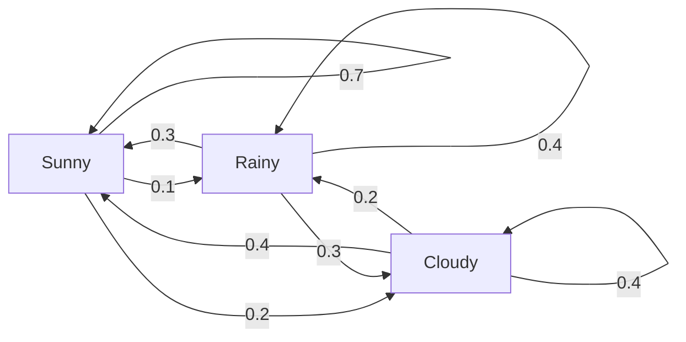
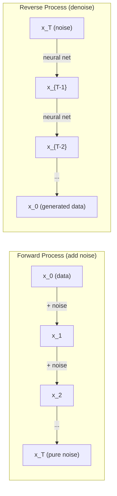

# 随机过程

> 有结构的随机性。随机游走、马尔可夫链与扩散模型背后的数学。

**Type:** Learn
**Language:** Python
**Prerequisites:** Phase 1, Lessons 06-07 (probability, Bayes)
**Time:** ~75 minutes

## 学习目标

- 模拟一维和二维随机游走，并验证位移的 sqrt(n) 缩放规律
- 构建马尔可夫链模拟器，并通过特征分解计算其平稳分布
- 实现 Metropolis-Hastings MCMC 和朗之万动力学（Langevin dynamics），用于从目标分布中采样
- 把前向扩散过程与布朗运动联系起来，并解释反向过程如何生成数据

## 问题背景

许多 AI 系统都涉及随时间演化的随机性。不是静态的随机性——而是有结构的、按顺序展开的随机性，每一步都依赖于之前发生的事。

语言模型逐个生成 token。每个 token 依赖于之前的上下文。模型输出一个概率分布，从中采样，然后继续下一步。这就是一个随机过程。

扩散模型逐步给图像加噪，直到它变成纯粹的噪点。然后再把过程反过来，逐步去噪，直到一张新图像浮现。前向过程是一条马尔可夫链。反向过程则是一条学出来的、倒着运行的马尔可夫链。

强化学习智能体在环境中采取动作。每个动作以一定概率导向新状态。智能体在一个随机的世界里执行随机的策略。整个系统就是一个马尔可夫决策过程。

MCMC 采样——贝叶斯推断的支柱——构造一条马尔可夫链，使其平稳分布恰好是你想采样的后验分布。

所有这些都建立在四个基础概念之上：
1. 随机游走——最简单的随机过程
2. 马尔可夫链——由转移矩阵刻画的结构化随机性
3. 朗之万动力学——带噪声的梯度下降
4. Metropolis-Hastings——从任意分布中采样

## 核心概念

### 随机游走

从位置 0 出发。每一步抛一枚公平的硬币。正面：向右移动（+1）。反面：向左移动（-1）。

走了 n 步之后，你的位置是 n 个随机 +/-1 值的总和。期望位置是 0（这个游走是无偏的）。但离原点的期望距离按 sqrt(n) 增长。

这有点反直觉。游走是公平的——没有朝任何方向的漂移。但随着时间推移，它会离起点越走越远。n 步之后的标准差是 sqrt(n)。

```
Step 0:  Position = 0
Step 1:  Position = +1 or -1
Step 2:  Position = +2, 0, or -2
...
Step 100: Expected distance from origin ~ 10 (sqrt(100))
Step 10000: Expected distance from origin ~ 100 (sqrt(10000))
```

**在二维情形下**，游走以相等的概率向上、向下、向左或向右移动。离原点的距离同样满足 sqrt(n) 缩放规律。路径会描绘出类似分形的图案。

**为什么是 sqrt(n)？** 每一步以相等概率取 +1 或 -1。走了 n 步之后，位置为 S_n = X_1 + X_2 + ... + X_n，其中每个 X_i 是 +/-1。每一步的方差是 1，且各步相互独立，所以 Var(S_n) = n。标准差 = sqrt(n)。根据中心极限定理，S_n / sqrt(n) 收敛到标准正态分布。

这个 sqrt(n) 缩放规律在 ML 中随处可见。SGD 的噪声按 1/sqrt(batch_size) 缩放。嵌入维度按 sqrt(d) 缩放。平方根正是独立随机量相加的标志。

**与布朗运动的联系。** 取一个步长为 1/sqrt(n)、每单位时间走 n 步的随机游走。当 n 趋于无穷时，这个游走收敛到布朗运动 B(t)——一个连续时间过程，其中 B(t) 服从均值为 0、方差为 t 的正态分布。

布朗运动是扩散的数学基础。它刻画了流体中粒子的随机抖动、股票价格的波动，以及——最关键的——扩散模型中的噪声过程。

**赌徒破产问题（Gambler's ruin）。** 一个随机游走者从位置 k 出发，0 和 N 处是吸收壁。先到达 N 而不是先到达 0 的概率是多少？对于公平游走：P(到达 N) = k/N。这个结果出乎意料地简单优雅。它与鞅（martingale）理论相关——公平随机游走是一个鞅（期望的未来值 = 当前值）。

### 马尔可夫链

马尔可夫链是一个按固定概率在各状态之间转移的系统。其关键性质是：下一个状态只取决于当前状态，与历史无关。

```
P(X_{t+1} = j | X_t = i, X_{t-1} = ...) = P(X_{t+1} = j | X_t = i)
```

这就是马尔可夫性质。它意味着你可以用一个转移矩阵 P 来完整描述整个动态过程：

```
P[i][j] = probability of going from state i to state j
```

P 的每一行之和为 1（你总得去某个地方）。

**示例——天气：**

```
States: Sunny (0), Rainy (1), Cloudy (2)

P = [[0.7, 0.1, 0.2],    (if sunny: 70% sunny, 10% rainy, 20% cloudy)
     [0.3, 0.4, 0.3],    (if rainy: 30% sunny, 40% rainy, 30% cloudy)
     [0.4, 0.2, 0.4]]    (if cloudy: 40% sunny, 20% rainy, 40% cloudy)
```

从任意状态出发。经过多次转移后，状态的分布会收敛到平稳分布 pi，满足 pi * P = pi。它是 P 对应特征值 1 的左特征向量。

对这个天气链来说，平稳分布大致是 [0.53, 0.18, 0.29]——长期来看，无论从哪个状态出发，有 53% 的时间是晴天。



**计算平稳分布。** 有两种方法：

1. **幂法（Power method）**：用 P 反复乘任意初始分布。迭代足够多次后即收敛。
2. **特征值法**：求 P 对应特征值 1 的左特征向量，即 P^T 对应特征值 1 的特征向量。

两种方法都要求链满足收敛条件。

**收敛条件。** 一条马尔可夫链收敛到唯一的平稳分布，需要它满足：
- **不可约（Irreducible）**：任意状态都能从任意其他状态到达
- **非周期（Aperiodic）**：链不会以固定周期循环

ML 中遇到的大多数链都同时满足这两个条件。

**吸收态。** 如果一旦进入某状态就永远不离开（P[i][i] = 1），该状态就是吸收态。带吸收态的马尔可夫链可以建模有终止状态的过程——一局会结束的游戏、一个流失的客户、一段碰到文本结束 token 的 token 序列。

**混合时间（Mixing time）。** 链需要多少步才能"接近"平稳分布？形式化地说，是与平稳分布的总变差距离降到某个阈值以下所需的步数。混合得快 = 需要的步数少。P 的谱隙（spectral gap，即 1 减去第二大特征值）决定了混合时间。谱隙越大 = 混合越快。

### 与语言模型的联系

语言模型的 token 生成近似是一个马尔可夫过程。给定当前上下文，模型输出下一个 token 的分布。温度（temperature）控制分布的锐度：

```
P(token_i) = exp(logit_i / temperature) / sum(exp(logit_j / temperature))
```

- Temperature = 1.0：标准分布
- Temperature < 1.0：更尖锐（更确定）
- Temperature > 1.0：更平坦（更随机）
- Temperature -> 0：argmax（贪心）

Top-k 采样截断到概率最高的 k 个 token。Top-p（nucleus）采样截断到累积概率超过 p 的最小 token 集合。两者都在修改马尔可夫转移概率。

### 布朗运动

随机游走的连续时间极限。位置 B(t) 具有三个性质：
1. B(0) = 0
2. B(t) - B(s) 服从均值为 0、方差为 t - s 的正态分布（t > s）
3. 不重叠区间上的增量相互独立

布朗运动处处连续但处处不可微——它在每个尺度上都在抖动。其路径在平面上的分形维数为 2。

在离散模拟中，可以这样近似布朗运动：

```
B(t + dt) = B(t) + sqrt(dt) * z,    where z ~ N(0, 1)
```

sqrt(dt) 这个缩放因子很重要。它来自于把中心极限定理应用到随机游走上。

### 朗之万动力学

梯度下降寻找函数的最小值。朗之万动力学则寻找正比于 exp(-U(x)/T) 的概率分布，其中 U 是能量函数，T 是温度。

```
x_{t+1} = x_t - dt * gradient(U(x_t)) + sqrt(2 * T * dt) * z_t
```

有两种力作用在粒子上：
1. **梯度力**（-dt * gradient(U)）：把粒子推向低能量区域（如同梯度下降）
2. **随机力**（sqrt(2*T*dt) * z）：把粒子推向随机方向（探索）

温度 T = 0 时，这就是纯粹的梯度下降。温度很高时，它几乎是一个随机游走。温度恰当时，粒子会探索整个能量地形，并在低能量区域停留更多时间。

**与扩散模型的联系。** 扩散模型的前向过程是：

```
x_t = sqrt(alpha_t) * x_{t-1} + sqrt(1 - alpha_t) * noise
```

这是一条逐步把数据与噪声混合的马尔可夫链。经过足够多步后，x_T 就是纯高斯噪声。

反向过程——从噪声回到数据——也是一条马尔可夫链，只不过它的转移概率由神经网络学习得到。网络学会预测每一步加入的噪声，然后把它减掉。



### MCMC：马尔可夫链蒙特卡洛

有时你需要从一个分布 p(x) 中采样：你能（在差一个常数的意义上）计算它的值，却无法直接从中采样。贝叶斯后验就是经典例子——你知道似然乘以先验，但归一化常数难以计算。

**Metropolis-Hastings** 构造一条平稳分布恰为 p(x) 的马尔可夫链：

1. 从某个位置 x 出发
2. 从提议分布 Q(x'|x) 中提议一个新位置 x'
3. 计算接受率：a = p(x') * Q(x|x') / (p(x) * Q(x'|x))
4. 以概率 min(1, a) 接受 x'。否则停留在 x。
5. 重复以上步骤。

如果 Q 是对称的（例如 Q(x'|x) = Q(x|x') = N(x, sigma^2)），接受率简化为 a = p(x') / p(x)。你只需要概率的比值——归一化常数被消掉了。

在温和的条件下，该链保证收敛到 p(x)。但如果提议步长太小（变成随机游走）或太大（拒绝率太高），收敛会很慢。调好提议分布是 MCMC 的艺术所在。

**为什么有效。** 接受率保证了细致平衡（detailed balance）：处于 x 并移动到 x' 的概率等于处于 x' 并移动到 x 的概率。细致平衡意味着 p(x) 是这条链的平稳分布。所以走够多步之后，采到的样本就来自 p(x)。

**实践要点：**
- **预热（Burn-in）**：丢弃最初的 N 个样本。链需要时间从起点走到平稳分布。
- **抽稀（Thinning）**：每隔 k 个样本保留一个，以降低自相关。
- **多条链**：从不同起点运行若干条链。如果它们收敛到同一分布，就有了收敛的证据。
- **接受率**：对 d 维高斯提议分布，最优接受率约为 23%（Roberts & Rosenthal, 2001）。接受率太高说明链几乎不动，太低说明几乎全被拒绝。

### AI 中的随机过程

| 过程 | AI 应用 |
|---------|---------------|
| 随机游走 | RL 中的探索、Node2Vec 嵌入 |
| 马尔可夫链 | 文本生成、MCMC 采样 |
| 布朗运动 | 扩散模型（前向过程） |
| 朗之万动力学 | 基于得分的生成模型、SGLD |
| 马尔可夫决策过程 | 强化学习 |
| Metropolis-Hastings | 贝叶斯推断、后验采样 |

```figure
random-walk-diffusion
```

## 从零实现

### 第 1 步：随机游走模拟器

```python
import numpy as np

def random_walk_1d(n_steps, seed=None):
    rng = np.random.RandomState(seed)
    steps = rng.choice([-1, 1], size=n_steps)
    positions = np.concatenate([[0], np.cumsum(steps)])
    return positions


def random_walk_2d(n_steps, seed=None):
    rng = np.random.RandomState(seed)
    directions = rng.choice(4, size=n_steps)
    dx = np.zeros(n_steps)
    dy = np.zeros(n_steps)
    dx[directions == 0] = 1   # right
    dx[directions == 1] = -1  # left
    dy[directions == 2] = 1   # up
    dy[directions == 3] = -1  # down
    x = np.concatenate([[0], np.cumsum(dx)])
    y = np.concatenate([[0], np.cumsum(dy)])
    return x, y
```

一维游走存储的是累积和。每一步取 +1 或 -1。走了 n 步之后，位置就是它们的和。方差随 n 线性增长，所以标准差按 sqrt(n) 增长。

### 第 2 步：马尔可夫链

```python
class MarkovChain:
    def __init__(self, transition_matrix, state_names=None):
        self.P = np.array(transition_matrix, dtype=float)
        self.n_states = len(self.P)
        self.state_names = state_names or [str(i) for i in range(self.n_states)]

    def step(self, current_state, rng=None):
        if rng is None:
            rng = np.random.RandomState()
        probs = self.P[current_state]
        return rng.choice(self.n_states, p=probs)

    def simulate(self, start_state, n_steps, seed=None):
        rng = np.random.RandomState(seed)
        states = [start_state]
        current = start_state
        for _ in range(n_steps):
            current = self.step(current, rng)
            states.append(current)
        return states

    def stationary_distribution(self):
        eigenvalues, eigenvectors = np.linalg.eig(self.P.T)
        idx = np.argmin(np.abs(eigenvalues - 1.0))
        stationary = np.real(eigenvectors[:, idx])
        stationary = stationary / stationary.sum()
        return np.abs(stationary)
```

平稳分布是 P 对应特征值 1 的左特征向量。我们通过计算 P^T 的特征向量来求它（转置把左特征向量变成右特征向量）。

### 第 3 步：朗之万动力学

```python
def langevin_dynamics(grad_U, x0, dt, temperature, n_steps, seed=None):
    rng = np.random.RandomState(seed)
    x = np.array(x0, dtype=float)
    trajectory = [x.copy()]
    for _ in range(n_steps):
        noise = rng.randn(*x.shape)
        x = x - dt * grad_U(x) + np.sqrt(2 * temperature * dt) * noise
        trajectory.append(x.copy())
    return np.array(trajectory)
```

梯度把 x 推向低能量区域。噪声防止它卡住。达到平衡时，样本的分布正比于 exp(-U(x)/temperature)。

### 第 4 步：Metropolis-Hastings

```python
def metropolis_hastings(target_log_prob, proposal_std, x0, n_samples, seed=None):
    rng = np.random.RandomState(seed)
    x = np.array(x0, dtype=float)
    samples = [x.copy()]
    accepted = 0
    for _ in range(n_samples - 1):
        x_proposed = x + rng.randn(*x.shape) * proposal_std
        log_ratio = target_log_prob(x_proposed) - target_log_prob(x)
        if np.log(rng.rand()) < log_ratio:
            x = x_proposed
            accepted += 1
        samples.append(x.copy())
    acceptance_rate = accepted / (n_samples - 1)
    return np.array(samples), acceptance_rate
```

算法提议一个新点，检查它的概率是否更高（或以正比于概率比值的概率接受它），然后重复。要想混合得好，接受率应该在 23% 到 50% 左右。

## 生产实践

实际工作中，这些算法你会用成熟的库。但理解其运行机制对调试和调参至关重要。

```python
import numpy as np

rng = np.random.RandomState(42)
walk = np.cumsum(rng.choice([-1, 1], size=10000))
print(f"Final position: {walk[-1]}")
print(f"Expected distance: {np.sqrt(10000):.1f}")
print(f"Actual distance: {abs(walk[-1])}")
```

### 用 numpy 处理转移矩阵

```python
import numpy as np

P = np.array([[0.7, 0.1, 0.2],
              [0.3, 0.4, 0.3],
              [0.4, 0.2, 0.4]])

distribution = np.array([1.0, 0.0, 0.0])
for _ in range(100):
    distribution = distribution @ P

print(f"Stationary distribution: {np.round(distribution, 4)}")
```

用 P 反复乘初始分布。迭代足够多次后，无论从哪里开始，它都会收敛到平稳分布。这就是求主导左特征向量的幂法。

### 与真实框架的联系

- **PyTorch 扩散模型：** Hugging Face `diffusers` 库中的 `DDPMScheduler` 实现了前向和反向马尔可夫链
- **NumPyro / PyMC：** 用 MCMC（NUTS 采样器，是对 Metropolis-Hastings 的改进）做贝叶斯推断
- **Gymnasium（RL）：** 环境的 step 函数定义了一个马尔可夫决策过程

### 验证马尔可夫链的收敛性

```python
import numpy as np

P = np.array([[0.9, 0.1], [0.3, 0.7]])

eigenvalues = np.linalg.eigvals(P)
spectral_gap = 1 - sorted(np.abs(eigenvalues))[-2]
print(f"Eigenvalues: {eigenvalues}")
print(f"Spectral gap: {spectral_gap:.4f}")
print(f"Approximate mixing time: {1/spectral_gap:.1f} steps")
```

谱隙告诉你链遗忘初始状态的速度。谱隙为 0.2 大约需要 5 步混合，0.01 则大约需要 100 步。在跑长时间模拟之前一定要先检查这一点——混合慢的链会白白浪费算力。

## 交付产物

本课产出：
- `outputs/prompt-stochastic-process-advisor.md` —— 一个提示词，帮助判断某个问题适用哪种随机过程框架

## 知识关联

| 概念 | 出现场景 |
|---------|------------------|
| 随机游走 | Node2Vec 图嵌入、RL 中的探索 |
| 马尔可夫链 | LLM 的 token 生成、MCMC 采样 |
| 布朗运动 | DDPM 中的前向扩散过程、基于 SDE 的模型 |
| 朗之万动力学 | 基于得分的生成模型、随机梯度朗之万动力学（SGLD） |
| 平稳分布 | MCMC 的收敛目标、PageRank |
| Metropolis-Hastings | 贝叶斯后验采样、模拟退火 |
| 温度 | LLM 采样、RL 中的 Boltzmann 探索、模拟退火 |
| 混合时间 | MCMC 的收敛速度、谱隙分析 |
| 吸收态 | 序列结束 token、RL 中的终止状态 |
| 细致平衡 | MCMC 采样器的正确性保证 |

扩散模型值得特别关注。DDPM（Ho et al., 2020）定义了一条前向马尔可夫链：

```
q(x_t | x_{t-1}) = N(x_t; sqrt(1-beta_t) * x_{t-1}, beta_t * I)
```

其中 beta_t 是噪声调度。经过 T 步之后，x_T 近似为 N(0, I)。反向过程由一个预测噪声的神经网络来参数化：

```
p_theta(x_{t-1} | x_t) = N(x_{t-1}; mu_theta(x_t, t), sigma_t^2 * I)
```

生成的每一步都是这条学到的马尔可夫链上的一步。理解了马尔可夫链，就理解了扩散模型如何以及为何能生成数据。

SGLD（Stochastic Gradient Langevin Dynamics，随机梯度朗之万动力学）把小批量梯度下降与朗之万噪声结合起来。它不计算完整梯度，而是用随机梯度估计并加入校准过的噪声。随着学习率衰减，SGLD 从优化逐渐过渡到采样——你免费得到了近似的贝叶斯后验样本。这是从神经网络中获得不确定性估计的最简单方法之一。

贯穿所有这些联系的关键洞察是：随机过程不只是理论工具，它们是现代 AI 系统内部真实运转的计算机制。当你调节 LLM 的温度时，你在调整一条马尔可夫链。当你训练扩散模型时，你在学习逆转一个类似布朗运动的过程。当你做贝叶斯推断时，你在构造一条收敛到后验分布的链。

## 练习

1. **模拟 1000 次各 10000 步的随机游走。** 绘制最终位置的分布。验证它近似服从均值为 0、标准差为 sqrt(10000) = 100 的高斯分布。

2. **用马尔可夫链构建一个文本生成器。** 在一个小语料库上训练：对每个词，统计它转移到下一个词的次数。构建转移矩阵。从这条链中采样来生成新句子。

3. **用 Metropolis-Hastings 实现模拟退火。** 从高温开始（几乎接受一切），然后逐渐降温（只接受改进）。用它来寻找一个有许多局部极小值的函数的最小值。

4. **比较不同温度下的朗之万动力学。** 从双阱势 U(x) = (x^2 - 1)^2 中采样。低温时，样本聚集在一个阱中。高温时，样本分布在两个阱里。找出链能在两个阱之间混合的临界温度。

5. **实现前向扩散过程。** 从一个一维信号（例如正弦波）出发。用线性噪声调度在 100 步内逐步加噪。展示信号如何退化为纯噪声。然后实现一个简单的去噪器来逆转这个过程（哪怕是一个只做减去估计噪声的朴素版本也可以）。

## 关键术语

| 术语 | 大家怎么说 | 实际含义 |
|------|----------------|----------------------|
| 随机游走 | "抛硬币式移动" | 位置在每一步按随机增量变化的过程 |
| 马尔可夫性质 | "无记忆" | 未来只取决于当前状态，与历史无关 |
| 转移矩阵 | "概率表" | P[i][j] = 从状态 i 转移到状态 j 的概率 |
| 平稳分布 | "长期平均" | 满足 pi*P = pi 的分布 pi——链的平衡态 |
| 布朗运动 | "随机抖动" | 随机游走的连续时间极限，B(t) ~ N(0, t) |
| 朗之万动力学 | "带噪声的梯度下降" | 把确定性梯度和随机扰动结合起来的更新规则 |
| MCMC | "朝目标走过去" | 构造一条平稳分布恰为目标分布的马尔可夫链 |
| Metropolis-Hastings | "提议然后接受/拒绝" | 利用接受率保证收敛的 MCMC 算法 |
| 温度 | "随机性旋钮" | 控制探索与利用之间权衡的参数 |
| 扩散过程 | "噪声进，噪声出" | 前向：逐步加噪。反向：逐步去噪。由此生成数据。 |

## 延伸阅读

- **Ho, Jain, Abbeel (2020)** —— "Denoising Diffusion Probabilistic Models."。开启扩散模型革命的 DDPM 论文。对前向和反向马尔可夫链给出了清晰的推导。
- **Song & Ermon (2019)** —— "Generative Modeling by Estimating Gradients of the Data Distribution."。基于得分的方法，使用朗之万动力学进行采样。
- **Roberts & Rosenthal (2004)** —— "General state space Markov chains and MCMC algorithms."。关于 MCMC 何时有效、为何有效的理论。
- **Norris (1997)** —— "Markov Chains."。标准教科书。涵盖收敛性、平稳分布和击中时间。
- **Welling & Teh (2011)** —— "Bayesian Learning via Stochastic Gradient Langevin Dynamics."。把 SGD 与朗之万动力学结合，实现可扩展的贝叶斯推断。
