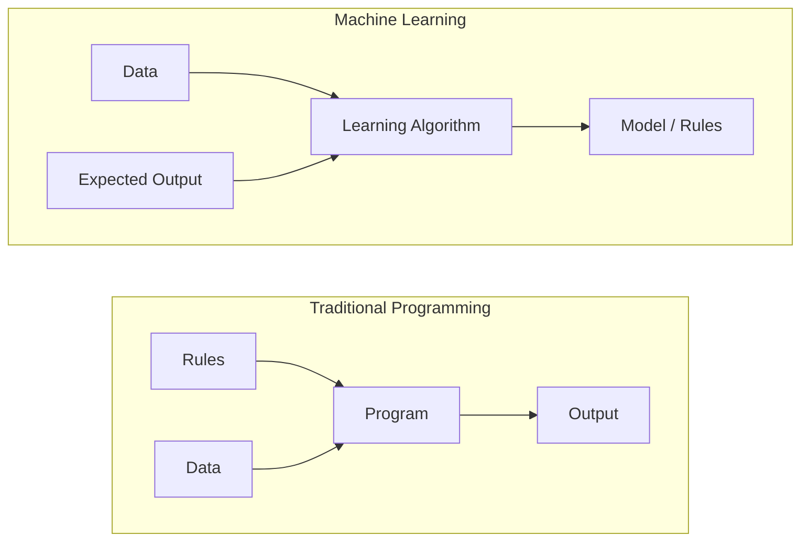
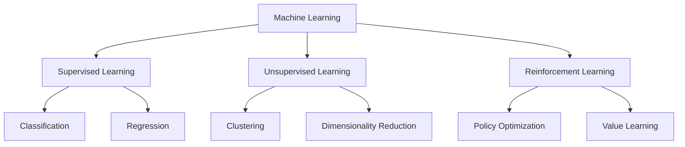
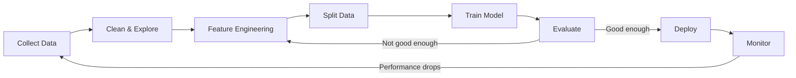
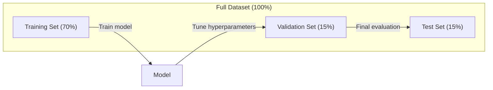
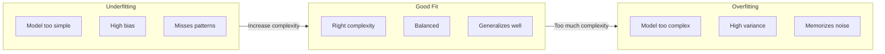
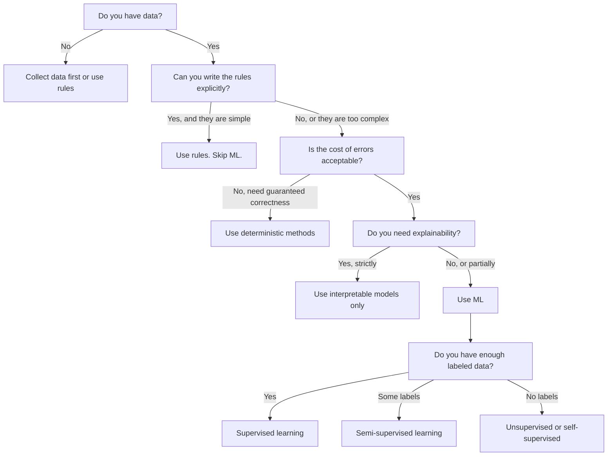

# 什么是机器学习

> 机器学习就是让计算机从数据中发现规律，而不是靠人手写规则。

**Type:** Learn
**Languages:** Python
**Prerequisites:** Phase 1 (Math Foundations)
**Time:** ~45 minutes

## 学习目标

- 解释监督学习、无监督学习和强化学习的区别，并能判断给定问题属于哪一类
- 从零实现一个最近质心分类器，并与随机基线进行对比评估
- 区分分类任务和回归任务，并为每种任务选择合适的损失函数
- 评估一个业务问题适合用机器学习解决，还是更适合用确定性规则解决

## 问题背景

假设你要做一个垃圾邮件过滤器。传统做法是：坐下来手写几百条规则。"如果邮件里出现 'FREE MONEY'，标记为垃圾邮件。如果感叹号超过 3 个，标记为垃圾邮件。"你花了好几周写规则。然后垃圾邮件发送者换了措辞，你的规则就失效了。你又去写更多规则。这个循环永远没有尽头。

机器学习把这件事反过来做。你不再编写规则，而是给计算机成千上万封带标签的邮件（"垃圾邮件"或"正常邮件"），让它自己找出规则。计算机会发现你根本想不到的模式。当垃圾邮件发送者改变策略时，你只需用新数据重新训练，而不必重写代码。

从"编写规则"到"从数据中学习"的这一转变，就是机器学习的核心。每一个推荐引擎、语音助手、自动驾驶汽车和语言模型，都是这样工作的。

## 核心概念

### 从数据学习，而不是从规则学习

传统编程和机器学习解决问题的方向正好相反。



传统编程：你编写规则，程序把规则应用到数据上产生输出。

机器学习：你提供数据和期望输出，算法自己发现规则。

训练得到的"模型"本身就是规则，只不过被编码成了数字（权重、参数）。它从见过的样本中泛化，对从未见过的数据做出预测。

### 机器学习的三大类型



**监督学习（Supervised Learning）**：你有输入-输出对，模型学习从输入到输出的映射。
- "这里有 10,000 张标注了猫或狗的照片，学会区分它们。"
- "这里有房屋的各项特征和价格，学会预测价格。"

**无监督学习（Unsupervised Learning）**：你只有输入，没有标签，模型自己发现数据中的结构。
- "这里有 10,000 条客户购买记录，找出自然的分组。"
- "这里有 1,000 维的数据点，把它们降到 2 维，同时保留结构。"

**强化学习（Reinforcement Learning）**：智能体（agent）在环境中执行动作，获得奖励或惩罚，并学习一套使总奖励最大化的策略（policy）。
- "玩这个游戏。赢了 +1，输了 -1。自己摸索出一套策略。"
- "控制这个机械臂。成功抓起物体 +1，每浪费一秒 -0.01。"

实际工作中你构建的系统大多用监督学习。无监督学习常用于预处理和数据探索。强化学习则支撑着游戏 AI、机器人，以及语言模型的 RLHF。

### 三大类型之外

上面三个类别划分得很清晰，但现实中的机器学习常常模糊了它们的边界。

**半监督学习（Semi-supervised learning）**使用少量有标签数据和大量无标签数据。比如你可能只有 100 张有标注的医学影像，却有 100,000 张未标注的。常见技术包括：

- **标签传播（Label propagation）：** 构建一个连接相似数据点的图，标签从有标签节点沿着图传播到无标签的邻居节点。
- **伪标签（Pseudo-labeling）：** 先在有标签数据上训练模型，再用它给无标签数据预测标签，然后在全部数据上重新训练。模型自举出自己的训练集。
- **一致性正则化（Consistency regularization）：** 对一个输入及其轻微扰动后的版本，模型应给出相同的预测。这一方法即使没有标签也有效。

**自监督学习（Self-supervised learning）**从数据本身构造监督信号，完全不需要人工标注。模型根据数据的结构为自己创建预测任务。

- **掩码语言建模（BERT）：** 遮住句子中 15% 的词，训练模型预测缺失的词。"标签"来自原始文本本身。
- **对比学习（SimCLR）：** 取一张图片，生成两个增强版本。训练模型识别它们来自同一张图，同时把它们与其他图片的增强版本区分开。
- **下一个词元预测（GPT）：** 根据前面所有的词预测下一个词。每一篇文本文档都成为训练样本。

这些并不是与三大类型并列的独立类别，而是融合了监督和无监督思想的策略。自监督学习在技术上属于监督学习（模型确实在预测某个目标），只是标签由数据自动生成，而非人工标注。

### 分类 vs 回归

这是监督学习的两类主要任务。

| 维度 | 分类 | 回归 |
|--------|---------------|------------|
| 输出 | 离散类别 | 连续数值 |
| 例子 | "这封邮件是垃圾邮件吗？" | "这套房子会卖多少钱？" |
| 输出空间 | {猫, 狗, 鸟} | 任意实数 |
| 损失函数 | 交叉熵、准确率 | 均方误差、MAE |
| 决策形式 | 类别之间的边界 | 拟合数据的曲线 |

分类回答"是哪一类？"回归回答"是多少？"

有些问题两种方式都可以建模。预测股票涨还是跌是分类，预测确切价格是回归。

### 机器学习工作流

无论用什么算法，每个机器学习项目都遵循同一条流水线。



**收集数据**：获取原始数据。数据几乎总是越多越好，但质量比数量更重要。

**清洗与探索**：处理缺失值、去除重复、可视化分布、发现异常。这一步通常占整个项目 60-80% 的时间。

**特征工程**：把原始数据转换成模型能用的特征。把日期转成星期几，对数值列做归一化，对类别变量做编码。好的特征比花哨的算法更重要。

**划分数据**：分成训练集、验证集和测试集。模型在训练集上训练，你在验证集上调超参数，最终性能在测试集上报告。

**训练模型**：把训练数据喂给算法。算法调整内部参数以最小化损失函数。

**评估**：在验证集/测试集上衡量性能。如果性能不达标，就回头尝试不同的特征、算法或超参数。

**部署**：把模型放到生产环境中，对新数据做出预测。

**监控**：持续追踪性能。数据分布会随时间变化（数据漂移），模型会逐渐退化。性能下降时就重新训练。

### 训练集、验证集和测试集划分

这是初学者最容易搞错的关键概念。你必须在训练时从未见过的数据上评估模型，否则你衡量的是记忆能力，而不是学习能力。



| 数据集 | 用途 | 使用时机 | 典型占比 |
|-------|---------|-----------|-------------|
| 训练集 | 模型从这部分数据学习 | 训练期间 | 60-80% |
| 验证集 | 调超参数、比较模型 | 每轮训练之后 | 10-20% |
| 测试集 | 最终的无偏性能估计 | 只在最后用一次 | 10-20% |

测试集是神圣不可侵犯的。你只看它一次。如果你根据测试集表现反复调整模型，那实际上就是在测试集上训练，你报告的数字毫无意义。

数据量小时，使用 k 折交叉验证：把数据分成 k 份，用 k-1 份训练，剩下一份验证，轮换进行，最后对结果取平均。

### 过拟合 vs 欠拟合



**欠拟合（Underfitting）**：模型太简单，捕捉不到数据中的模式。就像用一条直线去拟合弯曲的关系。训练误差高，测试误差也高。

**过拟合（Overfitting）**：模型太复杂，把训练数据连同噪声一起背了下来。就像一条扭来扭去的曲线穿过每个训练点，却在新数据上一败涂地。训练误差低，测试误差高。

**良好拟合**：模型捕捉到了真实模式，又没有去记噪声。训练误差和测试误差都比较低。

过拟合的征兆：
- 训练准确率远高于验证准确率
- 模型在训练数据上表现好，在新数据上表现差
- 增加训练数据能提升性能（说明模型之前在死记硬背，而不是在学习）

过拟合的对策：
- 收集更多训练数据
- 降低模型复杂度（更少的参数、更简单的架构）
- 正则化（对过大的权重施加惩罚）
- Dropout（训练期间随机把部分神经元置零）
- 早停（验证误差开始上升时停止训练）

欠拟合的对策：
- 使用更复杂的模型
- 增加特征
- 减小正则化强度
- 训练更长时间

### 偏差-方差权衡

这是过拟合与欠拟合背后的数学框架。

**偏差（Bias）**：源自模型错误假设的误差。当真实关系是非线性时，线性模型就有高偏差。高偏差导致欠拟合。

**方差（Variance）**：源自模型对训练数据微小波动过于敏感的误差。高方差的模型在不同的数据子集上训练时，会给出截然不同的预测。高方差导致过拟合。

| 模型复杂度 | 偏差 | 方差 | 结果 |
|-----------------|------|----------|--------|
| 过低（用线性模型拟合弯曲数据） | 高 | 低 | 欠拟合 |
| 恰到好处 | 中 | 中 | 良好泛化 |
| 过高（用 20 次多项式拟合 10 个点） | 低 | 高 | 过拟合 |

总误差 = 偏差^2 + 方差 + 不可约噪声

不可约噪声无法消除（它是数据本身的随机性）。你的目标是找到偏差^2 + 方差之和最小的那个最佳平衡点。

### 没有免费午餐定理

不存在对所有问题都最优的单一算法。在某一类问题上表现好的算法，在另一类问题上就会表现差。这就是为什么数据科学家会尝试多种算法并比较结果。

实践中，算法的选择取决于：
- 你有多少数据
- 有多少特征
- 输入输出之间的关系是线性还是非线性
- 是否需要可解释性
- 能负担多少算力

### 什么时候不该用机器学习

机器学习很强大，但并不总是正确的工具。在动手建模之前，先问问自己是否真的需要它。

**以下情况不要用机器学习：**

- **规则简单且定义明确。** 税费计算、排序算法、单位换算。如果几条 if 语句就能写清逻辑，引入模型只会平添复杂度，毫无收益。
- **没有数据或数据极少。** 机器学习需要样本来学习。只有 10 个数据点，什么有意义的东西都训练不出来。先去收集数据。
- **出错代价是灾难性的，且必须保证正确。** 医疗剂量计算、核反应堆控制、密码学验证。机器学习模型是概率性的，它们有时一定会出错。如果"偶尔出错"不可接受，就用确定性方法。
- **查找表或启发式规则就能解决问题。** 如果一个简单阈值或一张表能覆盖 99% 的情况，加上机器学习只会增加维护成本，却没有实质改进。
- **决策无法解释，而场景又要求可解释性。** 受监管的行业（信贷、保险、刑事司法）有时要求每个决策都能完全解释清楚。有些机器学习模型是可解释的（线性回归、小型决策树），但大多数不是。
- **问题变化的速度快于你重训模型的速度。** 如果规则每天都在变，而重新训练要花一周，模型就永远是过时的。

可以参考这张决策流程图：



## 从零实现

`code/ml_intro.py` 中的代码从零实现了一个最近质心分类器（nearest centroid classifier），这是最简单的机器学习算法。它演示了核心思想：从数据中学习，然后对新数据做预测。

### 第 1 步：从零实现最近质心分类器

最近质心分类器计算训练数据中每个类别的中心（均值）。预测时，把每个新数据点归到中心距离最近的那个类别。

```python
class NearestCentroid:
    def fit(self, X, y):
        self.classes = np.unique(y)
        self.centroids = np.array([
            X[y == c].mean(axis=0) for c in self.classes
        ])

    def predict(self, X):
        distances = np.array([
            np.sqrt(((X - c) ** 2).sum(axis=1))
            for c in self.centroids
        ])
        return self.classes[distances.argmin(axis=0)]
```

这就是整个算法。fit 计算两个均值，predict 计算距离。没有梯度下降，没有迭代，没有超参数。

### 第 2 步：在合成数据上训练

我们生成一个二维分类数据集，包含两个略有重叠的类别。质心分类器会在两个类别中心之间画出一条线性决策边界。

```python
rng = np.random.RandomState(42)
X_class0 = rng.randn(100, 2) + np.array([1.0, 1.0])
X_class1 = rng.randn(100, 2) + np.array([-1.0, -1.0])
X = np.vstack([X_class0, X_class1])
y = np.array([0] * 100 + [1] * 100)
```

### 第 3 步：与基线对比

每个机器学习模型都应该和一个平凡基线做对比。这里的基线就是随机猜一个类别。如果你的模型连随机猜测都赢不了，那一定哪里出了问题。

```python
baseline_preds = rng.choice([0, 1], size=len(y_test))
baseline_acc = np.mean(baseline_preds == y_test)
```

在这个干净的数据集上，质心分类器的准确率应该在 90% 以上，随机基线大约是 50%。

### 为什么这很重要

最近质心分类器简单到了极致：没有超参数、没有迭代、没有梯度下降。但它抓住了机器学习最基本的模式：

1. **学习**：从训练数据中学到一种表示（各类的质心）
2. **预测**：用这个表示对新数据做预测（最近距离）
3. **评估**：与基线对比（随机猜测）

从逻辑回归到 Transformer，每个机器学习算法都遵循同样的三步模式。表示会变得越来越复杂，但工作流始终不变。

### 第 4 步：质心分类器做不到的事

最近质心分类器假设每个类别只形成一团数据，它只能画出线性决策边界。以下情况它会失效：

- 一个类别包含多个簇（例如数字 "1" 有好几种不同的写法）
- 决策边界是非线性的（例如一个类别环绕着另一个类别）
- 特征的尺度差异很大（距离会被尺度最大的特征主导）

这些局限正是你后面要学的每个算法的动机。K 近邻能处理多个簇，决策树能处理非线性边界，特征缩放能解决尺度问题。每节课都建立在前一节课的局限之上。

## 生产实践

sklearn 提供了 `NearestCentroid` 和合成数据生成器：

```python
from sklearn.neighbors import NearestCentroid
from sklearn.datasets import make_classification
from sklearn.model_selection import train_test_split

X, y = make_classification(
    n_samples=500, n_features=2, n_redundant=0,
    n_clusters_per_class=1, random_state=42
)
X_train, X_test, y_train, y_test = train_test_split(X, y, test_size=0.3)

clf = NearestCentroid()
clf.fit(X_train, y_train)
print(f"Accuracy: {clf.score(X_test, y_test):.3f}")
```

## 交付产物

本课产出 `outputs/prompt-ml-problem-framer.md` —— 一个能把模糊业务问题转化为具体机器学习任务的提示词。给它一段问题描述（"我们想降低流失率"或"预测下季度的需求"），它会识别学习类型、定义预测目标、列出候选特征、选定成功指标、确立基线，并标出数据泄漏、类别不平衡等陷阱。在任何机器学习项目启动时使用它，避免一开始就做错方向。

## 关键术语

| 术语 | 人们怎么说 | 实际含义 |
|------|----------------|----------------------|
| 模型 | "那个 AI" | 一个带可学习参数的数学函数，把输入映射到输出 |
| 训练 | "教 AI 学东西" | 运行优化算法调整模型参数，使预测结果与已知输出相匹配 |
| 特征 | "一个输入列" | 数据的某个可度量属性，模型用它来做预测 |
| 标签 | "正确答案" | 训练样本的已知输出，用于计算误差信号 |
| 超参数 | "可以调的设置" | 训练前设定的、控制学习过程的参数（学习率、层数） |
| 损失函数 | "模型错得有多离谱" | 衡量预测输出与真实输出差距的函数，训练的目标就是最小化它 |
| 过拟合 | "它把考题背下来了" | 模型学到了训练数据特有的噪声而不是通用模式，因此在新数据上失败 |
| 欠拟合 | "它什么都没学到" | 模型太简单，捕捉不到数据中的真实模式 |
| 泛化 | "它在新数据上也好用" | 模型对未参与训练的数据做出准确预测的能力 |
| 交叉验证 | "在不同的数据块上测试" | 反复把数据划分成训练/测试折并对结果取平均，得到更稳健的性能估计 |
| 正则化 | "让权重保持小" | 在损失函数中加入惩罚项，抑制过于复杂的模型 |
| 数据漂移 | "世界变了" | 输入数据的统计分布随时间偏移，导致模型性能退化 |

## 练习

1. 任取一个数据集（如 Iris、Titanic），按 70/15/15 划分为训练/验证/测试集。解释为什么不应该在测试集上调超参数。
2. 列出三个现实世界的问题。对每个问题，判断它属于分类、回归还是聚类，以及它是监督学习还是无监督学习。
3. 一个模型在训练数据上达到 99% 准确率，但在测试数据上只有 60%。诊断问题所在，并列出三个你会尝试的修复方法。

## 延伸阅读

- [An Introduction to Statistical Learning](https://www.statlearning.com/) - 免费教材，结合实例覆盖所有经典机器学习方法
- [Google's Machine Learning Crash Course](https://developers.google.com/machine-learning/crash-course) - 简明的可视化机器学习概念入门
- [Scikit-learn User Guide](https://scikit-learn.org/stable/user_guide.html) - 用 Python 实现机器学习的实用参考手册
