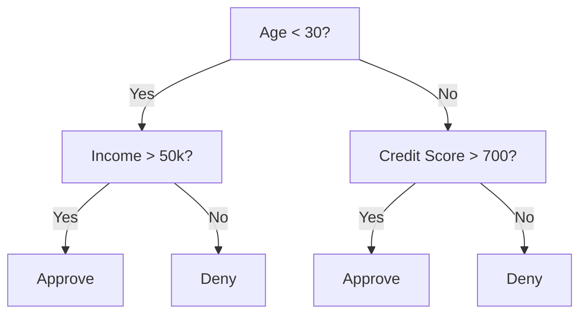
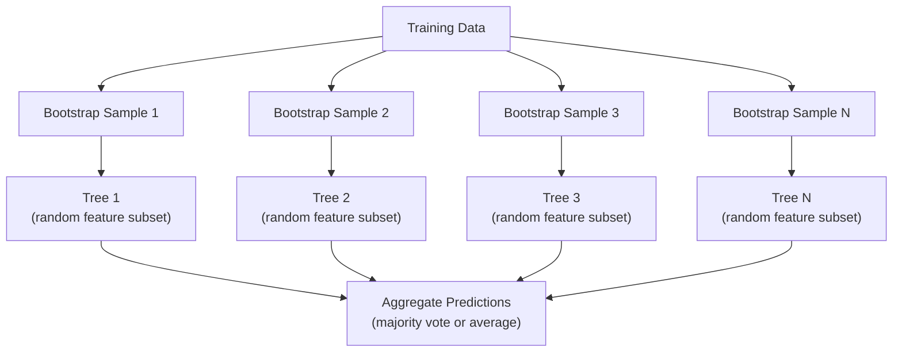

# 决策树与随机森林

> 决策树本质上就是一张流程图。但由许多棵树组成的森林，却是机器学习中最强大的工具之一。

**Type:** Build
**Language:** Python
**Prerequisites:** Phase 1 (Lessons 09 Information Theory, 06 Probability)
**Time:** ~90 minutes

## 学习目标

- 实现基尼不纯度（Gini impurity）、熵（entropy）和信息增益（information gain）的计算，用于寻找决策树的最优分裂点
- 从零实现一个带预剪枝控制（最大深度、最小样本数）的决策树分类器
- 利用自助采样（bootstrap sampling）和特征随机化构建随机森林，并解释它为什么能降低方差
- 对比 MDI 特征重要性与置换重要性（permutation importance），并识别 MDI 在哪些情况下存在偏差

## 问题背景

你手里有一份表格数据。行是样本，列是特征，还有一个你想预测的目标列。你当然可以直接上神经网络。但在表格数据上，基于树的模型（决策树、随机森林、梯度提升树）一直稳定地胜过深度学习。结构化数据的 Kaggle 竞赛由 XGBoost 和 LightGBM 主导，而不是 Transformer。

为什么？树模型无需预处理就能处理混合类型的特征（数值型和类别型）；无需特征工程就能处理非线性关系；它们是可解释的：你可以直接看树，确切地知道一个预测是怎么得出的。而随机森林通过对许多棵树取平均，在中等规模的数据集上对过拟合有很强的抵抗力。

本课先用递归分裂从零构建决策树，再在此基础上构建随机森林。你将亲手实现分裂准则背后的数学（基尼不纯度、熵、信息增益），并理解为什么一组弱学习器的集成能变成一个强学习器。

## 核心概念

### 决策树做什么

决策树通过一系列是/否问题，把特征空间划分成一个个矩形区域。



每个内部节点用一个阈值检验一个特征，每个叶子节点给出一个预测。对一个新的数据点做分类时，从根节点出发，沿着分支一路走到某个叶子节点。

树是自顶向下构建的：在每个节点上，选出最能把数据分开的特征和阈值。「最能分开」由分裂准则定义。

### 分裂准则：度量不纯度

在每个节点上，我们有一组样本。我们希望把它们分开，使得分出的子节点尽可能「纯」——也就是每个子节点中绝大多数样本属于同一类。

**基尼不纯度（Gini impurity）** 度量的是：如果按该节点的类别分布随机给一个样本打标签，它被分错类的概率。

```
Gini(S) = 1 - sum(p_k^2)

where p_k is the proportion of class k in set S.
```

对于纯节点（全是同一类），Gini = 0。对于类别五五开的二分类节点，Gini = 0.5。值越低越好。

```
Example: 6 cats, 4 dogs

Gini = 1 - (0.6^2 + 0.4^2) = 1 - (0.36 + 0.16) = 0.48
```

**熵（Entropy）** 度量一个节点中的信息量（混乱程度）。第一阶段第 09 课讲过。

```
Entropy(S) = -sum(p_k * log2(p_k))
```

对于纯节点，熵 = 0。对于五五开的二分类节点，熵 = 1.0。值越低越好。

```
Example: 6 cats, 4 dogs

Entropy = -(0.6 * log2(0.6) + 0.4 * log2(0.4))
        = -(0.6 * -0.737 + 0.4 * -1.322)
        = 0.442 + 0.529
        = 0.971 bits
```

**信息增益（Information gain）** 是分裂后不纯度（熵或基尼）的减少量。

```
IG(S, feature, threshold) = Impurity(S) - weighted_avg(Impurity(S_left), Impurity(S_right))

where the weights are the proportions of samples in each child.
```

每个节点上的贪心算法是：把每个特征、每个可能的阈值都试一遍，选出使信息增益最大的（特征，阈值）组合。

### 分裂的具体过程

对于当前节点上有 n 个特征、m 个样本的数据集：

1. 对每个特征 j（j = 1 到 n）：
   - 按特征 j 对样本排序
   - 把相邻不同取值之间的每个中点都作为候选阈值试一遍
   - 计算每个阈值对应的信息增益
2. 选出信息增益最高的特征和阈值
3. 把数据分成左子集（feature <= threshold）和右子集（feature > threshold）
4. 对每个子节点递归执行上述过程

这种贪心方法并不保证得到全局最优的树。寻找最优树是 NP 难问题。但贪心分裂在实践中效果很好。

### 停止条件

如果没有停止条件，树会一直生长，直到每个叶子都是纯的（每个叶子只有一个样本）。这相当于把训练数据完美地背下来，泛化能力极差。

**预剪枝（Pre-pruning）** 在树完全长成之前就停止生长：
- 最大深度：树达到设定深度后停止分裂
- 每叶最小样本数：节点样本数少于 k 时停止
- 最小信息增益：最优分裂带来的不纯度改善低于某个阈值时停止
- 最大叶子数：限制叶子节点的总数

**后剪枝（Post-pruning）** 先把树完全长成，再往回修剪：
- 代价复杂度剪枝（scikit-learn 采用的方法）：加一个与叶子数成正比的惩罚项。惩罚越大，得到的树越小
- 降低错误剪枝：如果删除某棵子树不会使验证误差上升，就删掉它

预剪枝更简单、更快。后剪枝往往能得到更好的树，因为它不会过早地砍掉那些可能引出有用后续分裂的分裂点。

### 用于回归的决策树

做回归时，叶子节点的预测值是该叶子中目标值的均值。分裂准则也随之改变：

**方差缩减（Variance reduction）** 取代了信息增益：

```
VR(S, feature, threshold) = Var(S) - weighted_avg(Var(S_left), Var(S_right))
```

选择使方差减少最多的分裂。这样树就把输入空间划分成若干区域，在每个区域内预测一个常数（均值）。

### 随机森林：集成的力量

单棵决策树是高方差的：数据的微小变化可能产生完全不同的树。随机森林通过对许多棵树取平均来解决这个问题。



两种随机性来源让这些树彼此不同：

**Bagging（自助聚合，bootstrap aggregating）：** 每棵树都在一个自助样本上训练，即从训练数据中有放回地随机抽样。每个自助样本大约包含原始样本的 63%（剩下的是袋外样本，可用于验证）。

**特征随机化：** 每次分裂时，只考虑特征的一个随机子集。分类任务默认是 sqrt(n_features)，回归任务是 n_features/3。这能避免所有树都在同一个主导特征上分裂。

关键洞察在于：对许多彼此去相关的树取平均，能在不增加偏差的前提下降低方差。每棵树单独看可能很平庸，但整个集成是强大的。

### 特征重要性

随机森林天然提供特征重要性评分。最常用的方法是：

**平均不纯度减少（Mean Decrease in Impurity，MDI）：** 对每个特征，把它在所有树、所有节点上带来的不纯度减少量加总。在更靠前的分裂中带来更大不纯度减少的特征更重要。

```
importance(feature_j) = sum over all nodes where feature_j is used:
    (n_samples_at_node / n_total_samples) * impurity_decrease
```

这种方法很快（训练时顺带算出），但会偏向高基数特征和候选分裂点很多的特征。

**置换重要性（Permutation importance）** 是另一种方法：把某个特征的取值打乱，看模型准确率下降多少。更可靠，但更慢。

### 什么时候树能打败神经网络

在表格数据上，树和森林对神经网络占据压倒性优势。原因有几个：

| 因素 | 树模型 | 神经网络 |
|--------|-------|----------------|
| 混合类型（数值 + 类别） | 原生支持 | 需要编码 |
| 小数据集（< 10k 行） | 表现良好 | 容易过拟合 |
| 特征交互 | 通过分裂自动发现 | 需要架构设计 |
| 可解释性 | 完全透明 | 黑盒 |
| 训练时间 | 几分钟 | 几小时 |
| 超参数敏感度 | 低 | 高 |

当数据具有空间或序列结构（图像、文本、音频）时，神经网络获胜。对于扁平的特征表格，树是默认选择。

```figure
decision-tree-depth
```

## 从零实现

### 第 1 步：基尼不纯度和熵

从零实现两种分裂准则，并验证它们对「好分裂」的判断是一致的。

```python
import math

def gini_impurity(labels):
    n = len(labels)
    if n == 0:
        return 0.0
    counts = {}
    for label in labels:
        counts[label] = counts.get(label, 0) + 1
    return 1.0 - sum((c / n) ** 2 for c in counts.values())

def entropy(labels):
    n = len(labels)
    if n == 0:
        return 0.0
    counts = {}
    for label in labels:
        counts[label] = counts.get(label, 0) + 1
    return -sum(
        (c / n) * math.log2(c / n) for c in counts.values() if c > 0
    )
```

### 第 2 步：寻找最优分裂

把每个特征、每个阈值都试一遍，返回信息增益最高的那一个。

```python
def information_gain(parent_labels, left_labels, right_labels, criterion="gini"):
    measure = gini_impurity if criterion == "gini" else entropy
    n = len(parent_labels)
    n_left = len(left_labels)
    n_right = len(right_labels)
    if n_left == 0 or n_right == 0:
        return 0.0
    parent_impurity = measure(parent_labels)
    child_impurity = (
        (n_left / n) * measure(left_labels) +
        (n_right / n) * measure(right_labels)
    )
    return parent_impurity - child_impurity
```

### 第 3 步：构建 DecisionTree 类

递归分裂、预测，以及特征重要性的统计。

```python
class DecisionTree:
    def __init__(self, max_depth=None, min_samples_split=2,
                 min_samples_leaf=1, criterion="gini",
                 max_features=None):
        self.max_depth = max_depth
        self.min_samples_split = min_samples_split
        self.min_samples_leaf = min_samples_leaf
        self.criterion = criterion
        self.max_features = max_features
        self.tree = None
        self.feature_importances_ = None

    def fit(self, X, y):
        self.n_features = len(X[0])
        self.feature_importances_ = [0.0] * self.n_features
        self.n_samples = len(X)
        self.tree = self._build(X, y, depth=0)
        total = sum(self.feature_importances_)
        if total > 0:
            self.feature_importances_ = [
                fi / total for fi in self.feature_importances_
            ]

    def predict(self, X):
        return [self._predict_one(x, self.tree) for x in X]
```

### 第 4 步：构建 RandomForest 类

自助采样、特征随机化和多数投票。

```python
class RandomForest:
    def __init__(self, n_trees=100, max_depth=None,
                 min_samples_split=2, max_features="sqrt",
                 criterion="gini"):
        self.n_trees = n_trees
        self.max_depth = max_depth
        self.min_samples_split = min_samples_split
        self.max_features = max_features
        self.criterion = criterion
        self.trees = []

    def fit(self, X, y):
        n = len(X)
        for _ in range(self.n_trees):
            indices = [random.randint(0, n - 1) for _ in range(n)]
            X_boot = [X[i] for i in indices]
            y_boot = [y[i] for i in indices]
            tree = DecisionTree(
                max_depth=self.max_depth,
                min_samples_split=self.min_samples_split,
                max_features=self.max_features,
                criterion=self.criterion,
            )
            tree.fit(X_boot, y_boot)
            self.trees.append(tree)

    def predict(self, X):
        all_preds = [tree.predict(X) for tree in self.trees]
        predictions = []
        for i in range(len(X)):
            votes = {}
            for preds in all_preds:
                v = preds[i]
                votes[v] = votes.get(v, 0) + 1
            predictions.append(max(votes, key=votes.get))
        return predictions
```

完整实现及全部辅助方法见 `code/trees.py`。

## 生产实践

用 scikit-learn 训练随机森林只需三行代码：

```python
from sklearn.ensemble import RandomForestClassifier
from sklearn.datasets import load_iris
from sklearn.model_selection import train_test_split

X, y = load_iris(return_X_y=True)
X_train, X_test, y_train, y_test = train_test_split(X, y, random_state=42)

rf = RandomForestClassifier(n_estimators=100, random_state=42)
rf.fit(X_train, y_train)
print(f"Accuracy: {rf.score(X_test, y_test):.4f}")
print(f"Feature importances: {rf.feature_importances_}")
```

实践中，梯度提升树（XGBoost、LightGBM、CatBoost）通常比随机森林更强，因为它们按顺序构建树，每棵新树都在纠正前面树的错误。但随机森林更不容易配错，几乎不需要超参数调优。

## 交付产物

本课产出 `outputs/prompt-tree-interpreter.md`——一个面向业务相关方解读决策树分裂的提示词。把训练好的树的结构（深度、特征、分裂阈值、准确率）喂给它，它会把模型翻译成大白话规则，给特征重要性排序，标记过拟合或数据泄漏的迹象，并给出后续行动建议。每当你需要向不读代码的人解释一个树模型时，都可以用它。

## 练习

1. 在一个有 3 个类别的二维数据集上训练一棵决策树。手动追踪各次分裂，画出矩形决策边界。对比 max_depth=2 和 max_depth=10 时的边界。

2. 为回归树实现方差缩减分裂。生成 200 个 y = sin(x) + noise 的数据点，用你的回归树拟合。把树的分段常数预测和真实曲线画在一起对比。

3. 分别用 1、5、10、50、200 棵树构建随机森林。绘制训练准确率和测试准确率随树数量变化的曲线。观察测试准确率会趋于平稳但不会下降（森林抗过拟合）。

4. 在 5 个不同的数据集上对比基尼不纯度和熵作为分裂准则的效果。测量准确率和树的深度。大多数情况下两者结果几乎一样，解释为什么。

5. 实现置换重要性。在这样一个数据集上把它和 MDI 重要性做对比：其中一个特征是随机噪声但基数很高。MDI 会把这个噪声特征排得很靠前，而置换重要性不会。

## 关键术语

| 术语 | 人们怎么说 | 实际含义 |
|------|----------------|----------------------|
| 决策树 | 「用来做预测的流程图」 | 通过学习一系列 if/else 分裂，把特征空间划分成矩形区域的模型 |
| 基尼不纯度 | 「节点有多混杂」 | 在某节点随机抽一个样本被分错类的概率。0 = 纯，二分类时 0.5 = 最大不纯度 |
| 熵 | 「节点的混乱程度」 | 节点的信息量。0 = 纯，二分类时 1.0 = 最大不确定性。来自信息论 |
| 信息增益 | 「一次分裂有多好」 | 分裂后不纯度的减少量。选择分裂的贪心准则 |
| 预剪枝 | 「提前停止树的生长」 | 通过设置最大深度、最小样本数或最小增益阈值，提前停止树的生长 |
| 后剪枝 | 「事后修剪树」 | 先长出完整的树，再删除那些对验证性能没有提升的子树 |
| Bagging | 「在随机子集上训练」 | 自助聚合（bootstrap aggregating）。每个模型在不同的有放回随机样本上训练 |
| 随机森林 | 「一堆树」 | 决策树的集成，每棵树在自助样本上训练，每次分裂只用随机特征子集 |
| 特征重要性（MDI） | 「哪些特征重要」 | 每个特征在所有树和节点上贡献的不纯度减少总量 |
| 置换重要性 | 「打乱再看效果」 | 随机打乱某特征取值后准确率的下降量。对噪声特征比 MDI 更可靠 |
| 方差缩减 | 「信息增益的回归版」 | 信息增益在回归树中的对应物。选择使目标方差减少最多的分裂 |
| 自助样本 | 「允许重复的随机抽样」 | 从原始数据集中有放回抽取的随机样本。与原数据集等大，但含重复样本 |

## 延伸阅读

- [Breiman: Random Forests (2001)](https://link.springer.com/article/10.1023/A:1010933404324) - 随机森林的原始论文
- [Grinsztajn et al.: Why do tree-based models still outperform deep learning on tabular data? (2022)](https://arxiv.org/abs/2207.08815) - 树模型与神经网络在表格任务上的严谨对比
- [scikit-learn Decision Trees documentation](https://scikit-learn.org/stable/modules/tree.html) - 实用指南，附可视化工具
- [XGBoost: A Scalable Tree Boosting System (Chen & Guestrin, 2016)](https://arxiv.org/abs/1603.02754) - 主导 Kaggle 的梯度提升论文
