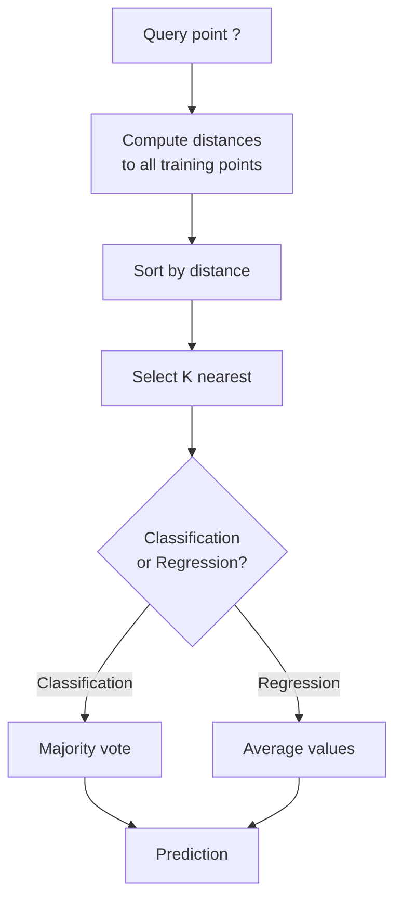
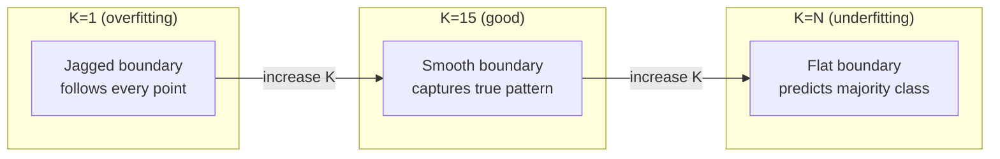
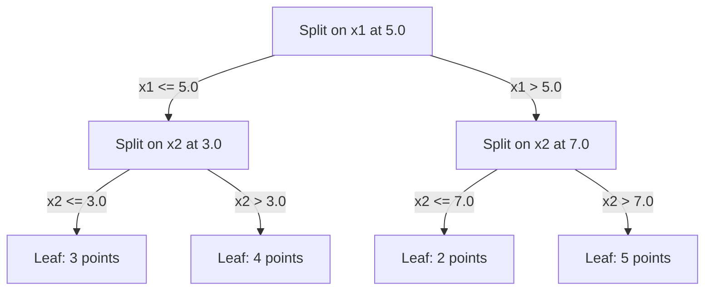

# K 近邻与距离

> 存下所有数据，预测时看邻居。最简单却真正管用的算法。

**Type:** Build
**Language:** Python
**Prerequisites:** Phase 1 (Lesson 14 Norms and Distances)
**Time:** ~90 minutes

## 学习目标

- 从零实现 KNN 分类与回归，支持可配置的 K 值和距离加权投票
- 比较 L1、L2、余弦和 Minkowski 距离度量，并能针对给定数据类型选择合适的度量
- 解释维度灾难（curse of dimensionality），并演示 KNN 为何在高维空间中性能退化
- 构建 KD 树以实现高效的最近邻搜索，并分析它在何时优于暴力搜索

## 问题背景

你有一个数据集，一个新数据点到来，你需要对它进行分类或预测它的值。与从数据中学习参数的方法（如线性回归或 SVM）不同，你只需找到离新数据点最近的 K 个训练点，让它们投票决定结果。

这就是 K 近邻（K-nearest neighbors）。它没有训练阶段，没有要学习的参数，没有要最小化的损失函数。你存储整个训练集，在预测时才计算距离。

听起来简单到不像能管用。但在许多问题上 KNN 的竞争力出人意料，尤其是中小规模数据集；而且深入理解它能揭示一些基础概念：距离度量的选择（呼应 Phase 1 第 14 课）、维度灾难，以及惰性学习与积极学习的区别。

KNN 也以不同的名字出现在现代 AI 的各个角落。向量数据库在嵌入（embedding）上做 KNN 搜索；检索增强生成（RAG）查找最近的 K 个文档块；推荐系统寻找相似的用户或物品。算法是同一个，不同的只是规模和数据结构。

## 核心概念

### KNN 的工作原理

给定一个带标签的数据集和一个新的查询点：

1. 计算查询点到数据集中每个点的距离
2. 按距离排序
3. 取最近的 K 个点
4. 分类任务：在 K 个邻居中进行多数投票
5. 回归任务：对 K 个邻居的值取平均（或加权平均）



这就是整个算法。没有拟合，没有梯度下降，没有训练轮次。

### 选择 K

K 是唯一的超参数。它控制偏差-方差权衡：

| K | 行为 |
|---|----------|
| K = 1 | 决策边界跟随每一个点。训练误差为零。方差高。过拟合 |
| 较小的 K（3-5） | 对局部结构敏感。能捕捉复杂的边界 |
| 较大的 K | 边界更平滑。对噪声更稳健。可能欠拟合 |
| K = N | 对每个点都预测多数类。偏差最大 |

对于包含 N 个点的数据集，一个常见的起点是 K = sqrt(N)。二分类时使用奇数 K 以避免平票。



### 距离度量

距离函数定义了"近"的含义。不同的度量会产生不同的邻居、不同的预测。

**L2（欧氏距离）**是默认选择。即直线距离。

```
d(a, b) = sqrt(sum((a_i - b_i)^2))
```

对特征尺度敏感。在 KNN 中使用 L2 之前务必先对特征做标准化。

**L1（曼哈顿距离）**对绝对差值求和。由于不对差值取平方，它比 L2 对离群值更稳健。

```
d(a, b) = sum(|a_i - b_i|)
```

**余弦距离**衡量向量之间的夹角，忽略模长。对文本和嵌入数据至关重要。

```
d(a, b) = 1 - (a . b) / (||a|| * ||b||)
```

**Minkowski 距离**通过参数 p 推广了 L1 和 L2。

```
d(a, b) = (sum(|a_i - b_i|^p))^(1/p)

p=1: Manhattan
p=2: Euclidean
p->inf: Chebyshev (max absolute difference)
```

选用哪种度量取决于数据：

| 数据类型 | 最佳度量 | 原因 |
|-----------|------------|-----|
| 数值特征，尺度相近 | L2（欧氏） | 默认选择，适合空间数据 |
| 数值特征，存在离群值 | L1（曼哈顿） | 稳健，不会放大较大的差值 |
| 文本嵌入 | 余弦 | 模长是噪声，方向才是语义 |
| 高维稀疏数据 | 余弦或 L1 | L2 受维度灾难影响 |
| 混合类型 | 自定义距离 | 按特征类型组合不同度量 |

### 加权 KNN

标准 KNN 对所有 K 个邻居一视同仁。但距离 0.1 的邻居理应比距离 5.0 的邻居更重要。

**距离加权 KNN** 按距离的倒数为每个邻居赋权：

```
weight_i = 1 / (distance_i + epsilon)

For classification: weighted vote
For regression:     weighted average = sum(w_i * y_i) / sum(w_i)
```

epsilon 用来防止查询点与某个训练点完全重合时出现除零。

加权 KNN 对 K 的选择不那么敏感，因为无论如何，遥远的邻居贡献都很小。

### 维度灾难

KNN 的性能在高维下会退化。这不是一种模糊的担忧，而是数学事实。

**问题 1：距离趋同。**随着维度增加，最大距离与最小距离之比趋近于 1。所有点到查询点的距离变得几乎一样"远"。

```
In d dimensions, for random uniform points:

d=2:    max_dist / min_dist = varies widely
d=100:  max_dist / min_dist ~ 1.01
d=1000: max_dist / min_dist ~ 1.001

When all distances are nearly equal, "nearest" is meaningless.
```

**问题 2：体积爆炸。**要在数据的固定比例内捕获 K 个邻居，你需要把搜索半径扩展到覆盖特征空间中大得多的比例。高维中的"邻域"几乎囊括了整个空间。

**问题 3：角落主导。**在 d 维单位超立方体中，大部分体积集中在角落附近，而不是中心。随着 d 增大，内切于立方体的球体所占的体积比例趋于零。

实际影响：KNN 在大约 20-50 个特征以内表现良好。超过这个范围，你需要在应用 KNN 之前先做降维（PCA、UMAP、t-SNE），或者使用能利用数据内在低维结构的树形搜索结构。

### KD 树：快速最近邻搜索

暴力 KNN 要计算查询点到每个训练点的距离，每次查询的开销是 O(n * d)。对大数据集来说太慢了。

KD 树（KD-tree）沿特征轴递归地划分空间。在每一层，它在某一维度的中位数处进行切分。



要查找最近邻，先沿树遍历到包含查询点的叶子节点，然后回溯，仅在相邻分区可能包含更近的点时才去检查它们。

平均查询时间：低维下为 O(log n)。但在高维（d > 20）下 KD 树会退化到 O(n)，因为回溯过程能剪掉的分支越来越少。

### Ball 树：更适合中等维度

Ball 树（ball tree）把数据划分为嵌套的超球体，而不是与坐标轴对齐的方盒。每个节点定义一个球（球心 + 半径），包含该子树中的所有点。

相对 KD 树的优势：
- 在中等维度（最高约 50 维）下表现更好
- 能处理非轴对齐的结构
- 更紧致的包围体意味着搜索时能剪掉更多分支

KD 树和 ball 树都是精确算法。对于真正大规模的搜索（数百万个点、数百个维度），则改用近似最近邻方法（HNSW、IVF、乘积量化）。这些内容在 Phase 1 第 14 课中讲解。

### 惰性学习与积极学习

KNN 是惰性学习器（lazy learner）：训练时不做任何工作，所有计算都发生在预测时。大多数其他算法（线性回归、SVM、神经网络）是积极学习器（eager learner）：在训练时进行大量计算以构建一个紧凑的模型，之后的预测则很快。

| 方面 | 惰性（KNN） | 积极（SVM、神经网络） |
|--------|------------|------------------------|
| 训练时间 | O(1)，只需存储数据 | O(n * epochs) |
| 预测时间 | 每次查询 O(n * d) | O(d) 或 O(参数量) |
| 预测时的内存 | 存储整个训练集 | 仅存储模型参数 |
| 适应新数据 | 即时添加数据点 | 重新训练模型 |
| 决策边界 | 隐式，即时计算 | 显式，训练后固定 |

惰性学习的理想场景：
- 数据集频繁变化（增删数据点无需重新训练）
- 只需为极少量查询做预测
- 希望训练时间为零
- 数据集足够小，暴力搜索足够快

### 用于回归的 KNN

KNN 做回归时不再是多数投票，而是对 K 个邻居的目标值取平均。

```
prediction = (1/K) * sum(y_i for i in K nearest neighbors)

Or with distance weighting:
prediction = sum(w_i * y_i) / sum(w_i)
where w_i = 1 / distance_i
```

KNN 回归产生分段常数（加权时为分段平滑）的预测。它无法外推到训练数据范围之外。如果训练目标值全都介于 0 到 100 之间，KNN 永远不会预测出 200。

```figure
knn-smoothness
```

## 从零实现

### 第 1 步：距离函数

实现 L1、L2、余弦和 Minkowski 距离。这些直接对接 Phase 1 第 14 课。

```python
import math

def l2_distance(a, b):
    return math.sqrt(sum((ai - bi) ** 2 for ai, bi in zip(a, b)))

def l1_distance(a, b):
    return sum(abs(ai - bi) for ai, bi in zip(a, b))

def cosine_distance(a, b):
    dot_val = sum(ai * bi for ai, bi in zip(a, b))
    norm_a = math.sqrt(sum(ai ** 2 for ai in a))
    norm_b = math.sqrt(sum(bi ** 2 for bi in b))
    if norm_a == 0 or norm_b == 0:
        return 1.0
    return 1.0 - dot_val / (norm_a * norm_b)

def minkowski_distance(a, b, p=2):
    if p == float('inf'):
        return max(abs(ai - bi) for ai, bi in zip(a, b))
    return sum(abs(ai - bi) ** p for ai, bi in zip(a, b)) ** (1 / p)
```

### 第 2 步：KNN 分类器与回归器

构建完整的 KNN，支持可配置的 K 值、距离度量和可选的距离加权。

```python
class KNN:
    def __init__(self, k=5, distance_fn=l2_distance, weighted=False,
                 task="classification"):
        self.k = k
        self.distance_fn = distance_fn
        self.weighted = weighted
        self.task = task
        self.X_train = None
        self.y_train = None

    def fit(self, X, y):
        self.X_train = X
        self.y_train = y

    def predict(self, X):
        return [self._predict_one(x) for x in X]
```

### 第 3 步：用于高效搜索的 KD 树

从零构建一棵 KD 树，在每个维度的中位数处递归切分。

```python
class KDTree:
    def __init__(self, X, indices=None, depth=0):
        # Recursively partition the data
        self.axis = depth % len(X[0])
        # Split on median of the current axis
        ...

    def query(self, point, k=1):
        # Traverse to leaf, then backtrack
        ...
```

完整实现（含所有辅助方法和演示）见 `code/knn.py`。

### 第 4 步：特征缩放

KNN 必须做特征缩放，因为距离对特征的量级很敏感。取值范围 0 到 1000 的特征会压倒取值范围 0 到 1 的特征。

```python
def standardize(X):
    n = len(X)
    d = len(X[0])
    means = [sum(X[i][j] for i in range(n)) / n for j in range(d)]
    stds = [
        max(1e-10, (sum((X[i][j] - means[j]) ** 2 for i in range(n)) / n) ** 0.5)
        for j in range(d)
    ]
    return [[((X[i][j] - means[j]) / stds[j]) for j in range(d)] for i in range(n)], means, stds
```

## 生产实践

使用 scikit-learn：

```python
from sklearn.neighbors import KNeighborsClassifier
from sklearn.preprocessing import StandardScaler
from sklearn.pipeline import Pipeline

clf = Pipeline([
    ("scaler", StandardScaler()),
    ("knn", KNeighborsClassifier(n_neighbors=5, metric="euclidean")),
])
clf.fit(X_train, y_train)
print(f"Accuracy: {clf.score(X_test, y_test):.4f}")
```

当数据集足够大且维度足够低时，scikit-learn 会自动使用 KD 树或 ball 树。对于高维数据，它会回退到暴力搜索。你可以通过 `algorithm` 参数控制这一行为。

对于大规模最近邻搜索（数百万向量），使用 FAISS、Annoy 或向量数据库：

```python
import faiss

index = faiss.IndexFlatL2(dimension)
index.add(embeddings)
distances, indices = index.search(query_vectors, k=5)
```

## 练习

1. 在一个含 3 个类别的二维数据集上实现 KNN 分类。绘制 K=1、K=5、K=15 和 K=N 时的决策边界，观察从过拟合到欠拟合的转变。

2. 分别在 2、5、10、50、100 和 500 维空间中生成 1000 个随机点。对每个维度，计算成对距离的最大值与最小值之比。绘制该比值随维度变化的曲线，直观展示维度灾难。

3. 在一个文本分类问题上（使用 TF-IDF 向量）比较 L1、L2 和余弦距离下的 KNN。哪个度量准确率最高？为什么余弦在文本任务上往往胜出？

4. 实现一棵 KD 树，在 2 维、10 维和 50 维下，针对 1k、10k 和 100k 个点的数据集测量查询时间，并与暴力搜索对比。在多少维时 KD 树不再比暴力搜索更快？

5. 为 y = sin(x) + noise 构建一个加权 KNN 回归器。在 K=3、10、30 时与不加权的 KNN 比较，证明加权能产生更平滑的预测，尤其是在 K 较大时。

## 关键术语

| 术语 | 真正含义 |
|------|----------------------|
| K 近邻 | 非参数算法，通过查找离查询点最近的 K 个训练点来做预测 |
| 惰性学习 | 训练时不做任何计算，所有工作都发生在预测时。KNN 是典型例子 |
| 积极学习 | 在训练时进行大量计算以构建紧凑模型。大多数 ML 算法都是积极学习 |
| 维度灾难 | 高维下距离趋同、邻域扩展到覆盖大部分空间，导致 KNN 失效 |
| KD 树 | 沿特征轴递归划分空间的二叉树。低维下查询为 O(log n) |
| Ball 树 | 由嵌套超球体构成的树。在中等维度（最高约 50 维）下优于 KD 树 |
| 加权 KNN | 邻居按距离的倒数加权。更近的邻居对预测的影响更大 |
| 特征缩放 | 把特征归一化到可比较的范围。KNN 等基于距离的方法必不可少 |
| 多数投票 | 通过统计 K 个邻居中最常见的类别来分类 |
| 暴力搜索 | 计算到每个训练点的距离。每次查询 O(n*d)。精确但在 n 很大时很慢 |
| 近似最近邻 | 一类算法（HNSW、LSH、IVF），以远快于精确搜索的速度找到近似最近的点 |
| Voronoi 图 | 对空间的一种划分，每个区域包含所有离某个训练点比离其他任何训练点都近的点。K=1 的 KNN 产生 Voronoi 边界 |

## 延伸阅读

- [Cover & Hart: Nearest Neighbor Pattern Classification (1967)](https://ieeexplore.ieee.org/document/1053964) - KNN 的奠基性论文，证明其错误率至多是贝叶斯最优错误率的两倍
- [Friedman, Bentley, Finkel: An Algorithm for Finding Best Matches in Logarithmic Expected Time (1977)](https://dl.acm.org/doi/10.1145/355744.355745) - KD 树的原始论文
- [Beyer et al.: When Is "Nearest Neighbor" Meaningful? (1999)](https://link.springer.com/chapter/10.1007/3-540-49257-7_15) - 对最近邻维度灾难的形式化分析
- [scikit-learn Nearest Neighbors documentation](https://scikit-learn.org/stable/modules/neighbors.html) - 包含算法选择建议的实用指南
- [FAISS: A Library for Efficient Similarity Search](https://github.com/facebookresearch/faiss) - Meta 推出的库，支持十亿级近似最近邻搜索
