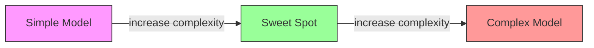
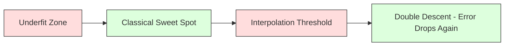
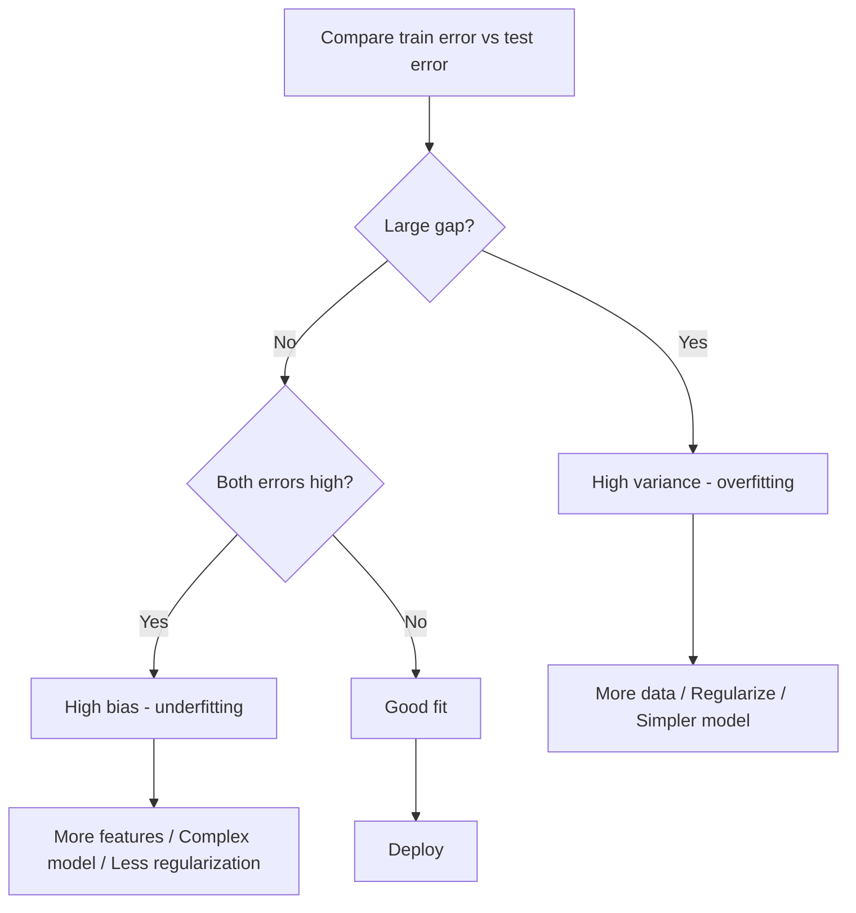
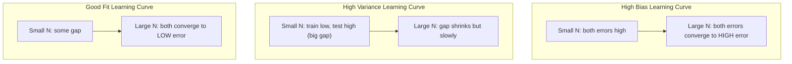
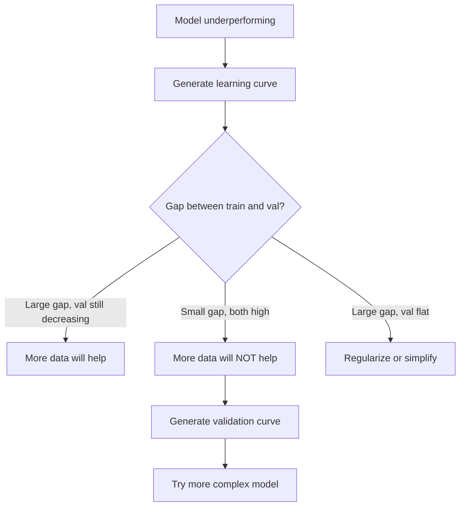

# 偏差-方差权衡

> 模型的每一份误差都来自三个来源之一：偏差、方差或噪声。你只能控制前两者。

**Type:** Learn
**Language:** Python
**Prerequisites:** Phase 2, Lessons 01-09 (ML basics, regression, classification, evaluation)
**Time:** ~75 minutes

## 学习目标

- 推导期望预测误差的偏差-方差分解，并解释不可约噪声的作用
- 利用训练误差和测试误差的模式，诊断模型是高偏差还是高方差
- 解释正则化技术（L1、L2、dropout、早停）如何用偏差换取方差
- 实现实验，在复杂度递增的模型上可视化偏差-方差权衡

## 问题背景

你训练了一个模型，它在测试数据上有一些误差。这些误差从哪里来？

如果模型过于简单（在弯曲的数据集上用线性回归），它会持续偏离真实模式，这就是偏差（bias）。如果模型过于复杂（在 15 个数据点上用 20 次多项式），它会完美拟合训练数据，但在新数据上给出天差地别的预测，这就是方差（variance）。

在模型容量固定的情况下，你无法同时最小化两者。把偏差压低，方差就上升；把方差压低，偏差就上升。理解这个权衡是机器学习中最有用的诊断技能。它告诉你：该让模型更复杂还是更简单，该去收集更多数据还是构造更好的特征，该加强正则化还是放松正则化。

## 核心概念

### 偏差：系统性误差

偏差衡量的是模型的平均预测与真实值之间的偏离程度。如果你在来自同一分布的许多不同训练集上训练同一个模型，并对预测取平均，偏差就是这个平均值与真值之间的差距。

高偏差意味着模型过于僵硬，无法捕捉真实模式。用一条直线去拟合抛物线，无论给多少数据都拟合不上那条曲线。这就是欠拟合（underfitting）。

```
High bias (underfitting):
  Model always predicts roughly the same wrong thing.
  Training error: HIGH
  Test error: HIGH
  Gap between them: SMALL
```

### 方差：对训练数据的敏感度

方差衡量的是当你在不同的数据子集上训练时，预测结果的变化幅度。如果训练集的微小变化导致模型发生巨大变化，方差就很高。

高方差意味着模型在拟合训练数据中的噪声，而不是底层信号。一个 20 次多项式会穿过每一个训练点，但在点与点之间剧烈振荡。这就是过拟合（overfitting）。

```
High variance (overfitting):
  Model fits training data perfectly but fails on new data.
  Training error: LOW
  Test error: HIGH
  Gap between them: LARGE
```

### 分解公式

对任意一点 x，在平方损失下，期望预测误差可以精确分解为：

```
Expected Error = Bias^2 + Variance + Irreducible Noise

where:
  Bias^2   = (E[f_hat(x)] - f(x))^2
  Variance = E[(f_hat(x) - E[f_hat(x)])^2]
  Noise    = E[(y - f(x))^2]             (sigma^2)
```

- `f(x)` 是真实函数
- `f_hat(x)` 是模型的预测
- `E[...]` 是对不同训练集取的期望
- `y` 是观测到的标签（真实函数加噪声）

噪声项是不可约的。在含噪声的数据上，没有任何模型能做到比 sigma^2 更好。你的任务是在 bias^2 和方差之间找到合适的平衡。

### 模型复杂度与误差



经典的 U 形曲线：

| 复杂度 | 偏差 | 方差 | 总误差 |
|-----------|------|----------|-------------|
| 过低 | 高 | 低 | 高（欠拟合） |
| 恰到好处 | 中等 | 中等 | 最低 |
| 过高 | 低 | 高 | 高（过拟合） |

### 正则化：偏差-方差的调节手段

正则化主动增加偏差来换取方差的降低。它对模型施加约束，使其无法追逐噪声。

- **L2（Ridge）：** 把所有权重向零收缩。保留全部特征，但削弱它们的影响。
- **L1（Lasso）：** 把部分权重压到恰好为零。起到特征选择的作用。
- **Dropout：** 训练时随机关闭神经元。迫使网络学到冗余的表示。
- **早停（early stopping）：** 在模型完全拟合训练数据之前停止训练。

正则化强度（lambda、dropout 比率、训练轮数）直接控制你在偏差-方差曲线上所处的位置。正则化越强，偏差越大，方差越小。

### 双下降：现代视角

经典理论认为：过了最佳点之后，复杂度越高表现越差。但 2019 年以来的研究发现了一个出乎意料的现象。如果你继续增大模型容量，远远越过插值阈值（interpolation threshold，即模型参数多到足以完美拟合训练数据的点），测试误差可能会再次下降。



这种「双下降」（double descent）现象解释了为什么严重过参数化的神经网络（参数数量远超训练样本数）仍能很好地泛化。经典的偏差-方差权衡并没有错，但对现代模型所处的范畴来说，它是不完整的。

关于双下降的关键观察：

- 它在线性模型、决策树和神经网络中都会出现
- 在插值区域附近，更多数据反而可能有害（样本维度的双下降）
- 更多训练轮数也会引发它（轮数维度的双下降）
- 正则化能压平峰值，但不能消除它

为什么会这样？在插值阈值处，模型的容量恰好够拟合所有训练点。它被迫给出一个穿过每个点的非常特定的解，数据中的微小扰动会导致拟合结果剧烈变化，这正是方差的峰值所在。越过阈值之后，模型存在许多能完美拟合数据的可能解。学习算法（例如带隐式正则化的梯度下降）倾向于在其中挑选最简单的一个。这种偏向简单解的隐式偏置，正是过参数化模型能够泛化的原因。

| 范畴 | 参数量与样本量的关系 | 行为 |
|--------|----------------------|----------|
| 欠参数化 | p << n | 经典权衡适用 |
| 插值阈值 | p ~ n | 方差达到峰值，测试误差激增 |
| 过参数化 | p >> n | 隐式正则化生效，测试误差下降 |

实践建议：如果你在用神经网络或大型树集成模型，不要停在插值阈值附近。要么远低于它（配合显式正则化），要么远超过它。最糟糕的位置就是正好卡在阈值上。

### 诊断你的模型



| 症状 | 诊断 | 处方 |
|---------|-----------|-----|
| 训练误差高、测试误差高 | 偏差 | 更多特征、更复杂的模型、减弱正则化 |
| 训练误差低、测试误差高 | 方差 | 更多数据、正则化、更简单的模型、dropout |
| 训练误差低、测试误差低 | 拟合良好 | 直接上线 |
| 训练误差在下降、测试误差在上升 | 过拟合正在发生 | 早停 |

### 实用策略

**当偏差是问题时：**
- 添加多项式特征或交互特征
- 使用更灵活的模型（用树集成替代线性模型）
- 降低正则化强度
- 训练更久（如果尚未收敛）

**当方差是问题时：**
- 获取更多训练数据
- 使用 bagging（随机森林）
- 加强正则化（更大的 lambda、更高的 dropout）
- 特征选择（剔除噪声特征）
- 用交叉验证及早发现问题

### 集成方法与方差削减

集成方法是对抗方差最实用的工具。

**Bagging（Bootstrap Aggregating，自助聚合）** 在训练数据的不同自助采样（bootstrap）样本上训练多个模型，然后对它们的预测取平均。每个单独的模型方差都很高，但平均之后方差大幅降低。随机森林就是把 bagging 应用在决策树上。

它在数学上为什么有效：如果你对 N 个相互独立、方差均为 sigma^2 的预测取平均，平均值的方差是 sigma^2 / N。这些模型并非真正独立（它们看到的数据相似），所以削减幅度达不到 1/N，但仍然相当可观。

**Boosting（提升法）** 通过顺序构建模型来降低偏差，每个新模型都专注于纠正当前集成的错误。梯度提升（gradient boosting）和 AdaBoost 是主要代表。如果添加的模型过多，boosting 会过拟合，因此需要早停或正则化。

| 方法 | 主要作用 | 偏差变化 | 方差变化 |
|--------|---------------|-------------|-----------------|
| Bagging | 降低方差 | 不变 | 下降 |
| Boosting | 降低偏差 | 下降 | 可能上升 |
| Stacking | 两者都降 | 取决于元学习器 | 取决于基模型 |
| Dropout | 隐式 bagging | 略微上升 | 下降 |

**实用法则：** 如果基模型方差高（深树、高次多项式），用 bagging；如果基模型偏差高（浅层树桩、简单线性模型），用 boosting。

### 学习曲线

学习曲线把训练误差和验证误差画成训练集规模的函数。它是你手头最实用的诊断工具。与单次 train/test 对比不同，学习曲线展示了模型的变化轨迹，能告诉你更多数据是否会有帮助。



如何解读：

| 场景 | 训练误差 | 验证误差 | 差距 | 含义 | 应对措施 |
|----------|---------------|-----------------|-----|---------------|------------|
| 高偏差 | 高 | 高 | 小 | 模型无法捕捉模式 | 更多特征、更复杂的模型、减弱正则化 |
| 高方差 | 低 | 高 | 大 | 模型在死记硬背训练数据 | 更多数据、正则化、更简单的模型 |
| 拟合良好 | 中等 | 中等 | 小 | 模型泛化良好 | 直接上线 |
| 高方差但在改善 | 低 | 随数据增多而下降 | 在收窄 | 数据可以解决的方差问题 | 收集更多数据 |
| 高偏差且曲线平坦 | 高 | 高且平坦 | 小且平坦 | 更多数据不会有帮助 | 更换模型架构 |

关键洞察：如果两条曲线都已进入平台期、差距很小但误差都很高，更多数据毫无用处，你需要更好的模型。如果差距很大且仍在收窄，更多数据会有帮助。

### 如何生成学习曲线

有两种做法：

**方法 1：固定模型，改变训练集规模。** 保持模型和超参数不变，在逐渐增大的训练数据子集上训练，在每个规模下测量训练误差和验证误差。这是标准的学习曲线。

**方法 2：固定数据，改变模型复杂度。** 保持数据不变，扫描某个复杂度参数（多项式次数、树深度、层数），在每个复杂度下测量训练误差和验证误差。这是验证曲线（validation curve），它直接展示偏差-方差权衡。

两种方法互为补充。第一种告诉你更多数据是否有帮助，第二种告诉你换个模型是否有帮助。在决定下一步之前，两个都跑一遍。



```figure
bias-variance
```

## 从零实现

`code/bias_variance.py` 中的代码会运行完整的偏差-方差分解实验。下面逐步讲解思路。

### 第 1 步：从已知函数生成合成数据

我们使用 `f(x) = sin(1.5x) + 0.5x` 加上高斯噪声。知道真实函数，我们才能精确计算偏差和方差。

```python
def true_function(x):
    return np.sin(1.5 * x) + 0.5 * x

def generate_data(n_samples=30, noise_std=0.5, x_range=(-3, 3), seed=None):
    rng = np.random.RandomState(seed)
    x = rng.uniform(x_range[0], x_range[1], n_samples)
    y = true_function(x) + rng.normal(0, noise_std, n_samples)
    return x, y
```

### 第 2 步：自助采样与多项式拟合

对每一个多项式次数，我们抽取许多自助采样训练集，拟合多项式，并记录在固定测试网格上的预测。这样在每个测试点上都得到了一个预测分布。

```python
def fit_polynomial(x_train, y_train, degree, lam=0.0):
    X = np.column_stack([x_train ** d for d in range(degree + 1)])
    if lam > 0:
        penalty = lam * np.eye(X.shape[1])
        penalty[0, 0] = 0
        w = np.linalg.solve(X.T @ X + penalty, X.T @ y_train)
    else:
        w = np.linalg.lstsq(X, y_train, rcond=None)[0]
    return w
```

我们在 200 个不同的自助采样样本上拟合。每个自助样本都来自同一个底层分布，但包含不同的数据点。

### 第 3 步：计算 Bias^2 与方差分解

在每个测试点上有了 200 组预测，我们就可以直接按定义计算分解：

```python
mean_pred = predictions.mean(axis=0)
bias_sq = np.mean((mean_pred - y_true) ** 2)
variance = np.mean(predictions.var(axis=0))
total_error = np.mean(np.mean((predictions - y_true) ** 2, axis=1))
```

- `mean_pred` 是由自助样本估计的 E[f_hat(x)]
- `bias_sq` 是平均预测与真值之间差距的平方
- `variance` 是各自助样本预测的平均离散程度
- `total_error` 应当近似等于 bias^2 + variance + noise

### 第 4 步：学习曲线

学习曲线在固定模型复杂度的同时扫描训练集规模。它能显示你的模型是受限于数据，还是受限于容量。

```python
def demo_learning_curves():
    sizes = [10, 15, 20, 30, 50, 75, 100, 150, 200, 300]
    degree = 5

    for n in sizes:
        train_errors = []
        test_errors = []
        for seed in range(50):
            x_train, y_train = generate_data(n_samples=n, seed=seed * 100)
            w = fit_polynomial(x_train, y_train, degree)
            train_pred = predict_polynomial(x_train, w)
            train_mse = np.mean((train_pred - y_train) ** 2)
            test_pred = predict_polynomial(x_test, w)
            test_mse = np.mean((test_pred - y_test) ** 2)
            train_errors.append(train_mse)
            test_errors.append(test_mse)
        # Average over runs gives the learning curve point
```

对高方差模型（5 次多项式配少量数据），你会看到：
- 训练误差从低位起步，随着数据增多、死记硬背变难而上升
- 测试误差从高位起步，随着模型获得更多信号而下降
- 差距随数据增多而收窄

对高偏差模型（1 次多项式），两条误差曲线很快收敛到同一个较高的值，更多数据无济于事。

### 第 5 步：正则化扫描

代码中还包含 `demo_regularization_sweep()`，它固定一个高次多项式（15 次），把 Ridge 正则化强度从 0.001 扫到 100。这从另一个角度展示偏差-方差权衡：不是改变模型复杂度，而是改变约束强度。

```python
def demo_regularization_sweep():
    alphas = [0.001, 0.005, 0.01, 0.05, 0.1, 0.5, 1.0, 5.0, 10.0, 50.0, 100.0]
    for alpha in alphas:
        results = bias_variance_decomposition([15], lam=alpha)
        r = results[15]
        print(f"alpha={alpha:.3f}  bias={r['bias_sq']:.4f}  var={r['variance']:.4f}")
```

在低 alpha 时，15 次多项式几乎不受约束，方差占主导，因为模型在每个自助样本中都追逐噪声。在高 alpha 时，惩罚强到模型实际上变成了近似常数函数，偏差占主导。最优的 alpha 位于这两个极端之间。

这与改变多项式次数得到的是同一条 U 形曲线，只是由一个连续旋钮控制，而不是离散参数。在实践中，正则化是控制这一权衡的首选方式，因为它无需改动特征集就能实现细粒度控制。

## 生产实践

sklearn 提供了 `learning_curve` 和 `validation_curve`，无需自己写自助采样循环就能自动完成这些诊断。

### 验证曲线：扫描模型复杂度

```python
from sklearn.model_selection import validation_curve
from sklearn.pipeline import make_pipeline
from sklearn.preprocessing import PolynomialFeatures
from sklearn.linear_model import Ridge

degrees = list(range(1, 16))
train_scores_all = []
val_scores_all = []

for d in degrees:
    pipe = make_pipeline(PolynomialFeatures(d), Ridge(alpha=0.01))
    train_scores, val_scores = validation_curve(
        pipe, X, y, param_name="polynomialfeatures__degree",
        param_range=[d], cv=5, scoring="neg_mean_squared_error"
    )
    train_scores_all.append(-train_scores.mean())
    val_scores_all.append(-val_scores.mean())
```

这直接给出偏差-方差权衡曲线。验证分数相对训练分数最差的地方，是方差主导；两者都差的地方，是偏差主导。

### 学习曲线：扫描训练集规模

```python
from sklearn.model_selection import learning_curve

pipe = make_pipeline(PolynomialFeatures(5), Ridge(alpha=0.01))
train_sizes, train_scores, val_scores = learning_curve(
    pipe, X, y, train_sizes=np.linspace(0.1, 1.0, 10),
    cv=5, scoring="neg_mean_squared_error"
)
train_mse = -train_scores.mean(axis=1)
val_mse = -val_scores.mean(axis=1)
```

把 `train_mse` 和 `val_mse` 对 `train_sizes` 作图。曲线的形状会把模型的一切都告诉你。

### 交叉验证配合正则化扫描

```python
from sklearn.model_selection import cross_val_score

alphas = [0.001, 0.01, 0.1, 1.0, 10.0, 100.0]
for alpha in alphas:
    pipe = make_pipeline(PolynomialFeatures(10), Ridge(alpha=alpha))
    scores = cross_val_score(pipe, X, y, cv=5, scoring="neg_mean_squared_error")
    print(f"alpha={alpha:>7.3f}  MSE={-scores.mean():.4f} +/- {scores.std():.4f}")
```

这是在固定模型复杂度下扫描正则化强度。你会看到同样的偏差-方差权衡：alpha 低意味着方差高，alpha 高意味着偏差高。

### 整合起来：一套完整的诊断流程

实践中，按以下顺序运行这些诊断：

1. 训练模型，计算训练误差和测试误差。
2. 如果两者都高：你遇到的是偏差问题，跳到第 4 步。
3. 如果训练误差低但测试误差高：你遇到的是方差问题。生成学习曲线，看更多数据是否有帮助；如果没有，就加正则化。
4. 生成验证曲线，扫描你的主要复杂度参数，找到最佳点。
5. 在最佳点处生成学习曲线。如果差距仍然很大，你需要更多数据或正则化。
6. 用 `cross_val_score` 尝试不同 alpha 值的 Ridge/Lasso，选出交叉验证误差最低的 alpha。

对大多数表格数据集，这套流程只需 10-15 分钟的计算时间，却能省去数小时的盲目猜测。

## 交付产物

本课产出：`outputs/prompt-model-diagnostics.md`

## 练习

1. 用 `noise_std=0`（无噪声）运行分解实验。不可约误差项会发生什么？最优复杂度会改变吗？

2. 把训练集规模从 30 增加到 300。这对方差分量有什么影响？最优多项式次数会移动吗？

3. 在实验中加入 L2 正则化（Ridge 回归）。固定一个高次多项式（15 次），把 lambda 从 0 扫到 100，画出 bias^2 和方差随 lambda 变化的曲线。

4. 把真实函数从多项式改成 `sin(x)`。偏差-方差分解会如何变化？是否仍然存在一个明确的最优次数？

5. 实现一个简单的自助聚合（bagging）包装器：在自助样本上训练 10 个模型并对预测取平均。证明这能降低方差，而偏差几乎不增加。

## 关键术语

| 术语 | 人们怎么说 | 实际含义 |
|------|----------------|----------------------|
| 偏差（Bias） | 「模型太简单了」 | 来自错误假设的系统性误差。模型平均预测与真值之间的差距。 |
| 方差（Variance） | 「模型过拟合了」 | 来自对训练数据敏感的误差。预测在不同训练集之间变化的幅度。 |
| 不可约误差 | 「数据里的噪声」 | 来自真实数据生成过程中随机性的误差。没有任何模型能消除它。 |
| 欠拟合 | 「学得不够」 | 模型偏差高，即使在训练数据上也抓不住真实模式。 |
| 过拟合 | 「死记硬背数据」 | 模型方差高，拟合了训练数据中无法泛化的噪声。 |
| 正则化 | 「约束模型」 | 添加惩罚项以降低模型复杂度，用偏差换取更低的方差。 |
| 双下降 | 「参数更多反而可能有帮助」 | 当模型容量远超插值阈值时，测试误差再次下降。 |
| 模型复杂度 | 「模型有多灵活」 | 模型拟合任意模式的能力。由架构、特征或正则化控制。 |

## 延伸阅读

- [Hastie, Tibshirani, Friedman: Elements of Statistical Learning, Ch. 7](https://hastie.su.domains/ElemStatLearn/) -- 偏差-方差分解的权威论述
- [Belkin et al., Reconciling modern machine learning practice and the bias-variance trade-off (2019)](https://arxiv.org/abs/1812.11118) -- 双下降的开创性论文
- [Nakkiran et al., Deep Double Descent (2019)](https://arxiv.org/abs/1912.02292) -- 轮数维度与样本维度的双下降
- [Scott Fortmann-Roe: Understanding the Bias-Variance Tradeoff](http://scott.fortmann-roe.com/docs/BiasVariance.html) -- 清晰的可视化讲解
