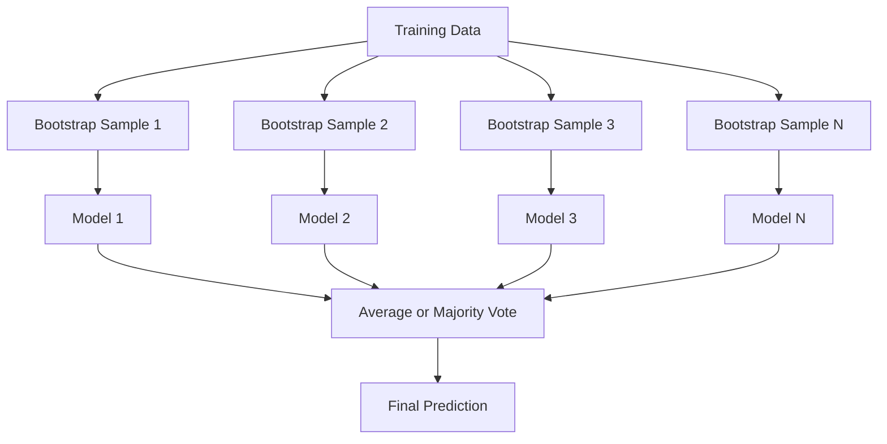
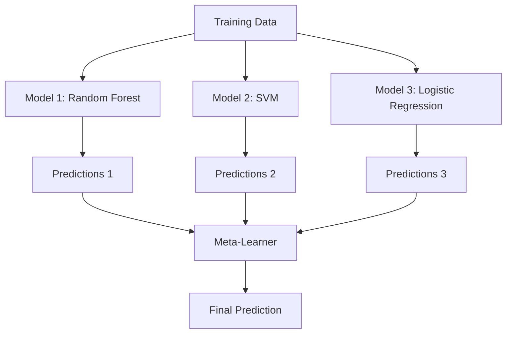

# 集成方法

> 一群弱学习器，只要组合得当，就能变成一个强学习器。这不是比喻，而是一条定理。

**Type:** Build
**Language:** Python
**Prerequisites:** Phase 2, Lesson 10 (Bias-Variance Tradeoff)
**Time:** ~120 minutes

## 学习目标

- 从零实现 AdaBoost 和梯度提升（gradient boosting），并解释提升方法如何通过串行训练逐步降低偏差
- 构建一个 bagging 集成，演示对去相关的模型取平均如何在不增加偏差的前提下降低方差
- 从各方法所针对的误差成分出发，比较 bagging、boosting 和 stacking
- 评估集成的多样性，并解释为什么独立弱学习器越多，多数投票的准确率越高

## 问题背景

单棵决策树训练快、易解释，但容易过拟合。单个线性模型在复杂边界上又会欠拟合。你可以花好几天去打磨一个完美的模型架构，也可以把一堆不完美的模型组合起来，得到一个比其中任何一个都更好的结果。

集成方法（ensemble methods）做的正是这件事。它们是在表格数据上赢得 Kaggle 竞赛最可靠的技术，支撑着大多数生产环境中的机器学习系统，同时也是偏差-方差权衡的活教材。Bagging 降低方差，boosting 降低偏差，stacking 则学习在什么输入上该信任哪个模型。

## 核心概念

### 集成为什么有效

假设你有 N 个相互独立的分类器，每个的准确率 p > 0.5。多数投票的准确率为：

```
P(majority correct) = sum over k > N/2 of C(N,k) * p^k * (1-p)^(N-k)
```

对于 21 个准确率各为 60% 的分类器，多数投票的准确率约为 74%；分类器增加到 101 个时，准确率升至 84%。只要模型犯的错误各不相同，误差就会相互抵消。

关键要求是**多样性（diversity）**。如果所有模型犯同样的错误，组合它们毫无帮助。集成之所以有效，是因为它们通过以下方式产生多样化的模型：

- 不同的训练子集（bagging）
- 不同的特征子集（随机森林）
- 串行纠错（boosting）
- 不同的模型家族（stacking）

### Bagging（自助聚合）

Bagging 通过在训练数据的不同自助采样（bootstrap sample）上训练每个模型来制造多样性。



自助采样是从原始数据中有放回地抽取的样本，规模与原始数据相同。每次自助采样中大约包含 63.2% 的不重复样本，剩下的 36.8%（袋外样本，out-of-bag samples）则提供了一个免费的验证集。

Bagging 在几乎不增加偏差的情况下降低方差。每棵树都会对自己的自助采样过拟合，但每棵树的过拟合方式不同，因此取平均能把噪声抵消掉。

**随机森林（Random Forests）**是在 bagging 之上多加了一层花样：每次分裂时只考虑特征的一个随机子集。这迫使树与树之间更加多样化。候选特征数的典型取值是：分类任务用 `sqrt(n_features)`，回归任务用 `n_features / 3`。

### Boosting（串行纠错）

Boosting 串行地训练模型。每个新模型专注于之前的模型预测错误的样本。


Boosting 降低偏差。每个新模型都在修正当前集成的系统性错误。最终预测是所有模型的加权和，表现更好的模型获得更高的权重。

代价是：如果迭代轮数太多，boosting 可能过拟合，因为它会不断去拟合越来越难的样本，而其中一部分可能只是噪声。

### AdaBoost

AdaBoost（Adaptive Boosting，自适应提升）是第一个实用的提升算法。它可以配合任何基学习器使用，通常用决策树桩（decision stump，深度为 1 的树）。

算法如下：

```
1. Initialize sample weights: w_i = 1/N for all i

2. For t = 1 to T:
   a. Train weak learner h_t on weighted data
   b. Compute weighted error:
      err_t = sum(w_i * I(h_t(x_i) != y_i)) / sum(w_i)
   c. Compute model weight:
      alpha_t = 0.5 * ln((1 - err_t) / err_t)
   d. Update sample weights:
      w_i = w_i * exp(-alpha_t * y_i * h_t(x_i))
   e. Normalize weights to sum to 1

3. Final prediction: H(x) = sign(sum(alpha_t * h_t(x)))
```

误差越低的模型获得越高的 alpha。被误分类的样本权重升高，下一个模型就会重点关注它们。

### 梯度提升

梯度提升（gradient boosting）把提升方法推广到了任意损失函数。它不再对样本重新加权，而是让每个新模型去拟合当前集成的残差（即损失的负梯度）。

```
1. Initialize: F_0(x) = argmin_c sum(L(y_i, c))

2. For t = 1 to T:
   a. Compute pseudo-residuals:
      r_i = -dL(y_i, F_{t-1}(x_i)) / dF_{t-1}(x_i)
   b. Fit a tree h_t to the residuals r_i
   c. Find optimal step size:
      gamma_t = argmin_gamma sum(L(y_i, F_{t-1}(x_i) + gamma * h_t(x_i)))
   d. Update:
      F_t(x) = F_{t-1}(x) + learning_rate * gamma_t * h_t(x)

3. Final prediction: F_T(x)
```

对于平方误差损失，伪残差就是真实残差：`r_i = y_i - F_{t-1}(x_i)`。每棵树实实在在地在拟合前一轮集成的误差。

学习率（也叫收缩系数，shrinkage）控制每棵树的贡献大小。学习率越小，需要的树越多，但泛化效果更好。典型取值：0.01 到 0.3。

### XGBoost：为什么它统治表格数据

XGBoost（eXtreme Gradient Boosting）是经过工程优化的梯度提升，这些优化使它快速、准确、不易过拟合：

- **带正则化的目标函数：**对叶子权重施加 L1 和 L2 惩罚，防止单棵树过于自信
- **二阶近似：**同时使用损失的一阶和二阶导数，做出更好的分裂决策
- **稀疏感知分裂：**原生处理缺失值，在每次分裂时学习缺失数据应走的最佳方向
- **列采样：**与随机森林类似，每次分裂时对特征采样以增加多样性
- **加权分位数草图：**在分布式数据上高效地为连续特征寻找分裂点
- **缓存感知的块结构：**针对 CPU 缓存行优化的内存布局

在表格数据上，XGBoost（以及它的后继者 LightGBM）一直稳定胜过神经网络。这种局面短期内不会改变。如果你的数据能装进一张有行有列的表，就从梯度提升开始。

### Stacking（元学习）

Stacking 把多个基模型的预测当作特征，交给一个元学习器（meta-learner）。



元学习器学习的是：对什么样的输入该信任哪个基模型。如果随机森林在某些区域表现更好，而 SVM 在另一些区域更强，元学习器就会学会相应地分配权重。

为了避免数据泄漏，基模型的预测必须通过在训练集上做交叉验证来生成。绝不能在同一份数据上既训练基模型又生成元特征。

### 投票

最简单的集成方式：直接把预测组合起来。

- **硬投票（hard voting）：**对类别标签做多数投票。
- **软投票（soft voting）：**对预测概率取平均，选平均概率最高的类别。通常效果更好，因为它利用了置信度信息。

## 从零实现

### 第 1 步：决策树桩（基学习器）

`code/ensembles.py` 中的代码从零实现了所有内容。我们从决策树桩开始：一棵只有一次分裂的树。

```python
class DecisionStump:
    def __init__(self):
        self.feature_idx = None
        self.threshold = None
        self.polarity = 1
        self.alpha = None

    def fit(self, X, y, weights):
        n_samples, n_features = X.shape
        best_error = float("inf")

        for f in range(n_features):
            thresholds = np.unique(X[:, f])
            for thresh in thresholds:
                for polarity in [1, -1]:
                    pred = np.ones(n_samples)
                    pred[polarity * X[:, f] < polarity * thresh] = -1
                    error = np.sum(weights[pred != y])
                    if error < best_error:
                        best_error = error
                        self.feature_idx = f
                        self.threshold = thresh
                        self.polarity = polarity

    def predict(self, X):
        n = X.shape[0]
        pred = np.ones(n)
        idx = self.polarity * X[:, self.feature_idx] < self.polarity * self.threshold
        pred[idx] = -1
        return pred
```

### 第 2 步：从零实现 AdaBoost

```python
class AdaBoostScratch:
    def __init__(self, n_estimators=50):
        self.n_estimators = n_estimators
        self.stumps = []
        self.alphas = []

    def fit(self, X, y):
        n = X.shape[0]
        weights = np.full(n, 1 / n)

        for _ in range(self.n_estimators):
            stump = DecisionStump()
            stump.fit(X, y, weights)
            pred = stump.predict(X)

            err = np.sum(weights[pred != y])
            err = np.clip(err, 1e-10, 1 - 1e-10)

            alpha = 0.5 * np.log((1 - err) / err)
            weights *= np.exp(-alpha * y * pred)
            weights /= weights.sum()

            stump.alpha = alpha
            self.stumps.append(stump)
            self.alphas.append(alpha)

    def predict(self, X):
        total = sum(a * s.predict(X) for a, s in zip(self.alphas, self.stumps))
        return np.sign(total)
```

### 第 3 步：从零实现梯度提升

```python
class GradientBoostingScratch:
    def __init__(self, n_estimators=100, learning_rate=0.1, max_depth=3):
        self.n_estimators = n_estimators
        self.lr = learning_rate
        self.max_depth = max_depth
        self.trees = []
        self.initial_pred = None

    def fit(self, X, y):
        self.initial_pred = np.mean(y)
        current_pred = np.full(len(y), self.initial_pred)

        for _ in range(self.n_estimators):
            residuals = y - current_pred
            tree = SimpleRegressionTree(max_depth=self.max_depth)
            tree.fit(X, residuals)
            update = tree.predict(X)
            current_pred += self.lr * update
            self.trees.append(tree)

    def predict(self, X):
        pred = np.full(X.shape[0], self.initial_pred)
        for tree in self.trees:
            pred += self.lr * tree.predict(X)
        return pred
```

### 第 4 步：与 sklearn 对比

代码会验证我们从零实现的版本与 sklearn 的 `AdaBoostClassifier` 和 `GradientBoostingClassifier` 在准确率上相当，并把所有方法放在一起逐一比较。

## 生产实践

### 各方法的适用场景

| 方法 | 降低什么 | 最适合 | 注意事项 |
|--------|---------|----------|---------------|
| Bagging / 随机森林 | 方差 | 噪声数据、特征很多 | 对偏差没有帮助 |
| AdaBoost | 偏差 | 干净的数据、简单的基学习器 | 对离群点和噪声敏感 |
| 梯度提升 | 偏差 | 表格数据、竞赛 | 训练慢，不调参容易过拟合 |
| XGBoost / LightGBM | 两者 | 生产环境的表格 ML | 超参数很多 |
| Stacking | 两者 | 榨取最后 1-2% 的准确率 | 复杂，元学习器有过拟合风险 |
| 投票 | 方差 | 快速组合多样化的模型 | 只有模型足够多样时才有效 |

### 表格数据的生产级技术栈

对于大多数表格预测问题，建议按以下顺序尝试：

1. 使用默认参数的 **LightGBM 或 XGBoost**
2. 调优 n_estimators、learning_rate、max_depth、min_child_weight
3. 如果还需要最后那 0.5%，用 3-5 个多样化的模型构建 stacking 集成
4. 全程使用交叉验证

尽管研究界一直在尝试，神经网络在表格数据上几乎总是不如梯度提升。TabNet、NODE 及类似架构偶尔能打平，但很少能胜过一个调好参的 XGBoost。

## 交付产物

本课产出 `outputs/prompt-ensemble-selector.md`——一个帮你为给定数据集挑选合适集成方法的提示词。描述你的数据（规模、特征类型、噪声水平、类别均衡情况）和要解决的问题，该提示词会带你走一遍决策清单，推荐一种方法，给出初始超参数建议，并提醒该方法的常见错误。同时产出 `outputs/skill-ensemble-builder.md`，包含完整的选型指南。

## 练习

1. 修改 AdaBoost 实现，记录每一轮之后的训练准确率。绘制准确率随估计器数量变化的曲线。它在什么时候收敛？

2. 在回归树中加入随机特征采样，从零实现一个随机森林。用 `max_features=sqrt(n_features)` 训练 100 棵树并对预测取平均。与单棵树相比，方差降低了多少？

3. 在梯度提升实现中加入早停：每一轮之后跟踪验证损失，连续 10 轮没有改善就停止。它实际需要多少棵树？

4. 用三个基模型（逻辑回归、决策树、k 近邻）和一个逻辑回归元学习器构建 stacking 集成。用 5 折交叉验证生成元特征。与每个单独的基模型做比较。

5. 在同一数据集上用默认参数运行 XGBoost。将它的准确率与你从零实现的梯度提升做比较，并分别计时。速度差距有多大？

## 关键术语

| 术语 | 大家怎么说 | 实际含义 |
|------|----------------|----------------------|
| Bagging | “在随机子集上训练” | 自助聚合（bootstrap aggregating）：在自助采样上训练模型，对预测取平均以降低方差 |
| Boosting | “专注于难样本” | 串行训练模型，每个模型修正当前集成的错误，以降低偏差 |
| AdaBoost | “给数据重新加权” | 通过更新样本权重做提升；被误分类的点获得更高权重，供下一个学习器关注 |
| 梯度提升 | “拟合残差” | 通过让每个新模型拟合损失函数的负梯度来做提升 |
| XGBoost | “Kaggle 神器” | 带正则化、二阶优化和系统级提速技巧的梯度提升 |
| Stacking | “模型摞模型” | 把基模型的预测作为输入特征，交给元学习器 |
| 随机森林 | “许多随机化的树” | 用决策树做 bagging，并在每次分裂时加入随机特征采样以增加多样性 |
| 集成多样性 | “犯不同的错误” | 模型的错误必须互不相关，集成才能优于单个模型 |
| 袋外误差 | “免费的验证集” | 未被某次自助采样抽中的样本（约 36.8%）可作为验证集，无需单独留出数据 |

## 延伸阅读

- [Schapire & Freund: Boosting: Foundations and Algorithms](https://mitpress.mit.edu/9780262526036/) —— AdaBoost 发明者所著的书
- [Friedman: Greedy Function Approximation: A Gradient Boosting Machine (2001)](https://statweb.stanford.edu/~jhf/ftp/trebst.pdf) —— 梯度提升的原始论文
- [Chen & Guestrin: XGBoost (2016)](https://arxiv.org/abs/1603.02754) —— XGBoost 论文
- [Wolpert: Stacked Generalization (1992)](https://www.sciencedirect.com/science/article/abs/pii/S0893608005800231) —— stacking 的原始论文
- [scikit-learn Ensemble Methods](https://scikit-learn.org/stable/modules/ensemble.html) —— 实用参考
