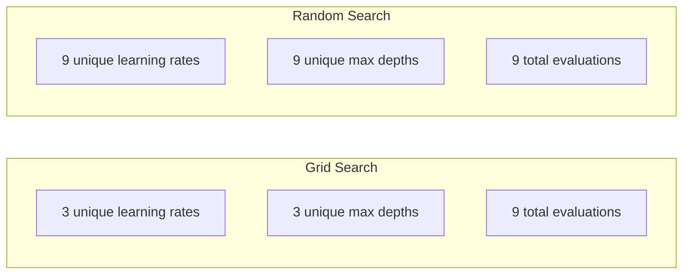
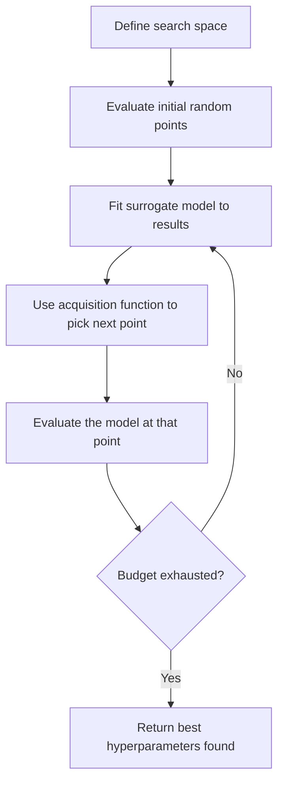
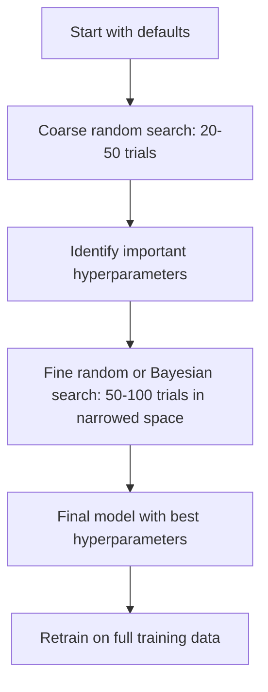
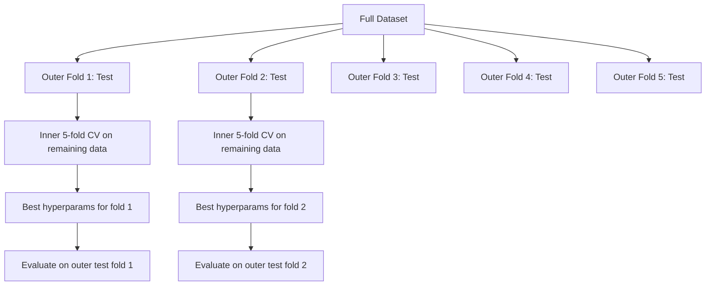

# 超参数调优

> 超参数是训练开始前要拧好的旋钮。拧得好不好，决定了模型是平庸还是出色。

**Type:** Build
**Language:** Python
**Prerequisites:** Phase 2, Lesson 11 (Ensemble Methods)
**Time:** ~90 minutes

## 学习目标

- 从零实现网格搜索、随机搜索和贝叶斯优化，并比较它们的样本效率
- 解释当大多数超参数的有效维度较低时，随机搜索为何优于网格搜索
- 构建一个由代理模型和采集函数引导搜索的贝叶斯优化循环
- 设计一套通过恰当的交叉验证避免在验证集上过拟合的超参数调优策略

## 问题背景

你的梯度提升模型有学习率、树的数量、最大深度、每个叶节点的最小样本数、子采样比例和列采样比例，一共六个超参数。如果每个超参数有 5 个合理取值，网格就有 5^6 = 15,625 种组合。每次训练耗时 10 秒，全部尝试一遍需要 43 小时的计算。

网格搜索是最显而易见的方法，也是规模一大就最糟糕的方法。随机搜索用更少的计算量做得更好。贝叶斯优化通过从过往评估中学习，做得还要更好。知道该用哪种策略、哪些超参数真正重要，能帮你省下数天被浪费的 GPU 时间。

## 核心概念

### 参数与超参数

参数（parameter）是训练过程中学到的（权重、偏置、分裂阈值）。超参数（hyperparameter）在训练开始前设定，控制学习如何进行。

| 超参数 | 控制什么 | 典型范围 |
|---------------|-----------------|---------------|
| 学习率 | 每次更新的步长 | 0.001 到 1.0 |
| 树/轮次数量 | 训练多长时间 | 10 到 10,000 |
| 最大深度 | 模型复杂度 | 1 到 30 |
| 正则化（lambda） | 防止过拟合 | 0.0001 到 100 |
| 批大小 | 梯度估计的噪声 | 16 到 512 |
| Dropout 比例 | 被丢弃神经元的比例 | 0.0 到 0.5 |

### 网格搜索

网格搜索（grid search）评估指定取值的每一种组合。它穷尽所有可能、易于理解，但代价随超参数数量呈指数增长。

```
Grid for 2 hyperparameters:

  learning_rate: [0.01, 0.1, 1.0]
  max_depth:     [3, 5, 7]

  Evaluations: 3 x 3 = 9 combinations

  (0.01, 3)  (0.01, 5)  (0.01, 7)
  (0.1,  3)  (0.1,  5)  (0.1,  7)
  (1.0,  3)  (1.0,  5)  (1.0,  7)
```

网格搜索有个根本缺陷：如果一个超参数重要而另一个不重要，大部分评估就被浪费了。9 次评估只能覆盖重要参数的 3 个不同取值。

### 随机搜索

随机搜索（random search）从分布中采样超参数，而不是依赖网格。同样的 9 次评估预算下，每个超参数都能得到 9 个不同的取值。



随机搜索为何胜过网格搜索（Bergstra & Bengio, 2012）：

- 大多数超参数的有效维度很低。对一个给定问题，6 个超参数中通常只有 1-2 个真正重要。
- 网格搜索把评估浪费在不重要的维度上。
- 同样的预算下，随机搜索能更密集地覆盖重要维度。
- 进行 60 次随机试验后，有 95% 的概率找到距最优解 5% 以内的点（前提是搜索空间内存在这样的点）。

### 贝叶斯优化

随机搜索不看结果。它学不到高学习率会导致发散，也学不到深度 3 一直比深度 10 好。贝叶斯优化（Bayesian optimization）利用过往评估来决定下一步搜索哪里。



两个关键组件：

**代理模型（surrogate model）：** 一个评估代价低廉的模型（通常是高斯过程），用来近似昂贵的目标函数。它能在搜索空间的任意一点同时给出预测值和不确定性估计。

**采集函数（acquisition function）：** 通过权衡利用（在已知的好点附近搜索）与探索（在不确定性高的区域搜索）来决定下一个评估点。常见选择：

- **期望改进（Expected Improvement, EI）：** 在这个点上，相对当前最优值能期望多大的提升？
- **置信上界（Upper Confidence Bound, UCB）：** 预测值加上不确定性的若干倍。UCB 越高，要么前景看好，要么尚未探索。
- **改进概率（Probability of Improvement, PI）：** 这个点超过当前最优值的概率是多少？

贝叶斯优化通常只需随机搜索 1/2 到 1/5 的评估次数就能找到更好的超参数。与训练真实模型相比，拟合代理模型的开销可以忽略不计。

### 早停

并不是每次训练都要跑完。如果一个配置在 10 个轮次后明显很差，就停掉它，继续下一个。这就是超参数搜索语境下的早停（early stopping）。

策略：
- **基于耐心值：** 验证损失连续 N 个轮次没有改进就停止
- **中位数剪枝：** 如果某次试验的中间结果差于已完成试验在同一步骤的中位数，就停止
- **Hyperband：** 给大量配置分配小预算，然后逐步给表现最好的配置增加预算

Hyperband 尤其有效。它先用 1 个轮次各跑 81 个配置，保留前三分之一，给它们 3 个轮次，再保留前三分之一，依此类推。这种方式找到好配置的速度，比给所有配置都跑满全部预算快 10-50 倍。

### 学习率调度器

学习率几乎总是最重要的超参数。与其保持固定，调度器（scheduler）会在训练过程中调整它。

| 调度器 | 公式 | 适用场景 |
|-----------|---------|-------------|
| 阶梯衰减 | 每 N 个轮次乘以 0.1 | 经典 CNN 训练 |
| 余弦退火 | lr * 0.5 * (1 + cos(pi * t / T)) | 现代默认选择 |
| 预热 + 衰减 | 线性上升后余弦衰减 | Transformer |
| One-cycle | 在一个周期内先升后降 | 快速收敛 |
| 平台衰减 | 指标停滞时按因子降低 | 稳妥的默认选择 |

### 超参数重要性

并非所有超参数同等重要。针对随机森林（Probst et al., 2019）和梯度提升的研究显示出一致的模式：

**高重要性：**
- 学习率（永远最先调）
- 估计器数量 / 轮次数量（用早停代替调参）
- 正则化强度

**中等重要性：**
- 最大深度 / 层数
- 每个叶节点的最小样本数 / 权重衰减
- 子采样比例

**低重要性：**
- 最大特征数（针对随机森林）
- 具体激活函数的选择
- 批大小（在合理范围内）

先调重要的，其余保持默认值。

### 实用策略



具体工作流：

1. **从库的默认值开始。** 这些默认值是由经验丰富的从业者选定的，往往已经完成了 80% 的工作。
2. **粗粒度随机搜索。** 范围宽一些，20-50 次试验。用早停快速干掉差的运行。
3. **分析结果。** 哪些超参数与性能相关？收窄搜索空间。
4. **精细搜索。** 在收窄后的空间内做贝叶斯优化或聚焦的随机搜索，50-100 次试验。
5. **用找到的最优超参数在全部训练数据上重新训练。**

### 与交叉验证结合

只在单一验证集划分上调超参数有风险：最优超参数可能恰好过拟合了那个特定的验证折。嵌套交叉验证（nested cross-validation）用两层循环解决这个问题：

- **外层循环**（评估）：把数据划分为训练+验证集和测试集，报告无偏的性能。
- **内层循环**（调参）：把训练+验证集划分为训练集和验证集，寻找最优超参数。



每个外层折独立地找出自己的最优超参数。外层得分是对泛化性能的无偏估计。

使用 sklearn：

```python
from sklearn.model_selection import cross_val_score, GridSearchCV
from sklearn.ensemble import GradientBoostingRegressor

inner_cv = GridSearchCV(
    GradientBoostingRegressor(),
    param_grid={
        "learning_rate": [0.01, 0.05, 0.1],
        "max_depth": [2, 3, 5],
        "n_estimators": [50, 100, 200],
    },
    cv=5,
    scoring="neg_mean_squared_error",
)

outer_scores = cross_val_score(
    inner_cv, X, y, cv=5, scoring="neg_mean_squared_error"
)

print(f"Nested CV MSE: {-outer_scores.mean():.4f} +/- {outer_scores.std():.4f}")
```

这很昂贵（5 个外层折 x 5 个内层折 x 27 个网格点 = 675 次模型拟合），但能给你一个可信的性能估计。在论文中报告最终结果，或者决策代价很高时，就用它。

### 实用技巧

**从学习率开始。** 对基于梯度的方法，它永远是最重要的超参数。学习率不对，其他一切都无关紧要。先把其他超参数固定为默认值，扫一遍学习率。

**学习率和正则化用对数均匀分布。** 0.001 和 0.01 之间的差异，与 0.1 和 1.0 之间的差异同样重要。线性搜索会把预算浪费在大数值那一端。

**用早停代替调 n_estimators。** 对提升方法和神经网络，把 n_estimators 或轮次数量设高，让早停决定何时停止。这样就从搜索中去掉了一个超参数。

**预算分配。** 把 60% 的调参预算花在最重要的前 2 个超参数上，剩下 40% 留给其他所有参数。前 2 个超参数解释了大部分性能差异。

**尺度很关键。** 永远不要在对数尺度上搜索批大小（16、32、64 就够了）。永远在对数尺度上搜索学习率。让搜索分布匹配超参数对模型的作用方式。

| 模型类型 | 最重要的超参数 | 推荐搜索方式 | 预算 |
|-----------|--------------------|--------------------|--------|
| 随机森林 | n_estimators, max_depth, min_samples_leaf | 随机搜索，50 次试验 | 低（训练快） |
| 梯度提升 | learning_rate, n_estimators, max_depth | 贝叶斯，100 次试验 + 早停 | 中 |
| 神经网络 | learning_rate, weight_decay, batch_size | 贝叶斯或随机，100+ 次试验 | 高（训练慢） |
| SVM | C, gamma（RBF 核） | 对数尺度上的网格，25-50 次试验 | 低（2 个参数） |
| Lasso/Ridge | alpha | 对数尺度上的一维搜索，20 次试验 | 极低 |
| XGBoost | learning_rate, max_depth, subsample, colsample | 贝叶斯，100-200 次试验 + 早停 | 中 |

**拿不准时：** 用随机搜索，试验次数至少是超参数数量的 2 倍（例如 6 个超参数 = 至少 12+ 次试验）。50 次试验的随机搜索击败精心设计的网格搜索的频率，会让你惊讶。

```figure
k-fold-cv
```

## 从零实现

### 第 1 步：从零实现网格搜索

`code/tuning.py` 中的代码从零实现了网格搜索、随机搜索和一个简易的贝叶斯优化器。

```python
def grid_search(model_fn, param_grid, X_train, y_train, X_val, y_val):
    keys = list(param_grid.keys())
    values = list(param_grid.values())
    best_score = -float("inf")
    best_params = None
    n_evals = 0

    for combo in itertools.product(*values):
        params = dict(zip(keys, combo))
        model = model_fn(**params)
        model.fit(X_train, y_train)
        score = evaluate(model, X_val, y_val)
        n_evals += 1

        if score > best_score:
            best_score = score
            best_params = params

    return best_params, best_score, n_evals
```

### 第 2 步：从零实现随机搜索

```python
def random_search(model_fn, param_distributions, X_train, y_train,
                  X_val, y_val, n_iter=50, seed=42):
    rng = np.random.RandomState(seed)
    best_score = -float("inf")
    best_params = None

    for _ in range(n_iter):
        params = {k: sample(v, rng) for k, v in param_distributions.items()}
        model = model_fn(**params)
        model.fit(X_train, y_train)
        score = evaluate(model, X_val, y_val)

        if score > best_score:
            best_score = score
            best_params = params

    return best_params, best_score, n_iter
```

### 第 3 步：贝叶斯优化（简化版）

核心思路：对已观测到的（超参数, 得分）对拟合一个高斯过程，再用采集函数决定下一步看哪里。

```python
class SimpleBayesianOptimizer:
    def __init__(self, search_space, n_initial=5):
        self.search_space = search_space
        self.n_initial = n_initial
        self.X_observed = []
        self.y_observed = []

    def _kernel(self, x1, x2, length_scale=1.0):
        dists = np.sum((x1[:, None, :] - x2[None, :, :]) ** 2, axis=2)
        return np.exp(-0.5 * dists / length_scale ** 2)

    def _fit_gp(self, X_new):
        X_obs = np.array(self.X_observed)
        y_obs = np.array(self.y_observed)
        y_mean = y_obs.mean()
        y_centered = y_obs - y_mean

        K = self._kernel(X_obs, X_obs) + 1e-4 * np.eye(len(X_obs))
        K_star = self._kernel(X_new, X_obs)

        L = np.linalg.cholesky(K)
        alpha = np.linalg.solve(L.T, np.linalg.solve(L, y_centered))
        mu = K_star @ alpha + y_mean

        v = np.linalg.solve(L, K_star.T)
        var = 1.0 - np.sum(v ** 2, axis=0)
        var = np.maximum(var, 1e-6)

        return mu, var

    def _expected_improvement(self, mu, var, best_y):
        sigma = np.sqrt(var)
        z = (mu - best_y) / (sigma + 1e-10)
        ei = sigma * (z * norm_cdf(z) + norm_pdf(z))
        return ei

    def suggest(self):
        if len(self.X_observed) < self.n_initial:
            return sample_random(self.search_space)

        candidates = [sample_random(self.search_space) for _ in range(500)]
        X_cand = np.array([to_vector(c) for c in candidates])
        mu, var = self._fit_gp(X_cand)
        ei = self._expected_improvement(mu, var, max(self.y_observed))
        return candidates[np.argmax(ei)]

    def observe(self, params, score):
        self.X_observed.append(to_vector(params))
        self.y_observed.append(score)
```

高斯过程代理模型在每个候选点给出两样东西：预测得分（mu）和不确定性（var）。期望改进在两者之间取得平衡：它偏好模型预测得分高的点，或者不确定性高的点。早期大多数点的不确定性都很高，优化器会探索；后期则聚焦于最有希望的区域。

### 第 4 步：比较所有方法

在同一个合成目标函数上运行三种方法并比较。这里的比较使用了一个简化的包装：直接用目标函数调用每个优化器（不训练模型），所以 API 与前面基于模型的实现有所不同：

```python
def synthetic_objective(params):
    lr = params["learning_rate"]
    depth = params["max_depth"]
    return -(np.log10(lr) + 2) ** 2 - (depth - 4) ** 2 + 10

param_grid = {
    "learning_rate": [0.001, 0.01, 0.1, 1.0],
    "max_depth": [2, 3, 4, 5, 6, 7, 8],
}

grid_best = None
grid_score = -float("inf")
grid_history = []
for combo in itertools.product(*param_grid.values()):
    params = dict(zip(param_grid.keys(), combo))
    score = synthetic_objective(params)
    grid_history.append((params, score))
    if score > grid_score:
        grid_score = score
        grid_best = params

param_dist = {
    "learning_rate": ("log_float", 0.001, 1.0),
    "max_depth": ("int", 2, 8),
}

rand_best = None
rand_score = -float("inf")
rand_history = []
rng = np.random.RandomState(42)
for _ in range(28):
    params = {k: sample(v, rng) for k, v in param_dist.items()}
    score = synthetic_objective(params)
    rand_history.append((params, score))
    if score > rand_score:
        rand_score = score
        rand_best = params

optimizer = SimpleBayesianOptimizer(param_dist, n_initial=5)
bayes_history = []
for _ in range(28):
    params = optimizer.suggest()
    score = synthetic_objective(params)
    optimizer.observe(params, score)
    bayes_history.append((params, score))
bayes_score = max(s for _, s in bayes_history)

print(f"{'Method':<20} {'Best Score':>12} {'Evaluations':>12}")
print("-" * 50)
print(f"{'Grid Search':<20} {grid_score:>12.4f} {len(grid_history):>12}")
print(f"{'Random Search':<20} {rand_score:>12.4f} {len(rand_history):>12}")
print(f"{'Bayesian Opt':<20} {bayes_score:>12.4f} {len(bayes_history):>12}")
```

相同预算下，贝叶斯优化通常最快找到最高分，因为它不会把评估浪费在明显糟糕的区域。随机搜索的覆盖范围比网格搜索更广。只有当超参数极少、负担得起穷举时，网格搜索才会胜出。

## 生产实践

### Optuna 实战

Optuna 是认真做超参数调优时推荐的库。它开箱即用地支持剪枝、分布式搜索和可视化。

```python
import optuna

def objective(trial):
    lr = trial.suggest_float("learning_rate", 1e-4, 1e-1, log=True)
    n_est = trial.suggest_int("n_estimators", 50, 500)
    max_depth = trial.suggest_int("max_depth", 2, 10)

    model = GradientBoostingRegressor(
        learning_rate=lr,
        n_estimators=n_est,
        max_depth=max_depth,
    )
    model.fit(X_train, y_train)
    return mean_squared_error(y_val, model.predict(X_val))

study = optuna.create_study(direction="minimize")
study.optimize(objective, n_trials=100)

print(f"Best params: {study.best_params}")
print(f"Best MSE: {study.best_value:.4f}")
```

Optuna 的关键特性：
- `suggest_float(..., log=True)` 用于最适合在对数尺度上搜索的参数（学习率、正则化）
- `suggest_int` 用于整数参数
- `suggest_categorical` 用于离散选项
- 内置 MedianPruner，可对糟糕的试验提前终止
- `study.trials_dataframe()` 用于结果分析

### 带剪枝的 Optuna

剪枝（pruning）会提前停止没有希望的试验，节省大量计算。模式如下：

```python
import optuna
from sklearn.model_selection import cross_val_score

def objective(trial):
    params = {
        "learning_rate": trial.suggest_float("lr", 1e-4, 0.5, log=True),
        "max_depth": trial.suggest_int("max_depth", 2, 10),
        "n_estimators": trial.suggest_int("n_estimators", 50, 500),
        "subsample": trial.suggest_float("subsample", 0.5, 1.0),
    }

    model = GradientBoostingRegressor(**params)
    scores = cross_val_score(model, X_train, y_train, cv=3,
                             scoring="neg_mean_squared_error")
    mean_score = -scores.mean()

    trial.report(mean_score, step=0)
    if trial.should_prune():
        raise optuna.TrialPruned()

    return mean_score

pruner = optuna.pruners.MedianPruner(n_startup_trials=10, n_warmup_steps=5)
study = optuna.create_study(direction="minimize", pruner=pruner)
study.optimize(objective, n_trials=200)
```

如果某次试验的中间值差于所有已完成试验在同一步骤的中位数，`MedianPruner` 就会停掉它。剪枝需要调用 `trial.report()` 报告中间指标，并调用 `trial.should_prune()` 检查该试验是否应被终止。`n_startup_trials=10` 保证剪枝生效前至少有 10 次试验完整跑完。这通常能节省 40-60% 的总计算量。

### sklearn 内置调优器

对于快速实验，sklearn 提供了 `GridSearchCV`、`RandomizedSearchCV` 和 `HalvingRandomSearchCV`：

```python
from sklearn.model_selection import RandomizedSearchCV
from scipy.stats import loguniform, randint

param_dist = {
    "learning_rate": loguniform(1e-4, 0.5),
    "max_depth": randint(2, 10),
    "n_estimators": randint(50, 500),
}

search = RandomizedSearchCV(
    GradientBoostingRegressor(),
    param_dist,
    n_iter=100,
    cv=5,
    scoring="neg_mean_squared_error",
    random_state=42,
    n_jobs=-1,
)
search.fit(X_train, y_train)
print(f"Best params: {search.best_params_}")
print(f"Best CV MSE: {-search.best_score_:.4f}")
```

学习率和正则化用 scipy 的 `loguniform`，整数超参数用 `randint`。`n_jobs=-1` 参数会把搜索并行到所有 CPU 核心上。

### 超参数调优中的常见错误

**预处理导致数据泄漏。** 如果在交叉验证之前对整个数据集拟合缩放器，验证折的信息就泄漏进了训练。一定要把预处理放进 `Pipeline`，让它只在训练折上拟合。

**在验证集上过拟合。** 跑成千上万次试验，实际上等于在验证集上训练。最终性能估计要用嵌套交叉验证，或者留出一个在调参期间绝不触碰的独立测试集。

**搜索范围太窄。** 如果最优值落在搜索空间的边界上，说明搜索范围不够宽，真正的最优值可能在范围之外。一定要检查最优参数是否位于边缘。

**忽视交互效应。** 在提升方法中，学习率和估计器数量交互很强：学习率低就需要更多估计器。把它们分开调，效果不如一起调。

**对迭代式模型不用早停。** 对梯度提升和神经网络，把 n_estimators 或轮次数量设成一个大值并使用早停。这严格优于把迭代次数当作超参数来调。

## 练习

1. 用相同的总预算（例如 50 次评估）分别运行网格搜索和随机搜索，比较找到的最优得分。换不同的随机种子把实验跑 10 次，随机搜索赢了多少次？

2. 从零实现 Hyperband。从 81 个配置开始，每个先训练 1 个轮次。每轮保留前 1/3 并把预算翻三倍。比较总计算量（所有配置的轮次总和）与让 81 个配置都跑满全部预算的差异。

3. 给第 11 课的梯度提升实现加上学习率调度器（余弦退火）。与固定学习率相比有帮助吗？

4. 用 Optuna 在真实数据集（例如 sklearn 的乳腺癌数据集）上调优一个 RandomForestClassifier。用 `optuna.visualization.plot_param_importances(study)` 查看哪些超参数最重要。结果和本课的重要性排序一致吗？

5. 实现一个简单的采集函数（期望改进），演示探索与利用的权衡。绘制代理模型的均值和不确定性，并标出 EI 选择的下一个评估点。

## 关键术语

| 术语 | 通俗说法 | 实际含义 |
|------|----------------|----------------------|
| 超参数 | "你自己选的设置" | 在训练前设定、控制学习过程的值，不从数据中学习 |
| 网格搜索 | "把所有组合试一遍" | 在指定参数网格上的穷举搜索。代价呈指数增长。 |
| 随机搜索 | "随便采样就行" | 从分布中采样超参数。对重要维度的覆盖优于网格搜索。 |
| 贝叶斯优化 | "聪明的搜索" | 用目标函数的代理模型决定下一个评估点，权衡探索与利用 |
| 代理模型 | "一个廉价的近似" | 根据已观测的评估结果近似昂贵目标函数的模型（通常是高斯过程） |
| 采集函数 | "下一步看哪里" | 通过权衡期望改进与不确定性给候选点打分。EI 和 UCB 是常见选择。 |
| 早停 | "别再浪费时间" | 当验证性能不再改善时提前终止训练 |
| Hyperband | "配置的淘汰赛" | 自适应资源分配：用小预算启动大量配置，保留最优者并增加其预算 |
| 学习率调度器 | "训练中改 lr" | 在训练过程中调整学习率以获得更好收敛的函数 |

## 延伸阅读

- [Bergstra & Bengio: Random Search for Hyper-Parameter Optimization (2012)](https://jmlr.org/papers/v13/bergstra12a.html) —— 证明随机搜索胜过网格搜索的论文
- [Snoek et al., Practical Bayesian Optimization of Machine Learning Algorithms (2012)](https://arxiv.org/abs/1206.2944) —— 面向机器学习的贝叶斯优化
- [Li et al., Hyperband: A Novel Bandit-Based Approach (2018)](https://jmlr.org/papers/v18/16-558.html) —— Hyperband 论文
- [Optuna: A Next-generation Hyperparameter Optimization Framework](https://arxiv.org/abs/1907.10902) —— Optuna 论文
- [Probst et al., Tunability: Importance of Hyperparameters (2019)](https://jmlr.org/papers/v20/18-444.html) —— 哪些超参数重要
