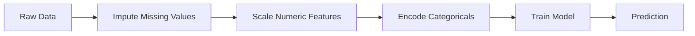
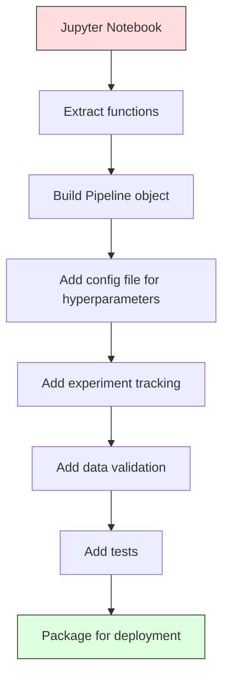

# 机器学习流水线

> 模型不是产品，流水线才是。流水线涵盖了从原始数据到上线预测的全部环节，而且每一步都必须可复现。

**Type:** Build
**Language:** Python
**Prerequisites:** Phase 2, Lesson 12 (Hyperparameter Tuning)
**Time:** ~120 minutes

## 学习目标

- 从零构建一条机器学习流水线（ML pipeline），把缺失值填充、特征缩放、类别编码和模型训练串成一个可复现的对象
- 识别数据泄漏场景，并解释流水线如何通过只在训练数据上拟合转换器来防止泄漏
- 构建一个 ColumnTransformer，对数值特征和类别特征分别应用不同的预处理
- 实现流水线的序列化，并验证同一个拟合好的流水线在训练和生产环境中产生完全一致的结果

## 问题背景

你有一个 notebook：加载数据、用中位数填充缺失值、缩放特征、训练模型、打印准确率。它能跑通，你就上线了。

一个月后，有人重新训练模型，得到了不一样的结果。原来中位数是在包含测试数据的完整数据集上计算的（数据泄漏）；缩放参数没有保存，推理时用的是另一套统计量；特征工程代码在训练端和服务端之间复制粘贴，两份副本逐渐走样；某个类别列在生产环境中出现了编码器从未见过的新取值。

这些都不是假设，而是机器学习系统在生产环境中失败的最常见原因。流水线把每一个转换步骤打包成单一、有序、可复现的对象，从而一并解决了这些问题。

## 核心概念

### 什么是流水线

流水线是一串有序的数据转换步骤，最后接一个模型。每一步以上一步的输出作为输入。整条流水线只在训练数据上拟合一次。推理时，同一个已拟合的流水线对新数据做转换并产生预测。



流水线提供以下保证：

- 转换器只在训练数据上拟合（没有泄漏）
- 推理时应用完全相同的转换
- 整个对象可以序列化，作为单一制品部署
- 交叉验证会在每一折内部独立应用流水线，避免隐蔽的泄漏

### 数据泄漏：沉默的杀手

数据泄漏（data leakage）是指测试集或未来数据的信息污染了训练过程。流水线可以防住其中最常见的几种形式。

**有泄漏（错误）：**
```python
X = df.drop("target", axis=1)
y = df["target"]

scaler = StandardScaler()
X_scaled = scaler.fit_transform(X)

X_train, X_test = X_scaled[:800], X_scaled[800:]
y_train, y_test = y[:800], y[800:]
```

缩放器看到了测试数据。均值和标准差里混入了测试样本。这会虚高准确率估计。

**正确：**
```python
X_train, X_test = X[:800], X[800:]

scaler = StandardScaler()
X_train_scaled = scaler.fit_transform(X_train)
X_test_scaled = scaler.transform(X_test)
```

用了流水线之后，你根本不需要操心这件事。流水线会自动处理。

### sklearn Pipeline

sklearn 的 `Pipeline` 把若干转换器和一个估计器串联起来，对外暴露 `.fit()`、`.predict()` 和 `.score()`，按顺序依次执行所有步骤。

```python
from sklearn.pipeline import Pipeline
from sklearn.preprocessing import StandardScaler
from sklearn.linear_model import LogisticRegression

pipe = Pipeline([
    ("scaler", StandardScaler()),
    ("model", LogisticRegression()),
])

pipe.fit(X_train, y_train)
predictions = pipe.predict(X_test)
```

调用 `pipe.fit(X_train, y_train)` 时：
1. 缩放器对 X_train 调用 `fit_transform`
2. 模型在缩放后的 X_train 上调用 `fit`

调用 `pipe.predict(X_test)` 时：
1. 缩放器对 X_test 调用 `transform`（而不是 fit_transform）
2. 模型在缩放后的 X_test 上调用 `predict`

缩放器在拟合阶段永远见不到测试数据。这正是流水线的全部意义所在。

### ColumnTransformer：不同的列走不同的流水线

真实数据集既有数值列又有类别列，需要不同的预处理。`ColumnTransformer` 就是为此而生。

```python
from sklearn.compose import ColumnTransformer
from sklearn.preprocessing import StandardScaler, OneHotEncoder
from sklearn.impute import SimpleImputer

numeric_pipe = Pipeline([
    ("impute", SimpleImputer(strategy="median")),
    ("scale", StandardScaler()),
])

categorical_pipe = Pipeline([
    ("impute", SimpleImputer(strategy="most_frequent")),
    ("encode", OneHotEncoder(handle_unknown="ignore")),
])

preprocessor = ColumnTransformer([
    ("num", numeric_pipe, ["age", "income", "score"]),
    ("cat", categorical_pipe, ["city", "gender", "plan"]),
])

full_pipeline = Pipeline([
    ("preprocess", preprocessor),
    ("model", GradientBoostingClassifier()),
])
```

OneHotEncoder 里的 `handle_unknown="ignore"` 对生产环境至关重要。当出现新类别（模型从未见过的城市）时，它会输出全零向量，而不是直接崩溃。

### 实验追踪

流水线让训练可复现，但你还需要追踪各次实验发生了什么：用了哪些超参数、哪个版本的数据集、指标是多少、跑的是哪份代码。

**MLflow** 是最常用的开源方案：

```python
import mlflow

with mlflow.start_run():
    mlflow.log_param("max_depth", 5)
    mlflow.log_param("n_estimators", 100)
    mlflow.log_param("learning_rate", 0.1)

    pipe.fit(X_train, y_train)
    accuracy = pipe.score(X_test, y_test)

    mlflow.log_metric("accuracy", accuracy)
    mlflow.sklearn.log_model(pipe, "model")
```

每次运行都会连同参数、指标、产物和完整模型一起记录下来。你可以对比不同运行、复现任意一次实验、部署任意一个模型版本。

**Weights & Biases (wandb)** 提供同样的功能，外加一个托管的仪表盘：

```python
import wandb

wandb.init(project="my-pipeline")
wandb.config.update({"max_depth": 5, "n_estimators": 100})

pipe.fit(X_train, y_train)
accuracy = pipe.score(X_test, y_test)

wandb.log({"accuracy": accuracy})
```

### 模型版本管理

有了实验追踪之后，你还需要管理模型版本。哪个模型在生产环境？哪个在预发布（staging）？上周用的又是哪个？

MLflow 的 Model Registry 提供：
- **版本追踪：** 每个保存的模型都有一个版本号
- **阶段流转：** "Staging"、"Production"、"Archived"
- **审批流程：** 模型必须经过显式晋升才能进入生产
- **回滚：** 可以立即切回任意旧版本

### 用 DVC 做数据版本管理

代码用 git 做版本管理。数据同样应该有版本，但 git 处理不了大文件。DVC（Data Version Control）解决了这个问题。

```
dvc init
dvc add data/training.csv
git add data/training.csv.dvc data/.gitignore
git commit -m "Track training data"
dvc push
```

DVC 把真实数据存放在远端存储（S3、GCS、Azure），在 git 里只保留一个记录哈希值的小型 `.dvc` 文件。当你检出某个 git 提交时，`dvc checkout` 会还原当时使用的那份数据。

这意味着每个 git 提交同时锁定了代码和数据。完全可复现。

### 可复现的实验

一个可复现的实验需要四样东西：

1. **固定随机种子：** 为 numpy、random 以及所用框架（torch、sklearn）设置种子
2. **锁定依赖版本：** requirements.txt 或 poetry.lock 里写明确切版本
3. **数据带版本：** 用 DVC 或类似工具
4. **配置文件：** 所有超参数放进配置，不要硬编码

```python
import numpy as np
import random

def set_seed(seed=42):
    random.seed(seed)
    np.random.seed(seed)
    try:
        import torch
        torch.manual_seed(seed)
        torch.cuda.manual_seed_all(seed)
        torch.backends.cudnn.deterministic = True
    except ImportError:
        pass
```

### 从 Notebook 到生产流水线



典型的演进路径：

1. **Notebook 探索：** 快速实验、可视化、特征灵感
2. **抽取函数：** 把预处理、特征工程、评估代码移入模块
3. **构建 Pipeline：** 把各项转换串成 sklearn Pipeline 或自定义类
4. **配置管理：** 把所有超参数移入 YAML/JSON 配置
5. **实验追踪：** 加上 MLflow 或 wandb 日志
6. **数据校验：** 训练前检查 schema、分布和缺失值模式
7. **测试：** 给转换器写单元测试，给完整流水线写集成测试
8. **部署：** 序列化流水线，封装成 API（FastAPI、Flask），再容器化

### 常见的流水线错误

| 错误 | 为什么有害 | 修复方式 |
|---------|-------------|-----|
| 划分数据前就在全量数据上拟合 | 数据泄漏 | 用 Pipeline 搭配 cross_val_score |
| 在流水线之外做特征工程 | 训练和服务端的转换不一致 | 把所有转换都放进 Pipeline |
| 不处理未知类别 | 生产环境遇到新取值时崩溃 | OneHotEncoder(handle_unknown="ignore") |
| 硬编码列名 | schema 一变就坏 | 列名列表从配置中读取 |
| 没有数据校验 | 坏数据上悄悄给出错误预测 | 预测前加 schema 检查 |
| 训练/服务偏差 | 模型在生产中看到的特征不一样 | 训练和服务共用同一个 Pipeline 对象 |

## 从零实现

`code/pipeline.py` 中的代码从零构建一条完整的机器学习流水线：

### 第 1 步：自定义转换器

```python
class CustomTransformer:
    def __init__(self):
        self.means = None
        self.stds = None

    def fit(self, X):
        self.means = np.mean(X, axis=0)
        self.stds = np.std(X, axis=0)
        self.stds[self.stds == 0] = 1.0
        return self

    def transform(self, X):
        return (X - self.means) / self.stds

    def fit_transform(self, X):
        return self.fit(X).transform(X)
```

### 第 2 步：从零实现 Pipeline

```python
class PipelineFromScratch:
    def __init__(self, steps):
        self.steps = steps

    def fit(self, X, y=None):
        X_current = X.copy()
        for name, step in self.steps[:-1]:
            X_current = step.fit_transform(X_current)
        name, model = self.steps[-1]
        model.fit(X_current, y)
        return self

    def predict(self, X):
        X_current = X.copy()
        for name, step in self.steps[:-1]:
            X_current = step.transform(X_current)
        name, model = self.steps[-1]
        return model.predict(X_current)
```

### 第 3 步：带流水线的交叉验证

这段代码演示了带流水线的交叉验证如何防止数据泄漏：缩放器在每一折的训练数据上分别独立拟合。

### 第 4 步：基于 sklearn 的完整生产流水线

一条完整的流水线，包含 `ColumnTransformer`、多条预处理路径和一个模型，用规范的交叉验证训练，并记录实验日志。

## 交付产物

本课产出：
- `outputs/prompt-ml-pipeline.md` -- 一个用于构建和调试机器学习流水线的 skill
- `code/pipeline.py` -- 一条从零实现到 sklearn 版本的完整流水线

## 练习

1. 为一个包含 3 个数值列和 2 个类别列的数据集构建流水线。用 `ColumnTransformer` 对数值列做中位数填充 + 缩放，对类别列做众数填充 + 独热编码。用 5 折交叉验证训练。

2. 故意制造数据泄漏：在划分数据之前就在全量数据上拟合缩放器。比较有泄漏的交叉验证得分和干净的流水线交叉验证得分。差距有多大？

3. 用 `joblib.dump` 序列化你的流水线。在另一个独立脚本中加载它并运行预测。验证预测结果完全一致。

4. 给流水线加一个自定义转换器，为最重要的两个数值列生成多项式特征（2 次）。它应该放在流水线的哪个位置？

5. 为流水线配置 MLflow 追踪。用不同超参数跑 5 次实验。用 MLflow UI（`mlflow ui`）对比各次运行并选出最佳模型。

## 关键术语

| 术语 | 大家怎么说 | 实际含义 |
|------|----------------|----------------------|
| 流水线（Pipeline） | "转换 + 模型串成一条链" | 一串有序的已拟合转换器加一个模型，作为整体应用，防止泄漏 |
| 数据泄漏（Data leakage） | "测试集信息漏进了训练" | 使用训练集之外的信息来构建模型，虚高性能估计 |
| ColumnTransformer | "不同列走不同的预处理" | 对不同的列子集应用不同的流水线，再把结果合并 |
| 实验追踪（Experiment tracking） | "把每次运行记下来" | 为每次训练运行记录参数、指标、产物和代码版本 |
| MLflow | "追踪和部署模型" | 提供实验追踪、模型注册和部署能力的开源平台 |
| DVC | "数据界的 Git" | 面向大数据文件的版本控制系统，哈希存 git，数据存远端 |
| 模型注册中心（Model registry） | "模型版本目录" | 用阶段标签（staging、production、archived）追踪模型版本的系统 |
| 训练/服务偏差（Training/serving skew） | "在 notebook 里明明能跑" | 训练和推理时数据处理方式不一致，导致悄无声息的错误 |
| 可复现性（Reproducibility） | "同样的代码，同样的结果" | 在相同的代码、数据和配置下得到完全一致结果的能力 |

## 延伸阅读

- [scikit-learn Pipeline docs](https://scikit-learn.org/stable/modules/compose.html) -- 官方流水线参考文档
- [MLflow documentation](https://mlflow.org/docs/latest/index.html) -- 实验追踪与模型注册
- [DVC documentation](https://dvc.org/doc) -- 数据版本管理
- [Sculley et al., Hidden Technical Debt in Machine Learning Systems (2015)](https://papers.nips.cc/paper/2015/hash/86df7dcfd896fcaf2674f757a2463eba-Abstract.html) -- 关于机器学习系统复杂性的开创性论文
- [Google ML Best Practices: Rules of ML](https://developers.google.com/machine-learning/guides/rules-of-ml) -- 实用的生产环境机器学习建议
