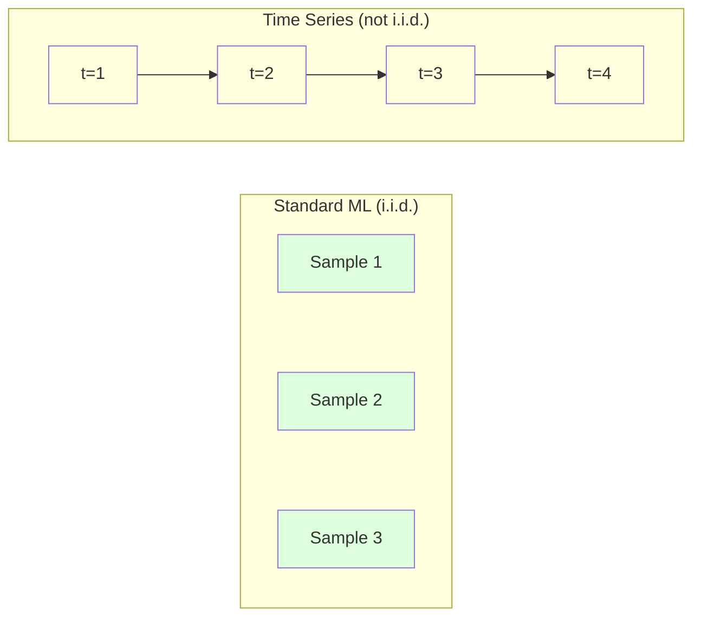
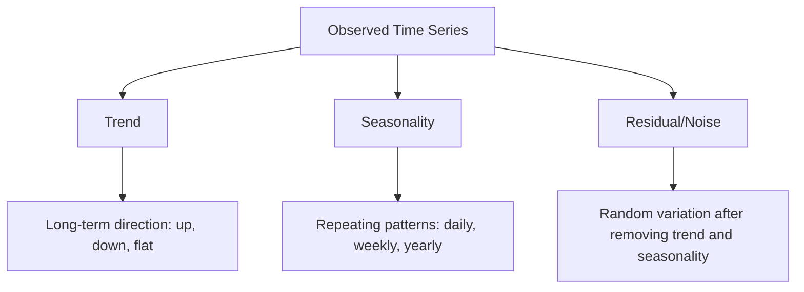
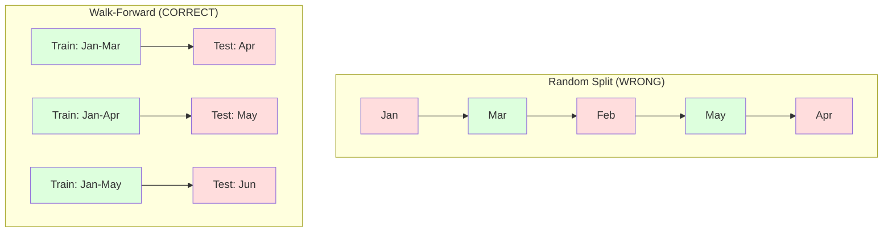

# 时间序列基础

> 过去的表现确实可以预测未来的结果——前提是你先检验了平稳性。

**Type:** Build
**Language:** Python
**Prerequisites:** Phase 2, Lessons 01-09
**Time:** ~90 minutes

## 学习目标

- 将时间序列分解为趋势、季节性和残差分量，并检验平稳性
- 实现滞后特征和滚动统计量，把时间序列转化为监督学习问题
- 构建前向滚动验证（walk-forward validation）框架，防止未来数据泄漏进训练集
- 解释为什么随机训练/测试划分对时间序列无效，并演示其与正确时间划分之间的性能差距

## 问题背景

你手上有按时间排列的数据。每日销售额、每小时气温、每分钟 CPU 使用率、每周股价。你想预测下一个值、下一周、下一个季度。

你顺手拿起标准的 ML 工具箱：随机训练/测试划分、交叉验证、输入特征矩阵、输出预测值。每一步都是错的。

时间序列打破了标准 ML 所依赖的假设。样本之间并不独立——今天的气温取决于昨天的气温。随机划分会把未来的信息泄漏到过去。在回测中看起来很好的特征到了生产环境会失效，因为它们依赖的模式会随时间漂移。

一个在随机交叉验证下达到 95% 准确率的模型，在正确的基于时间的评估下可能只有 55%。这个差距不是技术细节，而是「纸面上能用的模型」与「生产中能用的模型」之间的区别。

本课讲解这些基础知识：时间数据有何不同、如何诚实地评估模型，以及如何把时间序列转化成标准 ML 模型可以使用的特征。

## 核心概念

### 时间序列有何不同

标准 ML 假设数据是 i.i.d.——独立同分布。每个样本独立地从同一分布中抽取。时间序列同时违反这两条：

- **不独立。** 今天的股价取决于昨天的股价。本周的销售额与上周相关。
- **不同分布。** 分布随时间漂移。十二月的销售额与三月的销售额看起来完全不同。

这些违背并非小事。它们改变了你构建特征的方式、评估模型的方式，以及哪些算法有效。



在标准 ML 中，样本是可互换的，打乱顺序毫无影响。在时间序列中，顺序就是一切，打乱顺序会摧毁信号。

### 时间序列的组成部分

每个时间序列都是以下几部分的组合：



- **趋势（Trend）**：长期方向。营收每年增长 10%。全球气温上升。
- **季节性（Seasonality）**：以固定间隔重复出现的模式。零售销售额在十二月激增。空调使用量在七月达到峰值。
- **残差（Residual）**：去除趋势和季节性之后剩下的部分。如果残差看起来像白噪声，说明分解抓住了信号。

### 平稳性

如果一个时间序列的统计性质（均值、方差、自相关）不随时间变化，它就是平稳的（stationary）。大多数预测方法都假设平稳性。

**为什么重要：** 非平稳序列的均值会漂移。在一月数据上训练的模型学到的均值与二月将要呈现的均值不同，它会系统性地出错。

**如何检查：** 在窗口上计算滚动均值和滚动标准差。如果它们在漂移，序列就是非平稳的。

**如何修复：** 差分（differencing）。不直接对原始值建模，而是对相邻值之间的变化量建模：

```
diff[t] = value[t] - value[t-1]
```

如果一轮差分还不能让序列平稳，就再做一次（二阶差分）。大多数现实世界的序列最多需要两轮。

**示例：**

原始序列：[100, 102, 106, 112, 120]
一阶差分：[2, 4, 6, 8]（仍在上升）
二阶差分：[2, 2, 2]（恒定——平稳）

原始序列带有二次趋势。一阶差分把它变成线性趋势，二阶差分把它压平。实践中，你很少需要超过两轮。

**正式检验：** 增广迪基-富勒（Augmented Dickey-Fuller，ADF）检验是平稳性的标准统计检验。原假设是「序列非平稳」。p 值低于 0.05 意味着可以拒绝原假设、判定序列平稳。我们不会从零实现 ADF（它需要渐近分布表），但我们代码中的滚动统计量方法提供了一个实用的可视化检查。

### 自相关

自相关（autocorrelation）衡量时刻 t 的值与时刻 t-k（过去 k 步）的值之间的相关程度。自相关函数（ACF）把每个滞后 k 处的相关性画出来。

**ACF 能告诉你：**
- 序列的记忆有多长。如果 ACF 在滞后 5 之后降到零，那么 5 步以前的值就无关紧要了。
- 是否存在季节性。如果 ACF 在滞后 12 处出现尖峰（月度数据），就存在年度季节性。
- 应该创建多少个滞后特征。使用滞后直到 ACF 变得可以忽略为止。

**PACF（偏自相关函数，Partial Autocorrelation Function）** 去除间接相关。如果今天与 3 天前相关只是因为两者都与昨天相关，那么 PACF 在滞后 3 处为零，而 ACF 在滞后 3 处不为零。

### 滞后特征：把时间序列变成监督学习

标准 ML 模型需要特征矩阵 X 和目标 y。而时间序列只给你一列数值。两者之间的桥梁就是滞后特征（lag features）。

取序列 [10, 12, 14, 13, 15]，创建 lag-1 和 lag-2 特征：

| lag_2 | lag_1 | target |
|-------|-------|--------|
| 10    | 12    | 14     |
| 12    | 14    | 13     |
| 14    | 13    | 15     |

现在你得到了一个标准的回归问题。任何 ML 模型（线性回归、随机森林、梯度提升）都可以根据滞后值预测目标。

你还可以构造的其他特征：
- **滚动统计量：** 最近 k 个值的均值、标准差、最小值、最大值
- **日历特征：** 星期几、月份、is_holiday、is_weekend
- **差分值：** 相对上一步的变化量
- **扩展统计量：** 累计均值、累计和
- **比率特征：** 当前值 / 滚动均值（偏离近期平均的程度）
- **交互特征：** lag_1 * day_of_week（工作日对动量的影响）

**用多少个滞后？** 看自相关函数。如果 ACF 在滞后 10 以内都显著，至少用 10 个滞后。如果存在周季节性，要包含滞后 7（可能还有 14）。更多滞后给模型更多历史信息，但也带来更多需要拟合的特征，增加过拟合风险。

**目标对齐陷阱。** 创建滞后特征时，目标必须是时刻 t 的值，而所有特征必须使用时刻 t-1 或更早的值。如果你不小心把时刻 t 的值当成了特征，你就得到了一个完美的预测器——以及一个完全无用的模型。这是时间序列特征工程中最常见的 bug。

### 前向滚动验证

这是本课最重要的概念。标准 k 折交叉验证随机把样本分配到训练集和测试集。对时间序列来说，这会泄漏未来信息。



前向滚动验证的流程：
1. 在截至时刻 t 的数据上训练
2. 预测时刻 t+1（多步预测则是 t+1 到 t+k）
3. 把窗口向前滑动
4. 重复

每个测试折只包含晚于所有训练数据的样本。没有未来泄漏。这能诚实地估计模型上线后的表现。

**扩展窗口（expanding window）** 使用全部历史数据训练（窗口不断增大）。**滑动窗口（sliding window）** 使用固定大小的训练窗口（窗口向前滑动）。当你相信旧数据仍然有用时用扩展窗口；当世界在变化、旧数据有害时用滑动窗口。

### ARIMA 直觉

ARIMA 是经典的时间序列模型。它有三个组成部分：

- **AR（自回归，Autoregressive）：** 用过去的值做预测。AR(p) 使用最近 p 个值。
- **I（差分整合，Integrated）：** 通过差分达到平稳。I(d) 做 d 轮差分。
- **MA（移动平均，Moving Average）：** 用过去的预测误差做预测。MA(q) 使用最近 q 个误差。

ARIMA(p, d, q) 将三者结合。你可以根据 ACF/PACF 分析或自动搜索（auto-ARIMA）来选择 p、d、q。

我们不会从零实现 ARIMA——它需要的数值优化超出了本课范围。关键是理解每个组成部分的作用，这样你就能解读 ARIMA 的结果，并知道何时该使用它。

### 什么时候用什么

| 方法 | 最适用场景 | 能否处理季节性 | 能否处理外部特征 |
|----------|---------|-------------------|------------------------|
| 滞后特征 + ML | 带大量外部特征的表格数据 | 借助日历特征 | 是 |
| ARIMA | 单一单变量序列、短期预测 | SARIMA 变体 | 否（ARIMAX 有限支持） |
| 指数平滑 | 简单的趋势 + 季节性 | 是（Holt-Winters） | 否 |
| Prophet | 业务预测、节假日 | 是（傅里叶项） | 有限 |
| 神经网络（LSTM、Transformer） | 长序列、多条序列 | 自动学习 | 是 |

对于大多数实际问题，滞后特征 + 梯度提升是最强的起点。它天然支持外部特征，不要求平稳性，而且容易调试。

### 预测窗口与策略

单步预测只预测下一个时间步。多步预测要预测多个时间步。共有三种策略：

**递归式（迭代式）：** 预测一步，把预测值作为下一步的输入。简单，但误差会累积——每次预测都基于上一次的预测，错误会层层放大。

**直接式：** 为每个预测窗口训练一个独立模型。Model-1 预测 t+1，Model-5 预测 t+5。没有误差累积，但每个模型的训练样本更少，且模型之间不共享信息。

**多输出式：** 训练一个同时输出所有预测步的模型。各预测步之间共享信息，但需要支持多输出的模型（或自定义损失函数）。

对于大多数实际问题，短窗口（1-5 步）从递归式起步，更长的窗口用直接式。

### 时间序列中的常见错误

| 错误 | 产生原因 | 修复方法 |
|---------|---------------|-----------|
| 随机训练/测试划分 | 标准 ML 的惯性 | 使用前向滚动或时间划分 |
| 使用未来特征 | 误把时刻 t 的特征包含进来 | 审查每个特征的时间对齐 |
| 对季节性过拟合 | 模型死记日历模式 | 在测试集中保留完整的季节周期 |
| 忽视量级变化 | 营收翻倍但模式不变 | 改为对百分比变化建模 |
| 滞后特征过多 | 「历史越多越好」 | 用 ACF 确定相关滞后 |
| 不做差分 | 「模型自己会搞定」 | 树模型能处理趋势；线性模型需要平稳性 |

## 从零实现

`code/time_series.py` 中的代码从零实现了核心构件。

### 滞后特征生成器

```python
def make_lag_features(series, n_lags):
    n = len(series)
    X = np.full((n, n_lags), np.nan)
    for lag in range(1, n_lags + 1):
        X[lag:, lag - 1] = series[:-lag]
    valid = ~np.isnan(X).any(axis=1)
    return X[valid], series[valid]
```

这把一维序列转换成特征矩阵：每行以最近 `n_lags` 个值作为特征，以当前值作为目标。

### 前向滚动交叉验证

```python
def walk_forward_split(n_samples, n_splits=5, min_train=50):
    assert min_train < n_samples, "min_train must be less than n_samples"
    step = max(1, (n_samples - min_train) // n_splits)
    for i in range(n_splits):
        train_end = min_train + i * step
        test_end = min(train_end + step, n_samples)
        if train_end >= n_samples:
            break
        yield slice(0, train_end), slice(train_end, test_end)
```

每次划分都保证训练数据严格早于测试数据。训练窗口在每一折中逐步扩大。

### 简单自回归模型

纯 AR 模型其实就是在滞后特征上做线性回归：

```python
class SimpleAR:
    def __init__(self, n_lags=5):
        self.n_lags = n_lags
        self.weights = None
        self.bias = None

    def fit(self, series):
        X, y = make_lag_features(series, self.n_lags)
        # Solve via normal equations
        X_b = np.column_stack([np.ones(len(X)), X])
        theta = np.linalg.lstsq(X_b, y, rcond=None)[0]
        self.bias = theta[0]
        self.weights = theta[1:]
        return self
```

这在概念上与第 02 课的线性回归完全相同，只是应用在同一变量的时间滞后版本上。

### 平稳性检查

代码计算滚动统计量，用于可视化和数值化地评估平稳性：

```python
def check_stationarity(series, window=50):
    rolling_mean = np.array([
        series[max(0, i - window):i].mean()
        for i in range(1, len(series) + 1)
    ])
    rolling_std = np.array([
        series[max(0, i - window):i].std()
        for i in range(1, len(series) + 1)
    ])
    return rolling_mean, rolling_std
```

如果滚动均值在漂移或滚动标准差在变化，序列就是非平稳的。做差分后再检查一次。

代码还通过比较序列的前半段和后半段来检查平稳性。如果两段均值之差超过半个标准差，或方差比超过 2 倍，序列就被标记为非平稳。

### 自相关

```python
def autocorrelation(series, max_lag=20):
    n = len(series)
    mean = series.mean()
    var = series.var()
    acf = np.zeros(max_lag + 1)
    for k in range(max_lag + 1):
        cov = np.mean((series[:n-k] - mean) * (series[k:] - mean))
        acf[k] = cov / var if var > 0 else 0
    return acf
```

## 生产实践

使用 sklearn 时，滞后特征可以直接配合任何回归器：

```python
from sklearn.linear_model import Ridge
from sklearn.ensemble import GradientBoostingRegressor

X, y = make_lag_features(series, n_lags=10)

for train_idx, test_idx in walk_forward_split(len(X)):
    model = Ridge(alpha=1.0)
    model.fit(X[train_idx], y[train_idx])
    predictions = model.predict(X[test_idx])
```

ARIMA 则使用 statsmodels：

```python
from statsmodels.tsa.arima.model import ARIMA

model = ARIMA(train_series, order=(5, 1, 2))
fitted = model.fit()
forecast = fitted.forecast(steps=30)
```

`time_series.py` 中的代码演示了这两种方法，并用前向滚动验证对它们进行比较。

### sklearn TimeSeriesSplit

sklearn 提供的 `TimeSeriesSplit` 实现了前向滚动验证：

```python
from sklearn.model_selection import TimeSeriesSplit

tscv = TimeSeriesSplit(n_splits=5)
for train_index, test_index in tscv.split(X):
    X_train, X_test = X[train_index], X[test_index]
    y_train, y_test = y[train_index], y[test_index]
    model.fit(X_train, y_train)
    score = model.score(X_test, y_test)
```

这与我们从零实现的 `walk_forward_split` 等价，但集成进了 sklearn 的交叉验证框架。你可以把它和 `cross_val_score` 一起用：

```python
from sklearn.model_selection import cross_val_score

scores = cross_val_score(model, X, y, cv=TimeSeriesSplit(n_splits=5))
print(f"Mean score: {scores.mean():.4f} +/- {scores.std():.4f}")
```

### 评估指标

时间序列预测使用回归指标，但要结合时间维度的语境：

- **MAE（平均绝对误差）：** |y_true - y_pred| 的平均值。以原始单位解读，简单直观。「预测平均偏差 3.2 度。」
- **RMSE（均方根误差）：** 均方误差的平方根。比 MAE 更严厉地惩罚大误差。当大错误比许多小错误更糟时使用。
- **MAPE（平均绝对百分比误差）：** |error / true_value| * 100 的平均值。与量纲无关，便于跨不同序列比较。但真实值为零时无定义。
- **朴素基线对比：** 永远要与简单基线对比。季节性朴素基线用一个周期前的值（昨天、上周）做预测。如果你的模型打不过朴素基线，一定是哪里出了问题。

### 滚动特征

代码演示了在滞后特征之外加入滚动统计量（7 天和 14 天窗口的均值、标准差、最小值、最大值）。这些特征向模型提供了单靠滞后特征无法捕捉的近期趋势和波动性信息。

例如，滚动均值上升暗示着上升趋势；滚动标准差增大暗示着波动加剧。这类模式是树模型能学到、而线性模型学不到的。

## 交付产物

本课产出：
- `outputs/prompt-time-series-advisor.md` —— 一个用于梳理时间序列问题的提示词
- `code/time_series.py` —— 滞后特征、前向滚动验证、AR 模型、平稳性检查

### 你必须打败的基线

在构建任何模型之前，先建立基线：

1. **上一个值（持续性基线）。** 预测明天与今天相同。对许多序列来说，这条基线出奇地难打败。
2. **季节性朴素基线。** 预测今天与上周同一天（或去年同一天）相同。如果你的模型打不过它，说明模型没有学到季节性之外的任何有用模式。
3. **移动平均。** 预测最近 k 个值的平均。能平滑噪声，但无法捕捉突变。

如果你花哨的 ML 模型输给了季节性朴素基线，那就是有 bug。最常见的原因：特征中存在未来泄漏、评估方法错误，或者这条序列确实是随机的、不可预测的。

### 实用技巧

1. **从画图开始。** 在任何建模之前，先画出原始序列。寻找趋势、季节性、离群点、结构性断点（行为的突变）。30 秒的目视检查往往比一小时的自动化分析告诉你更多。

2. **先差分，再建模。** 如果序列有明显趋势，先做差分再创建滞后特征。树模型能处理趋势，但线性模型不能，而差分从不坏事。

3. **至少保留一个完整的季节周期。** 如果有周季节性，测试集至少要包含完整的一周；如果是月季节性，至少要一个完整的月。否则你无法评估模型是否捕捉到了季节模式。

4. **在生产中持续监控。** 随着世界变化，时间序列模型会随时间退化。滚动跟踪预测误差。当误差开始上升时，用近期数据重新训练模型。

5. **当心机制变化（regime change）。** 在疫情前数据上训练的模型预测不了疫情后的行为。把已知机制变化的指示变量纳入特征，或使用会遗忘旧数据的滑动窗口。

6. **对偏态序列做对数变换。** 营收、价格和计数往往是右偏的。取对数能稳定方差，并把乘性模式变成加性模式，线性模型才能处理。在对数空间中做预测，然后取指数还原到原始单位。

## 练习

1. **平稳性实验。** 生成一条带线性趋势的序列。用滚动统计量检查平稳性。做一阶差分，再检查一次。对于二次趋势，需要几轮差分？

2. **滞后选择。** 在一条季节性序列（period=7）上计算 ACF。哪些滞后的自相关最高？只用这些滞后（而非连续滞后）创建滞后特征。与使用滞后 1 到 7 相比，准确率是否提升？

3. **前向滚动 vs 随机划分。** 在滞后特征上训练 Ridge 回归。分别用随机 80/20 划分和前向滚动验证评估。随机划分把性能高估了多少？

4. **特征工程。** 在滞后特征之外加入滚动均值（window=7）、滚动标准差（window=7）和星期几特征。用前向滚动验证比较加与不加这些特征的准确率。

5. **多步预测。** 把 AR 模型改成预测未来 5 步而不是 1 步。比较两种策略：(a) 预测一步，把预测值作为下一步的输入（递归式）；(b) 为每个预测步训练独立模型（直接式）。哪种更准？

## 关键术语

| 术语 | 大家怎么说 | 实际含义 |
|------|----------------|----------------------|
| 平稳性 | 「统计性质不随时间变化」 | 均值、方差和自相关结构随时间保持恒定的序列 |
| 差分 | 「相邻值相减」 | 计算 y[t] - y[t-1] 以去除趋势、达到平稳 |
| 自相关（ACF） | 「序列与自己的相关性」 | 时间序列与其滞后副本之间的相关性，是滞后量的函数 |
| 偏自相关（PACF） | 「只看直接相关」 | 去除所有更短滞后的影响后，滞后 k 处的自相关 |
| 滞后特征 | 「把过去的值当输入」 | 用 y[t-1]、y[t-2]、...、y[t-k] 作为特征来预测 y[t] |
| 前向滚动验证 | 「尊重时间的交叉验证」 | 训练数据在时间上始终先于测试数据的评估方式 |
| ARIMA | 「经典时间序列模型」 | 自回归差分移动平均模型：结合过去的值（AR）、差分（I）和过去的误差（MA） |
| 季节性 | 「重复的日历模式」 | 时间序列中与日历周期（每日、每周、每年）绑定的规律性、可预测的循环 |
| 趋势 | 「长期方向」 | 序列水平随时间持续上升或下降 |
| 扩展窗口 | 「用上全部历史」 | 训练集随每一折不断增大的前向滚动验证 |
| 滑动窗口 | 「固定长度的历史」 | 训练集是固定长度窗口、随时间向前滑动的前向滚动验证 |

## 延伸阅读

- [Hyndman and Athanasopoulos, Forecasting: Principles and Practice (3rd ed.)](https://otexts.com/fpp3/) —— 时间序列预测领域最好的免费教材
- [scikit-learn Time Series Split](https://scikit-learn.org/stable/modules/generated/sklearn.model_selection.TimeSeriesSplit.html) —— sklearn 的前向滚动划分器
- [statsmodels ARIMA docs](https://www.statsmodels.org/stable/generated/statsmodels.tsa.arima.model.ARIMA.html) —— 带诊断功能的 ARIMA 实现
- [Makridakis et al., The M5 Competition (2022)](https://www.sciencedirect.com/science/article/pii/S0169207021001874) —— 展示 ML 方法与统计方法对比的大规模预测竞赛
