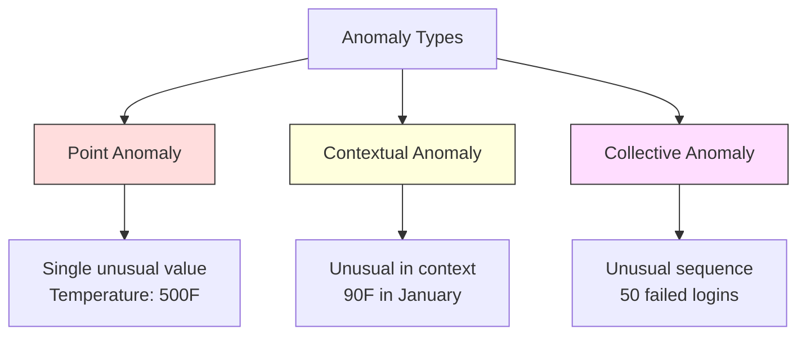
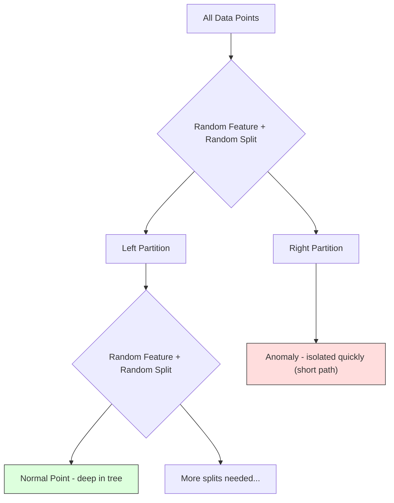
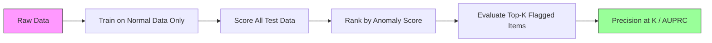

# 异常检测

> 「正常」很容易定义，「异常」就是一切与正常不符的东西。

**Type:** Build
**Language:** Python
**Prerequisites:** Phase 2, Lessons 01-09
**Time:** ~75 minutes

## 学习目标

- 从零实现 Z-score、IQR 和 Isolation Forest 三种异常检测方法
- 区分点异常、上下文异常和集体异常，并为每种类型选择合适的检测方法
- 解释为什么异常检测被建模为「学习正常数据的分布」而不是「对异常进行分类」
- 比较无监督异常检测与监督分类，并评估「覆盖新型异常」与「精确率」之间的权衡

## 问题背景

一张信用卡下午 2 点在纽约被刷，2:05 又出现在东京。一个工厂传感器读数 150 度，而正常范围是 80-120。一台服务器每秒发出 5 万个请求，而日均值只有 200。

这些都是异常。找出它们很重要：欺诈造成数十亿美元损失，设备故障带来停机时间，网络入侵导致数据泄露。

难点在于：你几乎拿不到带标签的异常样本。欺诈只占交易的 0.1%，设备故障一年才发生几次。「异常」这一类几乎没有可供学习的样本，标准分类器根本训练不起来。即使你有一些标签，你见过的异常也不是你将来会遇到的全部类型——明天的欺诈手法和今天的长得不一样。

异常检测把问题反过来：与其学习什么是异常，不如学习什么是正常。任何偏离正常的东西都值得怀疑。这种思路不需要标签，能适应新型异常，还能扩展到海量数据。

## 核心概念

### 异常的类型

并非所有异常都一样：

- **点异常（point anomaly）。** 单个数据点无论在什么上下文中都不寻常。比如温度读数 500 度，或一个平时只花 50 美元的账户突然出现 5 万美元的交易。
- **上下文异常（contextual anomaly）。** 数据点在特定上下文中显得不寻常。90 度的气温在夏天正常，在冬天就是异常。同样的值，不同的上下文。
- **集体异常（collective anomaly）。** 一串数据点作为整体不寻常，即使其中每个点单独看都正常。5 次登录失败很正常，连续 50 次就是暴力破解攻击。

大多数方法检测的是点异常。上下文异常需要时间或位置特征，集体异常需要能感知序列的方法。



### 无监督的问题框架

在标准分类中，两个类别都有标签。而异常检测通常处于以下三种情形之一：

1. **完全无监督。** 没有任何标签。在全部数据上拟合检测器，并寄希望于异常足够稀少，不会污染「正常」模型。
2. **半监督。** 你有一份只含正常数据的干净数据集。在这份干净数据上拟合，然后给其他所有数据打分。条件允许时，这是最强的设置。
3. **弱监督。** 你有少量带标签的异常。把它们用于评估，而不是训练：先无监督训练，再在带标签的子集上衡量精确率/召回率。

关键洞察：异常检测与分类有本质区别。你建模的是正常数据的分布，而不是两个类别之间的决策边界。

### 监督 vs 无监督：权衡

如果你确实有带标签的异常，应该用它们来训练（监督分类），还是只用于评估（无监督检测）？

**监督（当作分类问题处理）：**
- 能抓住你以前见过的那些确切类型的异常
- 在已知异常类型上精确率更高
- 完全漏掉新型异常
- 出现新异常类型时需要重新训练
- 需要足够多的异常样本（往往不够）

**无监督（建模正常，标记偏离）：**
- 能捕捉任何偏离正常的情况，包括新型异常
- 不需要带标签的异常
- 误报率更高（不寻常的东西不一定有问题）
- 对分布漂移更稳健

实践中，最好的系统两者兼用：用无监督检测保证广覆盖，用监督模型处理已知的高优先级异常类型，对模棱两可的情况交给人工复核。

### Z-Score 方法

最简单的方法。计算每个特征的均值和标准差，把偏离均值超过 k 个标准差的点标记出来。

```text
z_score = (x - mean) / std
anomaly if |z_score| > threshold
```

默认阈值是 3.0（对高斯分布而言，99.7% 的正常数据落在 3 个标准差之内）。

**优点：** 简单、快速、可解释（「这个值偏离正常 4.5 个标准差」）。

**缺点：** 假设数据服从正态分布。对训练数据中的离群点敏感（离群点会拉偏均值、放大标准差，反而让它们自己更难被检测出来）。在多峰分布上失效。

**适用场景：** 数据大致呈钟形的单特征监控。服务器响应时间、制造公差、基线稳定的传感器读数。

**失效场景：** 多簇数据（两个办公地点的基线温度不同）、偏态数据（交易金额中 1000 美元罕见但不算异常）、训练集中本身就含离群点的数据。

### IQR 方法

比 Z-score 更稳健。用四分位距代替均值和标准差。

```
Q1 = 25th percentile
Q3 = 75th percentile
IQR = Q3 - Q1
lower_bound = Q1 - factor * IQR
upper_bound = Q3 + factor * IQR
anomaly if x < lower_bound or x > upper_bound
```

默认系数是 1.5。

**优点：** 对离群点稳健（百分位数不受极端值影响）。适用于偏态分布。不需要正态性假设。

**缺点：** 只能处理单变量（对每个特征独立应用）。无法检测那些只有把多个特征放在一起看才显得异常的点（一个点可能在每个特征上单独看都正常，但在联合空间中是异常的）。

**实践提示：** IQR 中的 1.5 倍系数对应箱线图的须线（whiskers），落在须线之外的点是潜在离群点。把 1.5 改成 3.0 会让检测器更保守（标记更少、误报更少）。系数取多少取决于你对误报的容忍度。

### Isolation Forest

关键洞察：异常点「少而不同」。在对数据做随机划分时，异常点更容易被隔离——只需更少的随机切分就能把它们与其余数据分开。



**工作原理：**
1. 构建许多随机树（组成一个隔离森林）
2. 每个节点随机选一个特征，并在该特征的最小值和最大值之间随机选一个切分值
3. 不断切分，直到每个点都被隔离（独占一个叶子节点）
4. 异常点在所有树上的平均路径长度更短

**为什么有效：** 正常点位于稠密区域，需要很多次随机切分才能把它和邻居分开。异常点位于稀疏区域，一两次随机切分就足以将其隔离。

异常分数基于所有树上的平均路径长度，并用随机二叉搜索树的期望路径长度做归一化：

```
score(x) = 2^(-average_path_length(x) / c(n))
```

其中 `c(n)` 是 n 个样本时的期望路径长度。分数接近 1 表示异常，接近 0.5 表示正常，接近 0 表示非常正常（深藏在稠密簇里）。

**优点：** 不需要分布假设。在高维空间也能工作。扩展性好（由于每棵树只用一个子样本，复杂度对样本量是亚线性的）。能处理混合类型的特征。

**缺点：** 难以发现稠密区域中的异常（掩蔽效应）。当大量特征与任务无关时，随机切分的效果会下降。

**关键超参数：**
- `n_estimators`：树的数量。100 通常就够了。树越多分数越稳定，但计算越慢。
- `max_samples`：每棵树的样本数。原论文默认 256。取值越小，单棵树越不准确，但多样性更高。子采样正是 Isolation Forest 快的原因——每棵树只看一小部分数据。
- `contamination`：预期的异常比例。只用于设定阈值，不影响分数本身。

### 局部离群因子（Local Outlier Factor，LOF）

LOF 把一个点周围的局部密度与其邻居周围的密度做比较。一个处于稀疏区域、却被稠密区域包围的点就是异常。

**工作原理：**
1. 为每个点找到 k 个最近邻
2. 计算局部可达密度（衡量邻域有多稠密）
3. 把每个点的密度与其邻居的密度做比较
4. 如果某个点的密度远低于其邻居，它就是离群点

**LOF 分数：**
- LOF 接近 1.0 表示密度与邻居相近（正常）
- LOF 大于 1.0 表示密度低于邻居（可能异常）
- LOF 远大于 1.0（如 2.0 以上）表示密度显著偏低（很可能是异常）

「局部」二字至关重要。设想一个数据集有两个簇：一个 1000 个点的稠密簇和一个 50 个点的稀疏簇。稀疏簇边缘的一个点在全局上并不罕见——它有 50 个邻居。但如果它的近邻都比它稠密，它在局部上就是异常的。LOF 捕捉到了全局方法忽略的这一细微差别。

**优点：** 能检测局部异常（在自己邻域中不寻常的点，即使全局上看并不罕见）。在密度不同的多个簇上也能工作。

**缺点：** 在大数据集上很慢（朴素实现是 O(n^2)）。对 k 的选择敏感。在非常高维的空间表现不佳（维度灾难影响距离计算）。

### 方法对比

| 方法 | 假设 | 速度 | 应对高维 | 检测局部异常 |
|--------|------------|-------|-------------------|------------------------|
| Z-score | 正态分布 | 非常快 | 可以（逐特征） | 否 |
| IQR | 无（逐特征） | 非常快 | 可以（逐特征） | 否 |
| Isolation Forest | 无 | 快 | 可以 | 部分支持 |
| LOF | 距离有意义 | 慢 | 较差 | 是 |

### 评估的难点

评估异常检测器比评估分类器更难：

- **极端类别不平衡。** 异常只占 0.1% 时，把所有样本都预测为「正常」就能拿到 99.9% 的准确率。准确率毫无用处。
- **AUROC 有误导性。** 在严重不平衡的情况下，即使模型在实用阈值下漏掉了大多数异常，AUROC 仍可能看起来不错。
- **更好的指标：** Precision@k（被标记的前 k 个样本中有多少是真异常）、AUPRC（精确率-召回率曲线下面积），以及固定误报率下的召回率。



### 异常检测流水线

实践中，异常检测遵循这样的工作流：

1. **收集基线数据。** 最好选一段你确定没有（或几乎没有）异常的时期。
2. **特征工程。** 原始特征加上派生特征（滚动统计量、时间特征、比率）。
3. **训练检测器。** 在基线数据上拟合，让模型学会「正常」长什么样。
4. **给新数据打分。** 每个新观测都得到一个异常分数。
5. **选择阈值。** 确定分数的截断点。这是一个业务决策：阈值越高，误报越少，但漏掉的异常也越多。
6. **告警与调查。** 被标记的点送交人工复核或自动响应。
7. **收集反馈。** 记录被标记的样本到底是真异常还是误报，用这些数据评估检测器并随时间调整阈值。

这条流水线永远没有「完工」的一天。数据分布会漂移，新型异常会出现，阈值需要不断调整。把异常检测当作一个持续运转的系统，而不是一次性的模型。

## 从零实现

`code/anomaly_detection.py` 中的代码从零实现了 Z-score、IQR 和 Isolation Forest。

### Z-Score 检测器

```python
def zscore_detect(X, threshold=3.0):
    mean = X.mean(axis=0)
    std = X.std(axis=0)
    std[std == 0] = 1.0
    z = np.abs((X - mean) / std)
    return z.max(axis=1) > threshold
```

简单且向量化。只要任意一个特征超过阈值，就标记该点。

### IQR 检测器

```python
def iqr_detect(X, factor=1.5):
    q1 = np.percentile(X, 25, axis=0)
    q3 = np.percentile(X, 75, axis=0)
    iqr = q3 - q1
    iqr[iqr == 0] = 1.0
    lower = q1 - factor * iqr
    upper = q3 + factor * iqr
    outside = (X < lower) | (X > upper)
    return outside.any(axis=1)
```

### 从零实现 Isolation Forest

从零实现的版本构建隔离树，对特征空间做随机划分：

```python
class IsolationTree:
    def __init__(self, max_depth):
        self.max_depth = max_depth

    def fit(self, X, depth=0):
        n, p = X.shape
        if depth >= self.max_depth or n <= 1:
            self.is_leaf = True
            self.size = n
            return self
        self.is_leaf = False
        self.feature = np.random.randint(p)
        x_min = X[:, self.feature].min()
        x_max = X[:, self.feature].max()
        if x_min == x_max:
            self.is_leaf = True
            self.size = n
            return self
        self.threshold = np.random.uniform(x_min, x_max)
        left_mask = X[:, self.feature] < self.threshold
        self.left = IsolationTree(self.max_depth).fit(X[left_mask], depth + 1)
        self.right = IsolationTree(self.max_depth).fit(X[~left_mask], depth + 1)
        return self
```

隔离一个点所需的路径长度决定了它的异常分数。路径越短，越可能是异常。

`IsolationForest` 类把多棵树封装起来：

```python
class IsolationForest:
    def __init__(self, n_estimators=100, max_samples=256, seed=42):
        self.n_estimators = n_estimators
        self.max_samples = max_samples

    def fit(self, X):
        sample_size = min(self.max_samples, X.shape[0])
        max_depth = int(np.ceil(np.log2(sample_size)))
        for _ in range(self.n_estimators):
            idx = rng.choice(X.shape[0], size=sample_size, replace=False)
            tree = IsolationTree(max_depth=max_depth)
            tree.fit(X[idx])
            self.trees.append(tree)

    def anomaly_score(self, X):
        avg_path = average path length across all trees
        scores = 2.0 ** (-avg_path / c(max_samples))
        return scores
```

归一化因子 `c(n)` 是含 n 个元素的二叉搜索树中一次失败查找的期望路径长度，等于 `2 * H(n-1) - 2*(n-1)/n`，其中 `H` 是调和数。这个归一化保证了不同规模数据集上的分数可以相互比较。

### 演示场景

代码生成了多个测试场景：

1. **单簇加离群点。** 一个二维高斯簇，在远离中心处注入异常点。所有方法在这里都应该有效。
2. **多峰数据。** 三个大小和密度各不相同的簇，落在簇之间的点是异常。Z-score 在这里表现挣扎，因为每个特征的取值范围都很宽。
3. **高维数据。** 50 个特征，但异常点只在其中 5 个上有差异。检验各方法能否在特征子集中找到异常。

每个演示都用精确率、召回率、F1 和 Precision@k 对所有方法做对比。

## 生产实践

使用 sklearn（库实现，而非从零实现）：

```python
from sklearn.ensemble import IsolationForest
from sklearn.neighbors import LocalOutlierFactor

iso = IsolationForest(n_estimators=100, contamination=0.05, random_state=42)
iso.fit(X_train)
predictions = iso.predict(X_test)

lof = LocalOutlierFactor(n_neighbors=20, contamination=0.05, novelty=True)
lof.fit(X_train)
predictions = lof.predict(X_test)
```

注意 `contamination` 设定的是预期异常比例。设对它很重要——设得太低会漏掉异常，设得太高会制造误报。

`anomaly_detection.py` 中的代码在同一份数据上把从零实现与 sklearn 做了对比。

### sklearn 的 contamination 参数

sklearn 中的 `contamination` 参数决定了把连续异常分数转换为二元预测的阈值。它不会改变底层分数本身。

```python
iso_5 = IsolationForest(contamination=0.05)
iso_10 = IsolationForest(contamination=0.10)
```

两者产生的异常分数完全相同，但 `iso_5` 标记前 5%，而 `iso_10` 标记前 10%。如果你不知道真实异常率（通常都不知道），就把 contamination 设为 "auto"，直接使用原始分数，再根据误报与漏报之间的成本权衡自己设定阈值。

### One-Class SVM

另一个值得了解的无监督异常检测器。One-Class SVM 借助核技巧（kernel trick），在高维特征空间中围绕正常数据拟合一条边界。

```python
from sklearn.svm import OneClassSVM

oc_svm = OneClassSVM(kernel="rbf", gamma="auto", nu=0.05)
oc_svm.fit(X_train)
predictions = oc_svm.predict(X_test)
```

`nu` 参数近似表示异常的比例。One-Class SVM 在中小规模数据集上表现不错，但无法扩展到非常大的数据（核矩阵随样本数平方增长）。

### 自编码器方法（预览）

自编码器（autoencoder）是学习压缩和重建数据的神经网络。在正常数据上训练后，测试时异常样本会有很高的重建误差，因为网络只学会了重建正常模式。

这部分内容会在 Phase 3（深度学习）中展开，但原理相同：建模正常，标记偏离。

### 集成异常检测

正如集成方法能提升分类效果（第 11 课），组合多个异常检测器也能提升检测效果。最简单的做法：

1. 运行多个检测器（Z-score、IQR、Isolation Forest、LOF）
2. 把每个检测器的分数归一化到 [0, 1]
3. 对归一化后的分数取平均
4. 标记平均分超过阈值的点

这样可以减少误报，因为不同方法的失效模式各不相同。被四种方法同时标记的点几乎肯定是异常，只被一种方法标记的点可能只是该方法自身的偏差。

更复杂的集成会按每个检测器的可靠性估计加权（如果有带已知异常的验证集，可以在上面衡量可靠性）。

### 生产环境注意事项

1. **阈值漂移。** 数据分布漂移后，固定阈值会过时。监控异常分数的分布，并定期调整。
2. **告警疲劳。** 误报太多，运维人员就不再关注了。先从高阈值开始（告警少而可靠），随着信任建立再逐步降低。
3. **集成策略。** 生产环境中组合多个检测器，只有多种方法一致认为异常时才标记。这能显著降低误报。
4. **特征工程。** 原始特征很少够用。加入滚动统计量、比率、距上次事件的时间，以及领域特定特征。一套好特征比检测器的选型更重要。
5. **反馈闭环。** 当运维人员调查被标记样本并确认或驳回时，把结果反馈回系统。随时间积累带标签数据，用于评估和改进检测器。

## 交付产物

本课产出：
- `outputs/skill-anomaly-detector.md` -- 选择合适检测器的决策技能卡
- `code/anomaly_detection.py` -- 从零实现的 Z-score、IQR 和 Isolation Forest，并附 sklearn 对比

### 选择阈值

异常分数是连续的，做二元决策需要一个阈值。这是业务决策，不是技术决策。

考虑两个场景：
- **欺诈检测。** 漏掉欺诈代价高昂（拒付、客户信任受损），而一次误报只需分析师花 5 分钟调查。应把阈值设低，多抓欺诈，接受更多误报。
- **设备维护。** 一次误报意味着一次不必要的停机，损失 5 万美元；漏掉一次故障则意味着 50 万美元的维修。阈值要在这两种成本之间取得平衡。

两种情况下，最优阈值都取决于误报与漏报之间的成本比。绘制不同阈值下的精确率和召回率曲线，叠加成本函数，选取成本最低的那个点。

### 扩展到生产

生产环境中的实时异常检测：

1. **批量训练、在线打分。** 定期（每天或每周）在近期正常数据上训练模型，对每个到来的新观测实时打分。
2. **特征计算必须一致。** 如果训练时用了 30 天的滚动统计量，给新观测算特征就需要 30 天的历史数据。把所需历史缓存起来。
3. **监控分数分布。** 跟踪异常分数随时间的分布。如果分数中位数持续上漂，要么数据在变化，要么模型已经过时。
4. **可解释性。** 标记异常时要说明原因。Z-score：「特征 X 比正常值高 4.2 个标准差。」Isolation Forest：「这个点平均 3.1 次切分就被隔离了（正常点需要 8.5 次）。」

## 练习

1. **阈值调优。** 用 1.0 到 5.0、步长 0.5 的阈值运行 Z-score 检测器。绘制每个阈值下的精确率和召回率。对你的数据来说，最佳平衡点在哪里？

2. **多变量异常。** 构造一份二维数据，使每个特征单独看都正常，但组合起来是异常（例如远离主簇对角线的点）。证明逐特征的 Z-score 会漏掉这些点，而 Isolation Forest 能抓住它们。

3. **从零实现 LOF。** 用 k 近邻实现局部离群因子，在同一份数据上与 sklearn 的 LocalOutlierFactor 做对比。分别用 k=10 和 k=50——k 的选择如何影响结果？

4. **流式异常检测。** 把 Z-score 检测器改造成流式版本：新点到来时增量更新运行均值和方差（Welford 在线算法）。在同一份数据上与批量 Z-score 做对比。

5. **真实数据评估。** 找一份带已知异常的数据集（例如 Kaggle 上的信用卡欺诈数据集），用 precision@100、precision@500 和 AUPRC 评估全部四种方法。哪种方法最好？为什么？

## 关键术语

| 术语 | 大家怎么说 | 实际含义 |
|------|----------------|----------------------|
| 异常（Anomaly） | 「离群点、不寻常的点」 | 显著偏离正常数据预期模式的数据点 |
| 点异常 | 「单个怪异的值」 | 无论上下文如何都不寻常的单个观测 |
| 上下文异常 | 「值正常，上下文不对」 | 在其上下文（时间、位置等）中不寻常、但在其他上下文中可能正常的观测 |
| Isolation Forest | 「随机切分找离群点」 | 由随机树组成的集成，异常点比正常点需要更少的切分就能被隔离 |
| Local Outlier Factor | 「与邻居比密度」 | 标记局部密度远低于邻居密度的点的方法 |
| Z-score | 「偏离均值几个标准差」 | (x - mean) / std，以标准差为单位衡量一个点偏离中心的距离 |
| IQR | 「四分位距」 | Q3 - Q1，衡量中间 50% 数据的离散程度，用于稳健的离群点检测 |
| Contamination | 「预期的异常比例」 | 告诉检测器应把多大比例的数据标记为异常的超参数 |
| Precision@k | 「前 k 个标记中有多少是真的」 | 只在最可疑的 k 个点上计算的精确率，适用于不平衡的异常检测 |
| AUPRC | 「精确率-召回率曲线下面积」 | 汇总所有阈值下精确率-召回率表现的指标，在不平衡数据上比 AUROC 更好 |

## 延伸阅读

- [Liu et al., Isolation Forest (2008)](https://cs.nju.edu.cn/zhouzh/zhouzh.files/publication/icdm08b.pdf) -- Isolation Forest 原始论文
- [Breunig et al., LOF: Identifying Density-Based Local Outliers (2000)](https://dl.acm.org/doi/10.1145/342009.335388) -- LOF 原始论文
- [scikit-learn Outlier Detection docs](https://scikit-learn.org/stable/modules/outlier_detection.html) -- sklearn 全部异常检测器概览
- [Chandola et al., Anomaly Detection: A Survey (2009)](https://dl.acm.org/doi/10.1145/1541880.1541882) -- 异常检测方法的全面综述
- [Goldstein and Uchida, A Comparative Evaluation of Unsupervised Anomaly Detection Algorithms (2016)](https://journals.plos.org/plosone/article?id=10.1371/journal.pone.0152173) -- 在真实数据集上对 10 种方法的实证比较
