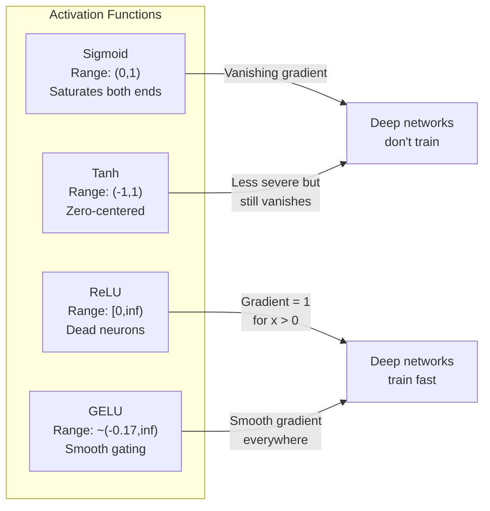
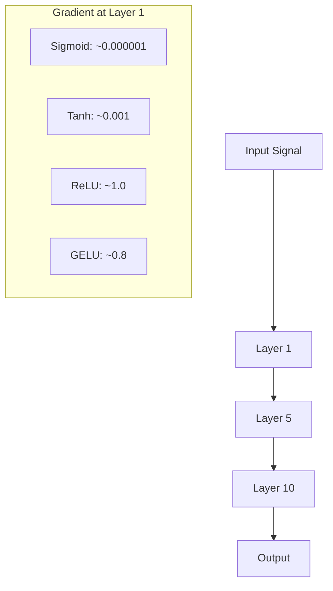
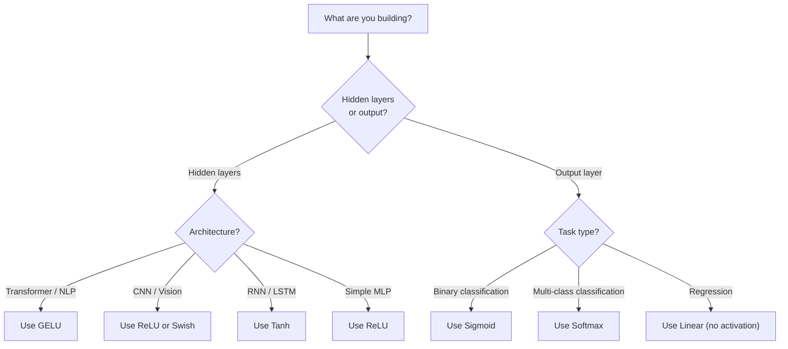

# 激活函数

> 没有非线性，你的 100 层网络只是一次花哨的矩阵乘法。激活函数是让神经网络学会"用曲线思考"的闸门。

**Type:** Build
**Languages:** Python
**Prerequisites:** Lesson 03.03 (Backpropagation)
**Time:** ~75 minutes

## 学习目标

- 从零实现 sigmoid、tanh、ReLU、Leaky ReLU、GELU、Swish 和 softmax 及其导数
- 通过测量不同激活函数在 10 层以上网络中的激活值大小，诊断梯度消失问题
- 检测 ReLU 网络中的死神经元，并解释为什么 GELU 能避免这种失效模式
- 为给定架构（Transformer、CNN、RNN、输出层）选择正确的激活函数

## 问题背景

把两个线性变换叠在一起：y = W2(W1x + b1) + b2。展开它：y = W2W1x + W2b1 + b2。这就是 y = Ax + c —— 还是一个线性变换。无论你堆多少个线性层，结果都会塌缩成一次矩阵乘法。你的 100 层网络和单层网络的表达能力完全相同。

这不是什么理论上的趣闻。它意味着一个深层线性网络根本学不会 XOR，无法对螺旋数据集分类，也识别不了人脸。没有激活函数，深度只是一种幻觉。

激活函数打破了这种线性。它们把每一层的输出送进一个非线性函数进行扭曲，让网络获得弯曲决策边界、逼近任意函数、真正学习的能力。但选错激活函数，你的梯度会消失到零（深层网络中的 sigmoid）、爆炸到无穷（无上界的激活函数加上不当的初始化），或者神经元永久死亡（带有大负偏置的 ReLU）。激活函数的选择直接决定了你的网络到底能不能学。

## 核心概念

### 为什么非线性是必需的

矩阵乘法是可复合的。先用矩阵 A 再用矩阵 B 去乘一个向量，等价于直接乘以 AB。这意味着堆叠十个线性层在数学上等价于一个带着一个大矩阵的线性层。所有那些参数、所有那些深度 —— 全都浪费了。你需要某种东西来打断这条链。这正是激活函数的作用。

下面是证明。一个线性层计算 f(x) = Wx + b。叠两层：

```
Layer 1: h = W1 * x + b1
Layer 2: y = W2 * h + b2
```

代入：

```
y = W2 * (W1 * x + b1) + b2
y = (W2 * W1) * x + (W2 * b1 + b2)
y = A * x + c
```

只剩一层。现在在层与层之间插入一个非线性激活 g()：

```
h = g(W1 * x + b1)
y = W2 * h + b2
```

代入化简的链条断了。W2 * g(W1 * x + b1) + b2 无法再化简为单个线性变换。网络能够表示非线性函数了。每多加一层带激活的网络层，表达能力就增加一分。

### Sigmoid

神经网络最早使用的激活函数。

```
sigmoid(x) = 1 / (1 + e^(-x))
```

输出范围：(0, 1)。平滑、可导，把任意实数映射成一个类似概率的值。

它的导数：

```
sigmoid'(x) = sigmoid(x) * (1 - sigmoid(x))
```

这个导数的最大值是 0.25，出现在 x = 0 处。反向传播中，梯度要逐层相乘。十层 sigmoid 意味着梯度最多被乘以 0.25 十次：

```
0.25^10 = 0.000000953674
```

不到原始信号的百万分之一。这就是梯度消失（vanishing gradient）问题。前面几层的梯度变得如此之小，以至于权重几乎不更新。网络看起来在学习 —— 后面几层的损失在下降 —— 但前面的层被冻住了。深层 sigmoid 网络根本训练不动。

还有一个问题：sigmoid 的输出永远为正（0 到 1 之间），这意味着权重上的梯度总是同号。这会导致梯度下降过程中出现锯齿状的来回摆动。

### Tanh

sigmoid 的零中心版本。

```
tanh(x) = (e^x - e^(-x)) / (e^x + e^(-x))
```

输出范围：(-1, 1)。以零为中心，消除了锯齿摆动问题。

它的导数：

```
tanh'(x) = 1 - tanh(x)^2
```

最大导数为 1.0，出现在 x = 0 处 —— 比 sigmoid 好四倍。但梯度消失问题依然存在。对于很大的正输入或负输入，导数趋近于零。十层网络仍会碾碎梯度，只是没那么狠。

### ReLU：突破性进展

修正线性单元（Rectified Linear Unit）。由 Nair 和 Hinton 在 2010 年推广到深度学习领域（这个函数本身可以追溯到 Fukushima 1969 年的工作），它改变了一切。

```
relu(x) = max(0, x)
```

输出范围：[0, infinity)。它的导数简单得不能再简单：

```
relu'(x) = 1  if x > 0
            0  if x <= 0
```

正输入没有梯度消失。梯度恰好等于 1，原样直接传过去。这正是深层网络变得可训练的原因 —— ReLU 在层与层之间保持了梯度的大小。

但它有一种失效模式：死神经元（dead neuron）问题。如果某个神经元的加权输入始终为负（由于偏置是个很大的负数，或者权重初始化运气不好），它的输出永远是零，梯度永远是零，永远不会更新。它永久死亡了。在实践中，一个 ReLU 网络里 10-40% 的神经元可能在训练过程中死掉。

### Leaky ReLU

对付死神经元最简单的修补方案。

```
leaky_relu(x) = x        if x > 0
                alpha * x if x <= 0
```

其中 alpha 是一个小常数，通常取 0.01。负半轴有一个小斜率而不是零，于是死掉的神经元仍能收到梯度信号，从而有机会恢复。

### GELU：现代默认选择

高斯误差线性单元（Gaussian Error Linear Unit）。由 Hendrycks 和 Gimpel 在 2016 年提出。是 BERT、GPT 以及大多数现代 Transformer 的默认激活函数。

```
gelu(x) = x * Phi(x)
```

其中 Phi(x) 是标准正态分布的累积分布函数。实践中使用的近似公式：

```
gelu(x) ~= 0.5 * x * (1 + tanh(sqrt(2/pi) * (x + 0.044715 * x^3)))
```

GELU 处处平滑，允许小的负值通过（不像 ReLU 那样硬性截断为零），并且有一个概率解释：它按照每个输入在高斯分布下为正的概率来加权该输入。这种平滑的门控在 Transformer 架构中优于 ReLU，因为它提供了更好的梯度流动，并彻底避免了死神经元问题。

### Swish / SiLU

由 Ramachandran 等人在 2017 年通过自动化搜索发现的自门控激活函数。

```
swish(x) = x * sigmoid(x)
```

Swish 的正式形式就是 x * sigmoid(x)。Google 是在激活函数空间中通过自动化搜索发现它的 —— 一个神经网络在设计神经网络的零件。

和 GELU 一样，它平滑、非单调、允许小的负值。两者的差异很微妙：Swish 用 sigmoid 做门控，GELU 用高斯 CDF 做门控。实践中性能几乎相同。Swish 用于 EfficientNet 和一些视觉模型，GELU 则在语言模型中占主导地位。

### Softmax：输出层激活函数

不用于隐藏层。Softmax 把一个原始得分向量（logits）转换成一个概率分布。

```
softmax(x_i) = e^(x_i) / sum(e^(x_j) for all j)
```

每个输出都在 0 和 1 之间。所有输出之和为 1。这使它成为多分类任务输出层的标准激活。最大的 logit 获得最高的概率，但与 argmax 不同，softmax 可导，并保留了关于相对置信度的信息。

### 形状对比



### 梯度流动对比



### 什么场景用哪个激活函数



```figure
softmax-temperature
```

## 从零实现

### 第 1 步：实现所有激活函数及其导数

每个函数接收一个浮点数并返回一个浮点数。每个导数函数接收相同的输入并返回梯度。

```python
import math

def sigmoid(x):
    x = max(-500, min(500, x))
    return 1.0 / (1.0 + math.exp(-x))

def sigmoid_derivative(x):
    s = sigmoid(x)
    return s * (1 - s)

def tanh_act(x):
    return math.tanh(x)

def tanh_derivative(x):
    t = math.tanh(x)
    return 1 - t * t

def relu(x):
    return max(0.0, x)

def relu_derivative(x):
    return 1.0 if x > 0 else 0.0

def leaky_relu(x, alpha=0.01):
    return x if x > 0 else alpha * x

def leaky_relu_derivative(x, alpha=0.01):
    return 1.0 if x > 0 else alpha

def gelu(x):
    return 0.5 * x * (1 + math.tanh(math.sqrt(2 / math.pi) * (x + 0.044715 * x ** 3)))

def gelu_derivative(x):
    phi = 0.5 * (1 + math.erf(x / math.sqrt(2)))
    pdf = math.exp(-0.5 * x * x) / math.sqrt(2 * math.pi)
    return phi + x * pdf

def swish(x):
    return x * sigmoid(x)

def swish_derivative(x):
    s = sigmoid(x)
    return s + x * s * (1 - s)

def softmax(xs):
    max_x = max(xs)
    exps = [math.exp(x - max_x) for x in xs]
    total = sum(exps)
    return [e / total for e in exps]
```

### 第 2 步：可视化梯度在哪里消亡

在 -5 到 5 之间均匀取 100 个点计算梯度。打印一个文本直方图，展示每个激活函数的梯度在哪些区域接近零。

```python
def gradient_scan(name, derivative_fn, start=-5, end=5, n=100):
    step = (end - start) / n
    near_zero = 0
    healthy = 0
    for i in range(n):
        x = start + i * step
        g = derivative_fn(x)
        if abs(g) < 0.01:
            near_zero += 1
        else:
            healthy += 1
    pct_dead = near_zero / n * 100
    print(f"{name:15s}: {healthy:3d} healthy, {near_zero:3d} near-zero ({pct_dead:.0f}% dead zone)")

gradient_scan("Sigmoid", sigmoid_derivative)
gradient_scan("Tanh", tanh_derivative)
gradient_scan("ReLU", relu_derivative)
gradient_scan("Leaky ReLU", leaky_relu_derivative)
gradient_scan("GELU", gelu_derivative)
gradient_scan("Swish", swish_derivative)
```

### 第 3 步：梯度消失实验

让一个信号分别用 sigmoid 和 ReLU 前向通过 N 层网络，测量激活值大小如何变化。

```python
import random

def vanishing_gradient_experiment(activation_fn, name, n_layers=10, n_inputs=5):
    random.seed(42)
    values = [random.gauss(0, 1) for _ in range(n_inputs)]

    print(f"\n{name} through {n_layers} layers:")
    for layer in range(n_layers):
        weights = [random.gauss(0, 1) for _ in range(n_inputs)]
        z = sum(w * v for w, v in zip(weights, values))
        activated = activation_fn(z)
        magnitude = abs(activated)
        bar = "#" * int(magnitude * 20)
        print(f"  Layer {layer+1:2d}: magnitude = {magnitude:.6f} {bar}")
        values = [activated] * n_inputs

vanishing_gradient_experiment(sigmoid, "Sigmoid")
vanishing_gradient_experiment(relu, "ReLU")
vanishing_gradient_experiment(gelu, "GELU")
```

### 第 4 步：死神经元检测器

创建一个 ReLU 网络，给它输入随机数据，统计有多少神经元从未激活过。

```python
def dead_neuron_detector(n_inputs=5, hidden_size=20, n_samples=1000):
    random.seed(0)
    weights = [[random.gauss(0, 1) for _ in range(n_inputs)] for _ in range(hidden_size)]
    biases = [random.gauss(0, 1) for _ in range(hidden_size)]

    fire_counts = [0] * hidden_size

    for _ in range(n_samples):
        inputs = [random.gauss(0, 1) for _ in range(n_inputs)]
        for neuron_idx in range(hidden_size):
            z = sum(w * x for w, x in zip(weights[neuron_idx], inputs)) + biases[neuron_idx]
            if relu(z) > 0:
                fire_counts[neuron_idx] += 1

    dead = sum(1 for c in fire_counts if c == 0)
    rarely_fire = sum(1 for c in fire_counts if 0 < c < n_samples * 0.05)
    healthy = hidden_size - dead - rarely_fire

    print(f"\nDead Neuron Report ({hidden_size} neurons, {n_samples} samples):")
    print(f"  Dead (never fired):     {dead}")
    print(f"  Barely alive (<5%):     {rarely_fire}")
    print(f"  Healthy:                {healthy}")
    print(f"  Dead neuron rate:       {dead/hidden_size*100:.1f}%")

    for i, c in enumerate(fire_counts):
        status = "DEAD" if c == 0 else "WEAK" if c < n_samples * 0.05 else "OK"
        bar = "#" * (c * 40 // n_samples)
        print(f"  Neuron {i:2d}: {c:4d}/{n_samples} fires [{status:4s}] {bar}")

dead_neuron_detector()
```

### 第 5 步：训练对比 —— Sigmoid vs ReLU vs GELU

在圆形数据集上（圆内的点为类别 1，圆外为类别 0）用三种不同的激活函数训练同一个两层网络，比较收敛速度。

```python
def make_circle_data(n=200, seed=42):
    random.seed(seed)
    data = []
    for _ in range(n):
        x = random.uniform(-2, 2)
        y = random.uniform(-2, 2)
        label = 1.0 if x * x + y * y < 1.5 else 0.0
        data.append(([x, y], label))
    return data


class ActivationNetwork:
    def __init__(self, activation_fn, activation_deriv, hidden_size=8, lr=0.1):
        random.seed(0)
        self.act = activation_fn
        self.act_d = activation_deriv
        self.lr = lr
        self.hidden_size = hidden_size

        self.w1 = [[random.gauss(0, 0.5) for _ in range(2)] for _ in range(hidden_size)]
        self.b1 = [0.0] * hidden_size
        self.w2 = [random.gauss(0, 0.5) for _ in range(hidden_size)]
        self.b2 = 0.0

    def forward(self, x):
        self.x = x
        self.z1 = []
        self.h = []
        for i in range(self.hidden_size):
            z = self.w1[i][0] * x[0] + self.w1[i][1] * x[1] + self.b1[i]
            self.z1.append(z)
            self.h.append(self.act(z))

        self.z2 = sum(self.w2[i] * self.h[i] for i in range(self.hidden_size)) + self.b2
        self.out = sigmoid(self.z2)
        return self.out

    def backward(self, target):
        error = self.out - target
        d_out = error * self.out * (1 - self.out)

        for i in range(self.hidden_size):
            d_h = d_out * self.w2[i] * self.act_d(self.z1[i])
            self.w2[i] -= self.lr * d_out * self.h[i]
            for j in range(2):
                self.w1[i][j] -= self.lr * d_h * self.x[j]
            self.b1[i] -= self.lr * d_h
        self.b2 -= self.lr * d_out

    def train(self, data, epochs=200):
        losses = []
        for epoch in range(epochs):
            total_loss = 0
            correct = 0
            for x, y in data:
                pred = self.forward(x)
                self.backward(y)
                total_loss += (pred - y) ** 2
                if (pred >= 0.5) == (y >= 0.5):
                    correct += 1
            avg_loss = total_loss / len(data)
            accuracy = correct / len(data) * 100
            losses.append(avg_loss)
            if epoch % 50 == 0 or epoch == epochs - 1:
                print(f"    Epoch {epoch:3d}: loss={avg_loss:.4f}, accuracy={accuracy:.1f}%")
        return losses


data = make_circle_data()

configs = [
    ("Sigmoid", sigmoid, sigmoid_derivative),
    ("ReLU", relu, relu_derivative),
    ("GELU", gelu, gelu_derivative),
]

results = {}
for name, act_fn, act_d_fn in configs:
    print(f"\n=== Training with {name} ===")
    net = ActivationNetwork(act_fn, act_d_fn, hidden_size=8, lr=0.1)
    losses = net.train(data, epochs=200)
    results[name] = losses

print("\n=== Final Loss Comparison ===")
for name, losses in results.items():
    print(f"  {name:10s}: start={losses[0]:.4f} -> end={losses[-1]:.4f} (improvement: {(1 - losses[-1]/losses[0])*100:.1f}%)")
```

## 生产实践

PyTorch 把这些激活函数同时提供了函数形式和模块形式：

```python
import torch
import torch.nn as nn
import torch.nn.functional as F

x = torch.randn(4, 10)

relu_out = F.relu(x)
gelu_out = F.gelu(x)
sigmoid_out = torch.sigmoid(x)
swish_out = F.silu(x)

logits = torch.randn(4, 5)
probs = F.softmax(logits, dim=1)

model = nn.Sequential(
    nn.Linear(10, 64),
    nn.GELU(),
    nn.Linear(64, 32),
    nn.GELU(),
    nn.Linear(32, 5),
)
```

Transformer 的隐藏层：GELU。CNN 的隐藏层：ReLU。分类任务的输出层：softmax。回归任务的输出层：不加激活（线性）。概率输出层：sigmoid。就这么简单。先用这些默认选项，只有拿到证据时才去更换。

RNN 和 LSTM 的隐藏状态用 tanh、门控用 sigmoid，但如果你今天从零开始搭建模型，大概率不会用 RNN。如果你的 ReLU 网络里神经元在死亡，换成 GELU。除非有特定理由，否则别去用 Leaky ReLU —— GELU 既解决了死神经元问题，又能提供更好的梯度流动。

## 交付产物

本课产出：
- `outputs/prompt-activation-selector.md` —— 一个可复用的提示词，帮助你为任意架构挑选合适的激活函数

## 练习

1. 实现参数化 ReLU（PReLU），其中负半轴斜率 alpha 是一个可学习参数。在圆形数据集上训练它，并与固定 alpha 的 Leaky ReLU 对比。

2. 把梯度消失实验从 10 层改成 50 层。绘制 sigmoid、tanh、ReLU 和 GELU 在每一层的激活值大小曲线。每种激活函数的信号分别在第几层实际归零？

3. 实现 ELU（指数线性单元）：elu(x) = x if x > 0, alpha * (e^x - 1) if x <= 0。在同一个网络上比较它和 ReLU 的死神经元比例。

4. 构建一个在训练期间运行的"梯度健康监视器"：每个 epoch 计算每一层的平均梯度大小。当任何一层的梯度低于 0.001 或超过 100 时打印警告。

5. 把训练对比实验的数据集从圆形换成第 01 课的 XOR 数据集。哪种激活函数在 XOR 上收敛最快？为什么结果与圆形数据集不同？

## 关键术语

| 术语 | 人们怎么说 | 实际含义 |
|------|----------------|----------------------|
| 激活函数（Activation function） | "非线性的那部分" | 作用在每个神经元输出上的函数，用来打破线性，使网络能够学习非线性映射 |
| 梯度消失（Vanishing gradient） | "深层网络里梯度不见了" | 当激活函数的导数小于 1 时，梯度逐层呈指数级缩小，导致前面的层无法训练 |
| 梯度爆炸（Exploding gradient） | "梯度炸了" | 当有效乘数超过 1 时，梯度逐层呈指数级增长，导致训练不稳定 |
| 死神经元（Dead neuron） | "一个停止学习的神经元" | 输入永久为负的 ReLU 神经元，输出为零、梯度为零 |
| Sigmoid | "把数值压到 0-1 之间" | 逻辑斯蒂函数 1/(1+e^-x)，在历史上很重要，但在深层网络中会导致梯度消失 |
| ReLU | "把负数截断成零" | max(0, x) —— 通过保持梯度大小让深度学习变得可行的激活函数 |
| GELU | "Transformer 用的激活函数" | 高斯误差线性单元，一种平滑激活函数，按输入为正的概率对其加权 |
| Swish/SiLU | "自门控的 ReLU" | x * sigmoid(x)，通过自动化搜索发现，用于 EfficientNet |
| Softmax | "把得分变成概率" | 把 logits 向量归一化为概率分布，所有值都在 (0,1) 内且总和为 1 |
| Leaky ReLU | "不会死的 ReLU" | max(alpha*x, x)，其中 alpha 很小（0.01），通过允许小的负梯度防止神经元死亡 |
| 饱和（Saturation） | "sigmoid 的平坦区" | 激活函数导数趋近于零的区域，会阻断梯度流动 |
| Logit | "softmax 之前的原始得分" | 最后一层在应用 softmax 或 sigmoid 之前的未归一化输出 |

## 延伸阅读

- Nair & Hinton, "Rectified Linear Units Improve Restricted Boltzmann Machines" (2010) —— 提出 ReLU 并使深层网络得以训练的论文
- Hendrycks & Gimpel, "Gaussian Error Linear Units (GELUs)" (2016) —— 提出了后来成为 Transformer 默认选择的激活函数
- Ramachandran et al., "Searching for Activation Functions" (2017) —— 用自动化搜索发现了 Swish，证明激活函数的设计可以自动化
- Glorot & Bengio, "Understanding the difficulty of training deep feedforward neural networks" (2010) —— 诊断了梯度消失/爆炸问题并提出 Xavier 初始化的论文
- Goodfellow, Bengio, Courville, "Deep Learning" Chapter 6.3 (https://www.deeplearningbook.org/) —— 对隐藏单元和激活函数的严谨论述
