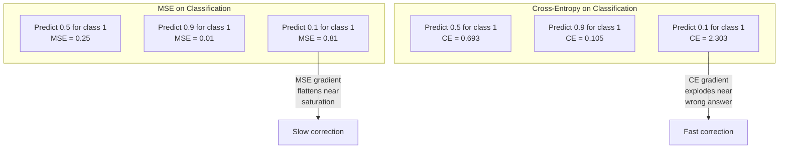
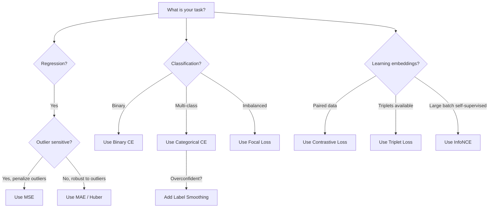
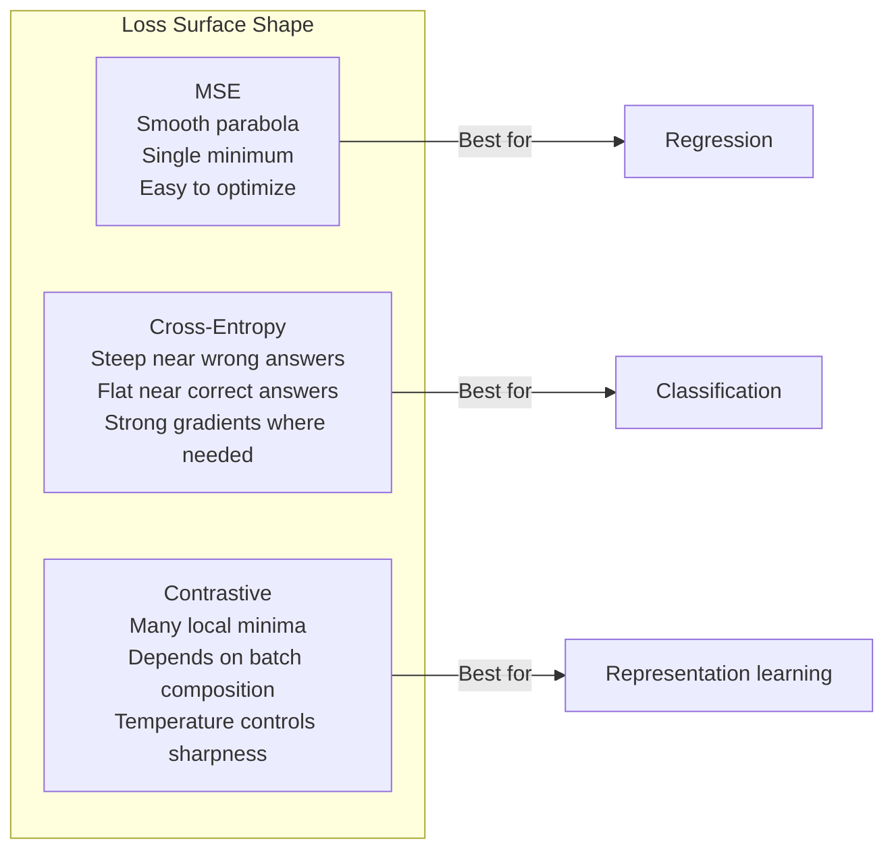

# 损失函数

> 你的网络给出一个预测，而真实标签却不是这样。它到底错了多少？这个数字就是损失。选错了损失函数，模型就会朝着完全错误的目标去优化。

**Type:** Build
**Languages:** Python
**Prerequisites:** Lesson 03.04 (Activation Functions)
**Time:** ~75 minutes

## 学习目标

- 从零实现 MSE、二元交叉熵、多类交叉熵以及对比损失（InfoNCE），并推导它们的梯度
- 通过演示「对所有输入都预测 0.5」的失败模式，解释为什么 MSE 不适用于分类
- 在交叉熵上应用标签平滑（label smoothing），并说明它如何防止过度自信的预测
- 为回归、二分类、多分类和嵌入学习任务选择正确的损失函数

## 问题背景

一个在分类问题上最小化 MSE 的模型，会信心十足地对所有输入预测 0.5。它确实在最小化损失，但它也毫无用处。

损失函数是模型唯一真正优化的东西。不是准确率，不是 F1 分数，也不是你向上级汇报的任何指标。优化器对损失函数求梯度，再调整权重让这个数字变小。如果损失函数没有刻画你真正关心的东西，模型就会找到数学上最省事的方式去满足它，而这种方式几乎从来不是你想要的。

举一个具体的例子。你有一个二分类任务，两个类别各占 50%。你用 MSE 作为损失。模型对每一个输入都预测 0.5。平均 MSE 是 0.25，这是在不做任何真正学习的前提下能达到的最小值。模型的判别能力为零，却在技术上最小化了你的损失函数。换成交叉熵，同一个模型就被迫把预测推向 0 或 1，因为 -log(0.5) = 0.693 是一个糟糕的损失，而 -log(0.99) = 0.01 会奖励自信且正确的预测。损失函数的选择，决定了模型是在真正学习，还是在投机取巧地刷指标。

情况还会更糟。在自监督学习中，你甚至没有标签。对比损失完全定义了学习信号：什么算相似、什么算不同、模型应该用多大力气把它们推开。把对比损失设计错了，你的嵌入就会坍缩到一个点——所有输入都映射到同一个向量。损失在技术上是零，结果却毫无价值。

## 核心概念

### 均方误差（MSE）

回归任务的默认选择。计算预测值与目标值之差的平方，再对所有样本取平均。

```
MSE = (1/n) * sum((y_pred - y_true)^2)
```

平方为什么重要：它对大误差施加二次方惩罚。误差为 2 的代价是误差为 1 的 4 倍，误差为 10 的代价则是 100 倍。这使得 MSE 对离群点很敏感——一个错得离谱的预测就能主导整个损失。

来点实际数字：如果你的模型预测房价，大多数房子偏差 1 万美元，但有一栋豪宅偏差 20 万美元，MSE 会激进地去修正那一栋豪宅，可能反而损害另外 99 栋房子上的表现。

MSE 对某个预测的梯度是：

```
dMSE/dy_pred = (2/n) * (y_pred - y_true)
```

梯度与误差成线性关系。误差越大，梯度越大。这对回归来说是优点（大误差需要大修正），对分类来说则是缺陷（你希望对自信的错误答案施加指数级而非线性的惩罚）。

### 交叉熵损失

分类任务的损失函数。源自信息论——它度量预测概率分布与真实分布之间的差异。

**二元交叉熵（Binary Cross-Entropy，BCE）：**

```
BCE = -(y * log(p) + (1 - y) * log(1 - p))
```

其中 y 是真实标签（0 或 1），p 是预测的概率。

-log(p) 为什么有效：当真实标签是 1 而你预测 p = 0.99 时，损失是 -log(0.99) = 0.01。当你预测 p = 0.01 时，损失是 -log(0.01) = 4.6。这 460 倍的差距正是交叉熵起作用的原因。它狠狠惩罚自信的错误预测，对自信且正确的预测几乎不施加惩罚。

梯度讲的是同一个故事：

```
dBCE/dp = -(y/p) + (1-y)/(1-p)
```

当 y = 1 而 p 接近零时，梯度是 -1/p，趋向负无穷。模型会收到一个巨大的信号去纠正错误。当 p 接近 1 时，梯度极小。已经答对了，无需修正。

**多类交叉熵（Categorical Cross-Entropy）：**

用于目标为 one-hot 编码的多分类任务。

```
CCE = -sum(y_i * log(p_i))
```

只有真实类别对损失有贡献（因为其他所有 y_i 都是零）。如果有 10 个类别，正确类别得到的概率是 0.1（相当于随机猜测），损失就是 -log(0.1) = 2.3。如果正确类别得到的概率是 0.9，损失就是 -log(0.9) = 0.105。模型会学着把概率质量集中到正确答案上。

### 为什么 MSE 不适用于分类



当预测接近 0 或 1 时（由于 sigmoid 饱和），MSE 的梯度会变得平坦。交叉熵的梯度恰好弥补了这一点——-log 抵消了 sigmoid 的平坦区域，在最需要的地方给出强梯度。

### 标签平滑

标准的 one-hot 标签宣称「这 100% 是第 3 类，其他类别概率为 0」。这是一个很强的断言。标签平滑把它软化：

```
smooth_label = (1 - alpha) * one_hot + alpha / num_classes
```

当 alpha = 0.1 且有 10 个类别时：目标不再是 [0, 0, 1, 0, ...]，而是 [0.01, 0.01, 0.91, 0.01, ...]。模型的目标变成 0.91 而不是 1.0。

它为什么有效：模型要让 softmax 输出恰好等于 1.0，就需要把 logits 推到无穷大。这会导致过度自信、损害泛化能力，并让模型在分布偏移面前变得脆弱。标签平滑把目标上限封在 0.9（当 alpha=0.1 时），让 logits 保持在合理范围内。GPT 和大多数现代模型都使用标签平滑或与之等价的技术。

### 对比损失

没有标签，没有类别。只有成对的输入和一个问题：它们是相似还是不同？

**SimCLR 风格的对比损失（NT-Xent / InfoNCE）：**

取一张图像，对它做两次数据增强（裁剪、旋转、颜色抖动）生成两个视图。它们构成「正样本对」——它们的嵌入应该相似。批次中的其他每张图像都构成「负样本对」——它们的嵌入应该不同。

```
L = -log(exp(sim(z_i, z_j) / tau) / sum(exp(sim(z_i, z_k) / tau)))
```

其中 sim() 是余弦相似度，z_i 和 z_j 是正样本对，求和遍历所有负样本，tau（温度）控制分布的尖锐程度。温度越低 = 负样本越「难」= 分离得越激进。

实际数字：批大小 256 意味着每个正样本对有 255 个负样本。温度 tau = 0.07（SimCLR 的默认值）。这个损失看起来就像对相似度做 softmax——它希望正样本对的相似度在全部 256 个选项中是最高的。

**三元组损失（Triplet Loss）：**

接受三个输入：锚点（anchor）、正样本（同类）、负样本（不同类）。

```
L = max(0, d(anchor, positive) - d(anchor, negative) + margin)
```

间隔（margin，通常取 0.2-1.0）强制正负样本距离之间保持最小差距。如果负样本已经足够远，损失就是零——没有梯度，也没有更新。这让训练很高效，但需要精心的三元组挖掘（选择离锚点很近的难负样本）。

### Focal Loss

用于类别不平衡的数据集。标准交叉熵对所有分类正确的样本一视同仁。Focal loss 降低简单样本的权重：

```
FL = -alpha * (1 - p_t)^gamma * log(p_t)
```

其中 p_t 是真实类别的预测概率，gamma 控制聚焦的程度。当 gamma = 0 时，它就是标准交叉熵。当 gamma = 2（默认值）时：

- 简单样本（p_t = 0.9）：权重 = (0.1)^2 = 0.01。基本被忽略。
- 困难样本（p_t = 0.1）：权重 = (0.9)^2 = 0.81。保留完整的梯度信号。

Focal loss 由 Lin 等人为目标检测提出，在那个场景下 99% 的候选区域都是背景（简单负样本）。没有 focal loss，模型会淹没在简单的背景样本里，永远学不会检测目标。有了它，模型就能把容量集中在真正重要的困难、模糊的样本上。

### 损失函数决策树



### 损失地形



```figure
cross-entropy-loss
```

## 从零实现

### 第 1 步：MSE 及其梯度

```python
def mse(predictions, targets):
    n = len(predictions)
    total = 0.0
    for p, t in zip(predictions, targets):
        total += (p - t) ** 2
    return total / n

def mse_gradient(predictions, targets):
    n = len(predictions)
    grads = []
    for p, t in zip(predictions, targets):
        grads.append(2.0 * (p - t) / n)
    return grads
```

### 第 2 步：二元交叉熵

log(0) 问题是真实存在的。如果模型对一个正样本恰好预测 0，log(0) 就是负无穷。裁剪（clipping）可以避免这种情况。

```python
import math

def binary_cross_entropy(predictions, targets, eps=1e-15):
    n = len(predictions)
    total = 0.0
    for p, t in zip(predictions, targets):
        p_clipped = max(eps, min(1 - eps, p))
        total += -(t * math.log(p_clipped) + (1 - t) * math.log(1 - p_clipped))
    return total / n

def bce_gradient(predictions, targets, eps=1e-15):
    grads = []
    for p, t in zip(predictions, targets):
        p_clipped = max(eps, min(1 - eps, p))
        grads.append(-(t / p_clipped) + (1 - t) / (1 - p_clipped))
    return grads
```

### 第 3 步：带 Softmax 的多类交叉熵

Softmax 把原始 logits 转换成概率，然后我们再对 one-hot 目标计算交叉熵。

```python
def softmax(logits):
    max_val = max(logits)
    exps = [math.exp(x - max_val) for x in logits]
    total = sum(exps)
    return [e / total for e in exps]

def categorical_cross_entropy(logits, target_index, eps=1e-15):
    probs = softmax(logits)
    p = max(eps, probs[target_index])
    return -math.log(p)

def cce_gradient(logits, target_index):
    probs = softmax(logits)
    grads = list(probs)
    grads[target_index] -= 1.0
    return grads
```

softmax + 交叉熵的梯度化简得非常漂亮：真实类别的梯度就是（预测概率 - 1），其他所有类别的梯度就是（预测概率）。这种优雅的化简不是巧合——这正是 softmax 与交叉熵总是成对出现的原因。

### 第 4 步：标签平滑

```python
def label_smoothed_cce(logits, target_index, num_classes, alpha=0.1, eps=1e-15):
    probs = softmax(logits)
    loss = 0.0
    for i in range(num_classes):
        if i == target_index:
            smooth_target = 1.0 - alpha + alpha / num_classes
        else:
            smooth_target = alpha / num_classes
        p = max(eps, probs[i])
        loss += -smooth_target * math.log(p)
    return loss
```

### 第 5 步：对比损失（简化版 InfoNCE）

```python
def cosine_similarity(a, b):
    dot = sum(x * y for x, y in zip(a, b))
    norm_a = math.sqrt(sum(x * x for x in a))
    norm_b = math.sqrt(sum(x * x for x in b))
    if norm_a < 1e-10 or norm_b < 1e-10:
        return 0.0
    return dot / (norm_a * norm_b)

def contrastive_loss(anchor, positive, negatives, temperature=0.07):
    sim_pos = cosine_similarity(anchor, positive) / temperature
    sim_negs = [cosine_similarity(anchor, neg) / temperature for neg in negatives]

    max_sim = max(sim_pos, max(sim_negs)) if sim_negs else sim_pos
    exp_pos = math.exp(sim_pos - max_sim)
    exp_negs = [math.exp(s - max_sim) for s in sim_negs]
    total_exp = exp_pos + sum(exp_negs)

    return -math.log(max(1e-15, exp_pos / total_exp))
```

### 第 6 步：MSE 与交叉熵在分类任务上的对比

用两种损失函数分别训练第 04 课中的同一个网络（圆形数据集），观察交叉熵收敛得更快。

```python
import random

def sigmoid(x):
    x = max(-500, min(500, x))
    return 1.0 / (1.0 + math.exp(-x))

def make_circle_data(n=200, seed=42):
    random.seed(seed)
    data = []
    for _ in range(n):
        x = random.uniform(-2, 2)
        y = random.uniform(-2, 2)
        label = 1.0 if x * x + y * y < 1.5 else 0.0
        data.append(([x, y], label))
    return data


class LossComparisonNetwork:
    def __init__(self, loss_type="bce", hidden_size=8, lr=0.1):
        random.seed(0)
        self.loss_type = loss_type
        self.lr = lr
        self.hidden_size = hidden_size

        self.w1 = [[random.gauss(0, 0.5) for _ in range(2)] for _ in range(hidden_size)]
        self.b1 = [0.0] * hidden_size
        self.w2 = [random.gauss(0, 0.5) for _ in range(hidden_size)]
        self.b2 = 0.0

    def forward(self, x):
        self.x = x
        self.z1 = []
        self.h = []
        for i in range(self.hidden_size):
            z = self.w1[i][0] * x[0] + self.w1[i][1] * x[1] + self.b1[i]
            self.z1.append(z)
            self.h.append(max(0.0, z))

        self.z2 = sum(self.w2[i] * self.h[i] for i in range(self.hidden_size)) + self.b2
        self.out = sigmoid(self.z2)
        return self.out

    def backward(self, target):
        if self.loss_type == "mse":
            d_loss = 2.0 * (self.out - target)
        else:
            eps = 1e-15
            p = max(eps, min(1 - eps, self.out))
            d_loss = -(target / p) + (1 - target) / (1 - p)

        d_sigmoid = self.out * (1 - self.out)
        d_out = d_loss * d_sigmoid

        for i in range(self.hidden_size):
            d_relu = 1.0 if self.z1[i] > 0 else 0.0
            d_h = d_out * self.w2[i] * d_relu
            self.w2[i] -= self.lr * d_out * self.h[i]
            for j in range(2):
                self.w1[i][j] -= self.lr * d_h * self.x[j]
            self.b1[i] -= self.lr * d_h
        self.b2 -= self.lr * d_out

    def compute_loss(self, pred, target):
        if self.loss_type == "mse":
            return (pred - target) ** 2
        else:
            eps = 1e-15
            p = max(eps, min(1 - eps, pred))
            return -(target * math.log(p) + (1 - target) * math.log(1 - p))

    def train(self, data, epochs=200):
        losses = []
        for epoch in range(epochs):
            total_loss = 0.0
            correct = 0
            for x, y in data:
                pred = self.forward(x)
                self.backward(y)
                total_loss += self.compute_loss(pred, y)
                if (pred >= 0.5) == (y >= 0.5):
                    correct += 1
            avg_loss = total_loss / len(data)
            accuracy = correct / len(data) * 100
            losses.append((avg_loss, accuracy))
            if epoch % 50 == 0 or epoch == epochs - 1:
                print(f"    Epoch {epoch:3d}: loss={avg_loss:.4f}, accuracy={accuracy:.1f}%")
        return losses
```

## 生产实践

PyTorch 提供了所有标准损失函数，并且内置了数值稳定性处理：

```python
import torch
import torch.nn as nn
import torch.nn.functional as F

predictions = torch.tensor([0.9, 0.1, 0.7], requires_grad=True)
targets = torch.tensor([1.0, 0.0, 1.0])

mse_loss = F.mse_loss(predictions, targets)
bce_loss = F.binary_cross_entropy(predictions, targets)

logits = torch.randn(4, 10)
labels = torch.tensor([3, 7, 1, 9])
ce_loss = F.cross_entropy(logits, labels)
ce_smooth = F.cross_entropy(logits, labels, label_smoothing=0.1)
```

请使用 `F.cross_entropy`（而不是 `F.nll_loss` 加手动 softmax）。它把 log-softmax 和负对数似然合并成一个数值稳定的操作。先单独做 softmax 再取对数的做法稳定性更差——在大指数相减的过程中会损失精度。

对于对比学习，大多数团队使用自定义实现，或者 `lightly`、`pytorch-metric-learning` 这样的库。核心循环始终是一样的：计算两两相似度，对正负样本构建 softmax，然后反向传播。

## 交付产物

本课产出：
- `outputs/prompt-loss-function-selector.md` —— 一个可复用的提示词，用于选择正确的损失函数
- `outputs/prompt-loss-debugger.md` —— 一个诊断提示词，用于排查损失曲线不对劲的情况

## 练习

1. 实现 Huber loss（smooth L1 loss），它对小误差表现为 MSE，对大误差表现为 MAE。在 5% 的训练目标被加入随机噪声（离群点）的情况下，分别用 MSE 和 Huber 训练一个预测 y = sin(x) 的回归网络，比较最终测试误差。

2. 把 focal loss 加入二分类训练循环。构造一个不平衡数据集（90% 为类别 0，10% 为类别 1）。训练 200 个 epoch 后，比较标准 BCE 与 focal loss（gamma=2）在少数类召回率上的差异。

3. 实现带半难负样本挖掘（semi-hard negative mining）的三元组损失。为 5 个类别生成二维嵌入数据。对每个锚点，找出比正样本更远但仍然最「难」的负样本（半难负样本）。与随机选取三元组的方式比较收敛速度。

4. 重新运行 MSE 与交叉熵的对比实验，但在训练过程中追踪每一层的梯度幅值。绘制每个 epoch 的平均梯度范数曲线。验证在模型最不确定的早期 epoch 中，交叉熵会产生更大的梯度。

5. 实现 KL 散度损失，并验证当真实分布是 one-hot 时，最小化 KL(true || predicted) 与交叉熵给出相同的梯度。然后尝试软目标（如知识蒸馏），让「真实」分布来自教师模型的 softmax 输出。

## 关键术语

| 术语 | 常见说法 | 实际含义 |
|------|----------------|----------------------|
| 损失函数 | 「模型有多错」 | 一个把预测和目标映射为标量的可微函数，优化器最小化的就是它 |
| MSE | 「平均平方误差」 | 预测值与目标值之差平方的均值；对大误差施加二次方惩罚 |
| 交叉熵 | 「分类用的损失」 | 用 -log(p) 度量预测概率分布与真实分布之间的差异 |
| 二元交叉熵 | 「BCE」 | 两类情形的交叉熵：-(y*log(p) + (1-y)*log(1-p)) |
| 标签平滑 | 「把目标软化」 | 用软值（如 0.1/0.9）替换硬性的 0/1 目标，防止过度自信并改善泛化 |
| 对比损失 | 「拉近相似，推开不同」 | 通过让相似样本对在嵌入空间中靠近、不相似样本对远离来学习表示的损失 |
| InfoNCE | 「CLIP/SimCLR 的损失」 | 对相似度分数做归一化、带温度缩放的交叉熵；把对比学习当作分类问题处理 |
| Focal loss | 「不平衡数据的解药」 | 用 (1-p_t)^gamma 加权的交叉熵，降低简单样本的权重、聚焦困难样本 |
| 三元组损失 | 「锚点-正样本-负样本」 | 在嵌入空间中让锚点到正样本的距离至少比到负样本近一个 margin |
| 温度 | 「尖锐度旋钮」 | 作用于 logits/相似度的标量除数，控制结果分布的尖锐程度；越低越尖锐 |

## 延伸阅读

- Lin et al., "Focal Loss for Dense Object Detection" (2017) —— 为应对目标检测中极端的类别不平衡提出了 focal loss（RetinaNet）
- Chen et al., "A Simple Framework for Contrastive Learning of Visual Representations" (SimCLR, 2020) —— 用 NT-Xent 损失定义了现代对比学习的流程
- Szegedy et al., "Rethinking the Inception Architecture" (2016) —— 提出标签平滑作为正则化技术，如今已是大多数大型模型的标配
- Hinton et al., "Distilling the Knowledge in a Neural Network" (2015) —— 使用软目标和 KL 散度进行知识蒸馏，是模型压缩的奠基性工作
