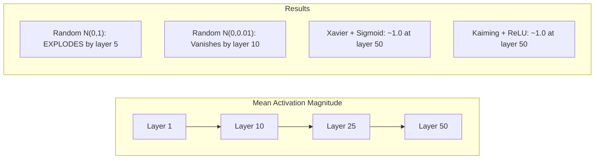
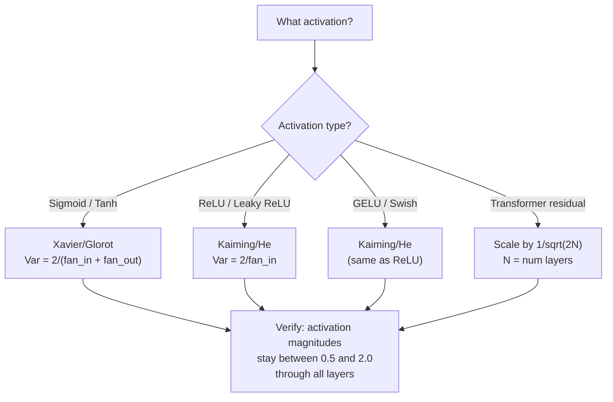

# 权重初始化与训练稳定性

> 初始化错了，训练根本无法开始；初始化对了，50 层网络训练起来和 3 层一样顺畅。

**Type:** Build
**Languages:** Python
**Prerequisites:** Lesson 03.04 (Activation Functions), Lesson 03.07 (Regularization)
**Time:** ~90 minutes

## 学习目标

- 实现零初始化、随机初始化、Xavier/Glorot 初始化和 Kaiming/He 初始化四种策略，并测量它们在 50 层网络中对激活值幅度的影响
- 推导为什么 Xavier 初始化使用 Var(w) = 2/(fan_in + fan_out)，而 Kaiming 使用 Var(w) = 2/fan_in
- 演示零初始化导致的对称性问题，并解释为什么仅靠随机缩放还不够
- 为激活函数匹配正确的初始化策略：sigmoid/tanh 用 Xavier，ReLU/GELU 用 Kaiming

## 问题背景

把所有权重初始化为零，网络什么也学不到。每个神经元计算相同的函数、收到相同的梯度、做出相同的更新。训练 10,000 个 epoch 之后，你那个 512 个神经元的隐藏层仍然是同一个神经元的 512 份拷贝。你为 512 个参数付了钱，只得到 1 个。

初始化得太大，激活值会在网络中逐层爆炸。到第 10 层，数值达到 1e15；到第 20 层，溢出为无穷大。梯度在反向传播中走的是同样的轨迹。

从标准正态分布随机初始化，3 层网络没问题。到了 50 层，信号要么坍缩为零、要么炸到无穷大，取决于随机尺度是稍微偏小还是稍微偏大。"能用"和"坏掉"之间的边界薄如刀刃。

权重初始化是深度学习中最被低估的决策。架构能发论文，优化器有博客文章，初始化只配一个脚注。但一旦初始化出错，其他一切都无关紧要——你的网络在训练开始之前就已经死了。

## 核心概念

### 对称性问题

同一层中的每个神经元结构相同：输入乘以权重、加上偏置、套用激活函数。如果所有权重从同一个值开始（零是最极端的情况），每个神经元就会计算出相同的输出。反向传播时，每个神经元收到相同的梯度；更新时，每个神经元的变化量也完全一样。

你被卡住了。网络有数百个参数，但它们步调一致地移动。这叫对称性（symmetry），而随机初始化是打破它的暴力手段。每个神经元从权重空间的不同位置出发，于是各自学到不同的特征。

但仅仅"随机"还不够。随机性的*尺度*决定了网络能否训练。

### 方差在层间的传播

考虑一个有 fan_in 个输入的单层：

```
z = w1*x1 + w2*x2 + ... + w_n*x_n
```

如果每个权重 wi 来自方差为 Var(w) 的分布，每个输入 xi 的方差为 Var(x)，则输出方差为：

```
Var(z) = fan_in * Var(w) * Var(x)
```

如果 Var(w) = 1 且 fan_in = 512，输出方差就是输入方差的 512 倍。经过 10 层：512^10 = 1.2e27。你的信号爆炸了。

如果 Var(w) = 0.001，输出方差每层缩小为 0.001 * 512 = 0.512 倍。经过 10 层：0.512^10 = 0.00013。你的信号消失了。

目标：选择合适的 Var(w)，使得 Var(z) = Var(x)。信号幅度在各层之间保持恒定。

### Xavier/Glorot 初始化

Glorot 和 Bengio（2010）针对 sigmoid 和 tanh 激活函数推导出了解法。要让方差在前向和反向传播中都保持恒定：

```
Var(w) = 2 / (fan_in + fan_out)
```

实践中，权重从以下分布采样：

```
w ~ Uniform(-limit, limit)  where limit = sqrt(6 / (fan_in + fan_out))
```

或：

```
w ~ Normal(0, sqrt(2 / (fan_in + fan_out)))
```

这之所以有效，是因为 sigmoid 和 tanh 在零点附近近似线性，而正确初始化的激活值正好落在这个区域。方差能在数十层中保持稳定。

### Kaiming/He 初始化

ReLU 会杀掉一半的输出（所有负值变成零）。有效 fan_in 减半，因为平均有一半输入被置零。Xavier 初始化没有考虑这一点——它低估了所需的方差。

He 等人（2015）调整了公式：

```
Var(w) = 2 / fan_in
```

权重从以下分布采样：

```
w ~ Normal(0, sqrt(2 / fan_in))
```

系数 2 补偿了 ReLU 把一半激活值置零的效应。没有它，信号每层缩小约 0.5 倍。50 层之后：0.5^50 = 8.8e-16。Kaiming 初始化避免了这种情况。

### Transformer 初始化

GPT-2 引入了一种不同的模式。残差连接把每个子层的输出加回到它的输入上：

```
x = x + sublayer(x)
```

每次相加都会增大方差。有 N 个残差层时，方差与 N 成正比地增长。GPT-2 把残差层的权重按 1/sqrt(2N) 缩放，其中 N 是层数。这样累积的信号幅度保持稳定。

Llama 3（405B 参数，126 层）使用了类似的方案。没有这种缩放，残差流会在 126 层注意力和前馈块中无限增长。

```mermaid
flowchart TD
    subgraph "Zero Init"
        Z1["Layer 1<br/>All weights = 0"] --> Z2["Layer 2<br/>All neurons identical"]
        Z2 --> Z3["Layer 3<br/>Still identical"]
        Z3 --> ZR["Result: 1 effective neuron<br/>regardless of width"]
    end

    subgraph "Xavier Init"
        X1["Layer 1<br/>Var = 2/(fan_in+fan_out)"] --> X2["Layer 2<br/>Signal stable"]
        X2 --> X3["Layer 50<br/>Signal stable"]
        X3 --> XR["Result: Trains with<br/>sigmoid/tanh"]
    end

    subgraph "Kaiming Init"
        K1["Layer 1<br/>Var = 2/fan_in"] --> K2["Layer 2<br/>Signal stable"]
        K2 --> K3["Layer 50<br/>Signal stable"]
        K3 --> KR["Result: Trains with<br/>ReLU/GELU"]
    end
```



### 50 层中的激活值幅度



### 如何选择正确的初始化



```figure
weight-init-variance
```

## 从零实现

### 第 1 步：初始化策略

初始化权重矩阵的四种方式。每种都返回一个列表的列表（二维矩阵），有 fan_in 列和 fan_out 行。

```python
import math
import random


def zero_init(fan_in, fan_out):
    return [[0.0 for _ in range(fan_in)] for _ in range(fan_out)]


def random_init(fan_in, fan_out, scale=1.0):
    return [[random.gauss(0, scale) for _ in range(fan_in)] for _ in range(fan_out)]


def xavier_init(fan_in, fan_out):
    std = math.sqrt(2.0 / (fan_in + fan_out))
    return [[random.gauss(0, std) for _ in range(fan_in)] for _ in range(fan_out)]


def kaiming_init(fan_in, fan_out):
    std = math.sqrt(2.0 / fan_in)
    return [[random.gauss(0, std) for _ in range(fan_in)] for _ in range(fan_out)]
```

### 第 2 步：激活函数

我们需要 sigmoid、tanh 和 ReLU，用来把每种初始化策略和它适配的激活函数搭配测试。

```python
def sigmoid(x):
    x = max(-500, min(500, x))
    return 1.0 / (1.0 + math.exp(-x))


def tanh_act(x):
    return math.tanh(x)


def relu(x):
    return max(0.0, x)
```

### 第 3 步：穿过 50 层的前向传播

把随机数据送入一个深层网络，测量每层激活值的平均幅度。

```python
def forward_deep(init_fn, activation_fn, n_layers=50, width=64, n_samples=100):
    random.seed(42)
    layer_magnitudes = []

    inputs = [[random.gauss(0, 1) for _ in range(width)] for _ in range(n_samples)]

    for layer_idx in range(n_layers):
        weights = init_fn(width, width)
        biases = [0.0] * width

        new_inputs = []
        for sample in inputs:
            output = []
            for neuron_idx in range(width):
                z = sum(weights[neuron_idx][j] * sample[j] for j in range(width)) + biases[neuron_idx]
                output.append(activation_fn(z))
            new_inputs.append(output)
        inputs = new_inputs

        magnitudes = []
        for sample in inputs:
            magnitudes.append(sum(abs(v) for v in sample) / width)
        mean_mag = sum(magnitudes) / len(magnitudes)
        layer_magnitudes.append(mean_mag)

    return layer_magnitudes
```

### 第 4 步：实验

运行所有组合：零初始化、随机 N(0,1)、随机 N(0,0.01)、Xavier 配 sigmoid、Xavier 配 tanh、Kaiming 配 ReLU。打印关键层的激活幅度。

```python
def run_experiment():
    configs = [
        ("Zero init + Sigmoid", lambda fi, fo: zero_init(fi, fo), sigmoid),
        ("Random N(0,1) + ReLU", lambda fi, fo: random_init(fi, fo, 1.0), relu),
        ("Random N(0,0.01) + ReLU", lambda fi, fo: random_init(fi, fo, 0.01), relu),
        ("Xavier + Sigmoid", xavier_init, sigmoid),
        ("Xavier + Tanh", xavier_init, tanh_act),
        ("Kaiming + ReLU", kaiming_init, relu),
    ]

    print(f"{'Strategy':<30} {'L1':>10} {'L5':>10} {'L10':>10} {'L25':>10} {'L50':>10}")
    print("-" * 80)

    for name, init_fn, act_fn in configs:
        mags = forward_deep(init_fn, act_fn)
        row = f"{name:<30}"
        for idx in [0, 4, 9, 24, 49]:
            val = mags[idx]
            if val > 1e6:
                row += f" {'EXPLODED':>10}"
            elif val < 1e-6:
                row += f" {'VANISHED':>10}"
            else:
                row += f" {val:>10.4f}"
        print(row)
```

### 第 5 步：对称性演示

证明零初始化会产生完全相同的神经元。

```python
def symmetry_demo():
    random.seed(42)
    weights = zero_init(2, 4)
    biases = [0.0] * 4

    inputs = [0.5, -0.3]
    outputs = []
    for neuron_idx in range(4):
        z = sum(weights[neuron_idx][j] * inputs[j] for j in range(2)) + biases[neuron_idx]
        outputs.append(sigmoid(z))

    print("\nSymmetry Demo (4 neurons, zero init):")
    for i, out in enumerate(outputs):
        print(f"  Neuron {i}: output = {out:.6f}")
    all_same = all(abs(outputs[i] - outputs[0]) < 1e-10 for i in range(len(outputs)))
    print(f"  All identical: {all_same}")
    print(f"  Effective parameters: 1 (not {len(weights) * len(weights[0])})")
```

### 第 6 步：逐层幅度报告

用可视化柱状图打印 50 层中激活值的幅度。

```python
def magnitude_report(name, magnitudes):
    print(f"\n{name}:")
    for i, mag in enumerate(magnitudes):
        if i % 5 == 0 or i == len(magnitudes) - 1:
            if mag > 1e6:
                bar = "X" * 50 + " EXPLODED"
            elif mag < 1e-6:
                bar = "." + " VANISHED"
            else:
                bar_len = min(50, max(1, int(mag * 10)))
                bar = "#" * bar_len
            print(f"  Layer {i+1:3d}: {bar} ({mag:.6f})")
```

## 生产实践

PyTorch 把这些初始化方法都做成了内置函数：

```python
import torch
import torch.nn as nn

layer = nn.Linear(512, 256)

nn.init.xavier_uniform_(layer.weight)
nn.init.xavier_normal_(layer.weight)

nn.init.kaiming_uniform_(layer.weight, nonlinearity='relu')
nn.init.kaiming_normal_(layer.weight, nonlinearity='relu')

nn.init.zeros_(layer.bias)
```

当你调用 `nn.Linear(512, 256)` 时，PyTorch 默认使用 Kaiming 均匀初始化。这就是为什么大多数简单网络能"开箱即用"——PyTorch 已经替你做了正确的选择。但当你构建自定义架构、或者网络超过 20 层时，你需要理解背后发生了什么，必要时覆盖默认值。

对于 Transformer，HuggingFace 模型通常在其 `_init_weights` 方法中处理初始化。GPT-2 的实现把残差投影按 1/sqrt(N) 缩放。如果你从零构建 Transformer，需要自己加上这一步。

## 交付产物

本课产出：
- `outputs/prompt-init-strategy.md` —— 一个能诊断权重初始化问题并推荐正确策略的提示词

## 练习

1. 添加 LeCun 初始化（Var = 1/fan_in，为 SELU 激活函数设计）。用 LeCun 初始化 + tanh 运行 50 层实验，并与 Xavier + tanh 对比。

2. 实现 GPT-2 的残差缩放：在加入残差流之前，把每层的输出乘以 1/sqrt(2*N)。分别在有缩放和无缩放的情况下运行 50 层，测量残差幅度的增长速度。

3. 编写一个"初始化健康检查"函数：接收网络各层的维度和激活函数类型，推荐正确的初始化方式，并在当前初始化会出问题时给出警告。

4. 分别用 fan_in = 16 和 fan_in = 1024 运行实验。Xavier 和 Kaiming 会随 fan_in 自适应，但随机初始化不会。展示随着层变宽，"能用"和"坏掉"之间的差距如何拉大。

5. 实现正交初始化（生成一个随机矩阵，计算其 SVD，使用正交矩阵 U）。在 50 层 ReLU 网络上与 Kaiming 初始化对比。

## 关键术语

| 术语 | 人们常说的 | 实际含义 |
|------|----------------|----------------------|
| 权重初始化（Weight initialization） | "随机设置起始权重" | 选择初始权重值的策略，决定了网络究竟能不能训练 |
| 打破对称性（Symmetry breaking） | "让神经元各不相同" | 用随机初始化确保神经元学到不同的特征，而不是计算完全相同的函数 |
| Fan-in | "神经元的输入数量" | 输入连接的数量，决定了输入方差在加权和中如何累积 |
| Fan-out | "神经元的输出数量" | 输出连接的数量，与反向传播中维持梯度方差有关 |
| Xavier/Glorot 初始化 | "sigmoid 的初始化" | Var(w) = 2/(fan_in + fan_out)，为在 sigmoid 和 tanh 激活下保持方差而设计 |
| Kaiming/He 初始化 | "ReLU 的初始化" | Var(w) = 2/fan_in，考虑了 ReLU 把一半激活值置零的效应 |
| 方差传播（Variance propagation） | "信号在层间如何增长或缩小" | 对激活值方差如何随权重尺度逐层变化的数学分析 |
| 残差缩放（Residual scaling） | "GPT-2 的初始化技巧" | 把残差连接的权重按 1/sqrt(2N) 缩放，防止方差在 N 层 Transformer 中持续增长 |
| 死网络（Dead network） | "什么都训练不动" | 由于初始化不当导致所有梯度为零或所有激活值饱和的网络 |
| 激活值爆炸（Exploding activations） | "数值冲向无穷大" | 权重方差过高时，激活值幅度在层间呈指数增长的现象 |

## 延伸阅读

- Glorot & Bengio, "Understanding the difficulty of training deep feedforward neural networks" (2010) —— Xavier 初始化的原始论文，包含方差分析
- He et al., "Delving Deep into Rectifiers" (2015) —— 为 ReLU 网络引入了 Kaiming 初始化
- Radford et al., "Language Models are Unsupervised Multitask Learners" (2019) —— GPT-2 论文，包含残差缩放初始化
- Mishkin & Matas, "All You Need is a Good Init" (2016) —— 逐层序贯单位方差初始化（layer-sequential unit-variance），解析公式之外的经验性替代方案
