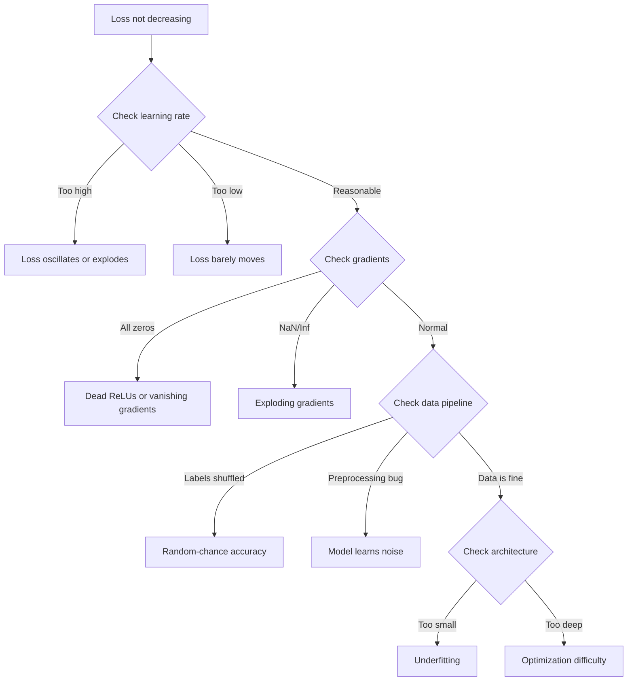
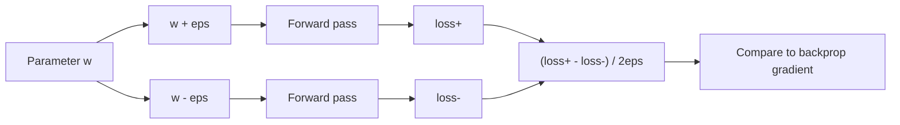
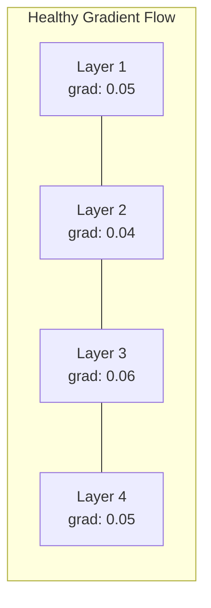
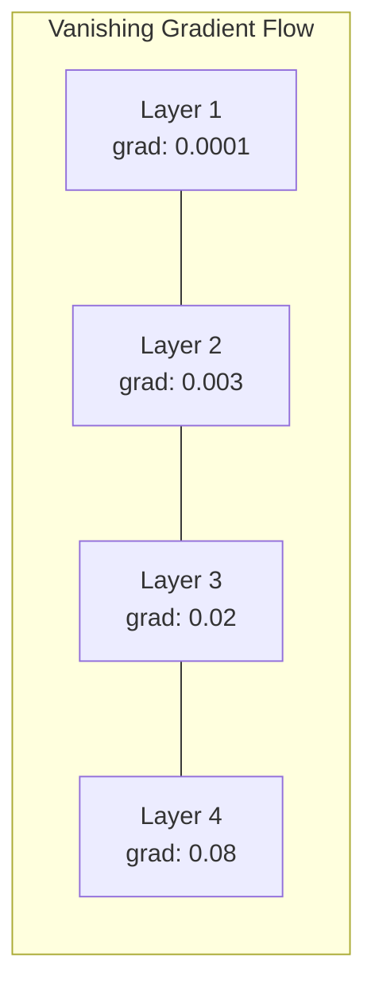
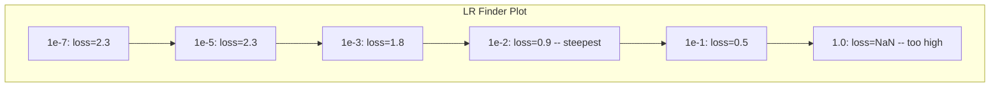

# 调试神经网络

> 你的网络编译通过了，跑起来了，输出了一个数字。这个数字是错的，但什么都没有崩溃。欢迎来到最难的一类调试——没有任何报错信息的调试。

**Type:** Build
**Languages:** Python, PyTorch
**Prerequisites:** Phase 03 Lessons 01-10 (especially backpropagation, loss functions, optimizers)
**Time:** ~90 minutes

## 学习目标

- 使用系统化的调试策略，诊断常见的神经网络故障（NaN 损失、损失曲线平坦、过拟合、震荡）
- 应用「过拟合单批次（overfit one batch）」技术，验证模型架构和训练循环是否正确
- 检查梯度大小、激活分布和权重范数，识别梯度消失/梯度爆炸问题
- 构建一份覆盖数据管线、模型架构、损失函数、优化器和学习率问题的调试清单

## 问题背景

传统软件出了问题会直接崩溃。空指针会抛出异常，类型不匹配在编译期就会失败，差一错误（off-by-one）会产生明显错误的输出。

神经网络可没有这种待遇。

一个有问题的神经网络会顺利跑完，打印出一个损失值，输出预测结果。损失可能在下降，预测可能看起来还算合理。但模型实际上在悄悄出错——学到了捷径、记住了噪声，或者收敛到一个毫无用处的局部极小值。Google 的研究人员估计，60-70% 的 ML 调试时间都花在了这种「沉默」的 bug 上：它们不产生任何错误，却在降低模型质量。

一个能用的模型和一个坏掉的模型之间，往往只差一行放错位置的代码：漏掉的 `zero_grad()`、转置错的维度、差了 10 倍的学习率。经典的 "Recipe for Training Neural Networks"（2019）开篇就写道："The most common neural net mistakes are bugs that don't crash."（最常见的神经网络错误，是那些不会崩溃的 bug。）

这节课教你如何找到这些 bug。

## 核心概念

### 调试心法

忘掉「打印一下然后祈祷」式的调试。神经网络调试需要系统化的方法，因为反馈循环很慢（一次训练运行要几分钟到几小时），而且症状模棱两可（损失不对劲可能意味着 20 种不同的问题）。

黄金法则：**从简单开始，每次只增加一点复杂度，并独立验证每一部分。**



### 症状一：损失不下降

这是最常见的抱怨。训练循环在跑，epoch 一个接一个过去，损失却纹丝不动或者剧烈震荡。

**学习率不对。** 太高：损失震荡或直接跳到 NaN。太低：损失下降得太慢，看起来像是平的。Adam 从 1e-3 开始，SGD 从 1e-1 或 1e-2 开始。在断定是其他问题之前，务必先试 3 个相差 10 倍的学习率（例如 1e-2、1e-3、1e-4）。

**死亡 ReLU（Dead ReLU）。** 如果一个 ReLU 神经元收到很大的负输入，它输出 0，梯度也是 0，从此再也不会被激活。死掉的神经元一多，网络就学不动了。检查方法：打印每个 ReLU 层之后激活值恰好为 0 的比例。如果超过 50% 是死的，换成 LeakyReLU 或降低学习率。

**梯度消失。** 在使用 sigmoid 或 tanh 激活的深层网络中，梯度在反向传播时呈指数级缩小。等传到第一层时，几乎就是 0 了。前面的层就此停止学习。解决方法：用 ReLU/GELU、加残差连接，或使用批归一化（batch normalization）。

**梯度爆炸。** 正好相反的问题——梯度呈指数级增长。常见于 RNN 和非常深的网络。损失会跳到 NaN。解决方法：梯度裁剪（`torch.nn.utils.clip_grad_norm_`）、降低学习率，或加归一化层。

### 症状二：损失在降，但模型很差

损失在下降，训练准确率达到 99%。但测试准确率只有 55%。或者模型在真实数据上输出一堆胡话。

**过拟合。** 模型在记忆训练数据，而不是在学习规律。训练损失和验证损失之间的差距随时间不断扩大。解决方法：更多数据、dropout、权重衰减（weight decay）、早停（early stopping）、数据增强。

**数据泄漏。** 测试数据泄漏进了训练集。准确率高得可疑。常见原因：先打乱再划分数据集、用全量数据集的统计量做预处理、不同划分之间存在重复样本。解决方法：先划分、后预处理，并检查重复样本。

**标签错误。** 大多数真实数据集中有 5-10% 的标签是错的（Northcutt et al., 2021 -- "Pervasive Label Errors in Test Sets"）。模型会把这些噪声学进去。解决方法：用置信学习（confident learning）找出并修正错标样本，或用损失截断（loss truncation）忽略高损失样本。

### 症状三：损失出现 NaN 或 Inf

损失值变成了 `nan` 或 `inf`。训练已死。

**学习率太高。** 梯度更新冲得太远，权重直接爆炸。解决方法：缩小 10 倍。

**log(0) 或 log(负数)。** 交叉熵损失要计算 `log(p)`。如果模型输出恰好是 0 或负的概率值，log 就会爆炸。解决方法：把预测值钳制到 `[eps, 1-eps]`，其中 `eps=1e-7`。

**除以零。** 批归一化要除以标准差。一个全是常数的 batch 标准差为 0。解决方法：在分母里加 epsilon（PyTorch 默认会加，但自己手写的实现可能不会）。

**数值溢出。** 很大的激活值喂进 `exp()` 会产生 Inf。Softmax 尤其容易中招。解决方法：先减去最大值再做指数运算（即 log-sum-exp 技巧）。

### 技术一：梯度检验

把解析梯度（来自反向传播）和数值梯度（来自有限差分）做对比。如果两者不一致，你的反向传播就有 bug。

参数 `w` 的数值梯度：

```
grad_numerical = (loss(w + eps) - loss(w - eps)) / (2 * eps)
```

一致性度量（相对差异）：

```
rel_diff = |grad_analytical - grad_numerical| / max(|grad_analytical|, |grad_numerical|, 1e-8)
```

如果 `rel_diff < 1e-5`：正确。如果 `rel_diff > 1e-3`：几乎可以肯定有 bug。



### 技术二：激活值统计

在训练过程中监控每一层之后激活值的均值和标准差。健康的网络会让激活值保持均值接近 0、标准差接近 1（归一化之后），或者至少是有界的。

| 健康状态 | 均值 | 标准差 | 诊断 |
|-----------------|------|-----|-----------|
| 健康 | ~0 | ~1 | 网络在正常学习 |
| 饱和 | >>0 或 <<0 | ~0 | 激活值卡死在极端值 |
| 死亡 | 0 | 0 | 神经元已死（全为零） |
| 爆炸 | >>10 | >>10 | 激活值无界增长 |

### 技术三：梯度流可视化

绘制每一层的平均梯度大小。在健康的网络里，各层的梯度大小应该大致相近。如果靠前的层梯度比靠后的层小 1000 倍，那就是梯度消失。





### 技术四：过拟合单批次测试

深度学习中最重要的一项调试技术。

取一个小批次（8-32 个样本），在上面训练 100 次以上的迭代。损失应该降到接近零，训练准确率应该达到 100%。如果做不到，说明你的模型或训练循环存在根本性的 bug——不要急着进入完整训练。

这个测试能抓住：
- 坏掉的损失函数
- 坏掉的反向传播
- 表达能力不足以拟合数据的架构
- 优化器没有连接到模型参数
- 数据和标签错位

跑一次只要 30 秒，却能省下调试完整训练运行的几个小时。

### 技术五：学习率搜索器

Leslie Smith（2017）提出：在一个 epoch 内把学习率从极小（1e-7）扫到极大（10），同时记录损失。把损失对学习率作图。最优学习率大约比损失下降最快的那个点小 10 倍。



这个例子中的最佳学习率：约 1e-3（比最陡点小一个数量级）。

### PyTorch 常见 bug

下面这些 bug 在 PyTorch 社区里浪费的总工时是最多的：

| Bug | 症状 | 解决方法 |
|-----|---------|-----|
| 忘记 `optimizer.zero_grad()` | 梯度跨批次累积，损失震荡 | 在 `loss.backward()` 之前加 `optimizer.zero_grad()` |
| 测试时忘记 `model.eval()` | Dropout 和批归一化行为不同，每次运行的测试准确率不一样 | 加上 `model.eval()` 和 `torch.no_grad()` |
| 张量形状错误 | 静默广播产生错误结果，且没有报错 | 调试时在每个操作之后打印形状 |
| CPU/GPU 不匹配 | `RuntimeError: expected CUDA tensor` | 对模型**和**数据都使用 `.to(device)` |
| 没有分离张量 | 计算图无限增长，OOM | 使用 `.detach()` 或 `with torch.no_grad()` |
| 原地操作破坏 autograd | `RuntimeError: modified by in-place operation` | 把 `x += 1` 换成 `x = x + 1` |
| 数据没有归一化 | 损失卡在随机猜测水平 | 把输入归一化到 mean=0、std=1 |
| 标签 dtype 错误 | 交叉熵期望 `Long`，却得到 `Float` | 转换标签：`labels.long()` |

### 调试速查总表

| 症状 | 可能的原因 | 首先尝试 |
|---------|-------------|-------------------|
| 损失卡在 -log(1/num_classes) | 模型在预测均匀分布 | 检查数据管线，确认标签与输入对应 |
| 训练几步后损失变 NaN | 学习率太高 | 把学习率缩小 10 倍 |
| 损失一开始就是 NaN | log(0) 或除以零 | 在 log/除法运算里加 epsilon |
| 损失剧烈震荡 | 学习率太高或 batch size 太小 | 降低学习率，增大 batch size |
| 损失先降后停滞 | 学习率对微调阶段来说太高 | 加学习率调度（余弦或阶梯衰减） |
| 训练准确率高、测试准确率低 | 过拟合 | 加 dropout、权重衰减、更多数据 |
| 训练准确率 = 测试准确率 = 随机水平 | 模型什么都没学到 | 跑过拟合单批次测试 |
| 训练准确率 = 测试准确率但都很低 | 欠拟合 | 更大的模型、更多层、更多特征 |
| 梯度全为零 | 死亡 ReLU 或计算图被分离 | 换成 LeakyReLU，检查 `.requires_grad` |
| 训练时内存不足 | batch 太大或计算图未释放 | 减小 batch size，评估时用 `torch.no_grad()` |

```figure
learning-curves
```

## 从零实现

我们要做一个诊断工具包，用来监控激活值、梯度和损失曲线。你会故意弄坏一个网络，然后用这个工具包诊断出每一个问题。

### 第 1 步：NetworkDebugger 类

通过钩子（hook）挂载到 PyTorch 模型上，逐层记录激活值和梯度的统计信息。

```python
import torch
import torch.nn as nn
import math


class NetworkDebugger:
    def __init__(self, model):
        self.model = model
        self.activation_stats = {}
        self.gradient_stats = {}
        self.loss_history = []
        self.lr_losses = []
        self.hooks = []
        self._register_hooks()

    def _register_hooks(self):
        for name, module in self.model.named_modules():
            if isinstance(module, (nn.Linear, nn.Conv2d, nn.ReLU, nn.LeakyReLU)):
                hook = module.register_forward_hook(self._make_activation_hook(name))
                self.hooks.append(hook)
                hook = module.register_full_backward_hook(self._make_gradient_hook(name))
                self.hooks.append(hook)

    def _make_activation_hook(self, name):
        def hook(module, input, output):
            with torch.no_grad():
                out = output.detach().float()
                self.activation_stats[name] = {
                    "mean": out.mean().item(),
                    "std": out.std().item(),
                    "fraction_zero": (out == 0).float().mean().item(),
                    "min": out.min().item(),
                    "max": out.max().item(),
                }
        return hook

    def _make_gradient_hook(self, name):
        def hook(module, grad_input, grad_output):
            if grad_output[0] is not None:
                with torch.no_grad():
                    grad = grad_output[0].detach().float()
                    self.gradient_stats[name] = {
                        "mean": grad.mean().item(),
                        "std": grad.std().item(),
                        "abs_mean": grad.abs().mean().item(),
                        "max": grad.abs().max().item(),
                    }
        return hook

    def record_loss(self, loss_value):
        self.loss_history.append(loss_value)

    def check_loss_health(self):
        if len(self.loss_history) < 2:
            return "NOT_ENOUGH_DATA"
        recent = self.loss_history[-10:]
        if any(math.isnan(v) or math.isinf(v) for v in recent):
            return "NAN_OR_INF"
        if len(self.loss_history) >= 20:
            first_half = sum(self.loss_history[:10]) / 10
            second_half = sum(self.loss_history[-10:]) / 10
            if second_half >= first_half * 0.99:
                return "NOT_DECREASING"
        if len(recent) >= 5:
            diffs = [recent[i+1] - recent[i] for i in range(len(recent)-1)]
            if max(diffs) - min(diffs) > 2 * abs(sum(diffs) / len(diffs)):
                return "OSCILLATING"
        return "HEALTHY"

    def check_activations(self):
        issues = []
        for name, stats in self.activation_stats.items():
            if stats["fraction_zero"] > 0.5:
                issues.append(f"DEAD_NEURONS: {name} has {stats['fraction_zero']:.0%} zero activations")
            if abs(stats["mean"]) > 10:
                issues.append(f"EXPLODING_ACTIVATIONS: {name} mean={stats['mean']:.2f}")
            if stats["std"] < 1e-6:
                issues.append(f"COLLAPSED_ACTIVATIONS: {name} std={stats['std']:.2e}")
        return issues if issues else ["HEALTHY"]

    def check_gradients(self):
        issues = []
        grad_magnitudes = []
        for name, stats in self.gradient_stats.items():
            grad_magnitudes.append((name, stats["abs_mean"]))
            if stats["abs_mean"] < 1e-7:
                issues.append(f"VANISHING_GRADIENT: {name} abs_mean={stats['abs_mean']:.2e}")
            if stats["abs_mean"] > 100:
                issues.append(f"EXPLODING_GRADIENT: {name} abs_mean={stats['abs_mean']:.2e}")
        if len(grad_magnitudes) >= 2:
            first_mag = grad_magnitudes[0][1]
            last_mag = grad_magnitudes[-1][1]
            if last_mag > 0 and first_mag / last_mag > 100:
                issues.append(f"GRADIENT_RATIO: first/last = {first_mag/last_mag:.0f}x (vanishing)")
        return issues if issues else ["HEALTHY"]

    def print_report(self):
        print("\n=== NETWORK DEBUGGER REPORT ===")
        print(f"\nLoss health: {self.check_loss_health()}")
        if self.loss_history:
            print(f"  Last 5 losses: {[f'{v:.4f}' for v in self.loss_history[-5:]]}")
        print("\nActivation diagnostics:")
        for item in self.check_activations():
            print(f"  {item}")
        print("\nGradient diagnostics:")
        for item in self.check_gradients():
            print(f"  {item}")
        print("\nPer-layer activation stats:")
        for name, stats in self.activation_stats.items():
            print(f"  {name}: mean={stats['mean']:.4f} std={stats['std']:.4f} zero={stats['fraction_zero']:.1%}")
        print("\nPer-layer gradient stats:")
        for name, stats in self.gradient_stats.items():
            print(f"  {name}: abs_mean={stats['abs_mean']:.2e} max={stats['max']:.2e}")

    def remove_hooks(self):
        for hook in self.hooks:
            hook.remove()
        self.hooks.clear()
```

### 第 2 步：过拟合单批次测试

```python
def overfit_one_batch(model, x_batch, y_batch, criterion, lr=0.01, steps=200):
    optimizer = torch.optim.Adam(model.parameters(), lr=lr)
    model.train()
    print("\n=== OVERFIT ONE BATCH TEST ===")
    print(f"Batch size: {x_batch.shape[0]}, Steps: {steps}")

    for step in range(steps):
        optimizer.zero_grad()
        output = model(x_batch)
        loss = criterion(output, y_batch)
        loss.backward()
        optimizer.step()

        if step % 50 == 0 or step == steps - 1:
            with torch.no_grad():
                preds = (output > 0).float() if output.shape[-1] == 1 else output.argmax(dim=1)
                targets = y_batch if y_batch.dim() == 1 else y_batch.squeeze()
                acc = (preds.squeeze() == targets).float().mean().item()
            print(f"  Step {step:3d} | Loss: {loss.item():.6f} | Accuracy: {acc:.1%}")

    final_loss = loss.item()
    if final_loss > 0.1:
        print(f"\n  FAIL: Loss did not converge ({final_loss:.4f}). Model or training loop is broken.")
        return False
    print(f"\n  PASS: Loss converged to {final_loss:.6f}")
    return True
```

### 第 3 步：学习率搜索器

```python
def find_learning_rate(model, x_data, y_data, criterion, start_lr=1e-7, end_lr=10, steps=100):
    import copy
    original_state = copy.deepcopy(model.state_dict())
    optimizer = torch.optim.SGD(model.parameters(), lr=start_lr)
    lr_mult = (end_lr / start_lr) ** (1 / steps)

    model.train()
    results = []
    best_loss = float("inf")
    current_lr = start_lr

    print("\n=== LEARNING RATE FINDER ===")

    for step in range(steps):
        optimizer.zero_grad()
        output = model(x_data)
        loss = criterion(output, y_data)

        if math.isnan(loss.item()) or loss.item() > best_loss * 10:
            break

        best_loss = min(best_loss, loss.item())
        results.append((current_lr, loss.item()))

        loss.backward()
        optimizer.step()

        current_lr *= lr_mult
        for param_group in optimizer.param_groups:
            param_group["lr"] = current_lr

    model.load_state_dict(original_state)

    if len(results) < 10:
        print("  Could not complete LR sweep -- loss diverged too quickly")
        return results

    min_loss_idx = min(range(len(results)), key=lambda i: results[i][1])
    suggested_lr = results[max(0, min_loss_idx - 10)][0]

    print(f"  Swept {len(results)} steps from {start_lr:.0e} to {results[-1][0]:.0e}")
    print(f"  Minimum loss {results[min_loss_idx][1]:.4f} at lr={results[min_loss_idx][0]:.2e}")
    print(f"  Suggested learning rate: {suggested_lr:.2e}")

    return results
```

### 第 4 步：梯度检验器

```python
def _flat_to_multi_index(flat_idx, shape):
    multi_idx = []
    remaining = flat_idx
    for dim in reversed(shape):
        multi_idx.insert(0, remaining % dim)
        remaining //= dim
    return tuple(multi_idx)


def gradient_check(model, x, y, criterion, eps=1e-4):
    model.train()
    x_double = x.double()
    y_double = y.double()
    model_double = model.double()

    print("\n=== GRADIENT CHECK ===")
    overall_max_diff = 0
    checked = 0

    for name, param in model_double.named_parameters():
        if not param.requires_grad:
            continue

        layer_max_diff = 0

        model_double.zero_grad()
        output = model_double(x_double)
        loss = criterion(output, y_double)
        loss.backward()
        analytical_grad = param.grad.clone()

        num_checks = min(5, param.numel())
        for i in range(num_checks):
            idx = _flat_to_multi_index(i, param.shape)
            original = param.data[idx].item()

            param.data[idx] = original + eps
            with torch.no_grad():
                loss_plus = criterion(model_double(x_double), y_double).item()

            param.data[idx] = original - eps
            with torch.no_grad():
                loss_minus = criterion(model_double(x_double), y_double).item()

            param.data[idx] = original

            numerical = (loss_plus - loss_minus) / (2 * eps)
            analytical = analytical_grad[idx].item()

            denom = max(abs(numerical), abs(analytical), 1e-8)
            rel_diff = abs(numerical - analytical) / denom

            layer_max_diff = max(layer_max_diff, rel_diff)
            checked += 1

        overall_max_diff = max(overall_max_diff, layer_max_diff)
        status = "OK" if layer_max_diff < 1e-5 else "MISMATCH"
        print(f"  {name}: max_rel_diff={layer_max_diff:.2e} [{status}]")

    model.float()

    print(f"\n  Checked {checked} parameters")
    if overall_max_diff < 1e-5:
        print("  PASS: Gradients match (rel_diff < 1e-5)")
    elif overall_max_diff < 1e-3:
        print("  WARN: Small differences (1e-5 < rel_diff < 1e-3)")
    else:
        print("  FAIL: Gradient mismatch detected (rel_diff > 1e-3)")
    return overall_max_diff
```

### 第 5 步：故意弄坏的网络

现在把工具包用到几个坏掉的网络上，逐一诊断。

```python
def demo_broken_networks():
    torch.manual_seed(42)
    x = torch.randn(64, 10)
    y = (x[:, 0] > 0).long()

    print("\n" + "=" * 60)
    print("BUG 1: Learning rate too high (lr=10)")
    print("=" * 60)
    model1 = nn.Sequential(nn.Linear(10, 32), nn.ReLU(), nn.Linear(32, 2))
    debugger1 = NetworkDebugger(model1)
    optimizer1 = torch.optim.SGD(model1.parameters(), lr=10.0)
    criterion = nn.CrossEntropyLoss()
    for step in range(20):
        optimizer1.zero_grad()
        out = model1(x)
        loss = criterion(out, y)
        debugger1.record_loss(loss.item())
        loss.backward()
        optimizer1.step()
    debugger1.print_report()
    debugger1.remove_hooks()

    print("\n" + "=" * 60)
    print("BUG 2: Dead ReLUs from bad initialization")
    print("=" * 60)
    model2 = nn.Sequential(nn.Linear(10, 32), nn.ReLU(), nn.Linear(32, 32), nn.ReLU(), nn.Linear(32, 2))
    with torch.no_grad():
        for m in model2.modules():
            if isinstance(m, nn.Linear):
                m.weight.fill_(-1.0)
                m.bias.fill_(-5.0)
    debugger2 = NetworkDebugger(model2)
    optimizer2 = torch.optim.Adam(model2.parameters(), lr=1e-3)
    for step in range(50):
        optimizer2.zero_grad()
        out = model2(x)
        loss = criterion(out, y)
        debugger2.record_loss(loss.item())
        loss.backward()
        optimizer2.step()
    debugger2.print_report()
    debugger2.remove_hooks()

    print("\n" + "=" * 60)
    print("BUG 3: Missing zero_grad (gradients accumulate)")
    print("=" * 60)
    model3 = nn.Sequential(nn.Linear(10, 32), nn.ReLU(), nn.Linear(32, 2))
    debugger3 = NetworkDebugger(model3)
    optimizer3 = torch.optim.SGD(model3.parameters(), lr=0.01)
    for step in range(50):
        out = model3(x)
        loss = criterion(out, y)
        debugger3.record_loss(loss.item())
        loss.backward()
        optimizer3.step()
    debugger3.print_report()
    debugger3.remove_hooks()

    print("\n" + "=" * 60)
    print("HEALTHY NETWORK: Correct setup for comparison")
    print("=" * 60)
    model_good = nn.Sequential(nn.Linear(10, 32), nn.ReLU(), nn.Linear(32, 2))
    debugger_good = NetworkDebugger(model_good)
    optimizer_good = torch.optim.Adam(model_good.parameters(), lr=1e-3)
    for step in range(50):
        optimizer_good.zero_grad()
        out = model_good(x)
        loss = criterion(out, y)
        debugger_good.record_loss(loss.item())
        loss.backward()
        optimizer_good.step()
    debugger_good.print_report()
    debugger_good.remove_hooks()

    print("\n" + "=" * 60)
    print("OVERFIT-ONE-BATCH TEST (healthy model)")
    print("=" * 60)
    model_test = nn.Sequential(nn.Linear(10, 32), nn.ReLU(), nn.Linear(32, 2))
    overfit_one_batch(model_test, x[:8], y[:8], criterion)

    print("\n" + "=" * 60)
    print("LEARNING RATE FINDER")
    print("=" * 60)
    model_lr = nn.Sequential(nn.Linear(10, 32), nn.ReLU(), nn.Linear(32, 2))
    find_learning_rate(model_lr, x, y, criterion)

    print("\n" + "=" * 60)
    print("GRADIENT CHECK")
    print("=" * 60)
    model_grad = nn.Sequential(nn.Linear(10, 8), nn.ReLU(), nn.Linear(8, 2))
    gradient_check(model_grad, x[:4], y[:4], criterion)
```

## 生产实践

### PyTorch 内置工具

```python
import torch
import torch.nn as nn

model = nn.Sequential(
    nn.Linear(768, 256),
    nn.ReLU(),
    nn.Linear(256, 10),
)

with torch.autograd.detect_anomaly():
    output = model(input_tensor)
    loss = criterion(output, target)
    loss.backward()

for name, param in model.named_parameters():
    if param.grad is not None:
        print(f"{name}: grad_mean={param.grad.abs().mean():.2e}")
```

### Weights & Biases 集成

```python
import wandb

wandb.init(project="debug-training")

for epoch in range(100):
    loss = train_one_epoch()
    wandb.log({
        "loss": loss,
        "lr": optimizer.param_groups[0]["lr"],
        "grad_norm": torch.nn.utils.clip_grad_norm_(model.parameters(), float("inf")),
    })

    for name, param in model.named_parameters():
        if param.grad is not None:
            wandb.log({f"grad/{name}": wandb.Histogram(param.grad.cpu().numpy())})
```

### TensorBoard

```python
from torch.utils.tensorboard import SummaryWriter

writer = SummaryWriter("runs/debug_experiment")

for epoch in range(100):
    loss = train_one_epoch()
    writer.add_scalar("Loss/train", loss, epoch)

    for name, param in model.named_parameters():
        writer.add_histogram(f"weights/{name}", param, epoch)
        if param.grad is not None:
            writer.add_histogram(f"gradients/{name}", param.grad, epoch)
```

### 调试清单（开始完整训练之前）

1. 跑过拟合单批次测试。失败就停下。
2. 打印模型摘要——确认参数量合理。
3. 用随机数据跑一次前向传播——检查输出形状。
4. 训练 5 个 epoch——确认损失在下降。
5. 检查激活值统计——没有死亡的层，没有爆炸。
6. 检查梯度流——没有消失，没有爆炸。
7. 验证数据管线——随机打印 5 个样本及其标签。

## 交付产物

这节课会产出：
- `outputs/prompt-nn-debugger.md` —— 一个用于诊断神经网络训练故障的提示词
- `outputs/skill-debug-checklist.md` —— 一份决策树形式的训练问题调试清单

调试相关的关键部署模式：
- 给生产环境的训练脚本加上监控钩子
- 每隔 N 步把激活值和梯度统计记录到 W&B 或 TensorBoard
- 实现自动告警：NaN 损失、死亡神经元（零值占比 >80%）、梯度爆炸
- 每次更换架构或数据管线时，都要跑一次过拟合单批次测试

## 练习

1. **添加梯度爆炸检测器。** 修改 `NetworkDebugger`，使其能检测梯度超过阈值的情况，并自动给出梯度裁剪值的建议。在一个没有任何归一化的 20 层网络上测试它。

2. **构建死亡神经元复活器。** 编写一个函数，找出死亡的 ReLU 神经元（输出永远为 0），并用 Kaiming 初始化重置它们的输入权重。证明它能恢复一个 70% 以上神经元已死的网络。

3. **实现带绘图功能的学习率搜索器。** 扩展 `find_learning_rate`，把结果保存为 CSV，并另写一个脚本读取该 CSV，用 matplotlib 展示学习率-损失曲线。找出 ResNet-18 在 CIFAR-10 上的最优学习率。

4. **创建数据管线验证器。** 编写一个函数，检查以下问题：训练/测试划分之间的重复样本、标签分布失衡（超过 10:1 的比例）、输入归一化（均值接近 0、标准差接近 1），以及数据中的 NaN/Inf 值。在一个被故意污染的数据集上运行它。

5. **调试一次真实故障。** 拿出第 10 课的迷你框架，引入一个隐蔽的 bug（例如在反向传播中转置权重矩阵），然后用梯度检验精确定位哪个参数的梯度不正确。把调试过程记录下来。

## 关键术语

| 术语 | 大家常说的 | 实际含义 |
|------|----------------|----------------------|
| 沉默 bug（silent bug） | "能跑，但结果很差" | 不产生任何报错却降低模型质量的 bug——是 ML 中最主要的故障模式 |
| 死亡 ReLU（dead ReLU） | "神经元死了" | 输入永远为负的 ReLU 神经元，它永久输出 0、收到的梯度也是 0 |
| 梯度消失 | "前面的层学不动了" | 梯度逐层呈指数级缩小，使靠前层的权重实际上被冻结 |
| 梯度爆炸 | "损失变成 NaN 了" | 梯度逐层呈指数级增长，导致权重更新大到溢出 |
| 梯度检验（gradient checking） | "验证反向传播是否正确" | 把反向传播得到的解析梯度与有限差分得到的数值梯度做对比 |
| 过拟合单批次（overfit-one-batch） | "最重要的调试测试" | 在单个小批次上训练，验证模型「有能力」学习——如果连这都做不到，说明存在根本性问题 |
| 学习率搜索器（LR finder） | "扫一遍找到合适的学习率" | 在一个 epoch 内指数级提高学习率，选取损失发散前那一刻的学习率 |
| 数据泄漏（data leakage） | "测试数据漏进训练集了" | 测试集的信息污染了训练过程，造成虚高的准确率 |
| 激活值统计 | "监控层的健康状况" | 跟踪每一层输出的均值、标准差和零值占比，以发现死亡、饱和或爆炸的神经元 |
| 梯度裁剪（gradient clipping） | "把梯度大小限住" | 当梯度范数超过阈值时按比例缩小梯度，防止梯度爆炸式的更新 |

## 延伸阅读

- Smith, "Cyclical Learning Rates for Training Neural Networks" (2017) —— 提出学习率范围测试（LR finder）的论文
- Northcutt et al., "Pervasive Label Errors in Test Sets Destabilize Machine Learning Benchmarks" (2021) —— 证明 ImageNet、CIFAR-10 等主流基准中有 3-6% 的标签是错的
- Zhang et al., "Understanding Deep Learning Requires Rethinking Generalization" (2017) —— 证明神经网络可以记住随机标签的论文，这也是过拟合单批次测试有效的原因
- PyTorch 关于 `torch.autograd.detect_anomaly` 和 `torch.autograd.set_detect_anomaly` 的文档，用于内置的 NaN/Inf 检测
