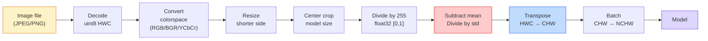
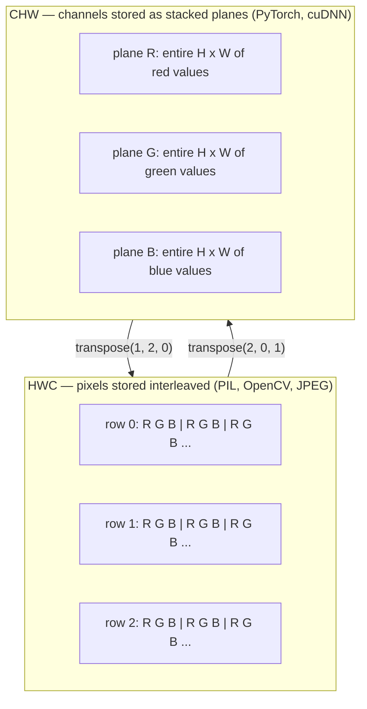

# 图像基础 —— 像素、通道与色彩空间

> 图像就是一个由光照采样构成的张量。你今后用到的每一个视觉模型，都建立在这一个事实之上。

**Type:** Build
**Languages:** Python
**Prerequisites:** Phase 1 Lesson 12 (Tensor Operations), Phase 3 Lesson 11 (Intro to PyTorch)
**Time:** ~45 minutes

## 学习目标

- 解释连续的真实场景如何被离散化为像素，以及采样和量化的选择为何决定了所有下游模型的性能上限
- 把图像作为 NumPy 数组来读取、切片和检查，并在 HWC 与 CHW 两种布局之间自如切换
- 在 RGB、灰度、HSV、YCbCr 之间互相转换，并说明每种色彩空间存在的理由
- 按 torchvision 的要求精确完成像素级预处理（归一化、标准化、缩放、通道前置）

## 问题背景

你将来读到的每一篇论文、下载的每一份预训练权重、调用的每一个视觉 API，都默认输入采用某种特定的编码方式。模型需要 `float32` 而你传入 `uint8` 图像——它照样能跑，却会悄无声息地输出垃圾结果。把 BGR 喂给在 RGB 上训练的网络，准确率会暴跌十个百分点。模型期望 channels-first，你却给了 channels-last 的输入，第一层卷积就会把高度当成特征通道来处理。这些错误没有一个会抛出异常。它们只会毁掉你的指标，让你花一周时间去追查一个其实出在文件加载方式上的 bug。

只要你清楚卷积在什么东西上滑动，卷积本身并不复杂。难点在于「一张图像」对相机、JPEG 解码器、PIL、OpenCV、torchvision 和 CUDA 核函数来说，含义各不相同。每套技术栈都有自己的轴顺序、字节范围和通道约定。分不清这些约定的视觉工程师，交付的就是坏掉的流水线。

这节课把地基打牢，让本阶段后面的内容可以在此之上展开。学完之后你会知道：什么是像素，为什么每个像素是三个数而不是一个，「用 ImageNet 统计量做归一化」到底在做什么，以及如何在本阶段其余课程都会默认使用的那两三种布局之间转换。

## 核心概念

### 一图看懂完整预处理流水线

每一套生产级视觉系统都是同一串可逆变换。任何一步出错，模型看到的输入就和训练时不一样了。



图中红、蓝两个方框是 80% 静默失败的藏身之处：漏掉标准化，以及布局搞错。

### 像素是一次采样，不是一个方块

相机传感器统计落在微型探测器网格上的光子数。每个探测器在几分之一秒内累积光照，输出一个与命中光子数成正比的电压。传感器再把这个电压离散化成一个整数。一个探测器对应一个像素。

```
Continuous scene                 Sensor grid                     Digital image
(infinite detail)                (H x W detectors)               (H x W integers)

    ~~~~~                        +--+--+--+--+--+                 210 198 180 155 120
   ~   ~   ~                     |  |  |  |  |  |                 205 195 178 152 118
  ~ light ~      ---->           +--+--+--+--+--+     ---->       200 190 175 150 115
   ~~~~~                         |  |  |  |  |  |                 195 185 170 148 112
                                 +--+--+--+--+--+                 188 180 165 145 108
```

这一步包含两个决定，它们框定了所有下游环节的上限：

- **空间采样（spatial sampling）**决定场景中每一度视角分配多少探测器。太少，边缘会出现锯齿（混叠，aliasing）；太多，存储和计算开销会爆炸。
- **强度量化（intensity quantization）**决定电压被划分得多细。8 位提供 256 级，是显示场景的标准；10、12、16 位能呈现更平滑的渐变，对医学影像、HDR 和原始传感器流水线很重要。

像素不是一个有面积的彩色方块，而是一次单独的测量。当你缩放或旋转图像时，你是在对这张测量网格重新采样。

### 为什么是三个通道

一个探测器统计整个可见光谱的光子数——这就是灰度。要获得彩色，传感器会在网格上覆盖一层红、绿、蓝滤镜的马赛克。经过去马赛克（demosaicing）后，每个空间位置都有三个整数：附近红色滤镜探测器、绿色滤镜探测器和蓝色滤镜探测器的响应。这三个整数就是一个像素的 RGB 三元组。

```
One pixel in memory:

    (R, G, B) = (210, 140, 30)   <- reddish-orange

An H x W RGB image:

    shape (H, W, 3)     stored as   H rows of W pixels of 3 values
                                    each in [0, 255] for uint8
```

三这个数字并没有什么魔力。深度相机会增加一个 Z 通道，卫星会增加红外和紫外波段，医学扫描常常只有一个通道（X 光、CT）或很多通道（高光谱）。通道数就是最后一个轴；卷积层会学习如何在通道之间混合。

### 两种布局约定：HWC 与 CHW

同一个张量，两种排列顺序。每个库都会选定其中一种。

```
HWC (height, width, channels)           CHW (channels, height, width)

   W ->                                    H ->
  +-----+-----+-----+                     +-----+-----+
H |R G B|R G B|R G B|                   C |R R R R R R|
| +-----+-----+-----+                   | +-----+-----+
v |R G B|R G B|R G B|                   v |G G G G G G|
  +-----+-----+-----+                     +-----+-----+
                                          |B B B B B B|
                                          +-----+-----+

   PIL, OpenCV, matplotlib,              PyTorch, most deep learning
   almost every image file on disk       frameworks, cuDNN kernels
```

CHW 之所以存在，是因为卷积核在 H 和 W 上滑动。把通道轴放在最前面，意味着每个卷积核在每个通道上看到的都是一块连续的二维平面，这能干净地向量化。磁盘格式保留 HWC，则是因为它和扫描线从传感器输出的方式一致。

下面这行转换代码你会敲上一千遍：

```
img_chw = img_hwc.transpose(2, 0, 1)      # NumPy
img_chw = img_hwc.permute(2, 0, 1)        # PyTorch tensor
```

内存布局的可视化：



### 字节范围与 dtype

主流约定有三种：

| 约定 | dtype | 取值范围 | 出现场景 |
|------------|-------|-------|------------------|
| 原始（Raw） | `uint8` | [0, 255] | 磁盘上的文件、PIL、OpenCV 的输出 |
| 归一化（Normalized） | `float32` | [0.0, 1.0] | 执行 `img.astype('float32') / 255` 之后 |
| 标准化（Standardized） | `float32` | 大致 [-2, +2] | 减去均值再除以标准差之后 |

卷积网络是在标准化的输入上训练的。ImageNet 统计量 `mean=[0.485, 0.456, 0.406]`、`std=[0.229, 0.224, 0.225]`，是三个通道在整个 ImageNet 训练集上的算术均值和标准差，基于归一化到 [0, 1] 的像素计算得到。把原始 `uint8` 喂给期望标准化浮点输入的模型，是应用视觉领域最常见的一种静默失败。

### 色彩空间及其存在的理由

RGB 是采集时的格式，但对模型来说它并不总是最有用的表示。

```
 RGB               HSV                       YCbCr / YUV

 R red             H hue (angle 0-360)       Y luminance (brightness)
 G green           S saturation (0-1)        Cb chroma blue-yellow
 B blue            V value/brightness (0-1)  Cr chroma red-green

 Linear to         Separates color from      Separates brightness from
 sensor output     brightness. Useful for    color. JPEG and most video
                   color thresholding, UI    codecs compress the chroma
                   sliders, simple filters   channels harder because the
                                             human eye is less sensitive
                                             to chroma detail than to Y.
```

大多数现代 CNN 直接吃 RGB。你会在以下场合遇到其他色彩空间：

- **HSV** —— 经典 CV 代码、基于颜色的分割、白平衡。
- **YCbCr** —— 解读 JPEG 内部机制、视频流水线、只在 Y 通道上工作的超分辨率模型。
- **灰度** —— OCR、文档模型，以及任何颜色是干扰变量而非信号的场景。

从 RGB 转灰度用的是加权和而不是平均，因为人眼对绿色比对红色或蓝色更敏感：

```
Y = 0.299 R + 0.587 G + 0.114 B       (ITU-R BT.601, the classic weights)
```

### 宽高比、缩放与插值

每个模型都有固定的输入尺寸（多数 ImageNet 分类器是 224x224，现代检测器是 384x384 或 512x512），而你的图像很少恰好匹配。真正重要的三种缩放策略：

- **先缩放短边，再中心裁剪** —— ImageNet 的标准做法。保留宽高比，丢掉边缘的一条像素。
- **缩放并填充** —— 保留宽高比和所有像素，代价是加上黑边。检测和 OCR 的标准做法。
- **直接缩放到目标尺寸** —— 拉伸图像。代价低，几何会变形，对许多分类任务来说没问题。

插值方法决定了当新网格与旧网格不对齐时，中间像素如何计算：

```
Nearest neighbour     fastest, blocky, only choice for masks/labels
Bilinear              fast, smooth, default for most image resizing
Bicubic               slower, sharper on upscaling
Lanczos               slowest, best quality, used for final display
```

经验法则：训练用双线性（bilinear），给人看的素材用双三次（bicubic）或 lanczos，任何包含整数类别 ID 的数据用最近邻（nearest）。

```figure
conv-output-size
```

## 从零实现

### 第 1 步：加载图像并检查形状

用 Pillow 加载任意 JPEG 或 PNG，转成 NumPy，打印结果。为了得到一个可离线运行的确定性示例，我们直接合成一张。

```python
import numpy as np
from PIL import Image

def synthetic_rgb(h=128, w=192, seed=0):
    rng = np.random.default_rng(seed)
    yy, xx = np.meshgrid(np.linspace(0, 1, h), np.linspace(0, 1, w), indexing="ij")
    r = (np.sin(xx * 6) * 0.5 + 0.5) * 255
    g = yy * 255
    b = (1 - yy) * xx * 255
    rgb = np.stack([r, g, b], axis=-1) + rng.normal(0, 6, (h, w, 3))
    return np.clip(rgb, 0, 255).astype(np.uint8)

arr = synthetic_rgb()
# Or load from disk:
# arr = np.asarray(Image.open("your_image.jpg").convert("RGB"))

print(f"type:   {type(arr).__name__}")
print(f"dtype:  {arr.dtype}")
print(f"shape:  {arr.shape}     # (H, W, C)")
print(f"min:    {arr.min()}")
print(f"max:    {arr.max()}")
print(f"pixel at (0, 0): {arr[0, 0]}")
```

预期输出：`shape: (H, W, 3)`、`dtype: uint8`、范围 `[0, 255]`。无论这些字节来自相机、JPEG 解码器还是合成生成器，这都是标准的磁盘表示。

### 第 2 步：拆分通道并调整布局

把 R、G、B 分别取出来，再把 HWC 转成 PyTorch 用的 CHW。

```python
R = arr[:, :, 0]
G = arr[:, :, 1]
B = arr[:, :, 2]
print(f"R shape: {R.shape}, mean: {R.mean():.1f}")
print(f"G shape: {G.shape}, mean: {G.mean():.1f}")
print(f"B shape: {B.shape}, mean: {B.mean():.1f}")

arr_chw = arr.transpose(2, 0, 1)
print(f"\nHWC shape: {arr.shape}")
print(f"CHW shape: {arr_chw.shape}")
```

得到三张灰度平面，每个通道一张。CHW 只是重排了轴的顺序；只要内存布局允许，严格来说并不需要复制数据。

### 第 3 步：灰度与 HSV 转换

先做加权和灰度转换，再手写一个 RGB 到 HSV。

```python
def rgb_to_grayscale(rgb):
    weights = np.array([0.299, 0.587, 0.114], dtype=np.float32)
    return (rgb.astype(np.float32) @ weights).astype(np.uint8)

def rgb_to_hsv(rgb):
    rgb_f = rgb.astype(np.float32) / 255.0
    r, g, b = rgb_f[..., 0], rgb_f[..., 1], rgb_f[..., 2]
    cmax = np.max(rgb_f, axis=-1)
    cmin = np.min(rgb_f, axis=-1)
    delta = cmax - cmin

    h = np.zeros_like(cmax)
    mask = delta > 0
    rmax = mask & (cmax == r)
    gmax = mask & (cmax == g)
    bmax = mask & (cmax == b)
    h[rmax] = ((g[rmax] - b[rmax]) / delta[rmax]) % 6
    h[gmax] = ((b[gmax] - r[gmax]) / delta[gmax]) + 2
    h[bmax] = ((r[bmax] - g[bmax]) / delta[bmax]) + 4
    h = h * 60.0

    s = np.where(cmax > 0, delta / cmax, 0)
    v = cmax
    return np.stack([h, s, v], axis=-1)

gray = rgb_to_grayscale(arr)
hsv = rgb_to_hsv(arr)
print(f"gray shape: {gray.shape}, range: [{gray.min()}, {gray.max()}]")
print(f"hsv   shape: {hsv.shape}")
print(f"hue range: [{hsv[..., 0].min():.1f}, {hsv[..., 0].max():.1f}] degrees")
print(f"sat range: [{hsv[..., 1].min():.2f}, {hsv[..., 1].max():.2f}]")
print(f"val range: [{hsv[..., 2].min():.2f}, {hsv[..., 2].max():.2f}]")
```

色相（hue）的单位是角度，饱和度和明度落在 [0, 1] 区间。这与 OpenCV 的 `hsv_full` 约定一致。

### 第 4 步：归一化、标准化与逆变换

从原始字节出发，得到预训练 ImageNet 模型所期望的那个张量，再原路变回去。

```python
mean = np.array([0.485, 0.456, 0.406], dtype=np.float32)
std = np.array([0.229, 0.224, 0.225], dtype=np.float32)

def preprocess_imagenet(rgb_uint8):
    x = rgb_uint8.astype(np.float32) / 255.0
    x = (x - mean) / std
    x = x.transpose(2, 0, 1)
    return x

def deprocess_imagenet(chw_float32):
    x = chw_float32.transpose(1, 2, 0)
    x = x * std + mean
    x = np.clip(x * 255.0, 0, 255).astype(np.uint8)
    return x

x = preprocess_imagenet(arr)
print(f"preprocessed shape: {x.shape}     # (C, H, W)")
print(f"preprocessed dtype: {x.dtype}")
print(f"preprocessed mean per channel:  {x.mean(axis=(1, 2)).round(3)}")
print(f"preprocessed std  per channel:  {x.std(axis=(1, 2)).round(3)}")

roundtrip = deprocess_imagenet(x)
max_diff = np.abs(roundtrip.astype(int) - arr.astype(int)).max()
print(f"roundtrip max pixel diff: {max_diff}    # should be 0 or 1")
```

每个通道的均值应当接近零，标准差接近一。这对 preprocess/deprocess 函数，正是每一次 torchvision `transforms.Normalize` 调用在底层做的事情。

### 第 5 步：用三种插值方法做缩放

在放大场景下比较最近邻、双线性和双三次，这样差异才看得见。

```python
target = (arr.shape[0] * 3, arr.shape[1] * 3)

nearest = np.asarray(Image.fromarray(arr).resize(target[::-1], Image.NEAREST))
bilinear = np.asarray(Image.fromarray(arr).resize(target[::-1], Image.BILINEAR))
bicubic = np.asarray(Image.fromarray(arr).resize(target[::-1], Image.BICUBIC))

def local_roughness(x):
    gy = np.diff(x.astype(float), axis=0)
    gx = np.diff(x.astype(float), axis=1)
    return float(np.abs(gy).mean() + np.abs(gx).mean())

for name, out in [("nearest", nearest), ("bilinear", bilinear), ("bicubic", bicubic)]:
    print(f"{name:>8}  shape={out.shape}  roughness={local_roughness(out):6.2f}")
```

最近邻的粗糙度得分最高，因为它保留硬边缘。双线性最平滑。双三次居于两者之间，既维持了感知上的锐度，又没有阶梯状伪影。

## 生产实践

`torchvision.transforms` 把上面的一切打包成一条可组合的流水线。下面的代码精确复现了 `preprocess_imagenet` 所做的事，外加缩放和裁剪。

```python
import torch
from torchvision import transforms
from PIL import Image

img = Image.fromarray(synthetic_rgb(256, 256))

pipeline = transforms.Compose([
    transforms.Resize(256),
    transforms.CenterCrop(224),
    transforms.ToTensor(),
    transforms.Normalize(mean=[0.485, 0.456, 0.406], std=[0.229, 0.224, 0.225]),
])

x = pipeline(img)
print(f"tensor type:  {type(x).__name__}")
print(f"tensor dtype: {x.dtype}")
print(f"tensor shape: {tuple(x.shape)}      # (C, H, W)")
print(f"per-channel mean: {x.mean(dim=(1, 2)).tolist()}")
print(f"per-channel std:  {x.std(dim=(1, 2)).tolist()}")

batch = x.unsqueeze(0)
print(f"\nbatched shape: {tuple(batch.shape)}   # (N, C, H, W) — ready for a model")
```

四个步骤，顺序不可调换：`Resize(256)` 把短边缩放到 256；`CenterCrop(224)` 从中心取出一块 224x224 的区域；`ToTensor()` 除以 255 并把 HWC 换成 CHW；`Normalize` 减去 ImageNet 均值再除以标准差。颠倒这个顺序，会悄悄改变模型实际接收到的输入。

## 交付产物

这节课产出：

- `outputs/prompt-vision-preprocessing-audit.md` —— 一个提示词，能把任何模型卡或数据集卡转化为一份清单，列出团队必须遵守的全部预处理不变量。
- `outputs/skill-image-tensor-inspector.md` —— 一个技能，对任意图像形状的张量或数组，报告其 dtype、布局、取值范围，并判断它看起来是原始、归一化还是标准化状态。

## 练习

1. **（简单）**分别用 OpenCV（`cv2.imread`）和 Pillow 加载同一张 JPEG。打印两者的形状和 `(0, 0)` 处的像素。解释通道顺序的差异，然后写一行转换代码，让 OpenCV 的数组和 Pillow 的完全一致。
2. **（中等）**编写 `standardize(img, mean, std)` 及其逆函数，使两者组合在任意 uint8 图像上通过 `roundtrip_max_diff <= 1` 测试。你的函数必须用同一套调用方式同时支持 HWC 单张图像和 NCHW 批量数据。
3. **（困难）**取一个 3 通道、经 ImageNet 标准化的张量，让它通过一个 1x1 卷积，该卷积学习把 RGB 加权混合为单个灰度通道。把权重初始化为 `[0.299, 0.587, 0.114]` 并冻结，验证输出与你手写的 `rgb_to_grayscale` 在浮点误差范围内一致。还有哪些经典色彩空间变换可以写成 1x1 卷积？

## 关键术语

| 术语 | 常见说法 | 实际含义 |
|------|----------------|----------------------|
| 像素（Pixel） | 「一个彩色方块」 | 网格上一个位置的一次光强采样——彩色是三个数，灰度是一个数 |
| 通道（Channel） | 「颜色」 | 堆叠成图像张量的若干平行空间网格之一；在 HWC 中是最后一个轴，在 CHW 中是第一个 |
| HWC / CHW | 「形状」 | 图像张量的轴顺序；磁盘和 PIL 用 HWC，PyTorch 和 cuDNN 用 CHW |
| 归一化（Normalize） | 「缩放图像」 | 除以 255 让像素落在 [0, 1]——必要但不充分 |
| 标准化（Standardize） | 「零中心化」 | 按通道减去均值再除以标准差，使输入分布与模型训练时一致 |
| 灰度转换 | 「把通道取平均」 | 一个系数为 0.299/0.587/0.114 的加权和，与人眼的亮度感知匹配 |
| 插值（Interpolation） | 「缩放时怎么取像素」 | 当新网格与旧网格不对齐时决定输出值的规则——标签用最近邻，训练用双线性，展示用双三次 |
| 宽高比（Aspect ratio） | 「宽除以高」 | 区分「缩放加填充」与「缩放拉伸」的那个比例 |

## 延伸阅读

- [Charles Poynton — A Guided Tour of Color Space](https://poynton.ca/PDFs/Guided_tour.pdf) —— 关于色彩空间为什么这么多、各自何时重要的最清晰的技术阐述
- [PyTorch Vision Transforms Docs](https://pytorch.org/vision/stable/transforms.html) —— 你在生产中实际会组合的完整变换流水线
- [How JPEG Works (Colt McAnlis)](https://www.youtube.com/watch?v=F1kYBnY6mwg) —— 一场精彩的可视化讲解，涵盖色度子采样、DCT，以及 JPEG 为什么编码 YCbCr 而不是 RGB
- [ImageNet Preprocessing Conventions (torchvision models)](https://pytorch.org/vision/stable/models.html) —— `mean=[0.485, 0.456, 0.406]` 的权威出处，以及模型库中每个模型为什么都期望它
