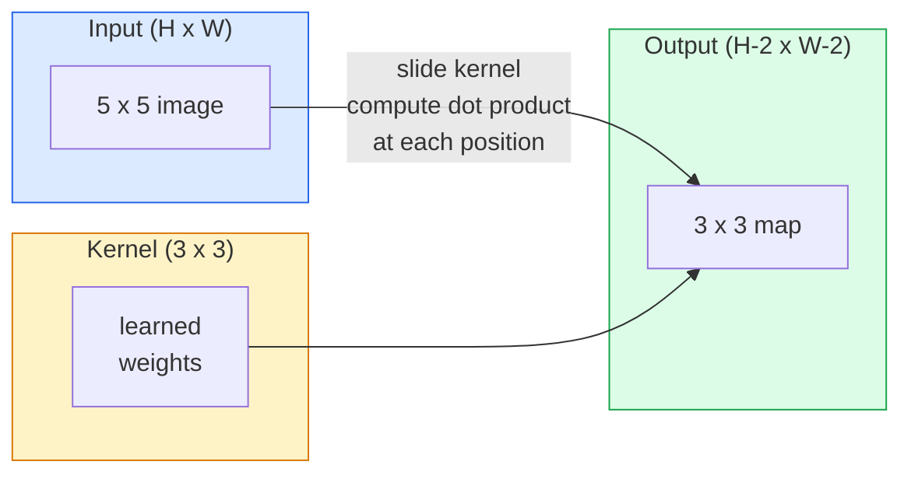
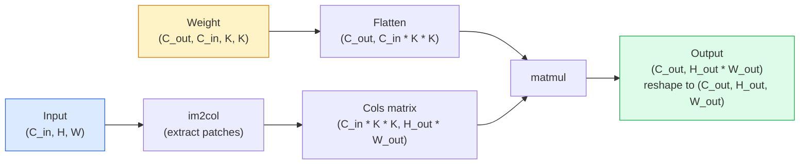

# 从零实现卷积

> 卷积就是一个微型的全连接层，你把它在图像上滑动，并且在每个位置共享同一组权重。

**Type:** Build
**Languages:** Python
**Prerequisites:** Phase 3 (Deep Learning Core), Phase 4 Lesson 01 (Image Fundamentals)
**Time:** ~75 minutes

## 学习目标

- 只用 NumPy 从零实现 2D 卷积，包括嵌套循环版本和向量化的 `im2col` 版本
- 对任意输入尺寸、卷积核尺寸、填充和步幅的组合计算输出空间尺寸，并能解释 `(H - K + 2P) / S + 1` 这个公式的由来
- 手工设计卷积核（边缘、模糊、锐化、Sobel），并解释每个核为什么会产生对应的激活模式
- 把多个卷积堆叠成特征提取器，并把堆叠的深度与感受野的大小联系起来

## 问题背景

在 224x224 的 RGB 图像上，一个全连接层的每个神经元需要 224 * 224 * 3 = 150,528 个输入权重。一个只有 1,000 个单元的隐藏层就已经是 1.5 亿个参数——而此时你还什么有用的东西都没学到。更糟的是，这一层完全不知道左上角的狗和右下角的狗其实是同一种模式。它把每个像素位置都当作独立的，而这对图像来说恰恰是错的：把一只猫平移三个像素，不应该迫使网络重新学习「猫」这个概念。

图像模型需要两个性质：**平移等变性**（translation equivariance，输入平移时输出随之平移）和**参数共享**（parameter sharing，同一个特征检测器在所有位置上运行）。全连接层两者都给不了。卷积则免费提供两者。

卷积并不是为深度学习发明的。它就是驱动 JPEG 压缩、Photoshop 高斯模糊、工业视觉中的边缘检测、以及所有音频滤波器的那个运算。CNN 从 2012 年到 2020 年统治 ImageNet 的原因在于：对于「相邻取值相关、同一模式可以出现在任何位置」的数据，卷积正是正确的先验。

## 核心概念

### 一个卷积核，滑动起来

2D 卷积取一个叫做卷积核（kernel，也称滤波器 filter）的小权重矩阵，在输入上滑动，并在每个位置计算逐元素乘积之和。这个和就是一个输出像素。



一个具体的例子：3x3 卷积核作用在 5x5 输入上（无填充，步幅 1）：

```
Input X (5 x 5):                Kernel W (3 x 3):

  1  2  0  1  2                   1  0 -1
  0  1  3  1  0                   2  0 -2
  2  1  0  2  1                   1  0 -1
  1  0  2  1  3
  2  1  1  0  1

The kernel slides across every valid 3 x 3 window. Output Y is 3 x 3:

 Y[0,0] = sum( W * X[0:3, 0:3] )
 Y[0,1] = sum( W * X[0:3, 1:4] )
 Y[0,2] = sum( W * X[0:3, 2:5] )
 Y[1,0] = sum( W * X[1:4, 0:3] )
 ... and so on
```

这一个公式——**共享权重、局部性、滑动窗口**——就是全部思想。其余一切都只是记账式的细节。

### 输出尺寸公式

给定输入空间尺寸 `H`、卷积核尺寸 `K`、填充 `P`、步幅 `S`：

```
H_out = floor( (H - K + 2P) / S ) + 1
```

把它背下来。设计每个架构时你都会算上几十遍。

| 场景 | H | K | P | S | H_out |
|----------|---|---|---|---|-------|
| Valid 卷积，无填充 | 32 | 3 | 0 | 1 | 30 |
| Same 卷积（保持尺寸） | 32 | 3 | 1 | 1 | 32 |
| 2 倍下采样 | 32 | 3 | 1 | 2 | 16 |
| 2x2 池化 | 32 | 2 | 0 | 2 | 16 |
| 大感受野 | 32 | 7 | 3 | 2 | 16 |

「Same 填充」的意思是：选取 P 使得当 S == 1 时 H_out == H。对于奇数 K，即 P = (K - 1) / 2。这就是 3x3 卷积核占主导地位的原因——它是最小的、仍然有中心的奇数卷积核。

### 填充（Padding）

不加填充时，每次卷积都会缩小特征图。堆 20 层之后，你的 224x224 图像就变成了 184x184，这既在边界上浪费计算，又给需要形状匹配的残差连接添麻烦。

```
Zero padding (P = 1) on a 5 x 5 input:

  0  0  0  0  0  0  0
  0  1  2  0  1  2  0
  0  0  1  3  1  0  0
  0  2  1  0  2  1  0       Now the kernel can centre on pixel
  0  1  0  2  1  3  0       (0, 0) and still have three rows and
  0  2  1  1  0  1  0       three columns of values to multiply.
  0  0  0  0  0  0  0
```

实践中会遇到的几种模式：`zero`（最常用）、`reflect`（镜像边缘，在生成式模型中可避免生硬的边界）、`replicate`（复制边缘）、`circular`（环绕，用于环面拓扑的问题）。

### 步幅（Stride）

步幅是滑动的步长。`stride=1` 是默认值。`stride=2` 会把空间维度减半，是在 CNN 内部不用单独池化层就完成下采样的经典做法——每个现代架构（ResNet、ConvNeXt、MobileNet）都在某处用带步幅的卷积替代了最大池化。

```
Stride 1 on a 5 x 5 input, 3 x 3 kernel:

  starts: (0,0) (0,1) (0,2)        -> output row 0
          (1,0) (1,1) (1,2)        -> output row 1
          (2,0) (2,1) (2,2)        -> output row 2

  Output: 3 x 3

Stride 2 on the same input:

  starts: (0,0) (0,2)              -> output row 0
          (2,0) (2,2)              -> output row 1

  Output: 2 x 2
```

### 多输入通道

真实图像有三个通道。RGB 输入上的 3x3 卷积实际上是一个 3x3x3 的体积：每个输入通道对应一个 3x3 切片。在每个空间位置，你对全部三个切片做乘加，再加上一个偏置。

```
Input:   (C_in,  H,  W)        3 x 5 x 5
Kernel:  (C_in,  K,  K)        3 x 3 x 3 (one kernel)
Output:  (1,     H', W')       2D map

For a layer that produces C_out output channels, you stack C_out kernels:

Weight:  (C_out, C_in, K, K)   e.g. 64 x 3 x 3 x 3
Output:  (C_out, H', W')       64 x 3 x 3

Parameter count: C_out * C_in * K * K + C_out   (the + C_out is biases)
```

最后那一行就是你规划模型时要算的式子。在 3 通道输入上做一个 64 通道的 3x3 卷积，参数量是 `64 * 3 * 3 * 3 + 64 = 1,792`。非常便宜。

### im2col 技巧

嵌套循环易读但很慢。GPU 想要的是大矩阵乘法。技巧在于：把输入中的每个感受野窗口展平成一个大矩阵的一列，把卷积核展平成一行，整个卷积就变成了一次矩阵乘法（matmul）。



所有生产级的卷积实现都是它的某种变体，再加上一些缓存分块技巧（直接卷积、Winograd、面向大核的 FFT 卷积）。理解了 im2col，你就理解了核心。

### 感受野（Receptive Field）

单个 3x3 卷积看到 9 个输入像素。堆叠两个 3x3 卷积，第二层的神经元就能看到 5x5 的输入像素。三个 3x3 卷积是 7x7。一般地：

```
RF after L stacked K x K convs (stride 1) = 1 + L * (K - 1)

With strides:   RF grows multiplicatively with stride along each layer.
```

「一路 3x3 到底」之所以行得通（VGG、ResNet、ConvNeXt），就在于两个 3x3 卷积覆盖的输入区域与一个 5x5 卷积相同，但参数更少，中间还多了一次非线性。

```figure
convolution-kernel
```

## 从零实现

### 第 1 步：给数组做填充

从最小的原语开始：一个在 H x W 数组四周补零的函数。

```python
import numpy as np

def pad2d(x, p):
    if p == 0:
        return x
    h, w = x.shape[-2:]
    out = np.zeros(x.shape[:-2] + (h + 2 * p, w + 2 * p), dtype=x.dtype)
    out[..., p:p + h, p:p + w] = x
    return out

x = np.arange(9).reshape(3, 3)
print(x)
print()
print(pad2d(x, 1))
```

`x.shape[:-2]` 这个「只操作末尾两个轴」的技巧，让同一个函数无需修改就能处理 `(H, W)`、`(C, H, W)` 或 `(N, C, H, W)`。

### 第 2 步：嵌套循环版 2D 卷积

参考实现——慢，但毫无歧义。这就是 `torch.nn.functional.conv2d` 在原理上做的事。

```python
def conv2d_naive(x, w, b=None, stride=1, padding=0):
    c_in, h, w_in = x.shape
    c_out, c_in_w, kh, kw = w.shape
    assert c_in == c_in_w

    x_pad = pad2d(x, padding)
    h_out = (h + 2 * padding - kh) // stride + 1
    w_out = (w_in + 2 * padding - kw) // stride + 1

    out = np.zeros((c_out, h_out, w_out), dtype=np.float32)
    for oc in range(c_out):
        for i in range(h_out):
            for j in range(w_out):
                hs = i * stride
                ws = j * stride
                patch = x_pad[:, hs:hs + kh, ws:ws + kw]
                out[oc, i, j] = np.sum(patch * w[oc])
        if b is not None:
            out[oc] += b[oc]
    return out
```

四层嵌套循环（输出通道、行、列，加上对 C_in、kh、kw 的隐式求和）。它是「基准真值」：之后每一个更快的实现都要拿它来对照检验。

### 第 3 步：用手工设计的卷积核验证

构造一个竖直方向的 Sobel 核，把它应用到一张合成的阶跃图像上，观察竖直边缘被点亮。

```python
def synthetic_step_image():
    img = np.zeros((1, 16, 16), dtype=np.float32)
    img[:, :, 8:] = 1.0
    return img

sobel_x = np.array([
    [[-1, 0, 1],
     [-2, 0, 2],
     [-1, 0, 1]]
], dtype=np.float32)[None]

x = synthetic_step_image()
y = conv2d_naive(x, sobel_x, padding=1)
print(y[0].round(1))
```

预期在第 7 列出现较大的正值（亮度从左到右递增），其余位置全为零。这一行 print 就是你确认数学没算错的健全性检查。

### 第 4 步：im2col

把输入中每个卷积核大小的窗口转换成矩阵的一列。对于 `C_in=3, K=3`，每列是 27 个数。

```python
def im2col(x, kh, kw, stride=1, padding=0):
    c_in, h, w = x.shape
    x_pad = pad2d(x, padding)
    h_out = (h + 2 * padding - kh) // stride + 1
    w_out = (w + 2 * padding - kw) // stride + 1

    cols = np.zeros((c_in * kh * kw, h_out * w_out), dtype=x.dtype)
    col = 0
    for i in range(h_out):
        for j in range(w_out):
            hs = i * stride
            ws = j * stride
            patch = x_pad[:, hs:hs + kh, ws:ws + kw]
            cols[:, col] = patch.reshape(-1)
            col += 1
    return cols, h_out, w_out
```

它仍然是一个 Python 循环，但现在重活将交给一次向量化的矩阵乘法。

### 第 5 步：通过 im2col + matmul 实现快速卷积

用一次矩阵乘法替换掉四层循环。

```python
def conv2d_im2col(x, w, b=None, stride=1, padding=0):
    c_out, c_in, kh, kw = w.shape
    cols, h_out, w_out = im2col(x, kh, kw, stride, padding)
    w_flat = w.reshape(c_out, -1)
    out = w_flat @ cols
    if b is not None:
        out += b[:, None]
    return out.reshape(c_out, h_out, w_out)
```

正确性检查：跑两个实现并对比结果。

```python
rng = np.random.default_rng(0)
x = rng.normal(0, 1, (3, 16, 16)).astype(np.float32)
w = rng.normal(0, 1, (8, 3, 3, 3)).astype(np.float32)
b = rng.normal(0, 1, (8,)).astype(np.float32)

y_naive = conv2d_naive(x, w, b, padding=1)
y_im2col = conv2d_im2col(x, w, b, padding=1)

print(f"max abs diff: {np.max(np.abs(y_naive - y_im2col)):.2e}")
```

`max abs diff` 应该在 `1e-5` 左右——差异来自浮点累加顺序，不是 bug。

### 第 6 步：一组手工设计的卷积核

五个滤波器，展示在任何训练发生之前，单个卷积层就能表达什么。

```python
KERNELS = {
    "identity": np.array([[0, 0, 0], [0, 1, 0], [0, 0, 0]], dtype=np.float32),
    "blur_3x3": np.ones((3, 3), dtype=np.float32) / 9.0,
    "sharpen": np.array([[0, -1, 0], [-1, 5, -1], [0, -1, 0]], dtype=np.float32),
    "sobel_x": np.array([[-1, 0, 1], [-2, 0, 2], [-1, 0, 1]], dtype=np.float32),
    "sobel_y": np.array([[-1, -2, -1], [0, 0, 0], [1, 2, 1]], dtype=np.float32),
}

def apply_kernel(img2d, kernel):
    x = img2d[None].astype(np.float32)
    w = kernel[None, None]
    return conv2d_im2col(x, w, padding=1)[0]
```

把它们应用到任意灰度图上：blur 让图像变柔和，sharpen 让边缘更清晰，Sobel-x 点亮竖直边缘，Sobel-y 点亮水平边缘。这些正是 AlexNet 和 VGG 中*第一个*训练出来的卷积层最终学到的模式——因为不管后面的任务是什么，一个好的图像模型都需要边缘和斑块检测器。

## 生产实践

PyTorch 的 `nn.Conv2d` 把同一个运算包装了起来，附带自动求导、CUDA kernel 和 cuDNN 优化。形状语义完全相同。

```python
import torch
import torch.nn as nn

conv = nn.Conv2d(in_channels=3, out_channels=64, kernel_size=3, stride=1, padding=1)
print(conv)
print(f"weight shape: {tuple(conv.weight.shape)}   # (C_out, C_in, K, K)")
print(f"bias shape:   {tuple(conv.bias.shape)}")
print(f"param count:  {sum(p.numel() for p in conv.parameters())}")

x = torch.randn(8, 3, 224, 224)
y = conv(x)
print(f"\ninput  shape: {tuple(x.shape)}")
print(f"output shape: {tuple(y.shape)}")
```

把 `padding=1` 换成 `padding=0`，输出就降到 222x222。把 `stride=1` 换成 `stride=2`，输出就降到 112x112。和你上面背下来的是同一个公式。

## 交付产物

本课产出：

- `outputs/prompt-cnn-architect.md` —— 一个提示词：给定输入尺寸、参数预算和目标感受野，它会设计一个 `Conv2d` 层堆栈，并在每一步给出正确的 K/S/P。
- `outputs/skill-conv-shape-calculator.md` —— 一个技能：逐层遍历网络规格，对每个模块返回输出形状、感受野和参数量。

## 练习

1. **（简单）** 给定 128x128 灰度输入和一个由 `[Conv3x3(s=1,p=1), Conv3x3(s=2,p=1), Conv3x3(s=1,p=1), Conv3x3(s=2,p=1)]` 组成的堆栈，手算每一层的输出空间尺寸和感受野。用 PyTorch 的 `nn.Sequential` 搭一组占位卷积来验证。
2. **（中等）** 扩展 `conv2d_naive` 和 `conv2d_im2col`，使其接受 `groups` 参数。证明 `groups=C_in=C_out` 复现了深度可分离卷积中的逐通道卷积（depthwise convolution），且其参数量是 `C * K * K` 而不是 `C * C * K * K`。
3. **（困难）** 手工实现 `conv2d_im2col` 的反向传播：给定输出的梯度，计算 `x` 和 `w` 的梯度。在相同的输入和权重上与 `torch.autograd.grad` 对比验证。诀窍：im2col 的梯度是 `col2im`，而且它必须对重叠窗口做累加。

## 关键术语

| 术语 | 大家口中的说法 | 它的真正含义 |
|------|----------------|----------------------|
| 卷积（Convolution） | 「滑动一个滤波器」 | 在每个空间位置以共享权重应用的可学习点积；数学上是互相关（cross-correlation），但所有人都管它叫卷积 |
| 卷积核 / 滤波器（Kernel / filter） | 「特征检测器」 | 形状为 (C_in, K, K) 的小权重张量，它与输入的一个窗口做点积产生一个输出像素 |
| 步幅（Stride） | 「每次跳多远」 | 相邻两次卷积核放置位置之间的步长；步幅 2 会把每个空间维度减半 |
| 填充（Padding） | 「边上补零」 | 在输入周围添加的额外值，使卷积核能够以边界像素为中心；`same` 填充使输出尺寸等于输入尺寸 |
| 感受野（Receptive field） | 「神经元能看到多大范围」 | 某个输出激活所依赖的原始输入区域，随深度和步幅增长 |
| im2col | 「GEMM 技巧」 | 把每个感受野窗口重排成列，使卷积变成一次大矩阵乘法——所有快速卷积 kernel 的核心 |
| 逐通道卷积（Depthwise conv） | 「每个通道一个核」 | `groups == C_in` 的卷积，每个输出通道只由对应的输入通道计算得到；MobileNet 和 ConvNeXt 的骨干 |
| 平移等变性（Translation equivariance） | 「输入移多少，输出移多少」 | 输入平移 k 个像素则输出也平移 k 个像素的性质；由共享权重免费获得 |

## 延伸阅读

- [A guide to convolution arithmetic for deep learning (Dumoulin & Visin, 2016)](https://arxiv.org/abs/1603.07285) —— 关于填充/步幅/空洞卷积的权威图解，每门课程都在悄悄引用
- [CS231n: Convolutional Neural Networks for Visual Recognition](https://cs231n.github.io/convolutional-networks/) —— 经典讲义，包含最初的 im2col 讲解
- [The Annotated ConvNet (fast.ai)](https://nbviewer.org/github/fastai/fastbook/blob/master/13_convolutions.ipynb) —— 一个从手工卷积一路走到训练好的数字分类器的 notebook
- [Receptive Field Arithmetic for CNNs (Dang Ha The Hien)](https://distill.pub/2019/computing-receptive-fields/) —— 论文级质量的感受野计算交互式讲解
