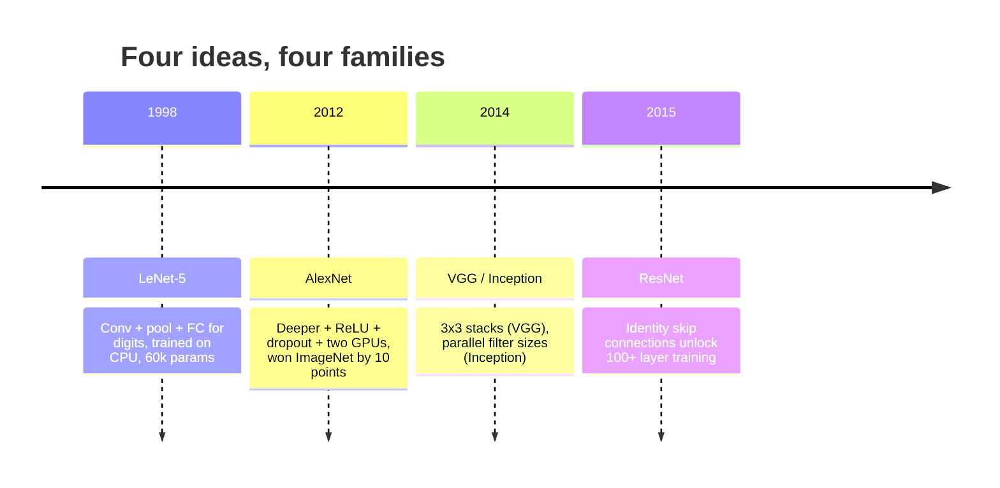
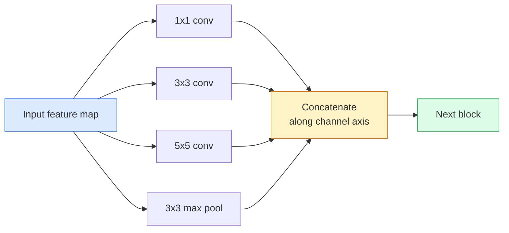
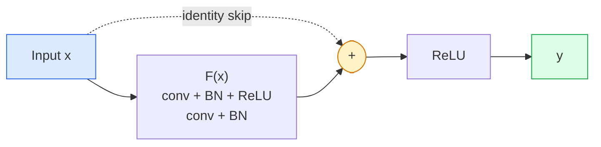

# CNN——从 LeNet 到 ResNet

> 过去三十年间每一个重要的 CNN，本质上都是同一套「卷积–非线性–下采样」配方，外加一个新点子。按顺序把这些点子学下来。

**Type:** Learn + Build
**Languages:** Python
**Prerequisites:** Phase 3 Lesson 11 (PyTorch), Phase 4 Lesson 01 (Image Fundamentals), Phase 4 Lesson 02 (Convolutions from Scratch)
**Time:** ~75 minutes

## 学习目标

- 梳理 LeNet-5 -> AlexNet -> VGG -> Inception -> ResNet 的架构演进脉络，并说出每个家族贡献的那一个新点子
- 用 PyTorch 实现 LeNet-5、一个 VGG 风格的块和一个 ResNet BasicBlock，每个不超过 40 行
- 解释残差连接为何能让一个 1000 层的网络从无法训练变成最先进水平
- 阅读现代主干网络（ResNet-18、ResNet-50）的结构，在看源码之前就能预测它的输出形状、感受野和参数量

## 问题背景

2011 年，最好的 ImageNet 分类器 top-5 准确率约为 74%。2012 年 AlexNet 达到 85%。2015 年 ResNet 达到 96%。没有新数据，也没有新一代 GPU。提升全部来自架构上的想法。一个真正做视觉的工程师必须知道哪个想法出自哪篇论文，因为你在 2026 年部署的每一个生产级主干网络，都是这些组件的重新组合——而且这些想法还在不断迁移：分组卷积从 CNN 走进了 Transformer，残差连接从 ResNet 走进了世界上所有的 LLM，批归一化活在扩散模型里。

按时间顺序研究这些网络，还能让你对一个常见错误免疫：明明一个 LeNet 量级的网络就能解决问题，却伸手去拿最大的可用模型。MNIST 不需要 ResNet。了解每个家族的规模曲线，你才知道自己该站在曲线的哪个位置。

## 核心概念

### 改变视觉领域的四个想法



在经典视觉领域，没有任何东西比这四次跃迁更重要。

### LeNet-5（1998）

Yann LeCun 的数字识别器。60,000 个参数。两个卷积-池化块、两个全连接层、tanh 激活函数。它定义了所有 CNN 都会继承的模板：

```
input (1, 32, 32)
  conv 5x5 -> (6, 28, 28)
  avg pool 2x2 -> (6, 14, 14)
  conv 5x5 -> (16, 10, 10)
  avg pool 2x2 -> (16, 5, 5)
  flatten -> 400
  dense -> 120
  dense -> 84
  dense -> 10
```

现代世界称之为 CNN 的一切——卷积与下采样交替堆叠，最后接一个小的分类头——都只是层数更多、通道更宽、激活函数更好的 LeNet。

### AlexNet（2012）

三个改动联手攻破了 ImageNet：

1. **ReLU** 取代 tanh。梯度不再消失，训练速度提升 6 倍。
2. **Dropout** 用在全连接头上。正则化从此成为一个层，而不是一种技巧。
3. **更深更宽**。五个卷积层、三个全连接层、6000 万参数，模型被拆分到两块 GPU 上训练。

论文的 Figure 2 至今仍画着 GPU 拆分形成的两条并行支路。那种并行只是硬件层面的权宜之计，不是架构上的洞见——但上面这三个想法依然存在于你使用的每一个模型中。

### VGG（2014）

VGG 提出的问题是：如果只用 3x3 卷积，然后一路加深，会发生什么？

```
stack:   conv 3x3 -> conv 3x3 -> pool 2x2
repeat:  16 or 19 conv layers
```

两个 3x3 卷积叠加，看到的输入区域和一个 5x5 卷积相同，但参数更少（2*9*C^2 = 18C^2 对比 25*C^2），中间还多了一个 ReLU。VGG 把这个观察变成了一整套架构。它的简洁——只有一种块类型，反复堆叠——使它成为后来一切架构的参照点。

代价：1.38 亿参数，训练慢，推理开销大。

### Inception（2014，同一年）

面对「卷积核该用多大」这个问题，Google 的回答是：全都要，并行用。



每条分支各司其职——1x1 负责通道混合，3x3 负责局部纹理，5x5 负责更大的图案，池化负责平移不变特征——拼接（concat）之后，下一层可以自行挑选有用的分支。Inception v1 在每条分支内部用 1x1 卷积作为瓶颈（bottleneck），把参数量控制在合理范围。

### 退化问题

到 2015 年，VGG-19 能训练成功，VGG-32 却不行。加深本应有益，但超过约 20 层之后，训练损失和测试损失双双变差。这不是过拟合。这是优化器找不到有用的权重，因为梯度在逐层传播时被乘法式地缩小。

```
Plain deep network:
  y = f_L( f_{L-1}( ... f_1(x) ... ) )

Gradient wrt early layer:
  dL/dW_1 = dL/dy * df_L/df_{L-1} * ... * df_2/df_1 * df_1/dW_1

Each multiplicative term has magnitude roughly (weight magnitude) * (activation gain).
Stack 100 of them with gains < 1 and the gradient is effectively zero.
```

VGG 能在 19 层下工作，是因为（同期发表的）批归一化让激活值保持在合理的尺度上。但即使有批归一化，深度也救不过 30 层左右。

### ResNet（2015）

He、Zhang、Ren、Sun 提出了一个改动，解决了所有问题：

```
standard block:   y = F(x)
residual block:   y = F(x) + x
```

这个 `+ x` 意味着任何一层都可以通过把 `F(x)` 压到零来选择「什么都不做」。一个 1000 层的 ResNet 最差也不过等于一个 1 层网络，因为每一个额外的块都有一个零代价的逃生通道。有了这个保证，优化器就愿意让每个块都*稍微*有点用——而「稍微有点用」叠加 100 次，就是最先进水平。



这个块有两种变体，随处可见：

- **BasicBlock**（ResNet-18、ResNet-34）：两个 3x3 卷积，跳跃连接跨过两者。
- **Bottleneck**（ResNet-50、-101、-152）：1x1 降维、3x3 居中、1x1 升维，跳跃连接跨过这三层。通道数较多时更省算力。

当跳跃连接需要跨越下采样（stride=2）时，恒等路径会被替换成一个 1x1、stride=2 的卷积来匹配形状。

### 残差为何超越了视觉领域

这个想法的意义其实不在图像分类。它把深度网络从「祈祷梯度能活下来」变成了一个可靠、可扩展的工程工具。你在下一阶段将读到的每一个 Transformer，每个块里都有一模一样的跳跃连接。没有 ResNet，就没有 GPT。

```figure
pooling
```

## 从零实现

### 第 1 步：LeNet-5

一个最小化、忠于原版的 LeNet。tanh 激活、平均池化。唯一向现代妥协的地方，是下游用 `nn.CrossEntropyLoss` 代替原版的高斯连接（Gaussian connections）。

```python
import torch
import torch.nn as nn
import torch.nn.functional as F

class LeNet5(nn.Module):
    def __init__(self, num_classes=10):
        super().__init__()
        self.conv1 = nn.Conv2d(1, 6, kernel_size=5)
        self.conv2 = nn.Conv2d(6, 16, kernel_size=5)
        self.pool = nn.AvgPool2d(2)
        self.fc1 = nn.Linear(16 * 5 * 5, 120)
        self.fc2 = nn.Linear(120, 84)
        self.fc3 = nn.Linear(84, num_classes)

    def forward(self, x):
        x = self.pool(torch.tanh(self.conv1(x)))
        x = self.pool(torch.tanh(self.conv2(x)))
        x = torch.flatten(x, 1)
        x = torch.tanh(self.fc1(x))
        x = torch.tanh(self.fc2(x))
        return self.fc3(x)

net = LeNet5()
x = torch.randn(1, 1, 32, 32)
print(f"output: {net(x).shape}")
print(f"params: {sum(p.numel() for p in net.parameters()):,}")
```

预期输出：`output: torch.Size([1, 10])`，`params: 61,706`。这就是开启现代视觉的那个数字分类器的全部。

### 第 2 步：一个 VGG 块

一个可复用的块：两个 3x3 卷积、ReLU、批归一化、最大池化。

```python
class VGGBlock(nn.Module):
    def __init__(self, in_c, out_c):
        super().__init__()
        self.conv1 = nn.Conv2d(in_c, out_c, kernel_size=3, padding=1)
        self.bn1 = nn.BatchNorm2d(out_c)
        self.conv2 = nn.Conv2d(out_c, out_c, kernel_size=3, padding=1)
        self.bn2 = nn.BatchNorm2d(out_c)
        self.pool = nn.MaxPool2d(2)

    def forward(self, x):
        x = F.relu(self.bn1(self.conv1(x)))
        x = F.relu(self.bn2(self.conv2(x)))
        return self.pool(x)

class MiniVGG(nn.Module):
    def __init__(self, num_classes=10):
        super().__init__()
        self.stack = nn.Sequential(
            VGGBlock(3, 32),
            VGGBlock(32, 64),
            VGGBlock(64, 128),
        )
        self.head = nn.Sequential(
            nn.AdaptiveAvgPool2d(1),
            nn.Flatten(),
            nn.Linear(128, num_classes),
        )

    def forward(self, x):
        return self.head(self.stack(x))

net = MiniVGG()
x = torch.randn(1, 3, 32, 32)
print(f"output: {net(x).shape}")
print(f"params: {sum(p.numel() for p in net.parameters()):,}")
```

三个 VGG 块作用于 CIFAR 尺寸的输入，外加一个自适应池化和一个线性层。约 29 万参数，对 CIFAR-10 绰绰有余。

### 第 3 步：一个 ResNet BasicBlock

ResNet-18 和 ResNet-34 的核心构件。

```python
class BasicBlock(nn.Module):
    def __init__(self, in_c, out_c, stride=1):
        super().__init__()
        self.conv1 = nn.Conv2d(in_c, out_c, kernel_size=3, stride=stride, padding=1, bias=False)
        self.bn1 = nn.BatchNorm2d(out_c)
        self.conv2 = nn.Conv2d(out_c, out_c, kernel_size=3, stride=1, padding=1, bias=False)
        self.bn2 = nn.BatchNorm2d(out_c)
        if stride != 1 or in_c != out_c:
            self.shortcut = nn.Sequential(
                nn.Conv2d(in_c, out_c, kernel_size=1, stride=stride, bias=False),
                nn.BatchNorm2d(out_c),
            )
        else:
            self.shortcut = nn.Identity()

    def forward(self, x):
        out = F.relu(self.bn1(self.conv1(x)))
        out = self.bn2(self.conv2(out))
        out = out + self.shortcut(x)
        return F.relu(out)
```

卷积层设 `bias=False` 是搭配批归一化时的惯例——BN 的 beta 参数已经承担了偏置的作用，再保留卷积偏置纯属浪费。`shortcut` 只在步长或通道数发生变化时才需要真正的卷积；否则它就是一个空操作的恒等映射。

### 第 4 步：一个微型 ResNet

把四组 BasicBlock 堆起来，就得到一个适用于 CIFAR 尺寸输入的可用 ResNet。

```python
class TinyResNet(nn.Module):
    def __init__(self, num_classes=10):
        super().__init__()
        self.stem = nn.Sequential(
            nn.Conv2d(3, 32, kernel_size=3, stride=1, padding=1, bias=False),
            nn.BatchNorm2d(32),
            nn.ReLU(inplace=True),
        )
        self.layer1 = self._make_group(32, 32, num_blocks=2, stride=1)
        self.layer2 = self._make_group(32, 64, num_blocks=2, stride=2)
        self.layer3 = self._make_group(64, 128, num_blocks=2, stride=2)
        self.layer4 = self._make_group(128, 256, num_blocks=2, stride=2)
        self.head = nn.Sequential(
            nn.AdaptiveAvgPool2d(1),
            nn.Flatten(),
            nn.Linear(256, num_classes),
        )

    def _make_group(self, in_c, out_c, num_blocks, stride):
        blocks = [BasicBlock(in_c, out_c, stride=stride)]
        for _ in range(num_blocks - 1):
            blocks.append(BasicBlock(out_c, out_c, stride=1))
        return nn.Sequential(*blocks)

    def forward(self, x):
        x = self.stem(x)
        x = self.layer1(x)
        x = self.layer2(x)
        x = self.layer3(x)
        x = self.layer4(x)
        return self.head(x)

net = TinyResNet()
x = torch.randn(1, 3, 32, 32)
print(f"output: {net(x).shape}")
print(f"params: {sum(p.numel() for p in net.parameters()):,}")
```

四组、每组两个块。第 2、3、4 组开头使用 stride 2。每次下采样时通道数翻倍。约 280 万参数。这就是能一路平滑扩展到 ResNet-152 的标准配方。

### 第 5 步：比较参数与特征的效率

把同样的输入分别送进三个网络，比较它们的参数量。

```python
def summary(name, net, x):
    y = net(x)
    params = sum(p.numel() for p in net.parameters())
    print(f"{name:12s}  input {tuple(x.shape)} -> output {tuple(y.shape)}  params {params:>10,}")

x = torch.randn(1, 3, 32, 32)
summary("LeNet5",     LeNet5(),       torch.randn(1, 1, 32, 32))
summary("MiniVGG",    MiniVGG(),      x)
summary("TinyResNet", TinyResNet(),   x)
```

三个模型，三个时代，参数量跨越三个数量级。在 CIFAR-10 上训练几个 epoch 后，准确率大致是：LeNet 60%，MiniVGG 89%，TinyResNet 93%。

## 生产实践

`torchvision.models` 提供了上述所有架构的预训练版本。各家族的调用签名完全一致——这正是主干网络抽象的意义所在。

```python
from torchvision.models import resnet18, ResNet18_Weights, vgg16, VGG16_Weights

r18 = resnet18(weights=ResNet18_Weights.IMAGENET1K_V1)
r18.eval()

print(f"ResNet-18 params: {sum(p.numel() for p in r18.parameters()):,}")
print(r18.layer1[0])
print()

v16 = vgg16(weights=VGG16_Weights.IMAGENET1K_V1)
v16.eval()
print(f"VGG-16   params: {sum(p.numel() for p in v16.parameters()):,}")
```

ResNet-18 有 1170 万参数，VGG-16 有 1.38 亿。两者的 ImageNet top-1 准确率相近（69.8% 对 71.6%）。残差连接为你赢得了 12 倍的参数效率。这就是为什么从 2016 年到 2021 年 ViT 出现之前，ResNet 系列一直占据统治地位——而且在算力受限的真实部署场景中，它至今仍是主流。

迁移学习的配方永远是同一套：加载预训练权重、冻结主干、替换分类头。

```python
for p in r18.parameters():
    p.requires_grad = False
r18.fc = nn.Linear(r18.fc.in_features, 10)
```

三行代码。你就拥有了一个 10 类 CIFAR 分类器，它继承了 ImageNet 花重金换来的表示。

## 交付产物

本课产出：

- `outputs/prompt-backbone-selector.md`——一个提示词，根据任务、数据集规模和算力预算选出合适的 CNN 家族（LeNet/VGG/ResNet/MobileNet/ConvNeXt）。
- `outputs/skill-residual-block-reviewer.md`——一个技能，读取 PyTorch 模块并标记跳跃连接相关的错误（步长变化时缺少 shortcut、shortcut 激活顺序错误、BN 与加法的相对位置不当）。

## 练习

1. **（简单）** 对 `TinyResNet` 逐层手算参数量，与 `sum(p.numel() for p in net.parameters())` 的结果对比。参数预算的大头花在了哪里——卷积、BN，还是分类头？
2. **（中等）** 实现 Bottleneck 块（1x1 -> 3x3 -> 1x1 加跳跃连接），并用它搭建一个面向 CIFAR 的 ResNet-50 风格网络。把参数量与 `TinyResNet` 对比。
3. **（困难）** 移除 `BasicBlock` 中的跳跃连接，在 CIFAR-10 上分别训练一个 34 块的「普通」网络和一个 34 块的 ResNet，各训练 10 个 epoch。绘制两者的训练损失随 epoch 变化的曲线。复现 He 等人论文 Figure 1 的结果：普通深度网络收敛到的损失比它更浅的孪生网络更高。

## 关键术语

| 术语 | 大家怎么说 | 实际含义 |
|------|----------------|----------------------|
| 主干网络（Backbone） | 「模型本体」 | 由卷积块堆叠而成、产生特征图并送入任务头的部分 |
| 残差连接（Residual connection） | 「跳跃连接」 | `y = F(x) + x`；优化器只需把 F 压到零就能学到恒等映射，从而让任意深度都可训练 |
| BasicBlock | 「两个 3x3 卷积加一条跳跃」 | ResNet-18/34 的构件：conv-BN-ReLU-conv-BN-add-ReLU |
| Bottleneck | 「1x1 降维、3x3、1x1 升维」 | ResNet-50/101/152 的块；通道数高时很省算力，因为 3x3 运行在缩减后的宽度上 |
| 退化问题（Degradation problem） | 「越深越差」 | 普通卷积层超过约 20 层后，训练误差和测试误差双双上升；靠残差连接解决，而不是更多数据 |
| Stem | 「第一层」 | 把 3 通道输入转换成基础特征宽度的初始卷积；ImageNet 通常用 7x7 stride 2，CIFAR 用 3x3 stride 1 |
| 头（Head） | 「分类器」 | 主干最后一个块之后的层：自适应池化、展平、一个或多个线性层 |
| 迁移学习（Transfer learning） | 「预训练权重」 | 加载在 ImageNet 上训练好的主干，只在你的任务上微调头部 |

## 延伸阅读

- [Deep Residual Learning for Image Recognition (He et al., 2015)](https://arxiv.org/abs/1512.03385)——ResNet 论文；每一张图都值得仔细研究
- [Very Deep Convolutional Networks (Simonyan & Zisserman, 2014)](https://arxiv.org/abs/1409.1556)——VGG 论文；至今仍是解释「为什么用 3x3」的最佳参考
- [ImageNet Classification with Deep CNNs (Krizhevsky et al., 2012)](https://papers.nips.cc/paper_files/paper/2012/hash/c399862d3b9d6b76c8436e924a68c45b-Abstract.html)——AlexNet；终结手工特征时代的那篇论文
- [Going Deeper with Convolutions (Szegedy et al., 2014)](https://arxiv.org/abs/1409.4842)——Inception v1；并行卷积核的想法至今仍出现在视觉 Transformer 中
