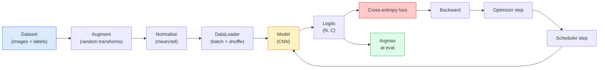

# 图像分类

> 分类器就是一个把像素映射为类别概率分布的函数。其余的一切都只是管道工程。

**Type:** Build
**Languages:** Python
**Prerequisites:** Phase 2 Lesson 09 (Model Evaluation), Phase 3 Lesson 10 (Mini Framework), Phase 4 Lesson 03 (CNNs)
**Time:** ~75 minutes

## 学习目标

- 在 CIFAR-10 上搭建端到端的图像分类流水线：数据集、数据增强、模型、训练循环、评估
- 解释每个组件（dataloader、损失、优化器、调度器、数据增强）的作用，并预测其中任何一个出问题时损失曲线会呈现什么形态
- 从零实现 mixup、cutout 和标签平滑（label smoothing），并说明各自在什么情况下值得加入
- 读懂混淆矩阵和按类别的精确率/召回率表格，从而在整体准确率之外诊断数据集与模型的问题

## 问题背景

每一个真正落地的视觉任务，归根结底都是某种层面上的图像分类。目标检测是对区域分类，分割是对像素分类，检索则按与类别中心的相似度排序。把分类做对——数据集循环、增强策略、损失函数、评估方法——是能迁移到本阶段所有其他任务的核心技能。

大多数分类 bug 并不在模型里，而是藏在流水线中：归一化写错了、训练集没有打乱、增强破坏了标签、验证集被训练数据污染、学习率在第 30 个 epoch 后悄悄发散。一个在正确配置下能在 CIFAR-10 上达到 93% 的 CNN，在有问题的配置下通常只能跑到 70-75%，而且损失曲线全程看起来都很正常。

这节课会手工搭起整条流水线，让每个环节都可以检查。你不会使用 `torchvision.datasets` 中任何可能掩盖 bug 的东西。

## 核心概念

### 分类流水线



这个循环里的每一条线都可能埋着 bug。交叉熵接收的是原始 logits 而不是 softmax 的输出，所以在损失之前写 `model(x).softmax()` 会悄无声息地算出错误的梯度。数据增强只作用于输入，不作用于标签——mixup 例外，它会同时混合两者。`optimizer.zero_grad()` 必须每个 step 调用一次；漏掉它会让梯度不断累积，表现得像是学习率极度不稳定。上述每一个 bug 都会让学习曲线趴平，却不会抛出任何错误。

### 交叉熵、logits 与 softmax

分类器对每张图像输出 `C` 个数字，称为 logits。对它们应用 softmax 就得到一个概率分布：

```
softmax(z)_i = exp(z_i) / sum_j exp(z_j)
```

交叉熵衡量的是正确类别的负对数概率：

```
CE(z, y) = -log( softmax(z)_y )
        = -z_y + log( sum_j exp(z_j) )
```

右边的形式是数值稳定的那种（log-sum-exp）。PyTorch 的 `nn.CrossEntropyLoss` 把 softmax 和 NLL 融合成一个算子，直接接收原始 logits。自己先做一次 softmax 几乎肯定是 bug——你算出来的是 log(softmax(softmax(z)))，一个毫无意义的量。

### 数据增强为什么有效

CNN 通过权重共享获得了对平移的归纳偏置，但对裁剪、翻转、颜色抖动或遮挡并没有内置的不变性。教会模型这些不变性的唯一办法，就是给它看能体现这些变化的像素。训练时的每一次随机变换都在表达同一句话："这两张图像的标签相同，请学会忽略它们差异的那些特征。"

```
Original crop:  "dog facing left"
Flip:           "dog facing right"       <- same label, different pixels
Rotate(+15):    "dog, slight tilt"
Colour jitter:  "dog in warmer light"
RandomErasing:  "dog with patch missing"
```

规则是：增强必须保持标签不变。在数字数据集上，cutout 和旋转可能把 "6" 变成 "9"；对那种数据集你应该缩小旋转范围，并选择尊重数字特有不变性的增强方式。

### Mixup 与 cutmix

普通的数据增强只变换像素，标签仍然保持 one-hot。**Mixup** 和 **cutmix** 打破了这一点，对两者同时进行插值。

```
Mixup:
  lambda ~ Beta(a, a)
  x = lambda * x_i + (1 - lambda) * x_j
  y = lambda * y_i + (1 - lambda) * y_j

Cutmix:
  paste a random rectangle of x_j into x_i
  y = area-weighted mix of y_i and y_j
```

它为什么有用：模型不再死记尖锐的 one-hot 目标，而是学会在类别之间做插值。训练损失会上升，测试准确率也会上升。它是任何分类器都能用上的、成本最低的鲁棒性升级。

### 标签平滑

mixup 的近亲。不再以 `[0, 0, 1, 0, 0]` 作为训练目标，而是用 `[eps/C, eps/C, 1-eps, eps/C, eps/C]`，其中 `eps` 取一个小值，比如 0.1。它阻止模型产生任意尖锐的 logits，并以几乎为零的代价改善校准（calibration）。自 PyTorch 1.10 起已内置在 `nn.CrossEntropyLoss(label_smoothing=0.1)` 中。

### 超越准确率的评估

整体准确率会掩盖类别不平衡。一个 90-10 的二分类器只要永远预测多数类，就能拿到 90%。真正能告诉你发生了什么的工具是：

- **按类别准确率**——每个类别一个数字，立刻暴露出表现不佳的类别。
- **混淆矩阵**——C x C 的网格，第 i 行第 j 列表示真实类别为 i 却被预测为 j 的数量；对角线是正确的部分，非对角线才是你的模型真正出问题的地方。
- **Top-1 / Top-5**——正确类别是否落在前 1 或前 5 个预测中；Top-5 对 ImageNet 很重要，因为像 "Norwich terrier" 和 "Norfolk terrier" 这样的类别本身就存在真实的歧义。
- **校准（ECE）**——置信度为 0.8 的预测，是否确实有 80% 的概率是对的？现代网络系统性地过度自信；可以用温度缩放（temperature scaling）或标签平滑来修正。

```figure
receptive-field
```

## 从零实现

### 第 1 步：确定性的合成数据集

CIFAR-10 存放在磁盘上。为了让这节课可复现且足够快，我们构建一个看起来像 CIFAR 的合成数据集——32x32 的 RGB 图像，带有模型必须学习的类别特定结构。完全相同的流水线无需修改即可用于真实的 CIFAR-10。

```python
import numpy as np
import torch
from torch.utils.data import Dataset


def synthetic_cifar(num_per_class=1000, num_classes=10, seed=0):
    rng = np.random.default_rng(seed)
    X = []
    Y = []
    for c in range(num_classes):
        centre = rng.uniform(0, 1, (3,))
        freq = 2 + c
        for _ in range(num_per_class):
            yy, xx = np.meshgrid(np.linspace(0, 1, 32), np.linspace(0, 1, 32), indexing="ij")
            r = np.sin(xx * freq) * 0.5 + centre[0]
            g = np.cos(yy * freq) * 0.5 + centre[1]
            b = (xx + yy) * 0.5 * centre[2]
            img = np.stack([r, g, b], axis=-1)
            img += rng.normal(0, 0.08, img.shape)
            img = np.clip(img, 0, 1)
            X.append(img.astype(np.float32))
            Y.append(c)
    X = np.stack(X)
    Y = np.array(Y)
    idx = rng.permutation(len(X))
    return X[idx], Y[idx]


class ArrayDataset(Dataset):
    def __init__(self, X, Y, transform=None):
        self.X = X
        self.Y = Y
        self.transform = transform

    def __len__(self):
        return len(self.X)

    def __getitem__(self, i):
        img = self.X[i]
        if self.transform is not None:
            img = self.transform(img)
        img = torch.from_numpy(img).permute(2, 0, 1)
        return img, int(self.Y[i])
```

每个类别都有自己的颜色基调和频率模式，再叠加高斯噪声，迫使模型学习信号本身而不是死记像素。十个类别，每类一千张图像，最后做随机排列。

### 第 2 步：归一化与数据增强

每条视觉流水线都少不了的两种变换。

```python
def standardize(mean, std):
    mean = np.array(mean, dtype=np.float32)
    std = np.array(std, dtype=np.float32)
    def _fn(img):
        return (img - mean) / std
    return _fn


def random_hflip(p=0.5):
    def _fn(img):
        if np.random.random() < p:
            return img[:, ::-1, :].copy()
        return img
    return _fn


def random_crop(pad=4):
    def _fn(img):
        h, w = img.shape[:2]
        padded = np.pad(img, ((pad, pad), (pad, pad), (0, 0)), mode="reflect")
        y = np.random.randint(0, 2 * pad)
        x = np.random.randint(0, 2 * pad)
        return padded[y:y + h, x:x + w, :]
    return _fn


def compose(*fns):
    def _fn(img):
        for fn in fns:
            img = fn(img)
        return img
    return _fn
```

裁剪前用反射填充（reflect-pad）而不是零填充，因为黑色边框是一种信号，模型会以一种没有用处的方式学着去依赖它。

### 第 3 步：Mixup

在训练 step 内部混合两张图像和两个标签。实现为 batch 级变换，使它紧挨着前向传播，而不是放进数据集里。

```python
def mixup_batch(x, y, num_classes, alpha=0.2):
    if alpha <= 0:
        return x, torch.nn.functional.one_hot(y, num_classes).float()
    lam = float(np.random.beta(alpha, alpha))
    idx = torch.randperm(x.size(0), device=x.device)
    x_mixed = lam * x + (1 - lam) * x[idx]
    y_onehot = torch.nn.functional.one_hot(y, num_classes).float()
    y_mixed = lam * y_onehot + (1 - lam) * y_onehot[idx]
    return x_mixed, y_mixed


def soft_cross_entropy(logits, soft_targets):
    log_probs = torch.log_softmax(logits, dim=-1)
    return -(soft_targets * log_probs).sum(dim=-1).mean()
```

`soft_cross_entropy` 是针对软标签分布的交叉熵。当目标恰好是 one-hot 时，它退化为普通的 one-hot 情形。

### 第 4 步：训练循环

完整的配方：遍历一遍数据，每个 batch 计算一次梯度，每个 epoch 调度器步进一次。

```python
import torch
import torch.nn as nn
from torch.utils.data import DataLoader
from torch.optim import SGD
from torch.optim.lr_scheduler import CosineAnnealingLR

def train_one_epoch(model, loader, optimizer, device, num_classes, use_mixup=True):
    model.train()
    total, correct, loss_sum = 0, 0, 0.0
    for x, y in loader:
        x, y = x.to(device), y.to(device)
        if use_mixup:
            x_m, y_soft = mixup_batch(x, y, num_classes)
            logits = model(x_m)
            loss = soft_cross_entropy(logits, y_soft)
        else:
            logits = model(x)
            loss = nn.functional.cross_entropy(logits, y, label_smoothing=0.1)
        optimizer.zero_grad()
        loss.backward()
        optimizer.step()
        loss_sum += loss.item() * x.size(0)
        total += x.size(0)
        # Training accuracy vs the un-mixed labels `y` is only an approximation
        # when mixup is on (the model saw soft targets, not y). Treat it as a
        # rough progress signal; rely on val accuracy for real performance.
        with torch.no_grad():
            pred = logits.argmax(dim=-1)
            correct += (pred == y).sum().item()
    return loss_sum / total, correct / total


@torch.no_grad()
def evaluate(model, loader, device, num_classes):
    model.eval()
    total, correct = 0, 0
    loss_sum = 0.0
    cm = torch.zeros(num_classes, num_classes, dtype=torch.long)
    for x, y in loader:
        x, y = x.to(device), y.to(device)
        logits = model(x)
        loss = nn.functional.cross_entropy(logits, y)
        pred = logits.argmax(dim=-1)
        for t, p in zip(y.cpu(), pred.cpu()):
            cm[t, p] += 1
        loss_sum += loss.item() * x.size(0)
        total += x.size(0)
        correct += (pred == y).sum().item()
    return loss_sum / total, correct / total, cm
```

每次写训练循环都要检查的五条不变式：

1. 训练前 `model.train()`，评估前 `model.eval()`——它们会切换 dropout 和 batchnorm 的行为。
2. `.zero_grad()` 在 `.backward()` 之前。
3. 累积指标时用 `.item()`，避免任何东西把计算图保活。
4. 评估时使用 `@torch.no_grad()`——节省显存和时间，也防止隐蔽的意外。
5. 对原始 logits 取 argmax 而不是对 softmax 取——结果相同，少一个算子。

### 第 5 步：组装起来

使用上一课的 `TinyResNet`，训练几个 epoch，然后评估。

```python
from main import synthetic_cifar, ArrayDataset
from main import standardize, random_hflip, random_crop, compose
from main import mixup_batch, soft_cross_entropy
from main import train_one_epoch, evaluate
# TinyResNet comes from the previous lesson (03-cnns-lenet-to-resnet).
# Adjust the import path to wherever you stored the previous lesson's code.
from cnns_lenet_to_resnet import TinyResNet  # example placeholder

X, Y = synthetic_cifar(num_per_class=500)
split = int(0.9 * len(X))
X_train, Y_train = X[:split], Y[:split]
X_val, Y_val = X[split:], Y[split:]

mean = [0.5, 0.5, 0.5]
std = [0.25, 0.25, 0.25]
train_tf = compose(random_hflip(), random_crop(pad=4), standardize(mean, std))
eval_tf = standardize(mean, std)

train_ds = ArrayDataset(X_train, Y_train, transform=train_tf)
val_ds = ArrayDataset(X_val, Y_val, transform=eval_tf)

train_loader = DataLoader(train_ds, batch_size=128, shuffle=True, num_workers=0)
val_loader = DataLoader(val_ds, batch_size=256, shuffle=False, num_workers=0)

device = "cuda" if torch.cuda.is_available() else "cpu"
model = TinyResNet(num_classes=10).to(device)
optimizer = SGD(model.parameters(), lr=0.1, momentum=0.9, weight_decay=5e-4, nesterov=True)
scheduler = CosineAnnealingLR(optimizer, T_max=10)

for epoch in range(10):
    tr_loss, tr_acc = train_one_epoch(model, train_loader, optimizer, device, 10, use_mixup=True)
    va_loss, va_acc, _ = evaluate(model, val_loader, device, 10)
    scheduler.step()
    print(f"epoch {epoch:2d}  lr {scheduler.get_last_lr()[0]:.4f}  "
          f"train {tr_loss:.3f}/{tr_acc:.3f}  val {va_loss:.3f}/{va_acc:.3f}")
```

在合成数据集上，五个 epoch 内验证准确率就能接近满分，而这正是重点：流水线是正确的，凡是可学的东西模型都学到了。把数据集换成真实的 CIFAR-10，同一个循环无需任何改动就能训练到约 90%。

### 第 6 步：读懂混淆矩阵

光看准确率永远不知道模型败在哪里。混淆矩阵可以。

```python
def print_confusion(cm, labels=None):
    c = cm.shape[0]
    labels = labels or [str(i) for i in range(c)]
    print(f"{'':>6}" + "".join(f"{l:>5}" for l in labels))
    for i in range(c):
        row = cm[i].tolist()
        print(f"{labels[i]:>6}" + "".join(f"{v:>5}" for v in row))
    print()
    tp = cm.diag().float()
    fp = cm.sum(dim=0).float() - tp
    fn = cm.sum(dim=1).float() - tp
    prec = tp / (tp + fp).clamp_min(1)
    rec = tp / (tp + fn).clamp_min(1)
    f1 = 2 * prec * rec / (prec + rec).clamp_min(1e-9)
    for i in range(c):
        print(f"{labels[i]:>6}  prec {prec[i]:.3f}  rec {rec[i]:.3f}  f1 {f1[i]:.3f}")

_, _, cm = evaluate(model, val_loader, device, 10)
print_confusion(cm)
```

行是真实类别，列是预测。如果类别 3 和类别 5 之间出现一团非对角线计数，说明模型在混淆这两个类别，这就给了你一个起点：可以针对性地收集数据，或者设计针对该类别的增强。

## 生产实践

`torchvision` 把上面的一切封装成了惯用组件。对真实的 CIFAR-10，完整流水线只要四行代码加一个训练循环。

```python
from torchvision.datasets import CIFAR10
from torchvision.transforms import Compose, RandomCrop, RandomHorizontalFlip, ToTensor, Normalize

mean = (0.4914, 0.4822, 0.4465)
std = (0.2470, 0.2435, 0.2616)
train_tf = Compose([
    RandomCrop(32, padding=4, padding_mode="reflect"),
    RandomHorizontalFlip(),
    ToTensor(),
    Normalize(mean, std),
])
eval_tf = Compose([ToTensor(), Normalize(mean, std)])

train_ds = CIFAR10(root="./data", train=True,  download=True, transform=train_tf)
val_ds   = CIFAR10(root="./data", train=False, download=True, transform=eval_tf)
```

有两点值得注意：均值/标准差是**数据集专属的**——它们是在 CIFAR-10 训练集上计算的，不是 ImageNet 的统计量；而反射填充是社区默认的裁剪策略。把 ImageNet 的统计量直接复制过来会泄漏掉约 1% 的准确率，而且在有人去做性能分析之前没人会发现。

## 交付产物

这节课产出：

- `outputs/prompt-classifier-pipeline-auditor.md`——一个提示词，可以按上面五条不变式审计训练脚本并指出第一处违规。
- `outputs/skill-classification-diagnostics.md`——一个技能，输入混淆矩阵和类别名列表后，总结各类别的失败情况并提出影响最大的单一修复方案。

## 练习

1. **（简单）** 在合成数据集上，用与不用 mixup 各训练同一模型五个 epoch。把两种情况的训练损失和验证损失画出来。解释为什么 mixup 下训练损失更高，验证准确率却相近甚至更好。
2. **（中等）** 实现 Cutout——在每张训练图像中随机置零一个 8x8 的方块——然后做消融实验：无增强、hflip+crop、hflip+crop+cutout、hflip+crop+mixup。报告每种配置的验证准确率。
3. **（困难）** 搭建一条 CIFAR-100 流水线（100 个类别，输入尺寸不变），复现一次 ResNet-34 训练，使准确率与已发表结果相差不超过 1%。加分项：扫描三个学习率和两个权重衰减取值，记录到本地 CSV，输出最终的混淆矩阵最高混淆对表格。

## 关键术语

| 术语 | 人们常说的 | 实际含义 |
|------|----------------|----------------------|
| Logits | "原始输出" | 每张图像 softmax 之前的 C 维向量；交叉熵接收的就是它们，而不是 softmax 之后的值 |
| 交叉熵 | "那个损失" | 正确类别的负对数概率；把 log-softmax 和 NLL 合并成一个数值稳定的算子 |
| DataLoader | "批处理器" | 给数据集包上打乱、分批和（可选的）多进程加载；一半的训练 bug 都会被怪到它头上 |
| 数据增强 | "随机变换" | 训练时任何保持标签不变的像素级变换；教会 CNN 那些它天生不具备的不变性 |
| Mixup / Cutmix | "混合两张图" | 同时混合输入和标签，让分类器学习平滑的插值而不是生硬的边界 |
| 标签平滑 | "更软的目标" | 把 one-hot 替换为 (1-eps, eps/(C-1), ...)；改善校准并略微提升准确率 |
| Top-k 准确率 | "Top-5" | 正确类别落在概率最高的 k 个预测之中；用于类别本身存在真实歧义的数据集 |
| 混淆矩阵 | "错误住在哪里" | C x C 表格，(i, j) 项统计真实类别为 i 却被预测为 j 的图像数；对角线是对的，非对角线告诉你该修什么 |

## 延伸阅读

- [CS231n: Training Neural Networks](https://cs231n.github.io/neural-networks-3/)——至今仍是单页之内对训练流水线最清晰的导览
- [Bag of Tricks for Image Classification (He et al., 2019)](https://arxiv.org/abs/1812.01187)——所有小技巧的合集，叠加起来能让 ResNet 在 ImageNet 上提升 3-4% 的准确率
- [mixup: Beyond Empirical Risk Minimization (Zhang et al., 2017)](https://arxiv.org/abs/1710.09412)——mixup 的原始论文；三页理论加上令人信服的实验
- [Why temperature scaling matters (Guo et al., 2017)](https://arxiv.org/abs/1706.04599)——证明了现代网络存在校准失准并用一个标量参数修复它的论文
