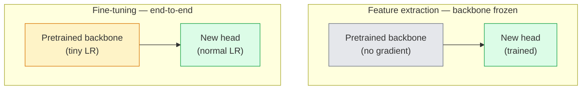

# 迁移学习与微调

> 别人已经花了上百万 GPU 小时教会一个网络什么是边缘、纹理和物体部件。在训练你自己的模型之前，应该先把这些特征借过来用。

**Type:** Build
**Languages:** Python
**Prerequisites:** Phase 4 Lesson 03 (CNNs), Phase 4 Lesson 04 (Image Classification)
**Time:** ~75 minutes

## 学习目标

- 区分特征提取（feature extraction）与微调（fine-tuning），并能根据数据集规模、领域差距和算力预算选对方案
- 加载一个预训练骨干网络（backbone），替换其分类头，只训练分类头，用不到 20 行代码得到一个可用的基线
- 配合判别式学习率（discriminative learning rates）逐步解冻网络层，让早期通用特征的更新幅度小于后期任务特定特征
- 诊断三种常见失败：解冻模块学习率过高导致的特征漂移、小数据集上的 BN 统计量崩坏，以及灾难性遗忘

## 问题背景

在 ImageNet 上训练一个 ResNet-50 大约要花 2,000 GPU 小时。极少有团队能为每个上线的任务都掏出这种预算。几乎所有团队实际部署的，是一个预训练骨干网络，加上一个在几百或几千张任务特定图像上训练出来的新分类头。

这不是偷懒。任何在 ImageNet 上训练过的 CNN，其第一个卷积块学到的是边缘和类 Gabor 滤波器。接下来几个块学到纹理和简单图案。中间的块学到物体部件。最后几个块学到的组合开始接近 ImageNet 的 1,000 个类别。这套层级结构的前 90% 几乎可以原封不动地迁移到医学影像、工业检测、卫星数据以及所有其他视觉任务——因为自然界的边缘和纹理词汇是有限的。你真正要训练的是最后那 10%。

要把迁移做对，有三个 bug 在等着你：学习率过高摧毁预训练特征、冻结过多导致模型信息不足，以及让 BatchNorm 的运行统计量漂移到一个网络其余部分从未学习过的小数据集上。本课会有意地逐一踩过这些坑。

## 核心概念

### 特征提取 vs 微调

两种方案，取决于你有多信任预训练特征，以及你有多少数据。



经验法则：

| 数据集规模 | 领域差距 | 方案 |
|--------------|-----------------|--------|
| < 1k 张图像 | 接近 ImageNet | 冻结骨干网络，只训练分类头 |
| 1k-10k | 接近 | 冻结前 2-3 个 stage，微调其余部分 |
| 10k-100k | 任意 | 使用判别式学习率端到端微调 |
| 100k+ | 较远 | 微调全部参数；如果领域差距足够大，可考虑从头训练 |

「接近 ImageNet」大致是指带有物体内容的自然 RGB 照片。医学 CT 扫描、俯视卫星影像和显微图像属于较远的领域——预训练特征仍然有用，但你需要让更多的层去适应新领域。

### 为什么冻结能行得通

CNN 在 ImageNet 上学到的特征并不是为那 1,000 个类别特化的，而是为自然图像的统计特性特化的：特定朝向的边缘、纹理、对比模式、形状基元。这些统计特性在人类能叫得出名字的几乎所有视觉领域中都是稳定的。这就是为什么一个在 ImageNet 上训练的模型，仅加一个新的线性分类头（不微调骨干网络）零样本迁移到 CIFAR-10 上评估，就能达到 80% 以上的准确率。分类头学的是如何为当前任务给那些已经学好的特征分配权重。

### 判别式学习率

当你解冻网络时，早期层应该比后期层训练得更慢。早期层编码的是你想保留的通用特征；后期层编码的是需要大幅调整的任务特定结构。

```
Typical recipe:

  stage 0 (stem + first group): lr = base_lr / 100    (mostly fixed)
  stage 1:                       lr = base_lr / 10
  stage 2:                       lr = base_lr / 3
  stage 3 (last backbone group): lr = base_lr
  head:                          lr = base_lr  (or slightly higher)
```

在 PyTorch 中，这不过是传给优化器的一个参数组列表。一个模型，五个学习率，零额外代码。

### BatchNorm 问题

BN 层持有的 `running_mean` 和 `running_var` 缓冲区是在 ImageNet 上算出来的。如果你的任务有不同的像素分布——不同的光照、不同的传感器、不同的色彩空间——这些缓冲区就是错的。按优先顺序有三种选择：

1. **在训练模式下微调 BN。**让 BN 与其他所有参数一起更新运行统计量。当任务数据集中等规模（>= 5k 个样本）时的默认选择。
2. **在评估模式下冻结 BN。**保留 ImageNet 的统计量，只训练权重。当你的数据集小到 BN 的滑动平均会很嘈杂时，这是正确的做法。
3. **用 GroupNorm 替换 BN。**彻底消除滑动平均的问题。用于每块 GPU 上批量很小的检测和分割骨干网络。

这一步搞错会悄无声息地把准确率拉低 5-15%。

### 分类头设计

分类头是 1-3 个线性层，外加一个可选的 dropout。每个 torchvision 骨干网络都自带一个默认分类头供你替换：

```
backbone.fc = nn.Linear(backbone.fc.in_features, num_classes)          # ResNet
backbone.classifier[1] = nn.Linear(..., num_classes)                    # EfficientNet, MobileNet
backbone.heads.head = nn.Linear(..., num_classes)                       # torchvision ViT
```

对小数据集来说，单个线性层通常就够了。当任务分布离骨干网络的训练分布较远时，加一个隐藏层（Linear -> ReLU -> Dropout -> Linear）会有帮助。

### 逐层学习率衰减

判别式学习率的一个更平滑版本，用于现代微调实践（BEiT、DINOv2、ViT-B 微调）。它不把层分成 stage，而是让每一层的学习率都比上一层略小：

```
lr_layer_k = base_lr * decay^(L - k)
```

当 decay = 0.75、L = 12 个 Transformer 块时，第一个块以分类头学习率的 `0.75^11 ≈ 0.04x` 进行训练。这对 Transformer 微调比对 CNN 更重要——对 CNN 来说，按 stage 分组的学习率通常已经足够。

### 该评估什么

迁移学习的实验需要两个在从头训练时不会跟踪的数字：

- **仅预训练准确率**——骨干网络冻结时分类头的准确率。这是你的下限。
- **微调后准确率**——同一模型经过端到端训练后的准确率。这是你的上限。

如果微调后的准确率低于仅预训练的准确率，说明你有学习率或 BN 的 bug。永远把两个数字都打印出来。

## 从零实现

### 第 1 步：加载预训练骨干网络并检查它

```python
import torch
import torch.nn as nn
from torchvision.models import resnet18, ResNet18_Weights

backbone = resnet18(weights=ResNet18_Weights.IMAGENET1K_V1)
print(backbone)
print()
print("classifier head:", backbone.fc)
print("feature dim:", backbone.fc.in_features)
```

`ResNet18` 有四个 stage（`layer1..layer4`），外加一个 stem 和一个 `fc` 分类头。每个 torchvision 分类骨干网络都有类似的结构。

### 第 2 步：特征提取——冻结全部参数，替换分类头

```python
def make_feature_extractor(num_classes=10):
    model = resnet18(weights=ResNet18_Weights.IMAGENET1K_V1)
    for p in model.parameters():
        p.requires_grad = False
    model.fc = nn.Linear(model.fc.in_features, num_classes)
    return model

model = make_feature_extractor(num_classes=10)
trainable = sum(p.numel() for p in model.parameters() if p.requires_grad)
frozen = sum(p.numel() for p in model.parameters() if not p.requires_grad)
print(f"trainable: {trainable:>10,}")
print(f"frozen:    {frozen:>10,}")
```

只有 `model.fc` 是可训练的。骨干网络是一个被冻结的特征提取器。

### 第 3 步：判别式微调

一个构建带有 stage 级学习率的参数组的工具函数。

```python
def discriminative_param_groups(model, base_lr=1e-3, decay=0.3):
    stages = [
        ["conv1", "bn1"],
        ["layer1"],
        ["layer2"],
        ["layer3"],
        ["layer4"],
        ["fc"],
    ]
    groups = []
    for i, names in enumerate(stages):
        lr = base_lr * (decay ** (len(stages) - 1 - i))
        params = [p for n, p in model.named_parameters()
                  if any(n.startswith(k) for k in names)]
        if params:
            groups.append({"params": params, "lr": lr, "name": "_".join(names)})
    return groups

model = resnet18(weights=ResNet18_Weights.IMAGENET1K_V1)
model.fc = nn.Linear(model.fc.in_features, 10)
for p in model.parameters():
    p.requires_grad = True

groups = discriminative_param_groups(model)
for g in groups:
    print(f"{g['name']:>10s}  lr={g['lr']:.2e}  params={sum(p.numel() for p in g['params']):>8,}")
```

`decay=0.3` 意味着每个 stage 的训练速率是下一个 stage 的 30%。`fc` 拿到 `base_lr`，`layer4` 拿到 `0.3 * base_lr`，`conv1` 拿到 `0.3^5 * base_lr ≈ 0.00243 * base_lr`。听起来很极端；但经验上就是好用。

### 第 4 步：处理 BatchNorm

一个冻结 BN 运行统计量但不冻结其权重的辅助函数。

```python
def freeze_bn_stats(model):
    for m in model.modules():
        if isinstance(m, (nn.BatchNorm1d, nn.BatchNorm2d, nn.BatchNorm3d)):
            m.eval()
            for p in m.parameters():
                p.requires_grad = False
    return model
```

在每个 epoch 开始处调用 `model.train()` 之后再调用它。`model.train()` 会把所有模块切到训练模式；这个函数只对 BN 层把它翻转回去。

### 第 5 步：一个最小的端到端微调循环

```python
from torch.optim import SGD
from torch.utils.data import DataLoader
from torch.optim.lr_scheduler import CosineAnnealingLR
import torch.nn.functional as F

def fine_tune(model, train_loader, val_loader, device, epochs=5, base_lr=1e-3, freeze_bn=False):
    model = model.to(device)
    groups = discriminative_param_groups(model, base_lr=base_lr)
    optimizer = SGD(groups, momentum=0.9, weight_decay=1e-4, nesterov=True)
    scheduler = CosineAnnealingLR(optimizer, T_max=epochs)

    for epoch in range(epochs):
        model.train()
        if freeze_bn:
            freeze_bn_stats(model)
        tr_loss, tr_correct, tr_total = 0.0, 0, 0
        for x, y in train_loader:
            x, y = x.to(device), y.to(device)
            logits = model(x)
            loss = F.cross_entropy(logits, y, label_smoothing=0.1)
            optimizer.zero_grad()
            loss.backward()
            optimizer.step()
            tr_loss += loss.item() * x.size(0)
            tr_total += x.size(0)
            tr_correct += (logits.argmax(-1) == y).sum().item()
        scheduler.step()

        model.eval()
        va_total, va_correct = 0, 0
        with torch.no_grad():
            for x, y in val_loader:
                x, y = x.to(device), y.to(device)
                pred = model(x).argmax(-1)
                va_total += x.size(0)
                va_correct += (pred == y).sum().item()
        print(f"epoch {epoch}  train {tr_loss/tr_total:.3f}/{tr_correct/tr_total:.3f}  "
              f"val {va_correct/va_total:.3f}")
    return model
```

按上面的配方在 CIFAR-10 上训练五个 epoch，能把 `ResNet18-IMAGENET1K_V1` 从约 70% 的零样本线性探针（linear probe）准确率提升到约 93% 的微调后准确率。如果完全不动骨干网络，单靠分类头会在 86% 左右触顶。

### 第 6 步：渐进式解冻

一个从网络末端向前端、每个 epoch 解冻一个 stage 的调度方案。代价是多花几个 epoch，换来缓解特征漂移。

```python
def progressive_unfreeze_schedule(model):
    stages = ["layer4", "layer3", "layer2", "layer1"]
    yielded = set()

    def start():
        for p in model.parameters():
            p.requires_grad = False
        for p in model.fc.parameters():
            p.requires_grad = True

    def unfreeze(epoch):
        if epoch < len(stages):
            name = stages[epoch]
            yielded.add(name)
            for n, p in model.named_parameters():
                if n.startswith(name):
                    p.requires_grad = True
            return name
        return None

    return start, unfreeze
```

在第一个 epoch 之前调用一次 `start()`。在每个 epoch 开始时调用 `unfreeze(epoch)`。每当可训练参数的集合发生变化时都要重建优化器，否则被冻结的参数仍然持有缓存的动量，会干扰优化器。

## 生产实践

对大多数真实任务来说，`torchvision.models` 加三行代码就够了。上面那套更重的机制，只有在你撞上库默认配置解决不了的问题时才派上用场。

```python
from torchvision.models import resnet50, ResNet50_Weights

model = resnet50(weights=ResNet50_Weights.IMAGENET1K_V2)
model.fc = nn.Linear(model.fc.in_features, num_classes)
optimizer = torch.optim.AdamW(model.parameters(), lr=1e-4, weight_decay=1e-4)
```

另外两个生产级的默认选择：

- `timm` 提供约 800 个预训练视觉骨干网络，API 统一（`timm.create_model("resnet50", pretrained=True, num_classes=10)`）。任何超出 torchvision 模型库范围的微调任务，它都是标准选择。
- 对于 Transformer 模型，`transformers.AutoModelForImageClassification.from_pretrained(name, num_labels=N)` 提供与文本模型相同加载语义的 ViT / BEiT / DeiT。

## 交付产物

本课产出：

- `outputs/prompt-fine-tune-planner.md`——一个提示词，根据数据集规模、领域差距和算力预算，在特征提取、渐进式解冻和端到端微调之间做出选择。
- `outputs/skill-freeze-inspector.md`——一个技能，给定一个 PyTorch 模型，报告哪些参数可训练、哪些 BatchNorm 层处于评估模式，以及优化器是否真的接收了那些可训练参数。

## 练习

1. **（简单）**在同一个合成 CIFAR 数据集上，分别把 `ResNet18` 作为线性探针（骨干网络冻结）和完整微调来训练。并排报告两个准确率。解释哪个差距说明特征迁移得好，哪个说明迁移得不好。
2. **（中等）**故意引入一个 bug：把 `base_lr = 1e-1` 设在骨干网络的 stage 上而不是分类头上。展示训练损失爆炸的过程，然后用 `discriminative_param_groups` 辅助函数恢复。记录每个 stage 开始发散时的学习率。
3. **（困难）**取一个医学影像数据集（如 CheXpert-small、PatchCamelyon 或 HAM10000），比较三种方案：(a) ImageNet 预训练的冻结骨干网络 + 线性分类头；(b) ImageNet 预训练后端到端微调；(c) 从头训练。报告每种方案的准确率和算力开销。数据集达到多大规模时，从头训练开始具有竞争力？

## 关键术语

| 术语 | 大家怎么说 | 实际含义 |
|------|----------------|----------------------|
| 特征提取 | 「冻结后只训分类头」 | 骨干网络参数被冻结，只有新的分类头接收梯度 |
| 微调 | 「端到端重新训练」 | 所有参数都可训练，学习率通常远小于从头训练 |
| 判别式学习率 | 「早期层用更小的学习率」 | 优化器参数组中，早期 stage 的学习率是后期 stage 的一个分数 |
| 逐层学习率衰减 | 「平滑的学习率梯度」 | 每一层的学习率乘以 decay^(L - k)；在 Transformer 微调中很常见 |
| 灾难性遗忘 | 「模型把 ImageNet 忘了」 | 在新任务信号被学到之前，过高的学习率就覆盖了预训练特征 |
| BN 统计量漂移 | 「running mean 不对」 | BatchNorm 的 running_mean/var 来自与当前任务不同的分布，悄悄损害准确率 |
| 线性探针 | 「冻结骨干网络 + 线性分类头」 | 对预训练特征的评估——在冻结表示之上训练的最佳线性分类器的准确率 |
| 灾难性坍缩 | 「全部预测同一个类别」 | 微调时学习率高到在分类头的梯度稳定之前就摧毁了特征时发生 |

## 延伸阅读

- [How transferable are features in deep neural networks? (Yosinski et al., 2014)](https://arxiv.org/abs/1411.1792)——量化了特征在不同层之间可迁移性的开山论文
- [Universal Language Model Fine-tuning (ULMFiT, Howard & Ruder, 2018)](https://arxiv.org/abs/1801.06146)——判别式学习率 / 渐进式解冻配方的原始出处；这些思想可以直接迁移到视觉任务
- [timm documentation](https://huggingface.co/docs/timm)——现代视觉骨干网络的权威参考，包含它们训练时使用的精确微调默认配置
- [A Simple Framework for Linear-Probe Evaluation (Kornblith et al., 2019)](https://arxiv.org/abs/1805.08974)——为什么线性探针准确率重要，以及如何正确报告它
