# 目标检测 —— 从零实现 YOLO

> 检测就是在特征图的每个位置同时跑分类加回归，再用非极大值抑制清理结果。

**Type:** Build
**Languages:** Python
**Prerequisites:** Phase 4 Lesson 03 (CNNs), Phase 4 Lesson 04 (Image Classification), Phase 4 Lesson 05 (Transfer Learning)
**Time:** ~75 minutes

## 学习目标

- 解释「网格 + 锚框」设计如何把检测变成一个密集预测问题，并说清输出张量中每个数字的含义
- 计算两个框之间的交并比（Intersection-over-Union），并从零实现非极大值抑制
- 在预训练骨干网络之上搭建一个最小化的 YOLO 风格检测头，包括分类、目标性（objectness）和框回归三种损失
- 读懂一行检测指标（precision@0.5、recall、mAP@0.5、mAP@0.5:0.95），并判断下一步该调哪个旋钮

## 问题背景

分类回答的是「这张图里是一只狗」。检测回答的是「在像素 (112, 40, 280, 210) 处有一只狗，在 (400, 180, 560, 310) 处有一只猫，画面里没有别的东西」。这一个结构上的变化——预测数量可变的带标签框，而不是每张图一个标签——正是所有自动驾驶系统、所有监控产品、所有文档版面解析器和所有工厂视觉产线赖以运转的基础。

检测也是视觉领域所有工程权衡同时登场的地方。你需要框足够准（回归头），需要每个框的类别正确（分类头），需要模型知道什么时候画面里没有东西可检测（目标性分数），还需要每个真实物体恰好对应一个预测（非极大值抑制）。漏掉其中任何一环，整条流水线就会漏检物体、报出凭空捏造的框，或者在略微不同的位置把同一个物体预测十五遍。

YOLO（You Only Look Once，Redmon et al. 2016）正是让这一切以实时速度运行的设计：用一次卷积网络的前向传播完成全部工作。同样的结构性决策至今仍是现代检测器（YOLOv8、YOLOv9、YOLO-NAS、RT-DETR）的骨架。学会了核心，所有变体都只是同一套零件的重新组合。

## 核心概念

### 把检测看作密集预测

分类器对每张图输出 C 个数。YOLO 风格的检测器对每张图输出 `(S x S x (5 + C))` 个数，其中 S 是空间网格的尺寸。

```mermaid
flowchart LR
    IMG["Input 416x416 RGB"] --> BB["Backbone<br/>(ResNet, DarkNet, ...)"]
    BB --> FM["Feature map<br/>(C_feat, 13, 13)"]
    FM --> HEAD["Detection head<br/>(1x1 convs)"]
    HEAD --> OUT["Output tensor<br/>(13, 13, B * (5 + C))"]
    OUT --> DEC["Decode<br/>(grid + sigmoid + exp)"]
    DEC --> NMS["Non-max suppression"]
    NMS --> RESULT["Final boxes"]

    style IMG fill:#dbeafe,stroke:#2563eb
    style HEAD fill:#fef3c7,stroke:#d97706
    style NMS fill:#fecaca,stroke:#dc2626
    style RESULT fill:#dcfce7,stroke:#16a34a
```



`S * S` 个网格单元中的每一个都预测 `B` 个框。对每个框：

- 4 个数描述几何信息：`tx, ty, tw, th`。
- 1 个数是目标性分数：「这个格子里是否以某个物体为中心？」
- C 个数是类别概率。

每个格子总共输出 `B * (5 + C)` 个数。对于 VOC 数据集，`S=13, B=2, C=20`，即每个格子 50 个数。

### 为什么要用网格和锚框

朴素的回归方案会为每个物体直接预测绝对坐标 `(x, y, w, h)`。这对卷积网络来说很难，因为平移图像不应该让所有预测平移同样的量——每个物体在空间上是有锚定位置的。网格解决了这个问题：把每个真实框分配给其中心点落入的那个网格单元，只有那个格子负责这个物体。

锚框（anchor）解决的是第二个问题。一个 3x3 卷积很难从一个感受野只有 16 像素的特征格子里回归出一个 500 像素宽的框。所以我们为每个格子预先定义 `B` 个先验框形状（锚框），然后只预测相对于每个锚框的小幅偏移量。模型学会的是挑对锚框再微调它，而不是从零开始回归。

```
Anchor box priors (example for 416x416 input):

  small:   (30,  60)
  medium:  (75,  170)
  large:   (200, 380)

At each grid cell, every anchor emits (tx, ty, tw, th, obj, c_1, ..., c_C).
```

现代检测器通常配合 FPN，在不同分辨率上使用不同的锚框集合——浅层高分辨率特征图用小锚框，深层低分辨率特征图用大锚框。思路相同，只是尺度更多。

### 解码预测结果

原始的 `tx, ty, tw, th` 并不是框的坐标，而是回归目标，画框前需要先做变换：

```
centre x  = (sigmoid(tx) + cell_x) * stride
centre y  = (sigmoid(ty) + cell_y) * stride
width     = anchor_w * exp(tw)
height    = anchor_h * exp(th)
```

`sigmoid` 把中心偏移量约束在格子内部。`exp` 让宽度可以相对锚框自由缩放且不会出现符号翻转。`stride` 把网格坐标还原回像素。自 v2 以来，每个 YOLO 版本的解码步骤都是这一套。

### IoU

检测领域衡量两个框相似度的通用指标：

```
IoU(A, B) = area(A intersect B) / area(A union B)
```

IoU = 1 表示完全重合；IoU = 0 表示没有重叠。预测框与真实框之间的 IoU 决定一个预测是否算作真阳性（通常要求 IoU >= 0.5）。两个预测框之间的 IoU 则是 NMS 用来去重的依据。

### 非极大值抑制

在相邻锚框上训练出的卷积网络经常会对同一个物体预测多个相互重叠的框。NMS 保留置信度最高的预测，删除与它的 IoU 超过阈值的其余所有预测。

```
NMS(boxes, scores, iou_threshold):
    sort boxes by score descending
    keep = []
    while boxes not empty:
        pick the top-scoring box, add to keep
        remove every box with IoU > iou_threshold to the picked box
    return keep
```

目标检测的典型阈值是 0.45。近年的检测器把标准 NMS 替换为 `soft-NMS`、`DIoU-NMS`，或者直接学习抑制过程（RT-DETR），但结构上的目的没有变。

### 损失函数

YOLO 损失是三种损失按权重相加：

```
L = lambda_coord * L_box(pred, target, where obj=1)
  + lambda_obj   * L_obj(pred, 1,     where obj=1)
  + lambda_noobj * L_obj(pred, 0,     where obj=0)
  + lambda_cls   * L_cls(pred, target, where obj=1)
```

只有包含物体的格子才参与框回归损失和分类损失。不含物体的格子只参与目标性损失（教模型在没东西时保持沉默）。`lambda_noobj` 通常很小（约 0.5），因为绝大多数格子是空的，否则它们会主导整个损失。

现代变体把 MSE 框损失换成 CIoU / DIoU（直接优化 IoU），用焦点损失（focal loss）处理类别不平衡，用质量焦点损失（quality focal loss）平衡目标性。但三部分组成的结构没有变。

### 检测指标

准确率（accuracy）在检测里不适用。真正有用的是这四个数字：

- **Precision@IoU=0.5** —— 在被算作正例的预测中，有多少是真正正确的。
- **Recall@IoU=0.5** —— 在真实存在的物体中，我们找到了多少。
- **AP@0.5** —— IoU 阈值为 0.5 时精确率-召回率曲线下的面积；每个类别一个数。
- **mAP@0.5:0.95** —— 在 IoU 阈值 0.5、0.55、…、0.95 上对 AP 取平均。这是 COCO 的标准指标，最严格、信息量也最大。

四个都要报。一个 mAP@0.5 很高但 mAP@0.5:0.95 很低的检测器，定位是大致对了但不够精确，应改进框回归损失。一个精确率高但召回率低的检测器太保守，应降低置信度阈值或增大目标性权重。

## 从零实现

### 第 1 步：IoU

整节课的主力函数。输入是两组 `(x1, y1, x2, y2)` 格式的框。

```python
import numpy as np

def box_iou(boxes_a, boxes_b):
    ax1, ay1, ax2, ay2 = boxes_a[:, 0], boxes_a[:, 1], boxes_a[:, 2], boxes_a[:, 3]
    bx1, by1, bx2, by2 = boxes_b[:, 0], boxes_b[:, 1], boxes_b[:, 2], boxes_b[:, 3]

    inter_x1 = np.maximum(ax1[:, None], bx1[None, :])
    inter_y1 = np.maximum(ay1[:, None], by1[None, :])
    inter_x2 = np.minimum(ax2[:, None], bx2[None, :])
    inter_y2 = np.minimum(ay2[:, None], by2[None, :])

    inter_w = np.clip(inter_x2 - inter_x1, 0, None)
    inter_h = np.clip(inter_y2 - inter_y1, 0, None)
    inter = inter_w * inter_h

    area_a = (ax2 - ax1) * (ay2 - ay1)
    area_b = (bx2 - bx1) * (by2 - by1)
    union = area_a[:, None] + area_b[None, :] - inter
    return inter / np.clip(union, 1e-8, None)
```

返回一个 `(N_a, N_b)` 的两两 IoU 矩阵。如果想跟单个真实框比较，把其中一个数组的形状设为 `(1, 4)` 即可。

### 第 2 步：非极大值抑制

```python
def nms(boxes, scores, iou_threshold=0.45):
    order = np.argsort(-scores)
    keep = []
    while len(order) > 0:
        i = order[0]
        keep.append(i)
        if len(order) == 1:
            break
        rest = order[1:]
        ious = box_iou(boxes[[i]], boxes[rest])[0]
        order = rest[ious <= iou_threshold]
    return np.array(keep, dtype=np.int64)
```

结果确定性可复现，排序带来 `O(N log N)` 的复杂度，在相同输入下与 `torchvision.ops.nms` 的行为一致。

### 第 3 步：框的编码与解码

在像素坐标和网络实际回归的 `(tx, ty, tw, th)` 目标之间相互转换。

```python
def encode(box_xyxy, cell_x, cell_y, stride, anchor_wh):
    x1, y1, x2, y2 = box_xyxy
    cx = 0.5 * (x1 + x2)
    cy = 0.5 * (y1 + y2)
    w = x2 - x1
    h = y2 - y1
    tx = cx / stride - cell_x
    ty = cy / stride - cell_y
    tw = np.log(w / anchor_wh[0] + 1e-8)
    th = np.log(h / anchor_wh[1] + 1e-8)
    return np.array([tx, ty, tw, th])


def decode(tx_ty_tw_th, cell_x, cell_y, stride, anchor_wh):
    tx, ty, tw, th = tx_ty_tw_th
    cx = (sigmoid(tx) + cell_x) * stride
    cy = (sigmoid(ty) + cell_y) * stride
    w = anchor_wh[0] * np.exp(tw)
    h = anchor_wh[1] * np.exp(th)
    return np.array([cx - w / 2, cy - h / 2, cx + w / 2, cy + h / 2])


def sigmoid(x):
    return 1.0 / (1.0 + np.exp(-x))
```

测试方法：先编码一个框再解码——你应该得到与原始框非常接近的结果（误差来自 sigmoid 的逆变换：当 `tx` 不在 sigmoid 输出值域内时无法完美还原）。

### 第 4 步：一个最小化的 YOLO 检测头

在特征图上做一次 1x1 卷积，再 reshape 成 `(B, S, S, num_anchors, 5 + C)`。

```python
import torch
import torch.nn as nn

class YOLOHead(nn.Module):
    def __init__(self, in_c, num_anchors, num_classes):
        super().__init__()
        self.num_anchors = num_anchors
        self.num_classes = num_classes
        self.conv = nn.Conv2d(in_c, num_anchors * (5 + num_classes), kernel_size=1)

    def forward(self, x):
        n, _, h, w = x.shape
        y = self.conv(x)
        y = y.view(n, self.num_anchors, 5 + self.num_classes, h, w)
        y = y.permute(0, 3, 4, 1, 2).contiguous()
        return y
```

输出形状：`(N, H, W, num_anchors, 5 + C)`。最后一维存放 `[tx, ty, tw, th, obj, cls_0, ..., cls_{C-1}]`。

### 第 5 步：真实框分配

对每个真实框，决定由哪个 `(格子, 锚框)` 组合负责它。

```python
def assign_targets(boxes_xyxy, classes, anchors, stride, grid_size, num_classes):
    num_anchors = len(anchors)
    target = np.zeros((grid_size, grid_size, num_anchors, 5 + num_classes), dtype=np.float32)
    has_obj = np.zeros((grid_size, grid_size, num_anchors), dtype=bool)

    for box, cls in zip(boxes_xyxy, classes):
        x1, y1, x2, y2 = box
        cx, cy = 0.5 * (x1 + x2), 0.5 * (y1 + y2)
        gx, gy = int(cx / stride), int(cy / stride)
        bw, bh = x2 - x1, y2 - y1

        ious = np.array([
            (min(bw, aw) * min(bh, ah)) / (bw * bh + aw * ah - min(bw, aw) * min(bh, ah))
            for aw, ah in anchors
        ])
        best = int(np.argmax(ious))
        aw, ah = anchors[best]

        target[gy, gx, best, 0] = cx / stride - gx
        target[gy, gx, best, 1] = cy / stride - gy
        target[gy, gx, best, 2] = np.log(bw / aw + 1e-8)
        target[gy, gx, best, 3] = np.log(bh / ah + 1e-8)
        target[gy, gx, best, 4] = 1.0
        target[gy, gx, best, 5 + cls] = 1.0
        has_obj[gy, gx, best] = True
    return target, has_obj
```

锚框选择采用「与真实框形状 IoU 最大」的策略——这是一种廉价的近似，与 YOLOv2/v3 的分配方式一致。v5 及之后的版本使用更精细的策略（任务对齐匹配、动态 k），但都是对同一思路的细化。

### 第 6 步：三种损失

```python
def yolo_loss(pred, target, has_obj, lambda_coord=5.0, lambda_obj=1.0, lambda_noobj=0.5, lambda_cls=1.0):
    has_obj_t = torch.from_numpy(has_obj).bool()
    target_t = torch.from_numpy(target).float()

    # box-regression loss: only on cells with objects
    box_pred = pred[..., :4][has_obj_t]
    box_true = target_t[..., :4][has_obj_t]
    loss_box = torch.nn.functional.mse_loss(box_pred, box_true, reduction="sum")

    # objectness loss
    obj_pred = pred[..., 4]
    obj_true = target_t[..., 4]
    loss_obj_pos = torch.nn.functional.binary_cross_entropy_with_logits(
        obj_pred[has_obj_t], obj_true[has_obj_t], reduction="sum")
    loss_obj_neg = torch.nn.functional.binary_cross_entropy_with_logits(
        obj_pred[~has_obj_t], obj_true[~has_obj_t], reduction="sum")

    # classification loss on cells with objects
    cls_pred = pred[..., 5:][has_obj_t]
    cls_true = target_t[..., 5:][has_obj_t]
    loss_cls = torch.nn.functional.binary_cross_entropy_with_logits(
        cls_pred, cls_true, reduction="sum")

    total = (lambda_coord * loss_box
             + lambda_obj * loss_obj_pos
             + lambda_noobj * loss_obj_neg
             + lambda_cls * loss_cls)
    return total, {"box": loss_box.item(), "obj_pos": loss_obj_pos.item(),
                   "obj_neg": loss_obj_neg.item(), "cls": loss_cls.item()}
```

这五个超参数是每篇 YOLO 教程要么写死、要么扫参的对象。比例关系很重要：`lambda_coord=5, lambda_noobj=0.5` 沿袭了 YOLOv1 原始论文，至今仍是合理的默认值。

### 第 7 步：推理流水线

解码检测头的原始输出，应用 sigmoid/exp，按目标性阈值过滤，再做 NMS。

```python
def postprocess(pred_tensor, anchors, stride, img_size, conf_threshold=0.25, iou_threshold=0.45):
    pred = pred_tensor.detach().cpu().numpy()
    grid_h, grid_w = pred.shape[1], pred.shape[2]
    num_anchors = len(anchors)

    boxes, scores, classes = [], [], []
    for gy in range(grid_h):
        for gx in range(grid_w):
            for a in range(num_anchors):
                tx, ty, tw, th, obj, *cls = pred[0, gy, gx, a]
                score = sigmoid(obj) * sigmoid(np.array(cls)).max()
                if score < conf_threshold:
                    continue
                cls_idx = int(np.argmax(cls))
                cx = (sigmoid(tx) + gx) * stride
                cy = (sigmoid(ty) + gy) * stride
                w = anchors[a][0] * np.exp(tw)
                h = anchors[a][1] * np.exp(th)
                boxes.append([cx - w / 2, cy - h / 2, cx + w / 2, cy + h / 2])
                scores.append(float(score))
                classes.append(cls_idx)

    if not boxes:
        return np.zeros((0, 4)), np.zeros((0,)), np.zeros((0,), dtype=int)
    boxes = np.array(boxes)
    scores = np.array(scores)
    classes = np.array(classes)
    keep = nms(boxes, scores, iou_threshold)
    return boxes[keep], scores[keep], classes[keep]
```

这就是完整的评估路径：检测头 -> 解码 -> 阈值过滤 -> NMS。

## 生产实践

`torchvision.models.detection` 内置了一批概念结构与本课一致的生产级检测器。加载一个预训练模型只需三行代码。

```python
import torch
from torchvision.models.detection import fasterrcnn_resnet50_fpn_v2

model = fasterrcnn_resnet50_fpn_v2(weights="DEFAULT")
model.eval()
with torch.no_grad():
    predictions = model([torch.randn(3, 400, 600)])
print(predictions[0].keys())
print(f"boxes:  {predictions[0]['boxes'].shape}")
print(f"scores: {predictions[0]['scores'].shape}")
print(f"labels: {predictions[0]['labels'].shape}")
```

对于实时推理流水线，`ultralytics`（YOLOv8/v9）是事实标准：`from ultralytics import YOLO; model = YOLO('yolov8n.pt'); model(img)`。模型内部自动完成解码和 NMS，返回与你上面亲手实现的相同的 `boxes / scores / labels` 三元组。

## 交付产物

本课产出：

- `outputs/prompt-detection-metric-reader.md` —— 一个提示词，把一行 `precision, recall, AP, mAP@0.5:0.95` 指标转化为一句话诊断，并给出最有价值的下一个实验。
- `outputs/skill-anchor-designer.md` —— 一个技能：给定真实框数据集，对 `(w, h)` 跑 k-means，返回每个 FPN 层级的锚框集合，以及帮你确定锚框数量所需的覆盖率统计。

## 练习

1. **（简单）** 实现 `box_iou`，在 1,000 对随机框上与 `torchvision.ops.box_iou` 对比。验证最大绝对误差小于 `1e-6`。
2. **（中等）** 把 `yolo_loss` 改成使用 `CIoU` 框损失替代 MSE 的版本。在一个 100 张图的合成数据集上证明：相同训练轮数下，CIoU 收敛到的最终 mAP@0.5:0.95 优于 MSE。
3. **（困难）** 实现多尺度推理：把同一张图以三种分辨率送入模型，合并所有框预测，最后只做一次 NMS。在保留集上测量相对单尺度推理的 mAP 提升。

## 关键术语

| 术语 | 大家怎么说 | 实际含义 |
|------|----------------|----------------------|
| Anchor（锚框） | 「先验框」 | 每个网格单元上预先定义的框形状，网络预测的是相对它的偏移量而非绝对坐标 |
| IoU | 「重叠度」 | 两个框的交并比；检测领域通用的相似度度量 |
| NMS | 「去重」 | 贪心算法：保留得分最高的预测，删除与其重叠超过阈值的其他预测 |
| Objectness（目标性） | 「这里有没有东西」 | 每个锚框、每个格子的标量，预测是否有物体以该格子为中心 |
| Grid stride（网格步幅） | 「下采样倍数」 | 每个网格单元对应的像素数；416 像素输入配 13 格检测头时步幅为 32 |
| mAP | 「平均精度均值」 | 精确率-召回率曲线下面积的平均值，再对类别（COCO 还对 IoU 阈值）取平均 |
| AP@0.5 | 「PASCAL VOC AP」 | IoU 阈值为 0.5 的平均精度；该指标的宽松版本 |
| mAP@0.5:0.95 | 「COCO AP」 | 在 IoU 阈值 0.5..0.95（步长 0.05）上取平均；严格版本，也是当前社区标准 |

## 延伸阅读

- [YOLOv1: You Only Look Once (Redmon et al., 2016)](https://arxiv.org/abs/1506.02640) —— 奠基性论文；此后的每一代 YOLO 都是对这一结构的改良
- [YOLOv3 (Redmon & Farhadi, 2018)](https://arxiv.org/abs/1804.02767) —— 引入多尺度 FPN 风格检测头的论文；至今仍是最清晰的示意图来源
- [Ultralytics YOLOv8 docs](https://docs.ultralytics.com) —— 当前的生产级参考；涵盖数据集格式、数据增强和训练配方
- [The Illustrated Guide to Object Detection (Jonathan Hui)](https://jonathan-hui.medium.com/object-detection-series-24d03a12f904) —— 用通俗英文遍历整个检测器家族的最佳读物；对理解 DETR、RetinaNet、FCOS 和 YOLO 之间的关系极有价值
