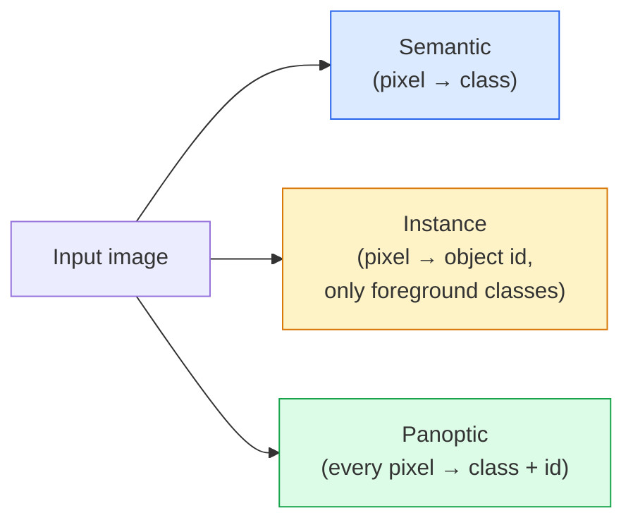
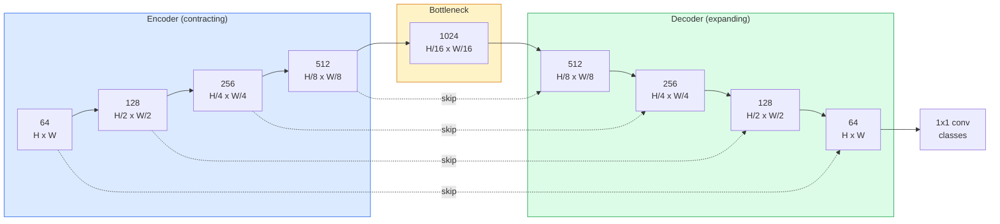

# 语义分割 — U-Net

> 分割就是对每个像素做分类。U-Net 通过把下采样编码器与上采样解码器配对，并在两者之间接上跳跃连接，让这件事真正可行。

**Type:** Build
**Languages:** Python
**Prerequisites:** Phase 4 Lesson 03 (CNNs), Phase 4 Lesson 04 (Image Classification)
**Time:** ~75 minutes

## 学习目标

- 区分语义分割、实例分割与全景分割，并为给定问题选对任务类型
- 用 PyTorch 从零构建 U-Net，包含编码器块、瓶颈层、带转置卷积的解码器以及跳跃连接
- 实现逐像素交叉熵、Dice 损失，以及当前医疗与工业分割领域默认采用的组合损失
- 解读逐类别的 IoU 和 Dice 指标，并诊断低分究竟来自小目标召回、边界精度还是类别不平衡

## 问题背景

分类对每张图像输出一个标签。检测对每张图像输出少量几个框。而分割对每个像素输出一个标签。对于尺寸为 `H x W` 的输入，输出是形状为 `H x W`（语义分割）或 `H x W x N_instances`（实例分割）的张量。这意味着每张图像有数百万个预测，而不是一个。

正是这种输出结构，让分割支撑了几乎所有密集预测类的视觉产品：医学影像（肿瘤掩码）、自动驾驶（道路、车道、障碍物）、卫星遥感（建筑轮廓、农田边界）、文档解析（版面区域）、机器人（可抓取区域）。这些任务没有一个能靠给目标画个框来解决，它们需要精确的轮廓。

架构层面的难题说起来简单，解决起来不简单：你需要网络同时看到图像的全局上下文（这是什么样的场景）和局部像素细节（哪个像素到底是马路还是人行道）。标准 CNN 通过空间压缩来获取上下文，但这会丢掉细节。U-Net 正是同时拿到这两者的那个设计。

## 核心概念

### 语义分割、实例分割与全景分割



- **语义分割**说的是「这个像素是道路，那个像素是汽车」。两辆挨在一起的汽车会合并成一团。
- **实例分割**说的是「这个像素属于 3 号车，那个像素属于 5 号车」。它忽略背景类（"stuff" = 天空、道路、草地）。
- **全景分割**统一了两者：每个像素都有类别标签，每个实例都有唯一 id，stuff 和 things 都被分割。

本课讲语义分割。下一课（Mask R-CNN）讲实例分割。

### U-Net 的结构形态



编码器把空间分辨率减半四次，同时把通道数翻倍。解码器反过来：把空间分辨率翻倍四次，同时把通道数减半。跳跃连接（skip connection）在每个分辨率上把对应的编码器特征与解码器特征拼接起来。最后的 1x1 卷积在全分辨率上完成 `64 -> num_classes` 的映射。

为什么跳跃连接是必需的：当解码器要输出像素级预测时，它见过的只有小尺寸的特征图。没有跳跃连接，它无法精确定位边缘，因为那些信息在编码器中已经被压缩掉了。跳跃连接把编码器在下采样过程中算出的高分辨率特征图直接交给它。

### 转置卷积与双线性上采样

解码器需要扩大空间尺寸。有两个选项：

- **转置卷积（transposed convolution）**（`nn.ConvTranspose2d`）— 可学习的上采样。U-Net 的历史默认方案。当步长和卷积核尺寸不能整除时，可能产生棋盘伪影（checkerboard artifacts）。
- **双线性上采样 + 3x3 卷积** — 先做平滑上采样，再接一个卷积。伪影更少、参数更少，是现在的主流默认方案。

两种方案在实际项目中都能见到。对于你的第一个 U-Net，双线性更稳妥。

### 像素网格上的交叉熵

对于 C 个类别的语义分割，模型输出是 `(N, C, H, W)`。目标是 `(N, H, W)`，元素为整数类别 ID。交叉熵与分类任务完全一致，只是应用在每个空间位置上：

```
Loss = mean over (n, h, w) of -log( softmax(logits[n, :, h, w])[target[n, h, w]] )
```

PyTorch 中的 `F.cross_entropy` 原生支持这种形状，不需要 reshape。

### Dice 损失及其必要性

交叉熵对每个像素一视同仁。当某一类在画面中占绝对多数时（医学影像：99% 背景、1% 肿瘤），这就出问题了。网络只要把所有像素都预测成背景，就能拿到 99% 的准确率，但依然毫无用处。

Dice 损失通过直接优化预测掩码与真实掩码之间的重叠来解决这个问题：

```
Dice(p, y) = 2 * sum(p * y) / (sum(p) + sum(y) + epsilon)
Dice_loss = 1 - Dice
```

其中 `p` 是某个类别的 sigmoid/softmax 概率图，`y` 是二值真值掩码。只有当重叠完美时损失才为零。由于它基于比值，类别不平衡对它没有影响。

实践中使用**组合损失**：

```
L = L_cross_entropy + lambda * L_dice       (lambda ~ 1)
```

交叉熵在训练早期提供稳定的梯度；Dice 让训练后期专注于真正匹配掩码的形状。这个组合是医学影像领域的默认做法，在任何类别不平衡的数据集上都很难被超越。

### 评估指标

- **像素准确率（pixel accuracy）** — 预测正确的像素百分比。计算便宜。在不平衡数据上失效，原因与分类任务中的准确率相同。
- **逐类别 IoU** — 每个类别掩码的交并比；对所有类别取平均即为 mIoU。
- **Dice（像素级 F1）** — 与 IoU 类似；`Dice = 2 * IoU / (1 + IoU)`。医学影像偏好 Dice，自动驾驶社区偏好 IoU；两者单调相关。
- **边界 F1（Boundary F1）** — 衡量预测边界与真值边界的接近程度，即使很小的偏移也会受罚。对半导体检测这类高精度任务很重要。

要报告逐类别的 IoU，而不只是 mIoU。当其他九个类别都在 85% 时，平均 IoU 会把一个只有 15% 的类别掩盖掉。

### 输入分辨率的权衡

U-Net 的编码器把分辨率减半四次，所以输入尺寸必须能被 16 整除。医学图像通常是 512x512 或 1024x1024。自动驾驶的裁剪图是 2048x1024。U-Net 的显存开销随 `H * W * C_max` 增长，在 1024x1024 输入、瓶颈层 1024 通道的情况下，单次前向传播就要消耗数 GB 显存。

两个标准的应对方法：
1. 对输入切块 — 以带重叠的 256x256 小块处理，再拼接回去。
2. 用空洞卷积（dilated convolution）替换瓶颈层，在保持较高空间分辨率的同时扩大感受野（DeepLab 系列）。

对于第一个模型，256x256 输入、基础通道数为 64 的 U-Net 在 8 GB 显存上可以轻松训练。

## 从零实现

### 第 1 步：编码器块

两个 3x3 卷积，各接批归一化（batch norm）和 ReLU。第一个卷积改变通道数；第二个保持不变。

```python
import torch
import torch.nn as nn
import torch.nn.functional as F

class DoubleConv(nn.Module):
    def __init__(self, in_c, out_c):
        super().__init__()
        self.net = nn.Sequential(
            nn.Conv2d(in_c, out_c, kernel_size=3, padding=1, bias=False),
            nn.BatchNorm2d(out_c),
            nn.ReLU(inplace=True),
            nn.Conv2d(out_c, out_c, kernel_size=3, padding=1, bias=False),
            nn.BatchNorm2d(out_c),
            nn.ReLU(inplace=True),
        )

    def forward(self, x):
        return self.net(x)
```

这个块在整个网络中反复使用。`bias=False` 是因为 BN 的 beta 已经承担了偏置的作用。

### 第 2 步：下采样块与上采样块

```python
class Down(nn.Module):
    def __init__(self, in_c, out_c):
        super().__init__()
        self.net = nn.Sequential(
            nn.MaxPool2d(2),
            DoubleConv(in_c, out_c),
        )

    def forward(self, x):
        return self.net(x)


class Up(nn.Module):
    def __init__(self, in_c, out_c):
        super().__init__()
        self.up = nn.Upsample(scale_factor=2, mode="bilinear", align_corners=False)
        self.conv = DoubleConv(in_c, out_c)

    def forward(self, x, skip):
        x = self.up(x)
        if x.shape[-2:] != skip.shape[-2:]:
            x = F.interpolate(x, size=skip.shape[-2:], mode="bilinear", align_corners=False)
        x = torch.cat([skip, x], dim=1)
        return self.conv(x)
```

只比较空间维度的形状检查（`shape[-2:]`）用于处理尺寸不能被 16 整除的输入；在拼接前用一次安全的 `F.interpolate` 把张量对齐。如果比较完整形状，通道数差异也会触发该分支，而通道数不匹配应该是一个响亮的报错，而不是一次悄无声息的插值。

### 第 3 步：U-Net 主体

```python
class UNet(nn.Module):
    def __init__(self, in_channels=3, num_classes=2, base=64):
        super().__init__()
        self.inc = DoubleConv(in_channels, base)
        self.d1 = Down(base, base * 2)
        self.d2 = Down(base * 2, base * 4)
        self.d3 = Down(base * 4, base * 8)
        self.d4 = Down(base * 8, base * 16)
        self.u1 = Up(base * 16 + base * 8, base * 8)
        self.u2 = Up(base * 8 + base * 4, base * 4)
        self.u3 = Up(base * 4 + base * 2, base * 2)
        self.u4 = Up(base * 2 + base, base)
        self.outc = nn.Conv2d(base, num_classes, kernel_size=1)

    def forward(self, x):
        x1 = self.inc(x)
        x2 = self.d1(x1)
        x3 = self.d2(x2)
        x4 = self.d3(x3)
        x5 = self.d4(x4)
        x = self.u1(x5, x4)
        x = self.u2(x, x3)
        x = self.u3(x, x2)
        x = self.u4(x, x1)
        return self.outc(x)

net = UNet(in_channels=3, num_classes=2, base=32)
x = torch.randn(1, 3, 256, 256)
print(f"output: {net(x).shape}")
print(f"params: {sum(p.numel() for p in net.parameters()):,}")
```

输出形状为 `(1, 2, 256, 256)` — 空间尺寸与输入相同，通道数为 `num_classes`。在 `base=32` 时约有 7.7M 参数。

### 第 4 步：损失函数

```python
def dice_loss(logits, targets, num_classes, eps=1e-6):
    probs = F.softmax(logits, dim=1)
    targets_one_hot = F.one_hot(targets, num_classes).permute(0, 3, 1, 2).float()
    dims = (0, 2, 3)
    intersection = (probs * targets_one_hot).sum(dim=dims)
    denom = probs.sum(dim=dims) + targets_one_hot.sum(dim=dims)
    dice = (2 * intersection + eps) / (denom + eps)
    return 1 - dice.mean()


def combined_loss(logits, targets, num_classes, lam=1.0):
    ce = F.cross_entropy(logits, targets)
    dc = dice_loss(logits, targets, num_classes)
    return ce + lam * dc, {"ce": ce.item(), "dice": dc.item()}
```

Dice 先按类别计算再取平均（macro Dice）。`eps` 防止批次中未出现的类别导致除零。

### 第 5 步：IoU 指标

```python
@torch.no_grad()
def iou_per_class(logits, targets, num_classes):
    preds = logits.argmax(dim=1)
    ious = torch.zeros(num_classes)
    for c in range(num_classes):
        pred_c = (preds == c)
        true_c = (targets == c)
        inter = (pred_c & true_c).sum().float()
        union = (pred_c | true_c).sum().float()
        ious[c] = (inter / union) if union > 0 else torch.tensor(float("nan"))
    return ious
```

返回一个长度为 C 的向量。`nan` 标记批次中未出现的类别 — 计算 mIoU 时不要把这些类别算进平均。

### 第 6 步：用于端到端验证的合成数据集

在彩色背景上生成几何形状，迫使网络学习形状，而不是像素颜色。

```python
import numpy as np
from torch.utils.data import Dataset, DataLoader

def synthetic_segmentation(num_samples=200, size=64, seed=0):
    rng = np.random.default_rng(seed)
    images = np.zeros((num_samples, size, size, 3), dtype=np.float32)
    masks = np.zeros((num_samples, size, size), dtype=np.int64)
    for i in range(num_samples):
        bg = rng.uniform(0, 1, (3,))
        images[i] = bg
        masks[i] = 0
        num_shapes = rng.integers(1, 4)
        for _ in range(num_shapes):
            cls = int(rng.integers(1, 3))
            color = rng.uniform(0, 1, (3,))
            cx, cy = rng.integers(10, size - 10, size=2)
            r = int(rng.integers(4, 12))
            yy, xx = np.meshgrid(np.arange(size), np.arange(size), indexing="ij")
            if cls == 1:
                mask = (xx - cx) ** 2 + (yy - cy) ** 2 < r ** 2
            else:
                mask = (np.abs(xx - cx) < r) & (np.abs(yy - cy) < r)
            images[i][mask] = color
            masks[i][mask] = cls
        images[i] += rng.normal(0, 0.02, images[i].shape)
        images[i] = np.clip(images[i], 0, 1)
    return images, masks


class SegDataset(Dataset):
    def __init__(self, images, masks):
        self.images = images
        self.masks = masks

    def __len__(self):
        return len(self.images)

    def __getitem__(self, i):
        img = torch.from_numpy(self.images[i]).permute(2, 0, 1).float()
        mask = torch.from_numpy(self.masks[i]).long()
        return img, mask
```

三个类别：背景（0）、圆形（1）、方形（2）。网络必须学会区分形状。

### 第 7 步：训练循环

```python
def train_one_epoch(model, loader, optimizer, device, num_classes):
    model.train()
    loss_sum, total = 0.0, 0
    iou_sum = torch.zeros(num_classes)
    for x, y in loader:
        x, y = x.to(device), y.to(device)
        logits = model(x)
        loss, _ = combined_loss(logits, y, num_classes)
        optimizer.zero_grad()
        loss.backward()
        optimizer.step()
        loss_sum += loss.item() * x.size(0)
        total += x.size(0)
        iou_sum += iou_per_class(logits, y, num_classes).nan_to_num(0)
    return loss_sum / total, iou_sum / len(loader)
```

在合成数据集上跑 10-30 个 epoch，可以看到形状类别的 mIoU 爬升超过 0.9。注意 `nan_to_num(0)` 把批次中未出现的类别当作零处理；若要得到精确的逐类别 IoU，评估时应按类别是否出现做掩码，并跨批次使用 `torch.nanmean`，而不是在这里直接取平均。

## 生产实践

在生产环境中，`segmentation_models_pytorch`（"smp"）封装了所有标准分割架构，可搭配任意 torchvision 或 timm 主干网络（backbone）。三行代码：

```python
import segmentation_models_pytorch as smp

model = smp.Unet(
    encoder_name="resnet34",
    encoder_weights="imagenet",
    in_channels=3,
    classes=3,
)
```

实际工作中还值得了解：
- **DeepLabV3+** 用空洞卷积替换基于最大池化的下采样，让瓶颈层保持分辨率；在卫星和驾驶数据上能更快得到清晰的边界。
- **SegFormer** 把卷积编码器换成层级式 Transformer；在许多基准上是当前 SOTA。
- **Mask2Former** / **OneFormer** 用单一架构统一了语义、实例和全景分割。

这三者在 `smp` 或 `transformers` 中都可以直接替换使用，数据加载器无需任何改动。

## 交付产物

本课产出：

- `outputs/prompt-segmentation-task-picker.md` — 一个提示词，用于在语义、实例和全景分割之间做选择，并为给定任务指定架构。
- `outputs/skill-segmentation-mask-inspector.md` — 一个技能，用于报告类别分布、预测掩码统计，以及哪些类别存在预测不足或边界模糊。

## 练习

1. **（简单）**为二分类分割任务（前景 vs 背景）实现 `bce_dice_loss`。在一个合成的两类数据集上验证：当前景仅占 5% 像素时，组合损失比单独使用 BCE 收敛更快。
2. **（中等）**把 `nn.Upsample + conv` 上采样块换成 `nn.ConvTranspose2d` 上采样块。在合成数据集上分别训练两者并比较 mIoU。观察转置卷积版本中棋盘伪影出现的位置。
3. **（困难）**取一个真实分割数据集（Oxford-IIIT Pets、Cityscapes mini split 或某个医学子集），把你的 U-Net 训练到与 `smp.Unet` 参考实现相差 2 个 IoU 点以内。报告逐类别 IoU，并找出哪些类别从加入 Dice 损失中获益最多。

## 关键术语

| 术语 | 常见说法 | 实际含义 |
|------|----------------|----------------------|
| 语义分割 | 「给每个像素打标签」 | 把每个像素分到 C 个类别之一；同类的多个实例会合并 |
| 实例分割 | 「给每个物体打标签」 | 区分同一类别的不同实例；只处理前景 |
| 全景分割 | 「语义 + 实例」 | 每个像素都有类别；每个 thing 实例还有唯一 id |
| 跳跃连接 | 「U-Net 的桥」 | 把编码器特征拼接到分辨率匹配的解码器特征中；保留高频细节 |
| 转置卷积 | 「反卷积」 | 可学习的上采样；可能产生棋盘伪影 |
| Dice 损失 | 「重叠损失」 | 1 - 2|A ∩ B| / (|A| + |B|)；直接优化掩码重叠，对类别不平衡稳健 |
| mIoU | 「平均交并比」 | 跨类别的 IoU 平均值；分割领域的社区标准指标 |
| 边界 F1 | 「边界精度」 | 只在边界像素上计算的 F1 分数；对精度敏感的任务很关键 |

## 延伸阅读

- [U-Net: Convolutional Networks for Biomedical Image Segmentation (Ronneberger et al., 2015)](https://arxiv.org/abs/1505.04597) — 原始论文；那张人人都在复制的架构图在第 2 页
- [Fully Convolutional Networks (Long et al., 2015)](https://arxiv.org/abs/1411.4038) — 第一篇把分割变成端到端卷积问题的论文
- [segmentation_models_pytorch](https://github.com/qubvel/segmentation_models.pytorch) — 生产级分割的参考实现；包含所有标准架构和所有标准损失
- [Lessons learned from training SOTA segmentation (kaggle.com competitions)](https://www.kaggle.com/code/iafoss/carvana-unet-pytorch) — 一篇实战梳理，讲解为什么 TTA、伪标签和类别权重在真实数据上至关重要
