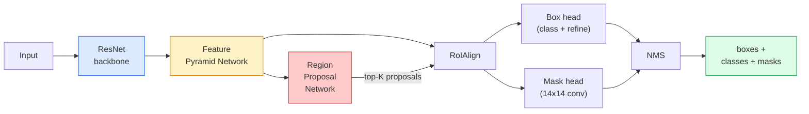

# 实例分割 — Mask R-CNN

> 给 Faster R-CNN 检测器加上一个小小的掩码分支，就得到了实例分割。难点在于 RoIAlign，而它比看上去更难。

**Type:** Build + Learn
**Languages:** Python
**Prerequisites:** Phase 4 Lesson 06 (YOLO), Phase 4 Lesson 07 (U-Net)
**Time:** ~75 minutes

## 学习目标

- 端到端梳理 Mask R-CNN 架构：骨干网络、FPN、RPN、RoIAlign、框头、掩码头
- 从零实现 RoIAlign，并解释为什么 RoIPool 已被淘汰
- 使用 torchvision 的 `maskrcnn_resnet50_fpn_v2` 预训练模型生成生产级实例掩码，并正确解读其输出格式
- 通过替换框头和掩码头、冻结骨干网络，在小型自定义数据集上微调 Mask R-CNN

## 问题背景

语义分割为每个类别给出一个掩码。实例分割为每个物体给出一个掩码，即使两个物体属于同一类别。统计个体数量、跨帧跟踪、测量物体（墙上每块砖的边界框、显微镜图像中的每个细胞）都需要实例分割。

Mask R-CNN（He et al., 2017）的解法是把实例分割重新表述为"检测加掩码"。这个设计如此简洁，以至于此后五年几乎所有实例分割论文都是 Mask R-CNN 的变体，而 torchvision 的实现至今仍是中小规模数据集上的生产默认选择。

真正困难的工程问题是采样：当候选框（proposal box）的角点不与像素边界对齐时，如何从中裁剪出固定尺寸的特征区域？这一步出错会在各处损失零点几个 mAP。RoIAlign 就是答案。

## 核心概念

### 架构



需要理解五个组件：

1. **骨干网络（Backbone）** — 在 ImageNet 上训练的 ResNet-50 或 ResNet-101。产生步长为 4、8、16、32 的特征图层级。
2. **FPN（特征金字塔网络，Feature Pyramid Network）** — 自顶向下加横向连接，让每一层都拥有 C 个通道的语义丰富特征。检测时根据物体尺寸查询对应的 FPN 层级。
3. **RPN（区域候选网络，Region Proposal Network）** — 一个小型卷积头，在每个锚点位置预测"这里有物体吗？"和"如何修正这个框？"。每张图像产生约 1000 个候选框。
4. **RoIAlign** — 从任意 FPN 层级上的任意框中采样固定尺寸（如 7x7）的特征块。双线性采样，没有量化。
5. **头部（Heads）** — 一个两层的框头负责修正框并判定类别，外加一个小型卷积头为每个候选框输出 `28x28` 的二值掩码。

### 为什么用 RoIAlign 而不是 RoIPool

最初的 Fast R-CNN 使用 RoIPool：它把候选框划分成网格，取每个格子内的最大特征值，并把所有坐标四舍五入为整数。这个取整操作会让特征图相对输入像素坐标错位最多一整个特征图像素——在 224x224 的图像上影响很小，但当特征图步长为 32 时则是灾难性的。

```
RoIPool:
  box (34.7, 51.3, 98.2, 142.9)
  round -> (34, 51, 98, 142)
  split grid -> round each cell boundary
  misalignment accumulates at every step

RoIAlign:
  box (34.7, 51.3, 98.2, 142.9)
  sample at exact float coordinates using bilinear interpolation
  no rounding anywhere
```

RoIAlign 在 COCO 上把掩码 AP 白白提升了 3-4 个点。如今所有在意定位精度的检测器都在用它——YOLOv7 seg、RT-DETR、Mask2Former 无一例外。

### 一段话讲清 RPN

在特征图的每个位置放置 K 个不同尺寸和形状的锚框（anchor box）。为每个锚框预测一个物体性（objectness）得分，以及把锚框修正为更贴合的框所需的回归偏移量。按得分保留前约 1000 个框，在 IoU 0.7 上做 NMS，把幸存者交给头部。RPN 用自己独立的小损失来训练——结构与第 6 课的 YOLO 损失相同，只是类别只有两个（有物体 / 无物体）。

### 掩码头

对每个候选框（经过 RoIAlign 之后），掩码头是一个微型 FCN：四个 3x3 卷积、一个 2 倍反卷积、最后一个 1x1 卷积在 `28x28` 分辨率上输出 `num_classes` 个通道。只保留与预测类别对应的通道，其余通道忽略。这把掩码预测与分类解耦了。

把 28x28 的掩码上采样到候选框的原始像素尺寸，即得到最终的二值掩码。

### 损失

Mask R-CNN 把四组损失相加：

```
L = L_rpn_cls + L_rpn_box + L_box_cls + L_box_reg + L_mask
```

- `L_rpn_cls`、`L_rpn_box` — RPN 候选框的物体性损失和框回归损失。
- `L_box_cls` — 头部分类器上 (C+1) 个类别（含背景）的交叉熵。
- `L_box_reg` — 头部框修正上的平滑 L1 损失。
- `L_mask` — 28x28 掩码输出上的逐像素二值交叉熵。

每项损失都有各自的默认权重；torchvision 的实现把它们作为构造函数参数暴露出来。

### 输出格式

`torchvision.models.detection.maskrcnn_resnet50_fpn_v2` 返回一个字典列表，每张图像对应一个字典：

```
{
    "boxes":  (N, 4) in (x1, y1, x2, y2) pixel coordinates,
    "labels": (N,) class IDs, 0 = background so indices are 1-based,
    "scores": (N,) confidence scores,
    "masks":  (N, 1, H, W) float masks in [0, 1] — threshold at 0.5 for binary,
}
```

掩码已经是完整图像分辨率。28x28 的头部输出已在内部完成上采样。

## 从零实现

### 第 1 步：从零实现 RoIAlign

这是 Mask R-CNN 中唯一一个用代码比用文字更容易理解的组件。

```python
import torch
import torch.nn.functional as F

def roi_align_single(feature, box, output_size=7, spatial_scale=1 / 16.0):
    """
    feature: (C, H, W) single-image feature map
    box: (x1, y1, x2, y2) in original image pixel coordinates
    output_size: side of the output grid (7 for box head, 14 for mask head)
    spatial_scale: reciprocal of the feature map stride
    """
    C, H, W = feature.shape
    x1, y1, x2, y2 = [c * spatial_scale - 0.5 for c in box]
    bin_w = (x2 - x1) / output_size
    bin_h = (y2 - y1) / output_size

    grid_y = torch.linspace(y1 + bin_h / 2, y2 - bin_h / 2, output_size)
    grid_x = torch.linspace(x1 + bin_w / 2, x2 - bin_w / 2, output_size)
    yy, xx = torch.meshgrid(grid_y, grid_x, indexing="ij")

    gx = 2 * (xx + 0.5) / W - 1
    gy = 2 * (yy + 0.5) / H - 1
    grid = torch.stack([gx, gy], dim=-1).unsqueeze(0)
    sampled = F.grid_sample(feature.unsqueeze(0), grid, mode="bilinear",
                            align_corners=False)
    return sampled.squeeze(0)
```

每个数值都来自双线性采样的位置。没有取整、没有量化、没有丢失的梯度。

### 第 2 步：与 torchvision 的 RoIAlign 对比

```python
from torchvision.ops import roi_align

feature = torch.randn(1, 16, 50, 50)
boxes = torch.tensor([[0, 10, 20, 100, 90]], dtype=torch.float32)  # (batch_idx, x1, y1, x2, y2)

ours = roi_align_single(feature[0], boxes[0, 1:].tolist(), output_size=7, spatial_scale=1/4)
theirs = roi_align(feature, boxes, output_size=(7, 7), spatial_scale=1/4, sampling_ratio=1, aligned=True)[0]

print(f"shape ours:   {tuple(ours.shape)}")
print(f"shape theirs: {tuple(theirs.shape)}")
print(f"max|diff|:    {(ours - theirs).abs().max().item():.3e}")
```

在 `sampling_ratio=1` 且 `aligned=True` 时，两者的差异在 `1e-5` 以内。

### 第 3 步：加载预训练 Mask R-CNN

```python
import torch
from torchvision.models.detection import maskrcnn_resnet50_fpn_v2, MaskRCNN_ResNet50_FPN_V2_Weights

model = maskrcnn_resnet50_fpn_v2(weights=MaskRCNN_ResNet50_FPN_V2_Weights.DEFAULT)
model.eval()
print(f"params: {sum(p.numel() for p in model.parameters()):,}")
print(f"classes (including background): {len(model.roi_heads.box_predictor.cls_score.out_features * [0])}")
```

4600 万参数，91 个类别（COCO）。第一个类别（id 0）是背景；模型实际能检测的物体从 id 1 开始。

### 第 4 步：运行推理

```python
with torch.no_grad():
    x = torch.randn(3, 400, 600)
    predictions = model([x])
p = predictions[0]
print(f"boxes:  {tuple(p['boxes'].shape)}")
print(f"labels: {tuple(p['labels'].shape)}")
print(f"scores: {tuple(p['scores'].shape)}")
print(f"masks:  {tuple(p['masks'].shape)}")
```

掩码张量的形状为 `(N, 1, H, W)`。以 0.5 为阈值即可得到每个物体的二值掩码：

```python
binary_masks = (p['masks'] > 0.5).squeeze(1)  # (N, H, W) boolean
```

### 第 5 步：替换头部以适配自定义类别数

常见的微调配方：复用骨干网络、FPN 和 RPN；替换两个分类器头。

```python
from torchvision.models.detection.faster_rcnn import FastRCNNPredictor
from torchvision.models.detection.mask_rcnn import MaskRCNNPredictor

def build_custom_maskrcnn(num_classes):
    model = maskrcnn_resnet50_fpn_v2(weights=MaskRCNN_ResNet50_FPN_V2_Weights.DEFAULT)
    in_features = model.roi_heads.box_predictor.cls_score.in_features
    model.roi_heads.box_predictor = FastRCNNPredictor(in_features, num_classes)
    in_features_mask = model.roi_heads.mask_predictor.conv5_mask.in_channels
    hidden_layer = 256
    model.roi_heads.mask_predictor = MaskRCNNPredictor(in_features_mask, hidden_layer, num_classes)
    return model

custom = build_custom_maskrcnn(num_classes=5)
print(f"custom cls_score.out_features: {custom.roi_heads.box_predictor.cls_score.out_features}")
```

`num_classes` 必须包含背景类，所以一个有 4 个物体类别的数据集应使用 `num_classes=5`。

### 第 6 步：冻结不需要训练的部分

在小数据集上，冻结骨干网络和 FPN。只让 RPN 的物体性预测和回归，以及两个头部参与学习。

```python
def freeze_backbone_and_fpn(model):
    # torchvision Mask R-CNN packs the FPN inside `model.backbone` (as
    # `model.backbone.fpn`), so iterating `model.backbone.parameters()` covers
    # both the ResNet feature layers and the FPN lateral/output convs.
    for p in model.backbone.parameters():
        p.requires_grad = False
    return model

custom = freeze_backbone_and_fpn(custom)
trainable = sum(p.numel() for p in custom.parameters() if p.requires_grad)
print(f"trainable after freeze: {trainable:,}")
```

在 500 张图像的数据集上，这就是收敛与过拟合之间的分水岭。

## 生产实践

torchvision 中 Mask R-CNN 的完整训练循环只有 40 行，在不同任务之间几乎没有实质性变化——换个数据集就能跑。

```python
def train_step(model, images, targets, optimizer):
    model.train()
    loss_dict = model(images, targets)
    losses = sum(loss for loss in loss_dict.values())
    optimizer.zero_grad()
    losses.backward()
    optimizer.step()
    return {k: v.item() for k, v in loss_dict.items()}
```

`targets` 列表中每张图像对应一个字典，必须包含 `boxes`、`labels` 和 `masks`（形状为 `(num_instances, H, W)` 的二值张量）。模型在训练时返回包含四项损失的字典，在评估时返回预测列表，由 `model.training` 决定。

`pycocotools` 评估器会同时给出框和掩码的 mAP@IoU=0.5:0.95；两个数字都要看，才能判断瓶颈在框头还是掩码头。

## 交付产物

本课产出：

- `outputs/prompt-instance-vs-semantic-router.md` — 一个提示词，通过三个问题在实例分割、语义分割、全景分割之间做出选择，并给出具体的起步模型。
- `outputs/skill-mask-rcnn-head-swapper.md` — 一个技能，给定新的 `num_classes`，为任意 torchvision 检测模型生成替换头部所需的 10 行代码。

## 练习

1. **（简单）** 在 100 个随机框上用 `torchvision.ops.roi_align` 验证你的 RoIAlign 实现。报告最大绝对差值。再运行 RoIPool（2017 年之前的行为），展示它在靠近边界的框上会偏离约 1-2 个特征图像素。
2. **（中等）** 在一个 50 张图像的自定义数据集上微调 `maskrcnn_resnet50_fpn_v2`（任选两个类别：气球、鱼、坑洼、logo）。冻结骨干网络，训练 20 个 epoch，报告掩码 AP@0.5。
3. **（困难）** 把 Mask R-CNN 的掩码头从 28x28 改为 56x56 的预测分辨率。测量改动前后的 mAP@IoU=0.75。解释为什么这个增益（或没有增益）符合预期的边界精度 / 显存权衡。

## 关键术语

| 术语 | 人们怎么说 | 实际含义 |
|------|----------------|----------------------|
| Mask R-CNN | "检测加掩码" | Faster R-CNN + 一个小型 FCN 头，为每个候选框的每个类别预测一个 28x28 掩码 |
| FPN | "特征金字塔" | 自顶向下加横向连接，让每个步长层级都拥有 C 个通道的语义丰富特征 |
| RPN | "区域候选器" | 一个小型卷积头，每张图像产生约 1000 个有物体/无物体的候选框 |
| RoIAlign | "不取整的裁剪" | 从任意浮点坐标的框中双线性采样出固定尺寸的特征网格 |
| RoIPool | "2017 年之前的裁剪" | 用途与 RoIAlign 相同，但会对框坐标取整；已淘汰 |
| Mask AP | "实例 mAP" | 用掩码 IoU 而非框 IoU 计算的平均精度；COCO 实例分割指标 |
| 二值掩码头 | "逐类别掩码" | 为每个候选框的每个类别预测一个二值掩码；只保留预测类别对应的通道 |
| 背景类 | "类别 0" | 兜底的"无物体"类别；真实类别的索引从 1 开始 |

## 延伸阅读

- [Mask R-CNN (He et al., 2017)](https://arxiv.org/abs/1703.06870) — 原论文；第 3 节关于 RoIAlign 的部分是必读
- [FPN: Feature Pyramid Networks (Lin et al., 2017)](https://arxiv.org/abs/1612.03144) — FPN 论文；所有现代检测器都在用它
- [torchvision Mask R-CNN tutorial](https://pytorch.org/tutorials/intermediate/torchvision_tutorial.html) — 微调训练循环的参考实现
- [Detectron2 model zoo](https://github.com/facebookresearch/detectron2/blob/main/MODEL_ZOO.md) — 几乎覆盖所有检测和分割变体的生产级实现及训练好的权重
