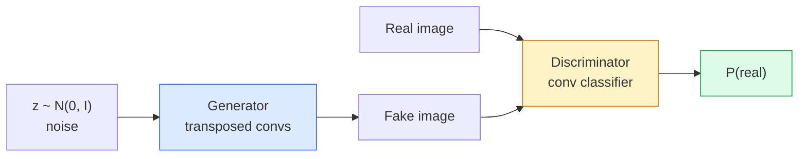
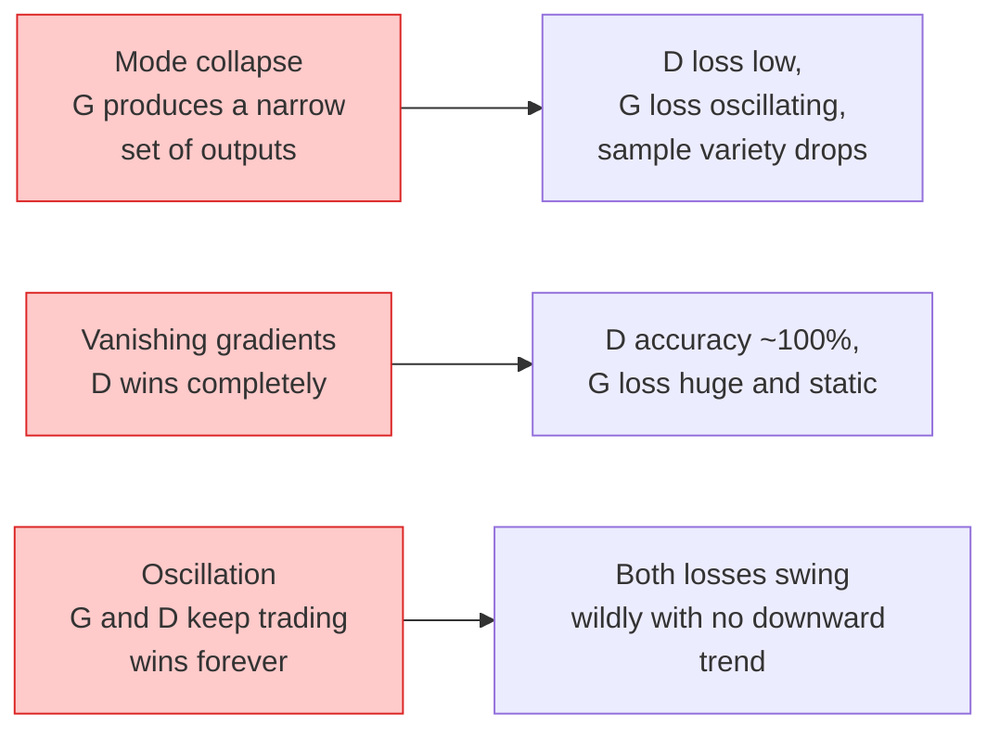

# 图像生成 — GAN

> GAN 是两个在固定博弈中对抗的神经网络。一个负责画，一个负责挑刺。它们彼此促进，直到画出的图骗过了挑刺的那个。

**Type:** Build
**Languages:** Python
**Prerequisites:** Phase 4 Lesson 03 (CNNs), Phase 3 Lesson 06 (Optimizers), Phase 3 Lesson 07 (Regularization)
**Time:** ~75 minutes

## 学习目标

- 解释生成器与判别器之间的极小极大博弈（minimax game），以及为什么均衡点对应 p_model = p_data
- 用 PyTorch 实现一个 DCGAN，在不到 60 行代码内让它生成连贯的 32x32 合成图像
- 用三个标准技巧稳定 GAN 训练：非饱和损失（non-saturating loss）、谱归一化（spectral norm）、TTUR（双时间尺度更新规则）
- 读懂训练曲线，区分健康收敛、模式坍塌（mode collapse）、震荡，以及判别器完胜这几种情形

## 问题背景

分类任务教网络把图像映射到标签。生成任务把问题反过来：采样出看起来像来自同一分布的新图像。这里没有可以逐一比对的"正确"输出，只有一个你想要模仿的分布。

标准损失函数（MSE、交叉熵）无法度量"这个样本是否来自真实分布"。最小化逐像素误差只会产生模糊的平均图，而不是逼真的样本。突破性的想法是把损失本身学出来：训练第二个网络，专门负责分辨真假，再用它的判断来推动生成器。

GAN（Goodfellow et al., 2014）定义了这个框架。到 2018 年，StyleGAN 已经能生成与照片难以区分的 1024x1024 人脸。扩散模型如今在质量和可控性上已经登顶，但让扩散模型变得实用的每一个技巧——归一化方案、潜空间、特征损失——都是先在 GAN 上摸索清楚的。

## 核心概念

### 两个网络



**生成器**（Generator）G 接收一个噪声向量 `z`，输出一张图像。**判别器**（Discriminator）D 接收一张图像，输出一个标量：这张图像是真实图像的概率。

### 博弈

G 想让 D 判断出错，D 想判断正确。形式化地写：

```
min_G max_D  E_x[log D(x)] + E_z[log(1 - D(G(z)))]
```

从右往左读：D 在最大化它对真实图像（`log D(real)`）和伪造图像（`log (1 - D(fake))`）的判断准确率。G 在最小化 D 对伪造图像的准确率——它希望 `D(G(z))` 越大越好。

Goodfellow 证明了这个极小极大博弈存在全局均衡：此时 `p_G = p_data`，D 处处输出 0.5，生成分布与真实分布之间的 Jensen-Shannon 散度为零。难的是怎么走到那里。

### 非饱和损失

上面的形式在数值上不稳定。训练初期，每个伪造样本的 `D(G(z))` 都接近零，于是 `log(1 - D(G(z)))` 对 G 的梯度会消失。修复方法：翻转 G 的损失。

```
L_D = -E_x[log D(x)] - E_z[log(1 - D(G(z)))]
L_G = -E_z[log D(G(z))]                          # non-saturating
```

现在当 `D(G(z))` 接近零时，G 的损失很大，梯度信息充足。所有现代 GAN 都用这个变体训练。

### DCGAN 架构规则

Radford、Metz、Chintala（2015）把多年的失败实验提炼成五条让 GAN 训练稳定的规则：

1. 用带步幅的卷积（strided convs）替换池化（两个网络都是）。
2. 在生成器和判别器中都使用批归一化（batch norm），但 G 的输出层和 D 的输入层除外。
3. 在更深的架构中去掉全连接层。
4. G 除输出层外全部使用 ReLU（输出层用 tanh，把输出限制在 [-1, 1]）。
5. D 所有层使用 LeakyReLU（negative_slope=0.2）。

所有现代基于卷积的 GAN（StyleGAN、BigGAN、GigaGAN）至今仍以这些规则为起点，再逐项替换。

### 失败模式及其特征



- **模式坍塌**：G 找到一张能骗过 D 的图像后就只生成那一张。修复：加入小批量判别（minibatch discrimination）、谱归一化，或类别条件化。
- **判别器完胜**：D 太快变得太强，G 的梯度消失。修复：缩小 D、降低 D 的学习率，或对真实标签做标签平滑（label smoothing）。
- **震荡**：两个网络互有胜负，但永远不靠近均衡。修复：TTUR（让 D 的学习速度比 G 快 2-4 倍），或改用 Wasserstein 损失。

### 评估

GAN 没有真值（ground truth），那怎么知道它在正常工作？

- **样本目检** — 每个 epoch 结束时直接看 64 张样本。没有商量余地。
- **FID（Fréchet Inception Distance）** — 真实图像集与生成图像集在 Inception-v3 特征分布上的距离。越低越好。社区标准。
- **Inception Score** — 更老、更脆弱；优先用 FID。
- **生成模型的精确率/召回率** — 分别度量质量（精确率）和覆盖度（召回率）。比单独看 FID 信息量更大。

对于小规模合成数据实验，样本目检就够了。

## 从零实现

### 第 1 步：生成器

一个小型 DCGAN 生成器，接收 64 维噪声，产出一张 32x32 图像。

```python
import torch
import torch.nn as nn

class Generator(nn.Module):
    def __init__(self, z_dim=64, img_channels=3, feat=64):
        super().__init__()
        self.net = nn.Sequential(
            nn.ConvTranspose2d(z_dim, feat * 4, kernel_size=4, stride=1, padding=0, bias=False),
            nn.BatchNorm2d(feat * 4),
            nn.ReLU(inplace=True),
            nn.ConvTranspose2d(feat * 4, feat * 2, kernel_size=4, stride=2, padding=1, bias=False),
            nn.BatchNorm2d(feat * 2),
            nn.ReLU(inplace=True),
            nn.ConvTranspose2d(feat * 2, feat, kernel_size=4, stride=2, padding=1, bias=False),
            nn.BatchNorm2d(feat),
            nn.ReLU(inplace=True),
            nn.ConvTranspose2d(feat, img_channels, kernel_size=4, stride=2, padding=1, bias=False),
            nn.Tanh(),
        )

    def forward(self, z):
        return self.net(z.view(z.size(0), -1, 1, 1))
```

四个转置卷积，每个都用 `kernel_size=4, stride=2, padding=1`，这样空间尺寸恰好逐层翻倍。输出经 tanh 激活，落在 [-1, 1]。

### 第 2 步：判别器

生成器的镜像。LeakyReLU、带步幅的卷积，最后输出一个标量 logit。

```python
class Discriminator(nn.Module):
    def __init__(self, img_channels=3, feat=64):
        super().__init__()
        self.net = nn.Sequential(
            nn.Conv2d(img_channels, feat, kernel_size=4, stride=2, padding=1),
            nn.LeakyReLU(0.2, inplace=True),
            nn.Conv2d(feat, feat * 2, kernel_size=4, stride=2, padding=1, bias=False),
            nn.BatchNorm2d(feat * 2),
            nn.LeakyReLU(0.2, inplace=True),
            nn.Conv2d(feat * 2, feat * 4, kernel_size=4, stride=2, padding=1, bias=False),
            nn.BatchNorm2d(feat * 4),
            nn.LeakyReLU(0.2, inplace=True),
            nn.Conv2d(feat * 4, 1, kernel_size=4, stride=1, padding=0),
        )

    def forward(self, x):
        return self.net(x).view(-1)
```

最后一个卷积把 `4x4` 特征图压缩到 `1x1`。每张图像输出一个标量；sigmoid 只在计算损失时才施加。

### 第 3 步：训练步

交替进行：每个 batch 先更新一次 D，再更新一次 G。

```python
import torch.nn.functional as F

def train_step(G, D, real, z, opt_g, opt_d, device):
    real = real.to(device)
    bs = real.size(0)

    # D step
    opt_d.zero_grad()
    d_real = D(real)
    d_fake = D(G(z).detach())
    loss_d = (F.binary_cross_entropy_with_logits(d_real, torch.ones_like(d_real))
              + F.binary_cross_entropy_with_logits(d_fake, torch.zeros_like(d_fake)))
    loss_d.backward()
    opt_d.step()

    # G step
    opt_g.zero_grad()
    d_fake = D(G(z))
    loss_g = F.binary_cross_entropy_with_logits(d_fake, torch.ones_like(d_fake))
    loss_g.backward()
    opt_g.step()

    return loss_d.item(), loss_g.item()
```

D 更新步骤中的 `G(z).detach()` 至关重要：在更新 D 时，我们不希望梯度流回 G。忘记这一点是新手的经典 bug。

### 第 4 步：在合成形状数据上跑完整训练循环

```python
from torch.utils.data import DataLoader, TensorDataset
import numpy as np

def synthetic_images(num=2000, size=32, seed=0):
    rng = np.random.default_rng(seed)
    imgs = np.zeros((num, 3, size, size), dtype=np.float32) - 1.0
    for i in range(num):
        r = rng.uniform(6, 12)
        cx, cy = rng.uniform(r, size - r, size=2)
        yy, xx = np.meshgrid(np.arange(size), np.arange(size), indexing="ij")
        mask = (xx - cx) ** 2 + (yy - cy) ** 2 < r ** 2
        color = rng.uniform(-0.5, 1.0, size=3)
        for c in range(3):
            imgs[i, c][mask] = color[c]
    return torch.from_numpy(imgs)

device = "cuda" if torch.cuda.is_available() else "cpu"
data = synthetic_images()
loader = DataLoader(TensorDataset(data), batch_size=64, shuffle=True)

G = Generator(z_dim=64, img_channels=3, feat=32).to(device)
D = Discriminator(img_channels=3, feat=32).to(device)
opt_g = torch.optim.Adam(G.parameters(), lr=2e-4, betas=(0.5, 0.999))
opt_d = torch.optim.Adam(D.parameters(), lr=2e-4, betas=(0.5, 0.999))

for epoch in range(10):
    for (batch,) in loader:
        z = torch.randn(batch.size(0), 64, device=device)
        ld, lg = train_step(G, D, batch, z, opt_g, opt_d, device)
    print(f"epoch {epoch}  D {ld:.3f}  G {lg:.3f}")
```

`Adam(lr=2e-4, betas=(0.5, 0.999))` 是 DCGAN 的默认配置——较低的 beta1 防止动量项把这个对抗博弈"稳"过了头。

### 第 5 步：采样

```python
@torch.no_grad()
def sample(G, n=16, z_dim=64, device="cpu"):
    G.eval()
    z = torch.randn(n, z_dim, device=device)
    imgs = G(z)
    imgs = (imgs + 1) / 2
    return imgs.clamp(0, 1)
```

采样前一定要切换到 eval 模式。对 DCGAN 来说这很关键，因为此时批归一化会使用滑动统计量，而不是当前 batch 的统计量。

### 第 6 步：谱归一化

判别器中 BN 的直接替代品，保证网络是 1-Lipschitz 的。能修复大多数"D 赢得太狠"的失败。

```python
from torch.nn.utils import spectral_norm

def build_sn_discriminator(img_channels=3, feat=64):
    return nn.Sequential(
        spectral_norm(nn.Conv2d(img_channels, feat, 4, 2, 1)),
        nn.LeakyReLU(0.2, inplace=True),
        spectral_norm(nn.Conv2d(feat, feat * 2, 4, 2, 1)),
        nn.LeakyReLU(0.2, inplace=True),
        spectral_norm(nn.Conv2d(feat * 2, feat * 4, 4, 2, 1)),
        nn.LeakyReLU(0.2, inplace=True),
        spectral_norm(nn.Conv2d(feat * 4, 1, 4, 1, 0)),
    )
```

把 `Discriminator` 换成 `build_sn_discriminator()`，通常就不再需要 TTUR 技巧了。谱归一化是你能用的、性价比最高的单项稳健性升级。

## 生产实践

要做正经的图像生成，请使用预训练权重或改用扩散模型。两个标准库：

- `torch_fidelity` 直接在你的生成器上计算 FID / IS，不用自己写评估代码。
- `pytorch-gan-zoo`（已停止维护）和 `StudioGAN` 提供经过测试的 DCGAN、WGAN-GP、SN-GAN、StyleGAN、BigGAN 实现。

到 2026 年，GAN 仍是这些场景的最佳选择：实时图像生成（延迟 <10 ms）、风格迁移、需要精确控制的图像到图像翻译（Pix2Pix、CycleGAN）。扩散模型在照片级真实感和文本条件控制上占优。

## 交付产物

本课产出：

- `outputs/prompt-gan-training-triage.md` — 一个提示词：读取训练曲线的描述，判断失败模式（模式坍塌、D 完胜、震荡），并给出唯一推荐的修复方案。
- `outputs/skill-dcgan-scaffold.md` — 一个技能：根据 `z_dim`、目标 `image_size` 和 `num_channels` 生成 DCGAN 脚手架，包含训练循环和样本保存器。

## 练习

1. **（简单）** 在合成圆形数据集上训练上面的 DCGAN，并在每个 epoch 结束时保存一张 16 样本的网格图。到第几个 epoch 时生成的圆形变得明显是圆的？
2. **（中等）** 把判别器的批归一化换成谱归一化。并行训练两个版本。哪个收敛更快？哪个在三个随机种子下方差更小？
3. **（困难）** 实现条件 DCGAN：把类别标签同时喂给 G 和 D（在 G 中把 one-hot 拼接到噪声上，在 D 中拼接一个类别嵌入通道）。在第 7 课的"圆形 vs 方形"合成数据集上训练，并通过指定标签采样来证明类别条件化是有效的。

## 关键术语

| 术语 | 大家怎么说 | 实际含义 |
|------|----------------|----------------------|
| 生成器（G） | "画东西的网络" | 把噪声映射成图像；训练目标是骗过判别器 |
| 判别器（D） | "评论家" | 二分类器；训练目标是区分真实图像与生成图像 |
| 极小极大（Minimax） | "那场博弈" | 对一个对抗损失，G 取 min、D 取 max；均衡点是 p_G = p_data |
| 非饱和损失 | "数值上正常的版本" | G 的损失用 -log(D(G(z))) 而不是 log(1 - D(G(z)))，避免训练初期梯度消失 |
| 模式坍塌 | "生成器只会做一件事" | G 只生成数据分布中的一小部分；用谱归一化、小批量判别或更大的 batch 修复 |
| TTUR | "两个学习率" | D 的学习速度比 G 快，通常快 2-4 倍；用于稳定训练 |
| 谱归一化 | "1-Lipschitz 层" | 一种权重归一化，约束每层的 Lipschitz 常数；防止 D 变得任意陡峭 |
| FID | "Fréchet Inception Distance" | 真实图像集与生成图像集在 Inception-v3 特征分布上的距离；标准评估指标 |

## 延伸阅读

- [Generative Adversarial Networks (Goodfellow et al., 2014)](https://arxiv.org/abs/1406.2661) — 开创这一切的论文
- [DCGAN (Radford, Metz, Chintala, 2015)](https://arxiv.org/abs/1511.06434) — 让 GAN 变得可训练的架构规则
- [Spectral Normalization for GANs (Miyato et al., 2018)](https://arxiv.org/abs/1802.05957) — 单项最有用的稳定化技巧
- [StyleGAN3 (Karras et al., 2021)](https://arxiv.org/abs/2106.12423) — SOTA 级 GAN；读起来像过去十年所有技巧的精选合辑
