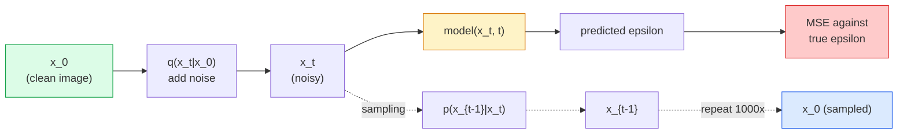

# 图像生成 — 扩散模型

> 扩散模型学习的是去噪。训练它从一张带噪图像中去掉一点点噪声，再把这个过程反向重复一千次，你就得到了一个图像生成器。

**Type:** Build
**Languages:** Python
**Prerequisites:** Phase 4 Lesson 07 (U-Net), Phase 1 Lesson 06 (Probability), Phase 3 Lesson 06 (Optimizers)
**Time:** ~75 minutes

## 学习目标

- 推导前向加噪过程 `x_0 -> x_1 -> ... -> x_T`，并解释为什么闭式解 `q(x_t | x_0)` 对任意 t 都成立
- 实现 DDPM 风格的训练目标——回归每一步所添加的噪声——以及一个从纯噪声逐步走回图像的采样器
- 构建一个时间条件化的 U-Net（小到可以在 CPU 上训练），能为任意时间步预测噪声
- 解释 DDPM 与 DDIM 采样的区别，以及各自的适用场景（第 23 课会深入讲解流匹配和 rectified flow）

## 问题背景

GAN 的生成是一次性的：噪声进，图像出，一次前向传播。它们速度快，但训练困难。扩散模型的生成是迭代式的：从纯噪声出发，小步去噪，图像逐渐浮现。它们速度慢，但训练容易。过去五年里，后一个特性占据了主导地位：任何小团队都能训练出一个扩散模型并得到像样的样本；而 GAN 训练是一门要靠多年失败实验才能练成的手艺。

除了训练稳定性之外，扩散模型的迭代结构正是现代图像生成所有能力的来源：文本条件控制、图像修复（inpainting）、图像编辑、超分辨率、可控风格。采样循环的每一步都是注入新约束的入口。正是这个挂载点，让 Stable Diffusion、Imagen、DALL-E 3、Midjourney 以及你将来会用到的每一个可控图像模型，全部建立在扩散之上。

本课构建一个最小化的 DDPM：前向加噪、反向去噪、训练循环。下一课（Stable Diffusion）会把它接入一个生产级系统，加入 VAE、文本编码器和无分类器引导（classifier-free guidance）。

## 核心概念

### 前向过程

取一张图像 `x_0`。加入一点点高斯噪声得到 `x_1`。再加一点点得到 `x_2`。持续 T 步，直到 `x_T` 几乎与纯高斯噪声无法区分。

```
q(x_t | x_{t-1}) = N(x_t; sqrt(1 - beta_t) * x_{t-1},  beta_t * I)
```

`beta_t` 是一个很小的方差调度（variance schedule），通常在 T=1000 步内从 0.0001 线性增长到 0.02。每一步都轻微地缩小信号，并注入新的噪声。

### 闭式跳跃

逐步加噪是一条马尔可夫链，但数学上可以折叠：你可以从 `x_0` 一步直接采样出 `x_t`。

```
Define alpha_t = 1 - beta_t
Define alpha_bar_t = prod_{s=1..t} alpha_s

Then:
  q(x_t | x_0) = N(x_t; sqrt(alpha_bar_t) * x_0,  (1 - alpha_bar_t) * I)

Equivalently:
  x_t = sqrt(alpha_bar_t) * x_0 + sqrt(1 - alpha_bar_t) * epsilon
  where epsilon ~ N(0, I)
```

这一个等式就是扩散模型可行的全部原因。训练时随机挑一个 `t`，直接从 `x_0` 采样出 `x_t`，一步完成训练——完全不需要模拟整条马尔可夫链。

### 反向过程

前向过程是固定的。神经网络要学的是反向过程 `p(x_{t-1} | x_t)`。扩散模型并不直接预测 `x_{t-1}`，而是预测第 t 步加入的噪声 `epsilon`，再由数学公式从中推导出 `x_{t-1}`。



### 训练损失

每个训练步骤：

1. 采样一张真实图像 `x_0`。
2. 从 [1, T] 中均匀采样一个时间步 `t`。
3. 采样噪声 `epsilon ~ N(0, I)`。
4. 计算 `x_t = sqrt(alpha_bar_t) * x_0 + sqrt(1 - alpha_bar_t) * epsilon`。
5. 用网络预测 `epsilon_theta(x_t, t)`。
6. 最小化 `|| epsilon - epsilon_theta(x_t, t) ||^2`。

就这么多。神经网络学会在任意时间步预测噪声。损失就是 MSE。没有对抗博弈，没有模式坍塌，没有震荡。

### 采样器（DDPM）

生成时：从 `x_T ~ N(0, I)` 出发，一步一步往回走。

```
for t = T, T-1, ..., 1:
    eps = model(x_t, t)
    x_{t-1} = (1 / sqrt(alpha_t)) * (x_t - (beta_t / sqrt(1 - alpha_bar_t)) * eps) + sqrt(beta_t) * z
    where z ~ N(0, I) if t > 1, else 0
return x_0
```

关键在于：尽管一般情况下反向条件分布没有闭式解，但对这个特定的高斯前向过程来说是有的。那些看起来难看的系数，正是贝叶斯法则给出的结果。

### 为什么是 1000 步

前向噪声调度的设计原则是：每一步加入的噪声恰好足够小，使得对应的反向步近似为高斯分布。步数太少，反向步偏离高斯太远，网络无法建模好；步数太多，采样代价高昂而收益递减。T=1000 配线性调度是 DDPM 的默认设置。

### DDIM：快 20 倍的采样

训练不变，变的是采样。DDIM（Song et al., 2020）定义了一个确定性的反向过程，可以跳过时间步而无需重新训练。用 DDIM 采样 50 步，质量已接近 DDPM 的 1000 步。所有生产系统都使用 DDIM 或更快的变体（DPM-Solver、Euler ancestral）。

### 时间条件化

网络 `epsilon_theta(x_t, t)` 需要知道自己正在为哪个时间步去噪。现代扩散模型通过正弦时间嵌入（sinusoidal time embedding，与 Transformer 中位置编码的思路相同）注入 `t`，该嵌入会被加到 U-Net 每一层的特征图上。

```
t_embedding = sinusoidal(t)
feature_map += MLP(t_embedding)
```

如果没有时间条件化，网络就得从图像本身猜测噪声水平——虽然也能工作，但样本效率会差很多。

## 从零实现

### 第 1 步：噪声调度

```python
import torch

def linear_beta_schedule(T=1000, beta_start=1e-4, beta_end=2e-2):
    return torch.linspace(beta_start, beta_end, T)


def precompute_schedule(betas):
    alphas = 1.0 - betas
    alphas_cumprod = torch.cumprod(alphas, dim=0)
    return {
        "betas": betas,
        "alphas": alphas,
        "alphas_cumprod": alphas_cumprod,
        "sqrt_alphas_cumprod": torch.sqrt(alphas_cumprod),
        "sqrt_one_minus_alphas_cumprod": torch.sqrt(1.0 - alphas_cumprod),
        "sqrt_recip_alphas": torch.sqrt(1.0 / alphas),
    }

schedule = precompute_schedule(linear_beta_schedule(T=1000))
```

预先计算一次，训练和采样时按索引取用。

### 第 2 步：前向扩散（q_sample）

```python
def q_sample(x0, t, noise, schedule):
    sqrt_a = schedule["sqrt_alphas_cumprod"][t].view(-1, 1, 1, 1)
    sqrt_one_minus_a = schedule["sqrt_one_minus_alphas_cumprod"][t].view(-1, 1, 1, 1)
    return sqrt_a * x0 + sqrt_one_minus_a * noise
```

一行闭式解。`t` 是一批时间步，批次中每张图像对应一个。

### 第 3 步：一个微型时间条件化 U-Net

```python
import torch.nn as nn
import torch.nn.functional as F
import math

def timestep_embedding(t, dim=64):
    half = dim // 2
    freqs = torch.exp(-math.log(10000) * torch.arange(half, device=t.device) / half)
    args = t[:, None].float() * freqs[None]
    emb = torch.cat([args.sin(), args.cos()], dim=-1)
    return emb


class TinyUNet(nn.Module):
    def __init__(self, img_channels=3, base=32, t_dim=64):
        super().__init__()
        self.t_mlp = nn.Sequential(
            nn.Linear(t_dim, base * 4),
            nn.SiLU(),
            nn.Linear(base * 4, base * 4),
        )
        self.t_dim = t_dim
        self.enc1 = nn.Conv2d(img_channels, base, 3, padding=1)
        self.enc2 = nn.Conv2d(base, base * 2, 4, stride=2, padding=1)
        self.mid = nn.Conv2d(base * 2, base * 2, 3, padding=1)
        self.dec1 = nn.ConvTranspose2d(base * 2, base, 4, stride=2, padding=1)
        self.dec2 = nn.Conv2d(base * 2, img_channels, 3, padding=1)
        self.time_proj = nn.Linear(base * 4, base * 2)

    def forward(self, x, t):
        t_emb = timestep_embedding(t, self.t_dim)
        t_emb = self.t_mlp(t_emb)
        t_proj = self.time_proj(t_emb)[:, :, None, None]

        h1 = F.silu(self.enc1(x))
        h2 = F.silu(self.enc2(h1)) + t_proj
        h3 = F.silu(self.mid(h2))
        d1 = F.silu(self.dec1(h3))
        d2 = torch.cat([d1, h1], dim=1)
        return self.dec2(d2)
```

一个两层的 U-Net，在瓶颈处注入时间条件。处理真实图像时把深度和宽度按比例放大即可。

### 第 4 步：训练循环

```python
def train_step(model, x0, schedule, optimizer, device, T=1000):
    model.train()
    x0 = x0.to(device)
    bs = x0.size(0)
    t = torch.randint(0, T, (bs,), device=device)
    noise = torch.randn_like(x0)
    x_t = q_sample(x0, t, noise, schedule)
    pred = model(x_t, t)
    loss = F.mse_loss(pred, noise)
    optimizer.zero_grad()
    loss.backward()
    optimizer.step()
    return loss.item()
```

这就是完整的训练循环。没有 GAN 博弈，没有特殊损失函数，只有一次 MSE 调用。

### 第 5 步：采样器（DDPM）

```python
@torch.no_grad()
def sample(model, schedule, shape, T=1000, device="cpu"):
    model.eval()
    x = torch.randn(shape, device=device)
    betas = schedule["betas"].to(device)
    sqrt_one_minus_a = schedule["sqrt_one_minus_alphas_cumprod"].to(device)
    sqrt_recip_alphas = schedule["sqrt_recip_alphas"].to(device)

    for t in reversed(range(T)):
        t_batch = torch.full((shape[0],), t, dtype=torch.long, device=device)
        eps = model(x, t_batch)
        coef = betas[t] / sqrt_one_minus_a[t]
        mean = sqrt_recip_alphas[t] * (x - coef * eps)
        if t > 0:
            x = mean + torch.sqrt(betas[t]) * torch.randn_like(x)
        else:
            x = mean
    return x
```

生成一批样本需要 1000 次前向传播。实际代码中你会把它换成 50 步的 DDIM 采样器。

### 第 6 步：DDIM 采样器（确定性，快约 20 倍）

```python
@torch.no_grad()
def sample_ddim(model, schedule, shape, steps=50, T=1000, device="cpu", eta=0.0):
    model.eval()
    x = torch.randn(shape, device=device)
    alphas_cumprod = schedule["alphas_cumprod"].to(device)

    ts = torch.linspace(T - 1, 0, steps + 1).long()
    for i in range(steps):
        t = ts[i]
        t_prev = ts[i + 1]
        t_batch = torch.full((shape[0],), t, dtype=torch.long, device=device)
        eps = model(x, t_batch)
        a_t = alphas_cumprod[t]
        a_prev = alphas_cumprod[t_prev] if t_prev >= 0 else torch.tensor(1.0, device=device)
        x0_pred = (x - torch.sqrt(1 - a_t) * eps) / torch.sqrt(a_t)
        sigma = eta * torch.sqrt((1 - a_prev) / (1 - a_t) * (1 - a_t / a_prev))
        dir_xt = torch.sqrt(1 - a_prev - sigma ** 2) * eps
        noise = sigma * torch.randn_like(x) if eta > 0 else 0
        x = torch.sqrt(a_prev) * x0_pred + dir_xt + noise
    return x
```

`eta=0` 时完全确定（相同的噪声输入总会产生相同的输出）。`eta=1` 时退化为 DDPM。

## 生产实践

生产环境中请使用 `diffusers`：

```python
from diffusers import DDPMScheduler, UNet2DModel

unet = UNet2DModel(sample_size=32, in_channels=3, out_channels=3, layers_per_block=2)
scheduler = DDPMScheduler(num_train_timesteps=1000)
```

该库自带现成的调度器（DDPM、DDIM、DPM-Solver、Euler、Heun）、可配置的 U-Net、文生图和图生图的 pipeline，以及 LoRA 微调工具。

做研究的话，`k-diffusion`（Katherine Crowson）拥有最忠实于原文的参考实现和最好的采样变体。

## 交付产物

本课产出：

- `outputs/prompt-diffusion-sampler-picker.md` — 一个提示词，根据质量目标、延迟预算和条件类型来选择 DDPM / DDIM / DPM-Solver / Euler。
- `outputs/skill-noise-schedule-designer.md` — 一个技能，给定 T 和目标加噪程度后生成线性、余弦或 sigmoid 的 beta 调度，并附带信噪比随时间变化的诊断图。

## 练习

1. **（简单）** 可视化前向过程：取一张图像，绘制 `t in [0, 100, 250, 500, 750, 1000]` 处的 `x_t`。验证 `x_1000` 看起来像纯高斯噪声。
2. **（中等）** 在合成圆形数据集上训练 TinyUNet 20 个 epoch，采样 16 个圆形。对比 DDPM（1000 步）和 DDIM（50 步）的采样结果——相同的噪声种子下，它们生成的图像相似吗？
3. **（困难）** 实现余弦噪声调度（Nichol & Dhariwal, 2021）：`alpha_bar_t = cos^2((t/T + s) / (1 + s) * pi / 2)`。分别用线性和余弦调度训练同一个模型，证明余弦调度在低步数下能给出更好的样本。

## 关键术语

| 术语 | 大家怎么说 | 实际含义 |
|------|----------------|----------------------|
| 前向过程 | "随时间加噪" | 固定的马尔可夫链，在 T 步内把图像逐步破坏成高斯噪声 |
| 反向过程 | "逐步去噪" | 学习到的分布，从噪声一步步走回图像 |
| Epsilon 预测 | "预测噪声" | 训练目标：`epsilon_theta(x_t, t)` 预测第 t 步加入的噪声 |
| Beta 调度 | "噪声量" | 由 T 个小方差组成的序列，定义每一步注入多少噪声 |
| alpha_bar_t | "累积保留因子" | (1 - beta_s) 累乘到时间 t 的结果；t 越大，剩余信号越少 |
| DDPM 采样器 | "祖先采样、随机" | 每个 x_{t-1} 从其条件高斯分布中采样；需要 1000 步 |
| DDIM 采样器 | "确定性、快" | 把采样改写为确定性 ODE；20-100 步即可达到相近质量 |
| 时间条件化 | "告诉模型当前的 t" | 把 t 的正弦嵌入注入 U-Net，让它知道当前噪声水平 |

## 延伸阅读

- [Denoising Diffusion Probabilistic Models (Ho et al., 2020)](https://arxiv.org/abs/2006.11239) — 让扩散模型变得实用、并在 FID 上击败 GAN 的论文
- [Improved DDPM (Nichol & Dhariwal, 2021)](https://arxiv.org/abs/2102.09672) — 余弦调度与 v-参数化
- [DDIM (Song, Meng, Ermon, 2020)](https://arxiv.org/abs/2010.02502) — 让实时推理成为可能的确定性采样器
- [Elucidating the Design Space of Diffusion (Karras et al., 2022)](https://arxiv.org/abs/2206.00364) — 对所有扩散设计选择的统一视角；目前最好的参考文献
