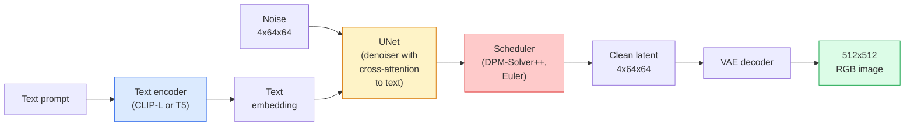

# Stable Diffusion——架构与微调

> Stable Diffusion 是一个运行在预训练 VAE 潜空间中的 DDPM：通过交叉注意力接入文本条件，用快速确定性 ODE 求解器采样，并由无分类器引导（classifier-free guidance）来控制生成方向。

**Type:** Learn + Use
**Languages:** Python
**Prerequisites:** Phase 4 Lesson 10 (Diffusion), Phase 7 Lesson 02 (Self-Attention)
**Time:** ~75 minutes

## 学习目标

- 梳理 Stable Diffusion 流水线的五个组件：VAE、文本编码器、U-Net、调度器、安全检查器——以及每个组件实际负责什么
- 解释潜空间扩散（latent diffusion），以及为什么在 4x64x64 的潜空间（而非 3x512x512 的图像）中训练能把计算量降低 48 倍且不损失质量
- 使用 `diffusers` 生成图像，并完成图生图（image-to-image）、图像修补（inpainting）和 ControlNet 引导生成
- 在小型自定义数据集上用 LoRA 微调 Stable Diffusion，并在推理时加载 LoRA 适配器

## 问题背景

直接在 512x512 RGB 图像上训练 DDPM 的代价很高。每个训练步都要对一个输入为 3x512x512 = 786,432 个数值的 U-Net 做反向传播，而采样还需要让同一个 U-Net 跑 50 次以上的前向传播。要达到 Stable Diffusion 1.5（2022 年发布）的质量水平，像素空间扩散大约需要 256 GPU-月的训练量，且在消费级 GPU 上每张图要花 10-30 秒。

让开放权重文本生图变得可行的关键技巧是**潜空间扩散**（latent diffusion，Rombach et al., CVPR 2022）：先训练一个能把 3x512x512 图像映射为 4x64x64 潜张量并还原回来的 VAE，然后把扩散过程放到这个潜空间里进行。计算量降低 `(3*512*512)/(4*64*64) = 48x`。同一块 GPU 上的采样时间从几十秒降到不足两秒。

几乎所有现代图像生成模型——SDXL、SD3、FLUX、HunyuanDiT、Wan-Video——都是潜空间扩散模型，差异只在自编码器、去噪器（U-Net 或 DiT）和文本条件机制上。学会了 Stable Diffusion，你就掌握了这套模板。

## 核心概念

### 流水线



- **VAE**——冻结的自编码器。编码器把图像转成潜变量（用于图生图和训练），解码器把潜变量还原成图像。
- **文本编码器**——CLIP 文本编码器（SD 1.x/2.x）、CLIP-L + CLIP-G（SDXL）或 T5-XXL（SD3/FLUX）。输出一个 token 嵌入序列。
- **U-Net**——去噪器。在每个分辨率层级都有交叉注意力层，让潜变量去关注文本嵌入。
- **调度器**——采样算法（DDIM、Euler、DPM-Solver++）。负责选取 sigma 值，并把预测的噪声混合回潜变量。
- **安全检查器**——可选的 NSFW / 违法内容过滤器，作用于输出图像。

### 无分类器引导（CFG）

普通的文本条件训练会为每个提示词 `c` 学习 `epsilon_theta(x_t, t, c)`。CFG 在训练同一个网络时以 10% 的概率丢弃 `c`（替换为空嵌入），从而得到一个既能预测条件噪声、也能预测无条件噪声的单一模型。推理时：

```
eps = eps_uncond + w * (eps_cond - eps_uncond)
```

`w` 是引导强度（guidance scale）。`w=0` 是无条件生成，`w=1` 是普通条件生成，`w>1` 会以牺牲多样性为代价，把输出推向"更贴合提示词"的方向。SD 默认值是 `w=7.5`。

CFG 是文本生图能达到生产级质量的根本原因。没有它，提示词对输出的影响很弱；有了它，提示词主导生成。

### 潜空间几何

VAE 的 4 通道潜变量不只是一张压缩后的图像。它是一个流形：在这里做算术运算大致对应语义编辑（提示词工程和插值都发生在这个空间里），扩散 U-Net 也把全部建模能力都投入在这个空间上。解码一个随机的 4x64x64 潜变量并不会得到一张看起来随机的图像——而是得到一团垃圾，因为只有特定的潜变量子流形才能解码出有效图像。

由此带来两个推论：

1. **图生图（Img2img）**= 把图像编码成潜变量，加上部分噪声，运行去噪器，再解码。由于编码近似可逆，图像结构得以保留；内容则根据提示词发生变化。
2. **图像修补（Inpainting）**= 和图生图相同，但去噪器只更新被遮罩的区域；未遮罩区域保持为编码后的潜变量。

### U-Net 架构

SD 的 U-Net 是第 10 课 TinyUNet 的放大版，外加三处改动：

- 每个空间分辨率上都有 **Transformer 块**，包含自注意力 + 对文本嵌入的交叉注意力。
- **时间嵌入**：对正弦编码施加 MLP。
- 编码器和解码器在相同分辨率之间的**跳跃连接**。

SD 1.5 的总参数量约 860M，SDXL 约 2.6B，FLUX 约 12B。参数量的增长主要来自注意力层。

### LoRA 微调

对 Stable Diffusion 做全量微调需要 20 GB 以上的显存，且要更新 860M 个参数。LoRA（Low-Rank Adaptation，低秩适配）保持基础模型冻结，只在注意力层中注入小型的秩分解矩阵。一个 SD 的 LoRA 适配器通常只有 10-50 MB，在单块消费级 GPU 上 10-60 分钟即可训练完成，并能在推理时作为即插即用的修改直接加载。

```
Original: W_q : (d_in, d_out)   frozen
LoRA:     W_q + alpha * (A @ B)   where A : (d_in, r), B : (r, d_out)

r is typically 4-32.
```

LoRA 是几乎所有社区微调成果的分发方式。CivitAI 和 Hugging Face 上托管着数以百万计的 LoRA。

### 你会遇到的调度器

- **DDIM**——确定性，约 50 步，简单。
- **Euler ancestral**——随机性，30-50 步，样本略更有创意。
- **DPM-Solver++ 2M Karras**——确定性，20-30 步，生产环境默认选择。
- **LCM / TCD / Turbo**——一致性模型和蒸馏变体；1-4 步即可生成，但要付出一些质量代价。

在 `diffusers` 中切换调度器只需改一行代码，有时不用任何重训练就能解决采样问题。

## 从零实现

本课全程使用 `diffusers`，而不是从零重建 Stable Diffusion。需要重建的那些组件（VAE、文本编码器、U-Net、调度器）各有专门的课程；这里的目标是熟练掌握生产级 API。

### 第 1 步：文本生图

```python
import torch
from diffusers import StableDiffusionPipeline

pipe = StableDiffusionPipeline.from_pretrained(
    "runwayml/stable-diffusion-v1-5",
    torch_dtype=torch.float16,
).to("cuda")

image = pipe(
    prompt="a dog riding a skateboard in tokyo, studio ghibli style",
    guidance_scale=7.5,
    num_inference_steps=25,
    generator=torch.Generator("cuda").manual_seed(42),
).images[0]
image.save("dog.png")
```

`float16` 能将显存占用减半，且看不出质量损失。`num_inference_steps=25` 搭配默认的 DPM-Solver++，效果与 DDIM 的 `num_inference_steps=50` 相当。

### 第 2 步：切换调度器

```python
from diffusers import DPMSolverMultistepScheduler, EulerAncestralDiscreteScheduler

pipe.scheduler = DPMSolverMultistepScheduler.from_config(pipe.scheduler.config)
pipe.scheduler = EulerAncestralDiscreteScheduler.from_config(pipe.scheduler.config)
```

调度器状态与 U-Net 权重是解耦的。你可以用 DDPM 训练，然后用任何调度器采样。

### 第 3 步：图生图

```python
from diffusers import StableDiffusionImg2ImgPipeline
from PIL import Image

img2img = StableDiffusionImg2ImgPipeline.from_pretrained(
    "runwayml/stable-diffusion-v1-5",
    torch_dtype=torch.float16,
).to("cuda")

init_image = Image.open("dog.png").convert("RGB").resize((512, 512))
out = img2img(
    prompt="a dog riding a skateboard, oil painting",
    image=init_image,
    strength=0.6,
    guidance_scale=7.5,
).images[0]
```

`strength` 表示去噪前加入多少噪声（0.0 = 完全不变，1.0 = 完全重新生成）。风格迁移的标准取值范围是 0.5-0.7。

### 第 4 步：图像修补

```python
from diffusers import StableDiffusionInpaintPipeline

inpaint = StableDiffusionInpaintPipeline.from_pretrained(
    "runwayml/stable-diffusion-inpainting",
    torch_dtype=torch.float16,
).to("cuda")

image = Image.open("dog.png").convert("RGB").resize((512, 512))
mask = Image.open("dog_mask.png").convert("L").resize((512, 512))

out = inpaint(
    prompt="a cat",
    image=image,
    mask_image=mask,
    guidance_scale=7.5,
).images[0]
```

遮罩中的白色像素是要重新生成的区域，黑色像素会被保留。

### 第 5 步：加载 LoRA

```python
pipe.load_lora_weights("sayakpaul/sd-lora-ghibli")
pipe.fuse_lora(lora_scale=0.8)

image = pipe(prompt="a village square in ghibli style").images[0]
```

`lora_scale` 控制作用强度；0.0 = 无效果，1.0 = 完全生效。`fuse_lora` 会把适配器原地烘焙进权重以提升速度，但之后就无法再切换适配器。加载其他适配器前需先调用 `pipe.unfuse_lora()`。

### 第 6 步：LoRA 训练（梗概）

真正的 LoRA 训练代码在 `peft` 或 `diffusers.training` 中。大致流程：

```python
# Pseudocode
for step, batch in enumerate(dataloader):
    images, prompts = batch
    latents = vae.encode(images).latent_dist.sample() * 0.18215

    t = torch.randint(0, num_train_timesteps, (batch_size,))
    noise = torch.randn_like(latents)
    noisy_latents = scheduler.add_noise(latents, noise, t)

    text_emb = text_encoder(tokenizer(prompts))

    pred_noise = unet(noisy_latents, t, text_emb)  # LoRA weights injected here

    loss = F.mse_loss(pred_noise, noise)
    loss.backward()
    optimizer.step()
```

只有 LoRA 矩阵接收梯度；基础 U-Net、VAE 和文本编码器全部冻结。在批大小为 1 并开启梯度检查点（gradient checkpointing）的情况下，8 GB 显存即可完成训练。

## 生产实践

在生产环境中，你实际要做的决策是：

- **模型家族**：SD 1.5 适合开源社区微调生态，SDXL 适合更高保真度，SD3 / FLUX 适合最先进效果与严格的许可要求。
- **调度器**：20-30 步用 DPM-Solver++ 2M Karras；延迟要求低于 1 秒时用 LCM-LoRA。
- **精度**：4080/4090 上用 `float16`，A100 及更新的卡上用 `bfloat16`，显存吃紧时用 `int8`（通过 `bitsandbytes` 或 `compel`）。
- **条件控制**：纯文本就能用；需要更强的控制时，在基础流水线之上叠加 ControlNet（canny、深度、姿态）。

批量生成方面，`AUTO1111` / `ComfyUI` 是社区主流工具；生产 API 方面，用 `diffusers` + `accelerate`，或 `optimum-nvidia` 搭配 TensorRT 编译。

## 交付产物

本课产出：

- `outputs/prompt-sd-pipeline-planner.md`——一个提示词模板：给定延迟预算、保真度目标和许可约束，选出 SD 1.5 / SDXL / SD3 / FLUX 以及调度器和精度。
- `outputs/skill-lora-training-setup.md`——一个技能：为自定义数据集编写完整的 LoRA 训练配置，包括标注（captions）、秩、批大小和学习率。

## 练习

1. **（简单）** 用同一个提示词，分别以 `guidance_scale` 取 `[1, 3, 5, 7.5, 10, 15]` 生成图像。描述图像如何变化。在哪个引导值上开始出现伪影？
2. **（中等）** 取任意一张真实照片，用 `StableDiffusionImg2ImgPipeline` 在 `strength` 取 `[0.2, 0.4, 0.6, 0.8, 1.0]` 时分别处理。哪个 strength 既保留了构图又改变了风格？为什么 1.0 会完全忽略输入？
3. **（困难）** 用 10-20 张单一主体的图像（一只宠物、一个 logo、一个角色）训练一个 LoRA，然后生成包含该主体的新场景。报告在不对输入图像过拟合的前提下，哪个 LoRA 秩和训练步数组合能最好地保持主体身份。

## 关键术语

| 术语 | 大家怎么说 | 实际含义 |
|------|----------------|----------------------|
| 潜空间扩散（Latent diffusion） | "在潜变量上扩散" | 把整个 DDPM 放在 VAE 潜空间（4x64x64）而非像素空间（3x512x512）中运行；节省 48 倍计算量 |
| VAE 缩放因子 | "0.18215" | 把 VAE 原始潜变量重新缩放到大致单位方差的常数；硬编码在每个 SD 流水线中 |
| 无分类器引导（Classifier-free guidance） | "CFG" | 混合条件与无条件噪声预测；推理阶段影响最大的单个调节旋钮 |
| 调度器（Scheduler） | "采样器" | 把噪声 + 模型预测变成去噪潜变量轨迹的算法 |
| LoRA | "低秩适配器" | 在不动基础权重的前提下微调注意力层的小型秩分解矩阵 |
| 交叉注意力（Cross-attention） | "文本-图像注意力" | 从潜变量 token 到文本 token 的注意力；在 U-Net 的每一层注入提示词信息 |
| ControlNet | "结构条件控制" | 单独训练的适配器，用额外输入（canny、深度、姿态、分割）来引导 SD |
| DPM-Solver++ | "默认调度器" | 二阶确定性 ODE 求解器；2026 年低步数（20-30）下质量最佳的选择 |

## 延伸阅读

- [High-Resolution Image Synthesis with Latent Diffusion (Rombach et al., 2022)](https://arxiv.org/abs/2112.10752)——Stable Diffusion 论文；包含支撑其设计的全部消融实验
- [Classifier-Free Diffusion Guidance (Ho & Salimans, 2022)](https://arxiv.org/abs/2207.12598)——CFG 论文
- [LoRA: Low-Rank Adaptation of Large Language Models (Hu et al., 2021)](https://arxiv.org/abs/2106.09685)——LoRA 最初为 NLP 而生；几乎不加改动就迁移到了 SD
- [diffusers documentation](https://huggingface.co/docs/diffusers)——所有 SD / SDXL / SD3 / FLUX 流水线的权威参考
