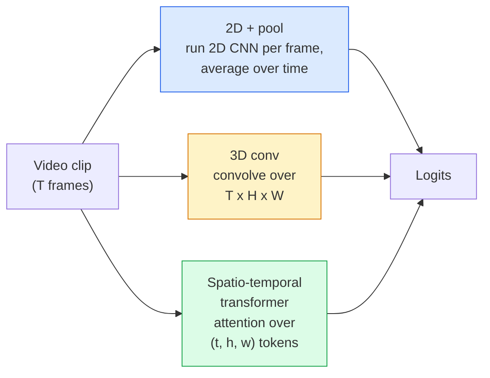

# 视频理解 — 时序建模

> 视频是一组图像序列，再加上把它们串联起来的物理规律。每一个视频模型对时间的处理方式无非三种：把时间当作一个额外的维度（3D 卷积）、当作一个用注意力处理的序列（Transformer），或者当作只提取一次特征然后池化掉的属性（2D+池化）。

**Type:** Learn + Build
**Languages:** Python
**Prerequisites:** Phase 4 Lesson 03 (CNNs), Phase 4 Lesson 04 (Image Classification)
**Time:** ~45 minutes

## 学习目标

- 区分三大类视频建模方法（2D+池化、3D 卷积、时空 Transformer），并能预判它们在算力开销和精度上的权衡
- 用 PyTorch 实现帧采样、时序池化，以及一个 2D+池化的基线分类器
- 解释为什么 I3D 的「膨胀（inflated）」3D 卷积核能很好地迁移 ImageNet 权重，以及因子化的 (2+1)D 卷积有何不同
- 看懂动作识别领域的标准数据集和指标：Kinetics-400/600、UCF101、Something-Something V2；片段级和视频级的 top-1 准确率

## 问题背景

一段 30 秒、30 fps 的视频就是 900 张图像。最朴素的做法是：把图像分类跑 900 遍，再做某种聚合。当动作在几乎每一帧中都可见时（体育、烹饪、健身视频），这种做法行得通；但当动作本身由运动来定义时，它会一败涂地：「把某物从左推到右」在每一帧静止画面里看起来都只是两个不动的物体。

每一种视频架构的核心问题是：时序结构在什么时候、以什么方式被建模？这个答案决定了其余一切——计算开销、预训练策略、能否复用 ImageNet 权重、模型用什么数据集训练。

这节课刻意比静态图像的课程更短。核心的图像处理机制已经就位，视频理解主要就是时序这条线：采样、建模、聚合。

## 核心概念

### 三大架构家族



### 2D + 池化

取一个 2D CNN（ResNet、EfficientNet、ViT），在每一个采样帧上独立运行，对各帧的嵌入做平均（或最大池化、注意力池化），再把池化后的向量送入分类器。

优点：
- ImageNet 预训练可以直接迁移。
- 实现最简单。
- 便宜：T 帧 × 单张图像的推理开销。

缺点：
- 无法建模运动。动作 = 外观的聚合。
- 时序池化对顺序不敏感；「开门」和「关门」看起来完全一样。

适用场景：以外观为主的任务、在小型视频数据集上做迁移学习、初始基线。

### 3D 卷积

把 2D 的 (H, W) 卷积核换成 3D 的 (T, H, W) 卷积核，网络同时在空间和时间上做卷积。早期代表：C3D、I3D、SlowFast。

I3D 的技巧：取一个预训练好的 2D ImageNet 模型，把每个 2D 卷积核沿新增的时间轴复制，从而「膨胀」成 3D。一个 3x3 的 2D 卷积变成 3x3x3 的 3D 卷积。这样 3D 模型就有了强力的预训练权重，而不必从零开始训练。

优点：
- 直接建模运动。
- I3D 的膨胀技巧带来免费的迁移学习。

缺点：
- 比对应的 2D 模型多 T/8 倍的 FLOPs（按时间核为 3、堆叠 3 次计算）。
- 时间方向的卷积核很小；长程运动需要金字塔或双流结构。

适用场景：以运动为信号的动作识别（Something-Something V2、Kinetics 中运动主导的类别）。

### 时空 Transformer

把视频切分（tokenise）成时空补丁（patch）网格，在所有 token 之间做注意力。代表模型：TimeSformer、ViViT、Video Swin、VideoMAE。

值得关注的注意力模式：
- **联合（Joint）** — 在 (t, h, w) 上做一次大注意力。复杂度是 `T*H*W` 的平方，很贵。
- **分离（Divided）** — 每个 block 做两次注意力：一次沿时间，一次沿空间。接近线性的扩展性。
- **因子化（Factorised）** — 时间注意力和空间注意力在各个 block 之间交替。

优点：
- 在所有主流基准上都是 SOTA 精度。
- 可以通过补丁膨胀从图像 Transformer（ViT）迁移。
- 借助稀疏注意力支持长上下文视频。

缺点：
- 算力消耗大。
- 需要谨慎选择注意力模式，否则运行时间会爆炸。

适用场景：大规模数据集、高保真视频理解、多模态视频+文本任务。

### 帧采样

一段 10 秒、30 fps 的片段有 300 帧；把这 300 帧全部喂给任何模型都很浪费。标准策略有：

- **均匀采样（Uniform sampling）** — 在片段全长上等间隔地取 T 帧。2D+池化的默认做法。
- **密集采样（Dense sampling）** — 随机取一段连续的 T 帧窗口。3D 卷积常用，因为运动需要相邻帧。
- **多片段采样（Multi-clip）** — 从同一视频采样多个 T 帧窗口，分别分类，测试时对预测取平均。

T 通常取 8、16、32 或 64。T 越大，时序信号越多，算力开销也越大。

### 评估

有两个层级：
- **片段级准确率（Clip-level accuracy）** — 模型只看到一个 T 帧片段，汇报 top-k。
- **视频级准确率（Video-level accuracy）** — 对每个视频的多个片段的预测取平均；数值更高也更稳定。

务必同时汇报两者。一个片段级 78% / 视频级 82% 的模型严重依赖测试时平均；而一个 80% / 81% 的模型在单片段层面更稳健。

### 你会遇到的数据集

- **Kinetics-400 / 600 / 700** — 通用动作数据集。40 万个片段；YouTube 链接（如今很多已失效）。
- **Something-Something V2** — 由运动定义的动作（「把 X 从左移到右」）。2D+池化无法解决。
- **UCF-101**、**HMDB-51** — 较老、较小，但仍常被汇报。
- **AVA** — 在空间和时间上做动作*定位*；比分类更难。

## 从零实现

### 第 1 步：帧采样器

在帧列表（或视频张量）上工作的均匀采样器和密集采样器。

```python
import numpy as np

def sample_uniform(num_frames_total, T):
    if num_frames_total <= T:
        return list(range(num_frames_total)) + [num_frames_total - 1] * (T - num_frames_total)
    step = num_frames_total / T
    return [int(i * step) for i in range(T)]


def sample_dense(num_frames_total, T, rng=None):
    rng = rng or np.random.default_rng()
    if num_frames_total <= T:
        return list(range(num_frames_total)) + [num_frames_total - 1] * (T - num_frames_total)
    start = int(rng.integers(0, num_frames_total - T + 1))
    return list(range(start, start + T))
```

两者都返回 `T` 个索引，用来对视频张量做切片。

### 第 2 步：2D+池化基线

在每一帧上跑一个 2D ResNet-18，对特征做平均池化，然后分类。

```python
import torch
import torch.nn as nn
from torchvision.models import resnet18, ResNet18_Weights

class FramePool(nn.Module):
    def __init__(self, num_classes=400, pretrained=True):
        super().__init__()
        weights = ResNet18_Weights.IMAGENET1K_V1 if pretrained else None
        backbone = resnet18(weights=weights)
        self.features = nn.Sequential(*(list(backbone.children())[:-1]))  # global avg pool kept
        self.head = nn.Linear(512, num_classes)

    def forward(self, x):
        # x: (N, T, 3, H, W)
        N, T = x.shape[:2]
        x = x.view(N * T, *x.shape[2:])
        feats = self.features(x).view(N, T, -1)
        pooled = feats.mean(dim=1)
        return self.head(pooled)

model = FramePool(num_classes=10)
x = torch.randn(2, 8, 3, 224, 224)
print(f"output: {model(x).shape}")
print(f"params: {sum(p.numel() for p in model.parameters()):,}")
```

一千一百万个参数，ImageNet 预训练，逐帧运行、平均、分类。在以外观为主的任务上，这个基线往往与正经的 3D 模型只差 5-10 个点——有时甚至更好，因为它复用了一个更强的 ImageNet 骨干网络。

### 第 3 步：I3D 风格的膨胀 3D 卷积

把权重沿新增的时间轴重复，将一个 2D 卷积变成 3D 卷积。

```python
def inflate_2d_to_3d(conv2d, time_kernel=3):
    out_c, in_c, kh, kw = conv2d.weight.shape
    weight_3d = conv2d.weight.data.unsqueeze(2)  # (out, in, 1, kh, kw)
    weight_3d = weight_3d.repeat(1, 1, time_kernel, 1, 1) / time_kernel
    conv3d = nn.Conv3d(in_c, out_c, kernel_size=(time_kernel, kh, kw),
                        padding=(time_kernel // 2, conv2d.padding[0], conv2d.padding[1]),
                        stride=(1, conv2d.stride[0], conv2d.stride[1]),
                        bias=False)
    conv3d.weight.data = weight_3d
    return conv3d

conv2d = nn.Conv2d(3, 64, kernel_size=3, padding=1, bias=False)
conv3d = inflate_2d_to_3d(conv2d, time_kernel=3)
print(f"2D weight shape:  {tuple(conv2d.weight.shape)}")
print(f"3D weight shape:  {tuple(conv3d.weight.shape)}")
x = torch.randn(1, 3, 8, 56, 56)
print(f"3D output shape:  {tuple(conv3d(x).shape)}")
```

除以 `time_kernel` 是为了让激活值的量级大致不变——这对于首次前向传播时不破坏 batch-norm 统计量非常重要。

### 第 4 步：因子化的 (2+1)D 卷积

把一个 3D 卷积拆成一个 2D（空间）卷积加一个 1D（时间）卷积。感受野相同，参数更少，在部分基准上精度更高。

```python
class Conv2Plus1D(nn.Module):
    def __init__(self, in_c, out_c, kernel_size=3):
        super().__init__()
        mid_c = (in_c * out_c * kernel_size * kernel_size * kernel_size) \
                // (in_c * kernel_size * kernel_size + out_c * kernel_size)
        self.spatial = nn.Conv3d(in_c, mid_c, kernel_size=(1, kernel_size, kernel_size),
                                 padding=(0, kernel_size // 2, kernel_size // 2), bias=False)
        self.bn = nn.BatchNorm3d(mid_c)
        self.act = nn.ReLU(inplace=True)
        self.temporal = nn.Conv3d(mid_c, out_c, kernel_size=(kernel_size, 1, 1),
                                  padding=(kernel_size // 2, 0, 0), bias=False)

    def forward(self, x):
        return self.temporal(self.act(self.bn(self.spatial(x))))

c = Conv2Plus1D(3, 64)
x = torch.randn(1, 3, 8, 56, 56)
print(f"(2+1)D output: {tuple(c(x).shape)}")
```

完整的 R(2+1)D 网络就是把 ResNet-18 中的每个 3x3 卷积都替换成 `Conv2Plus1D`。

## 生产实践

两个库覆盖了生产环境中的视频工作：

- `torchvision.models.video` — 提供带 Kinetics 预训练权重的 R(2+1)D、MViT、Swin3D，API 与图像模型一致。
- `pytorchvideo`（Meta）— 模型库，以及 Kinetics / SSv2 / AVA 的数据加载器和标准变换。

对于视觉-语言视频模型（视频描述、视频问答），使用 `transformers`（`VideoMAE`、`VideoLLaMA`、`InternVideo`）。

## 交付产物

本课产出：

- `outputs/prompt-video-architecture-picker.md` — 一个提示词，根据外观主导还是运动主导、数据集规模和算力预算，在 2D+池化 / I3D / (2+1)D / Transformer 之间做选择。
- `outputs/skill-frame-sampler-auditor.md` — 一个技能，检查视频管线中的采样器并标出常见 bug：索引差一（off-by-one）、`num_frames < T` 时采样不均匀、缺少保持宽高比的裁剪等。

## 练习

1. **（简单）** 估算 T=8 的 FramePool 与 T=8 的 I3D 风格 3D ResNet 的近似 FLOPs，并论证为什么 2D+池化便宜 3-5 倍。
2. **（中等）** 生成一个合成视频数据集：随机小球朝随机方向运动，按运动方向打标签（「从左到右」「从右到左」「斜向上」）。在其上训练 FramePool，证明它的准确率接近随机水平，从而说明仅靠外观不足以解决运动类任务。
3. **（困难）** 把 ResNet-18 中的每个 Conv2d 替换成 `Conv2Plus1D`，构建一个 R(2+1)D-18。用 ImageNet 预训练的 ResNet-18 膨胀第一层卷积的权重。在练习 2 的运动数据集上训练并超过 FramePool。

## 关键术语

| 术语 | 人们怎么说 | 实际含义 |
|------|----------------|----------------------|
| 2D + 池化 | 「逐帧分类器」 | 在每个采样帧上跑 2D CNN，在时间维度上对特征做平均池化，然后分类 |
| 3D 卷积 | 「时空卷积核」 | 在 (T, H, W) 上做卷积的核；能够原生建模运动 |
| 膨胀（Inflation） | 「把 2D 权重提升到 3D」 | 把 2D 卷积的权重沿新增时间轴重复来初始化 3D 卷积权重，再除以 kernel_T 以保持激活值量级 |
| (2+1)D | 「因子化卷积」 | 把 3D 拆成 2D 空间 + 1D 时间；参数更少，中间多一层非线性 |
| 分离注意力（Divided attention） | 「先时间后空间」 | 每层有两个注意力模块的 Transformer block：一个作用于同一空间位置的 token，一个作用于同一帧内的 token |
| 片段（Clip） | 「T 帧窗口」 | 采样出的 T 帧子序列；视频模型消费的基本单位 |
| 片段 vs 视频准确率 | 「两种评估设定」 | 片段 = 每个视频取一个样本，视频 = 对多个采样片段取平均 |
| Kinetics | 「视频界的 ImageNet」 | 400-700 个动作类别，30 万+ YouTube 片段，标准的视频预训练语料库 |

## 延伸阅读

- [I3D: Quo Vadis, Action Recognition (Carreira & Zisserman, 2017)](https://arxiv.org/abs/1705.07750) — 提出膨胀技巧和 Kinetics 数据集
- [R(2+1)D: A Closer Look at Spatiotemporal Convolutions (Tran et al., 2018)](https://arxiv.org/abs/1711.11248) — 因子化卷积，至今仍是强力基线
- [TimeSformer: Is Space-Time Attention All You Need? (Bertasius et al., 2021)](https://arxiv.org/abs/2102.05095) — 第一个强力的视频 Transformer
- [VideoMAE (Tong et al., 2022)](https://arxiv.org/abs/2203.12602) — 视频的掩码自编码器预训练；当前主流的预训练配方
