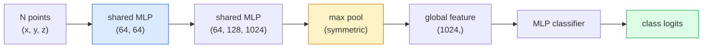

# 3D 视觉 — 点云与 NeRF

> 3D 视觉有两种形态。点云（point cloud）是传感器的原始输出，NeRF 是学习得到的体积场。两者都在回答"空间中什么东西在什么位置"。

**Type:** Learn + Build
**Languages:** Python
**Prerequisites:** Phase 4 Lesson 03 (CNNs), Phase 1 Lesson 12 (Tensor Operations)
**Time:** ~45 minutes

## 学习目标

- 区分显式（点云、网格、体素）和隐式（有符号距离场、NeRF）3D 表示，以及它们各自的适用场景
- 理解 PointNet 的对称函数技巧——它如何让神经网络对无序点集具有置换不变性
- 完整走一遍 NeRF 前向传播：光线投射、体积渲染、位置编码、MLP 密度+颜色输出头
- 使用 `nerfstudio` 或 `instant-ngp`，基于少量带位姿的图像做预训练 3D 重建

## 问题背景

相机产生 2D 图像。LIDAR 产生一组没有顺序的 3D 点。SfM（structure-from-motion）流水线产生稀疏的 3D 关键点云。NeRF 从少量带位姿的照片重建出整个 3D 场景。这些都是"视觉"，但没有一种长得像 CNN 想要的稠密张量。

3D 视觉之所以重要，是因为几乎所有高价值的机器人任务都发生在 3D 空间：抓取、避障、导航、AR 遮挡、3D 内容采集。一个只懂 2D 图像的视觉工程师，会被挡在这个领域增长最快的板块之外（AR/VR 内容、机器人、自动驾驶技术栈、面向房产或建筑行业的基于 NeRF 的 3D 重建）。

这两种表示各自占据主导地位的原因不同。点云是传感器免费给你的东西。NeRF 及其后继者（3D 高斯泼溅、神经 SDF）则是你让神经网络去学习一个场景时得到的东西。

## 核心概念

### 点云

点云是 R^3 空间中 N 个点的无序集合，每个点可以选配特征（颜色、强度、法向量）。

```
cloud = [
  (x1, y1, z1, r1, g1, b1),
  (x2, y2, z2, r2, g2, b2),
  ...
  (xN, yN, zN, rN, gN, bN),
]
```

没有网格，没有连接关系。有两个性质让点云对神经网络很棘手：

- **置换不变性（permutation invariance）** —— 输出不能依赖点的顺序。
- **N 可变** —— 同一个模型必须能处理不同规模的点云。

PointNet（Qi 等，2017）用一个想法同时解决了这两个问题：对每个点应用同一个共享 MLP，再用一个对称函数（最大池化）做聚合。结果是一个不依赖顺序的固定长度向量。

```
f(P) = max_{p in P} MLP(p)
```

这就是 PointNet 的全部核心。更深的变体（PointNet++、Point Transformer）增加了层次化采样和局部聚合，但对称函数这个技巧一直没变。

### PointNet 架构



"共享 MLP"的意思是同一个 MLP 独立地作用于每一个点。出于效率考虑，实现上用的是沿点维度的 1x1 卷积。

### 神经辐射场（Neural Radiance Fields, NeRF）

NeRF（Mildenhall 等，2020）面对"能否从 N 张照片重建 3D 场景"这个问题，给出的答案是一个本身就是场景的神经网络。这个网络把 `(x, y, z, viewing_direction)` 映射为 `(density, colour)`。渲染一个新视角，就是在这个网络上跑一个光线投射循环。

```
NeRF MLP:  (x, y, z, theta, phi) -> (sigma, r, g, b)

To render a pixel (u, v) of a new view:
  1. Cast a ray from the camera through pixel (u, v)
  2. Sample points along the ray at distances t_1, t_2, ..., t_N
  3. Query the MLP at each point
  4. Composite the colours weighted by (1 - exp(-sigma * dt))
  5. The sum is the rendered pixel colour
```

损失函数比较渲染出的像素与训练照片中的真实像素。反向传播穿过渲染步骤来更新 MLP。不需要 3D 真值标注，没有显式几何——整个场景存储在 MLP 的权重里。

### NeRF 中的位置编码

直接吃 `(x, y, z)` 的朴素 MLP 无法表示高频细节，因为 MLP 在频谱上偏向低频。NeRF 的解法是在进入 MLP 之前，把每个坐标编码成傅里叶特征向量：

```
gamma(p) = (sin(2^0 pi p), cos(2^0 pi p), sin(2^1 pi p), cos(2^1 pi p), ...)
```

最多到 L=10 个频率级别。这和 Transformer 编码位置用的是同一个技巧，它还会出现在扩散模型的时间步条件化中（第 10 课）。没有它，NeRF 的渲染结果会很模糊。

### 体积渲染

```
C(r) = sum_i T_i * (1 - exp(-sigma_i * delta_i)) * c_i

T_i  = exp(- sum_{j<i} sigma_j * delta_j)
delta_i = t_{i+1} - t_i
```

`T_i` 是透射率（transmittance）——有多少光能存活到第 i 个点。`(1 - exp(-sigma_i * delta_i))` 是第 i 个点的不透明度。`c_i` 是颜色。最终像素是沿光线的加权和。

### 取代 NeRF 的技术

纯 NeRF 训练慢（数小时）、渲染慢（每张图数秒）。此后的演进谱系：

- **Instant-NGP**（2022）—— 用哈希网格编码替换 MLP 的位置输入；训练只需数秒。
- **Mip-NeRF 360** —— 处理无界场景与抗锯齿。
- **3D 高斯泼溅（3D Gaussian Splatting）**（2023）—— 用数百万个 3D 高斯替换体积场；训练只需数分钟，实时渲染。当前的生产环境默认选择。

2026 年几乎所有真正的 NeRF 产品实际用的都是 3D 高斯泼溅。但心智模型仍然是 NeRF。

### 数据集与基准

- **ShapeNet** —— 以点云形式对 3D CAD 模型做分类与分割。
- **ScanNet** —— 真实室内扫描，用于分割。
- **KITTI** —— 面向自动驾驶的户外 LIDAR 点云。
- **NeRF Synthetic** / **Blended MVS** —— 用于视角合成的带位姿图像数据集。
- **Mip-NeRF 360** 数据集 —— 无界真实场景。

## 从零实现

### 第 1 步：PointNet 分类器

```python
import torch
import torch.nn as nn

class PointNet(nn.Module):
    def __init__(self, num_classes=10):
        super().__init__()
        self.mlp1 = nn.Sequential(
            nn.Conv1d(3, 64, 1),    nn.BatchNorm1d(64),   nn.ReLU(inplace=True),
            nn.Conv1d(64, 64, 1),   nn.BatchNorm1d(64),   nn.ReLU(inplace=True),
        )
        self.mlp2 = nn.Sequential(
            nn.Conv1d(64, 128, 1),  nn.BatchNorm1d(128),  nn.ReLU(inplace=True),
            nn.Conv1d(128, 1024, 1), nn.BatchNorm1d(1024), nn.ReLU(inplace=True),
        )
        self.head = nn.Sequential(
            nn.Linear(1024, 512),   nn.BatchNorm1d(512),  nn.ReLU(inplace=True),
            nn.Dropout(0.3),
            nn.Linear(512, 256),    nn.BatchNorm1d(256),  nn.ReLU(inplace=True),
            nn.Dropout(0.3),
            nn.Linear(256, num_classes),
        )

    def forward(self, x):
        # x: (N, 3, num_points) — transposed for Conv1d
        x = self.mlp1(x)
        x = self.mlp2(x)
        x = torch.max(x, dim=-1)[0]       # (N, 1024)
        return self.head(x)

pts = torch.randn(4, 3, 1024)
net = PointNet(num_classes=10)
print(f"output: {net(pts).shape}")
print(f"params: {sum(p.numel() for p in net.parameters()):,}")
```

约 160 万参数。每个点云用 1,024 个点。

### 第 2 步：位置编码

```python
def positional_encoding(x, L=10):
    """
    x: (..., D) -> (..., D * 2 * L)
    """
    freqs = 2.0 ** torch.arange(L, dtype=x.dtype, device=x.device)
    args = x.unsqueeze(-1) * freqs * 3.141592653589793
    sinc = torch.cat([args.sin(), args.cos()], dim=-1)
    return sinc.reshape(*x.shape[:-1], -1)

x = torch.randn(5, 3)
y = positional_encoding(x, L=10)
print(f"input:  {x.shape}")
print(f"encoded: {y.shape}     # (5, 60)")
```

乘以 `2^l * pi` 会得到逐级升高的频率。

### 第 3 步：迷你 NeRF MLP

```python
class TinyNeRF(nn.Module):
    def __init__(self, L_pos=10, L_dir=4, hidden=128):
        super().__init__()
        self.L_pos = L_pos
        self.L_dir = L_dir
        pos_dim = 3 * 2 * L_pos
        dir_dim = 3 * 2 * L_dir
        self.trunk = nn.Sequential(
            nn.Linear(pos_dim, hidden), nn.ReLU(inplace=True),
            nn.Linear(hidden, hidden),  nn.ReLU(inplace=True),
            nn.Linear(hidden, hidden),  nn.ReLU(inplace=True),
            nn.Linear(hidden, hidden),  nn.ReLU(inplace=True),
        )
        self.sigma = nn.Linear(hidden, 1)
        self.color = nn.Sequential(
            nn.Linear(hidden + dir_dim, hidden // 2), nn.ReLU(inplace=True),
            nn.Linear(hidden // 2, 3), nn.Sigmoid(),
        )

    def forward(self, x, d):
        x_enc = positional_encoding(x, self.L_pos)
        d_enc = positional_encoding(d, self.L_dir)
        h = self.trunk(x_enc)
        sigma = torch.relu(self.sigma(h)).squeeze(-1)
        rgb = self.color(torch.cat([h, d_enc], dim=-1))
        return sigma, rgb

nerf = TinyNeRF()
x = torch.randn(128, 3)
d = torch.randn(128, 3)
s, c = nerf(x, d)
print(f"sigma: {s.shape}   rgb: {c.shape}")
```

和原版 NeRF（两个深度为 8 的 MLP 主干）相比非常小巧，但足以演示架构。

### 第 4 步：沿光线的体积渲染

```python
def volumetric_render(sigma, rgb, t_vals):
    """
    sigma: (..., N_samples)
    rgb:   (..., N_samples, 3)
    t_vals: (N_samples,) distances along the ray
    """
    delta = torch.cat([t_vals[1:] - t_vals[:-1], torch.full_like(t_vals[:1], 1e10)])
    alpha = 1.0 - torch.exp(-sigma * delta)
    trans = torch.cumprod(torch.cat([torch.ones_like(alpha[..., :1]), 1.0 - alpha + 1e-10], dim=-1), dim=-1)[..., :-1]
    weights = alpha * trans
    rendered = (weights.unsqueeze(-1) * rgb).sum(dim=-2)
    depth = (weights * t_vals).sum(dim=-1)
    return rendered, depth, weights


N = 64
t_vals = torch.linspace(2.0, 6.0, N)
sigma = torch.rand(N) * 0.5
rgb = torch.rand(N, 3)
rendered, depth, weights = volumetric_render(sigma, rgb, t_vals)
print(f"rendered colour: {rendered.tolist()}")
print(f"depth:           {depth.item():.2f}")
```

一条光线、64 个采样点，合成出一个 RGB 像素和一个深度值。

## 生产实践

实际工作中：

- `nerfstudio`（Tancik 等）—— 当前 NeRF / Instant-NGP / 高斯泼溅的参考库。命令行加 web 查看器。
- `pytorch3d`（Meta）—— 可微渲染、点云工具、网格操作。
- `open3d` —— 点云处理、配准、可视化。

在部署侧，3D 高斯泼溅已基本取代纯 NeRF，因为它的渲染速度快 100 倍，而重建质量相当。

## 交付产物

本节课产出：

- `outputs/prompt-3d-task-router.md` —— 一个提示词，根据任务和输入数据路由到正确的 3D 表示（点云、网格、体素、NeRF、高斯泼溅）。
- `outputs/skill-point-cloud-loader.md` —— 一个技能，为 .ply / .pcd / .xyz 文件编写 PyTorch `Dataset`，包含正确的归一化、中心化和点采样。

## 练习

1. **（简单）** 证明 PointNet 具有置换不变性：把同一个点云跑两遍，第二遍先打乱点的顺序。验证两次输出在浮点误差范围内完全一致。
2. **（中等）** 实现一个最小的光线生成函数：给定相机内参和位姿，为 H x W 图像的每个像素生成光线起点和方向。
3. **（困难）** 在一个合成数据集上训练 TinyNeRF——数据集由一个彩色立方体的渲染视图组成（用可微渲染或简单光线追踪器生成）。报告第 1、10、100 个 epoch 的渲染损失。模型在第几个 epoch 能渲染出可辨认的视图？

## 关键术语

| 术语 | 常见说法 | 实际含义 |
|------|----------------|----------------------|
| 点云 | "来自 LIDAR 的 3D 点" | (x, y, z) 的无序集合，每个点可附带可选特征 |
| PointNet | "第一个处理点云的神经网络" | 每点共享 MLP + 对称（最大）池化；结构上天然置换不变 |
| NeRF | "本身就是场景的 MLP" | 把 (x, y, z, dir) 映射为 (density, colour) 的网络；通过光线投射渲染 |
| 位置编码 | "傅里叶特征" | 把每个坐标编码成多个频率的 sin/cos，以克服 MLP 的低频偏置 |
| 体积渲染 | "光线积分" | 用透射率和 alpha 把光线上的采样点合成为一个像素 |
| Instant-NGP | "哈希网格 NeRF" | 用多分辨率哈希网格替换 NeRF 的坐标 MLP；快 100-1000 倍 |
| 3D 高斯泼溅 | "数百万个高斯" | 场景 = 一组 3D 高斯；实时渲染，数分钟训练完成 |
| SDF | "有符号距离场" | 返回到最近表面的有符号距离的函数；另一种隐式表示 |

## 延伸阅读

- [PointNet (Qi et al., 2017)](https://arxiv.org/abs/1612.00593) —— 置换不变的分类器
- [NeRF (Mildenhall et al., 2020)](https://arxiv.org/abs/2003.08934) —— 把"从照片做 3D 重建"变成神经网络问题的论文
- [Instant-NGP (Müller et al., 2022)](https://arxiv.org/abs/2201.05989) —— 哈希网格，1000 倍提速
- [3D Gaussian Splatting (Kerbl et al., 2023)](https://arxiv.org/abs/2308.04079) —— 在生产环境中取代 NeRF 的架构
