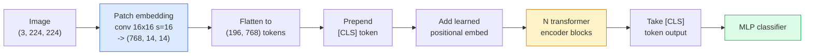

# 视觉 Transformer（ViT）

> 把图像切成小块（patch），把每个小块当作一个词，丢进标准 Transformer。别回头。

**Type:** Build
**Languages:** Python
**Prerequisites:** Phase 7 Lesson 02 (Self-Attention), Phase 4 Lesson 04 (Image Classification)
**Time:** ~45 minutes

## 学习目标

- 从零实现图像块嵌入（patch embedding）、可学习位置嵌入、分类 token 和 Transformer 编码器块，搭建一个最小化的 ViT
- 解释为什么 ViT 曾被认为必须依赖海量预训练数据，直到 DeiT 和 MAE 证明并非如此
- 对比 ViT、Swin 和 ConvNeXt 在架构先验上的差异（无先验、局部窗口注意力、卷积骨干网络）
- 使用 `timm` 和标准的线性探测（linear-probe）/ 微调流程，在小数据集上微调一个预训练 ViT

## 问题背景

整整十年里，卷积几乎就是计算机视觉的代名词。CNN 拥有强大的归纳偏置（inductive bias）——局部性、平移等变性——没人认为这些可以被替代。然后 Dosovitskiy 等人（2020）证明：把一个普通的 Transformer 直接套在展平的图像块上，完全不用任何卷积机制，只要规模够大，就能追平甚至超越最强的 CNN。

关键就在"规模够大"。只在 ImageNet-1k 上训练的 ViT 输给了 ResNet；而先在 ImageNet-21k 或 JFT-300M 上预训练、再在 ImageNet-1k 上微调的 ViT 则胜出。结论是：Transformer 缺少有用的先验，但只要数据足够多就能学出来。后续工作（DeiT、MAE、DINO）进一步表明，只要训练方案得当——强数据增强、自监督预训练、蒸馏——ViT 在小数据上也能训练得很好。

到 2026 年，纯 CNN 在边缘设备上依然有竞争力（ConvNeXt 是其中最强的），但 Transformer 统治了其他一切领域：分割（Mask2Former、SegFormer）、检测（DETR、RT-DETR）、多模态（CLIP、SigLIP）、视频（VideoMAE、VJEPA）。ViT 的块结构是你必须掌握的那一个。

## 核心概念

### 整体流程



七个步骤。图像块 -> token -> 注意力 -> 分类器。每个变体（DeiT、Swin、ConvNeXt、MAE 预训练）都只改动这七步中的一两步，其余保持不变。

### 图像块嵌入

第一层卷积是关键所在。卷积核大小 16、步幅 16，于是一张 224x224 的图像变成 14x14 网格、每格 16x16 的图像块，每块被投影为一个 768 维嵌入。这一个卷积同时完成了切块和线性投影两件事。

```
Input:  (3, 224, 224)
Conv (3 -> 768, k=16, s=16, no padding):
Output: (768, 14, 14)
Flatten spatial: (196, 768)
```

196 个图像块 = 196 个 token。每个 token 的特征维度是 768（ViT-B）、1024（ViT-L）或 1280（ViT-H）。

### 分类 token

一个可学习的向量，拼接在序列开头：

```
tokens = [CLS; patch_1; patch_2; ...; patch_196]   shape (197, 768)
```

经过 N 个 Transformer 块之后，`[CLS]` 的输出就是整张图像的全局表示。分类头只读取这一个向量。

### 位置嵌入

Transformer 本身没有空间位置的概念。给每个 token 加上一个可学习的向量：

```
tokens = tokens + learned_pos_embedding   (also shape (197, 768))
```

这个嵌入是模型的参数；基于梯度的训练会让它自动适应二维图像结构。也存在正弦式的二维位置编码方案，但实践中很少使用。

### Transformer 编码器块

完全标准的结构。多头自注意力、MLP、残差连接、pre-LayerNorm。

```
x = x + MSA(LN(x))
x = x + MLP(LN(x))

MLP is two-layer with GELU: Linear(d -> 4d) -> GELU -> Linear(4d -> d)
```

ViT-B/16 堆叠 12 个这样的块，每块 12 个注意力头，总计 8600 万参数。

### 为什么用 pre-LN

早期 Transformer 使用 post-LN（`x = LN(x + sublayer(x))`），如果不做学习率预热（warmup），网络超过 6-8 层就很难训练。Pre-LN（`x = x + sublayer(LN(x))`）无需预热就能稳定训练更深的网络。所有 ViT 和所有现代 LLM 用的都是 pre-LN。

### 图像块大小的权衡

- 16x16 块 -> 196 个 token，标准配置。
- 32x32 块 -> 49 个 token，更快但分辨率更低。
- 8x8 块 -> 784 个 token，更精细，但注意力的 O(n^2) 开销会急剧膨胀。

块越大 = token 越少 = 速度越快但空间细节越少。SwinV2 在层级化窗口中使用 4x4 的图像块。

### DeiT：在 ImageNet-1k 上训练 ViT 的配方

原版 ViT 需要 JFT-300M 才能打败 CNN。DeiT（Touvron 等人，2020）只靠 ImageNet-1k 就把 ViT-B 训练到了 81.8% 的 top-1 准确率，关键是四项改动：

1. 重度数据增强：RandAugment、Mixup、CutMix、Random Erasing。
2. 随机深度（stochastic depth，训练时随机丢弃整个块）。
3. 重复增强（同一张图在一个批次中采样 3 次）。
4. 从 CNN 教师模型蒸馏（可选，能进一步提升准确率）。

所有现代 ViT 训练方案都源自 DeiT。

### Swin 与 ConvNeXt 之争

- **Swin**（Liu 等人，2021）——基于窗口的注意力。每个块只在局部窗口内做注意力；相邻的块交替平移窗口，让信息跨窗口混合。它把类似 CNN 的局部性先验带了回来，同时保留了注意力算子。
- **ConvNeXt**（Liu 等人，2022）——重新设计的 CNN，照搬了 Swin 的架构选择（深度可分离卷积、LayerNorm、GELU、倒置瓶颈）。它证明差距并不在于"注意力 vs 卷积"，而在于"现代训练方案 + 架构设计"。

到 2026 年，ConvNeXt-V2 和 Swin-V2 都已是生产级方案；如何选择取决于你的推理技术栈（ConvNeXt 在边缘设备上编译效果更好）和预训练语料。

### MAE 预训练

掩码自编码器（Masked Autoencoder，He 等人，2022）：随机掩盖 75% 的图像块，让编码器只处理可见的 25%，再训练一个小解码器，从编码器的输出重建被掩盖的图像块。预训练结束后丢弃解码器，只微调编码器。

MAE 让 ViT 仅靠 ImageNet-1k 就能训练，达到了 SOTA，是当前默认的自监督预训练方案。

## 从零实现

### 第 1 步：图像块嵌入

```python
import torch
import torch.nn as nn

class PatchEmbedding(nn.Module):
    def __init__(self, in_channels=3, patch_size=16, dim=192, image_size=64):
        super().__init__()
        assert image_size % patch_size == 0
        self.proj = nn.Conv2d(in_channels, dim, kernel_size=patch_size, stride=patch_size)
        num_patches = (image_size // patch_size) ** 2
        self.num_patches = num_patches

    def forward(self, x):
        x = self.proj(x)
        return x.flatten(2).transpose(1, 2)
```

一个卷积、一次展平、一次转置。这就是从图像到 token 的全部步骤。

### 第 2 步：Transformer 块

Pre-LN、多头自注意力、带 GELU 的 MLP、残差连接。

```python
class Block(nn.Module):
    def __init__(self, dim, num_heads, mlp_ratio=4, dropout=0.0):
        super().__init__()
        self.ln1 = nn.LayerNorm(dim)
        self.attn = nn.MultiheadAttention(dim, num_heads, dropout=dropout, batch_first=True)
        self.ln2 = nn.LayerNorm(dim)
        self.mlp = nn.Sequential(
            nn.Linear(dim, dim * mlp_ratio),
            nn.GELU(),
            nn.Dropout(dropout),
            nn.Linear(dim * mlp_ratio, dim),
            nn.Dropout(dropout),
        )

    def forward(self, x):
        a, _ = self.attn(self.ln1(x), self.ln1(x), self.ln1(x), need_weights=False)
        x = x + a
        x = x + self.mlp(self.ln2(x))
        return x
```

`nn.MultiheadAttention` 已经处理好了多头拆分、缩放点积和输出投影。设置 `batch_first=True`，张量形状就是 `(N, seq, dim)`。

### 第 3 步：完整的 ViT

```python
class ViT(nn.Module):
    def __init__(self, image_size=64, patch_size=16, in_channels=3,
                 num_classes=10, dim=192, depth=6, num_heads=3, mlp_ratio=4):
        super().__init__()
        self.patch = PatchEmbedding(in_channels, patch_size, dim, image_size)
        num_patches = self.patch.num_patches
        self.cls_token = nn.Parameter(torch.zeros(1, 1, dim))
        self.pos_embed = nn.Parameter(torch.zeros(1, num_patches + 1, dim))
        self.blocks = nn.ModuleList([
            Block(dim, num_heads, mlp_ratio) for _ in range(depth)
        ])
        self.ln = nn.LayerNorm(dim)
        self.head = nn.Linear(dim, num_classes)
        nn.init.trunc_normal_(self.pos_embed, std=0.02)
        nn.init.trunc_normal_(self.cls_token, std=0.02)

    def forward(self, x):
        x = self.patch(x)
        cls = self.cls_token.expand(x.size(0), -1, -1)
        x = torch.cat([cls, x], dim=1)
        x = x + self.pos_embed
        for blk in self.blocks:
            x = blk(x)
        x = self.ln(x[:, 0])
        return self.head(x)

vit = ViT(image_size=64, patch_size=16, num_classes=10, dim=192, depth=6, num_heads=3)
x = torch.randn(2, 3, 64, 64)
print(f"output: {vit(x).shape}")
print(f"params: {sum(p.numel() for p in vit.parameters()):,}")
```

约 280 万参数——一个在 CPU 上也跑得动的迷你 ViT。真正的 ViT-B 有 8600 万参数；用同一个类定义，把参数改成 `dim=768, depth=12, num_heads=12` 即可。

### 第 4 步：健全性检查——单张图像推理

```python
logits = vit(torch.randn(1, 3, 64, 64))
print(f"logits: {logits}")
print(f"probs:  {logits.softmax(-1)}")
```

应当无报错地运行，且概率之和为 1。

## 生产实践

`timm` 自带所有 ViT 变体及其 ImageNet 预训练权重。一行代码：

```python
import timm

model = timm.create_model("vit_base_patch16_224", pretrained=True, num_classes=10)
```

2026 年，`timm` 是视觉 Transformer 的生产默认选择。它在同一套 API 下支持 ViT、DeiT、Swin、Swin-V2、ConvNeXt、ConvNeXt-V2、MaxViT、MViT、EfficientFormer 以及数十种其他模型。

做多模态（图像 + 文本）工作时，`transformers` 提供 CLIP、SigLIP、BLIP-2、LLaVA。它们的图像编码器全都是 ViT 的变体。

## 交付产物

本课产出：

- `outputs/prompt-vit-vs-cnn-picker.md` —— 一个提示词，根据数据集规模、算力和推理技术栈在 ViT、ConvNeXt 和 Swin 之间做选择。
- `outputs/skill-vit-patch-and-pos-embed-inspector.md` —— 一个技能，验证 ViT 的图像块嵌入和位置嵌入形状与模型期望的序列长度是否匹配，捕获移植模型时最常见的 bug。

## 练习

1. **（简单）** 打印上面这个迷你 ViT 前向传播中每个中间张量的形状。确认：输入 `(N, 3, 64, 64)` -> 图像块 `(N, 16, 192)` -> 拼上 CLS `(N, 17, 192)` -> 分类器输入 `(N, 192)` -> 输出 `(N, num_classes)`。
2. **（中等）** 在第 4 课的合成 CIFAR 数据集上微调一个 `timm` 预训练的 ViT-S/16。与同样数据上微调的 ResNet-18 对比，报告训练时间和最终准确率。
3. **（困难）** 为迷你 ViT 实现 MAE 预训练：掩盖 75% 的图像块，训练编码器加一个小解码器来重建被掩盖的块。在合成数据上对比预训练前后的线性探测准确率。

## 关键术语

| 术语 | 人们怎么说 | 实际含义 |
|------|----------------|----------------------|
| 图像块嵌入（Patch embedding） | "第一层卷积" | 一个卷积核大小 = 步幅 = 图像块大小的卷积；把图像变成一个 token 嵌入网格 |
| 分类 token（Class token） | "[CLS]" | 拼接在 token 序列开头的可学习向量；其最终输出是整张图像的全局表示 |
| 位置嵌入（Positional embedding） | "可学习位置编码" | 加到每个 token 上的可学习向量，让 Transformer 知道每个图像块来自哪里 |
| Pre-LN | "LayerNorm 放在子层之前" | 稳定的 Transformer 变体：用 `x + sublayer(LN(x))` 替代 `LN(x + sublayer(x))` |
| 多头注意力（Multi-head attention） | "并行注意力" | 标准 Transformer 注意力，拆分为 num_heads 个独立子空间，算完再拼接 |
| ViT-B/16 | "Base 版，块大小 16" | 经典尺寸：dim=768、depth=12、heads=12、patch_size=16、image=224；约 8600 万参数 |
| DeiT | "数据高效的 ViT" | 仅靠 ImageNet-1k 加强数据增强训练出来的 ViT；证明了大规模预训练数据集并非必需 |
| MAE | "掩码自编码器" | 自监督预训练：掩盖 75% 的图像块再重建；当前主流的 ViT 预训练方案 |

## 延伸阅读

- [An Image is Worth 16x16 Words (Dosovitskiy et al., 2020)](https://arxiv.org/abs/2010.11929) —— ViT 原始论文
- [DeiT: Data-efficient Image Transformers (Touvron et al., 2020)](https://arxiv.org/abs/2012.12877) —— 如何只用 ImageNet-1k 训练 ViT
- [Masked Autoencoders are Scalable Vision Learners (He et al., 2022)](https://arxiv.org/abs/2111.06377) —— MAE 预训练
- [timm documentation](https://huggingface.co/docs/timm) —— 你在生产中会用到的所有视觉 Transformer 的参考文档
