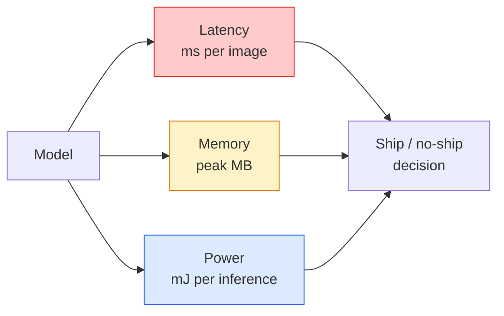

# 实时视觉——边缘部署

> 边缘推理（edge inference）这门学问，就是让一个准确率 90 的模型在只有 2 GB 内存的设备上跑出 30 fps。每一个百分点的准确率，都要拿延迟的毫秒数来换。

**Type:** Learn + Build
**Languages:** Python
**Prerequisites:** Phase 4 Lesson 04 (Image Classification), Phase 10 Lesson 11 (Quantization)
**Time:** ~75 minutes

## 学习目标

- 测量任意 PyTorch 模型的推理延迟、峰值内存和吞吐量，并读懂 FLOPs / 参数量 / 延迟之间的权衡
- 使用 PyTorch 的训练后量化（post-training quantisation）将视觉模型量化到 INT8，并验证准确率损失 < 1%
- 导出为 ONNX 并用 ONNX Runtime 或 TensorRT 编译；说出三种最常见的导出失败及其修复方法
- 解释在不同边缘约束下，何时该选 MobileNetV3、EfficientNet-Lite、ConvNeXt-Tiny 或 MobileViT

## 问题背景

训练阶段的视觉模型是个浮点怪兽：1 亿参数，每次前向传播 10 GFLOPs，2 GB 显存。这些没有一样能塞进手机、汽车的车机系统、工业相机或无人机。要交付一个视觉系统，意味着把同样的预测能力装进一个小 100 倍的预算里。

三个旋钮承担了大部分工作：模型选择（用同样的训练配方换一个更小的架构）、量化（用 INT8 替代 FP32）、推理运行时（ONNX Runtime、TensorRT、Core ML、TFLite）。把这三者调对，决定了你做出来的是一个只能跑在工作站上的演示，还是一个能装进 30 美元相机模组里出货的产品。

这节课先建立测量纪律（测不准就谈不上优化），然后逐一过这三个旋钮。目标不是学会每一种边缘运行时，而是知道有哪些杠杆可以拉，以及如何验证每个杠杆确实在做你以为它在做的事。

## 核心概念

### 三种预算



- **延迟**：p50、p95、p99。只看 p50 的平均会掩盖尾部行为，而尾部正是实时系统的命门。
- **峰值内存**：设备见到过的最大值，而不是稳态平均值。之所以重要，是因为在嵌入式目标上 OOM 是致命的。
- **功耗 / 能耗**：电池供电设备上每次推理消耗的毫焦数。通常用 CPU/GPU 利用率 × 时间来近似。

边缘部署的决策依据就是一张（模型、延迟、内存、准确率）的表格。表中每个格子都必须在目标设备上实测，而不是在工作站上。

### 测量纪律

每一份边缘性能剖析都应该遵守的三条规则：

1. **预热（warm up）**：测量前先跑 5-10 次假数据前向传播。冷缓存和 JIT 编译会让最初几次的数字失真。
2. **同步（synchronise）**：GPU 工作负载要在计时代码块前后调用 `torch.cuda.synchronize()`。否则你测到的是内核调度时间，而不是内核执行时间。
3. **固定输入尺寸**为生产分辨率。224x224 上的延迟不等于 512x512 上的延迟。

### FLOPs 作为代理指标

FLOPs（每次推理的浮点运算次数）是一个廉价的、与设备无关的延迟代理指标。用来比较架构很有用，但当作绝对的实际耗时就会产生误导。一个 FLOPs 多 10% 的模型在实践中可能反而快 2 倍，因为它用的是对硬件友好的算子（深度卷积编译得很好，大尺寸 7x7 卷积则不然）。

经验法则：架构搜索用 FLOPs，部署决策用目标设备上的实测延迟。

### 一段话讲清量化

把 FP32 的权重和激活值替换成 INT8。模型体积缩小 4 倍，内存带宽需求降低 4 倍，在有 INT8 内核的硬件上（每一款现代移动 SoC、每一块带 Tensor Core 的 NVIDIA GPU）算力开销降低 2-4 倍。视觉任务上，训练后静态量化的准确率损失通常在 0.1-1 个百分点。

类型：

- **动态量化（Dynamic）**——权重量化为 INT8，激活值仍用浮点计算。简单，加速幅度小。
- **静态量化（Static，训练后）**——量化权重，并在一个小型校准集上标定激活值范围。比动态量化快得多。
- **量化感知训练（Quantisation-aware training, QAT）**——训练过程中模拟量化，让模型学着适应。准确率最好，但需要带标注的数据。

对视觉任务来说，训练后静态量化用 5% 的工作量换来 95% 的收益。只有当 PTQ 的准确率损失不可接受时才用 QAT。

### 剪枝与蒸馏

- **剪枝（Pruning）**——移除不重要的权重（基于幅值）或通道（结构化剪枝）。在过参数化的模型上效果好；在本来就紧凑的架构上用处不大。
- **蒸馏（Distillation）**——训练一个小的学生模型去模仿大的教师模型的 logits。通常能找回缩小模型时丢掉的大部分准确率。是生产环境边缘模型的标准做法。

### 推理运行时

- **PyTorch eager**——慢，不能用于部署。仅供开发使用。
- **TorchScript**——已成历史。被 `torch.compile` 和 ONNX 导出取代。
- **ONNX Runtime**——中立的运行时。CPU、CUDA、CoreML、TensorRT、OpenVINO 都有对应的 ONNX provider。从这里入手。
- **TensorRT**——NVIDIA 的编译器。在 NVIDIA GPU（工作站和 Jetson）上延迟最优。可以与 ONNX Runtime 集成，也可以独立使用。
- **Core ML**——Apple 面向 iOS/macOS 的运行时。需要 `.mlmodel` 或 `.mlpackage`。
- **TFLite**——Google 面向 Android/ARM 的运行时。需要 `.tflite`。
- **OpenVINO**——Intel 面向 CPU/VPU 的运行时。需要 `.xml` + `.bin`。

实践中的路线：PyTorch 导出 -> ONNX -> 按目标平台选运行时。ONNX 是通用语。

### 边缘架构选型表

| 预算 | 模型 | 理由 |
|--------|-------|-----|
| < 3M 参数 | MobileNetV3-Small | 到处都能编译，不错的基线 |
| 3-10M | EfficientNet-Lite-B0 | TFLite 上单位参数准确率最高 |
| 10-20M | ConvNeXt-Tiny | 单位参数准确率最佳，对 CPU 友好 |
| 20-30M | MobileViT-S 或 EfficientViT | 具备 ImageNet 级准确率的 Transformer |
| 30-80M | Swin-V2-Tiny | 前提是技术栈支持窗口注意力 |

除非有特殊理由，这些模型一律量化到 INT8。

```figure
cnn-param-count
```

## 从零实现

### 第 1 步：正确测量延迟

```python
import time
import torch

def measure_latency(model, input_shape, device="cpu", warmup=10, iters=50):
    model = model.to(device).eval()
    x = torch.randn(input_shape, device=device)
    with torch.no_grad():
        for _ in range(warmup):
            model(x)
        if device == "cuda":
            torch.cuda.synchronize()
        times = []
        for _ in range(iters):
            if device == "cuda":
                torch.cuda.synchronize()
            t0 = time.perf_counter()
            model(x)
            if device == "cuda":
                torch.cuda.synchronize()
            times.append((time.perf_counter() - t0) * 1000)
    times.sort()
    return {
        "p50_ms": times[len(times) // 2],
        "p95_ms": times[int(len(times) * 0.95)],
        "p99_ms": times[int(len(times) * 0.99)],
        "mean_ms": sum(times) / len(times),
    }
```

先预热，做同步，用 `time.perf_counter()`。报告分位数，而不是只报均值。

### 第 2 步：参数量与 FLOPs 统计

```python
def parameter_count(model):
    return sum(p.numel() for p in model.parameters())

def flops_estimate(model, input_shape):
    """
    Rough FLOP count for a conv/linear-only model. For production use `fvcore` or `ptflops`.
    """
    total = 0
    def conv_hook(m, inp, out):
        nonlocal total
        c_out, c_in, kh, kw = m.weight.shape
        h, w = out.shape[-2:]
        total += 2 * c_in * c_out * kh * kw * h * w
    def linear_hook(m, inp, out):
        nonlocal total
        total += 2 * m.in_features * m.out_features
    hooks = []
    for m in model.modules():
        if isinstance(m, torch.nn.Conv2d):
            hooks.append(m.register_forward_hook(conv_hook))
        elif isinstance(m, torch.nn.Linear):
            hooks.append(m.register_forward_hook(linear_hook))
    model.eval()
    with torch.no_grad():
        model(torch.randn(input_shape))
    for h in hooks:
        h.remove()
    return total
```

真实项目请用 `fvcore.nn.FlopCountAnalysis` 或 `ptflops`，它们能正确处理所有模块类型。

### 第 3 步：训练后静态量化

```python
def quantise_ptq(model, calibration_loader, backend="x86"):
    import torch.ao.quantization as tq
    model = model.eval().cpu()
    model.qconfig = tq.get_default_qconfig(backend)
    tq.prepare(model, inplace=True)
    with torch.no_grad():
        for x, _ in calibration_loader:
            model(x)
    tq.convert(model, inplace=True)
    return model
```

三个步骤：配置、prepare（插入观测器）、用真实数据校准、convert（融合 + 量化）。要求模型先做算子融合（`Conv -> BN -> ReLU` -> `ConvBnReLU`），这一步由 `torch.ao.quantization.fuse_modules` 处理。

### 第 4 步：导出为 ONNX

```python
def export_onnx(model, sample_input, path="model.onnx"):
    model = model.eval()
    torch.onnx.export(
        model,
        sample_input,
        path,
        input_names=["input"],
        output_names=["output"],
        dynamic_axes={"input": {0: "batch"}, "output": {0: "batch"}},
        opset_version=17,
    )
    return path
```

`opset_version=17` 是 2026 年的安全默认值。`dynamic_axes` 让你能以任意 batch size 运行 ONNX 模型。

### 第 5 步：基准测试与方案对比

```python
import torch.nn as nn
from torchvision.models import mobilenet_v3_small

def compare_regimes():
    model = mobilenet_v3_small(weights=None, num_classes=10)
    params = parameter_count(model)
    flops = flops_estimate(model, (1, 3, 224, 224))
    lat_fp32 = measure_latency(model, (1, 3, 224, 224), device="cpu")
    print(f"FP32 MobileNetV3-Small: {params:,} params  {flops/1e9:.2f} GFLOPs  "
          f"p50={lat_fp32['p50_ms']:.2f}ms  p95={lat_fp32['p95_ms']:.2f}ms")
```

对 `resnet50`、`efficientnet_v2_s` 和 `convnext_tiny` 跑同一个函数，你就得到了做部署决策所需的那张对比表。

## 生产实践

生产环境的技术栈最终都会收敛到三条路径之一：

- **Web / serverless**：PyTorch -> ONNX -> ONNX Runtime（CPU 或 CUDA provider）。最简单，对大多数场景已经够用。
- **NVIDIA 边缘设备（Jetson、GPU 服务器）**：PyTorch -> ONNX -> TensorRT。延迟最优，工程投入也最大。
- **移动端**：PyTorch -> ONNX -> Core ML（iOS）或 TFLite（Android）。导出前先量化。

测量方面，`torch-tb-profiler`、`nvprof` / `nsys` 以及 macOS 上的 Instruments 能给出逐层耗时分解。`benchmark_app`（OpenVINO）和 `trtexec`（TensorRT）能给出独立的命令行基准数字。

## 交付产物

这节课产出：

- `outputs/prompt-edge-deployment-planner.md`——一个提示词，根据目标设备和延迟 SLA 选出骨干网络、量化策略和运行时。
- `outputs/skill-latency-profiler.md`——一个技能，生成完整的延迟基准测试脚本，包含预热、同步、分位数统计和内存跟踪。

## 练习

1. **（简单）**在 CPU 上以 224x224 分辨率测量 `resnet18`、`mobilenet_v3_small`、`efficientnet_v2_s` 和 `convnext_tiny` 的 p50 延迟。报告对比表，并指出哪个架构的每毫秒准确率最高。
2. **（中等）**对 `mobilenet_v3_small` 应用训练后静态量化。在 CIFAR-10（或类似数据集）的留出子集上报告 FP32 与 INT8 的延迟对比和准确率损失。
3. **（困难）**将 `convnext_tiny` 导出为 ONNX，用 `onnxruntime` 的 `CPUExecutionProvider` 运行，与 PyTorch eager 基线对比延迟。找出 ONNX Runtime 开始更快的第一个层，并解释原因。

## 关键术语

| 术语 | 大家怎么说 | 实际含义 |
|------|----------------|----------------------|
| 延迟 | "有多快" | 从输入到输出的时间；用 p50/p95/p99 分位数衡量，而不是均值 |
| FLOPs | "模型大小" | 每次前向传播的浮点运算次数；计算开销的粗略代理指标 |
| INT8 量化 | "8 比特" | 用 8 位整数替代 FP32 权重/激活值；体积约缩小 4 倍，速度快 2-4 倍 |
| PTQ | "训练后量化" | 不重新训练就量化已训好的模型；简单，通常够用 |
| QAT | "量化感知训练" | 训练时模拟量化；准确率最好，需要带标注的数据 |
| ONNX | "中立格式" | 所有主流推理运行时都支持的模型交换格式 |
| TensorRT | "NVIDIA 编译器" | 把 ONNX 编译成面向 NVIDIA GPU 的优化引擎 |
| 蒸馏 | "教师 -> 学生" | 训练小模型模仿大模型的 logits；能找回大部分损失的准确率 |

## 延伸阅读

- [EfficientNet (Tan & Le, 2019)](https://arxiv.org/abs/1905.11946)——高效架构的复合缩放方法
- [MobileNetV3 (Howard et al., 2019)](https://arxiv.org/abs/1905.02244)——采用 h-swish 和 squeeze-excite 的移动优先架构
- [A Practical Guide to TensorRT Optimization (NVIDIA)](https://developer.nvidia.com/blog/accelerating-model-inference-with-tensorrt-tips-and-best-practices-for-pytorch-users/)——如何真正复现论文里的吞吐量数字
- [ONNX Runtime docs](https://onnxruntime.ai/docs/)——量化、计算图优化、provider 选择
