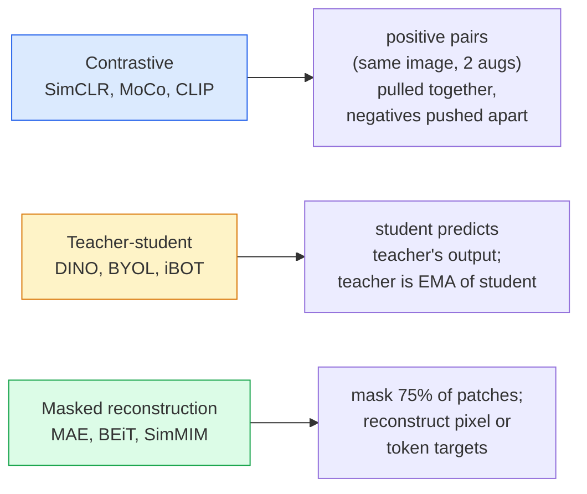

# 自监督视觉 — SimCLR、DINO、MAE

> 标签是监督式视觉的瓶颈。自监督预训练把它移除：先在 1 亿张无标签图像上学习视觉特征，再在 1 万张有标签图像上微调。

**Type:** Learn + Build
**Languages:** Python
**Prerequisites:** Phase 4 Lesson 04 (Image Classification), Phase 4 Lesson 14 (ViT)
**Time:** ~75 minutes

## 学习目标

- 梳理自监督学习的三大流派——对比学习（SimCLR）、师生蒸馏（DINO）、掩码重建（MAE）——并说出每种方法优化的目标是什么
- 从零实现 InfoNCE 损失，并解释为什么 batch size 为 512 时有效而 32 时会失败
- 解释为什么 MAE 的 75% 掩码率不是随意取的，以及它为何不同于 BERT 处理文本时的 15%
- 使用 DINOv2 或 MAE 的 ImageNet 检查点做线性探测（linear probing）和零样本检索

## 问题背景

监督式 ImageNet 有 130 万张带标签图像，标注成本估计高达 1000 万美元。医疗和工业数据集规模更小、标注成本更高。每个视觉团队都会问：能否先在廉价的无标签数据上预训练——YouTube 视频帧、网络爬取图片、摄像头录像、卫星扫描影像——然后再在一个小的有标签数据集上微调？

自监督学习（self-supervised learning）就是答案。一个在 LAION 或 JFT 上训练的现代自监督 ViT，微调后能达到甚至超过监督式 ImageNet 的精度。它迁移到下游任务（检测、分割、深度估计）的效果也优于监督预训练。DINOv2（Meta，2023）和 MAE（Meta，2022）是目前可迁移视觉特征的生产环境默认选择。

概念上的转变在于：前置任务（pretext task）——也就是模型被训练去做的事情——不必是下游任务本身。关键是它要迫使模型学到有用的特征。预测灰度图像的颜色、旋转图像并让模型分类旋转角度、掩码图块再重建它们——这些都曾奏效。能够规模化的三种路线是对比学习、师生蒸馏和掩码重建。

## 核心概念

### 三大流派



### 对比学习（SimCLR）

取一张图像，施加两次随机数据增强，得到两个视图。将两者送入同一个编码器加投影头。最小化一个损失，它表达的含义是"这两个嵌入应该靠近"以及"这个嵌入应该远离批次中所有其他图像的嵌入"。

```
Loss for positive pair (z_i, z_j) among 2N views per batch:

   L_ij = -log( exp(sim(z_i, z_j) / tau) / sum_k in batch \ {i} exp(sim(z_i, z_k) / tau) )

sim = cosine similarity
tau = temperature (0.1 standard)
```

这就是 InfoNCE 损失。每个正样本对需要大量负样本，因此 batch size 很重要——SimCLR 需要 512-8192。MoCo 引入了由历史批次构成的动量队列（momentum queue），把负样本数量与 batch size 解耦。

### 师生蒸馏（DINO）

两个架构相同的网络：学生（student）和教师（teacher）。教师的权重是学生权重的指数移动平均（EMA）。两者都看到图像的增强视图。训练学生的输出去匹配教师的输出——没有显式的负样本。

```
loss = CE( student_output(view_1),  teacher_output(view_2) )
     + CE( student_output(view_2),  teacher_output(view_1) )

teacher_weights = m * teacher_weights + (1 - m) * student_weights   (m ≈ 0.996)
```

它为什么不会坍缩成"预测一个常数"：教师的输出经过中心化（减去逐维度均值）和锐化（除以一个小温度）。中心化防止某个维度占主导；锐化防止输出坍缩为均匀分布。

DINOv2 把 DINO 扩展到了 1.42 亿张精选图像上训练。所得特征是目前零样本视觉检索和稠密预测任务上的 SOTA。

### 掩码重建（MAE）

把 ViT 输入的 75% 图块掩盖掉。只把可见的 25% 送入编码器。一个小解码器接收编码器的输出，并在被掩位置插入掩码 token，训练目标是重建被掩图块的像素。

```
Encoder:  visible 25% of patches -> features
Decoder:  features + mask tokens at masked positions -> reconstructed pixels
Loss:     MSE between reconstructed and original pixels on masked patches only
```

让 MAE 奏效的关键设计选择：

- **75% 掩码率**——很高。迫使编码器学习语义特征；只重建 25% 几乎毫无难度（相邻像素相关性极强，一个 CNN 就能轻松搞定）。
- **非对称的编码器/解码器**——大型 ViT 编码器只看可见图块；一个小解码器（8 层、512 维）负责重建。预训练比朴素的 BEiT 快 3 倍。
- **像素空间重建目标**——比 BEiT 的 token 化目标更简单，并且在 ViT 上效果更好。

预训练结束后丢弃解码器。编码器就是特征提取器。

### 为什么是 75% 而不是 15%

BERT 掩盖 15% 的 token。MAE 掩盖 75%。差异源于信息密度。

- 自然语言的每个 token 熵很高。即使只预测 15% 的 token 也仍然困难，因为每个被掩位置都有许多合理的补全。
- 图像图块的熵很低——未被掩盖的邻域往往几乎能完全确定被掩图块的像素。要让预测必须依赖语义理解，就必须激进地掩盖。

75% 高到足以让简单的空间外推无法完成任务；编码器必须真正表征图像内容。

### 线性探测评估

自监督预训练之后，标准评估方法是**线性探测（linear probe）**：冻结编码器，在其上用 ImageNet 标签训练一个单层线性分类器。报告 top-1 准确率。

- SimCLR ResNet-50：约 71%（2020）
- DINO ViT-S/16：约 77%（2021）
- MAE ViT-L/16：约 76%（2022）
- DINOv2 ViT-g/14：约 86%（2023）

线性探测是对特征质量的纯粹度量；微调通常能再增加 2-5 个点，但也混入了分类头重新训练的影响。

## 从零实现

### 第一步：双视图增强流水线

```python
import torch
import torchvision.transforms as T

two_view_train = lambda: T.Compose([
    T.RandomResizedCrop(96, scale=(0.2, 1.0)),
    T.RandomHorizontalFlip(),
    T.ColorJitter(0.4, 0.4, 0.4, 0.1),
    T.RandomGrayscale(p=0.2),
    T.ToTensor(),
])


class TwoViewDataset(torch.utils.data.Dataset):
    def __init__(self, base):
        self.base = base
        self.aug = two_view_train()

    def __len__(self):
        return len(self.base)

    def __getitem__(self, i):
        img, _ = self.base[i]
        v1 = self.aug(img)
        v2 = self.aug(img)
        return v1, v2
```

每次 __getitem__ 返回同一张图像的两个增强视图；不需要标签。

### 第二步：InfoNCE 损失

```python
import torch.nn.functional as F

def info_nce(z1, z2, tau=0.1):
    """
    z1, z2: (N, D) L2-normalised embeddings of paired views
    """
    N, D = z1.shape
    z = torch.cat([z1, z2], dim=0)  # (2N, D)
    sim = z @ z.T / tau              # (2N, 2N)

    mask = torch.eye(2 * N, dtype=torch.bool, device=z.device)
    sim = sim.masked_fill(mask, float("-inf"))

    targets = torch.cat([torch.arange(N, 2 * N), torch.arange(0, N)]).to(z.device)
    return F.cross_entropy(sim, targets)
```

调用前先对嵌入做 L2 归一化。`tau=0.1` 是 SimCLR 的默认值；温度越低，损失越尖锐，需要的负样本也越多。

### 第三步：InfoNCE 的合理性检查

```python
z1 = F.normalize(torch.randn(16, 32), dim=-1)
z2 = z1.clone()
loss_same = info_nce(z1, z2, tau=0.1).item()
z2_random = F.normalize(torch.randn(16, 32), dim=-1)
loss_random = info_nce(z1, z2_random, tau=0.1).item()
print(f"InfoNCE with identical pairs:  {loss_same:.3f}")
print(f"InfoNCE with random pairs:     {loss_random:.3f}")
```

完全相同的样本对应给出低损失（在大 batch 和低温度下接近 0）。随机样本对在 16 对的批次下应给出 log(2N-1) = ~log(31) = ~3.4。

### 第四步：MAE 风格的掩码

```python
def random_mask_indices(num_patches, mask_ratio=0.75, seed=0):
    g = torch.Generator().manual_seed(seed)
    n_keep = int(num_patches * (1 - mask_ratio))
    perm = torch.randperm(num_patches, generator=g)
    visible = perm[:n_keep]
    masked = perm[n_keep:]
    return visible.sort().values, masked.sort().values


num_patches = 196
visible, masked = random_mask_indices(num_patches, mask_ratio=0.75)
print(f"visible: {len(visible)} / {num_patches}")
print(f"masked:  {len(masked)} / {num_patches}")
```

简单、快速，且在给定种子下结果确定。真实的 MAE 实现会把它批量化，并为每个样本保留各自的掩码。

## 生产实践

DINOv2 是 2026 年的生产环境标准：

```python
import torch
from transformers import AutoImageProcessor, AutoModel

processor = AutoImageProcessor.from_pretrained("facebook/dinov2-base")
model = AutoModel.from_pretrained("facebook/dinov2-base")
model.eval()

# Per-image embeddings for zero-shot retrieval
with torch.no_grad():
    inputs = processor(images=[pil_image], return_tensors="pt")
    outputs = model(**inputs)
    embedding = outputs.last_hidden_state[:, 0]  # CLS token
```

得到的 768 维嵌入是现代图像检索、稠密对应和零样本迁移流水线的基石。在下游任务上微调时，往往只需要加一个线性头。

如果需要图文嵌入，对应的方案是 SigLIP 或 OpenCLIP；如果做 MAE 风格的微调，`timm` 仓库提供了所有 MAE 检查点。

## 交付产物

本课产出：

- `outputs/prompt-ssl-pretraining-picker.md` —— 一个提示词，根据数据集规模、算力和下游任务在 SimCLR / MAE / DINOv2 之间做选择。
- `outputs/skill-linear-probe-runner.md` —— 一个技能，为任意冻结编码器加有标签数据集编写线性探测评估代码。

## 练习

1. **（简单）** 验证：对于对齐良好的嵌入，降低温度会使 InfoNCE 损失下降；对于随机嵌入，降低温度会使损失上升。绘制 `tau in [0.05, 0.1, 0.2, 0.5]` 与损失的关系图。
2. **（中等）** 实现一个 DINO 风格的中心化缓冲区。证明在没有中心化的情况下，学生网络会在几个 epoch 内坍缩为一个常数向量。
3. **（困难）** 以第 10 课的 TinyUNet 为骨干网络，在 CIFAR-100 上训练 MAE。报告 10、50、200 个 epoch 时的线性探测准确率。证明在同一个 1,000 张图像的子集上，MAE 预训练后的线性探测优于从零开始监督训练的线性探测。

## 关键术语

| 术语 | 人们怎么说 | 实际含义 |
|------|----------------|----------------------|
| 自监督（Self-supervised） | "无标签学习" | 一种前置任务，从无标签数据中产出有用的表示 |
| 前置任务（Pretext task） | "假任务" | 自监督训练时使用的目标（重建图块、匹配视图）；预训练结束后即丢弃 |
| 线性探测（Linear probe） | "冻结编码器 + 线性头" | 标准的 SSL 评估方法：只在冻结特征之上训练一个线性分类器 |
| InfoNCE | "对比损失" | 对余弦相似度做 softmax；正样本对是目标类别，其余全是负样本 |
| EMA 教师 | "移动平均教师" | 权重为学生权重指数移动平均的教师网络；BYOL、MoCo、DINO 都在用 |
| 掩码率（Mask ratio） | "被遮住的图块比例" | MAE 中被掩图块的比例；视觉为 75%，文本为 15% |
| 表示坍缩（Representation collapse） | "输出恒定" | SSL 的失败模式：编码器对所有输入都输出同一个常数向量；通过中心化、锐化或负样本来防止 |
| DINOv2 | "生产级 SSL 骨干网络" | Meta 2023 年的自监督 ViT；2026 年最强的通用图像特征 |

## 延伸阅读

- [SimCLR (Chen et al., 2020)](https://arxiv.org/abs/2002.05709) —— 对比学习的参考文献
- [DINO (Caron et al., 2021)](https://arxiv.org/abs/2104.14294) —— 带动量、中心化和锐化的师生蒸馏
- [MAE (He et al., 2022)](https://arxiv.org/abs/2111.06377) —— ViT 的掩码自编码器预训练
- [DINOv2 (Oquab et al., 2023)](https://arxiv.org/abs/2304.07193) —— 把自监督 ViT 扩展为生产级特征
