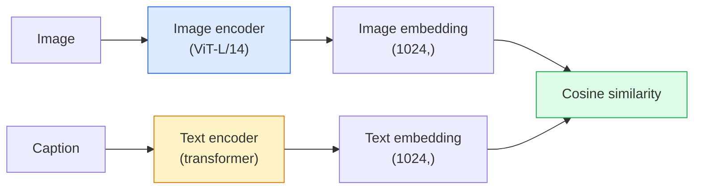

# 开放词表视觉 — CLIP

> 把图像编码器和文本编码器联合训练，让匹配的（图像，描述文本）对在共享空间中落到同一个点上。整个诀窍就是这么简单。

**Type:** Build + Use
**Languages:** Python
**Prerequisites:** Phase 4 Lesson 14 (ViT), Phase 4 Lesson 17 (Self-Supervised)
**Time:** ~45 minutes

## 学习目标

- 解释 CLIP 的双塔（two-tower）架构与对比学习训练目标
- 使用预训练的 CLIP（或 SigLIP）做零样本分类（zero-shot classification），无需任何针对具体任务的训练
- 从零实现零样本分类：编码类别提示词、计算余弦相似度、取 argmax
- 区分 CLIP、SigLIP、OpenCLIP 以及 LLaVA/LLaMA-vision 模型 —— 2026 年它们各自的用途

## 问题背景

传统分类器是封闭词表的：一个 1000 类的 ImageNet 模型只能预测这 1000 个标签。每增加一个新类别，都需要标注数据并重新训练分类头。

CLIP（Radford et al., OpenAI 2021）证明：在从网络抓取的 4 亿（图像，描述文本）对上训练，可以得到一个在推理时能对任意类别集合做分类的模型 —— 类别完全用自然语言描述。想加一个新类别，写一句话就行。

这种能力 —— 零样本迁移（zero-shot transfer）—— 正是每个现代视觉系统都从 CLIP 家族检查点起步的原因。检测（Grounding DINO、OWL-ViT）、分割（CLIPSeg、SAM）、检索、内容审核、VLM、文生图，全都建立在 CLIP 式的联合嵌入之上。

## 核心概念

### 双塔结构



两个编码器最后都接一个线性投影，映射到相同的嵌入维度（CLIP-B/32 是 512，CLIP-L/14 是 1024）。做 L2 归一化后计算余弦相似度。

### 训练目标

给定一个包含 N 个（图像，描述文本）对的批次，构建一个 NxN 的相似度矩阵。联合训练两个编码器，使对角线（匹配的对）相似度高、非对角线（不匹配的对）相似度低。

```
sim_matrix = image_embeddings @ text_embeddings.T / tau

loss_i2t = cross_entropy(sim_matrix,       targets=arange(N))
loss_t2i = cross_entropy(sim_matrix.T,     targets=arange(N))
loss = (loss_i2t + loss_t2i) / 2
```

损失是对称的，因为图像到文本和文本到图像两个方向的检索都要可用。`tau`（温度）通常作为一个标量参数学习得到，初始化为 0.07。

### SigLIP：更好的损失函数

SigLIP（Zhai et al., 2023）把 softmax 换成了逐对的 sigmoid：

```
loss = mean over pairs of log(1 + exp(-y_ij * sim_ij))
y_ij = +1 if matching, -1 otherwise
```

逐对损失去掉了 CLIP 所依赖的批次级归一化。SigLIP 在小批次下训练效果更好，在数据量相同时表现持平或超过 CLIP。

### 零样本分类

给定一个训练好的 CLIP：

1. 为每个类别构造一个提示词："a photo of a {class}"。
2. 用文本编码器编码所有类别提示词 -> `T`，形状 (C, d)。
3. 编码测试图像 -> `I`，形状 (1, d)。
4. 相似度 = `I @ T.T`，形状 (1, C)。
5. 取 argmax -> 预测类别。

提示词工程很重要。OpenAI 为 ImageNet 发布了 80 个提示词模板（"a photo of a {}"、"a blurry photo of a {}"、"a sketch of a {}"……）。对每个类别把所有模板的嵌入取平均，可以额外提升 1-3% 的 top-1 准确率。

### 2026 年 CLIP 式模型的应用场景

- **零样本分类** —— 直接使用。
- **图像检索** —— 把所有图像编码一次，推理时只嵌入查询。
- **文本条件检测** —— Grounding DINO、OWL-ViT 在检测器外包了一个 CLIP 文本塔。
- **文本条件分割** —— CLIPSeg；SAM 通过 CLIP 支持文本提示输入。
- **VLM** —— LLaVA、Qwen-VL、InternVL 把 CLIP 家族的视觉编码器接入 LLM。
- **文生图** —— Stable Diffusion、DALL-E 3 以 CLIP 文本嵌入为条件生成图像。

一旦有了共享嵌入空间，所有"视觉+语言"任务都变成了一次距离计算。

## 从零实现

### 第 1 步：一个微型双塔模型

真正的 CLIP 是 ViT + Transformer。本课中两座塔都用作用在预提取特征上的小型 MLP，这样在 CPU 上就能看到训练信号。

```python
import torch
import torch.nn as nn
import torch.nn.functional as F


class TwoTower(nn.Module):
    def __init__(self, img_in=128, txt_in=64, emb=64):
        super().__init__()
        self.image_proj = nn.Sequential(nn.Linear(img_in, 128), nn.ReLU(), nn.Linear(128, emb))
        self.text_proj = nn.Sequential(nn.Linear(txt_in, 128), nn.ReLU(), nn.Linear(128, emb))
        self.logit_scale = nn.Parameter(torch.ones([]) * 2.6592)  # ln(1/0.07)

    def forward(self, img_feats, txt_feats):
        i = F.normalize(self.image_proj(img_feats), dim=-1)
        t = F.normalize(self.text_proj(txt_feats), dim=-1)
        return i, t, self.logit_scale.exp()
```

两个投影、输出维度共享、温度可学习。接口形态与真实 CLIP API 一致。

### 第 2 步：对比损失

```python
def clip_loss(image_emb, text_emb, logit_scale):
    N = image_emb.size(0)
    sim = logit_scale * image_emb @ text_emb.T
    targets = torch.arange(N, device=sim.device)
    l_i = F.cross_entropy(sim, targets)
    l_t = F.cross_entropy(sim.T, targets)
    return (l_i + l_t) / 2
```

对称损失。logit_scale 越大 = softmax 越尖锐 = 预测越自信，但有不稳定的风险。

### 第 3 步：零样本分类器

```python
@torch.no_grad()
def zero_shot_classify(model, image_feats, class_text_feats, class_names):
    """
    image_feats:      (N, img_in)
    class_text_feats: (C, txt_in)   one averaged embedding per class
    """
    i = F.normalize(model.image_proj(image_feats), dim=-1)
    t = F.normalize(model.text_proj(class_text_feats), dim=-1)
    sim = i @ t.T
    pred = sim.argmax(dim=-1)
    return [class_names[p] for p in pred.tolist()]
```

每一步一行代码。这正是生产环境中使用 CLIP 检查点做零样本分类的完整流程。

### 第 4 步：健全性检查

```python
torch.manual_seed(0)
model = TwoTower()

img = torch.randn(8, 128)
txt = torch.randn(8, 64)
i, t, scale = model(img, txt)
loss = clip_loss(i, t, scale)
print(f"batch size: {i.size(0)}   loss: {loss.item():.3f}")
```

对一个随机初始化的模型，损失应该接近 `log(N) = log(8) = 2.08` —— 这是尚未学到任何结构时对称交叉熵的理论值。

## 生产实践

OpenCLIP 是 2026 年的社区默认选择：

```python
import open_clip
import torch
from PIL import Image

model, _, preprocess = open_clip.create_model_and_transforms("ViT-B-32", pretrained="laion2b_s34b_b79k")
tokenizer = open_clip.get_tokenizer("ViT-B-32")

image = preprocess(Image.open("dog.jpg")).unsqueeze(0)
text = tokenizer(["a photo of a dog", "a photo of a cat", "a photo of a car"])

with torch.no_grad():
    image_features = model.encode_image(image)
    text_features = model.encode_text(text)
    image_features = image_features / image_features.norm(dim=-1, keepdim=True)
    text_features = text_features / text_features.norm(dim=-1, keepdim=True)
    probs = (100.0 * image_features @ text_features.T).softmax(dim=-1)

print(probs)
```

SigLIP 更新、在小规模下训练效果更好，是新项目的首选：`google/siglip-base-patch16-224`。Hugging Face 两者都提供。

## 交付产物

本课产出：

- `outputs/prompt-zero-shot-class-picker.md` —— 一个提示词：给定类别列表和领域，为零样本 CLIP 设计类别模板。
- `outputs/skill-image-text-retriever.md` —— 一个技能：用任意 CLIP 检查点构建图像嵌入索引，支持以文搜图和以图搜图。

## 练习

1. **（简单）** 使用预训练的 OpenCLIP ViT-B/32，配合 80 个模板的提示词集合，在 CIFAR-10 上做零样本分类。报告 top-1 准确率，应该在 85-90% 左右。
2. **（中等）** 在同一个 CIFAR-10 任务上，对比单模板（"a photo of a {}"）与 80 个模板平均嵌入的效果。量化差距，并解释为什么多模板有帮助。
3. **（困难）** 构建一个零样本图像检索索引：用 CLIP 嵌入 1,000 张图像，构建 FAISS 索引，用自然语言描述进行查询。手写 20 条留出查询，报告检索的 recall@5。

## 关键术语

| 术语 | 人们怎么说 | 实际含义 |
|------|----------------|----------------------|
| 双塔 | "Dual encoder" | 独立的图像与文本编码器，最后各接一个映射到共享维度的投影头 |
| 零样本 | "无需任务专属训练" | 推理时对仅用文本描述的类别做分类；全程不碰任何标签 |
| 温度 / logit_scale | "tau" | 一个学习得到的标量，在 softmax 之前缩放相似度矩阵 |
| 提示词模板 | "A photo of a {}" | 包裹类别名的自然语言句式；对多个模板取平均能提升零样本准确率 |
| CLIP | "图像+文本模型" | 2021 年 OpenAI 的模型；2026 年该领域的通用词汇 |
| SigLIP | "Sigmoid 版 CLIP" | 把 softmax 换成逐对 sigmoid；小批次下训练效果更好 |
| OpenCLIP | "开源复现" | 社区在 LAION 上训练的 CLIP 变体；开源流水线的生产默认选择 |
| VLM | "视觉语言模型" | CLIP 家族编码器加上一个 LLM，训练后能回答关于图像的问题 |

## 延伸阅读

- [CLIP: Learning Transferable Visual Models from Natural Language Supervision (Radford et al., 2021)](https://arxiv.org/abs/2103.00020)
- [SigLIP: Sigmoid Loss for Language-Image Pre-Training (Zhai et al., 2023)](https://arxiv.org/abs/2303.15343)
- [OpenCLIP](https://github.com/mlfoundations/open_clip) —— 社区代码库
- [DINOv2 vs CLIP vs MAE: a features comparison](https://huggingface.co/blog/dinov2) —— HF 指南，并列对比各自的使用场景
