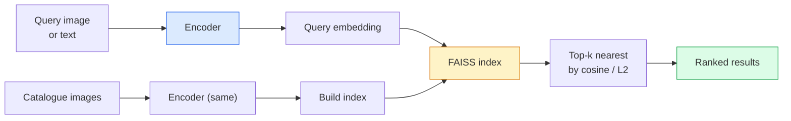

# 图像检索与度量学习

> 检索系统根据嵌入空间中的距离对候选项排序。度量学习（Metric Learning）就是塑造这个空间的学问，让距离表达出你想要的含义。

**Type:** Build
**Languages:** Python
**Prerequisites:** Phase 4 Lesson 14 (ViT), Phase 4 Lesson 18 (CLIP)
**Time:** ~45 minutes

## 学习目标

- 解释三元组（triplet）、对比式（contrastive）和基于代理（proxy-based）的度量学习损失，并能针对给定数据集选出合适的那一个
- 正确实现 L2 归一化和余弦相似度，并能审视"同一物体"与"同一类别"两种检索的区别
- 构建 FAISS 索引，用文本和图像两种方式查询，并在保留查询集上报告 recall@K
- 把 DINOv2、CLIP 和 SigLIP 当作开箱即用的嵌入骨干网络使用，并清楚各自的优势场景

## 问题背景

检索在生产级视觉系统中无处不在：重复图片检测、以图搜图、视觉搜索（"找相似商品"）、人脸重识别、用于安防的行人重识别（person re-ID）、电商场景的实例级匹配。产品层面的问题始终是同一个："给定这张查询图片，对我的商品库排序。"

两个设计决策决定了整个系统。一是嵌入——用什么模型生成向量；二是索引——如何在大规模下找最近邻。到 2026 年这两者都已是现成商品（嵌入用 DINOv2，索引用 FAISS），这反而抬高了门槛：真正难的是为你的应用定义*什么才算相似*，然后塑造嵌入空间，让距离与这个定义吻合。

这种塑造就是度量学习。它是一个体量不大但杠杆极高的学问。

## 核心概念

### 检索全景图



### 四大损失家族

| 损失 | 需要的数据 | 优点 | 缺点 |
|------|----------|------|------|
| **对比损失（Contrastive）** | (锚点, 正样本) + 负样本 | 简单，任何成对标签都能用 | 没有大量负样本时收敛慢 |
| **三元组损失（Triplet）** | (锚点, 正样本, 负样本) | 直观；能直接控制间隔 | 困难三元组挖掘开销大 |
| **NT-Xent / InfoNCE** | 成对样本 + 批内挖掘的负样本 | 可扩展到大批量 | 需要大 batch 或动量队列 |
| **基于代理（ProxyNCA）** | 仅需类别标签 | 快、稳定、无需挖掘 | 小数据集上可能过拟合到代理 |

对大多数生产场景，先用预训练骨干网络起步，只有当现成嵌入在你的测试集上表现不佳时，才追加度量学习微调。

### 三元组损失的形式化定义

```
L = max(0, ||f(a) - f(p)||^2 - ||f(a) - f(n)||^2 + margin)
```

把锚点 `a` 拉近正样本 `p`，推远负样本 `n`，再用 `margin` 保证两者之间留有间隔。这种三图结构可以推广到任意相似度排序。

挖掘策略很关键：简单三元组（`n` 本来就离 `a` 很远）贡献的损失为零；只有困难三元组才能教会网络。半困难挖掘（`n` 比 `p` 更远，但仍在间隔之内）是 2016 年 FaceNet 的配方，至今仍是主流。

### 余弦相似度 vs L2

两种度量，两种约定：

- **余弦**：向量之间的夹角。要求嵌入做过 L2 归一化。
- **L2**：欧氏距离。原始或归一化嵌入都能用，但通常与"L2 归一化 + 平方 L2"搭配。

对大多数现代网络而言两者等价：当 `||a|| = ||b|| = 1` 时，`||a - b||^2 = 2 - 2 cos(a, b)`。选择与你的嵌入训练方式一致的约定；混用会悄悄改变"最近"的含义。

### Recall@K

检索的标准指标：

```
recall@K = fraction of queries where at least one correct match is in the top K results
```

把 recall@1、@5、@10 并排报告。如果 recall@10 高于 0.95 而 recall@1 低于 0.5，说明嵌入空间结构正确但排序有噪声——可以尝试更长的微调或加一个重排序（re-ranking）步骤。

对重复检测来说 precision@K 更重要，因为每个误报都是用户可见的错误。对视觉搜索来说，recall@K 才是产品信号。

### 一段话讲清 FAISS

Facebook AI Similarity Search，事实上的最近邻搜索标准库。三种索引选择：

- `IndexFlatIP` / `IndexFlatL2` —— 暴力穷举，精确，无需训练。可用到约 100 万向量。
- `IndexIVFFlat` —— 划分为 K 个单元，只搜索最近的几个单元。近似、快，需要训练数据。
- `IndexHNSW` —— 基于图，多查询场景下最快，索引体积较大。

10 万向量时大概率用 `IndexFlatIP` 配余弦相似度。1000 万向量时用 `IndexIVFFlat`。1 亿以上则结合乘积量化（`IndexIVFPQ`）。

### 实例级 vs 类别级检索

同名之下是两个截然不同的问题：

- **类别级** —— "在我的商品库里找猫。"按类别条件的相似度；现成的 CLIP / DINOv2 嵌入效果就很好。
- **实例级** —— "在我的商品库里找*这一件具体商品*。"需要在同类视觉相似物体之间做细粒度区分；现成嵌入表现不佳；用度量学习微调才有价值。

选模型之前，先问清楚你解决的是哪一个。

## 从零实现

### 第 1 步：三元组损失

```python
import torch
import torch.nn.functional as F

def triplet_loss(anchor, positive, negative, margin=0.2):
    d_ap = F.pairwise_distance(anchor, positive, p=2)
    d_an = F.pairwise_distance(anchor, negative, p=2)
    return F.relu(d_ap - d_an + margin).mean()
```

一行核心代码。L2 归一化或原始嵌入都适用。

### 第 2 步：半困难挖掘

给定一个批次的嵌入和标签，为每个锚点找出最难的半困难负样本。

```python
def semi_hard_negatives(emb, labels, margin=0.2):
    dist = torch.cdist(emb, emb)
    same_class = labels[:, None] == labels[None, :]
    diff_class = ~same_class
    N = emb.size(0)

    positives = dist.clone()
    positives[~same_class] = float("-inf")
    positives.fill_diagonal_(float("-inf"))
    pos_idx = positives.argmax(dim=1)

    semi_hard = dist.clone()
    semi_hard[same_class] = float("inf")
    d_ap = dist[torch.arange(N), pos_idx].unsqueeze(1)
    semi_hard[dist <= d_ap] = float("inf")
    neg_idx = semi_hard.argmin(dim=1)

    fallback_mask = semi_hard[torch.arange(N), neg_idx] == float("inf")
    if fallback_mask.any():
        hardest = dist.clone()
        hardest[same_class] = float("inf")
        neg_idx = torch.where(fallback_mask, hardest.argmin(dim=1), neg_idx)
    return pos_idx, neg_idx
```

每个锚点都会配上类内最难的正样本，以及一个比正样本更远但仍在间隔之内的半困难负样本。

### 第 3 步：Recall@K

```python
def recall_at_k(query_emb, gallery_emb, query_labels, gallery_labels, k=1):
    sim = query_emb @ gallery_emb.T
    _, top_k = sim.topk(k, dim=-1)
    matches = (gallery_labels[top_k] == query_labels[:, None]).any(dim=-1)
    return matches.float().mean().item()
```

在 L2 归一化嵌入上按内积取 top-k，等价于按余弦取 top-k。报告"至少命中一个正确邻居"的查询占比的均值。

### 第 4 步：整合起来

```python
import torch
import torch.nn as nn
from torch.optim import Adam

class Encoder(nn.Module):
    def __init__(self, in_dim=128, emb_dim=64):
        super().__init__()
        self.net = nn.Sequential(
            nn.Linear(in_dim, 128), nn.ReLU(),
            nn.Linear(128, emb_dim),
        )

    def forward(self, x):
        return F.normalize(self.net(x), dim=-1)

torch.manual_seed(0)
num_classes = 6
protos = F.normalize(torch.randn(num_classes, 128), dim=-1)

def sample_batch(bs=32):
    labels = torch.randint(0, num_classes, (bs,))
    x = protos[labels] + 0.15 * torch.randn(bs, 128)
    return x, labels

enc = Encoder()
opt = Adam(enc.parameters(), lr=3e-3)

for step in range(200):
    x, y = sample_batch(32)
    emb = enc(x)
    pos_idx, neg_idx = semi_hard_negatives(emb, y)
    loss = triplet_loss(emb, emb[pos_idx], emb[neg_idx])
    opt.zero_grad(); loss.backward(); opt.step()
```

训练几百步之后，嵌入会聚集成每个类别一簇。

## 生产实践

2026 年的生产技术栈：

- **DINOv2 + FAISS** —— 通用视觉检索。开箱即用。
- **CLIP + FAISS** —— 查询是文本时用。
- **微调后的 DINOv2 + FAISS** —— 实例级检索、人脸重识别、时尚、电商。
- **Milvus / Weaviate / Qdrant** —— 包装了 FAISS 或 HNSW 的托管向量数据库。

要做 SOTA 实例检索，配方是：DINOv2 骨干网络，加一个嵌入头，在带实例标签的样本对上用三元组或 InfoNCE 损失微调，再用 FAISS 建索引。

## 交付产物

本课产出：

- `outputs/prompt-retrieval-loss-picker.md` —— 一个提示词，针对给定检索问题在 triplet / InfoNCE / ProxyNCA 之间做选择。
- `outputs/skill-recall-at-k-runner.md` —— 一个技能，生成干净的 recall@K 评估框架，包含训练/验证/检索库划分和规范的数据契约。

## 练习

1. **（简单）** 运行上面的玩具示例。训练前后分别用 PCA 把嵌入画出来，观察六个簇的形成过程。
2. **（中等）** 加一个 ProxyNCA 损失实现：每个类别一个可学习的"代理"，在余弦相似度上做标准交叉熵。在玩具数据上对比它与三元组损失的收敛速度。
3. **（困难）** 取 1,000 张 ImageNet 验证集图片，通过 HuggingFace 用 DINOv2 做嵌入，构建 FAISS 平面索引，然后报告 recall@{1, 5, 10}：先用原图自查（应为 1.0），再用以 ImageNet 标签为真值的保留划分查询。

## 关键术语

| 术语 | 大家怎么说 | 实际含义 |
|------|----------------|----------------------|
| 度量学习 | "塑造空间" | 训练编码器，使其输出空间中的距离反映目标相似度 |
| 三元组损失 | "一拉一推" | L = max(0, d(a, p) - d(a, n) + margin)；度量学习的经典损失 |
| 半困难挖掘 | "有用的负样本" | 比正样本离锚点更远、但仍在间隔之内的负样本；经验上信息量最大 |
| 基于代理的损失 | "类别原型" | 每类一个可学习代理；在与代理的相似度上做交叉熵；无需成对挖掘 |
| Recall@K | "Top-K 命中率" | 前 K 个结果中至少有一个正确结果的查询占比 |
| 实例检索 | "找这一件具体的东西" | 细粒度匹配；现成特征通常表现不佳 |
| FAISS | "那个最近邻库" | Facebook 的最近邻库；支持精确和近似索引 |
| HNSW | "图索引" | 分层可导航小世界图；快速近似最近邻，内存开销小 |

## 延伸阅读

- [FaceNet: A Unified Embedding for Face Recognition (Schroff et al., 2015)](https://arxiv.org/abs/1503.03832) —— 三元组损失 / 半困难挖掘的开山论文
- [In Defense of the Triplet Loss for Person Re-Identification (Hermans et al., 2017)](https://arxiv.org/abs/1703.07737) —— 三元组微调的实用指南
- [FAISS documentation](https://github.com/facebookresearch/faiss/wiki) —— 每种索引、每个权衡
- [SMoT: Metric Learning Taxonomy (Kim et al., 2021)](https://arxiv.org/abs/2010.06927) —— 现代损失函数及其内在联系的综述
