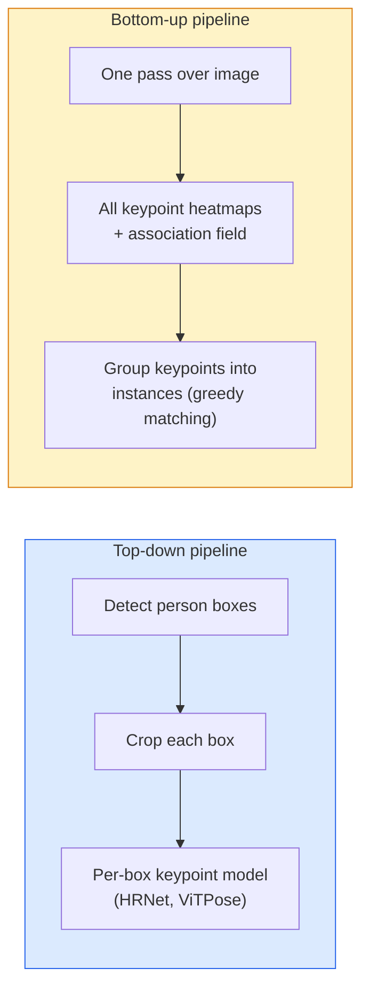

# 关键点检测与姿态估计

> 一个姿态就是一组有序的关键点。一个关键点检测器就是一个热力图回归器。其余的都只是记账工作。

**Type:** Build
**Languages:** Python
**Prerequisites:** Phase 4 Lesson 06 (Detection), Phase 4 Lesson 07 (U-Net)
**Time:** ~45 minutes

## 学习目标

- 区分自顶向下（top-down）和自底向上（bottom-up）两种姿态估计方法，并说明各自的适用场景
- 用「每个关键点一个高斯分布」的目标回归 K 个关键点的热力图，并在推理时提取关键点坐标
- 解释部位亲和场（Part Affinity Fields, PAFs）以及自底向上流水线如何将关键点关联到各个实例
- 使用 MediaPipe Pose 或 MMPose 进行生产级关键点估计，并理解它们的输出格式

## 问题背景

关键点任务藏在许多不同的名字之下：人体姿态（17 个身体关节）、人脸关键点（68 或 478 个点）、手部（21 个点）、动物姿态、机器人物体位姿、医学解剖标志点。它们全都共享同一种结构：检测物体上的 K 个离散点，并输出它们的 (x, y) 坐标。

姿态估计是动作捕捉、健身应用、体育数据分析、手势控制、动画、AR 试穿和机器人抓取的基础。2D 情形已经成熟；3D 姿态（从单个相机估计关节在世界坐标系中的位置）是当前的研究前沿。

工程上的核心问题是规模。单张图、单人姿态是一个 20ms 量级的问题。人群中以 30 fps 进行多人姿态估计则是另一个问题，需要不同的架构。

## 核心概念

### 自顶向下 vs 自底向上



- **自顶向下（Top-down）** —— 先检测出人，再对每个裁剪框运行一个单人关键点模型。精度最高；耗时随人数线性增长。
- **自底向上（Bottom-up）** —— 一次前向传播预测所有关键点外加一个关联场，再做分组。无论人群多大，耗时恒定。

自顶向下方法（HRNet、ViTPose）是精度上的领先者；自底向上方法（OpenPose、HigherHRNet）则是拥挤场景下吞吐量上的领先者。

### 热力图回归

不直接回归 `(x, y)`，而是为每个关键点预测一张 `H x W` 的热力图，其中以真实位置为中心放置一个高斯峰。

```
target[k, y, x] = exp(-((x - cx_k)^2 + (y - cy_k)^2) / (2 sigma^2))
```

推理时，每张热力图的 argmax 就是预测的关键点位置。

为什么热力图比直接回归效果更好：网络的空间结构（卷积特征图）天然与空间输出对齐。高斯目标还起到正则化作用——一个小的定位误差只产生小的损失，而不是零损失。

### 亚像素定位

Argmax 只能给出整数坐标。要获得亚像素精度，可以对 argmax 及其相邻点拟合抛物线进行精化，或使用著名的偏移方向 `(dx, dy) = 0.25 * (heatmap[y, x+1] - heatmap[y, x-1], ...)`。

### 部位亲和场（PAFs）

这是 OpenPose 用于自底向上关联的技巧。对每一对相连的关键点（例如左肩到左肘），预测一个 2 通道的场，编码从一个点指向另一个点的单位向量。要把一个肩膀和它对应的肘部关联起来，就沿候选点对之间的连线对 PAF 做积分；积分值最高的点对即被匹配。

```
For each connection (limb):
  PAF channels: 2 (unit vector x, y)
  Line integral: sum over sample points of (PAF . line_direction)
  Higher integral = stronger match
```

优雅，并且无需逐人裁剪即可扩展到任意规模的人群。

### COCO 关键点

标准的人体姿态数据集：每人 17 个关键点，以 PCK（Percentage of Correct Keypoints，正确关键点百分比）和 OKS（Object Keypoint Similarity，目标关键点相似度）作为指标。OKS 是关键点领域中 IoU 的对应物，也是 COCO mAP@OKS 所报告的内容。

### 2D vs 3D

- **2D 姿态** —— 图像坐标系；已达到生产级质量（MediaPipe、HRNet、ViTPose）。
- **3D 姿态** —— 世界 / 相机坐标系；仍是活跃的研究方向。常见方法：
  - 用一个小型 MLP 把 2D 预测提升到 3D（VideoPose3D）。
  - 从图像直接回归 3D（PyMAF、MHFormer）。
  - 多视角配置（CMU Panoptic）用于获取真值。

## 从零实现

### 第 1 步：高斯热力图目标

```python
import numpy as np
import torch

def gaussian_heatmap(size, cx, cy, sigma=2.0):
    yy, xx = np.meshgrid(np.arange(size), np.arange(size), indexing="ij")
    return np.exp(-((xx - cx) ** 2 + (yy - cy) ** 2) / (2 * sigma ** 2)).astype(np.float32)

hm = gaussian_heatmap(64, 32, 32, sigma=2.0)
print(f"peak: {hm.max():.3f} at ({hm.argmax() % 64}, {hm.argmax() // 64})")
```

将各关键点的热力图沿通道维堆叠，就得到完整的目标张量。

### 第 2 步：迷你关键点头

一个 U-Net 风格的模型，输出 K 个热力图通道。

```python
import torch.nn as nn
import torch.nn.functional as F

class TinyKeypointNet(nn.Module):
    def __init__(self, num_keypoints=4, base=16):
        super().__init__()
        self.down1 = nn.Sequential(nn.Conv2d(3, base, 3, 2, 1), nn.ReLU(inplace=True))
        self.down2 = nn.Sequential(nn.Conv2d(base, base * 2, 3, 2, 1), nn.ReLU(inplace=True))
        self.mid = nn.Sequential(nn.Conv2d(base * 2, base * 2, 3, 1, 1), nn.ReLU(inplace=True))
        self.up1 = nn.ConvTranspose2d(base * 2, base, 2, 2)
        self.up2 = nn.ConvTranspose2d(base, num_keypoints, 2, 2)

    def forward(self, x):
        h1 = self.down1(x)
        h2 = self.down2(h1)
        h3 = self.mid(h2)
        u1 = self.up1(h3)
        return self.up2(u1)
```

输入为 `(N, 3, H, W)`，输出为 `(N, K, H, W)`。损失是相对高斯目标的逐像素 MSE。

### 第 3 步：推理——提取关键点坐标

```python
def heatmap_to_coords(heatmaps):
    """
    heatmaps: (N, K, H, W)
    returns:  (N, K, 2) float coordinates in image pixels
    """
    N, K, H, W = heatmaps.shape
    hm = heatmaps.reshape(N, K, -1)
    idx = hm.argmax(dim=-1)
    ys = (idx // W).float()
    xs = (idx % W).float()
    return torch.stack([xs, ys], dim=-1)

coords = heatmap_to_coords(torch.randn(2, 4, 32, 32))
print(f"coords: {coords.shape}")  # (2, 4, 2)
```

推理时只需一行代码。如需亚像素精化，在 argmax 周围做插值即可。

### 第 4 步：合成关键点数据集

很简单：在白色画布上画四个点，然后学习预测它们。

```python
def make_synthetic_sample(size=64):
    img = np.ones((3, size, size), dtype=np.float32)
    rng = np.random.default_rng()
    kps = rng.integers(8, size - 8, size=(4, 2))
    for cx, cy in kps:
        img[:, cy - 2:cy + 2, cx - 2:cx + 2] = 0.0
    hms = np.stack([gaussian_heatmap(size, cx, cy) for cx, cy in kps])
    return img, hms, kps
```

足够简单，一个迷你模型一分钟就能学会。

### 第 5 步：训练

```python
model = TinyKeypointNet(num_keypoints=4)
opt = torch.optim.Adam(model.parameters(), lr=3e-3)

for step in range(200):
    batch = [make_synthetic_sample() for _ in range(16)]
    imgs = torch.from_numpy(np.stack([b[0] for b in batch]))
    hms = torch.from_numpy(np.stack([b[1] for b in batch]))
    pred = model(imgs)
    # Upsample pred to full resolution
    pred = F.interpolate(pred, size=hms.shape[-2:], mode="bilinear", align_corners=False)
    loss = F.mse_loss(pred, hms)
    opt.zero_grad(); loss.backward(); opt.step()
```

## 生产实践

- **MediaPipe Pose** —— Google 的生产级姿态估计器；提供 WebGL 与移动端运行时，延迟低于 10ms。
- **MMPose**（OpenMMLab）—— 全面的研究代码库；涵盖所有 SOTA 架构并附带预训练权重。
- **YOLOv8-pose** —— 单次前向传播即可完成的最快实时多人姿态估计。
- **transformers HumanDPT / PoseAnything** —— 较新的视觉-语言方法，面向开放词汇姿态估计（任意物体、任意关键点集合）。

## 交付产物

本节课产出：

- `outputs/prompt-pose-stack-picker.md` —— 一个提示词，根据延迟、人群规模以及 2D vs 3D 需求在 MediaPipe / YOLOv8-pose / HRNet / ViTPose 之间做选择。
- `outputs/skill-heatmap-to-coords.md` —— 一个技能，编写所有生产级姿态模型都会用到的亚像素热力图转坐标例程。

## 练习

1. **（简单）** 在 4 点合成数据集上训练迷你关键点模型。报告 200 步后预测关键点与真实关键点之间的平均 L2 误差。
2. **（中等）** 添加亚像素精化：给定 argmax 位置，利用相邻像素分别沿 x 和 y 方向拟合一维抛物线。报告相对于整数 argmax 的精度提升。
3. **（困难）** 构建一个双人合成数据集，每张图像包含两个 4 关键点图案的实例。训练一个带 PAFs 的自底向上流水线，预测每个关键点属于哪个实例，并用 OKS 进行评估。

## 关键术语

| 术语 | 大家怎么说 | 实际含义 |
|------|----------------|----------------------|
| 关键点（Keypoint） | 「一个标志点」 | 物体上一个特定的有序点（关节、角点、特征点） |
| 姿态（Pose） | 「骨架」 | 属于同一个实例的一组有序关键点 |
| 自顶向下（Top-down） | 「先检测再估姿态」 | 两阶段流水线：人体检测器 + 逐裁剪框关键点模型；精度最高 |
| 自底向上（Bottom-up） | 「先出关键点，再分组」 | 单次前向预测全部关键点 + 分组；耗时与人群规模无关 |
| 热力图（Heatmap） | 「高斯目标」 | 每个关键点一个 H x W 张量，峰值位于真实位置；首选的回归目标 |
| PAF | 「部位亲和场」 | 编码肢体方向的 2 通道单位向量场；用于把关键点分组到各实例 |
| OKS | 「关键点版 IoU」 | 目标关键点相似度（Object Keypoint Similarity）；COCO 的姿态评估指标 |
| HRNet | 「高分辨率网络」 | 占主导地位的自顶向下关键点架构；全程保留高分辨率特征 |

## 延伸阅读

- [OpenPose (Cao et al., 2017)](https://arxiv.org/abs/1812.08008) —— 基于 PAFs 的自底向上方法；至今仍是该方法最好的论述
- [HRNet (Sun et al., 2019)](https://arxiv.org/abs/1902.09212) —— 自顶向下的参考架构
- [ViTPose (Xu et al., 2022)](https://arxiv.org/abs/2204.12484) —— 用纯 ViT 作为姿态主干网络；在许多基准上是当前 SOTA
- [MediaPipe Pose](https://developers.google.com/mediapipe/solutions/vision/pose_landmarker) —— 生产级实时姿态估计；2026 年部署最快的技术栈
