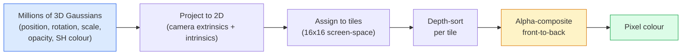

# 从零实现 3D Gaussian Splatting

> 一个场景就是由数百万个 3D 高斯组成的点云。每个高斯都有位置、朝向、缩放、不透明度，以及随观察方向变化的颜色。把它们光栅化，再对光栅化过程反向传播，就完成了。

**Type:** Build
**Languages:** Python
**Prerequisites:** Phase 4 Lesson 13 (3D Vision & NeRF), Phase 1 Lesson 12 (Tensor Operations), Phase 4 Lesson 10 (Diffusion basics optional)
**Time:** ~90 minutes

## 学习目标

- 解释为什么到 2026 年，3D Gaussian Splatting 取代了 NeRF，成为照片级真实感 3D 重建的生产默认方案
- 说出每个高斯的六类参数（位置、旋转四元数、缩放、不透明度、球谐颜色、可选特征），以及各自占用多少个浮点数
- 从零实现一个基于 `alpha` 合成的 2D 高斯泼溅光栅化器，再展示 3D 情形如何通过投影归约到同一套循环
- 使用 `nerfstudio`、`gsplat` 或 `SuperSplat`，用 20-50 张照片重建一个场景，并导出为 `KHR_gaussian_splatting` glTF 扩展或 OpenUSD 26.03 的 `UsdVolParticleField3DGaussianSplat` schema

## 问题背景

NeRF 把场景存储为一个 MLP 的权重。渲染每个像素都要沿一条光线进行数百次 MLP 查询。训练耗时数小时，渲染耗时数秒，而且权重无法编辑——想在场景里挪动一把椅子，只能重新训练。

3D Gaussian Splatting（高斯泼溅，Kerbl、Kopanas、Leimkühler、Drettakis，SIGGRAPH 2023）把这一切都替换掉了。场景是一组显式的 3D 高斯。渲染是 GPU 光栅化，帧率超过 100 fps。训练只需几分钟。编辑是直接的：平移一部分高斯，椅子就被挪动了。到 2026 年，Khronos Group 已经批准了高斯泼溅的 glTF 扩展，OpenUSD 26.03 自带高斯泼溅 schema，Zillow 和 Apartments.com 用它渲染房产展示，而大多数新的 3D 重建研究论文都是 3DGS 核心思想的变体。

它的思维模型很简单，但数学细节足够多，以至于大多数入门介绍都从光栅化讲起，跳过了投影和球谐函数。本课会把整个系统都搭出来——先做 2D 版本，再扩展到 3D。

## 核心概念

### 一个高斯携带什么

一个 3D 高斯是空间中的一团参数化的"斑块"（blob），具有以下属性：

```
position         mu         (3,)    centre in world coordinates
rotation         q          (4,)    unit quaternion encoding orientation
scale            s          (3,)    log-scales per axis (exponentiated at render time)
opacity          alpha      (1,)    post-sigmoid opacity [0, 1]
SH coefficients  c_lm       (3 * (L+1)^2,)   view-dependent colour
```

旋转 + 缩放构成 3x3 协方差矩阵：`Sigma = R S S^T R^T`。这就是高斯在 3D 中的形状。球谐函数（Spherical Harmonics）让颜色随观察方向变化——镜面高光、微妙的光泽、与视角相关的辉光——而无需为每个视角存储纹理。球谐阶数为 3 时，每个颜色通道有 16 个系数，仅颜色就占每个高斯 48 个浮点数。

一个场景通常包含 100 万到 500 万个高斯。每个高斯大约存储 60 个浮点数（3 + 4 + 3 + 1 + 48 + 杂项）。一个五百万高斯的场景共 240 MB——远小于带逐点纹理的等效点云，比按高分辨率重新渲染的 NeRF MLP 权重小一个数量级。

### 光栅化，而非光线步进



五个步骤，全都对 GPU 友好。不需要对每个像素做 MLP 查询。一块 RTX 3080 Ti 就能以 147 fps 渲染 600 万个高斯。

### 投影步骤

位于世界坐标 `mu`、3D 协方差为 `Sigma` 的 3D 高斯，投影为屏幕坐标 `mu'`、2D 协方差为 `Sigma'` 的 2D 高斯：

```
mu' = project(mu)
Sigma' = J W Sigma W^T J^T          (2 x 2)

W = viewing transform (rotation + translation of camera)
J = Jacobian of the perspective projection at mu'
```

2D 高斯的覆盖区域是一个椭圆，其轴向是 `Sigma'` 的特征向量。椭圆内的每个像素都会接收该高斯的贡献，权重为 `exp(-0.5 * (p - mu')^T Sigma'^-1 (p - mu'))`。

### alpha 合成规则

对于一个像素，覆盖它的高斯按从后到前排序（或者等价地，用反转公式从前到后）。颜色合成使用的方程，与 1980 年代以来所有半透明光栅化器一致：

```
C_pixel = sum_i alpha_i * T_i * c_i

T_i = prod_{j < i} (1 - alpha_j)       transmittance up to i
alpha_i = opacity_i * exp(-0.5 * d^T Sigma'^-1 d)   local contribution
c_i = eval_SH(SH_i, view_direction)    view-dependent colour
```

这**和 NeRF 体渲染的方程完全相同**，只是积分对象从光线上的稠密采样点换成了一组显式的稀疏高斯。正是这种一致性，使得渲染质量与 NeRF 相当——两者积分的都是同一个辐射场方程。

### 为什么这是可微的

每一步——投影、瓦片分配、alpha 合成、球谐求值——都对高斯参数可微。给定一张真值图像，计算渲染像素的损失，通过光栅化器反向传播，再用梯度下降更新全部 `(mu, q, s, alpha, c_lm)`。经过约 30,000 次迭代，高斯们会找到各自正确的位置、缩放和颜色。

### 致密化与剪枝

固定数量的高斯无法覆盖复杂场景。训练中包含两类自适应机制：

- **克隆（Clone）**：当某个高斯的梯度幅值很大但缩放很小时，在其当前位置克隆一个——说明这里的重建需要更多细节。
- **分裂（Split）**：当一个大尺度高斯的梯度很大时，把它分裂成两个更小的——一个大高斯太平滑，拟合不了这块区域。
- **剪枝（Prune）**：当高斯的不透明度跌破阈值时将其删除——它已经没有贡献了。

致密化每 N 次迭代运行一次。一个场景通常从约 10 万个初始高斯（由 SfM 点初始化）增长到训练结束时的 100 万到 500 万个。

### 一段话讲清球谐函数

视角相关的颜色是单位球面上的一个函数 `c(direction)`。球谐函数就是球面上的 Fourier 基。截断到阶数 `L`，每个通道得到 `(L+1)^2` 个基函数。对新视角求颜色，就是把学到的球谐系数与在观察方向上求值的基函数做一次点积。0 阶 = 1 个系数 = 恒定颜色。3 阶 = 16 个系数 = 足以表达 Lambertian 着色、镜面高光和轻微反射。3DGS 系列论文默认使用 3 阶。

### 2026 年的生产技术栈

```
1. Capture         smartphone / DJI drone / handheld scanner
2. SfM / MVS       COLMAP or GLOMAP derives camera poses + sparse points
3. Train 3DGS      nerfstudio / gsplat / inria official / PostShot (~10-30 min on RTX 4090)
4. Edit            SuperSplat / SplatForge (clean floaters, segment)
5. Export          .ply -> glTF KHR_gaussian_splatting or .usd (OpenUSD 26.03)
6. View            Cesium / Unreal / Babylon.js / Three.js / Vision Pro
```

### 4D 与生成式变体

- **4D Gaussian Splatting**——高斯是时间的函数；用于体积视频（《Superman》2026、A$AP Rocky 的《Helicopter》）。
- **生成式高斯泼溅**——文本到高斯泼溅模型（World Labs 的 Marble），能凭空生成完整场景。
- **3D Gaussian Unscented Transform**——NVIDIA NuRec 面向自动驾驶仿真的变体。

## 从零实现

### 第 1 步：一个 2D 高斯

我们先构建一个 2D 光栅化器。3D 情形在投影之后就归约为它。

```python
import torch
import torch.nn as nn
import torch.nn.functional as F


def eval_2d_gaussian(means, covs, points):
    """
    means:  (G, 2)      centres
    covs:   (G, 2, 2)   covariance matrices
    points: (H, W, 2)   pixel coordinates
    returns: (G, H, W)  density at every pixel for every Gaussian
    """
    G = means.size(0)
    H, W, _ = points.shape
    flat = points.view(-1, 2)
    inv = torch.linalg.inv(covs)
    diff = flat[None, :, :] - means[:, None, :]
    d = torch.einsum("gpi,gij,gpj->gp", diff, inv, diff)
    density = torch.exp(-0.5 * d)
    return density.view(G, H, W)
```

`einsum` 对每一个（高斯，像素）对计算二次型 `diff^T Sigma^-1 diff`。

### 第 2 步：2D 泼溅光栅化器

从前到后做 alpha 合成。深度在 2D 中没有意义，所以我们用一个可学习的逐高斯标量来排序。

```python
def rasterise_2d(means, covs, colours, opacities, depths, image_size):
    """
    means:     (G, 2)
    covs:      (G, 2, 2)
    colours:   (G, 3)
    opacities: (G,)     in [0, 1]
    depths:    (G,)     per-Gaussian scalar used for ordering
    image_size: (H, W)
    returns:   (H, W, 3) rendered image
    """
    H, W = image_size
    yy, xx = torch.meshgrid(
        torch.arange(H, dtype=torch.float32, device=means.device),
        torch.arange(W, dtype=torch.float32, device=means.device),
        indexing="ij",
    )
    points = torch.stack([xx, yy], dim=-1)

    densities = eval_2d_gaussian(means, covs, points)
    alphas = opacities[:, None, None] * densities
    alphas = alphas.clamp(0.0, 0.99)

    order = torch.argsort(depths)
    alphas = alphas[order]
    colours_sorted = colours[order]

    T = torch.ones(H, W, device=means.device)
    out = torch.zeros(H, W, 3, device=means.device)
    for i in range(means.size(0)):
        a = alphas[i]
        out += (T * a)[..., None] * colours_sorted[i][None, None, :]
        T = T * (1.0 - a)
    return out
```

速度不快——真正的实现会使用基于瓦片的 CUDA kernel——但数学完全正确，并且完全可微。

### 第 3 步：可训练的 2D 泼溅场景

```python
class Splats2D(nn.Module):
    def __init__(self, num_splats=128, image_size=64, seed=0):
        super().__init__()
        g = torch.Generator().manual_seed(seed)
        H, W = image_size, image_size
        self.means = nn.Parameter(torch.rand(num_splats, 2, generator=g) * torch.tensor([W, H]))
        self.log_scale = nn.Parameter(torch.ones(num_splats, 2) * math.log(2.0))
        self.rot = nn.Parameter(torch.zeros(num_splats))  # single angle in 2D
        self.colour_logits = nn.Parameter(torch.randn(num_splats, 3, generator=g) * 0.5)
        self.opacity_logit = nn.Parameter(torch.zeros(num_splats))
        self.depth = nn.Parameter(torch.rand(num_splats, generator=g))

    def covs(self):
        s = torch.exp(self.log_scale)
        c, si = torch.cos(self.rot), torch.sin(self.rot)
        R = torch.stack([
            torch.stack([c, -si], dim=-1),
            torch.stack([si, c], dim=-1),
        ], dim=-2)
        S = torch.diag_embed(s ** 2)
        return R @ S @ R.transpose(-1, -2)

    def forward(self, image_size):
        covs = self.covs()
        colours = torch.sigmoid(self.colour_logits)
        opacities = torch.sigmoid(self.opacity_logit)
        return rasterise_2d(self.means, covs, colours, opacities, self.depth, image_size)
```

`log_scale`、`opacity_logit` 和 `colour_logits` 都是无约束参数，在渲染时通过相应的激活函数映射到目标范围。这是所有 3DGS 实现的标准做法。

### 第 4 步：用 2D 高斯拟合目标图像

```python
import math
import numpy as np

def make_target(size=64):
    yy, xx = np.meshgrid(np.arange(size), np.arange(size), indexing="ij")
    img = np.zeros((size, size, 3), dtype=np.float32)
    # Red circle
    mask = (xx - 20) ** 2 + (yy - 20) ** 2 < 10 ** 2
    img[mask] = [1.0, 0.2, 0.2]
    # Blue square
    mask = (np.abs(xx - 45) < 8) & (np.abs(yy - 40) < 8)
    img[mask] = [0.2, 0.3, 1.0]
    return torch.from_numpy(img)


target = make_target(64)
model = Splats2D(num_splats=64, image_size=64)
opt = torch.optim.Adam(model.parameters(), lr=0.05)

for step in range(200):
    pred = model((64, 64))
    loss = F.mse_loss(pred, target)
    opt.zero_grad(); loss.backward(); opt.step()
    if step % 40 == 0:
        print(f"step {step:3d}  mse {loss.item():.4f}")
```

200 步之后，这 64 个高斯就会收敛到那两个形状上。整个思想就是这样——对显式几何图元做梯度下降。

### 第 5 步：从 2D 到 3D

3D 扩展保持同一套循环。新增的部分：

1. 每个高斯的旋转用四元数表示，而不是单个角度。
2. 协方差是 `R S S^T R^T`，其中 `R` 由四元数构造，`S = diag(exp(log_scale))`。
3. 投影 `(mu, Sigma) -> (mu', Sigma')` 使用相机外参，以及透视投影在 `mu` 处的 Jacobian。
4. 颜色变成球谐展开；在观察方向上对其求值。
5. 深度排序使用真实的相机空间 z 坐标，而不是可学习的标量。

每个生产实现（`gsplat`、`inria/gaussian-splatting`、`nerfstudio`）都在 GPU 上用基于瓦片的 CUDA kernel 做的正是这些事。

### 第 6 步：球谐函数求值

阶数不超过 3 的球谐基每个通道有 16 项。求值如下：

```python
def eval_sh_degree_3(sh_coeffs, dirs):
    """
    sh_coeffs: (..., 16, 3)   last dim is RGB channels
    dirs:      (..., 3)       unit vectors
    returns:   (..., 3)
    """
    C0 = 0.282094791773878
    C1 = 0.488602511902920
    C2 = [1.092548430592079, 1.092548430592079,
          0.315391565252520, 1.092548430592079,
          0.546274215296039]
    x, y, z = dirs[..., 0], dirs[..., 1], dirs[..., 2]
    x2, y2, z2 = x * x, y * y, z * z
    xy, yz, xz = x * y, y * z, x * z

    result = C0 * sh_coeffs[..., 0, :]
    result = result - C1 * y[..., None] * sh_coeffs[..., 1, :]
    result = result + C1 * z[..., None] * sh_coeffs[..., 2, :]
    result = result - C1 * x[..., None] * sh_coeffs[..., 3, :]

    result = result + C2[0] * xy[..., None] * sh_coeffs[..., 4, :]
    result = result + C2[1] * yz[..., None] * sh_coeffs[..., 5, :]
    result = result + C2[2] * (2.0 * z2 - x2 - y2)[..., None] * sh_coeffs[..., 6, :]
    result = result + C2[3] * xz[..., None] * sh_coeffs[..., 7, :]
    result = result + C2[4] * (x2 - y2)[..., None] * sh_coeffs[..., 8, :]

    # degree 3 terms omitted here for brevity; full 16-coefficient version in the code file
    return result
```

学到的 `sh_coeffs` 存储着该高斯"在每个方向上的颜色"。渲染时针对当前观察方向求值，就得到一个 RGB 三维向量。

## 生产实践

实际的 3DGS 工作请使用 `gsplat`（Meta）或 `nerfstudio`：

```bash
pip install nerfstudio gsplat
ns-download-data example
ns-train splatfacto --data path/to/data
```

`splatfacto` 是 nerfstudio 的 3DGS 训练器。对于一个典型场景，在 RTX 4090 上跑一次需要 10-30 分钟。

2026 年值得关注的导出选项：

- `.ply`——原始高斯点云（可移植，文件最大）。
- `.splat`——PlayCanvas / SuperSplat 的量化格式。
- glTF `KHR_gaussian_splatting`——Khronos 标准，跨查看器可移植（2026 年 2 月 RC）。
- OpenUSD `UsdVolParticleField3DGaussianSplat`——USD 原生，面向 NVIDIA Omniverse 和 Vision Pro 流水线。

对于 4D / 动态场景，`4DGS` 和 `Deformable-3DGS` 在同一套机制上扩展出随时间变化的均值和不透明度。

## 交付产物

本课产出：

- `outputs/prompt-3dgs-capture-planner.md`——一个提示词，为给定场景类型规划拍摄方案（照片数量、相机路径、光照）。
- `outputs/skill-3dgs-export-router.md`——一个技能，根据下游查看器或引擎选择正确的导出格式（`.ply` / `.splat` / glTF / USD）。

## 练习

1. **（简单）** 在另一张合成图像上运行上面的 2D 泼溅训练器。在 `[16, 64, 256]` 中变化 `num_splats`，分别绘制 MSE 随训练步数的曲线。找出收益递减的拐点。
2. **（中等）** 扩展 2D 光栅化器，让每个高斯的 RGB 颜色通过一个 2 阶谐波依赖于一个标量"视角"。在一对目标图像上训练，并验证模型能同时重建两张图。
3. **（困难）** 克隆 `nerfstudio`，在你手头任意场景（书桌、植物、人脸、房间）的 20 张照片上训练 `splatfacto`。导出为 glTF `KHR_gaussian_splatting`，并在查看器中打开（Three.js 的 `GaussianSplats3D`、SuperSplat、Babylon.js V9）。报告训练时长、高斯数量和渲染 fps。

## 关键术语

| 术语 | 大家怎么说 | 实际含义 |
|------|----------------|----------------------|
| 3DGS | "高斯泼溅" | 显式的场景表示：数百万个 3D 高斯，每个带有位置、旋转、缩放、不透明度和球谐颜色 |
| 协方差 | "高斯的形状" | `Sigma = R S S^T R^T`；描述单个高斯的朝向和各向异性缩放 |
| alpha 合成 | "从后到前混合" | 与 NeRF 体渲染相同的方程，只是作用在一组显式的稀疏集合上 |
| 致密化 | "克隆和分裂" | 在重建欠拟合的区域自适应地添加新高斯 |
| 剪枝 | "删除低不透明度" | 移除训练中不透明度已经趋近于零的高斯 |
| 球谐函数 | "视角相关的颜色" | 球面上的 Fourier 基；把颜色存储为观察方向的函数 |
| Splatfacto | "nerfstudio 的 3DGS" | 2026 年训练 3DGS 最省事的路径 |
| `KHR_gaussian_splatting` | "glTF 标准" | Khronos 2026 年的扩展，让 3DGS 在各种查看器和引擎之间可移植 |

## 延伸阅读

- [3D Gaussian Splatting for Real-Time Radiance Field Rendering (Kerbl et al., SIGGRAPH 2023)](https://repo-sam.inria.fr/fungraph/3d-gaussian-splatting/) —— 原始论文
- [gsplat (Meta/nerfstudio)](https://github.com/nerfstudio-project/gsplat) —— 生产级 CUDA 光栅化器
- [nerfstudio Splatfacto](https://docs.nerf.studio/nerfology/methods/splat.html) —— 参考训练配方
- [Khronos KHR_gaussian_splatting extension](https://github.com/KhronosGroup/glTF/blob/main/extensions/2.0/Khronos/KHR_gaussian_splatting/README.md) —— 2026 年的可移植格式
- [OpenUSD 26.03 release notes](https://openusd.org/release/) —— `UsdVolParticleField3DGaussianSplat` schema
- [THE FUTURE 3D State of Gaussian Splatting 2026](https://www.thefuture3d.com/blog-0/2026/4/4/state-of-gaussian-splatting-2026) —— 行业综述
